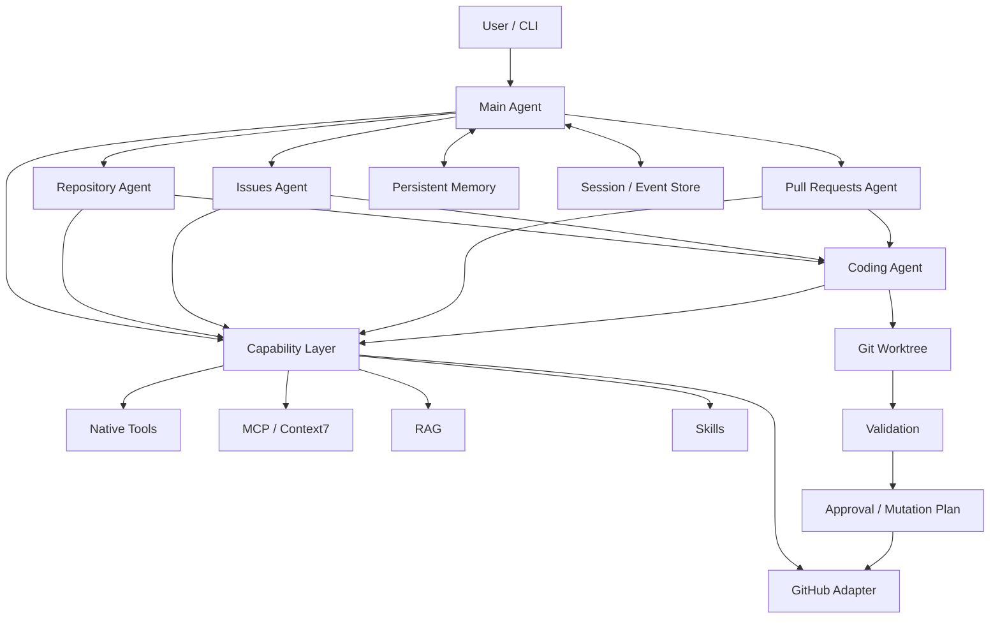

# GitAgent

> 安全、可审计的个人 GitHub 仓库维护助手。

GitAgent 是一个面向 GitHub 仓库维护场景的多 Agent CLI。它以一个持续的 Session 作为对话上下文，由 Main Agent 根据任务类型将工作路由到 Repository、Issues、Pull Requests 等领域 Agent；涉及代码修改时，再交由独立 Coding Agent 在隔离工作区中生成候选补丁、执行验证，并在运行时审批策略约束下完成后续写操作。

项目同时提供 GitHub 能力适配、MCP、RAG 知识库、Persistent Memory、Session/Event 持久化、调用审计与自动评测等基础设施。

## 特性

- **多 Agent 路由**：Main Agent 负责会话与任务分发，Repository / Issues / Pull Requests Agent 负责不同 GitHub 领域。
- **隔离式代码修改**：Coding Agent 在独立 Git worktree 中准备候选修改，不直接拥有 GitHub 写权限。
- **验证后再提交**：候选补丁必须经过实际验证，验证失败时拒绝进入默认分支变更流程。
- **显式权限模型**：Capability 默认 `deny`，能力按 READ / WRITE / DESTRUCTIVE 等访问级别管理。
- **运行时审批**：WRITE 与 DESTRUCTIVE 操作受审批和约束层控制，避免模型直接执行高风险变更。
- **GitHub 工作流支持**：可处理仓库探索、Issue、Pull Request、Review、CI、评论和仓库修改等任务。
- **RAG 知识库**：支持注册、同步和检索只读 Markdown 知识库。
- **Persistent Memory**：支持跨 Session 的持久记忆、索引与按需检索。
- **可观测性**：提供 trace、event log、session persistence 与 token / latency 等运行指标。
- **自动评测**：内置面向上下文、并发与恢复能力的评测数据集和 runner。

## 架构概览



### Agent 分工

| Agent | 主要职责 |
| --- | --- |
| `main` | 持有 Session 对话上下文，理解用户意图并调用领域 Agent |
| `repository` | 仓库探索、代码解释、搜索、历史分析、修改规划与仓库级变更 |
| `issues` | Issue 查询、分析、回复以及 Issue 范围内的修复任务 |
| `pull_requests` | PR 查询、Diff / Review、CI、讨论、修改和合并相关流程 |
| `coding` | 代码解释、Review、Plan、CI 分析以及隔离 worktree 中的候选补丁 |

## 项目结构

```text
GitAgent/
├── gitagent/
│   ├── agent_loop/          # Agent 调用循环与模型调用协议
│   ├── agents/              # Main / Repository / Issues / PR / Coding Agents
│   ├── application/         # CLI、配置、Bootstrap、Service、Terminal UI
│   ├── capability/          # Capability 注册、策略、Provider、RAG
│   ├── domain/              # 领域模型、错误、Review 模型
│   ├── harness/             # 执行协调、上下文、审批、验证、工作区
│   ├── infra/               # GitHub、MCP、持久化、可观测性
│   ├── memory/              # Persistent Memory
│   ├── model/               # Chat Client 与 Reasoner
│   └── prompts/             # System / Agent / Approval Prompts
├── skills/                  # 内置 Skill
├── eval/                    # 自动评测框架与数据集
├── docs/                    # 项目文档
├── Git-worktrees/           # 运行时仓库缓存与隔离 worktree
├── capabilities.yaml        # 能力目录与访问级别
├── config.json              # 本地运行配置（已被 .gitignore 忽略）
├── environment.yml          # Conda 环境
└── pyproject.toml           # Python 包配置
```

## 环境要求

- Python **3.11+**
- Git
- 可访问目标仓库的 GitHub Token
- OpenAI-compatible Chat Completions API

项目的 Conda 配置默认使用 Python 3.12；CI 使用 Python 3.11。

## 安装

### 使用 Conda

```bash
conda env create -f environment.yml
conda activate gitagent
```

`environment.yml` 会以 editable 模式安装项目及开发依赖。

### 使用 venv / pip

```bash
python -m venv .venv
source .venv/bin/activate
python -m pip install -U pip
python -m pip install -e ".[dev]"
```

只需要运行环境时也可以安装：

```bash
python -m pip install -e .
```

## 配置

GitAgent 默认从当前目录读取 `config.json`：

```bash
gitagent --config config.json
```

仓库中的 `config.json` 已通过 `.gitignore` 排除。**不要将真实 API Key 或 GitHub Token 提交到 Git。**

下面是一份可直接修改的配置示例：

```json
{
  "model": "your-model-name",
  "api_key": "[REDACTED_SECRET]",
  "base_url": "https://your-openai-compatible-endpoint/v1",
  "github_token": "[REDACTED_SECRET]",
  "github_api_url": "https://api.github.com",
  "temperature": 0.0,
  "max_output_tokens": 65536,
  "llm_timeout": 300.0,
  "github_timeout": 30.0,
  "state_path": "../database/state.db",
  "event_path": "../database/sessions",
  "memory_path": "../database/memory",
  "event_retention_days": 30,
  "context_window_tokens": {
    "default": 262144,
    "main": 262144,
    "repository": 262144,
    "coding": 262144,
    "issues": 262144,
    "pull_requests": 262144
  },
  "execution": {
    "max_calls_per_turn": 8,
    "capability_max_concurrency": 6,
    "provider_concurrency": {
      "native": 6,
      "mcp": 6,
      "rag": 3,
      "skill": 2
    },
    "domain_agent_max_concurrency": 4,
    "max_agent_depth": 2,
    "default_agent_max_steps": 200,
    "agent_max_steps_overrides": {
      "coding": 8
    },
    "max_structured_retries": 1,
    "max_provider_retries": 1
  },
  "memory_automation": true,
  "context7_api_key": ""
}
```

### 关键配置说明

| 字段 | 说明 |
| --- | --- |
| `model` | OpenAI-compatible API 使用的模型名称 |
| `api_key` | LLM API Key |
| `base_url` | API Base URL；使用兼容服务时填写对应地址 |
| `github_token` | GitHub Token，需要拥有目标仓库及所需操作的权限 |
| `github_api_url` | GitHub REST API 地址，默认 `https://api.github.com` |
| `state_path` | Session 状态数据库路径 |
| `event_path` | Session / Event 持久化目录 |
| `memory_path` | Persistent Memory 存储目录 |
| `context_window_tokens` | 各 Agent 的上下文预算 |
| `execution` | 并发、Agent 深度、最大步骤数与重试策略 |
| `memory_automation` | 是否自动运行 Memory 提取/维护逻辑 |
| `context7_api_key` | Context7 MCP Key；不使用时可留空 |

相对路径会以 `config.json` 所在目录为基准解析。

## 快速开始

安装并准备好 `config.json` 后，在项目根目录运行：

```bash
gitagent
```

也可以：

```bash
python -m gitagent
```

启动时 GitAgent 会：

1. 验证 GitHub Token；
2. 获取当前账号可访问的仓库；
3. 允许恢复已有 Session，或选择仓库创建新 Session；
4. 进入交互式 REPL。

进入会话后可以直接用自然语言描述任务，例如：

```text
解释一下这个仓库的认证流程。
```

```text
看看 #42 这个 issue 的问题是什么，给出修复方案。
```

```text
Review PR #18，重点检查并发安全和异常处理。
```

```text
修改 README 里的安装说明，并验证修改没有破坏测试。
```

交互界面还提供 `/help`、`/context`、`/latency`、`/trace` 等命令；输入 `quit` / `exit` 退出。

## Capability 与安全模型

`capabilities.yaml` 使用 **default deny**：

```yaml
defaults:
  discover: deny
  invoke: deny
```

能力只有在被显式注册、启用并满足策略时才可发现或调用。

当前能力大致分为：

- `native.*`：工作区文件读取、搜索、写入、编辑、删除和受策略约束的命令执行；
- `repository.*`：仓库树、文件、符号、引用、Diff、历史等只读能力；
- `github.*`：Issue / PR / CI 查询，以及评论、Issue 更新、分支等 GitHub 写操作；
- `rag.*`：知识库检索；
- `skill.*`：按任务加载内置 Skill；
- MCP：当前配置包含 GitHub 本地适配器与 Context7。

### 修改代码时发生什么

仓库级修改不会让 Main Agent 直接写默认分支。典型流程是：

```text
User request
  → Main Agent
  → Repository / Issue / PR Agent
  → Coding Agent
  → isolated Git worktree
  → candidate patch
  → validation
  → runtime approval / mutation plan
  → GitHub write
```

Coding Agent 本身没有 GitHub mutation capability。候选补丁只有在当前 revision 已执行真实验证并通过后，才能进入后续仓库变更流程。

这套设计的目标是把“模型建议修改”和“真正修改远端仓库”拆成两个阶段，使写操作具备明确的证据、验证和审批边界。

## RAG 知识库

GitAgent 内置只读 Markdown 知识库管理器。知识库源目录约定为：

```text
database/knowledge_base/<kb-id>/
```

> **迁移提示**：当前 `RAGSettings` 中的知识库、Qdrant、embedding 与 reranker 默认路径绑定到本地 `AGENT` 工作区布局。将项目复制到其他机器或目录前，需要同步调整这些默认路径，后续更适合把它们收敛到运行时配置中。

### 注册知识库

```bash
gitagent rag register engineering \
  --description "项目工程规范与架构文档"
```

### 同步索引

```bash
gitagent rag sync engineering
```

### 查看知识库

```bash
gitagent rag list
gitagent rag status engineering
```

### 删除注册与派生索引

```bash
gitagent rag remove engineering
```

删除操作只移除注册信息和派生索引，不删除原始知识库目录。

## Memory 与 Session

GitAgent 将一次持续对话视为一个 Session。Session 与 GitHub 账号、仓库关联，启动时可以恢复之前的上下文。

持久化相关配置：

```text
state_path   → Session 状态数据库
event_path   → Event / Session 事件记录
memory_path  → Persistent Memory
```

Memory 层会维护索引和可选的详细页面，并在后续会话中按需检索相关内容，而不是把全部历史永久塞入模型上下文。

## 开发与测试

安装开发依赖：

```bash
python -m pip install -e ".[dev]"
```

运行测试：

```bash
pytest -q
```

GitHub Actions 在 Pull Request 上使用 Python 3.11 执行同一套测试。

## 自动评测

评测入口：

```bash
python eval/run_eval.py \
  --output eval/runs/example
```

默认数据集：

```text
eval/gitagent-evaluation-dataset.json
```

可以按指标组执行：

```bash
python eval/run_eval.py --group M2 --output eval/runs/m2
python eval/run_eval.py --group M3 --output eval/runs/m3
python eval/run_eval.py --group M6 --output eval/runs/m6
python eval/run_eval.py --group SMOKE --output eval/runs/smoke
```

也可以只跑单个样本：

```bash
python eval/run_eval.py \
  --sample "task_name:id" \
  --output eval/runs/sample
```

中断后继续已有评测目录：

```bash
python eval/run_eval.py \
  --resume \
  --output eval/runs/example
```

如果需要把 deterministic 结果与外部 Judge JSONL 合并：

```bash
python eval/run_eval.py finalize \
  --run-dir eval/runs/example \
  --judge-results path/to/judge-results.jsonl
```

## 内置 Skills

当前仓库包含：

- `skills/code-review`：面向代码变更的深度 Review；
- `skills/debug`：面向运行时故障的因果定位、修复与验证。

Skill 通过 Capability 层按任务选择和加载，不默认把所有 Skill 内容注入每一次上下文。

## 设计原则

GitAgent 的实现围绕几个约束展开：

1. **Default deny**：能力不是默认开放，而是显式授权。
2. **Evidence before action**：先读取仓库事实，再做修改或结论。
3. **Separate reasoning from mutation**：分析、候选补丁和远端写操作分层处理。
4. **Verify before proposal**：代码修改必须先验证，再进入正式变更流程。
5. **Session-scoped context**：持续任务保留会话上下文，同时通过 Memory 控制长期信息体积。
6. **Auditable execution**：Capability 调用、Event、Trace 和验证结果可被记录和回溯。
