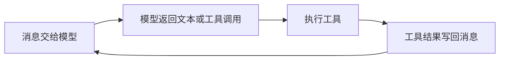
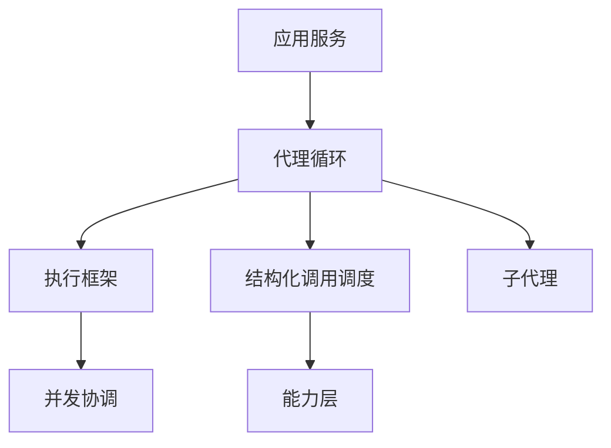
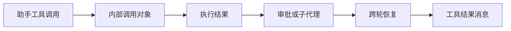
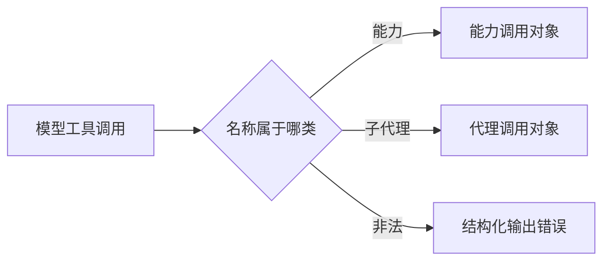
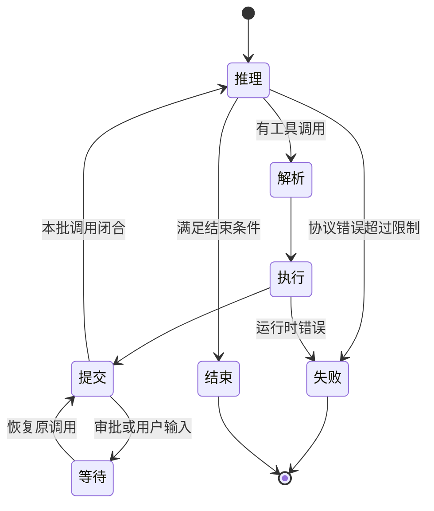
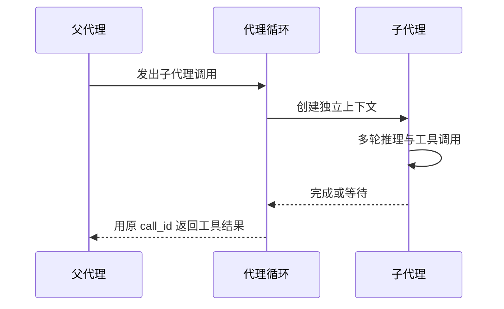
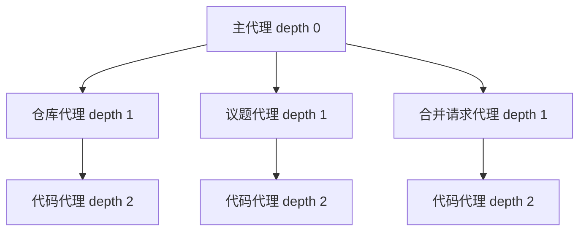
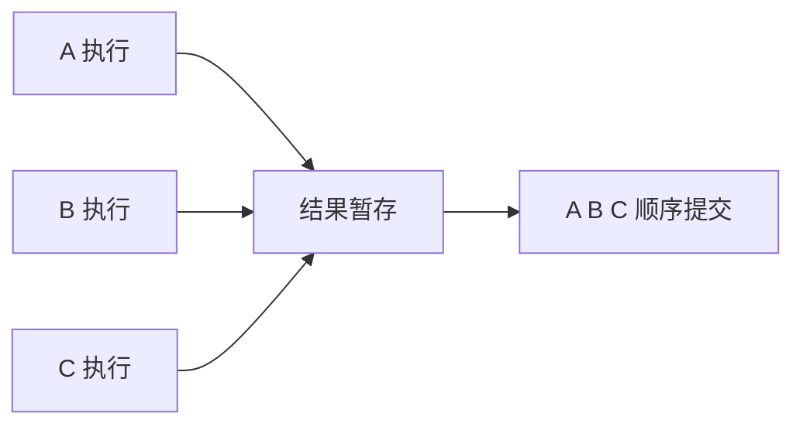
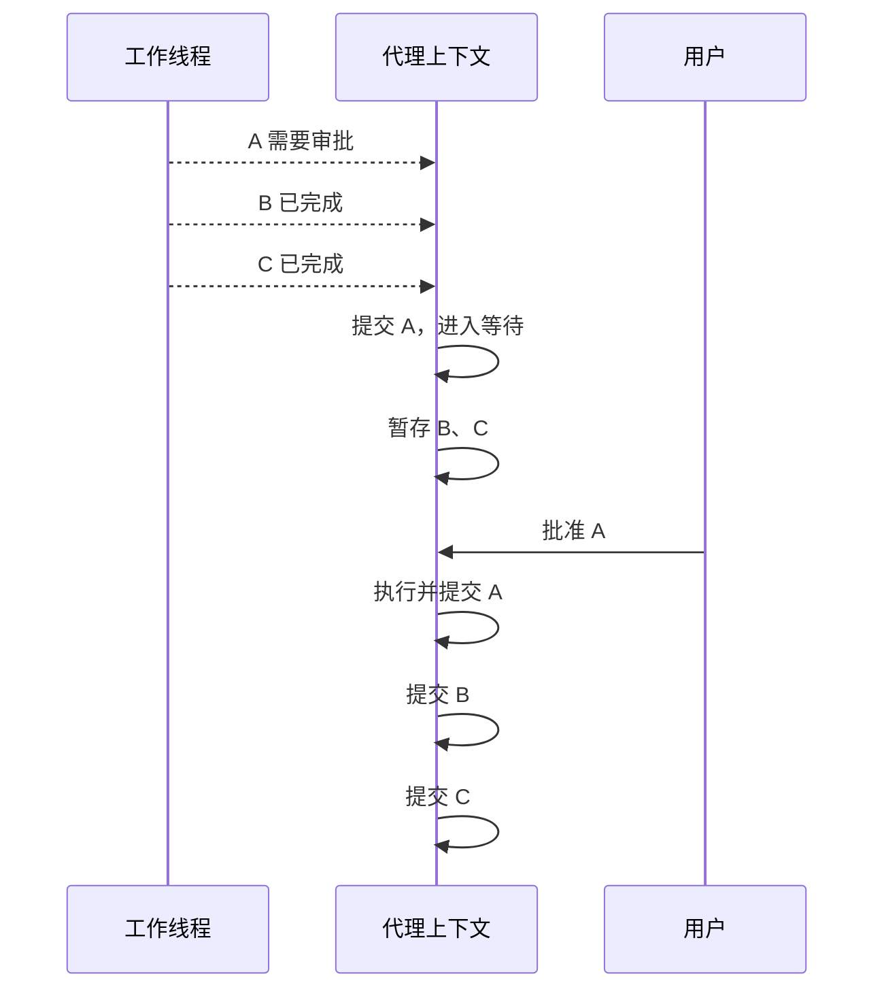
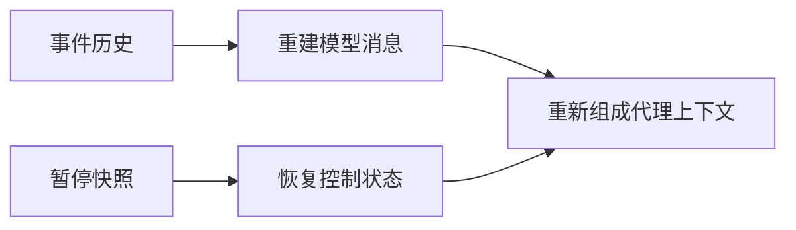

# 01 代理循环与整体架构：把一次模型响应变成可恢复运行

## 本章先回答什么

GitAgent 最容易被误解成“一个模型加很多工具”。真正困难的地方不是让模型会调工具，而是让一次模型响应进入系统后，仍然满足调用关联、权限、并发、审批、子代理和进程恢复这些工程约束。

所以这一章不从某个类开始，而从一个问题开始：**为什么普通的模型—工具循环不够用？GitAgent 又是怎样一步步把它扩展成一套代理运行时的？**

### 本章的 STAR 主线

| 阶段 | 本章要解决的问题 |
|---|---|
| 情境 S | 一个模型响应可能包含多个调用、子代理、审批和等待，普通循环无法保证恢复和副作用顺序 |
| 任务 T | 建立一套统一代理运行协议，让每次调用都有身份、每个等待都有状态、每次恢复都回到原执行点 |
| 行动 A | 模型响应 → 调用解析 → 执行分组 → 结果提交 → 子代理交接 → 等待持久化 → 原调用恢复 |
| 结果 R | 模型只承担决策，执行框架掌握状态推进；代理运行可以并发、暂停、失败和跨进程恢复 |

---

## 1. 情境：最小代理循环为什么很快失效

最简单的代理可以写成下面这条循环：



只有一个工具、没有写操作、没有中断时，这个模型足够。

GitAgent 的运行环境多了几层现实约束。

| 现实情况 | 简单循环的问题 |
|---|---|
| 一次响应有多个工具调用 | 串行太慢，全部并发又可能打乱顺序 |
| 调用会写 GitHub | 不能模型一提议就执行 |
| 调用的是另一个代理 | 子代理有自己的消息、步数和工具 |
| 子代理也会等待用户 | 父代理必须知道真正等待点在哪里 |
| 前一个调用等审批，后一个已经执行完 | 结果不能越过审批边界写回消息 |
| 进程在等待期间退出 | 下一轮不能重新让模型猜“之前做到哪” |
| 模型输出了错误工具名或重复调用编号 | 工具协议不能留下半开状态 |

因此，GitAgent 需要把“模型调用工具”改造成“模型提出一个运行时事件”。

事件有身份、有状态、有父子关系，也有明确的开始、等待、恢复和结束。

---

## 2. 任务：哪些职责必须从模型手里拿回来

GitAgent 把控制权拆成几层。



| 层 | 负责什么 | 不负责什么 |
|---|---|---|
| 应用服务 | 会话、用户轮次、暂停快照、跨轮恢复 | 不决定单个工具怎样执行 |
| 代理循环 | 推进代理状态、解析模型响应、创建子代理、处理等待 | 不实现 GitHub 或文件工具 |
| 执行框架 | 工具发现、调用转换、调度配置、取消、追踪、审计 | 不解释业务意图 |
| 结构化调用调度 | 能力预检查、审批、受保护写操作、结果提交 | 不做模型推理 |
| 能力层 | 注册、权限、提供方执行、错误归一和读取恢复 | 不决定用户业务流程 |
| 领域代理 | 收集领域证据，形成业务产物和写计划 | 不拥有底层执行控制权 |

这套分层围绕一条原则：**模型可以提出动作，但不能把自己的文本当成系统状态。**

---

## 3. 为什么一次代理运行必须有独立上下文

一个代理运行不只有消息。它还要保存恢复所需的控制状态。

可以把 `AgentContext` 理解成一次代理调用的“运行记录夹”。

| 状态类别 | 典型内容 | 解决什么问题 |
|---|---|---|
| 身份 | `run_id`、会话、代理名、仓库 | 区分同一会话中的多次代理调用 |
| 父子关联 | 父运行编号、父 `call_id` | 知道子代理由哪次父调用创建 |
| 模型状态 | 消息、步数、最终文本 | 继续模型推理 |
| 等待状态 | 待审批、待用户输入 | 跨用户轮次暂停 |
| 并发状态 | 活跃子代理、未提交结果 | 恢复开放调用批次 |
| 业务产物 | 候选补丁、验证报告、审阅结果 | 后续确定性检查 |
| 读取状态 | 缓存、文件已读区间 | 避免重复读取 |

如果这些内容只存在于模型文本中，恢复时只能重新问模型：“你刚才做到哪里了？”

GitAgent 选择保存结构化状态，让恢复成为状态机继续运行，而不是新一轮猜测。

---

## 4. `call_id` 为什么是整套运行时的主线

代理循环里最关键的字段之一不是代理名称，而是 `call_id`。

一项模型工具调用会经历多个阶段：



所有阶段使用同一个 `call_id`。

因此系统可以确定：

- 这条工具结果属于哪次模型调用；
- 这个子代理是谁创建的；
- 这份审批计划批准哪次调用；
- 哪个调用已经执行但还没有提交结果；
- 进程恢复后哪一项工作仍处于未闭合状态。

### 为什么不能只靠调用顺序

因为并发后，物理完成顺序会变化；子代理还会跨多个模型步骤；审批会跨用户轮次。只有稳定身份能够把这些阶段重新连起来。

所以 GitAgent 对调用编号做严格校验：不能为空、同一响应不能重复、历史中不能重用、工具结果必须指向未闭合调用。

---

## 5. 模型响应进入系统后，第一步不是执行

模型返回工具调用后，执行框架先把模型提供方格式转换成 GitAgent 自己的调用对象。

模型工具有两个命名空间：能力调用和子代理调用。



这一步做三件事：

1. 检查调用编号；
2. 判断调用类别；
3. 校验子代理参数结构。

能力参数的详细结构校验会在能力层继续执行。

这样，后面的并发调度器不需要理解 OpenAI、其他模型服务或具体工具格式。它只处理 GitAgent 自己的调用对象。

---

## 6. 一次代理循环到底怎样推进

代理循环可以看成六个连续阶段：推理、解析、执行、提交、等待、结束。



### 推理阶段

当前消息和当前允许工具交给模型。每进入一次推理，步数增加。

步数上限属于执行配置。模型不能通过不断调用工具让代理无限运行。

### 解析阶段

模型的结构化调用转换成能力调用或子代理调用。非法工具名、重复 `call_id`、参数结构错误在这里进入协议错误处理。

### 执行阶段

调用交给执行协调器。兼容调用可以并发运行。

### 提交阶段

执行结果按模型原调用顺序进入代理上下文。工具结果、缓存、失败保护、审计和等待状态都在这里成为权威状态。

### 等待阶段

审批或用户输入没有到达时，本次代理不再继续推理。应用服务可以把这棵代理树保存下来。

### 结束阶段

普通任务可以用模型最终文本结束。代码补丁模式有额外运行时结束条件，不能只靠模型文本宣布完成。

---

## 7. 为什么子代理既是“工具”，又是“完整代理”

主代理看领域代理时，把它当成一个工具调用。

运行时看领域代理时，它却拥有自己的消息、步数、工具、业务产物和等待状态。



父代理创建子代理时，会写入：

- 新的 `run_id`；
- 父运行编号；
- 父工具调用编号；
- 当前会话和仓库；
- 子代理任务和实体信息。

### 为什么不让父子共享同一个消息线程

领域代理和代码代理会产生大量内部读取和验证结果。如果这些内容全部进入主代理消息，主上下文会迅速膨胀，权限边界也会变模糊。

所以子代理内部过程留在自己的线程。父代理只接收终止结果和结构化业务产物。

---

## 8. 子代理完成后，哪些东西要交回父代理

子代理结束时有两类交接。

第一类是模型协议交接：父线程得到一条与原 `call_id` 对应的工具结果。

第二类是业务状态交接：领域代理从代码代理取回候选补丁、验证报告、解释、审阅或修改方案等结构化产物。

| 子代理结果 | 父代理后续怎样使用 |
|---|---|
| 代码解释 | 形成仓库或合并请求解释结果 |
| 修改方案 | 返回给用户或继续规划 |
| 代码审阅 | 和远端审阅、持续集成状态一起判断合并准备度 |
| 候选补丁 | 构造远端变更计划 |
| 验证报告 | 判断候选是否允许进入写计划 |

父代理不从子代理终止文本里解析这些状态。

这就是结构化产物的意义：**文本用于表达，产物用于控制。**

---

## 9. 为什么代理树使用固定层级

GitAgent 的代理关系不是自由网状调用。



固定层级带来三项结果。

| 结果 | 原因 |
|---|---|
| 不会无限递归委派 | 子代理深度必须等于父深度加一，还有最大深度限制 |
| 权限容易按职责划分 | 主代理不需要远端写权限，代码代理不需要 GitHub 写权限 |
| 恢复状态容易校验 | 持久化代理树只能恢复成预定义拓扑 |

代理拆分不是为了让系统“看起来像多智能体”，而是为了让职责和权限有确定边界。

---

## 10. 一批调用为什么不能“谁先完成谁先写回”

假设模型同一轮发出 A、B、C 三个调用。

物理执行可能是：

```text
B 完成 → C 完成 → A 完成
```

模型表达的逻辑顺序仍然是：

```text
A → B → C
```

GitAgent 把“执行结束”和“结果提交”分开。



有序提交不仅维护消息顺序，还维护：

- 失败调用保护；
- 读取缓存；
- 文件阅读范围；
- 审计顺序；
- 工作树版本；
- 审批等待。

并发只优化“工作什么时候做”，不改变“状态什么时候生效”。

---

## 11. 最难的情况：前一个调用等待，后一个已经完成

假设 A、B、C 同组执行。

- A 是需要审批的写操作；
- B 和 C 是读取，已经执行完成。

A 在提交阶段进入等待。B 和 C 此时不能写入父消息，因为它们会越过 A。

GitAgent 把 B 和 C 的结果保存为“已执行但未提交结果”。



这一步解释了为什么代理上下文需要保存“未提交结果”。

如果没有这份状态，恢复时只能选择丢掉 B、C，或者重复执行它们。两种做法都不正确。

---

## 12. 等待状态究竟在哪里

GitAgent 有两类直接等待：

| 等待类型 | 例子 | 恢复时要做什么 |
|---|---|---|
| 审批等待 | 是否提交代码、发布评论、合并请求 | 用用户决策继续原写计划 |
| 用户输入等待 | 代理需要用户补充信息 | 把回复写回原等待调用 |

子代理也可能进入这两种状态。

因此父代理是否“等待”，不能只检查自己。运行时会沿活跃子代理向下寻找真正等待节点。

应用服务下一轮收到用户输入时，不重新调用主代理做一次新路由，而是加载原代理树，找到原等待节点，再恢复对应调用。

这保证下一轮仍在完成上一次未闭合事件。

---

## 13. 为什么等待必须能够持久化

审批和用户输入都可能持续几十秒、几分钟甚至更久。进程不能被假设一直存活。

当代理树处于合法等待状态时，应用服务保存控制快照。

快照包含：

- 代理身份和父子关系；
- 当前步数；
- 待审批计划；
- 待用户输入；
- 活跃子代理；
- 未提交调用结果；
- 结构化业务产物；
- 读取状态。

模型消息不放在这份快照里。消息由追加式事件历史保存。

恢复时，两者重新组合：



这让“发生过什么”和“当前停在哪里”使用不同权威来源。

---

## 14. 恢复为什么不是反序列化后直接继续

暂停快照会参与远端写操作恢复，所以系统不能无条件信任它。

恢复时要重新检查：

| 检查 | 防止什么 |
|---|---|
| 根节点必须是主代理 | 伪造任意代理作为会话入口 |
| 父子代理符合固定拓扑 | 伪造越权子代理 |
| 仓库一致 | 把一个仓库的等待状态接到另一个仓库 |
| 子代理父 `call_id` 与消息未闭合调用一致 | 伪造父子关系 |
| 待用户输入与原等待调用一致 | 把普通回复注入错误调用 |
| 未提交结果与原能力和参数一致 | 用快照替换执行结果身份 |
| 写计划与当前候选产物重新计算结果一致 | 修改待审批参数 |

恢复路径和首次执行路径使用同一安全标准。

---

## 15. 模型输出错误时，为什么也要闭合工具协议

模型可能返回错误工具名、重复调用编号或非法参数。

这些错误没有真实外部副作用，系统可以给模型有限纠错机会。

但纠错前，当前助手消息里已经出现的工具调用必须得到结果，否则消息历史会留下未闭合协议。

因此错误处理不是简单追加一句“你格式错了”。运行时会为相关调用生成失败结果，再让模型重新推理。

超过结构化纠错上限后，代理运行失败。

---

## 16. 失败和取消为什么要清理一整棵状态树

代理失败时，设置一个错误字符串远远不够。

运行时还要处理：

- 关闭未完成工具调用；
- 清除审批和用户输入等待；
- 取消活跃子代理；
- 清除未提交结果；
- 清理代码工作树；
- 写入失败追踪；
- 标记代理结束。

原因是恢复逻辑会把“未闭合调用”理解成仍有工作。如果失败后留下半开状态，下一次恢复会误以为任务还能够继续。

所以失败路径本身也是一次状态收束。

---

## 17. 代码补丁为什么有特殊结束条件

普通解释任务中，模型没有再调用工具并给出最终回答，可以视为结束。

代码补丁不同。

如果模型只说“已经修改并通过测试”，运行时没有证据证明：

- 工作树真的变化；
- 当前版本真的被验证；
- 验证后没有继续修改；
- 候选补丁来自真实文件状态。

所以补丁模式要求模型调用专用结束动作。运行时检查工作树、版本和验证记录，通过后才形成候选补丁。

这是代理循环中的一个重要思想：**不同任务可以拥有不同硬终止条件。**

---

## 18. 用一次仓库修改把整章串起来

用户要求修改默认分支中的一个缺陷。

### 第一步：主代理路由

主代理判断任务属于仓库领域，发出仓库代理调用。代理循环创建独立仓库代理上下文。

### 第二步：仓库代理收集证据

仓库代理使用读取能力观察代码，并决定需要代码代理生成补丁。

### 第三步：创建代码代理

代码代理得到结构化代码任务，在精确提交上创建隔离工作树，读取、修改并运行验证。

### 第四步：代码代理结束

运行时检查当前工作树版本和验证记录，生成候选补丁和验证报告。子代理结束，结构化产物回到仓库代理。

### 第五步：仓库代理形成写计划

验证通过后，仓库代理构造默认分支提交计划。该能力需要审批，所以当前工具调用进入等待。

### 第六步：应用服务保存暂停状态

当前代理树、审批计划和未闭合 `call_id` 被持久化。消息仍由事件历史保存。

### 第七步：用户批准

下一轮用户输入被识别为批准。应用服务恢复原代理树，找到原等待调用，执行原计划。

### 第八步：原批次闭合

写操作结果用原 `call_id` 写回消息。代理循环继续仓库代理，再把结果交回主代理。

这条链里没有任何一步需要模型“回忆之前做到哪”。状态推进由运行时完成。

---

## 19. 结果：代理循环最终建立了哪些不变量

| 不变量 | 带来的结果 |
|---|---|
| 每个调用有稳定 `call_id` | 执行、审批、子代理、恢复和结果可以关联 |
| 子代理有独立 `run_id` 和上下文 | 多代理运行不会混成一条消息线程 |
| 物理执行与逻辑提交分离 | 可以并发，又不改变模型协议顺序 |
| 等待是结构化状态 | 审批和用户输入可以跨用户轮次 |
| 消息与控制快照分离 | 恢复不会产生两份消息真相 |
| 恢复重新校验运行时关系 | 持久化状态不能绕过安全边界 |
| 特殊任务拥有硬结束门槛 | 模型不能用文本替代运行时证据 |

代价是系统比普通 `while` 循环复杂很多，需要维护调用身份、代理树、未提交结果和暂停快照。

GitAgent 接受这部分复杂度，因为它换来的是：**模型服务可以失败，用户可以迟到，调用可以并发，进程可以重启，但系统仍知道当前哪一项工作是合法的下一步。**

---

## 20. 复习时怎样讲这一章

可以按这条顺序复述：

1. 普通代理循环只适合单调用、无审批、无恢复的简单场景；
2. GitAgent 把每次模型调用变成带 `call_id` 的运行时事件；
3. `AgentContext` 保存消息之外的等待、子代理、业务产物和未提交结果；
4. 子代理对父模型是工具，对运行时是完整代理；
5. 多调用可以并发执行，但必须按模型顺序提交；
6. 前置调用进入等待时，后续已完成结果暂存；
7. 等待状态持久化后，下一轮恢复原调用，而不是重新让模型规划；
8. 恢复时重新校验代理树和写计划，失败时闭合所有半开状态。

## 21. 代码定位

| 想核对的问题 | 代码位置 |
|---|---|
| 代理循环怎样推进、恢复和结束 | `gitagent/agent_loop/loop.py` |
| 模型响应、能力调用、代理调用对象 | `gitagent/agent_loop/models.py` |
| 一次代理运行保存哪些状态 | `gitagent/harness/context/state.py` |
| 调用怎样获得执行特征并进入并发协调 | `gitagent/harness/execution.py` |
| 能力调用怎样预检查、审批和提交 | `gitagent/harness/structured_call_dispatcher.py` |
| 应用服务怎样保存和恢复等待中的代理树 | `gitagent/application/service.py` |
| 主代理怎样创建领域子代理 | `gitagent/agents/main.py` |
| 代码补丁的特殊结束条件 | `gitagent/agents/coding.py` |
