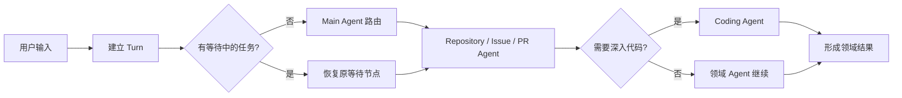
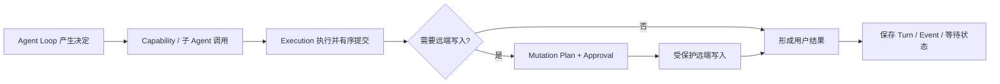
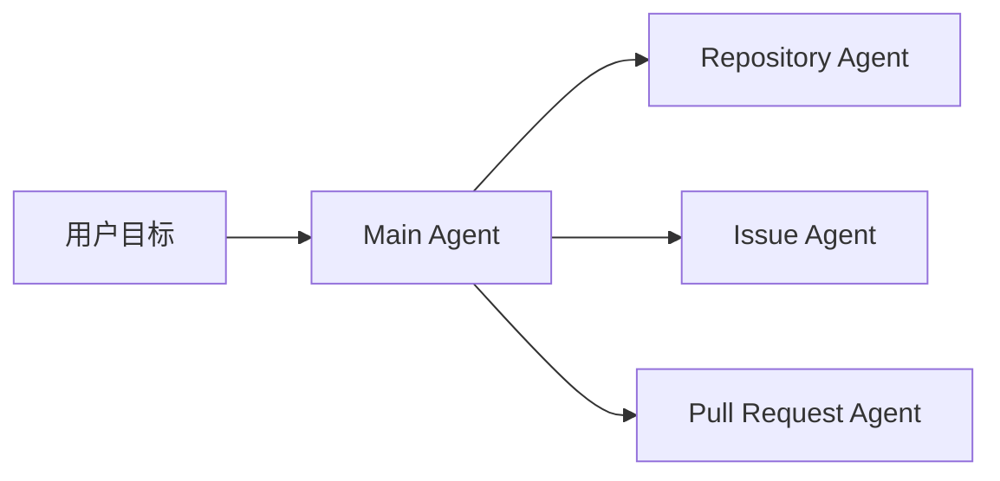
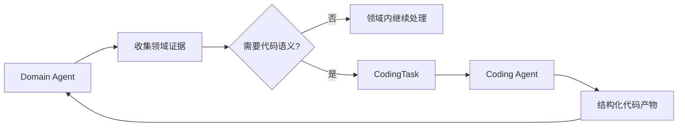
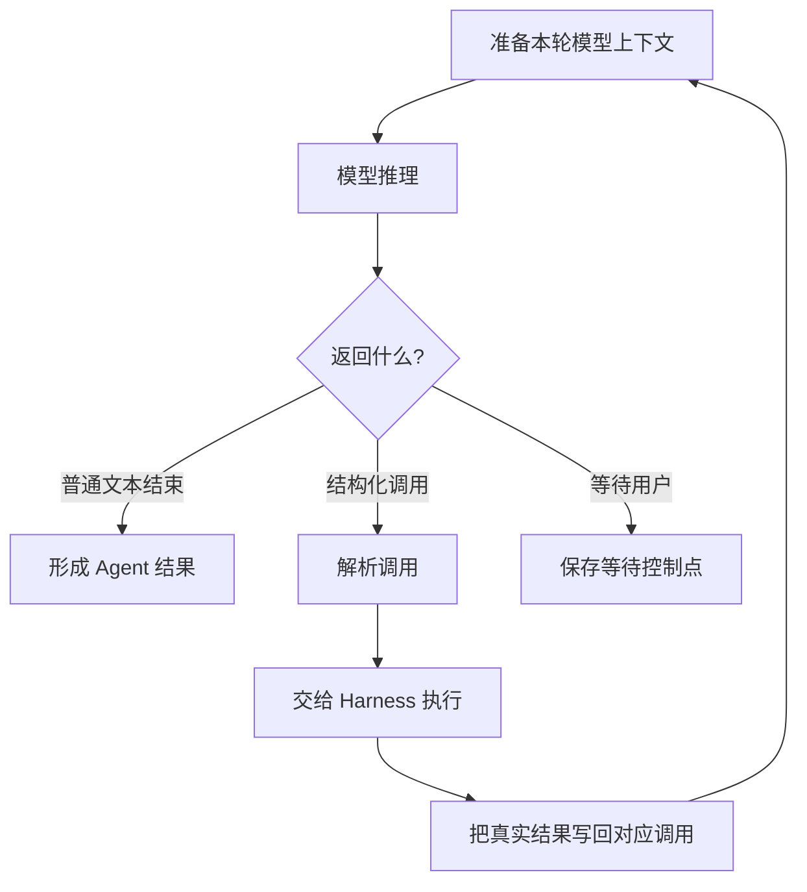
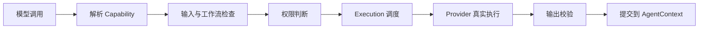
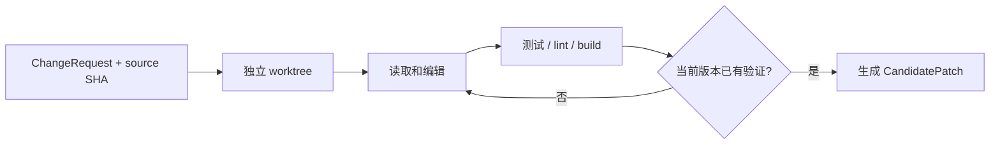

# 01 总览：一个请求怎样走完整条 GitAgent Pipeline

这一章只负责建立总地图。后面的章节会分别展开 Agent、模型协议、Capability、执行、Coding Workspace、Approval、恢复、上下文、Memory 和 RAG；这里先看它们怎样接成一条完整链路，以及每一层把什么交给下一层。

理解总览时最重要的一点是：GitAgent 不是让模型直接操作 GitHub 或文件系统。模型主要负责理解任务和提出下一步；真正的工具发现、权限、执行顺序、副作用控制、状态保存都由 Harness 负责。

---

## 1. 一次任务可以先分成两段

前半段负责理解任务、收集证据并形成领域结果：

后半段负责把 Agent 的决定安全地落到真实环境，并保存可以继续运行的状态：

整条链可以拆成八个阶段：

| 阶段 | 接到什么 | 产出什么 |
|---|---|---|
| 应用入口 | 用户输入、当前 Session | 新的 Turn，以及“启动新任务还是恢复旧任务”的决定 |
| Main Agent | 会话目标、当前仓库 | 要进入哪个业务领域 |
| Domain Agent | Repository / Issue / PR 任务 | 领域证据、业务判断，必要时产生 CodingTask |
| Coding Agent | 代码任务和已有证据 | 解释、Review、方案，或经过验证的 CandidatePatch |
| Agent Loop | 当前 Agent 的消息、状态和工具 | 一轮轮模型决定与结构化调用 |
| Capability / Execution | 结构化调用 | 校验、授权、真实执行，以及按逻辑顺序提交的结果 |
| Approval / Mutation | 精确的远端写计划 | 用户决定，以及获批后真正发生的远端副作用 |
| Persistence | 本轮消息、结果、暂停状态 | 可查询的终态、可重放历史和可恢复控制点 |

这八段不是八个孤立程序，而是一条连续的数据交接链。越往下，信息越具体：自然语言目标会逐步变成领域任务、结构化调用、代码候选、远端动作计划和最终状态。

---

## 2. 应用入口：先把一次输入变成明确的 Turn

用户输入到达应用后，GitAgent 先确定当前账户、仓库和 Session，然后为这次输入建立新的 Turn。

可以把 Session 和 Turn 分开理解：Session 是一段持续多轮的工作会话；Turn 是其中一次用户输入对应的业务处理单元。用户先问“这个模块怎么工作”，下一轮再说“那帮我修一下”，通常仍属于同一个 Session，但会产生两个 Turn。

建立 Turn 之前，应用会先看当前 Session 有没有保存一棵等待中的 Agent 控制树。如果没有，就从 Main Agent 开始新的任务；如果上一轮停在 Approval 或普通用户输入等待点，这一轮会先恢复原来的运行树，并把新输入交给真正等待的那个 Agent。

所以“用户又发了一条消息”和“系统重新开始一个任务”是两件事。正常等待会跨 Turn 延续，但不会要求上一个 Turn 一直保持运行中。

---

## 3. Main Agent：只负责确定业务领域

Main Agent 位于会话最外层，先判断用户目标属于 Repository、Issue 还是 Pull Request。

例如，“解释仓库缓存设计”通常进入 Repository；“给 #123 回复评论”进入 Issue；“Review PR #45”进入 Pull Request。

Main Agent 不需要自己读取全部 PR Review、分析大段代码或运行测试。它主要负责理解会话级目标和选择正确领域。领域 Agent 完成后，结果再回到 Main，由 Main 负责对用户收束。

这样设计的原因不是为了增加 Agent 数量，而是把不同业务状态、工具和上下文分开。Repository、Issue、PR 三种任务需要维护的事实和允许的动作不同，让一个通用 Agent 同时承担全部职责，会让上下文和权限越来越难控制。

---

## 4. Domain Agent 与 Coding Agent：业务实体和代码语义分开处理

Repository、Issue、Pull Request Agent 负责具体业务实体。例如 PR Agent 会关心 PR 是否 open、当前 head SHA、changed files、Review 和 CI 状态；Issue Agent 会关心 Issue 内容、评论和修复流程。

如果任务只需要处理业务字段，领域 Agent 可以直接完成。如果需要深入代码理解、Review 或修改，就把结构化 CodingTask 交给 Coding Agent。

Coding Agent 可以解释代码、分析 CI、Review 实现，也可以在 patch 模式下真正修改文件并生成 CandidatePatch。它的权限边界仍然停在代码候选层：生成一个正确补丁，不等于获得向 GitHub 发布这份补丁的权力。候选应该提交默认分支、修复分支还是 PR head branch，仍由上层领域流程决定。

这个拆分把“代码是否正确”和“业务上应该怎样发布”变成两个不同问题，后面的 Verification 和 Approval 都建立在这个边界上。

---

## 5. Agent Loop：让模型决定下一步，但不让模型直接改变运行状态

Main、Domain、Coding 的职责不同，但每个 Agent 都需要重复同一类循环：准备当前上下文，调用模型，读取模型决定，执行结构化调用，再把真实结果写回去。

Agent Loop 负责调用身份、父子 Agent 关系、模型消息和等待状态。它并不负责实现 GitHub HTTP 请求，也不会自己判断一条 Bash 命令是否安全；这些工作继续下沉到 Capability、Permission 和 Execution。

因此模型返回 tool call 只表示“建议执行这个动作”。只有运行时完成解析、校验、授权和真实执行后，这个动作才会成为 Agent 下一轮可以依赖的事实。

---

## 6. Capability 与 Execution：把结构化调用变成受控的真实动作

模型提出结构化调用后，Harness 先把模型函数名还原成内部 Capability，再经过输入 schema、当前权限和执行语义检查，最后交给绑定的 Provider。

Capability 是统一动作契约。Native 文件工具、GitHub、本地或远端 MCP、Skill、RAG 虽然底层实现完全不同，但都会先变成统一 Capability，再由各自 Provider 负责适配具体实现。这样 Agent Loop 不需要认识文件系统 API、GitHub Client、HTTP MCP 会话或知识库索引的细节。

Execution 则负责另一类问题：如果模型一次提出多个调用，哪些可以同时运行、哪些资源冲突、失败后是否要截断后续调用，以及结果按什么顺序进入 AgentContext。

物理执行顺序和逻辑提交顺序被刻意分开。多个安全读取可以并发，但即使 B 比 A 更早完成，只要模型原本先提出 A，最终逻辑状态仍按 A、B 的顺序推进。这样并发主要优化等待时间，不会让网络和线程完成时机改变 Agent 历史。

Capability 的 Provider 适配在第 05 章详细讲；并发、资源声明和 ordered commit 在第 06 章详细讲。

---

## 7. Coding Workspace：代码修改先形成可验证候选

真正修改代码时，Coding Agent 不直接在目标仓库的日常工作目录上改，也不会直接生成远端 commit。领域流程先固定一个精确 source SHA，Coding Agent 再基于这个 SHA 创建独立 detached worktree。

这里有两层关键事实。第一，最终 changed files 和 patch 来自真实 Git 工作树快照，而不是模型自己声称“我改了这些文件”。第二，每次真实内容变化都会推进工作区 revision；验证记录绑定当时的 revision，后续又修改文件以后，旧测试不能继续证明新版本有效。

finish 时，Harness 从真实 worktree 重新计算变更，并整理 CandidatePatch 和 VerificationReport。到这一步得到的是“可以被上层检查的本地候选”，不是远端写权限。

这样设计是为了把代码构造和发布拆开：Coding Agent 负责证明候选是什么、验证到哪一步；Domain Agent 再结合业务场景决定候选应该怎样进入 GitHub。

---

## 8. Mutation Plan 与 Approval：候选和远端副作用之间还有一层授权

同一份 CandidatePatch 在不同业务场景里的发布方式不同。

| 业务场景 | 典型发布方式 |
|---|---|
| Repository 修改 | 向默认分支提交候选，并绑定预期 head SHA |
| Issue 修复 | 创建修复分支 → 提交候选 → 确认远端分支 → 创建 Draft PR |
| PR 内修复 | 向当前 PR head branch 提交候选，并绑定原 head SHA |

领域层把这些动作变成有顺序的 Mutation Plan。Approval 授权的不是一句宽泛的“允许修改”，而是计划中的具体 Capability、参数和顺序。

用户批准后，系统仍不会跳过运行时检查。每项调用会继续经过 Capability 权限和 Provider 自身的版本检查。代码类远端写通常携带 expected head SHA：如果审批等待期间远端分支已经变化，旧计划会被拒绝，而不是把基于旧版本生成的候选强行应用到模型没有看过的新版本上。

因此 Approval 解决的是“用户是否同意这份精确计划”，版本检查解决的是“这份计划依赖的外部事实现在是否仍然成立”。两者不能互相替代。

---

## 9. Persistence：保存当前状态，也保存发生过的事实

一次任务可能跨很多 Turn，也可能在等待用户时退出进程。因此 GitAgent 不只保存最终回答。

| 状态来源 | 主要回答的问题 |
|---|---|
| SQLite 状态 | Session、Turn 当前是什么状态，是否保存了等待中的 Agent 控制树 |
| Session Event Log | 按顺序发生过什么，模型消息和重要运行事件是什么 |
| `agent_context` 暂停状态 | 如果正在等待，Main → Domain → Coding 控制树具体停在哪里 |

恢复时，模型消息从 Event Log 重建，等待中的控制状态从 `agent_context` 重建；线程池、Future、HTTP 连接等进程对象则重新创建。恢复逻辑还会重新核对父子 call 身份和 pending mutation plan，不会因为某段 JSON 能解析就直接恢复写权限。

Trace 主要服务实时观察，其中适合长期保存的稳定事件会投影到 Event Log；Audit 当前更多是进程内的 Capability 责任记录。详细持久化和恢复协议放在第 09 章。

---

## 10. Context、Memory 与 RAG：分别解决三个不同的问题

任务运行久以后，模型可见内容会越来越多；跨 Session 又可能希望记住少量稳定信息；项目还可能有大量独立文档。这三类问题分别由 Context Governance、Memory 和 RAG 处理。

- **Context** 解决“这一轮模型到底要看到什么”。旧的大型工具结果可以压缩，历史可以按协议边界整理，但未闭合 tool call 等关键状态不能被压坏。
- **Memory** 解决“过去交互里哪些少量稳定知识值得跨 Session 保留”。它不是当前 GitHub 状态缓存。
- **RAG** 解决“已有文档库中哪些片段和当前问题相关”。检索结果是参考证据，不替代 Repository / GitHub 的实时读取。

它们最终都会影响模型当前上下文，但生命周期和权威性不同。涉及当前 branch、Issue、PR、CI 或文件内容时，实时 Capability 仍然是更高优先级的当前事实来源。

---

## 11. 为什么要把链路拆成这些阶段

前面先讲了系统怎么跑，现在再看为什么需要这些层。GitAgent 面对的不是普通聊天：模型决定可能影响本地文件和 GitHub 持久状态，任务还可能并发、等待审批、跨进程恢复。如果把推理、权限、执行、副作用和恢复全部塞进一个“大模型工具循环”，系统很难证明某个动作为什么有资格发生，也很难在失败以后判断应该从哪里继续。

因此这些模块实际上建立了几条不同的控制边界：Main / Domain / Coding 决定职责和上下文；Agent Loop 管理模型决定和调用身份；Capability 统一动作契约和 Provider 适配；Execution 管理共享资源与提交顺序；Coding Workspace 把代码修改变成经过真实验证的候选；Mutation Plan 与 Approval 控制远端副作用；Persistence 保存消息事实和暂停位置。

这种设计会增加状态对象和协议数量，但换来的好处是失败原因可以分层定位。系统能够明确区分：模型没有产生合法调用、Capability 当前不可用、权限不允许、资源冲突、当前代码版本没有重新验证、用户没有批准，或者审批期间远端版本已经变化。

后续章节里要一直记住四个边界：多 Agent 主要表示职责和上下文隔离，不等于多个模型互相讨论；Git worktree 是候选代码隔离，不是操作系统级 sandbox；Approval 只授权精确动作，不是给后续写操作永久开绿灯；聊天历史可以恢复模型线程，但恢复正在等待的 Agent 还需要独立的控制状态。

---

## 12. 代码定位

| 想核对的问题 | 主要位置 |
|---|---|
| 应用怎样启动、处理输入与切换 Session | `gitagent/application/bootstrap.py` |
| 服务怎样启动或恢复 Agent 树 | `gitagent/application/service.py` |
| Main / Repository / Issue / PR / Coding Agent | `gitagent/agents/` |
| Agent Loop | `gitagent/agent_loop/loop.py` |
| Capability 与权限 | `gitagent/capability/` |
| 执行、并发与 Harness | `gitagent/harness/execution.py` |
| Coding Workspace | `gitagent/harness/coding_workspace.py` |
| Approval 与 Mutation Plan | `gitagent/harness/constraints/approval.py`、`gitagent/harness/mutation_plans.py` |
| 会话、事件与恢复 | `gitagent/infra/persistence/` |

下一章只放大一件事：[Agent 为什么要拆成 Main、Domain、Coding 三层，以及它们之间到底传什么](02-agent-topology-and-workflows.md)。
