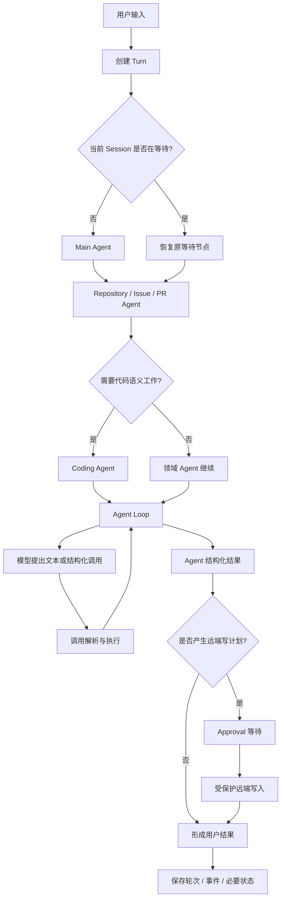
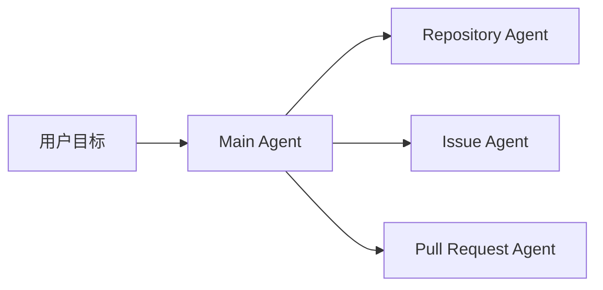
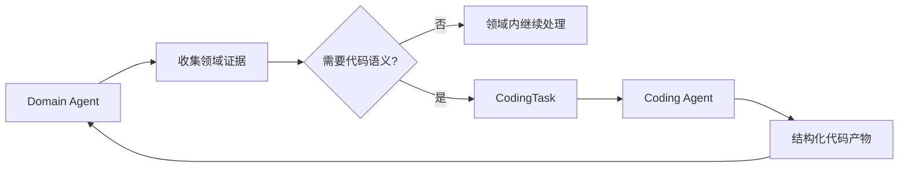
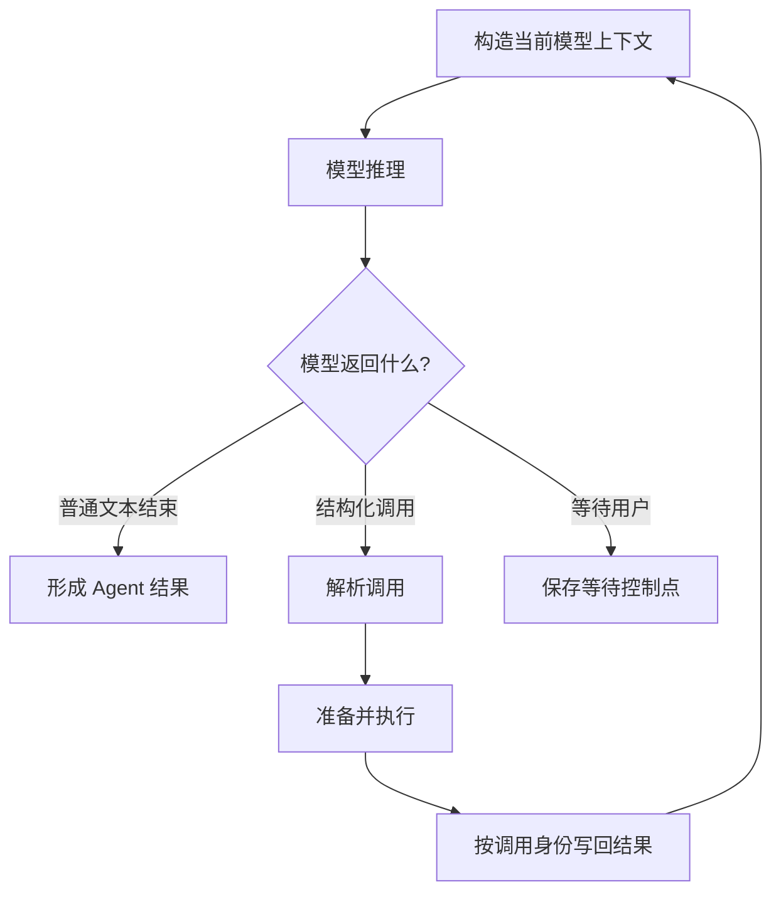
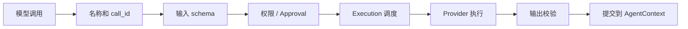
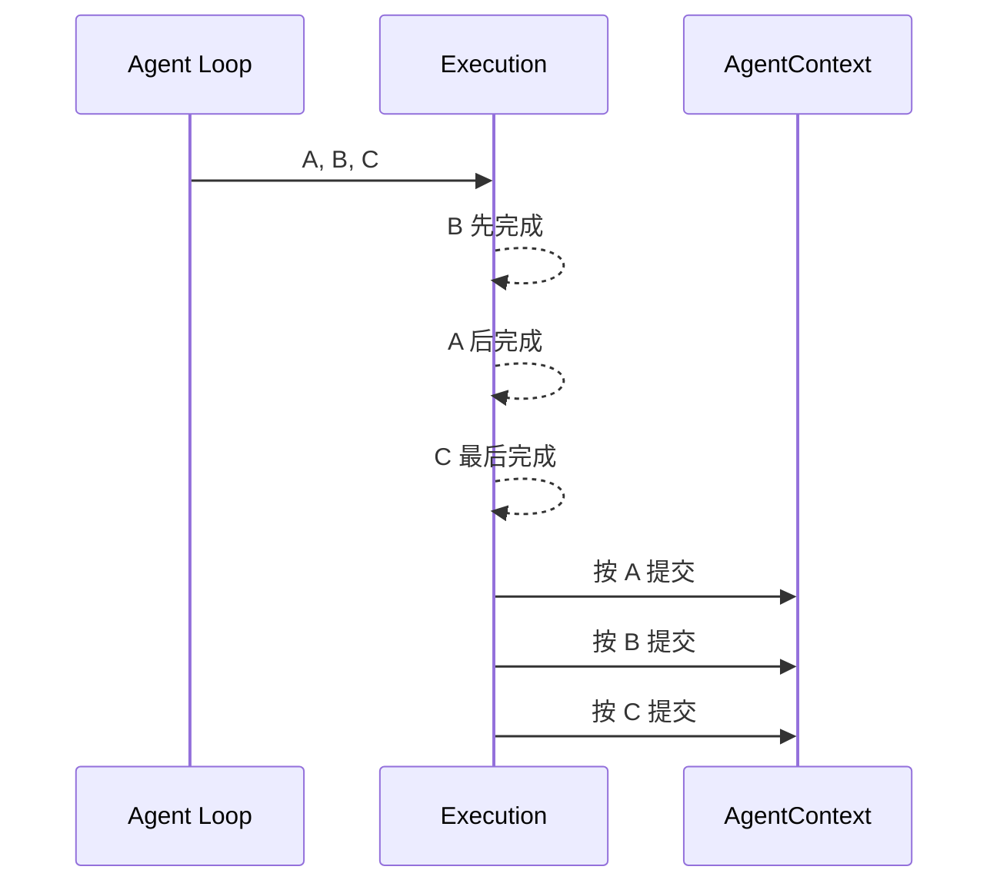
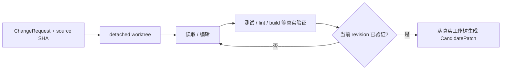

# 01 总览：一个请求怎样走完整条 GitAgent Pipeline

这一章先不讨论“为什么要多 Agent”“为什么要审批”。第一次接触 GitAgent，最重要的是先知道：**一个请求实际经过哪些阶段，每个阶段把什么交给下一个阶段。**

后面的章节会把每一段拆开。本章只负责建立一张不会迷路的总地图。

---

## 1. 先看完整设计

从应用视角看，一次 GitAgent 任务会经过一条分层 pipeline，远比“用户 → LLM → GitHub”三步更完整。

先把它拆成八个阶段。

| 阶段 | 这一层接到什么 | 这一层产出什么 |
|---|---|---|
| 1. 应用入口 | 用户输入、当前 Session | 一个明确的 Turn，以及要启动还是恢复的决定 |
| 2. Main Agent | 会话目标和当前仓库 | 要进入哪个领域 |
| 3. Domain Agent | Repository / Issue / PR 任务 | 当前实体证据、业务判断，必要时生成 CodingTask |
| 4. Coding Agent | 代码任务和证据 | 解释、审阅、方案，或经过验证的 CandidatePatch |
| 5. Agent Loop | AgentContext + 可见工具 | 一轮轮模型决定与工具结果 |
| 6. Capability / Execution | 结构化调用 | 校验、授权、实际执行并按逻辑顺序提交的结果 |
| 7. Approval / Mutation | 精确远端动作计划 | 用户授权后真正的远端副作用，或继续等待/拒绝 |
| 8. Persistence | 本轮消息、结果和暂停状态 | 可查询终态、可重放历史、可恢复控制点 |

这八段不是八个彼此独立的程序。它们是一条连续的数据交接链。

---

## 2. 第一步：应用先把“这句话”变成一个业务 Turn

用户在 CLI 输入一句话时，GitAgent 先确定当前使用哪个账户、哪个仓库、哪个 Session。随后为这次输入建立一个新的 Turn。

可以把两个概念这样区分：

- **Session** 是一段可以持续很多轮的工作会话；
- **Turn** 是其中一次用户输入对应的业务处理单元。

例如用户先问“这个模块怎么工作”，随后又说“那帮我修一下”，这是同一个 Session 中两个 Turn。

建立 Turn 以后，本轮产生的模型消息、Agent 调用、工具结果和最终状态都有一个明确归属。应用层随后检查当前 Session 有没有一棵已经暂停的 Agent 树。

如果没有等待任务，就启动 Main Agent；如果上一轮正停在审批或等待用户输入的位置，这次输入会交还给原来的等待节点，继续上一棵运行树。

这一点很重要：**“新的用户输入”不一定意味着“新的 Agent 任务”。**

---

## 3. 第二步：Main Agent 先决定领域，而不是直接处理全部工作

Main Agent 站在会话最外层。它先判断当前请求属于哪类工作。

例如：

| 用户目标 | 进入的领域 |
|---|---|
| “解释这个仓库的缓存设计” | Repository |
| “给 #123 回复一条评论” | Issue |
| “审一下 PR #45” | Pull Request |

Main Agent 不需要自己读取所有 PR Review、运行测试或提交分支。它主要负责理解会话目标，并把任务交给拥有对应业务状态和工具的领域 Agent。

领域 Agent 完成后，结果再回到 Main Agent，由它收束成当前会话的一部分。

---

## 4. 第三步：Domain Agent 负责“业务实体”，Coding Agent 负责“代码语义”

Repository、Issue 和 Pull Request Agent 都属于领域 Agent。它们知道当前正在处理什么业务对象，以及该业务流程需要哪些事实。

例如 PR Agent 会关心：

- PR 当前是否 open；
- 当前 head SHA 是什么；
- changed files 和 diff 是什么；
- Review 和 CI 当前是什么状态。

如果任务只需要操作业务字段，领域 Agent 可以自己完成。如果需要深度代码理解，就把一份结构化 `CodingTask` 交给 Coding Agent。

Coding Agent 可以承担多种代码任务：解释、方案、Review、CI 分析，以及真正生成补丁。

它的工作到“代码层”结束。即使生成了一个很好的补丁，它也不会因此获得把补丁发布到 GitHub 的权力。发布方式仍由上层领域决定。

---

## 5. 第四步：每一个 Agent 都由同一类 Agent Loop 驱动

Main、Domain、Coding 的业务职责不同，但它们都需要回答同一个运行问题：

> 模型这一步决定做什么，工具执行完以后，下一步又怎样继续？

这个问题由 Agent Loop 处理。

一轮最基本的循环可以理解成：

Agent Loop 不关心 GitHub API 的具体 HTTP 细节，也不自己判断某条命令是不是安全。它主要维护循环状态、调用身份、父子 Agent 关系和等待状态。

真正执行一项工具调用时，它会继续把工作交给更下层的 Harness。

---

## 6. 第五步：模型只能“提出调用”，不能让调用自动生效

模型返回一个工具调用后，这个调用还要经过多层处理。

这里最值得先记住的是一句话：

**模型拥有“建议下一步”的能力，运行时拥有“决定这一步能否成为事实”的能力。**

例如模型提出读取文件，这是一个低风险读能力；模型提出修改 GitHub，则可能需要审批；Coding Agent 即使提出 GitHub 写调用，也可能因为角色权限根本看不到或无法调用该能力。

因此“模型成功生成了工具调用”只是 pipeline 的中间状态，不是执行成功。

---

## 7. 第六步：一批调用可能并行运行，但结果不会乱序进入 Agent 状态

模型一次可以提出多项相互独立的读取，例如同时读取多个文件。GitAgent 会根据每项调用的执行描述判断哪些能并发、哪些有资源冲突、哪些必须独占。

但物理完成顺序和逻辑提交顺序是两件事。

假设模型按照 A、B、C 的顺序提出三个调用，B 最早返回，GitAgent 可以先拿到 B 的物理结果，但不会让 AgentContext 先看到 B、后看到 A。

这让并发主要优化等待时间，而不会悄悄重写模型原先提出的逻辑顺序。

---

## 8. 第七步：代码修改先停在本地 CandidatePatch

真正的代码修改走一条专门的候选构造链。

领域 Agent 会先确定要修改什么，并绑定一个精确的来源提交。Coding Agent 随后在隔离 worktree 中工作。

这里有两个关键事实。

第一，模型并不是直接返回“我修改了这些文件”，然后系统相信它。最终候选来自真实工作树快照。

第二，验证结果会绑定工作树 revision。代码又发生变化以后，旧测试不能继续证明新的文件状态有效。

候选形成后，临时 worktree 可以被清理。上层领域 Agent 接收的是稳定的 `CandidatePatch` 和 `VerificationReport`。

---

## 9. 第八步：CandidatePatch 还不是远端写入

同一份 CandidatePatch，在不同业务里有不同发布方式。

| 业务场景 | 领域层可能生成的发布计划 |
|---|---|
| 普通仓库修改 | 提交到默认分支，但绑定预期 head SHA |
| Issue 修复 | 创建修复分支 → 提交 → 发布分支 → Draft PR |
| PR 内修复 | 提交到当前 PR 的 head branch，并绑定原 head SHA |

领域 Agent 把候选转换成结构化 Mutation Plan。这个计划才是用户审批的对象。

Approval 不是一句“允许修改”。它绑定当前 Session、具体 capability、规范化参数以及多步骤计划的顺序。

用户批准以后，调用仍然重新经过能力和业务检查。如果审批期间远端 head 已经变化，旧候选可以被拒绝，而不是强行应用到模型没有看过的新版本上。

---

## 10. 第九步：运行过程同时留下“当前状态”和“历史事实”

一次任务可能持续多轮，甚至跨进程。GitAgent 因此不会只保存最终回复。

先把三个主要状态层记住：

| 状态 | 回答的问题 |
|---|---|
| 状态数据库 | Session、Turn 当前是什么终态，是否有暂停控制状态 |
| 事件历史 | 按顺序发生过什么，模型消息和关键事件是什么 |
| 暂停快照 | 如果当前在等待，整棵 Agent 控制树停在哪里 |

此外 Trace 用于实时观察运行过程，Audit 用于记录“谁对什么 capability 做了什么”。

恢复时，消息从事件历史重建，控制状态从暂停快照重建，并重新校验必要的不变量。系统不会把某个内存线程对象当作可以跨进程保存的任务。

---

## 11. 第十步：长会话和长期知识分别由不同系统负责

任务运行时间变长以后，会遇到两类不同问题。

### 当前会话太长

上下文治理会压缩旧工具结果和历史消息，但必须保留工具调用与结果的协议完整性。文件读取还维护覆盖和缓存状态，避免无意义重复读取。

### 希望以后还记得

长期记忆会从已经完成的业务轮次中提取少量稳定知识，并独立保存。RAG 则管理用户已经提供的文档知识库。

这三者不能混在一起：

- 上下文是“这次模型请求当前要看到什么”；
- Memory 是“过去交互中哪些少量知识值得跨会话保留”；
- RAG 是“已有文档中哪些片段和当前任务相关”。

当前仓库和 GitHub 的实时状态仍然需要当前读取来确认。

---

## 12. 用一个“修复 Issue”的例子把整条链串起来

现在把前面的阶段连成一个完整故事。

用户说：“修复 Issue #123。”

**第一步：应用建立 Turn。** 当前 Session 没有等待任务，所以启动 Main Agent。

**第二步：Main Agent 路由到 Issue Agent。** 它只确定领域，不自己猜 Issue 内容。

**第三步：Issue Agent 真实读取 #123。** 得到标题、正文和相关业务证据后，形成 `ChangeRequest` 和 `CodingTask`。

**第四步：Coding Agent 创建基于精确 source SHA 的 worktree。** 模型通过 Agent Loop 读取代码、编辑文件，并运行允许的真实验证。

**第五步：工作树的当前 revision 通过验证。** 运行时从真实文件状态生成 CandidatePatch 和 VerificationReport。

**第六步：结果回到 Issue Agent。** Issue Agent 根据“这是 Issue 修复”这一业务语义，生成创建分支、提交、发布分支和 Draft PR 的 Mutation Plan。

**第七步：系统进入 Approval 等待。** 当前 Agent 树的必要控制状态被保存，用户看到的是精确待执行计划。

**第八步：用户明确批准。** 计划按顺序消费授权；每项调用仍经过 capability、权限和当前远端状态检查。

**第九步：远端动作完成。** Issue Agent 与 Main Agent 收束结果，应用保存 Turn 终态和历史事件。长期记忆提取如果启用，会在主业务结果之后异步判断这一轮有没有值得跨会话保存的知识。

如果你能顺畅复述这九步，后面的章节就可以理解为这条链上的局部放大，不会再像十四个孤立模块。

---

## 13. STAR 复盘：为什么 GitAgent 要把链路拆得这么长

前面已经把 How 讲清楚，现在再讨论 Why。

### S — Situation：它面对的不是一个普通聊天任务

GitAgent 的模型输出可能最终影响本地文件、GitHub 分支、Issue、Review 和 Merge。与此同时，一个任务还可能调用多个 Agent、并发读取、等待用户决定，并跨进程恢复。

如果直接采用“模型有一堆工具，想调哪个就调哪个”的结构，模型推理、权限、并发、副作用和恢复会挤在同一层，任何一处变化都很难判断最终改变了什么。

### T — Task：必须把不同性质的决定交给不同层

系统需要同时满足几件事：让模型仍然能灵活规划；让业务实体有明确负责人；让执行层能够独立判断权限和资源；让代码候选与远端发布分开；让等待和失败之后还能知道任务停在哪里。

因此任务的重点是建立一组可以独立验证的交接点，模块数量只是这种职责拆分带来的结果。

### A — Action：把一次任务拆成职责明确的连续协议

GitAgent 使用 Main → Domain → Coding 的固定代理拓扑，用 Agent Loop 管理推理和调用，用 Capability 层统一动作身份与权限，用 Execution 层处理并发与有序提交，用 Coding Workspace 把模型修改变成真实候选，再用 Mutation Plan 和 Approval 把候选转换成精确远端授权。消息、业务终态和暂停控制则分别进入适合恢复的持久状态。

这些层不是简单“多包了一层”。每一层都把上层较模糊的意图，变成下层更明确的对象。

### R — Result：系统得到的是可解释的控制边界

好处是，当一项操作出问题时，可以具体回答：是模型没有形成有效调用、能力权限不允许、执行资源冲突、验证没有覆盖当前 revision、用户没有批准，还是审批后的远端状态已经变化。

代价也很明显：一次修改会比“LLM 直接 push”经过更多状态对象和协议，代码量和恢复逻辑都更复杂。

GitAgent 接受这份复杂度，因为项目更看重高风险 Agent 行为经过一条能够被检查、暂停和恢复的资格链，而非单纯追求最短路径完成 GitHub 操作。

---

## 14. 这一章不要混淆的四件事

| 容易混淆 | 正确理解 |
|---|---|
| 多 Agent = 多个模型同时讨论 | 不是。这里首先是职责、权限和状态边界；当前可共享同一个模型客户端 |
| worktree = 完整 sandbox | 不是。它隔离候选 Git 工作树，不等于操作系统级文件和网络隔离 |
| 用户批准 = 后续调用直接放行 | 不是。Approval 只授权精确调用，执行时仍做当前状态检查 |
| 保存聊天记录 = 可以恢复 Agent | 不是。消息历史和暂停控制状态分别有自己的权威来源 |

---

## 15. 复习时怎样讲这一章

推荐用这句话开场：

> GitAgent 把用户任务拆成“会话入口、领域路由、Agent 推理、受控执行、候选构造、审批发布、状态恢复”七类责任。模型主要负责提出下一步和形成语义结论；真正的权限、执行顺序、副作用资格和恢复状态由 Harness 负责。

然后用“修复 Issue #123”的九步故事复述一遍即可。不要一上来背类名。

## 16. 代码定位

| 想核对的问题 | 主要位置 |
|---|---|
| 应用怎样启动、处理输入与切换 Session | `gitagent/application/bootstrap.py` |
| 服务怎样启动或恢复 Agent 树 | `gitagent/application/service.py` |
| Main / Repository / Issue / PR / Coding Agent | `gitagent/agents/` |
| Agent Loop | `gitagent/agent_loop/loop.py` |
| Capability 与权限 | `gitagent/capability/` |
| 执行、并发与 Harness | `gitagent/harness/execution.py` |
| Coding Workspace | `gitagent/harness/coding_workspace.py` |
| Approval 与 Mutation Plan | `gitagent/harness/constraints/approval.py`、`gitagent/harness/mutation_plans.py` |
| 会话、事件与恢复 | `gitagent/infra/persistence/` |

下一章只放大一件事：[Agent 为什么要拆成 Main、Domain、Coding 三层，以及它们之间到底传什么](02-agent-topology-and-workflows.md)。
