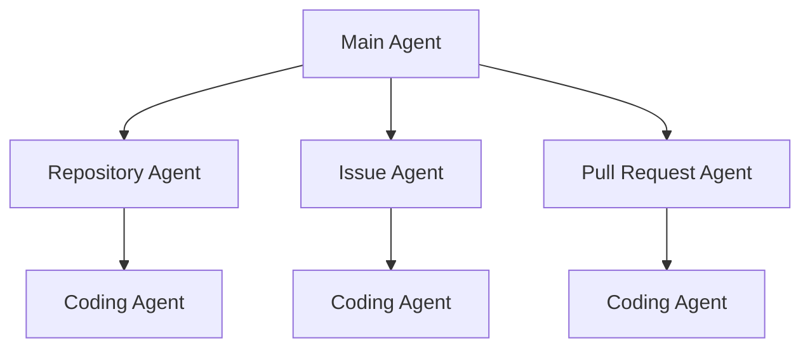
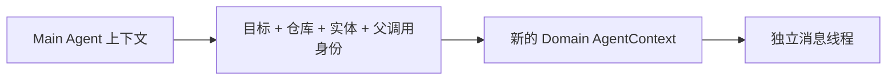
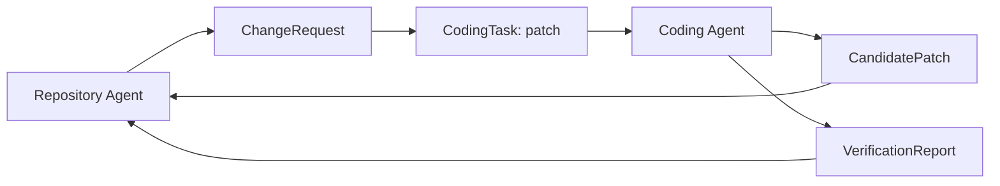
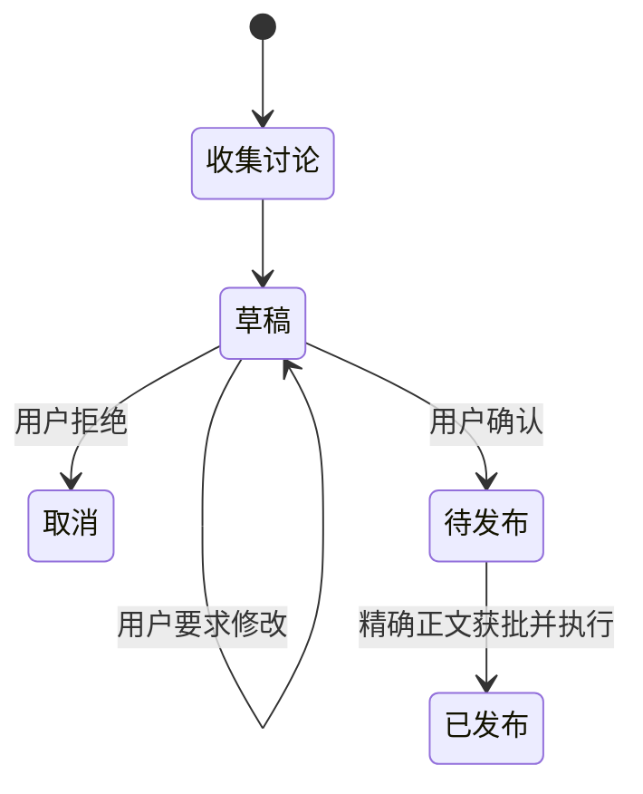
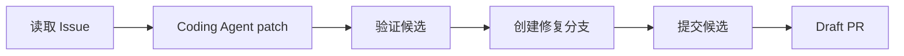
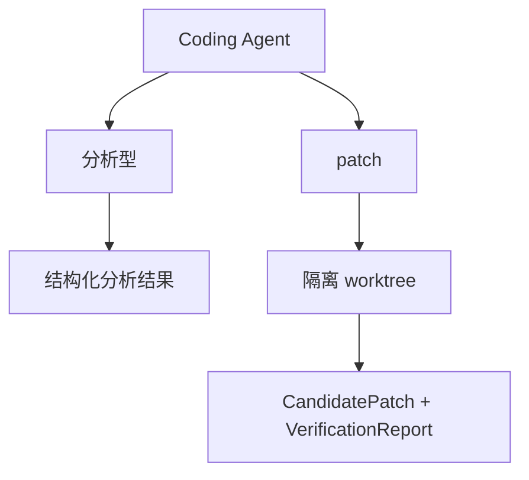
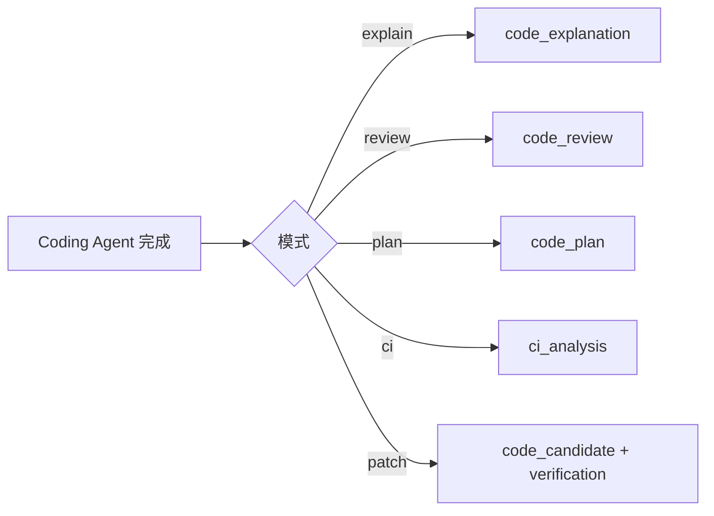
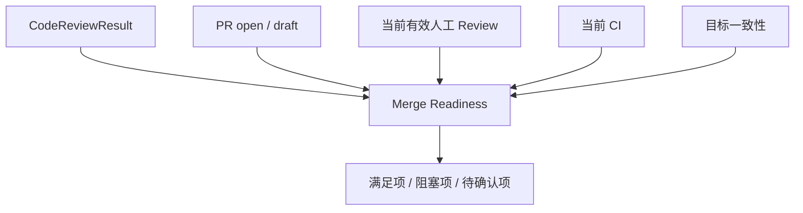

# 02 Agent 拓扑与领域工作流：任务怎样在 Main、Domain、Coding 之间交接

上一章已经知道请求会经过 Main Agent、领域 Agent，必要时再进入 Coding Agent。本章只回答一个问题：**这几类 Agent 在 GitAgent 中分别怎么设计，它们之间实际传递什么，结果回来以后谁继续做决定。**

先把职责讲清楚，再讨论为什么不做成一个“万能 Agent”。

---

## 1. 先看 Agent 拓扑

GitAgent 的 Agent 树是固定层级，不是模型可以任意生成的新拓扑。

这张图里的三层承担三种不同工作：

| 层 | 主要问题 | 典型输出 |
|---|---|---|
| Main | 用户现在想处理哪个领域 | 领域调用、最终会话表达 |
| Domain | 当前 Repository / Issue / PR 的真实业务状态是什么，下一步业务动作是什么 | 领域结果、CodingTask、Mutation Plan |
| Coding | 代码到底怎么工作、哪里有问题、怎样修改和验证 | Explanation / Review / Plan / CandidatePatch |

Coding Agent 是叶子节点。它不会再创建新的 Agent，也不会自己把补丁发布到 GitHub。

---

## 2. Main Agent 实际做什么

Main Agent 拿到的是整个会话层面的目标。它的第一项工作不是读代码，而是把请求放进正确的业务领域。

例如用户说：

- “这个函数的缓存策略是什么？” → Repository；
- “把 Issue #12 的标签改成 bug” → Issue；
- “PR #87 现在能不能合并？” → Pull Request。

Main Agent 创建领域 Agent 时，会把必要的结构化上下文交下去，包括当前仓库、用户目标、实体编号，以及父运行的调用身份。

它不会简单复制整段父消息线程给子 Agent。子 Agent 有自己的 `run_id` 和消息线程。

领域 Agent 完成后，Main Agent 会得到一次对应的子 Agent 结果。它不需要看到子 Agent 内部每一次文件读取才能继续会话。

---

## 3. Domain Agent 先建立“业务事实”，再决定要不要进入代码层

三类领域 Agent 的共同点是：它们先负责当前业务对象，而不是一上来就把所有请求塞给 Coding Agent。

### Repository Agent

它可以处理仓库结构、历史、普通代码解释、方案和修改。简单问题可以直接通过仓库读取工具完成；需要深入代码语义时才构造 CodingTask。

### Issue Agent

它处理 Issue 查询、字段修改、回复草稿和代码修复。用户只说“修复 #123”时，Issue Agent 会先真正读取 Issue，再根据得到的内容构造代码任务。

### Pull Request Agent

它处理 PR 元数据、changed files、diff、Review、CI、审阅讨论、补丁和 merge readiness。它需要组合多类远端事实，代码审阅只是其中一部分。

所以 Domain Agent 可以被理解成：**知道“当前业务对象是谁、当前事实是什么、代码结果应该怎样进入业务流程”的 Agent。**

---

## 4. Repository 工作流怎样交接给 Coding Agent

仓库任务常见的代码目标可以分成三类。

| 用户需要 | Coding 模式 | 返回给 Repository Agent 的东西 |
|---|---|---|
| 解释代码 | explain | `CodeExplanationResult` |
| 给出修改方案 | plan | `CodePlanResult` |
| 真正修改 | patch | `CandidatePatch` + `VerificationReport` |

进入 patch 之前，Repository Agent 还会形成 `ChangeRequest`。它主要固定两件事：

1. 业务上到底要改什么；
2. 这份候选基于哪个精确代码版本。

CandidatePatch 描述“真实工作树最后改成什么”，VerificationReport 描述“这些修改怎样被验证”。两者回来以后，Repository Agent 才有资格考虑远端发布计划。

---

## 5. Issue Agent 有三条彼此不同的业务路径

Issue 领域并不是所有操作都需要代码。

### 路径 A：Issue 查询和字段管理

读取、创建、更新标签、负责人或锁定状态等，都可以留在 Issue Agent 内部。

### 路径 B：Issue 回复

回复走“读取当前讨论 → 生成草稿 → 用户确认 → 发布”的状态流。这里风险是公开文本，不需要 Coding Agent。

### 路径 C：Issue 代码修复

修复必须先有 Issue 的真实读取结果，再形成 ChangeRequest 和 CodingTask。Coding Agent 返回验证过的候选以后，Issue Agent 不直接写默认分支，而是构造“修复分支 → 提交 → 发布分支 → Draft PR”的业务计划。

这里可以看到一个关键分工：**Coding Agent 决定候选代码是什么；Issue Agent 决定这份候选在 Issue 场景中应该怎么发布。**

---

## 6. Pull Request Agent 怎样组织多种证据

PR 任务比普通仓库问题多了一层“当前协作状态”。它通常需要的证据包括：

| 证据 | 回答的问题 |
|---|---|
| PR 元数据 | 目标是什么、open/draft 状态如何 |
| changed files / diff | 当前改了什么 |
| Review | 当前人工审阅状态是什么 |
| 评论 | 讨论里提出了什么问题 |
| workflow runs | CI 当前是否完成、是否失败 |
| job logs | 某次失败具体发生在哪里 |
| head SHA / head branch | 当前代码版本和后续写入绑定什么 |

PR Agent 会按任务目的选择不同的 Coding 模式，而不是把所有信息无差别传过去。

| PR 目标 | Coding 模式 | 重点证据 |
|---|---|---|
| 代码审阅 | review | PR 目标、diff、changed files、必要文件正文 |
| CI 分析 | ci | workflow runs、job logs、相关代码 |
| 审阅讨论总结 | review_dialogue | Review、评论、代码证据 |
| 修改 PR | patch | 当前 head SHA、head branch、变更上下文 |

这样 Coding Agent 每次知道自己正在解决的是哪一个代码问题。

---

## 7. Coding Agent 不是“只会写代码”的 Agent

Coding Agent 是共享的代码语义层，可以分为两类模式。

### 分析型模式

- explain：解释实现；
- review：代码审阅；
- plan：修改方案；
- review_dialogue：分析审阅讨论；
- ci：分析 CI 失败。

这些模式仍可以继续读取代码和参考资料，但最终要返回对应的结构化分析对象。

### 修改型模式

patch 模式会建立 Coding Workspace，在真实文件系统里修改和验证，最终返回 CandidatePatch 与 VerificationReport。

结构化结果很重要，因为父 Agent 要继续做确定性业务判断。例如 PR Agent 需要知道审阅里有哪些 blocking issues，而不是重新从一段自由文本中猜。

---

## 8. 子 Agent 结束时，父 Agent 实际拿回什么

父子 Agent 的交接不是“子 Agent 说了一段话，父 Agent 自己理解”。运行时会把对应结构化产物放回父上下文的专用字段。

这些字段继续驱动父 Agent 的业务状态：

- code review 参与 merge readiness；
- candidate + verification 参与 Mutation Plan；
- code plan 可以成为仓库方案结果；
- CI analysis 进入 PR 的持续集成判断。

与此同时，子 Agent 的自然语言结果仍然可以作为父 Agent 的工具结果进入会话。也就是说，**表达结果和控制结果可以同时存在，但用途不同。**

---

## 9. PR 的 merge readiness 为什么由 PR Agent 计算

Coding Agent 的 review 只能说明代码层观察。真正能不能合并还取决于远端当前状态。

例如 Coding Agent 没发现阻塞问题，但 PR 仍是 Draft，或者 CI 当前失败，那么 PR Agent 仍不会把它视为 ready to merge。

对人工 Review，系统关注每个审阅者当前有效状态，而不是把历史上所有 APPROVE 和 REQUEST_CHANGES 永久叠加。CI 也看当前相关运行，而不是让旧失败永远阻塞新提交。

这就是领域层存在的价值：**代码判断要和当前业务事实组合以后，才能变成业务结论。**

---

## 10. 一次 PR 修复怎样在 Agent 之间来回流动

假设用户说：“修复 PR #45 里 Review 提到的问题。”

**第一步：Main Agent → PR Agent。** Main 只负责把任务交给 PR 领域，并带上 #45。

**第二步：PR Agent 收集当前 PR 证据。** 它读取 PR、Review、评论、changed files 和当前 head SHA。

**第三步：PR Agent → Coding Agent。** 它构造 patch 任务，把必要代码证据和精确 head SHA 交下去。

**第四步：Coding Agent 修改并验证。** 形成 CandidatePatch 和 VerificationReport。

**第五步：结果回到 PR Agent。** PR Agent 检查候选来源仍然对应当前 PR head branch 和 head SHA，再形成远端 commit 提案。

**第六步：Approval 与执行。** 这部分由第 08 章展开；Coding Agent 不参与远端授权。

**第七步：PR Agent → Main Agent。** 领域结果回到主会话，Main Agent 向用户表达当前结果。

一条任务在 Agent 之间移动时，传递的是“当前层已经确认的状态和产物”，而不是让每一层从头猜一遍。

---

## 11. STAR 复盘：为什么不用一个万能 Agent

现在已经知道三层 Agent 是怎么工作的，再讨论设计动机。

### S — Situation

Repository、Issue、PR 和代码修改需要的工具、证据和结束条件差异很大。如果同一个 Agent 同时看到所有能力，它既要维持最长会话历史，又要处理 PR Review、Issue 草稿、Shell、文件写入和 Merge 等完全不同的状态。

这不仅增加模型选择工具的难度，也让“谁应该拥有哪类权限”变得模糊。

### T — Task

系统需要把会话理解、领域状态和代码语义分开，同时保证任务可以在不同层之间可靠交接。每层只应该看到完成本层职责所需要的能力与状态。

### A — Action

GitAgent 使用固定 Main → Domain → Coding 拓扑。Main 负责路由，Domain 负责当前业务实体与发布语义，Coding 负责共享代码能力。父子之间用目标、实体、调用身份和结构化产物交接；子 Agent 使用独立 run_id 和消息线程；Coding Agent 到叶子结束，不再任意扩张树深度。

### R — Result

结果是权限和状态边界更容易解释：Main 不需要 Merge 权限，Coding 可以有本地候选写权限但没有 GitHub 发布权，PR Agent 可以基于当前远端事实形成 merge readiness。

代价是需要维护父子上下文迁移和多种结构化结果。GitAgent 用这份复杂度换来的是：**每个 Agent 只对自己能掌握的那部分事实负责，而不是让一个模型同时成为路由器、代码工程师和发布管理员。**

---

## 12. 这一章最容易混淆的地方

| 误解 | 正确理解 |
|---|---|
| Domain Agent 只是给 Coding Agent 换个 Prompt | 不是。它维护业务实体证据、工作流状态和发布语义 |
| Coding Agent 一定会修改文件 | 不是。多数模式是分析型，只有 patch 建立写工作区 |
| 子 Agent 继承父 Agent 全部聊天历史 | 不是。子 Agent 有独立上下文，父层传递必要任务与状态 |
| Code review 通过就代表 PR 可合并 | 不是。merge readiness 还组合当前 PR、人工 Review 和 CI |
| 多 Agent 意味着可以无限递归委派 | 不是。拓扑和深度是固定的，Coding 是叶子 |

---

## 13. 复习时怎样讲这一章

推荐按“谁管什么”来讲：

> Main 管会话路由，Domain 管 Repository / Issue / PR 的业务事实和发布方式，Coding 管可复用的代码语义工作。父层把结构化任务和证据交给子层，子层把结构化产物交回来；远端发布权不会随着代码任务一起下放。

然后分别举一个 Issue 修复和 PR merge readiness 的例子，说明“代码结果”和“业务结果”不是同一个东西。

## 14. 代码定位

| 想核对的问题 | 主要位置 |
|---|---|
| Main Agent 路由与 child schema | `gitagent/agents/main.py` |
| Repository 工作流 | `gitagent/agents/repository.py` |
| Issue 回复与修复 | `gitagent/agents/issues.py` |
| PR Review、CI、patch、merge readiness | `gitagent/agents/pull_requests.py` |
| Coding 各模式和产物 | `gitagent/agents/coding.py` |
| 领域对象与产物模型 | `gitagent/domain/models.py` |
| 父子上下文创建与收束 | `gitagent/agent_loop/loop.py` |

下一章开始进入所有 Agent 共享的运行机制：[Agent Loop 怎样把模型的一步决定变成下一步状态](03-agent-loop-and-call-protocol.md)。
