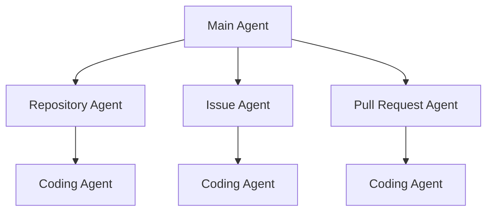
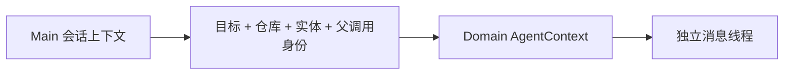
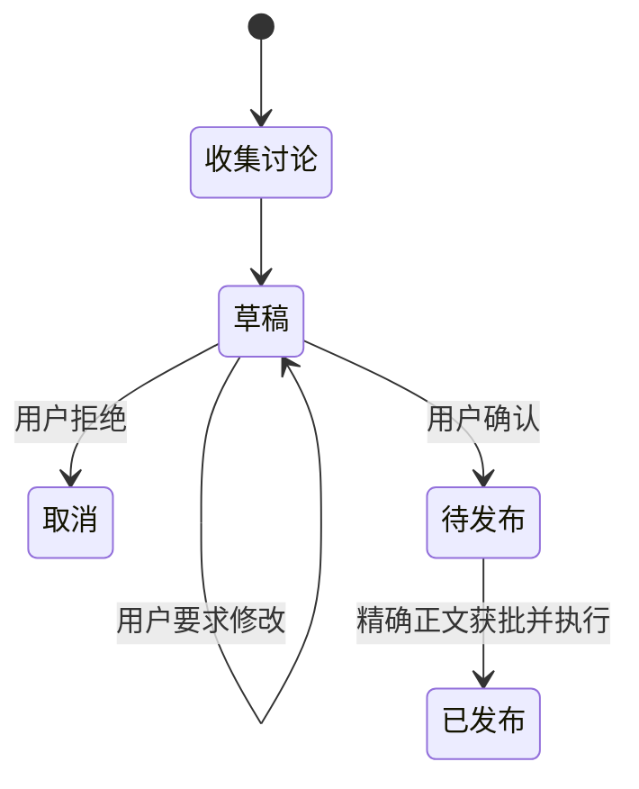
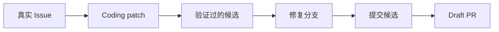
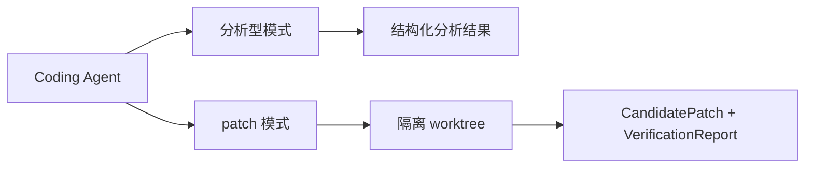
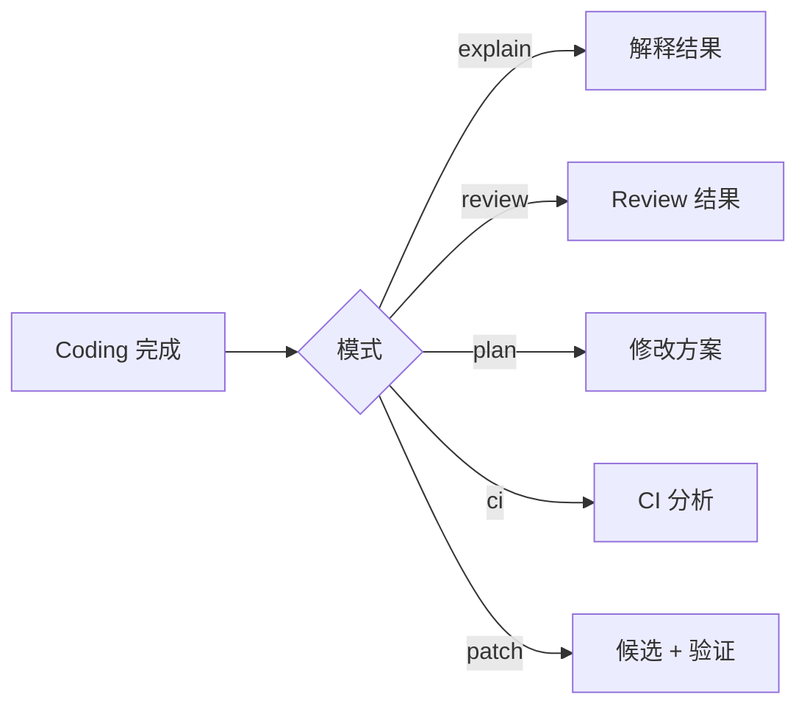
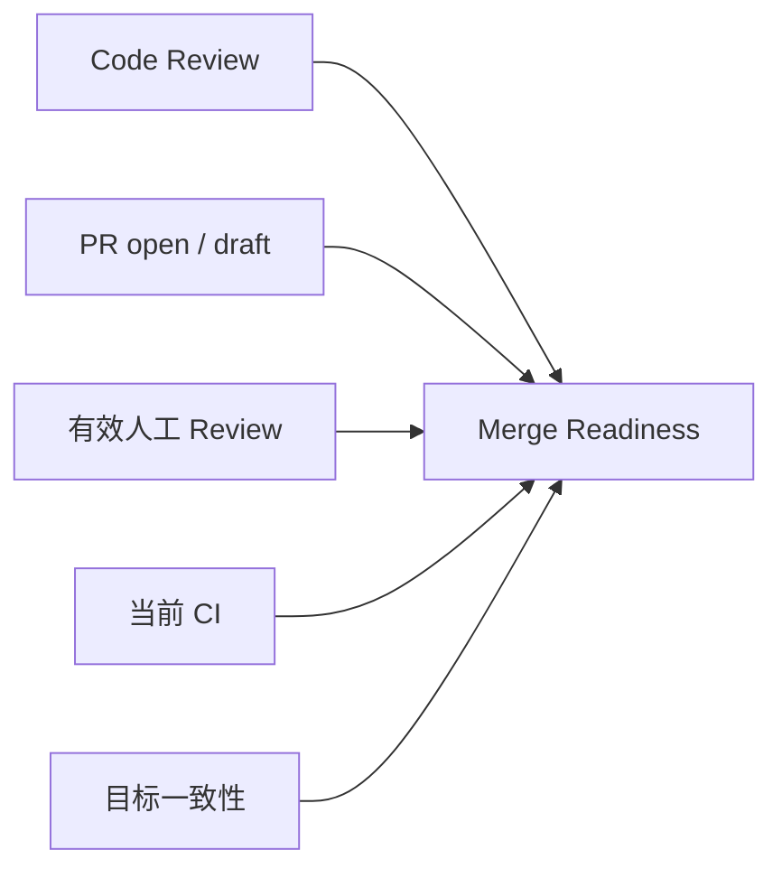

# 02 Agent 拓扑与领域工作流：任务怎样在 Main、Domain、Coding 之间交接

上一章已经知道请求会经过 Main Agent、领域 Agent，必要时再进入 Coding Agent。本章只回答一个问题：这几类 Agent 在 GitAgent 中分别怎么设计，它们之间实际传递什么，结果回来以后谁继续做决定。

这里先把职责和交接机制讲清楚，再讨论为什么采用固定 Main → Domain → Coding 拓扑，而不是一个万能 Agent 或动态 Agent swarm。

---

## 1. Agent 拓扑是固定层级

三层分别处理不同问题：

| 层 | 主要负责什么 | 典型产物 |
|---|---|---|
| Main | 用户当前属于哪个业务领域，最终怎样向用户收束 | Domain Agent 调用、会话结果 |
| Domain | 当前 Repository / Issue / PR 的真实业务状态和下一步业务动作 | 领域结果、CodingTask、Mutation Plan |
| Coding | 代码怎样工作、哪里有问题、怎样修改和验证 | Explanation / Review / Plan / CandidatePatch |

Coding Agent 是叶子节点，不会继续创建新的 Agent，也不会自行把补丁发布到 GitHub。拓扑和允许的父子关系由 Runtime 预先定义，不由模型临时发明。

---

## 2. Main Agent 负责会话级路由，不负责领域细节

Main Agent 拿到整个会话目标，先判断任务属于 Repository、Issue 还是 Pull Request。例如：

- “这个函数的缓存策略是什么？” → Repository；
- “把 Issue #12 的标签改成 bug” → Issue；
- “PR #87 现在能不能合并？” → Pull Request。

创建领域 child 时，父层会传递当前仓库、用户目标、必要实体编号和父调用身份。它不会把父线程所有历史原样复制给 child；child 会建立自己的 run 和独立消息线程。

领域 Agent 完成后，Main 拿回与原 Agent call 对应的结果即可，不需要把 child 内部几十次读取和搜索全部塞回主线程。这让 Main 可以维持长期会话，而局部任务的大量中间证据留在 child 自己的上下文里。

---

## 3. Domain Agent 先建立业务事实，再决定是否进入代码层

三个 Domain Agent 的共同点是：先负责当前业务对象，而不是一上来把所有任务都交给 Coding Agent。

### 3.1 Repository Agent

它处理仓库结构、历史、普通代码解释、方案和仓库级修改。简单问题可以直接使用仓库读取 Capability；需要更深入的代码语义分析时才构造 CodingTask。

### 3.2 Issue Agent

它处理 Issue 查询、字段修改、回复草稿和代码修复。用户只说“修复 #123”时，Issue Agent 会先读取真实 Issue 内容，再把问题描述、当前仓库和必要上下文转换成代码任务。

### 3.3 Pull Request Agent

它处理 PR metadata、changed files、diff、Review、评论、CI、补丁和 merge readiness。代码 Review 只是整个 PR 业务状态的一部分；是否可合并还需要远端当前事实。

所以 Domain Agent 的核心职责是：**知道当前业务对象是谁、哪些事实已经确认、代码结果应该怎样进入业务流程。**

---

## 4. Repository 怎样把不同代码目标交给 Coding Agent

Repository 任务常见的代码需求分为解释、方案和修改。

| 用户目标 | Coding 模式 | 返回给 Repository 的结果 |
|---|---|---|
| 解释实现 | explain | CodeExplanationResult |
| 给修改方案 | plan | CodePlanResult |
| 真正修改 | patch | CandidatePatch + VerificationReport |

patch 模式之前，Repository 会先形成 ChangeRequest，用来固定业务目标和候选基于的精确代码版本，再把它包装成 CodingTask。

CandidatePatch 回答“真实工作树最后改成什么”，VerificationReport 回答“这份候选针对哪一版工作树做过哪些检查”。只有两者回来，Repository 才考虑生成远端发布计划。

这就是为什么“代码修改”和“远端发布”不属于同一个 Agent 权限：Coding 负责候选正确性，Repository 负责仓库业务动作。

---

## 5. Issue Agent 有三条不同业务路径

Issue 领域并不是所有操作都需要代码。

### 5.1 查询和字段管理

读取 Issue、创建或更新字段、标签、负责人、锁定状态等，可以在 Issue Agent 内完成。

### 5.2 Issue 回复

回复使用“读取当前讨论 → 形成草稿 → 用户确认/修改 → 发布”的状态流。

这里的业务风险是公开文本发布，不需要 Coding Agent。真正发布仍受 Approval 约束。

### 5.3 Issue 代码修复

修复必须先读取 Issue，再形成 ChangeRequest 和 CodingTask。Coding Agent 返回验证过的候选后，Issue Agent 根据“这是 Issue 修复”这一业务语义形成修复分支、提交候选和 Draft PR 计划，而不是直接写默认分支。

因此 Coding Agent 决定候选代码是什么，Issue Agent 决定候选在 Issue 场景中应该如何发布。

---

## 6. Pull Request Agent 怎样组织代码证据和协作状态

PR 工作流除了代码，还要处理远端协作事实。

| 证据 | 回答的问题 |
|---|---|
| PR metadata | PR 目标、open / draft 状态 |
| changed files / diff | 当前改了什么 |
| Review | 人工审阅状态 |
| 评论 | 当前讨论和反馈 |
| workflow runs | CI 是否完成、是否失败 |
| job logs | 某次 CI 失败的具体原因 |
| head SHA / branch | 当前代码版本以及后续写操作绑定什么 |

PR Agent 根据任务目标选择不同 Coding 模式，而不是把所有数据无差别塞给同一个 prompt。

| PR 目标 | Coding 模式 | 重点输入 |
|---|---|---|
| 代码审阅 | review | PR 目标、diff、changed files、必要文件内容 |
| CI 分析 | ci | workflow runs、job logs、相关代码 |
| 审阅讨论总结 | review_dialogue | Review、评论、代码证据 |
| 修改 PR | patch | 当前 head SHA、head branch、变更上下文 |

这种分法让 Coding Agent 每次只解决一个明确代码问题，PR Agent 继续保存业务实体和协作状态。

---

## 7. Coding Agent 是共享代码语义层，不只是写文件

Coding Agent 包含两类工作模式。

分析型模式包括 explain、review、plan、review_dialogue 和 ci。它们可以读取代码、搜索和使用参考资料，但最终返回相应结构化分析结果。

修改型 patch 模式会建立 Coding Workspace，在真实文件系统里修改并验证，最后返回 CandidatePatch 和 VerificationReport。

结构化产物很重要，因为父 Agent 还要继续做业务判断。例如 PR Agent 需要明确知道 Review 是否存在 blocking issue，而不是重新从一段自由文本里猜；Repository / Issue / PR 的发布流程也要直接读取候选和验证状态。

---

## 8. Child 完成后，父 Agent 同时拿回“表达结果”和“控制结果”

父子 Agent 的交接不只是子 Agent 返回一段文字。运行时还会把相应结构化产物迁移回父 Context 的专用状态。

这些产物继续驱动父 Agent：Review 参与 merge readiness；候选和验证参与 Mutation Plan；Code Plan 可以直接成为仓库方案；CI analysis 进入 PR 的 CI 判断。

同时 child 的自然语言结果也会作为父 Agent 原 AgentCall 的 tool result 闭合调用。可以把它理解成两条并行用途：自然语言用于模型继续理解，结构化产物用于 Runtime 和业务逻辑做确定判断。

---

## 9. Merge readiness 为什么属于 PR Agent，而不是 Coding Agent

Coding review 只能说明代码层面有没有发现问题，PR 是否可合并还取决于当前远端事实。

PR Agent 会把这些信息整理成 satisfied、blockers 和 remaining，再得到业务 readiness。即使 Coding Agent 没发现阻塞问题，只要 PR 还是 Draft、仍有有效 REQUEST_CHANGES，或者当前 CI 失败，就不能得到 ready-to-merge 结论。

人工 Review 会先归一到每位 reviewer 当前有效状态；CI 也看当前相关 workflow run，而不是让历史失败永久阻塞未来提交。

这体现了领域层和代码层的边界：**代码结论必须与当前业务状态组合，才能得到业务结论。**

---

## 10. 为什么采用固定 Main → Domain → Coding 拓扑

前面已经先看了各层怎样工作，现在再讨论选型原因。

Repository、Issue、PR 和代码修改需要的工具、证据和结束条件差异很大。如果一个 Agent 同时承担长期会话、GitHub 业务状态、代码探索、Shell、文件修改和 Merge，它的上下文会越来越杂，权限边界也很难解释。

GitAgent 因此把三类责任固定下来：Main 负责会话路由；Domain 负责业务实体和发布语义；Coding 负责共享代码能力。父层只传递完成 child 任务所需的目标、实体、调用身份和证据，child 使用独立消息线程；返回时再把结构化结果迁移回父层。

这种固定拓扑也让权限容易约束：Main 不需要 Merge 或本地编辑权限；Coding 可以拥有隔离 workspace 内的本地写能力，但没有 GitHub 发布权；PR Agent 则负责把代码结果和远端状态组合成 Review、patch 或 Merge 决定。

代价是要维护父子 Context、不同模式的结构化产物和固定拓扑规则，而且灵活性低于动态 Agent DAG。但当前 GitHub 工作流角色本身比较明确，固定拓扑换来了更容易解释、恢复和评测的状态空间。

有几个边界需要同时记住：Domain Agent 不是只换 Prompt，它维护真实业务状态；Coding 并不总是修改文件，多数模式是分析型；child 不继承父线程的完整聊天历史；code review 通过也不等于 PR ready to merge；Coding 是叶子，Agent 不会无限递归扩张。

---

## 11. 代码定位

| 想核对的问题 | 主要位置 |
|---|---|
| Main 路由与 child schema | `gitagent/agents/main.py` |
| Repository 工作流 | `gitagent/agents/repository.py` |
| Issue 回复与修复 | `gitagent/agents/issues.py` |
| PR Review、CI、patch、merge readiness | `gitagent/agents/pull_requests.py` |
| Coding 各模式和产物 | `gitagent/agents/coding.py` |
| 领域对象与产物模型 | `gitagent/domain/models.py` |
| 父子 Context 创建与结果迁移 | `gitagent/agent_loop/loop.py` |

下一章进入所有 Agent 共享的运行机制：[Agent Loop 怎样把模型的一步决定变成下一步状态](03-agent-loop-and-call-protocol.md)。
