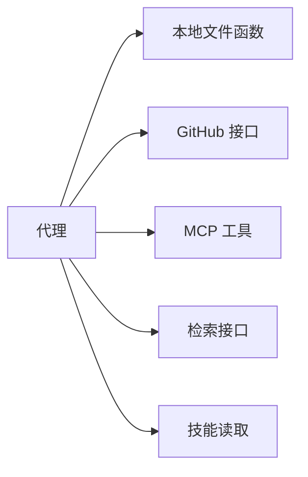
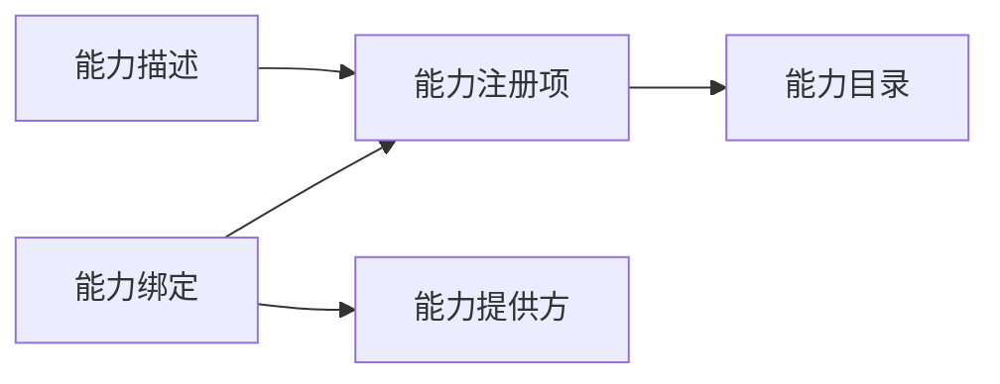
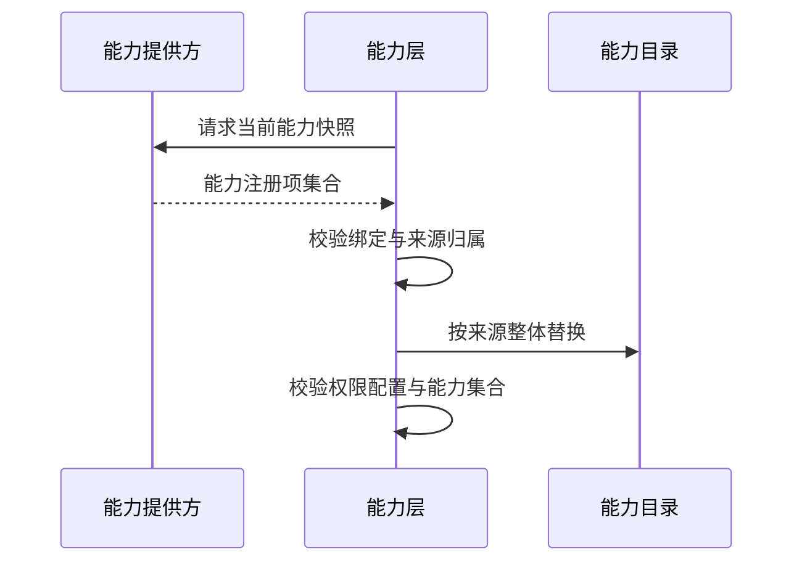
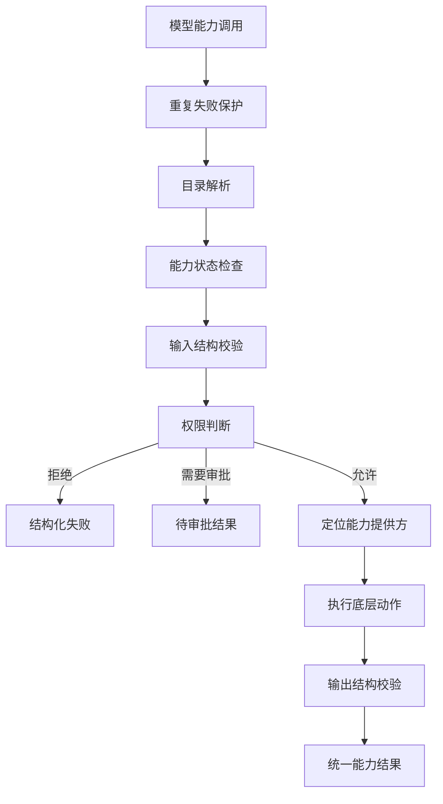
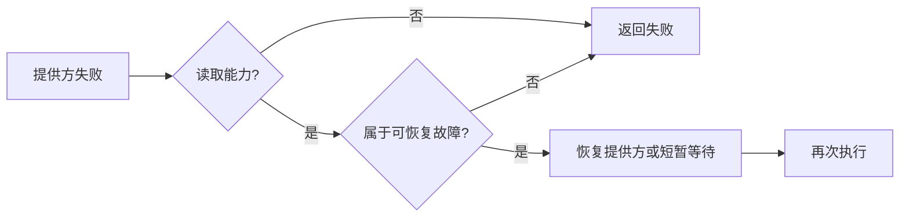
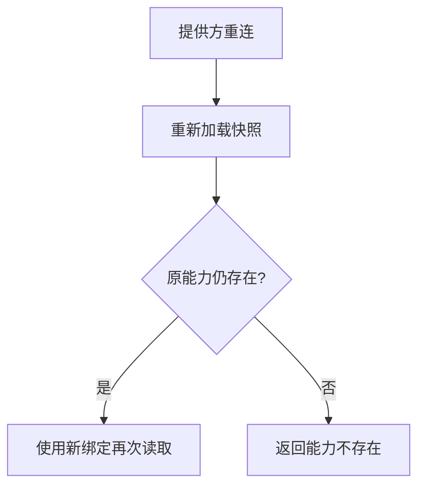

# 02 能力层：从“各种工具”到统一执行边界

## 本章先回答什么

理解能力层，不应该从 `Capability` 这个类开始。应该先问一个更早的问题：**GitAgent 为什么不能把本地函数、GitHub 接口、MCP 工具、检索和技能直接作为一堆工具交给模型？**

因为这些动作虽然都能被模型“调用”，但它们在工程上完全不同：有的只读，有的会产生远端副作用；有的来自本地进程，有的来自远程服务；有的工具集合固定，有的会在服务重连后变化；有的失败可以重试，有的失败后连“到底有没有执行”都无法确定。

能力层的任务，就是把这些差异收敛成一套稳定契约，再把权限、调度、恢复和追踪建立在这套契约上。

### 本章的 STAR 主线

| 阶段 | 本章要解决的问题 |
|---|---|
| 情境 S | 多种工具来源直接暴露给代理，会让命名、权限、错误、重试和调度彼此耦合 |
| 任务 T | 建立稳定能力目录，让代理只面对统一动作契约，让执行框架掌握调用控制权 |
| 行动 A | 提供方产生能力快照 → 能力注册 → 代理发现 → 调用校验与授权 → 提供方执行 → 结果归一 → 刷新与删除 |
| 结果 R | 新能力来源可以接入同一执行框架；代理权限、读取重试、并发分类和失败保护不需要复制到每个提供方 |

---

## 1. 情境：如果没有能力层，会发生什么

先假设系统没有能力层。主代理、仓库代理和代码代理都直接拿到一批函数。



表面上，这种方式最直接。问题会在运行时出现。

| 问题 | 直接工具模式下谁来处理 | 结果 |
|---|---|---|
| 某个代理能否看到工具 | 每个代理自己筛选 | 权限规则分散 |
| 写操作是否需要审批 | 每个工具自己判断 | 容易出现不同审批语义 |
| 输入是否合法 | 每个工具自己校验 | 参数错误格式不统一 |
| 外部异常怎样返回 | 每个提供方自己定义 | 代理需要理解多套错误 |
| MCP 重连后工具消失 | 调用侧自己处理 | 容易继续持有旧工具 |
| 读取失败能否重试 | 每个工具自己决定 | 写操作可能被误重试 |
| 两个调用能否并发 | 调度器猜工具名称 | 调度器和业务实现耦合 |

所以 GitAgent 需要的不是一个“工具包装器”。它需要的是一层**执行契约**：任何模型可调用动作进入系统后，都先被描述成统一能力，再由统一规则决定它怎样被发现、怎样执行、怎样失败。

---

## 2. 任务：能力层到底要封装什么

能力层封装的不是“一个函数”。它把一个外部动作拆成四个部分。



| 对象 | 它回答的问题 | 是否给模型看 |
|---|---|---|
| 能力描述 | 这个动作叫什么、做什么、输入输出是什么、有没有副作用 | 是，经过发现过滤后形成模型工具 |
| 能力绑定 | 这个动作由哪个提供方、哪个底层目标执行 | 否 |
| 能力注册项 | 把能力描述和执行绑定放在一起 | 否 |
| 能力提供方 | 怎样真正连接本地系统或远程系统并执行动作 | 否 |

这里最重要的是“描述”和“执行”分离。

例如，代理调用的是一个稳定能力编号。这个编号可以长期保持不变。底层执行对象可以是本地函数，也可以是远端 MCP 工具。代理不需要知道连接对象、网络会话、函数引用或远端工具句柄。

能力描述中还包含三个会影响后续控制流的字段：

- 能力状态：可用、不可用、停用；
- 访问级别：读取、写入、破坏性操作；
- 输入输出结构：调用前和调用后的契约。

这三个字段不是注释。权限、重试、缓存、错误解释都会读取它们。

---

## 3. 行动第一步：提供方怎样把底层工具交给能力层

能力并不是在能力层里逐条硬编码出来的。每个提供方负责把自己掌握的底层动作转换成一组能力注册项。

可以把一次提供方加载理解成“交一张完整清单”。



这里有三个工程细节。

### 3.1 提供方交的是“快照”，不是“增量通知”

能力层调用提供方加载接口后，得到该提供方当前拥有的完整能力集合。

这样设计的原因是，远端工具可能增加，也可能删除。只支持“新增一个能力”无法表达工具已经从远端消失。

### 3.2 每个来源只能有一个提供方负责

能力编号带来源，例如某组 GitHub 能力属于同一来源。能力层会记录来源和提供方的归属关系。

如果两个提供方同时声明同一来源，加载直接失败。

这不是名称美观问题。后续刷新时，能力层会按来源整体替换目录。如果同一来源有两个拥有者，系统无法判断哪份快照才是权威状态。

### 3.3 先校验完整快照，再修改共享目录

能力层先拿到各提供方快照，检查绑定是否真的指向当前提供方，也检查来源是否冲突。通过这些检查后，才修改能力目录。

这避免“前半批能力已经注册，后半批校验失败”的半更新状态。

---

## 4. 能力进入目录时，系统具体保存了什么

能力目录可以理解成进程内的两张关联表：

```text
能力编号 -> 能力描述
能力编号 -> 能力绑定
```

真正实现时，两者合并保存在注册项中。

注册阶段不是简单写入字典。系统会检查：

| 检查 | 为什么需要 |
|---|---|
| 能力编号必须带来源前缀 | 防止全局名称失去归属 |
| 能力来源必须覆盖能力编号 | 防止能力被挂到错误来源 |
| 描述不能为空 | 模型工具需要可理解说明 |
| 绑定中的能力编号必须一致 | 防止“描述 A、实际执行 B” |
| 输入结构必须是对象结构 | 模型工具参数统一使用键值对象 |
| 输入输出结构本身必须合法 | 防止运行到调用阶段才发现契约无法解析 |
| 能力编号不能重复 | 一个编号只能有一个当前解释 |

因此，“注册”这一步完成后，目录里的能力才具备可发现和可调用资格。

---

## 5. 能力怎样被删除：为什么使用“按来源替换”

这是能力生命周期里容易被忽略的一环。

假设一个 MCP 服务第一次暴露三个工具：A、B、C。重连后只剩 A、C。

如果刷新逻辑只是重新注册 A、C，旧的 B 仍然留在目录里。模型下一轮还能看见一个远端已经不存在的工具。

GitAgent 的处理方式是：**替换某个来源的完整集合**。


替换过程中如果新注册项校验失败，目录恢复到替换前状态。

所以能力的“删除”不是单独调用一个远程删除接口，而是通过新快照中缺少该能力来完成。

这种设计适合工具集合由外部服务控制的场景：**外部快照决定当前存在什么，能力目录只保存当前投影。**

---

## 6. 注册完成后，为什么代理还不能看到全部能力

目录回答“系统当前拥有哪些能力”。代理工具列表回答“这个代理当前允许看到哪些能力”。这是两个不同问题。


发现阶段只保留：

1. 当前状态为可用的能力；
2. 权限策略允许当前代理发现的能力。

这带来一个重要边界：**能力已经注册，不等于所有代理都有接口。**

| 代理 | 典型可见能力 | 不应该直接看到的能力 |
|---|---|---|
| 主代理 | 少量读取能力、领域代理入口 | GitHub 写操作 |
| 仓库代理 | 仓库读取、默认分支变更入口 | 议题专属写操作 |
| 议题代理 | 议题读取与议题工作流能力 | 合并操作 |
| 合并请求代理 | 合并请求、审阅、持续集成能力 | 无关领域写操作 |
| 代码代理 | 仓库读取、本地工作区修改、受限命令 | GitHub 远端写操作 |

权限因此先缩小模型的决策空间，再在真正执行时进行第二次授权。

---

## 7. 模型看到的能力，怎样变成一次真实执行

当模型返回一个能力工具调用时，能力层不是直接调用提供方。调用会经过一条固定管线。



这条流程要按顺序理解。

### 7.1 先解析目录

调用只有能力编号。能力层从目录取出注册项，得到能力描述和绑定。

目录里没有该编号，调用直接结束。系统不会让提供方自己猜模型想调用什么。

### 7.2 再检查能力状态

能力可以存在于目录中，但当前不可用。此时系统返回统一不可用错误，不进入提供方。

### 7.3 输入结构在提供方之前验证

模型参数不满足能力输入结构时，调用不会到达底层系统。

这让提供方只处理满足契约的输入，不需要每个提供方重复处理模型格式问题。

### 7.4 权限判断发生在副作用之前

权限结果只有三类：允许、需要审批、拒绝。

“需要审批”只产生待审批结果，不执行提供方。用户批准后，原调用会带审批身份重新进入能力层。

### 7.5 提供方只负责执行绑定目标

执行阶段使用能力绑定找到正确提供方和底层目标。能力提供方接收的是已经通过目录、结构和权限检查的调用。

### 7.6 返回值也必须满足契约

提供方没有抛异常，不代表本次能力调用成功。返回值仍要通过输出结构校验。

这一步很重要，因为能力层向上层承诺的是“统一能力结果”，不是“提供方返回了一个 Python 对象”。

---

## 8. 能力结果为什么要再次统一

不同来源的底层结果差异很大。能力层把结果收敛成三种状态：成功、失败、需要审批。

成功结果再区分内容类型，例如普通数据、上下文、检索结果。

失败结果使用统一错误分类。

| 底层情况 | 上层看到的统一语义 |
|---|---|
| 文件不存在 | 资源不存在 |
| MCP 断连 | 提供方不可用 |
| 参数错误 | 输入非法 |
| 返回结构错误 | 输出非法 |
| 无权限 | 权限拒绝 |
| 写请求超时且结果无法确定 | 执行结果不确定 |

代理循环和并发调度器不需要识别每种外部库异常。它们只处理统一能力结果。

这就是能力层的第二个核心价值：**它不仅统一“怎样调用”，还统一“怎样失败”。**

---

## 9. 访问级别为什么贯穿整条执行链

每项能力都有读取、写入或破坏性访问级别。它会改变后续多个模块的行为。

| 访问级别影响点 | 读取 | 写入 / 破坏性 |
|---|---|---|
| 权限 | 通常可以直接允许 | 通常需要审批 |
| 自动重试 | 部分网络故障允许一次恢复 | 不做普通自动重试 |
| 读取缓存 | 可以缓存 | 成功后使读取状态失效 |
| 输出结构错误 | 本次读取结果不可用 | 动作可能已经发生，不能假设失败 |
| 并发语义 | 常可声明为并发读取 | 常形成更强资源边界 |

所以 `AccessLevel` 不是分类标签。它是能力层和权限、上下文、异常恢复、并发调度之间的连接字段。

---

## 10. 读取失败为什么可以恢复，写入失败为什么不行

能力层最多为可恢复的读取调用增加一次尝试。

当前允许恢复的典型情况是：

- 超时；
- 提供方不可用；
- 提供方给出短等待时间的限流。



写操作不走这条链。原因不是“写操作更重要”这么简单，而是网络失败后的事实状态不同。

一个写请求超时后，可能已经到达远端并产生副作用，只是响应丢失。再次调用可能制造第二次副作用。

因此能力层把写操作中的这类故障保留为“执行结果不确定”，而不是把它自动转化为下一次重试。

---

## 11. 提供方重连后，为什么必须重新加载能力

当读取调用因为提供方不可用而进入恢复时，能力层会尝试重连。

但重连本身还不够。

远端 MCP 服务恢复后，工具集合可能已经变化。GitAgent 在重连后重新读取能力快照，并执行来源替换。

这时会出现两种结果：



因此，恢复的不是一条网络连接，而是“连接 + 当前能力契约”。

---

## 12. 能力层除了封装工具，还承担了哪些横切职责

如果只把能力层理解成“统一工具接口”，会漏掉它真正有价值的部分。

### 12.1 失败调用保护

同一次代理运行中，完全相同的能力和参数已经失败后，模型可能再次机械调用。

能力层使用“代理 + 能力编号 + 规范化参数”作为失败身份。失败身份进入保护集合后，相同调用可以直接被拦截，不再访问提供方。

这个状态在有序提交阶段更新。这样并发工作线程的完成顺序不会提前改变代理看到的失败历史。

### 12.2 调度语义交接

能力层还负责向并发协调器询问本次调用的执行特征。

提供方可以描述：

- 本次调用能否并发；
- 读取哪些逻辑资源；
- 写入哪些逻辑资源；
- 失败是否需要阻断后续调用。

能力层不自己理解 GitHub 或文件系统业务，只把提供方给出的执行特征交给调度器。

提供方无法给出可靠特征时，调用进入保守的未知模式。

### 12.3 调用追踪

能力调用开始、每次尝试、恢复、成功和失败都会产生追踪事件。

追踪内容不会无条件复制完整参数和结果。检索和长期记忆等能力只记录必要摘要，避免可观测系统变成第二份数据仓库。

---

## 13. 能力调用为什么还要拆成“准备—执行—提交”

能力层完成的是“外部动作调用”。代理上下文还要维护缓存、文件阅读范围、工作树版本、失败保护和审计。

这些状态不能在线程一结束时随意更新，所以一次能力调用在执行框架里又被拆成三段。

| 阶段 | 做什么 | 是否允许并发 |
|---|---|---|
| 准备 | 计算实际读取范围、检查缓存、完成无副作用预检查 | 在调度前完成 |
| 执行 | 进入能力层，调用提供方 | 可以并发 |
| 提交 | 写工具结果、缓存、读取覆盖、失败保护、审计、工作树版本 | 必须按模型调用顺序 |

这说明能力层并不独立存在。它和代理上下文、结构化调用调度器、并发协调器共同组成完整执行链。

---

## 14. 用一个完整例子把生命周期串起来

假设代码代理需要读取仓库中的 `src/a.py`。

### 第一步：系统启动

仓库能力提供方加载自己的能力快照，其中包含文件读取能力。能力层检查来源和绑定，再把它注册进能力目录。

### 第二步：代码代理开始运行

执行框架询问能力层：“当前代码代理可以发现哪些能力？”权限策略允许它发现仓库读取能力，于是模型工具列表中出现文件读取入口。

### 第三步：模型发出读取调用

模型给出路径和行区间。执行框架先结合文件读取覆盖记录计算真正未读区间，再把实际参数交给能力层。

### 第四步：能力层执行

能力层解析目录，检查能力状态，验证输入结构，再做权限判断。读取允许执行，于是能力绑定把调用交给仓库能力提供方。

### 第五步：结果返回

提供方返回文件内容。能力层检查输出结构，形成统一成功结果。

### 第六步：有序提交

代理上下文按模型调用顺序提交结果，更新文件已读区间和读取缓存。模型下一轮看到工具结果。

### 第七步：远端提供方断连

下一次读取遇到提供方不可用。能力层重连，重新加载能力快照。如果原读取能力仍存在，用新绑定再尝试一次；如果能力已经被远端删除，返回“能力不存在”。

这一条路径包含了能力从**注册、发现、使用、失败恢复到消失**的完整生命周期。

---

## 15. 结果：能力层最终解决了什么

可以把能力层的最终效果压缩成一张对比表。

| 没有能力层 | 有能力层 |
|---|---|
| 代理直接依赖各种外部工具形式 | 代理只面对统一能力契约 |
| 提供方异常向上泄漏 | 外部失败归一成统一错误 |
| 权限规则散落在各工具 | 发现和调用授权统一处理 |
| 远端工具删除后容易残留旧接口 | 来源快照替换会移除旧能力 |
| 调度器需要认识具体工具 | 提供方交接统一执行特征 |
| 每个工具自行决定重试 | 读取恢复和写入保守策略统一 |
| 模型可能重复撞同一失败 | 本次运行失败保护统一拦截 |

代价也很明确：系统增加了能力描述、绑定、目录、策略和提供方几层对象，调用链比“直接调用函数”更长。

GitAgent 接受这部分复杂度，因为它换来的不是抽象整洁，而是**权限、调度、恢复和副作用语义能够使用同一份能力契约**。

---

## 16. 复习时怎样讲这一章

不要从“有一个 `Capability` 数据类”开始。可以按下面顺序复述：

1. GitAgent 的动作来自多种系统，直接当工具会让权限、错误和重试分散；
2. 所以先把动作拆成能力描述和能力绑定，描述稳定契约，绑定负责找到真实提供方；
3. 提供方启动时提交完整能力快照，能力层校验后按来源注册；
4. 代理运行时只发现自己有权看见的能力；
5. 真正调用还要经过目录解析、输入校验、权限、提供方执行和输出校验；
6. 提供方刷新时按来源整体替换，所以远端删除的工具也会从目录消失；
7. 在这条主链之外，能力层还统一错误、读取恢复、失败保护、调度语义和追踪。

能把这七步讲顺，才算真正理解了能力层。

## 17. 代码定位

| 想核对的问题 | 代码位置 |
|---|---|
| 能力、绑定、调用上下文、结果对象长什么样 | `gitagent/capability/models.py` |
| 注册、注销、按来源替换怎样实现 | `gitagent/capability/registry.py` |
| 提供方加载、刷新、发现、调用、恢复怎样串起来 | `gitagent/capability/layer.py` |
| 发现权限和调用授权怎样判断 | `gitagent/capability/policy.py` |
| 外部异常怎样归一化 | `gitagent/capability/errors.py` |
| 各类底层能力怎样被包装成注册项 | `gitagent/capability/providers/` |
| 模型能力调用怎样进入准备、执行、提交 | `gitagent/harness/context/state.py` |
| 审批与受保护调用怎样接在能力层前后 | `gitagent/harness/structured_call_dispatcher.py` |
| 代理能力配置 | `capabilities.yaml` |
