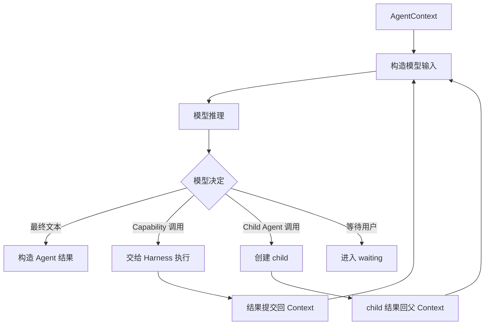
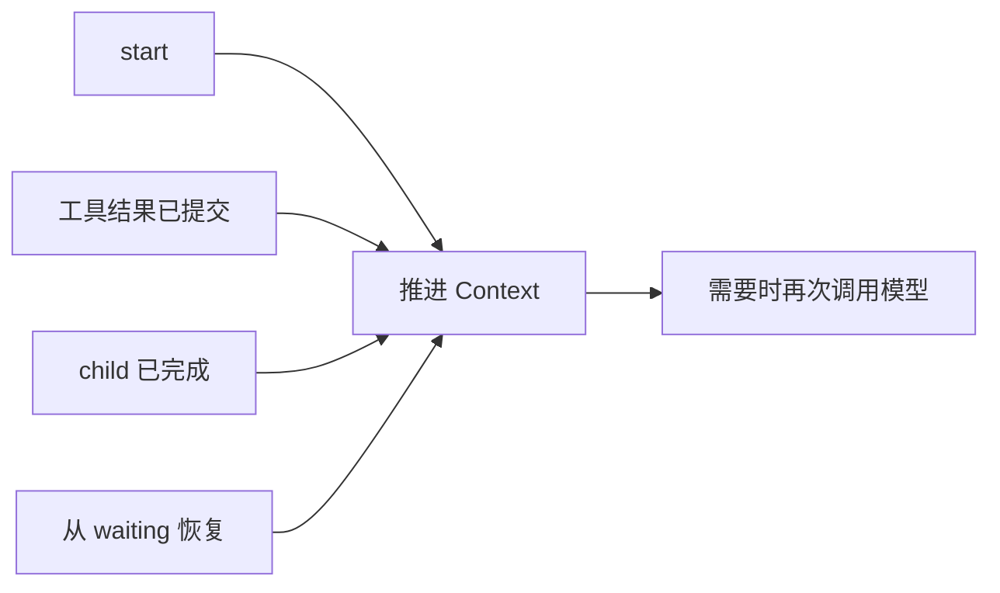
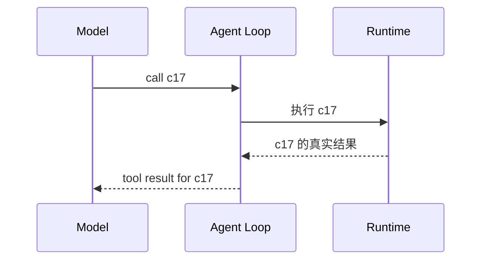
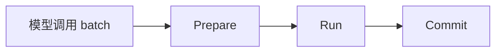
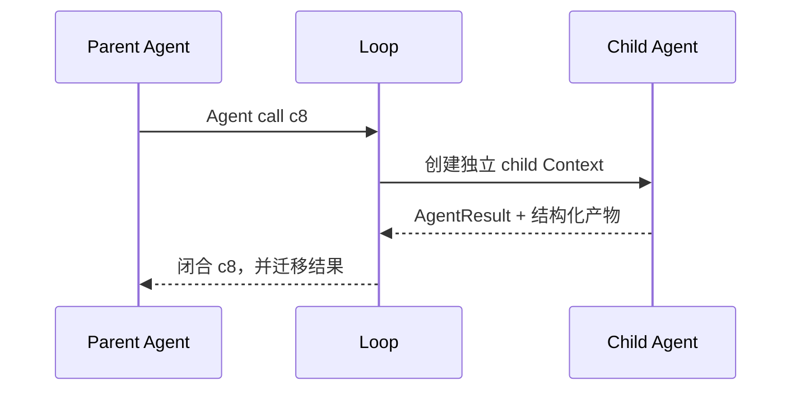
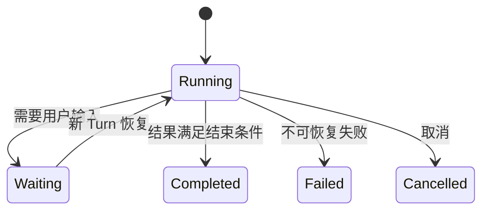
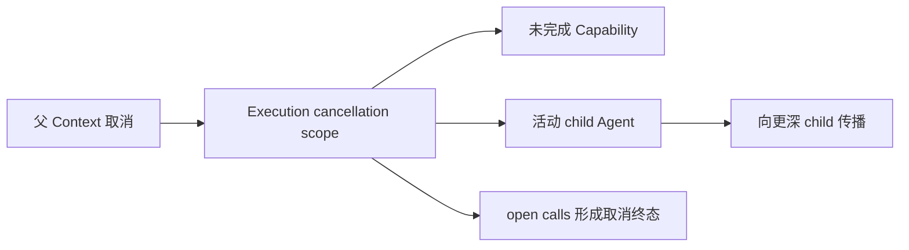

# 03 Agent Loop 与调用协议：模型的一步决定怎样变成下一步状态

上一章讲的是 Agent 之间怎样分工。本章把镜头拉进一个 Agent 内部：模型每推理一次以后，运行时怎样解释它的决定、执行调用、写回结果、创建 child、进入 waiting，最后结束当前 Agent。

这里先讲控制循环本身。模型消息格式放在第 04 章，具体 Capability 权限在第 05 章，并发调度在第 06 章，Approval 和跨进程恢复在第 08、09 章。

---

## 1. Agent Loop 是一台显式状态机

一个 Agent 运行以后，会反复执行“构造本轮模型输入 → 模型推理 → 解释结果 → 推进状态”。

从 Loop 视角，模型只能产生几类会改变控制状态的决定：结束当前 Agent、调用 Capability、调用固定拓扑允许的 child Agent、等待用户。

模型 Provider 的原始响应不会直接驱动 Runtime，而是先被模型边界归一成这些内部决定。这样 Loop 不需要理解每个模型 SDK 的格式，也不会把任意自然语言当成运行指令。

---

## 2. AgentContext 是 Loop 的运行工作台

Agent Loop 不是只维护一串聊天消息。当前 Agent 还需要知道自己的身份、父调用、waiting、open calls、child 状态和已经产生的领域结果。

| 状态 | 主要作用 |
|---|---|
| Agent / run identity | 区分当前是哪一次 Agent 运行 |
| 消息线程 | 保存模型已经看到的 assistant / tool 等消息 |
| 父子调用关系 | 知道 child 来自父层哪一次 Agent call |
| 控制状态 | open calls、waiting、steps、active children |
| 领域产物 | Review、CandidatePatch、Verification 等已确认结果 |

例如 PR Agent 的 Context 可以已经有 PR metadata 和 code review；Coding patch Context 还会关联当前 Coding Workspace 和验证状态。

这些内容并不会全部转成 Prompt。AgentContext 是 Runtime 的完整状态，model messages 只是它面向模型的一种视图。第 04 章会继续解释模型真正看到什么。

---

## 3. start、工具返回、child 返回和 resume 最终回到同一条推进逻辑

新 Agent 第一次启动、Capability 执行完、child 返回，或者用户从 waiting 中恢复，看起来入口不同，但本质都在回答同一个问题：**当前 Context 已经多了哪些新事实，现在下一步是什么。**

这样不同入口不用分别实现一套“接下来怎么办”的算法。Loop 始终围绕同一个 Context 状态推进，waiting 和恢复只是状态机的不同入口，而不是另一套工作流。

---

## 4. 模型工具调用先归一成带稳定身份的 Structured Call

模型一轮可以返回普通文本，也可以提出一个或多个 tool call。工具调用会先被整理成内部 Structured Call，至少保留稳定 call identity、调用名称和参数对象。

call identity 是整个工具协议的连接点：assistant message 里的调用、Harness 真正执行的动作、后续 tool result 都使用同一个身份。

如果恢复时给旧调用重新编号，模型历史中的 assistant call 和 tool result 就无法配对。因此这个身份会贯穿响应归一、消息持久化、Execution 和恢复。

---

## 5. Loop 怎样区分 Capability Call 和 Agent Call

结构化调用进入 Loop 后，会根据当前 Agent 允许的调用集合判断它属于哪一类。

Capability Call 表示读取文件、查询 PR、运行测试、加载 Skill 等 Runtime 能力，后续交给 Dispatcher 和 Execution。

Agent Call 表示父 Agent 想调用固定拓扑中的 child，例如 Main → Repository、PR → Coding。Loop 会先验证这条父子关系是否合法，再创建新的 child Context。

这两个调用虽然在模型侧都可以表现成结构化 function call，但 Runtime 含义不同：Capability 访问某个 Provider；Agent Call 会启动一段新的 Agent run、独立消息线程和结构化结果生命周期。

---

## 6. 一批调用的逻辑生命周期是 Prepare → Run → Commit

模型一次可以提出多个调用。Agent Loop 不会简单按列表逐个直接执行，而是把当前 batch 交给统一执行协议。

Prepare 先把调用身份、目标、参数、权限和执行描述整理好；如果某些失败已经可以在执行前确定，就形成结构化结果，不再访问真实 Provider。

Run 才真正访问 Provider、工作区或 child Agent。安全且资源兼容的调用可以并发，因此物理完成顺序可能和模型原顺序不同。

Commit 负责把结果按模型原始顺序写回 AgentContext，闭合对应 call，并更新依赖逻辑顺序的状态。

详细的 ResourceClaims、execution group、provider semaphore 和 ordered commit 算法在第 06 章。本章只需要抓住一点：**worker 完成只代表物理执行结束，不代表结果已经进入 Agent 的逻辑历史。**

---

## 7. 每个 open call 最终都必须闭合

模型消息中一旦出现 tool call，后续消息协议就需要一个对应的 tool result。否则下一轮模型看到的历史是不完整的。

因此已经出现的调用不能因为失败、取消或等待就从历史里直接删掉。它最终需要落入一种可解释状态：成功结果、结构化失败、取消结果，或者被正式保存为可恢复的等待状态并在后续继续闭合。

这也是为什么取消一个 future 还不够。执行器可以阻止尚未开始的物理工作，但 Agent Loop 仍要给已经出现在 assistant message 中的 call 一个逻辑终态。

open call protocol 同时服务三件事：保证下一轮模型消息合法；让并发结果知道应该写回哪里；让恢复时可以证明哪些动作仍未完成。

---

## 8. Child Agent 调用怎样创建和返回

父 Agent 提出 child call 后，Loop 创建新的 AgentContext，并保存父 run 和父 call 的关联。child 可以在自己的线程里经历很多轮模型和 Capability 调用，但对父层来说，这一整段最终仍然对应原来的一次 Agent call。

返回父层时通常有两部分：一部分作为原 Agent call 的 tool result 回到父消息线程；另一部分是 Review、CandidatePatch 等结构化产物，被迁移到父 Context 的业务状态，供后续确定逻辑使用。

如果 child 自己进入 waiting，它仍然是 active child，父层不能把 c8 当成已完成。waiting 会沿树暴露到上层，让应用找到真正暂停的位置。

---

## 9. Waiting 是可持久化的控制状态，不是线程阻塞

远端写审批、Issue 草稿确认，或者模型明确缺少必要信息时，当前 Agent 会进入 Wait For User 状态。

waiting 有几个重要性质：当前 Agent 还没有完成；关联的 call identity 仍然存在；Runtime 知道具体哪个 Context 在等；下一条用户输入应该回到这个节点，而不是重新路由成无关任务；必要控制状态可以跨 Turn、跨进程保存。

所以等待并不意味着保留一个线程几小时。上一 Turn 可以正常结束，Session 保存暂停控制树；用户下一次输入再创建新 Turn，从这个控制点继续。持久化细节在第 09 章展开。

---

## 10. Waiting 出现在 batch 中间时，为什么不能立刻截断所有状态

假设一个 batch 里有 A、B、C，B 在逻辑提交时触发 Approval waiting，而 A、C 的物理工作可能已经开始甚至完成。如果系统一看到 B waiting 就丢掉整个 batch，会产生几个问题：已经完成的结果没有合法去处；某些读取已经访问外部系统但历史中没有终态；恢复以后还可能重复执行本来已经跑过的调用。

因此 Loop 和 Execution 会先让当前 group 收束到稳定边界，再按模型顺序 Commit。B 进入 waiting 后，后面已经执行但还不允许提交的结果可以保存成“未提交结果”，恢复后继续按 open call 顺序处理，而不是重新执行。

这部分真正的 group quiescence、suspend 和 ordered commit 细节放在第 06 章。Loop 关心的是等待点必须对应一个一致的逻辑状态，而不是线程池某一瞬间的随机截图。

---

## 11. 模型说“完成”以后，Agent 仍要满足自己的结束条件

模型返回最终文本且没有结构化调用时，只表示“模型想结束这一轮”。当前 Agent 是否真的允许结束，还要由自己的结果构造逻辑判断。

例如 Coding review 需要形成可用 Review 结构；patch 模式还要求真实工作区已经产生有效修改，并且当前 revision 的验证状态满足 finalization 门槛。领域 Agent 也可能需要特定业务产物才能形成规定结果。

因此有两个不同层次：模型表达“我完成了”；Runtime 判断“当前状态确实足以构造这个 Agent 规定的结果”。模型不能用一句自然语言绕过缺失的 CandidatePatch、Verification 或其他结构化业务状态。

---

## 12. 模型结构化错误怎样回到 Loop

模型可能调用不存在的函数、参数结构错误，或者在需要机器可消费结果时没有按约定返回。对于允许纠正的模型协议错误，Runtime 会形成明确 observation，让模型在有限重试预算内重新表达。

这和 Provider 网络 retry 不是同一件事：Provider retry 是同一次外部请求是否再次尝试；结构化纠错会把错误写回消息线程，产生新的模型 step，因此属于 Agent Loop 的状态推进。

把两者分开以后，模型格式错误不会被误处理成底层工具重放，底层网络故障也不需要让模型每次重新思考同一个语义决定。

---

## 13. Cancellation 怎样沿调用树收束

取消当前任务时，不能只停止最外层 Agent。已经启动的 child 和当前 batch 中未稳定提交的工作也要一起处理。

这是一种协作式收束。尚未开始的 future 可以取消，等待资源的调用可以被唤醒停止，child cancellation 可以沿树传播；但已经发送给外部系统的写请求可能已经产生副作用，取消不能把它撤回。

所以 cancellation 解决“停止继续运行和闭合协议”，高风险副作用是否允许发生、失败后能否安全重试，仍由第 08、09 章的 Approval 和 mutation recovery 负责。

---

## 14. 为什么 Agent Loop 要做成显式状态机

前面先看了 Loop 怎样工作，现在再讨论设计原因。

Agent 不是一次性模型请求。真实任务会同时出现多轮 tool call、child Agent、并发 batch、用户等待、取消和跨进程恢复。如果实现只是一段“模型想调工具就继续 while”的隐式循环，运行时很快会失去几个关键事实：哪次调用还没闭合、child 属于哪个父 call、当前真正等待的是谁、恢复以后该把下一条输入交到哪里。

GitAgent 把这些事实显式放进 AgentContext，并把模型决定限制成少数可识别状态迁移。call identity 连接 assistant call 和真实结果；child 使用独立 Context；waiting 是正式状态；每项 open call 都必须获得终态；工具执行和逻辑 Commit 分离。

这让并发、压缩和恢复可以围绕同一套协议工作，而不是依赖某个线程“恰好执行到哪一行”。代价是 Loop 要维护更多身份和状态校验，但换来的核心性质是：**模型的推理路径可以开放，模型对 Runtime 造成的状态变化仍然有限、可检查、可恢复。**

几个边界也由此变得清楚：Agent Loop 不等于单纯循环调 LLM；worker 完成不等于 Context 已提交；waiting 不等于线程阻塞；最终文本不一定满足 Agent 结束条件；cancel 也不能撤销已经发生的远端写。

---

## 15. 代码定位

| 想核对的问题 | 主要位置 |
|---|---|
| Loop 的 start / resume / advance / waiting | `gitagent/agent_loop/loop.py` |
| Structured Call、Agent Call、Capability Call、Wait For User | `gitagent/agent_loop/models.py` |
| AgentContext 与 open tool calls | `gitagent/harness/context/state.py` |
| 结构化调用分派 | `gitagent/harness/structured_call_dispatcher.py` |
| 父子 Agent 结果迁移 | `gitagent/agent_loop/loop.py`、各 `gitagent/agents/*.py` |

下一章继续沿 Loop 向模型边界走：[一次模型请求到底由哪些消息和工具组成，返回什么才算运行时可用](04-model-and-context-protocol.md)。
