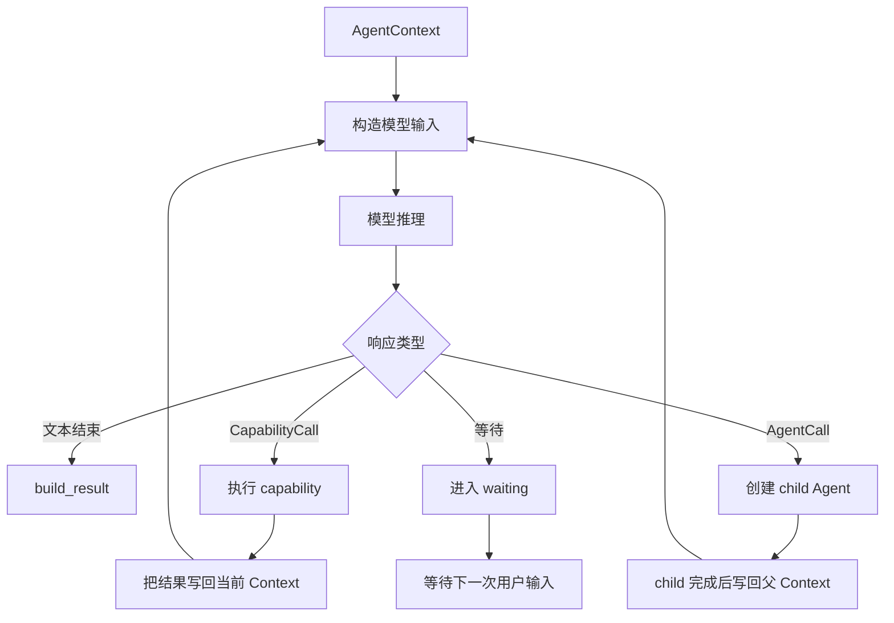
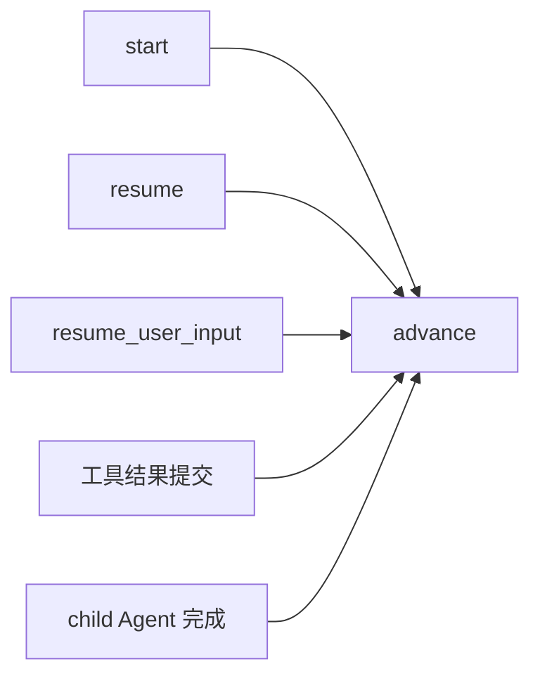
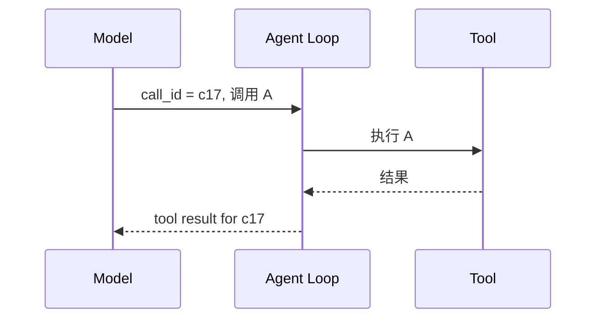
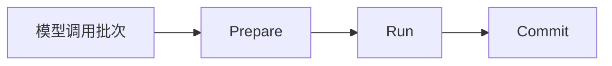
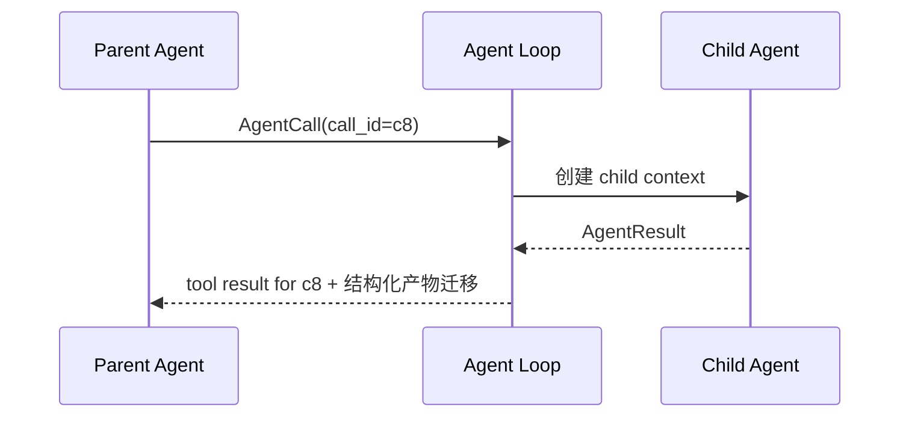
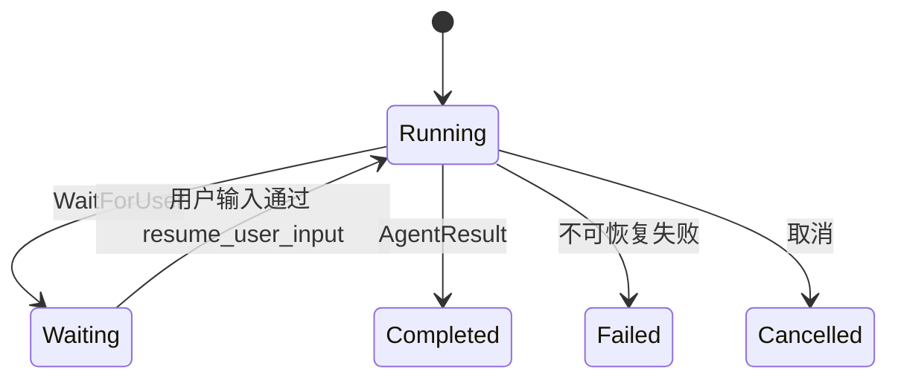
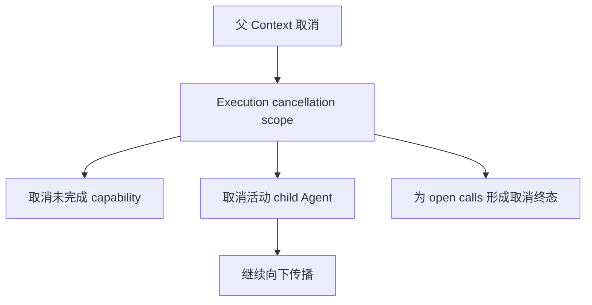

# 03 Agent Loop 与调用协议：模型的一步决定怎样变成下一步状态

上一章讲的是 Agent 之间怎样分工。这一章把镜头拉进一个 Agent 内部：**模型每推理一次以后，运行时到底怎样解析它的决定、执行调用、写回结果、创建子 Agent、进入等待，最后结束这一轮 Agent。**

这里先讲控制循环本身。具体工具权限在第 05 章，并发调度在第 06 章，审批恢复在第 08、09 章。

---

## 1. 先看 Agent Loop 的基本形状

一个 Agent 运行起来以后，会反复执行“构造上下文 → 模型推理 → 解释结果 → 推进状态”。

从 Agent Loop 自己的视角，它只认识几类“可推进的决定”：

| 决定 | 含义 |
|---|---|
| 普通文本结束 | 当前 Agent 已经形成可交付结果 |
| `CapabilityCall` | 要执行一个运行时能力 |
| `AgentCall` | 要调用固定拓扑允许的子 Agent |
| `WaitForUser` | 当前任务必须暂停，等待用户提供信息或授权 |

模型返回的原始文本和 provider 格式会先被适配成这些内部对象，Agent Loop 再处理。

---

## 2. AgentContext 是 Loop 的“工作台”

Agent Loop 不直接拿一串聊天消息工作，它围绕 `AgentContext` 维护当前运行。

可以先把 AgentContext 看成四类东西的集合。

| 内容 | 作用 |
|---|---|
| 身份 | 当前是什么 Agent、run_id、父调用是谁 |
| 消息线程 | 模型已经看过哪些系统/用户/助手/工具消息 |
| 控制状态 | 是否 waiting、有哪些 open calls、子 Agent 状态 |
| 领域产物 | 当前任务已经得到哪些结构化事实或结果 |

例如 PR Agent 的 Context 里可能已经有当前 PR 证据和 code review；Coding patch Context 里可能有 ChangeRequest、工作区状态和验证结果。

这些数据不是都塞进下一次 Prompt。下一次模型真正看到什么，还会由上下文构建器按规则投影。AgentContext 是运行时状态，model messages 是它面向模型的一种视图。

---

## 3. 第一次启动和后续继续使用同一条推进逻辑

一个新的 Agent 被创建以后，Loop 会初始化必要状态并进入推进过程。后续工具执行完成、child Agent 返回，或者用户从等待中恢复，本质上都要回到同一个问题：

> 现在这个 Context 已经拥有了哪些新事实，下一步还能不能继续推理？

因此 Agent Loop 的核心不是“调用一次 LLM”，而是维护一台状态机。不同入口最终都回到 `_advance` 这一类推进逻辑中。

这样启动、工具返回和恢复不用各自实现一套不同的“下一步算法”。

---

## 4. 模型响应先变成 StructuredCall

模型可能返回文本，也可能返回一项或多项工具调用。运行时会先把工具调用归一成内部 `StructuredCall`，至少保留：

- `call_id`；
- 调用名称；
- 参数对象。

这里的 `call_id` 不是装饰字段。它是后面把“助手提出的调用”和“对应工具结果”闭合起来的身份。

如果恢复以后把这个调用重新编号，模型历史里的工具协议就会断开。因此调用身份从响应归一、消息持久化到恢复都要保持稳定。

---

## 5. Loop 怎样判断这是 Capability 还是 Child Agent

结构化调用进入 Agent Loop 后，会根据当前 Agent 可见的命名和 schema 判断它属于哪类调用。

### Capability 调用

例如读取文件、查询 PR、执行验证、加载 Skill。Loop 会把它交给 Harness 的 structured call dispatcher 和 execution 层。

### Agent 调用

例如 Main 调 Repository，PR 调 Coding。Loop 会先验证当前父 Agent 是否真的允许创建这个 child，再建立新的 AgentContext。

这种区分很重要：Agent 调用不是普通 provider 工具的另一种名字。它意味着创建一段新的子运行、独立消息线程和返回产物。

---

## 6. 一批模型调用怎样进入执行阶段

模型一次可以返回多个调用。Agent Loop 不会逐个硬编码执行，而是先准备这一批调用，再交给执行协调器。

可以把一次 batch 理解成三步：

### Prepare

此时检查调用身份、能力是否存在、输入是否符合结构、权限是否允许，以及这项调用属于什么执行类型。

### Run

真正访问 provider、创建 child Agent 或执行本地动作。互不冲突的调用可以在这里并行。

### Commit

把结果按模型原始调用顺序写回 AgentContext，闭合对应 `call_id`，并更新依赖逻辑顺序的状态。

详细的并发和资源管理放到第 06 章。本章只需要记住：**Agent Loop 负责模型调用的逻辑生命周期，不把“线程返回了”直接等同于“Context 已经接受这个结果”。**

---

## 7. open tool call 为什么必须被闭合

模型消息中一旦出现工具调用，后面的上下文就需要一个与 call_id 对应的 tool result。否则下一次发送给模型的消息协议是不完整的。

GitAgent 因此维护 open tool calls。每项调用最终要落入一种终止结果：

- 成功结果；
- 结构化失败；
- 取消结果；
- 进入受支持的等待状态，并在恢复后继续闭合。

不能简单删除一个已经出现在 assistant message 里的调用，因为那会让持久历史与运行事实不一致。

这也是为什么取消剩余 batch 不能只 `future.cancel()`：逻辑协议还需要一个可解释的终止记录。

---

## 8. 子 Agent 调用怎样创建、等待和返回

父 Agent 提出一个 child Agent 调用以后，Loop 会创建新的 AgentContext，并记录父 `call_id`。父任务会等待 child 得到结果。

child 内部可以有很多轮模型和工具调用，但对父 Agent 来说，这一整段最终对应它原来的一次 `AgentCall`。

如果 child 自己进入 waiting，等待状态会沿 Agent 树暴露出来。父层不能假装 child 已经完成。

---

## 9. waiting 是 Agent Loop 的正式状态，不是“暂时没返回”

有些任务必须等用户，例如远端写审批、Issue 草稿确认，或者模型明确需要缺失信息。

GitAgent 会把这种情况转换成 `WaitForUser`，并进入 waiting 状态。

waiting 有几个特征：

1. 当前 Agent 没有完成；
2. 当前 open call 的身份仍然存在；
3. 运行时知道是哪一个 context 在等待；
4. 下次用户输入应该回到这个 context，而不是重新路由成无关任务；
5. 进程退出时可以保存必要控制状态，在重启后重建。

所以“等待用户”是一种业务控制点，而不是让线程一直阻塞在内存里。

---

## 10. 为什么一批调用里出现等待后，还要处理其他已启动调用

假设模型一次提出三个独立调用：A、B、C。其中 B 触发审批等待，而 A 和 C 已经开始执行。

运行时不能简单在 B 进入 waiting 时把整个进程状态截断，否则可能出现：

- A 已经完成但结果没有提交；
- C 产生了真实读取但协议中没有对应结果；
- 恢复后又重复运行本来已经执行过的动作。

因此 Loop 与 Execution 层会区分已经启动、已经完成、尚未开始和被取消的调用，并确保 open protocol 被妥善收束。等待点保存的是一个一致的控制状态，而不是线程池某一瞬间的随机截图。

具体怎样按 group 和 commit 顺序处理，第 06 章会展开。

---

## 11. Agent 怎样正常结束

模型没有结构化调用，而是给出最终文本时，并不意味着所有 Agent 都可以直接结束。

当前 Agent 的 `build_result` 仍会根据自己的业务类型形成结果。某些任务还要求专用结构化产物已经存在。

例如 Coding Agent 的 review 模式需要可用的 `CodeReviewResult`；patch 模式更严格，最终结束动作还需要当前工作树满足修改和验证门槛。

因此存在两种不同层次：

- 模型表达“我想结束”；
- 当前 Agent 的运行状态“允许结束，并且能形成规定结果”。

模型不能用一句“已完成”伪造缺失的控制产物。

---

## 12. 结构化输出错误怎样重新回到模型

模型可能调用了不存在的函数、参数格式不对，或者需要专用结果时没有按契约返回。对于允许模型纠正的结构问题，运行时会形成明确反馈，让 Agent 在步数预算内再次推理。

这与 provider 网络重试不同：

- provider 网络重试是“同一次模型请求在传输层是否重新尝试”；
- 结构化纠错是“模型收到运行时反馈后，再进行一次新的语义决定”。

Agent Loop 关心的是后者，因为它改变了消息和推理步骤。

---

## 13. cancel 怎样沿 Agent 树传播

如果当前会话被取消，不能只终止最外层 Agent。已经启动的 child 和未稳定提交的执行都需要一起处理。

这里的“取消”主要是运行时协作式收束。对于已经在外部系统发生的副作用，取消不能把时间倒回去。因此高风险写操作还需要第 08 章的审批和副作用语义约束。

---

## 14. 一次 Repository explain 怎样完整走过 Loop

用户问：“解释一下缓存失效逻辑。”Main 已经把任务交给 Repository Agent。

**第一轮推理**：Repository Agent 发现需要代码语义分析，于是提出 Coding Agent explain 调用。

**创建 child**：Loop 验证 Repository 可以调用 Coding，创建 Coding AgentContext，并把父 call_id 绑定上。

**Coding 第一轮推理**：模型提出搜索和文件读取。它们被归一成多个 StructuredCall。

**执行 batch**：工具调用经过 prepare/run/commit，结果按原 call_id 写回 Coding 的消息线程。

**Coding 第二轮推理**：模型基于证据提交结构化 explanation 结果，Coding Agent `build_result` 成功。

**返回父层**：Loop 把 Coding 的自然语言结果闭合到父 call_id，同时把 `CodeExplanationResult` 迁移进 Repository 上下文。

**Repository 再推理**：现在它已经拿到代码解释，可以补充领域上下文并结束。

**Main 收束**：Repository 的结果再回到 Main 的原 AgentCall，Main 形成最终会话回答。

这条链说明：每一层都可以有自己的 Loop，但父子关系依靠稳定调用身份和结构化结果连接起来。

---

## 15. STAR 复盘：为什么 Agent Loop 要做成显式状态机

### S — Situation

Agent 不是一次性 LLM 请求。一次任务可能包含多轮工具、多个 child Agent、并行调用、审批等待和进程恢复。如果只写成“while 模型还想调工具就继续”的简单循环，工具协议、父子关系和暂停状态很快会变成隐式状态。

### T — Task

运行时需要明确知道每次调用是谁提出的、有没有闭合、哪个 Agent 正在等待、恢复后从哪里继续，以及取消时哪些子任务属于同一棵运行树。

### A — Action

GitAgent 用 AgentContext 持有运行状态，用 StructuredCall 和 call_id 表示模型动作，用固定 CapabilityCall / AgentCall / WaitForUser 路径推进；工具调用经过 prepare/run/commit；child 使用独立 context；waiting 成为正式状态；每项 open call 都必须有可解释终态。

### R — Result

这样恢复、压缩和并发都可以围绕显式协议工作，而不必猜某个线程执行到哪一行。代价是 Loop 需要维护更多状态检查，结构化错误也必须被妥善闭合。

核心收益可以概括成：**模型推理仍然是开放式的，但模型每一步对运行时造成的状态变化是有限、可识别和可恢复的。**

---

## 16. 这一章最容易混淆的地方

| 误解 | 正确理解 |
|---|---|
| Agent Loop 就是 `while` 调 LLM | 不够。它还维护 call_id、open protocol、child、waiting、cancel 和结果构造 |
| 工具线程完成后 Context 就立刻变化 | 不一定。物理执行和有序 commit 分开 |
| waiting 等于线程阻塞 | 不是。它是可持久化的控制状态 |
| 模型写了最终答案就一定结束 | 不一定。Agent 的结构化结果和业务结束条件仍要满足 |
| cancel 能撤销已发生的远端写 | 不能。取消只能收束未完成执行，副作用要靠更早的安全协议控制 |

---

## 17. 复习时怎样讲这一章

推荐从一句话开始：

> Agent Loop 把模型输出限制成几类可识别的状态迁移：结束、调用 capability、调用 child Agent、等待用户。每个调用都有稳定 call_id，执行结果必须闭合原调用；等待和恢复只是同一状态机的不同入口。

然后用 Repository explain 的七步例子说明父子 Agent 和工具调用怎样嵌套即可。

## 18. 代码定位

| 想核对的问题 | 主要位置 |
|---|---|
| Loop 的 start / resume / advance / waiting | `gitagent/agent_loop/loop.py` |
| StructuredCall、AgentCall、CapabilityCall、WaitForUser | `gitagent/agent_loop/models.py` |
| AgentContext 和 open tool calls | `gitagent/harness/context/state.py` |
| 结构化调用分派 | `gitagent/harness/structured_call_dispatcher.py` |
| 父子 Agent 结果迁移 | `gitagent/agent_loop/loop.py`、各 `gitagent/agents/*.py` |

下一章继续沿 Loop 向模型边界走：[一次模型请求到底由哪些消息和工具组成，返回什么才算运行时可用](04-model-and-context-protocol.md)。
