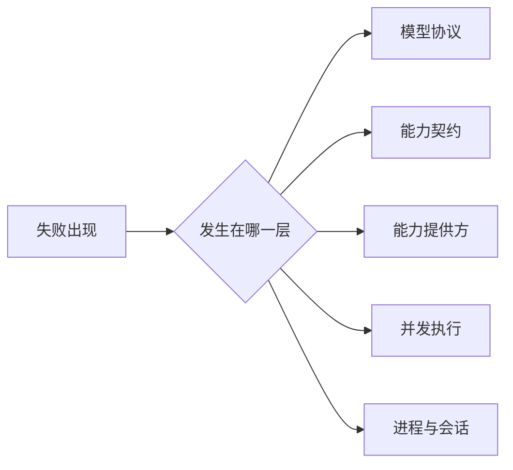
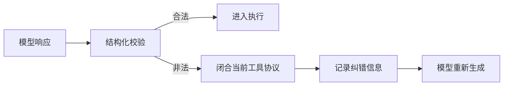
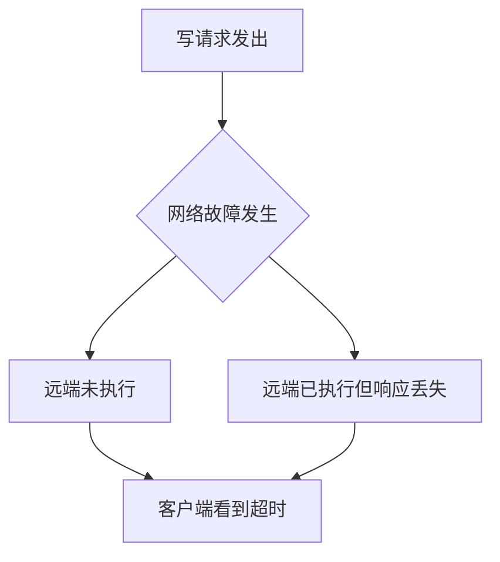
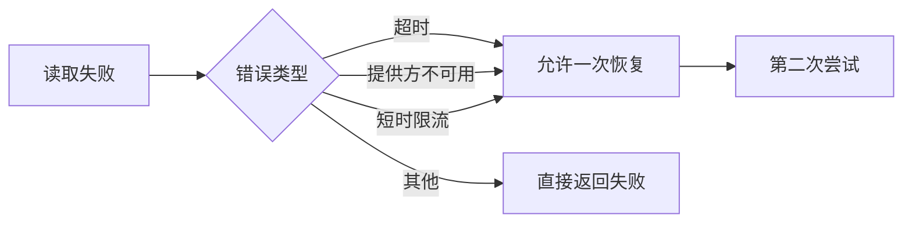
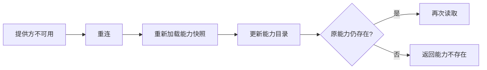
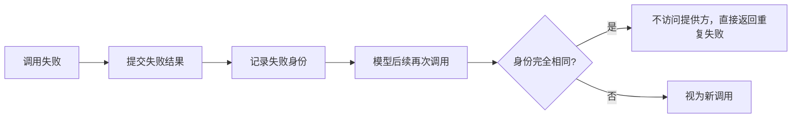
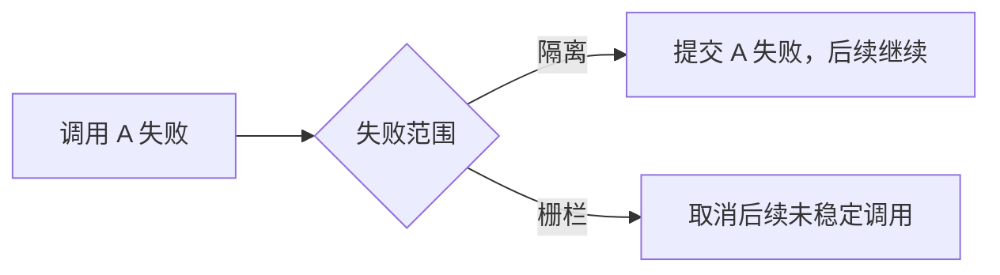
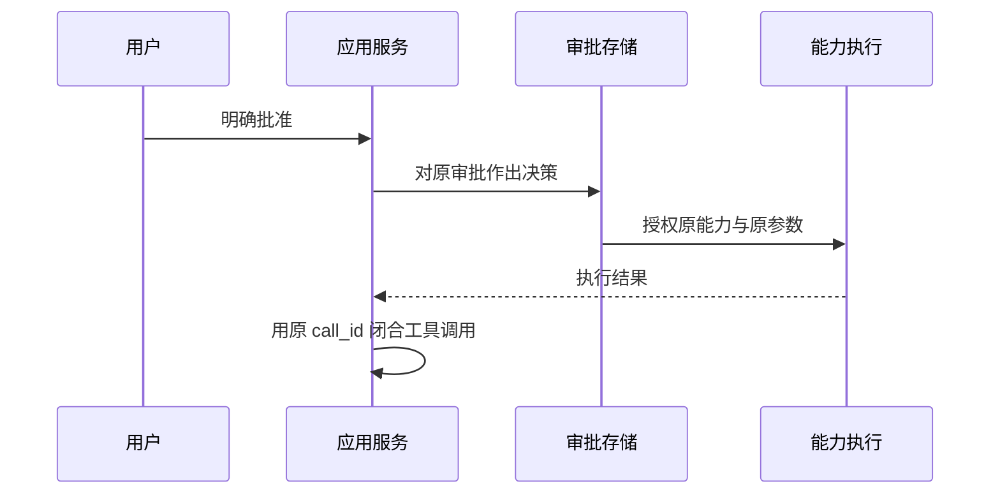

# 03 异常、失败隔离与恢复：先判断“发生了什么”，再决定“能不能继续”

## 本章先回答什么

异常处理最容易写成“失败就重试”。GitAgent 不能这样做。

一次读取超时和一次远端写入超时，异常名字可能一样，事实状态却不同。读取可以重新查询；写入可能已经执行，只是响应丢失。模型参数错误可以要求模型重写；运行时内部关联错误则说明系统不变量已经破坏，不能继续交给模型尝试。

所以这一章的主线不是错误类型列表，而是：**失败发生在哪一层，系统掌握了多少事实，这些事实允许它采取什么恢复动作。**

### 本章的 STAR 主线

| 阶段 | 本章要解决的问题 |
|---|---|
| 情境 S | 模型、能力契约、能力提供方、并发批次和进程生命周期都会失败，但副作用语义不同 |
| 任务 T | 为每类失败定义边界，保证只有能够证明安全的情况才恢复 |
| 行动 A | 失败分类 → 结构化错误 → 副作用判断 → 局部恢复或失败栅栏 → 等待快照恢复 → 中断修复 |
| 结果 R | 读取可以获得有限自愈能力，写入不会因网络故障重复执行，恢复路径也不会绕过原运行时约束 |

---

## 1. 情境：为什么“统一重试器”会制造错误

先看四个看起来都像“失败”的场景。

| 场景 | 表面现象 | 正确动作 |
|---|---|---|
| 模型写错工具参数 | 调用没有发生 | 把协议错误反馈给模型，让它重写 |
| 文件读取超时 | 没拿到数据 | 可以在限定条件下再读一次 |
| GitHub 写入超时 | 没拿到成功响应 | 不能自动重试，副作用可能已经发生 |
| 暂停审批后进程退出 | 内存运行时消失 | 从持久化状态恢复原调用 |

如果都套一个“捕获异常—重试三次”，最后一类写入错误可能被重复执行，第一类模型错误会白白重打外部请求，进程恢复也会被误解成调用重试。

GitAgent 因此先给失败划边界。

---

## 2. 任务：失败处理需要维护哪些不变量

异常恢复不是“尽量让任务成功”。GitAgent 更在意四个不变量。

| 不变量 | 含义 |
|---|---|
| 不重复未知副作用 | 写操作结果不确定时，不通过自动重试制造第二次写入 |
| 不伪造成功状态 | 没有得到合法输出、没有完成恢复，不推进对应状态 |
| 不让失败越过顺序边界 | 排他调用失败后，后续调用不能假装前提仍成立 |
| 不让恢复改变原调用身份 | 审批和用户输入恢复必须继续原 `call_id` 和原计划 |

这四条原则贯穿后面的所有错误处理。

---

## 3. 第一层：模型协议错误为什么可以“让模型重写”

模型可能产生以下错误：

- 工具名称不存在；
- 同一响应重复 `call_id`；
- 调用数量超过限制；
- 子代理参数不符合结构；
- 专用结束动作使用方式错误。

这些错误发生在外部动作执行前，属于“模型输出不符合协议”。

这里有一个容易忽略的细节：**纠错前必须先闭合已经出现的工具调用。**

如果模型已经输出一条助手工具调用，再直接追加普通纠错消息，历史里会留下一个没有工具结果的半开调用。后续模型请求和持久化重放都会失去协议完整性。

所以 GitAgent 为无法执行的调用写入失败结果，再给模型有限纠错机会。

超过纠错次数，本次代理运行失败。

---

## 4. 第二层：能力错误为什么要统一成稳定语义

外部提供方可能抛出文件异常、网络异常、HTTP 错误、MCP 错误、子进程错误。上层如果直接处理这些原始异常，就会和每种实现绑定。

能力层把它们归一成一组稳定错误语义。

| 错误语义 | 说明 |
|---|---|
| 能力不存在 | 当前能力目录里没有这项能力 |
| 权限拒绝 | 调用不符合当前代理权限 |
| 输入非法 | 模型参数不满足能力契约 |
| 输出非法 | 提供方返回值不满足能力契约 |
| 资源不存在 | 文件、议题或其他目标不存在 |
| 冲突 | 当前远端状态和预期状态不一致 |
| 提供方不可用 | 服务断连或暂时不可达 |
| 认证失败 | 当前凭据无效 |
| 超时 | 请求没有在期限内得到确定结果 |
| 限流 | 外部服务要求降低调用速度 |
| 执行失败 | 提供方明确返回失败 |
| 执行结果不确定 | 写请求可能已经产生副作用，但客户端无法确认 |

统一后的错误不再描述“哪个库抛了什么异常”，而是描述**运行时已经知道什么**。

---

## 5. 最关键的分界：读取超时和写入超时不是同一件事

假设同样发生网络超时。

### 读取调用

读取没有远端副作用。第一次请求失败后，再查询一次不会复制业务动作。

### 写入调用

请求可能已经到达远端。客户端只是没有得到响应。

客户端看到的都是“超时”，却无法区分 C 和 D。

这时系统最重要的动作不是“提高成功率”，而是保留不确定性。

GitAgent 使用“执行结果不确定”表达这种状态，并禁止普通自动重试。

这也是异常设计里最值得记住的一条：**网络失败不等于业务动作没有发生。**

---

## 6. 哪些读取错误允许恢复

GitAgent 对读取能力只开放很窄的恢复窗口。

恢复规则不是“读取就重试很多次”。本次能力调用总尝试次数有上限。

限流还要求提供方给出的等待时间足够短。较长等待直接返回失败，让代理或用户决定后续动作。

GitAgent 是交互运行时，不把一个用户轮次变成长时间后台排队任务。

---

## 7. 提供方断连后，恢复为什么包含“重连 + 刷新能力”

一个远程 MCP 服务断连后重新连接，工具列表可能已经变化。

所以提供方不可用的恢复不是：

> 重新建立 socket，然后原调用再来一次。

而是：

这保证第二次调用使用的是当前有效绑定，而不是重连前的旧工具描述。

恢复对象因此有两层：连接状态和能力契约。

---

## 8. 输出校验失败为什么是另一类危险状态

提供方执行成功，只代表底层动作没有抛异常。GitAgent 还要检查返回值是否满足能力输出结构。

如果读取能力返回非法结构，本次数据不可用。

如果写能力返回非法结构，事情更复杂：**动作可能已经执行，只是系统无法正确解释返回结果。**

| 能力类型 | 输出校验失败的含义 | 是否自动重试 |
|---|---|---|
| 读取 | 本次读取结果无法使用 | 否，除非前面属于明确可恢复提供方错误 |
| 写入 | 动作可能已经发生，但结果无法验证 | 否 |
| 破坏性操作 | 副作用可能已经发生，风险更高 | 否 |

所以能力错误中会保留“提供方已经执行”和“可能存在副作用”等信息。

“返回值坏了”和“动作没发生”是两个不同事实。

---

## 9. 内部不变量错误为什么不能交给模型处理

外部能力失败可以转成结构化错误，让代理调整计划。

另一些错误说明 GitAgent 自己的状态已经不可信，例如：

- 能力绑定指向错误提供方；
- 结果 `call_id` 与原调用不一致；
- 一个结果声称属于另一项能力；
- 恢复快照和未闭合工具调用无法对应；
- 调度器得到不可能的结果对象。

这类错误不是“工具执行失败”，而是运行时不变量被破坏。

系统会让它向上终止当前运行，而不是包装成普通工具失败让模型继续猜。

可以用一句话区分：

> 外部世界失败，可以结构化；内部状态失真，必须停止。

---

## 10. 模型重复撞同一错误，为什么要两层保护

模型可能出现两种重复模式。

### 短循环

刚收到某个失败结果，下一步立刻发出完全相同调用。

结构化调用调度器会比较最近一次能力调用。连续相同调用会得到“重复调用”，继续重复则升级成“重复失败”。

### 长循环

模型隔了几步之后又回到同一能力和同一参数。

能力层使用本次 `run_id` 的失败调用保护。调用身份由“代理 + 能力 + 规范化参数”组成。

真实验证命令是特殊情况。代码修改后再次运行同一测试命令是合理行为，因为工作树版本已经变化。

---

## 11. 为什么失败保护必须在“提交”时更新

并发执行中，工作线程完成顺序可能不是模型调用顺序。

假设模型顺序是 A、B，B 先失败。

如果 B 的工作线程一结束就把失败身份写入全局保护状态，系统会提前让“B 已失败”影响后续逻辑，但代理消息中 A 还没有提交。

GitAgent 选择在有序提交阶段更新失败保护。

| 状态 | 更新时机 |
|---|---|
| 工具结果 | 有序提交 |
| 失败调用保护 | 有序提交 |
| 读取缓存 | 有序提交 |
| 审计 | 有序提交 |

这样所有运行时权威状态共享同一条逻辑时间线。

---

## 12. 并发批次里的失败为什么还要区分“隔离”和“栅栏”

一个调用失败后，后面的调用是否还能继续，不只取决于错误类型，还取决于调用之间的执行语义。

### 隔离失败

适合独立读取。

A 读文件失败，不代表 B 读另一个文件没有意义。A 的失败结果提交后，B 可以继续。

### 栅栏失败

适合排他写操作或未知副作用调用。

A 是前置写操作，B 的意义建立在 A 成功基础上。A 失败后，B 不能跨过失败继续运行。

失败传播因此是调度语义的一部分，而不是能力层单独决定。

---

## 13. 运行时中断和普通调用失败为什么处理方式不同

普通调用失败可以成为一个结果对象，再由提交阶段处理。

进程级中断、线程池异常或更高层取消则代表“整个执行范围正在被终止”。

这时并发协调器要做四件事：

1. 标记当前执行范围取消；
2. 取消还没有开始的任务；
3. 唤醒等待资源锁的线程；
4. 等待已经开始的工作停止。

最后一步很重要。

假设上层已经准备删除代码工作树，而某个工作线程还在这个目录里执行命令。只发出取消信号，没有等线程真正静止，清理和副作用会发生竞态。

所以“发出取消”不等于“系统已经安全停止”。

---

## 14. 审批等待恢复为什么不是“重新执行上一句话”

一个远端写调用需要审批时，提供方还没有执行。

运行时保存的是一份明确计划：审批编号、原 `call_id`、能力编号、参数和顺序。

用户批准后：

系统不会重新让模型生成写参数。

因为用户批准的是一个已经看过的计划，不是“允许模型再想一个动作”。

---

## 15. 用户输入等待恢复和审批恢复有什么区别

普通用户输入等待没有写计划。

代理只是需要用户补充信息。运行时保存问题和等待调用编号。

下一轮用户回答到达后，系统把回答作为原等待调用的工具结果，再继续该代理。

| 等待类型 | 保存的关键状态 | 恢复后发生什么 |
|---|---|---|
| 审批 | 精确写计划、审批编号、原调用 | 执行或拒绝原计划 |
| 普通用户输入 | 问题、原等待调用 | 把回答交回原代理 |

两者都不重新路由主代理。

---

## 16. 为什么只有“明确等待”可以跨进程继续

应用服务只在代理树处于合法等待边界时保存可恢复快照。

普通执行到一半进程退出，系统并不知道某个外部调用有没有完成，也没有稳定恢复点。这种轮次不会自动续跑，而会在启动时标记为中断。

对比来看：

| 状态 | 是否可恢复 | 原因 |
|---|---|---|
| 正在等待审批 | 可以 | 提供方尚未执行，原计划完整 |
| 正在等待用户回答 | 可以 | 原等待问题和调用身份完整 |
| 执行工作线程中途退出 | 不直接恢复 | 外部副作用状态可能不确定 |
| 普通轮次停在任意代码位置 | 不直接恢复 | 没有显式运行时边界 |

这是一种保守恢复策略：只恢复能够证明状态完整的暂停点。

---

## 17. 暂停快照恢复时为什么要重新做一致性检查

保存过的状态也不能被无条件信任。

恢复时会重新检查：

- 根代理是不是主代理；
- 父子代理拓扑是否正确；
- 仓库身份是否一致；
- 子代理是否对应父线程中的未闭合调用；
- 待用户输入是否对应原等待工具；
- 未提交能力结果是否和原能力、参数、`call_id` 一致；
- 待审批写计划是否仍等于当前结构化业务产物推导出的计划。

特别是写计划，会重新计算再比较。

这保证“恢复”不是一条绕开首次执行安全检查的捷径。

---

## 18. 会话和事件历史怎样处理进程中断

GitAgent 的业务轮次状态存放在数据库，模型和工作流历史存放在追加式事件文件。

进程退出时可能出现两类不完整状态。

### 数据库仍显示轮次运行中

服务启动后把这类轮次标记为中断，并写入对应失败终态。

系统不会把这类中断推定为成功。

### 数据库已有终态，但事件历史缺少终止标记

系统可以根据数据库权威状态补齐事件历史终态。

这里的恢复依据很清楚：数据库回答“这一轮最终是什么状态”，事件历史回答“按顺序发生了什么”。

---

## 19. 事件文件为什么只修复损坏尾部

JSONL 事件文件可能在写最后一行时进程退出。

如果只有最后一条事件不完整，前面完整前缀仍然可以证明有效。系统可以把坏尾部截掉，再继续追加。

如果中间一行损坏，后面的事件可能依赖它。跳过中间损坏会伪造一段连续历史。

因此：

| 损坏位置 | 处理 |
|---|---|
| 文件最后一条半写事件 | 保留完整前缀，可截断坏尾部 |
| 中间事件损坏 | 整体报错，不跳过 |

GitAgent 只修复能够从已有完整前缀证明的中断痕迹。

---

## 20. 长期记忆失败为什么不影响已经完成的业务轮次

长期记忆提取发生在业务轮次完成之后。

它失败时：

- 业务回复不回滚；
- 已执行的 GitHub 动作不回滚；
- 提取完成游标不推进；
- 待处理游标保留；
- 后续轮次可以补做。

这是另一种失败隔离：**派生任务失败，不污染已经提交的主业务状态。**

记忆整理也是同样原则。整理失败时维护进度不推进。

---

## 21. 用一条错误链把整章串起来

假设合并请求代理读取持续集成状态后，准备执行合并。

### 场景一：读取工作流状态超时

这是读取能力。错误属于可恢复范围，系统允许一次重新读取。

### 场景二：合并调用需要审批

能力层没有执行远端动作，只返回待审批状态。运行时保存原计划。

### 场景三：用户批准后执行合并，但网络超时

这是破坏性操作。系统无法证明远端没有执行，错误进入“执行结果不确定”。不会自动再发一次合并。

### 场景四：进程随后退出

该写调用已经进入不确定失败，不属于可安全恢复的审批等待。会话恢复不会把它当成“继续执行一次合并”。

四个阶段使用的是四种完全不同的恢复语义。

---

## 22. 结果：GitAgent 的异常系统真正换来了什么

| 设计 | 得到的结果 |
|---|---|
| 模型协议错误独立处理 | 格式问题可以纠正，不污染外部调用 |
| 能力错误统一语义 | 上层不依赖各提供方异常类型 |
| 读取和写入使用不同恢复策略 | 不用成功率换副作用安全 |
| 写入保留“结果不确定” | 网络失败不会被错误解释成“没有执行” |
| 失败范围进入并发调度 | 一个失败只影响应该被影响的后续调用 |
| 等待状态结构化持久化 | 用户可以跨轮批准或补充信息 |
| 恢复重新校验原计划 | 持久化状态不能修改写入对象 |
| 派生任务失败隔离 | 长期记忆等维护任务不回滚业务结果 |

代价是错误处理路径比普通异常捕获复杂很多。系统需要维护统一错误语义、执行尝试数、失败范围、等待快照和恢复校验。

这部分复杂度换来的是：**系统不会因为“想自动恢复”而制造第二次未知副作用。**

---

## 23. 复习时怎样讲这一章

可以按下面顺序复述：

1. GitAgent 先区分模型协议、能力契约、提供方、并发和进程生命周期五类失败；
2. 模型协议错误没有副作用，可以闭合工具协议后让模型重写；
3. 外部提供方错误统一成稳定能力错误；
4. 读取超时可以有限恢复，写入超时可能是“已经执行但响应丢失”，所以不能自动重试；
5. 输出校验失败也不能证明写操作没有发生；
6. 并发失败用隔离和栅栏控制传播；
7. 只有审批和用户输入这类显式等待点可以跨进程恢复；
8. 恢复时重新校验代理树和写计划，普通半截轮次只标记为中断。

## 24. 代码定位

| 想核对的问题 | 代码位置 |
|---|---|
| 模型协议错误、重试、失败和恢复 | `gitagent/agent_loop/loop.py` |
| 能力错误分类和提供方异常归一 | `gitagent/capability/errors.py` |
| 读取恢复、失败调用保护 | `gitagent/capability/layer.py` |
| 并发失败范围和取消 | `gitagent/harness/execution.py` |
| 重复调用、审批恢复、受保护写调用 | `gitagent/harness/structured_call_dispatcher.py` |
| 暂停代理树怎样序列化和恢复 | `gitagent/application/service.py` |
| 业务轮次中断怎样修复 | `gitagent/infra/persistence/sessions.py` |
| 事件坏尾部怎样处理 | `gitagent/infra/persistence/event_log.py` |
| 长期记忆失败怎样保留游标 | `gitagent/memory/hooks.py` |
