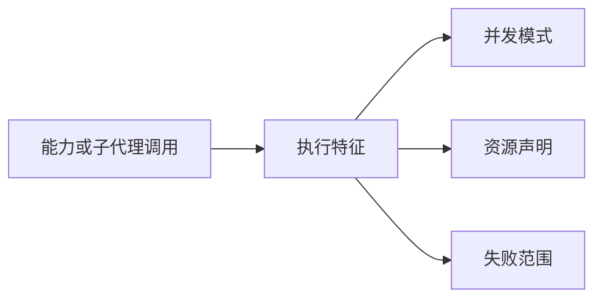
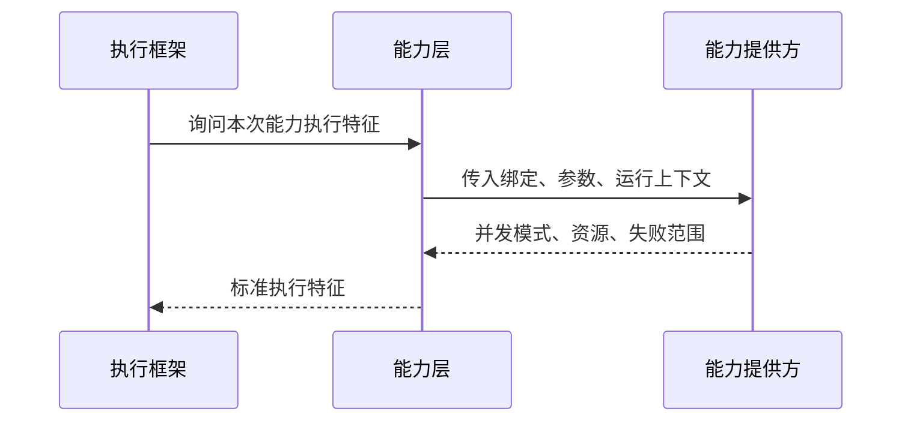
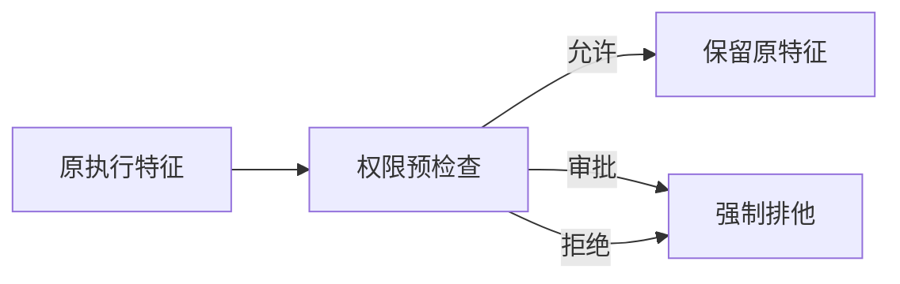
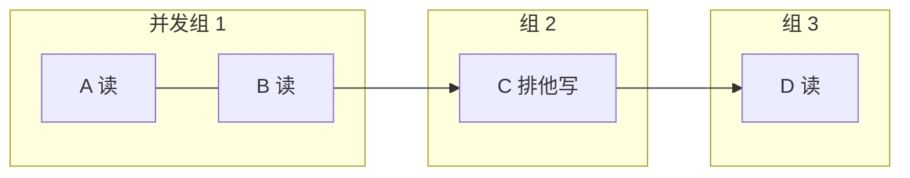
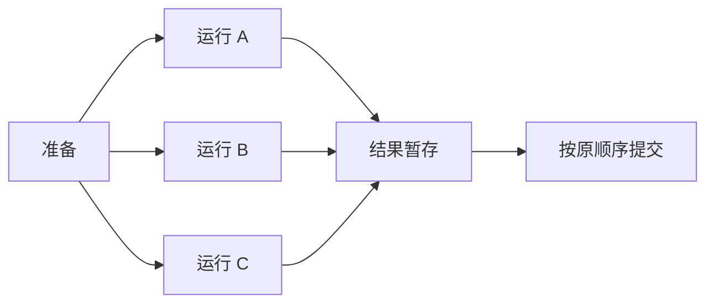
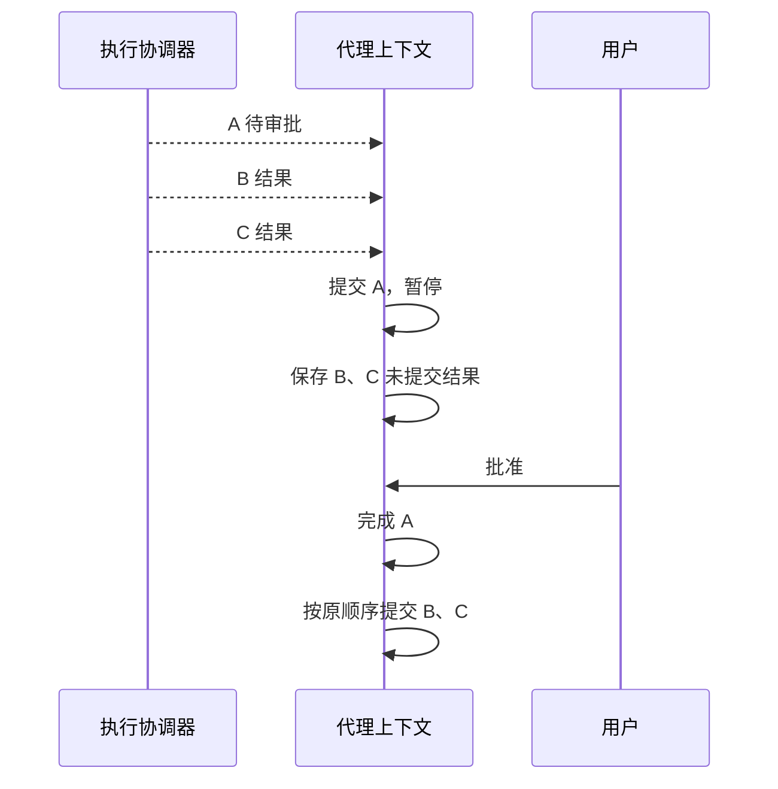
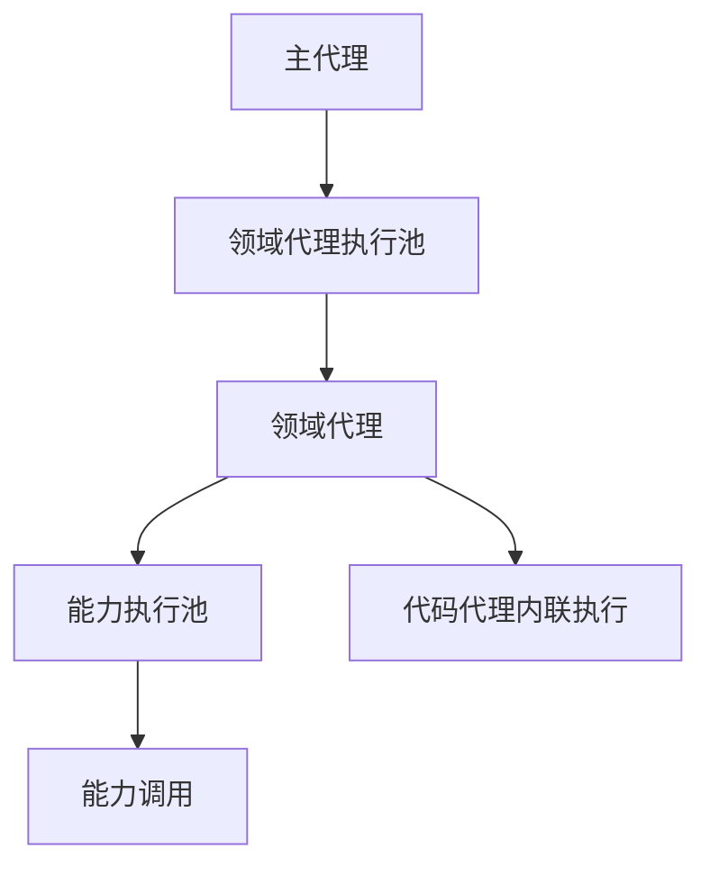
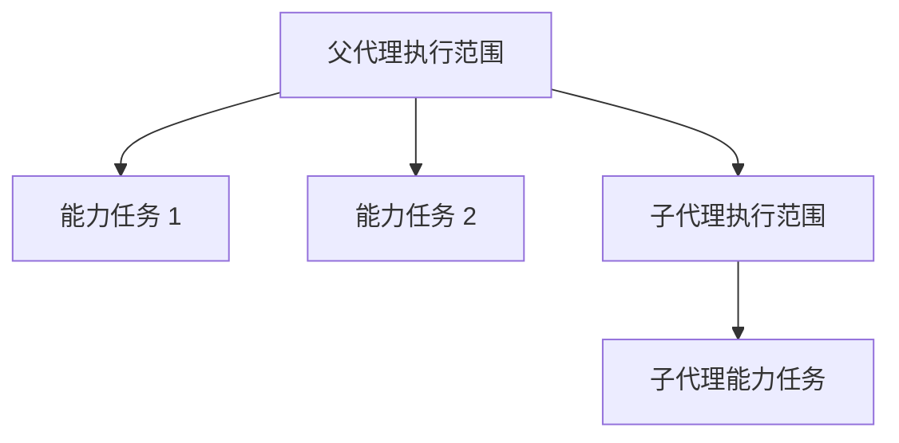

# 04 并发调度：让调用并行，但不让状态乱序

## 本章先回答什么

GitAgent 一次模型响应可能返回多个工具调用。全部串行最安全，但多个独立读取会互相等待。全部扔进线程池最快，却会遇到资源冲突、审批顺序、失败传播和恢复问题。

所以并发模块真正要解决的不是“怎样多线程”，而是：**怎样判断哪些调用可以同时做，怎样保证它们完成后仍按模型原顺序进入运行时状态。**

### 本章的 STAR 主线

| 阶段 | 本章要解决的问题 |
|---|---|
| 情境 S | 多调用串行影响吞吐，盲目并发又会破坏资源一致性和工具协议顺序 |
| 任务 T | 在不改变模型逻辑顺序的前提下，最大化连续兼容调用的并发 |
| 行动 A | 为调用生成执行特征 → 连续分组 → 资源与提供方准入 → 并发运行 → 顺序提交 → 等待暂存 → 失败和取消传播 |
| 结果 R | 独立读取能够并发，写操作和未知调用保持保守边界，暂停和恢复仍能维持原调用顺序 |

---

## 1. 情境：为什么“线程池 + Future”还不够

普通线程池只关心任务什么时候开始、什么时候完成。

代理运行时还要回答更多问题。

| 问题 | 普通线程池是否回答 |
|---|---|
| A 和 B 是否访问同一个仓库资源 | 否 |
| 某个提供方最多允许多少并发 | 否 |
| A 失败后 B 是否还能继续 | 否 |
| B 先完成，能否先写工具结果 | 否 |
| A 等审批时，B 已完成结果放哪里 | 否 |
| 父代理取消时，子代理和资源等待线程怎样停 | 否 |

因此 GitAgent 把“执行一个调用”分成语义描述、物理运行和逻辑提交三个层次。

---

## 2. 任务：调度器需要一套统一语言

调度器不能认识所有业务工具。它不应该知道“读文件”和“合并请求合并”分别是什么意思。

所以每个调用在进入调度器之前，都会得到一份执行特征。

### 执行特征的三部分

| 部分 | 回答的问题 |
|---|---|
| 并发模式 | 这个调用本身是否允许和其他调用同组运行 |
| 资源声明 | 它会读哪些逻辑资源，写哪些逻辑资源 |
| 失败范围 | 失败后只影响自己，还是要阻断后续调用 |

这三部分组成调度器的统一判断依据。

---

## 3. 并发模式为什么有“未知”这一类

调用可以分成可并发、排他和未知三类。

### 可并发

本次调用可以与资源兼容的其他调用同时运行。

### 排他

本次调用形成明确顺序边界。

### 未知

系统无法证明这项调用安全并发。

未知不是“先试试看”。它会按保守方式处理：使用更强资源声明和失败栅栏。

这体现一条原则：**并发是优化，不是正确性的前提。无法证明安全时，放弃优化。**

---

## 4. 资源声明为什么比“工具白名单”更重要

如果只按工具名规定“所有读取并发、所有写入串行”，粒度太粗。

GitAgent 使用逻辑资源键。

一份资源声明包含读取集合和写入集合。

| A | B | 同一资源是否冲突 |
|---|---|---|
| 读 | 读 | 不冲突 |
| 读 | 写 | 冲突 |
| 写 | 读 | 冲突 |
| 写 | 写 | 冲突 |

资源不一定是文件。它可以表示：

- 一个仓库；
- 一个共享仓库镜像；
- 一个工作区；
- 一个远端实体；
- 提供方定义的其他逻辑范围。

例如多个代码任务可以拥有不同工作树，但它们创建和删除工作树时都会修改同一仓库镜像的 Git 元数据，所以这些操作声明同一个“仓库缓存写资源”。

调度器不需要理解 Git worktree，只需要处理资源冲突。

---

## 5. 谁来决定资源声明

资源语义离具体能力最近，因此主要由能力提供方描述。

如果提供方没有描述能力，或者描述过程报错，能力层返回未知模式。

这让调度器保持通用：业务系统知道“我会碰哪些资源”，调度器只知道“这些资源是否冲突”。

---

## 6. 权限为什么也会改变调度结果

能力提供方可能把某项调用描述为可并发。

但如果权限层判断它需要审批，调用必须成为顺序边界。

原因很简单：后续调用不能在用户还没有批准前跨过这项动作。

被拒绝的调用也形成边界，因为后续调用不能在权限失败尚未进入历史时继续推进。

这说明权限不只是“执行前检查”，它还参与调用顺序。

---

## 7. 为什么只并发“连续兼容”的调用

假设模型给出 A、B、C、D。

A、B 是独立读取；C 是排他写；D 又是独立读取。

调度器不会把 D 提前到 C 前面，即使 D 和 A、B 完全无资源冲突。

原因是模型调用顺序本身具有语义。

C 可能需要审批，也可能失败形成栅栏。让 D 跨过 C 提前执行，相当于调度器自行重写了模型计划。

GitAgent 因此只做“连续兼容区间”的局部并发，不做全局任务图重排。

---

## 8. 一个执行组怎样真正跑起来

调用组进入执行后，还不是直接提交线程池。

每个调用要经过准备、运行、提交三段。

| 阶段 | 典型工作 | 会不会产生代理权威状态 |
|---|---|---|
| 准备 | 关联校验、缓存判断、文件未读区间、受保护调用预检查 | 不会 |
| 运行 | 调用能力提供方或推进子代理 | 只得到结果对象 |
| 提交 | 写消息、观察、缓存、失败保护、审计、等待 | 会 |

最重要的一句话是：**工作线程完成，不等于这项结果已经进入代理历史。**

---

## 9. 为什么完成顺序和提交顺序必须分开

模型顺序：A → B → C。

线程完成顺序可能是：C → A → B。

如果结果按线程完成顺序写回消息，下一轮模型看到的历史就会被底层调度改变。

有序提交维护的不只是消息显示顺序。

| 状态 | 为什么依赖有序提交 |
|---|---|
| 工具结果 | 要与助手工具调用组保持一致 |
| 失败保护 | 只记录代理已经实际观察到的失败 |
| 读取缓存 | 避免后完成结果提前影响前调用 |
| 工作树版本 | 修改顺序必须与代理历史一致 |
| 审计 | 审计顺序要反映逻辑调用顺序 |
| 审批 | 等待边界不能被后续结果越过 |

这就是 GitAgent 能安全使用并发的基础。

---

## 10. 前置调用进入审批，后置调用已完成怎么办

这是并发模块最能体现工程复杂度的场景。

模型同一轮调用 A、B、C。

- A 需要审批；
- B、C 已经在线程里执行完成。

A 在提交时进入等待。B、C 不能继续提交。

如果丢掉 B、C，恢复后需要重复执行；如果直接提交，它们越过了 A。

GitAgent 选择把 B、C 放入未提交结果集合。

未提交结果还能进入暂停快照，所以进程重启后也不会丢。

---

## 11. 为什么资源锁之外还需要提供方并发限制

资源冲突回答“语义上能不能同时做”。

提供方并发限制回答“执行容量上允许同时做多少”。

两者不同。

| 限制 | 控制什么 | 例子 |
|---|---|---|
| 资源声明 | 是否访问冲突状态 | 两个调用同时修改同一仓库缓存 |
| 提供方并发限制 | 外部服务或本地执行容量 | MCP 服务最多同时承受若干请求 |

一个调用进入真实运行前，需要同时满足两类准入条件。

即使资源不冲突，提供方已经达到并发上限时也要等待。

即使提供方有空闲名额，资源冲突时也不能执行。

---

## 12. 资源准入为什么需要有序等待

普通互斥锁能阻止同时写，但可能产生长期饥饿。

例如不断有新的读取到来，一个等待写入可能一直抢不到机会。

GitAgent 给资源申请分配顺序编号，并用条件变量管理等待队列。

一个申请只有在：

1. 队列前方没有需要优先处理的冲突申请；
2. 当前活跃读取和写入与本申请兼容；

时才能进入。

这让资源准入拥有相对稳定顺序，也方便取消时唤醒等待线程。

---

## 13. 为什么能力调用和领域代理使用不同执行通道

领域代理本身还会继续调用能力。

如果所有事情共享同一个固定线程池，可能出现：

1. 多个领域代理占满全部工作线程；
2. 每个领域代理都在等待内部能力调用；
3. 能力调用没有线程可以执行；
4. 整个池发生饥饿。

GitAgent 因此把领域代理和能力调用放在不同执行池中。

代码代理处于固定最深层，可以使用内联执行方式，减少一层线程池嵌套。

固定代理深度和执行通道设计是配套的。

---

## 14. 失败范围怎样影响批次后半段

执行结果提交时，协调器还要看该调用的失败范围。

### 隔离失败

独立调用失败，只提交本次失败结果。后续调用仍可继续。

### 栅栏失败

当前调用失败后，后续未稳定调用被取消。

| 调用类型 | 常见失败范围 |
|---|---|
| 独立读取 | 隔离 |
| 排他调用 | 栅栏 |
| 未知调用 | 栅栏 |
| 需要审批或被拒绝的边界调用 | 顺序边界 |

失败栅栏不是“所有后续线程立刻消失”，而是让后续调用不能继续成为有效运行时状态。

---

## 15. 取消为什么需要一棵树

一次代理运行可能是嵌套的。

父代理被取消时，系统需要同时处理：

- 父范围自己的工作任务；
- 活跃子代理；
- 子代理内部能力；
- 正在等待资源的线程。

所以协调器维护父子取消句柄。

父句柄取消后，会递归取消子句柄，并唤醒资源等待者。

这种设计把取消关系映射到代理调用树，而不是让每个业务模块自己查找线程。

---

## 16. 为什么取消后还要等待“静止”

向 Future 发出取消只对尚未开始任务可靠。

已经进入能力提供方的工作可能继续运行。

GitAgent 在高层中断时会等待这些已启动工作结束，再把中断交给上层清理。

这一步叫“到达静止点”更容易理解。

没有这一步，工作树删除、连接关闭和后台副作用可能同时发生。

---

## 17. 代码工作树为什么也进入统一资源系统

代码工作区使用共享仓库镜像和独立工作树。

每个任务自己的文件目录独立，但 Git 的 worktree 元数据属于共享镜像。

所以创建、抓取、增加工作树、移除和清理时，会申请同一仓库缓存写资源。

| 操作 | 是否需要共享仓库缓存锁 |
|---|---|
| clone / fetch | 需要 |
| worktree add / remove / prune | 需要 |
| 独立工作树内普通文件编辑 | 不需要长期持有 |

这样多个代码任务既能复用仓库对象，又不会并发破坏共享 Git 元数据。

---

## 18. 用一个完整批次把整章串起来

假设仓库代理一轮提出四个动作：

A：读取 `a.py`  
B：读取 `b.py`  
C：提交默认分支修改  
D：读取 `c.py`

### 第一步：生成执行特征

A、B 是独立读取，可并发；C 是远端写，需要审批；D 又是读取。

### 第二步：连续分组

A、B 形成第一组；C 自己形成排他组；D 位于 C 后面，不能提前。

### 第三步：执行 A、B

两个读取同时进入提供方容量和资源准入。线程完成顺序不重要。

### 第四步：提交 A、B

结果仍按 A、B 顺序进入代理上下文。

### 第五步：C 进入审批

C 形成明确等待边界。D 不会跨过去执行。

### 第六步：用户批准

C 使用原参数执行并提交。代理循环才继续处理 D。

整个过程既获得前两个读取的并发收益，也没有改变模型计划顺序。

---

## 19. 结果：并发模块最终保证了什么

| 设计 | 得到的结果 |
|---|---|
| 调用先获得执行特征 | 调度器不用理解每个业务工具 |
| 资源读写声明 | 并发判断从工具名升级为语义冲突判断 |
| 未知调用保守处理 | 无法证明安全时不会误并发 |
| 只并发连续兼容调用 | 不重排模型计划 |
| 运行和提交分离 | 线程可以乱序完成，运行时状态保持有序 |
| 未提交结果暂存 | 审批暂停不会丢掉后置已完成工作 |
| 提供方容量与资源锁分层 | 业务冲突和执行容量分别控制 |
| 父子取消树 + 静止等待 | 清理前确保后台副作用已经停止 |

代价是调度器比普通线程池多维护执行特征、资源队列、未提交结果和取消树。

GitAgent 接受这部分复杂度，因为它需要的不是“跑得并行”，而是**并行以后系统状态仍然和串行语义一致。**

---

## 20. 复习时怎样讲这一章

可以按下面顺序复述：

1. 一次模型响应有多个调用，串行浪费读取并发，盲目并发会破坏状态顺序；
2. 每个调用先获得执行特征：并发模式、资源声明、失败范围；
3. 提供方描述资源语义，无法描述时按未知模式保守处理；
4. 调度器只把连续兼容调用放进同一组，不做全局重排；
5. 能力调用分准备、运行、提交，工作线程可以乱序完成，但提交必须按模型顺序；
6. 前置调用等待时，后置已完成结果进入未提交集合；
7. 提供方并发限制控制容量，资源声明控制业务冲突；
8. 高层取消沿父子执行树传播，并等待工作线程静止后再清理。

## 21. 代码定位

| 想核对的问题 | 代码位置 |
|---|---|
| 执行特征、资源声明、失败范围、取消和线程池 | `gitagent/harness/execution.py` |
| 代理调用批次怎样交给协调器 | `gitagent/agent_loop/loop.py` |
| 能力权限怎样改变执行特征 | `gitagent/harness/structured_call_dispatcher.py` |
| 准备、执行、提交和未提交结果 | `gitagent/harness/context/state.py` |
| 提供方怎样描述本次调用资源 | `gitagent/capability/layer.py`、`gitagent/capability/providers/` |
| 共享仓库镜像怎样申请资源 | `gitagent/harness/coding_workspace.py` |
