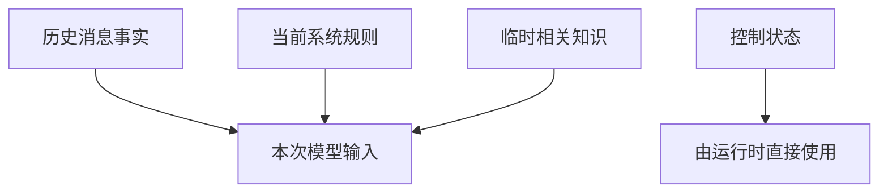
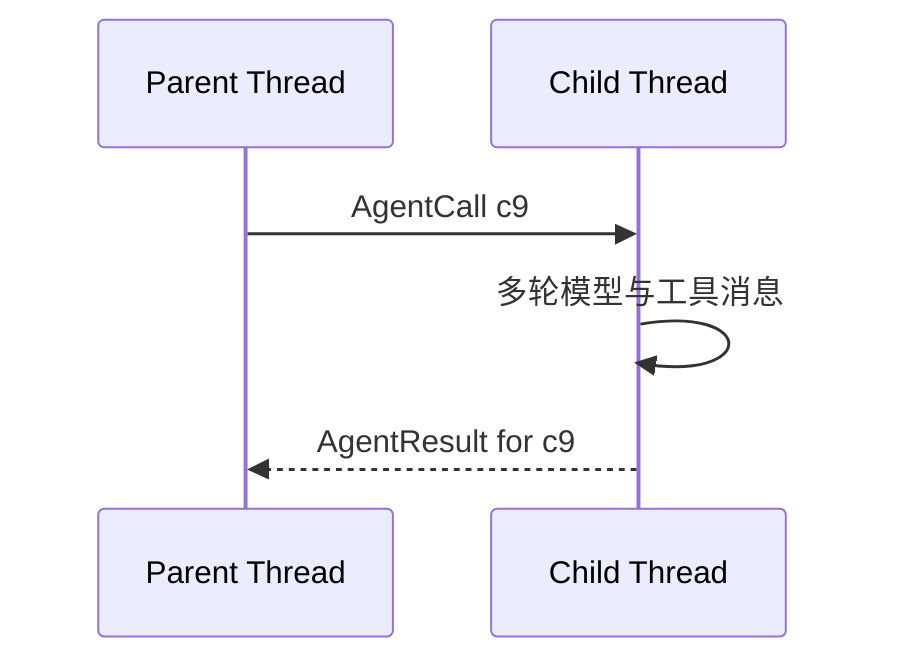
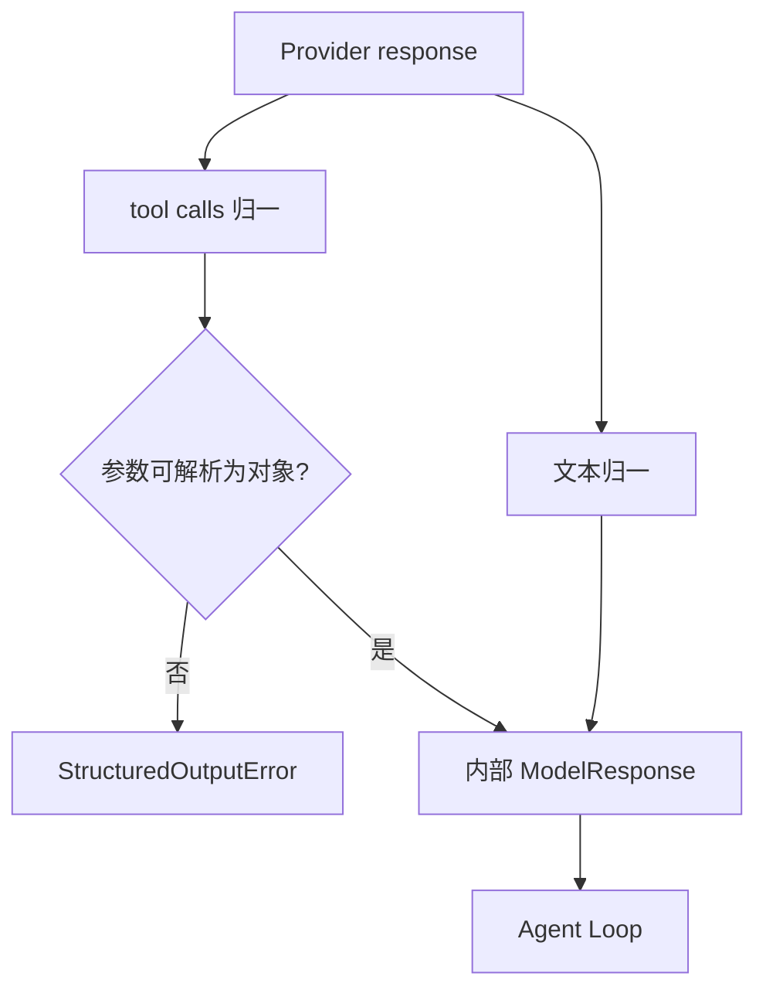

# 04 模型与上下文协议：模型真正看到什么，返回什么才能被运行时接住

上一章已经知道 Agent Loop 会不断请求模型并解析 StructuredCall。本章继续沿这条链往前看：**一次模型请求是怎样构造出来的，为什么同一个 AgentContext 不会原样塞进模型，模型响应又怎样从提供方格式变成运行时可以消费的决定。**

本章只讲“请求和响应的协议”。上下文压缩算法、文件读取缓存放在第 10 章。

---

## 1. 先看模型边界的设计

一次模型交互可以分成四段。

这四段各自回答不同问题：

| 层 | 负责什么 |
|---|---|
| AgentContext | 保存当前运行时状态 |
| Context Builder | 决定这次模型请求应该看到哪些消息、系统规则和临时知识 |
| Chat Client | 处理模型服务请求、响应归一、输出预算和用量 |
| Reasoner | 把响应转换成内部文本/调用，并校验专用结构化结果 |

模型服务并不知道 GitAgent 的 ApprovalStore 或 Coding Workspace。它只接收当前请求中真正发送的消息和工具定义。

---

## 2. AgentContext 不等于模型上下文

AgentContext 里可能保存很多控制状态：当前 worktree revision、审批状态、结构化代码产物、读取覆盖等。这些并不是全部转换成自然语言发给模型。

模型上下文主要由三类内容组成。

### 持久消息事实

用户说过什么、模型调用过什么、工具返回过什么。这些消息需要保留协议关系，可以从事件历史重建。

### 当前系统规则

当前 Agent 的系统 Prompt、角色、当前可见工具和运行边界。恢复旧 Session 时，这一层可以根据当前应用环境重新构造，不必把旧系统 Prompt 当成不可变化的历史事实。

### 临时知识

本轮相关的长期记忆指导、当前引用、按需知识等。这些内容可以进入某一次模型请求，但不必永久复制进聊天历史。

这让“模型要知道的东西”和“运行时要保存的东西”不会被迫使用同一种表示。

---

## 3. 不同 Agent 使用独立消息线程

Main、Domain、Coding Agent 都有自己的消息线程。子 Agent 的内部读取不会自动铺满父 Agent 的历史。

父 Agent 对一次 child 调用只需要保留：

1. 它提出了哪个 AgentCall；
2. 对应 call_id；
3. child 最后返回了什么结果。

child 内部的模型消息仍属于自己的 run_id。

这样父上下文不会因为一个代码审阅读取了几十个文件，就永久携带全部内部工具细节。

---

## 4. 模型请求里的工具列表是运行时先决定的

模型不负责决定自己拥有哪项工具。请求发送前，Harness 已经根据当前 Agent 角色和 Capability 权限生成可见工具集合。

例如 Coding Agent 在 patch 模式可以看到受限本地文件编辑和验证能力，但不会因此看到 GitHub merge。PR Agent 可以看到 PR 领域能力，但不能随意创建新的 Agent 类型。

因此工具定义同时承担两件事：

- 告诉模型“你可以怎样表达下一步动作”；
- 把运行时已经确定的能力边界反映到模型请求里。

不过“模型看不见”只是第一道边界。真正调用时仍会重新做权限检查，不能把 Prompt 或工具隐藏当成唯一安全机制。

---

## 5. 普通文本结束和结构化结果是两种不同契约

有些 Agent 步骤允许模型最后返回普通文本，例如 Main Agent 给用户一个会话回答。

另一些步骤需要程序继续消费结果，例如代码 Review。此时 GitAgent 会要求模型使用专门的结果工具提交结构化对象。

可以把区别理解成：

| 输出形式 | 主要消费者 | 适合场景 |
|---|---|---|
| 普通文本 | 人或上层 Agent | 最终解释、会话表达 |
| 结构化结果 | 确定性程序 | Review、Plan、CI 分析等后续业务判断 |

结构化结果会检查字段类型、必需字段和允许值。如果程序需要 `blocking_issues`，就不应该从“看起来没问题”这句话里重新猜这个字段。

这里的 schema 只证明数据形状满足契约，**不证明模型结论在事实层面一定正确。**事实仍然要由仓库、PR、CI 等证据支撑。

---

## 6. 专用结构化结果为什么要求明确且唯一

当某一步要求提交一个特定结果对象时，运行时会检查模型是否调用了正确的结果函数，并且只有一个最终结果调用。

如果模型同时提交两个互相冲突的 Review 对象，运行时没有业务依据自动挑一个，也不应该自行合并。错误函数名、缺失必需字段或只有普通文本，同样不能当作有效结构化产物。

这并不意味着模型每轮只能调用一个工具。探索阶段仍然可以一次提出多个读取调用；“唯一”约束针对的是某些明确的最终结构化结果。

---

## 7. Provider 响应怎样变成内部 ModelResponse

不同兼容服务会返回不同响应字段。Chat Client 先做一层传输归一：

- 提取自然语言内容；
- 提取每个工具调用的 provider call id；
- 把参数解析成 JSON object；
- 保留必要的提供方扩展字段；
- 记录 provider 提供的 usage。

Reasoner 再把它变成 Agent Loop 认识的内部响应。

参数只是一个字符串但无法解析成对象时，不能直接扔给能力层再碰运气。模型协议在进入执行以前就要先成立。

---

## 8. 为什么还要保留标准助手消息

内部 `StructuredCall` 便于调度，但恢复下一次模型请求时，还需要重建模型原来看到的 assistant message，包括 tool call id 和参数。

所以同一次模型响应有两种用途：

| 表示 | 用途 |
|---|---|
| 内部 ModelResponse / StructuredCall | 运行时执行与调度 |
| 标准化 assistant message | 会话历史、持久化和后续模型协议 |

二者必须指向同一个调用身份。不能执行时生成一个 call_id，持久化时再生成另一个。

这就是第 03 章 call_id 稳定性在模型边界上的起点。

---

## 9. 提供方特有字段只在发送边界适配

当前实现会根据模型端点/名称处理部分兼容字段，例如某些 DeepSeek 兼容请求需要的 `reasoning_content`。

重要的不是某一个字段名称，而是适配发生的位置：**发送模型请求时复制并调整消息，而不是为了某个 provider 改写持久化历史。**

这样同一段会话事实可以在不同请求边界被转换成服务需要的形状，而底层状态仍保持统一。

这只是协议兼容，不表示 GitAgent 能读取或控制模型内部完整推理过程。

---

## 10. Context Window 预算怎样参与模型请求

模型请求不仅包含聊天正文，也包含工具定义。因此预算必须按最终请求估算，而不是只数用户消息。

客户端会估算输入占用，并给输出预留空间。概念上可以理解为：

**可请求输出上限 = 配置的最大输出 与 当前窗口剩余空间 两者中的较小值。**

如果估算以后已经没有任何输出空间，请求不会继续发送。

当前通用估算使用轻量、确定的字节近似，并不是 provider tokenizer 的精确计量。这意味着：

- 请求前估算用于本地预算控制；
- provider 返回的 usage 用于记录服务报告的实际消耗；
- 两者不能混为一个“精确 token 统计”。

当输入本身越来越长时，上下文系统还会执行压缩，具体放到第 10 章。

---

## 11. 模型请求重试和 Agent 纠错不是一回事

一次模型交互可能出现两种看起来都叫“重试”的行为。

### 传输层重试

模型 SDK 对网络错误进行有限重试。当前客户端配置了 SDK 自身的有限重试次数。

### 结构化纠错

模型成功返回了响应，但函数名、参数或结果结构不满足 GitAgent 契约。运行时把错误作为新观察反馈给模型，进入新的 Agent step。

这两类操作的计数、消息和风险都不同。更不能把它们和 GitHub 远端写操作的重试混在一起。模型请求本身只获取一个计划/决定，不等于已经执行了它建议的远端副作用。

---

## 12. 工具缓存、Prompt Cache 和 KV Cache 是三层不同概念

GitAgent 会缓存某些工具读取结果，也会在上下文系统里避免重复文件读取。这只意味着“同一事实不必再次访问文件或网络”。

模型服务可能有自己的 Prompt Cache；推理引擎内部还有 KV Cache。这些都属于另一层。

因此下面三个说法不能互相替换：

1. 工具调用次数减少；
2. 模型输入 token 变少；
3. 模型内部计算被缓存复用。

当前 GitAgent 主要明确控制前两类中的部分机制，并没有因为有文件缓存就等于自己管理了 provider KV Cache。

---

## 13. 当前模型调用是同步完整响应，不是流式工具执行

模型客户端等待完整响应后再解析工具调用。即使有文本回调，也不是一边收到工具参数 token 一边提前执行。

这意味着调用批次有一个清楚边界：先完整得到模型决定，再进入 Agent Loop 的执行阶段。

因此 GitAgent 当前的并发重点在“模型一次决定后的工具和 child Agent 调度”，而不是流式模型输出期间的实时工具执行。

---

## 14. 多 Agent 不等于多模型路由

Main、Repository、Issue、PR、Coding 有不同角色和上下文窗口配置，但当前应用装配可以共享同一个模型客户端与 Reasoner。

所以需要把两条设计轴分开：

- **多 Agent**：职责、工具、上下文和业务状态怎样拆分；
- **多模型路由**：不同任务是否选择不同模型。

前者在 GitAgent 中是核心设计，后者不能仅因为有多个 Agent 就自动宣称已经实现。

---

## 15. 用一次 PR Review 走完模型协议

PR Agent 已经把审阅任务交给 Coding Agent。

**第一轮请求构造**：Context Builder 取 Coding 的当前消息线程、系统规则、可见代码读取工具和必要证据，形成模型请求。

**模型第一次响应**：模型提出读取 diff 相关文件。Chat Client 把工具调用参数解析成对象，保留 call_id；Reasoner 形成内部 StructuredCall；标准 assistant message 同时进入当前消息历史。

**Agent Loop 执行读取**：工具结果以相同 call_id 写回。

**第二轮请求**：模型现在看到已经闭合的工具消息，以及仍然可见的结果工具。

**模型提交 Review**：这次调用专用结构化结果函数。Reasoner 检查函数名、调用数量和 schema；合法以后成为 `CodeReviewResult`。

**返回 PR Agent**：PR Agent 使用这个结构化产物继续计算 merge readiness。模型适配层的职责已经结束，它不会直接批准 Merge。

这条链里每一层只做自己能确定的校验：传输层确认参数能解析，结果层确认 schema，领域层确认业务前提，执行层确认权限和副作用资格。

---

## 16. STAR 复盘：为什么模型边界要分这么多层

### S — Situation

模型服务返回的是文本和 provider 特有工具调用，但 GitAgent 后面需要稳定 call_id、确定的参数对象、可恢复消息历史，以及可以被程序消费的结构化业务结果。不同服务还可能有不同消息字段和 token 行为。

### T — Task

系统既要允许更换或适配模型服务，又不能让业务工作流直接依赖原始 API 格式；同时要让模型自由语言和机器控制结果各走适合自己的契约。

### A — Action

GitAgent 把 AgentContext、Context Builder、Chat Client、Reasoner、Agent Loop 分开；请求前先决定可见工具；响应先归一，再转换成内部调用；需要程序继续消费的结果使用专用 schema；标准 assistant message 与内部 StructuredCall 共用同一调用身份；provider 特殊字段只在发送边界适配。

### R — Result

业务层不需要理解模型 SDK 的原始响应，持久历史也不必被某个提供方格式污染。代价是存在多种表示和多个校验阶段，需要明确“格式合法、事实正确、业务允许执行”是三件不同的事。

最核心的结果是：**模型可以负责产生决定，但决定要先通过稳定协议，才能进入 GitAgent 的控制世界。**

---

## 17. 复习时怎样讲这一章

建议用“输入、输出、身份”三句话讲：

> 输入不是整个 AgentContext，而是当前系统规则、持久消息和临时相关知识的投影；输出不是 provider 原始 JSON，而是被归一的文本和 StructuredCall；调用身份通过同一个 call_id 同时连接执行对象与历史消息。需要机器继续处理的结论再加一层结构化结果 schema。

## 18. 代码定位

| 想核对的问题 | 主要位置 |
|---|---|
| 模型请求、provider 适配、usage、输出余量 | `gitagent/model/chat_client.py` |
| 普通响应与结构化结果 | `gitagent/model/reasoner.py` |
| Context 到 model messages | `gitagent/harness/context/state.py`、`builder.py` |
| 标准消息规范 | `gitagent/harness/context/messages.py` |
| 上下文历史投影 | `gitagent/harness/context/projector.py` |
| 通用 token 估算 | `gitagent/token_accounting.py` |

下一章继续沿 StructuredCall 向下：[不同来源的工具怎样先变成统一 Capability，再进入权限和执行系统](05-capability-and-tool-system.md)。
