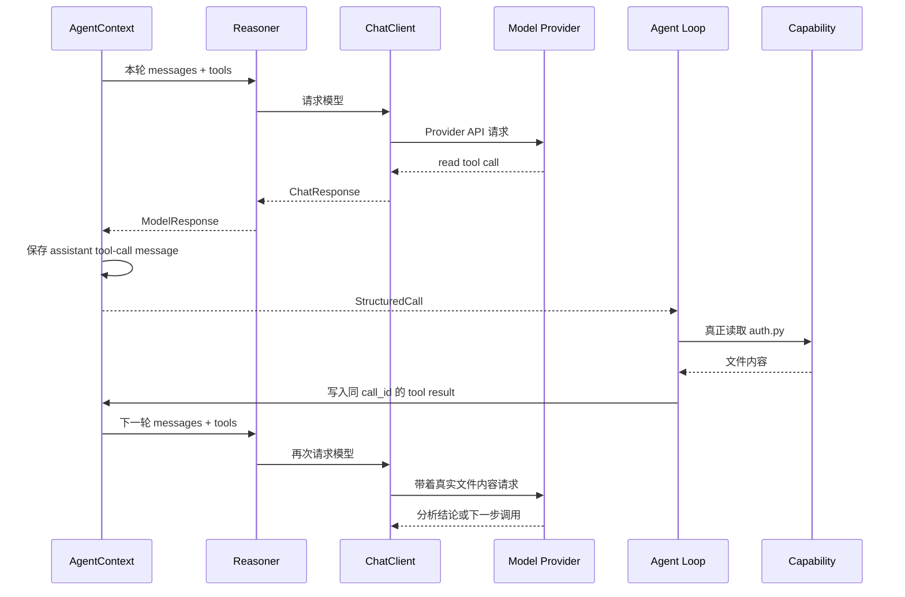
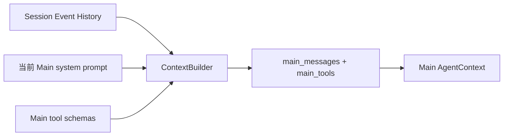
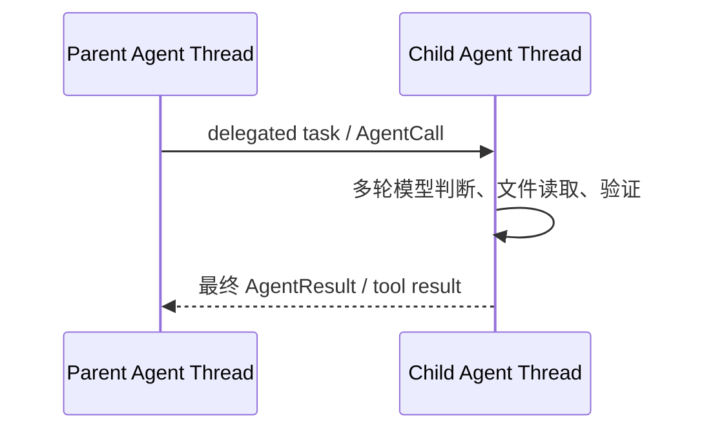
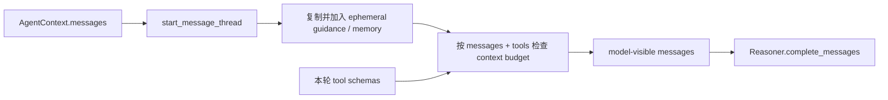
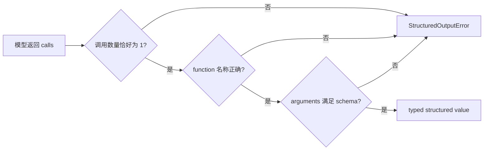
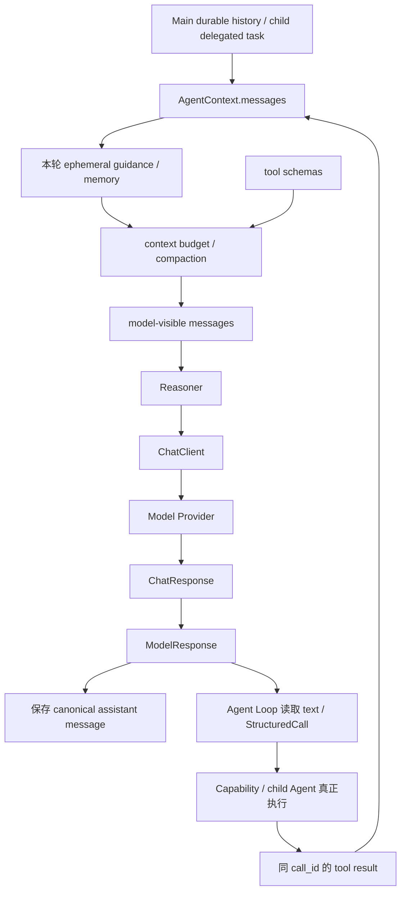

# 04 模型协议与上下文：一次 Agent 思考怎样发给模型，再接回 GitAgent

第 03 章已经讲过 Agent Loop：模型先决定“下一步想做什么”，GitAgent 再真正执行，并把结果写回去，让模型继续判断。

这一章只把其中的 **“模型思考这一轮”** 拆开来看。重点不是某个 Prompt 怎么写，而是回答四个更基础的问题：

1. 模型这一轮到底能看到什么？
2. Main Agent 和 child Agent 的消息从哪里来？
3. Provider 返回的内容怎样变成 GitAgent 能执行的决定？
4. 为什么这些事情不能全部塞进 Agent Loop 或一个模型客户端里？

为了避免变成“函数名 + 一句注释”的源码导览，下面每一部分都按 STAR 的顺序讲：先交代 **Situation（背景）**，再说明 **Task（要解决的问题）**，接着讲 **Action（具体怎么做）**，最后解释 **Result（这样设计带来了什么，以及为什么要这样做）**。

本章不展开 Capability 的权限和执行细节，那是第 05、06 章；不展开上下文压缩算法，那是第 10 章；不展开崩溃恢复，那是第 09 章。

---

## 1. 先建立全局认识：模型只负责“提出下一步”，不会自己执行

### S｜背景：模型第一次并不知道仓库里有什么

假设 Repository Agent 收到一个任务：

> 看一下 `auth.py`，解释登录为什么失败。

模型第一次被调用时，并不会自动获得整个仓库，也不会自己打开 `auth.py`。它只能看到 GitAgent 这一轮明确发给它的消息，以及这一轮允许它使用的 tool schemas。

因此，第一轮模型很可能不会直接给出结论，而是先提出一个“读取 `auth.py`”的 tool call。

### T｜要解决的问题：模型的“想做”怎样变成系统的“真的做了”

这里必须把两个动作分开：

- 模型负责表达：**我下一步想读取这个文件**；
- GitAgent 负责执行：**真正读取文件，并把读取结果作为新的事实写回来**。

如果把两者混在一起，就很容易误以为“模型返回了 tool call”已经等于“工具执行成功”。实际上 tool call 只是一个待执行的决定。

### A｜具体做法：用一轮调用、一次执行、再一轮调用形成闭环



从一次任务的视角看，真正发生的是：模型提出动作，GitAgent 执行动作，执行结果回到当前 Agent 的消息线程，下一轮模型再基于新事实继续判断。

### R｜结果与设计理由：模型负责决策，运行时负责事实和状态

这样分开以后，模型不需要也不能直接操作运行时状态。GitAgent 可以在真正执行以前检查工具是否存在、参数是否合法、权限是否允许；执行以后也能把真实结果而不是模型猜测写回上下文。

所以理解本章最重要的一句话是：

**模型负责提出当前一步的决定；GitAgent 负责决定模型看什么、怎样解释这个决定，以及这个决定是否、何时、怎样真正执行。**

---

## 2. 第一层设计：`AgentContext` 是完整工作台，模型只看到其中一个视图

### S｜背景：Agent 运行时保存的东西远比 Prompt 多

一个正在运行的 Agent 不只有聊天消息。`AgentContext` 还要保存 run_id、父子关系、waiting 状态、未闭合调用、Coding Workspace、读取缓存，以及 CandidatePatch、VerificationReport 等业务状态。

这些数据对程序推进很重要，但没有理由全部变成自然语言塞给模型。

### T｜要解决的问题：怎样同时保留完整运行状态，又避免模型上下文被运行时对象淹没

模型真正需要的是“这一次判断所需的信息”。运行时需要的是“让整个 Agent 能继续执行和恢复的完整状态”。两者范围不同，因此不能把 `AgentContext` 直接当成 Prompt。

### A｜具体做法：从完整状态中投影出本轮 `messages + tools`

一次普通 Agent 模型调用，核心输入可以概括成：

```text
messages + tools
```

其中 `messages` 是本轮模型要阅读的消息线程，`tools` 是本轮模型可以用 function calling 表达的动作格式。

| `AgentContext` 中的内容 | 本轮怎样使用 |
| --- | --- |
| `messages` | 模型输入主体 |
| Agent 身份、run_id、父子关系 | 主要由运行时使用 |
| waiting / pending 状态 | 主要由 Harness 和 Agent Loop 使用 |
| CandidatePatch / VerificationReport | 按具体流程使用，不会把整个对象自动塞进模型请求 |
| Coding Workspace | 运行时对象 |
| 文件读取账本、read cache | 运行时状态 |
| guidance / memory read | 可以临时投影到某一轮模型视图 |

可以把它理解为：

```text
AgentContext = 当前 Agent 的完整工作台
        │
        ├── 程序自己使用的控制状态
        ├── 已经产生的业务状态
        └── messages ──┐
                       ├──> 本轮模型请求
              tools ───┘
```

### R｜结果与设计理由：运行状态和模型证据可以各用最合适的表示

如果所有运行时对象都必须先改写成 Prompt，Agent 的控制逻辑就会和模型表达方式绑死。现在把两层分开后，waiting、workspace、cache 等状态可以继续使用确定的数据结构；只有模型这一轮真正需要的内容才进入上下文。

这也是后面理解 Context Builder、Reasoner 和 ChatClient 的基础：它们都不是在“复制整个 Agent”，而是在逐步构造和解释 **模型可见视图**。

---

## 3. 第二层设计：Main 和 child 不共享一条无限增长的聊天记录

### S｜背景：Main 要延续 Session，child 又会产生大量局部过程

Main Agent 面向用户的长期 Session，需要知道之前的用户消息和已经发生的交互；Repository、Issue、PR、Coding 等 child Agent 则是在某个局部任务里工作，它们可能读取很多文件、运行验证、产生大量 tool results。

如果所有 Agent 都共用一条全局消息历史，任何一次局部代码分析都会把父 Agent 的上下文越撑越大，而且不同 Agent 会看到大量与自己职责无关的内部过程。

### T｜要解决的问题：Main 要能延续历史，child 又必须保持局部上下文

因此消息线程有两个不同的起点：

```text
Main Agent  ：从 Session 的持久事件历史重建
child Agent ：从自己的 system prompt + 父 Agent 委派任务开始
```

这不是实现细节，而是多 Agent 上下文隔离的关键边界。

### A｜具体做法一：Main 从 durable Session history 构造当前线程

用户进入一个新的 Turn 时，Application 先把当前用户消息写入持久事件历史。随后 `ContextBuilder` 从这些事实中投影 Main 当前应该看到的消息，并把当前版本的 Main system prompt 放到最前面。



这一步不是简单地“把数据库记录拼起来”。`ContextBuilder` 还会确认当前 user message 已经存在于 durable history，并把 `messages` 与 `tools` 一起做 context-window 检查；必要时再进入统一的压缩流程。

构造完成后，Application Service 会把 `main_messages` 和对应的 tools 放进 Main 的 `AgentContext`，然后再启动或恢复 Agent Loop。

### A｜具体做法二：child 建立自己的消息线程

child Agent 第一次需要模型时，`start_message_thread()` 会为它建立独立线程。起始信息只有两类：

```text
system：这个 child Agent 自己的角色、规则和边界
user：父 Agent 委派下来的 task / repository / entity 信息
```

它不会把 Main 的整段会话历史复制过来。之后 child 自己产生的模型消息、文件读取和验证结果继续留在自己的 run 中；父 Agent 只需要接住这次 child 调用最终返回的结果。



### R｜结果与设计理由：Main 保证连续性，child 保证局部性

Main 从持久事件重建，因此长期会话不依赖某个 Python 进程一直存活；child 使用独立线程，因此局部探索不会无条件污染父上下文。

这两个选择解决的是同一个问题的两面：**需要长期保留的事实要能重建，需要局部消化的过程不要到处复制。**

还要注意一个边界：`ContextBuilder` 主要负责从 Session 事实得到 Main 当前线程。一个已经运行中的 Agent 在 tool result 写回后再次思考，并不会每次都重新从整个 Session 开始构造；它会直接从自己的 `AgentContext` 准备下一轮请求。

---

## 4. 第三层设计：每次 `reason()` 前，再从当前线程构造“这一轮真正可见的请求”

### S｜背景：同一条消息线程，并不代表每轮模型输入完全相同

某个 Agent 已经运行一段时间后，`self.messages` 保存的是它当前的 canonical 消息线程。但这一轮可能还需要额外 guidance 或按需读取的 memory；同时模型 context window 也有限，tool schemas 自己也会占 token。

因此“当前消息历史”还不能直接等同于“马上发给 Provider 的最终请求”。

### T｜要解决的问题：怎样加入本轮临时信息，并在超出窗口前控制请求大小

GitAgent 需要做到三件事：

- 保证消息线程已经初始化；
- 临时加入这一轮才需要的指导和 memory，而不是把它们永久伪装成普通聊天历史；
- 在真正调用模型以前，用 `messages + tools` 一起检查上下文压力。

### A｜具体做法：`model_messages()` 按固定顺序准备请求



第一步，`start_message_thread()` 确保线程存在。对于已经带有 messages 的 Agent，它不会重复初始化；对于新的 child，则建立上一节说的 system + delegated task。

第二步，`_ephemeral_messages()` 复制当前消息，并把 guidance 与额外 memory read 临时追加到 system 视图中。这里故意操作副本，是因为这些内容是“本轮参考信息”，不一定应该永久变成普通历史消息。

第三步，`compact_messages()` 用 `messages` 和 `tools` 一起估算请求大小。tool schema 也会占 context window，所以只统计对话正文是不够的。如果压力达到阈值，就在请求发出前压缩；同时仍要保持 assistant tool call 与 tool result 的协议关系合法。具体 light / summary / emergency 策略放在第 10 章。

最后 `_model_request()` 记录 **本次请求** 的输入 token 估算，再把最终 messages 交给 Reasoner。

### R｜结果与设计理由：canonical history 保持稳定，本轮视图可以按需变化

这种设计把“长期/当前消息事实”和“这一轮模型临时要看到什么”分开了。guidance、memory、压缩压力都可以在调用边界处理，而不是要求业务 Agent 到处手工改 Prompt。

同时，token 记录也有了清晰含义：这里记录的是某一次模型请求有多大，不是把整个 Session 生命周期的内容混成一个数字。

---

## 5. 第四层设计：Reasoner 管 GitAgent 语义，ChatClient 管 Provider API

### S｜背景：内部想要的是“模型决定”，外部返回的是 Provider 数据结构

Agent Loop 最终关心的是两类东西：模型给出的文本，以及可以继续执行的结构化调用。可是真正的模型服务返回的是 SDK 对象、字符串形式的 function arguments、usage 字段，以及某些 Provider 特有字段。

如果 Agent Loop 直接依赖这些对象，那么一换 Provider 或兼容接口，上层业务就要跟着改。

### T｜要解决的问题：把“GitAgent 希望模型做什么”和“Provider API 怎么调用”隔开

因此模型边界被拆成两层：

| 层 | 面向谁 | 主要职责 |
| --- | --- | --- |
| `Reasoner` | GitAgent 内部 | 把模型响应解释成 `ModelResponse`、`StructuredCall`，并处理 typed structured output 合同 |
| `ChatClient` | 外部 Model Provider | 构造实际 API 请求、做 Provider 兼容、解析原始响应、记录 Provider usage |

### A｜具体做法一：ChatClient 在发送边界处理 Provider 差异

ChatClient 接到 messages 和 tools 后，不会直接改写 `AgentContext.messages`。它先复制一份 outbound messages，再根据模型或 endpoint 处理 Provider-specific 字段，例如某些兼容服务要求的 `reasoning_content`。

```text
canonical messages
        ↓ 复制
Provider-specific adaptation
        ↓
outbound messages
        ↓
Model Provider API
```

随后它计算本轮还能留多少输出空间：

```text
remaining = context_window - request_tokens(messages, tools)
actual_max_output = min(configured_max_output, remaining)
```

如果输入本身已经占满 context window，就在发送前产生 `ContextWindowExceeded`，而不是把一个必然没有输出空间的请求继续发出去。

这里的 `request_tokens` 是 GitAgent 为预算做的本地估算；Provider 返回的 prompt/completion usage 是服务端实际报告的数据。两者用途不同，不能把本地估算说成 Provider 的精确计量。

### A｜具体做法二：Provider 原始响应先归一成 `ChatResponse`

Provider 返回后，ChatClient 抽取 GitAgent 真正需要的字段：

```text
ChatResponse
├── content
├── tool_calls
├── prompt_tokens
├── completion_tokens
└── reasoning_content（需要时）
```

每个 provider tool call 会进一步变成统一的：

```text
ToolCall = id + name + arguments(dict)
```

function arguments 原本通常是 JSON 字符串。ChatClient 会在模型边界直接解析；如果不是合法 JSON，或者解析后不是 JSON object，就产生 `StructuredOutputError`。这样无效参数不会一路流到 Capability 层再“碰运气”。

### A｜具体做法三：Reasoner 再转换成 Agent Loop 能理解的 `ModelResponse`

Reasoner 把 `ChatResponse.tool_calls` 转换成内部 `StructuredCall`，并同时保留标准 assistant message：

```text
ModelResponse
├── text
├── calls: list[StructuredCall]
└── assistant_message
```

其中 `text` 给上层作为自然语言结果；`calls` 给 Agent Loop 调度；`assistant_message` 则用于继续维护合法的模型消息历史。

如果模型既没有返回可用文本，也没有返回任何 structured call，这一轮就没有可解释的决定，Reasoner 会把它当成结构化输出错误。

### R｜结果与设计理由：Provider 可以变化，Agent Loop 不必理解 SDK 细节

经过这两层以后，Agent Loop 接触到的是 GitAgent 自己的模型协议，而不是某个 Provider SDK 的原始对象。

更重要的是，Provider-specific 适配发生在 outbound 副本上，canonical 消息线程不需要为了兼容某个服务而整体变形。这样持久化、恢复和内部调度都可以依赖相对稳定的消息格式。

所以 Reasoner 与 ChatClient 分开，并不是为了“多加一层抽象”，而是明确区分两个问题：

**Reasoner 回答“GitAgent 希望从模型得到什么”；ChatClient 回答“这个模型服务具体怎么调用、返回值具体怎么读”。**

---

## 6. 第五层设计：用同一个 `call_id` 把“模型提出动作”和“真实执行结果”闭合起来

### S｜背景：模型的下一轮必须知道上一轮到底执行了什么

假设模型上一轮返回一个读取调用。模型消息里已经出现了“我要执行这个 function”的 assistant tool call。如果后面只把文件内容随便追加成一条普通消息，下一轮模型无法可靠知道这段结果究竟对应哪一个调用。

当一轮同时有多个 tool calls 时，这个问题会更明显。

### T｜要解决的问题：怎样让模型协议、运行时调度和后续恢复都指向同一个调用

GitAgent 需要一个稳定身份，把以下三件事连接起来：

```text
模型返回的 tool call
        ↕
Agent Loop 正在处理的 StructuredCall
        ↕
执行完成后写回的 tool result
```

这个身份就是 `call_id`。

### A｜具体做法：assistant message 先落历史，tool result 再用同一个 id 回填

Reasoner 返回 `ModelResponse` 后，`AgentContext.reason()` 会先把 `response.assistant_message` 追加到当前消息线程。也就是说，在工具真正执行前，历史里已经记录了“模型发起了 call-123”。

执行完成后，Agent Loop 再用同一个 `call_id` 写入 tool result：

```text
assistant tool call: call-123
        │
        │  GitAgent 真正执行
        ↓
tool result:         call-123
```

如果一轮里有 call-A、call-B、call-C，每个结果也分别带自己的 `tool_call_id`。`open_tool_calls()` 就可以比较“已经出现的 assistant calls”和“已经写回的 tool results”，判断哪些调用仍然没有闭合。

### R｜结果与设计理由：下一轮看到的是完整因果链，而不是散落的文本

这样下一次模型请求可以明确读到：“上一轮我提出了哪个动作，系统对这个动作真实返回了什么”。恢复逻辑也可以根据同一个调用身份判断哪些调用已经结束、哪些还在等待结果。

这也是为什么 `assistant_message` 不能只为了省事丢掉，只留下内部 `StructuredCall`。`StructuredCall` 适合运行时调度；标准 assistant/tool 消息适合维持模型协议和可恢复历史。两种表示服务于不同消费者，但必须共享同一个调用身份。

多个调用具体怎样并发执行、怎样按逻辑顺序提交结果，继续看第 06 章。

---

## 7. 第六层设计：普通 Agent 决策和“必须返回确定结构”使用不同合同

### S｜背景：不是所有模型调用都只需要一段文字

普通 Agent step 可以返回自然语言，也可以提出一个或多个 tool calls。例如 Repository Agent 可能先搜索，再读取文件，最后给出文字结论。

但 approval intent 分类、memory extraction 等辅助流程不同：后面的程序必须继续读取具体字段，不能再从一段自然语言里猜“模型大概是什么意思”。

### T｜要解决的问题：既保留普通 Agent 的灵活性，又让机器消费的结果有确定结构

因此 Reasoner 提供三种不同的输出合同：

| 接口 | 期待的结果 | 适合场景 |
| --- | --- | --- |
| `complete_messages` | text 和 / 或 structured calls | 普通 Agent step |
| `complete_structured_messages` | 恰好一个符合目标 schema 的 function call | classifier、typed helper 等机器继续消费的流程 |
| `complete_text_messages` | text | 只需要纯文本的辅助流程 |

### A｜具体做法：结构化流程同时检查目标 function、数量和 schema

当调用方要求 typed structured output 时，系统不是看到“有个 tool call”就算成功，而是按顺序检查：



如果只返回普通文本、调用了错误 function、同时返回多个最终 calls，或者 arguments 不符合 schema，都不能当成合法 typed result。

### R｜结果与设计理由：把“结构合法”从“事实正确”和“有权限执行”中分离

schema validation 只保证结果形状满足合同，例如字段是否存在、类型是否正确。它并不能证明模型判断的事实一定正确，更不能代替 Approval 系统。

例如 `{intent: "approve"}` 在结构上完全合法，也不代表用户已经对某个远程 mutation 完成授权。事实仍然要靠仓库、PR、CI、测试等证据；权限仍然由第 08 章的 Approval 机制判断。

这个区分很重要，因为 GitAgent 不应该把“JSON 长得对”误当成“业务结论一定对”。

---

## 8. 第七层设计：模型边界的错误要按失败阶段区分

### S｜背景：很多问题表面上都像“模型调用失败”

请求太长、Provider 超时、模型返回非法 JSON，这三种情况从用户表面看都可能只是“这一轮没有正常结果”，但系统处理方式完全不同。

### T｜要解决的问题：让上层知道究竟是请求问题、外部服务问题，还是模型输出协议问题

如果所有错误都包装成一个通用的 `LLMError`，后面的重试、恢复和观测就无法判断应该处理哪一层。

### A｜具体做法：在各自边界产生对应错误

| 失败阶段 | 例子 | 典型错误 |
| --- | --- | --- |
| 构造请求 | 输入已经占满 context window | `ContextWindowExceeded` |
| Provider 调用 | timeout、HTTP / Provider failure | `LLMProviderError` |
| 输出协议 | function arguments 不是合法 JSON object、typed result 不满足合同 | `StructuredOutputError` |

这里的原则是：**哪一层最先能够确定问题，就在哪一层把它变成明确错误。**

### R｜结果与设计理由：失败原因可解释，恢复策略也不会混在一起

请求装不下时，再重试同一个 Provider 没有意义；Provider 网络失败和模型返回非法结构也不是一回事。分层错误让第 09 章的重试、恢复和观测可以根据真实失败原因处理，而不是统一“再试一次”。

---

## 9. 把整条设计重新走一遍：一次模型调用如何闭环

到这里可以把前面的 STAR 设计串成一条完整链路：



再代回开头“读取 `auth.py`”的例子：

第一轮，当前 Agent 从自己的消息线程和 tools 构造模型请求；模型提出 read tool call；ChatClient 和 Reasoner 把 Provider 响应转换成 `ModelResponse` 与 `StructuredCall`；`AgentContext` 先保存带原 `call_id` 的 assistant message。

随后 Agent Loop 真正执行读取，把文件内容用同一个 `call_id` 写回。第二轮 `reason()` 再从当前线程构造请求时，模型就能同时看到“我上一轮要求读取 `auth.py`”和“系统实际读到了什么”，于是可以继续分析或提出新的动作。

这就是本章真正要说明的模型协议：

```text
决定模型看什么
    ↓
让模型提出下一步
    ↓
把 Provider 响应变成内部决定
    ↓
保存这次决定
    ↓
运行时真正执行
    ↓
把真实结果写回
    ↓
下一轮继续判断
```

---

## 10. 为什么最终要拆成这些层，而不是写成一个“大模型调用函数”

前面已经分别解释了每层的原因，这里只把它们放到一张表里，方便 Review 时检查职责有没有串层。

| 设计边界 | 它解决的具体问题 | 如果不分开会怎样 |
| --- | --- | --- |
| `AgentContext` vs model-visible messages | 区分完整运行状态和模型本轮证据 | waiting、workspace、cache 等状态被迫混进 Prompt |
| Main durable history vs child 独立线程 | 同时保证长期连续性和局部隔离 | child 的大量内部过程不断膨胀父上下文 |
| canonical messages vs ephemeral view | 允许每轮临时加入 guidance / memory | 临时信息永久污染聊天历史 |
| messages 与 tools 共同做 context budget | 真实估算模型请求压力 | 只算文本，忽略 tool schemas 占用 |
| Reasoner vs ChatClient | 分开内部模型语义和 Provider API | Agent Loop 直接依赖 SDK / Provider 特有格式 |
| `ChatResponse` vs `ModelResponse` | 分开传输归一和运行时决策表示 | 外部返回格式泄漏到 Agent Loop |
| `call_id` 贯穿 call/result | 闭合模型动作与真实观察 | 下一轮无法可靠知道结果属于哪个调用 |
| 普通输出 vs typed structured output | 区分人类可读结果和机器合同 | 程序需要从自然语言重新猜字段 |
| 分阶段错误类型 | 区分请求、Provider、输出协议失败 | 重试、恢复和观测只能把所有错误混成一类 |

可以看到，这些层并不是为了追求“架构看起来复杂”，而是在处理几种本来就不同的问题：运行状态、模型上下文、Provider 传输、结构化协议、真实执行和持久历史。把它们强行放在一个函数里，代码会变短，但边界会变得更难验证。

---

## 11. 常见误解

| 容易产生的误解 | 正确理解 |
| --- | --- |
| `AgentContext` 就是 Prompt | `AgentContext` 是完整运行状态，模型只看到本轮投影出的 messages / tools |
| `ContextBuilder` 每次模型调用都会重建全部历史 | 它主要从 durable Session history 构造 Main 当前线程；运行中的 Agent 下一轮主要从自己的 `AgentContext` 准备请求 |
| child 会继承 Main 的完整聊天记录 | child 从自己的 system prompt 和 delegated task 建立独立线程 |
| 模型返回 tool call 就代表工具已经执行 | tool call 只是模型提出动作，真正执行属于 Agent Loop / Capability / Harness |
| 模型看到 tool schema 就代表已经获得权限 | schema 只是动作表达格式，真正执行仍要经过运行时检查 |
| schema validation 通过就代表结论正确 | schema 只保证结构，事实正确性与权限判断是另外两层问题 |
| 本地 token 估算就是 Provider 精确 usage | 前者用于请求预算，后者是 Provider 报告的实际 usage |

---

## 12. Review 时怎样用 STAR 讲清这一章

如果需要在设计评审或面试里快速说明这一章，不建议从 Provider 字段或函数名开始，可以直接沿下面这组 STAR 讲：

**S — Situation：** GitAgent 是多 Agent、可恢复、可调用工具的系统。模型不掌握完整运行状态，却需要看到恰当的消息和工具；不同 Provider 又会返回不同格式；child 还会产生大量局部上下文。

**T — Task：** 系统需要给每个 Agent 构造正确且受 context window 约束的模型视图，把 Provider 响应稳定转换成内部决定，并保证 tool call 与真实执行结果可以在后续轮次和恢复过程中对应起来。

**A — Action：** Main 从 durable Session history 构造线程，child 使用独立消息线程；每轮 `reason()` 在 canonical messages 上临时加入 guidance / memory 并检查 context budget；Reasoner 负责 GitAgent 的模型语义，ChatClient 负责 Provider API 与响应归一；响应最终转换成 `ModelResponse`，再用稳定 `call_id` 将 assistant tool call 和 tool result 闭合；需要机器继续消费的结果额外使用目标 function + schema 校验。

**R — Result：** Agent Loop 不依赖 Provider SDK，Provider 兼容不会随意改写 durable history，Main 可以延续长期 Session，child 的局部探索不会撑爆父上下文，结构化调用可以带着稳定身份进入 Capability 和 Execution 层。

如果只记一句话，可以记成：

**模型产生决定，GitAgent 管理上下文、协议和执行事实；两边通过稳定的 messages、StructuredCall 和 `call_id` 接起来。**

---

## 13. 源码定位：读代码时沿主链核对，不要逐文件背函数

| 想核对的问题 | 主要位置 |
| --- | --- |
| `AgentContext`、`reason()`、message thread、ephemeral view、open calls | `gitagent/harness/context/state.py` |
| Main Session history 怎样变成 messages、context budget / compaction | `gitagent/harness/context/builder.py` |
| canonical assistant / tool message | `gitagent/harness/context/messages.py` |
| Main messages 怎样进入 `AgentContext` | `gitagent/application/bootstrap.py`、`gitagent/application/service.py` |
| `ModelResponse`、`StructuredCall` | `gitagent/agent_loop/models.py` |
| 普通 / structured / text Reasoner 合同 | `gitagent/model/reasoner.py` |
| Provider 请求、outbound 适配、`ChatResponse`、usage | `gitagent/model/chat_client.py` |
| 上下文压缩的详细策略 | 第 10 章 |

本章到这里结束时，模型已经可以把“下一步决定”稳定地交回 GitAgent。第 05 章继续往下追：一个 `StructuredCall` 进入运行时以后，GitAgent 怎样把它映射到真正的 Capability，并完成发现、约束和调用。→ [05 Capability 与工具系统](05-capability-and-tool-system.md)
