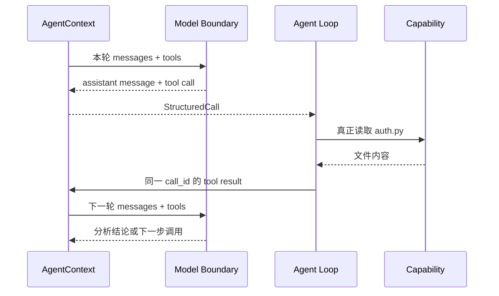
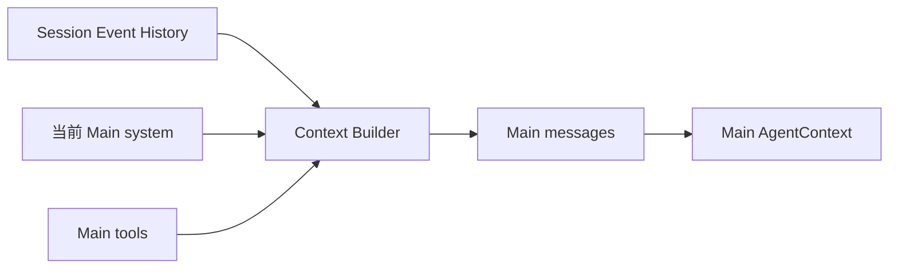
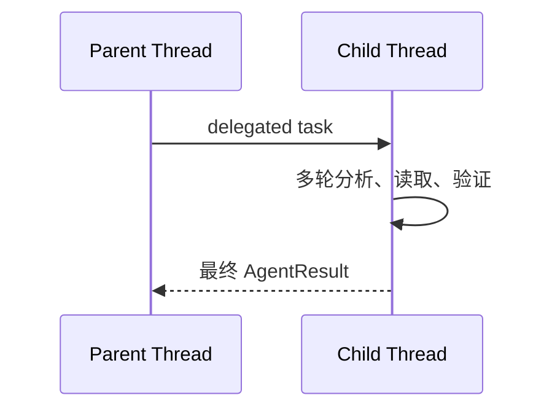
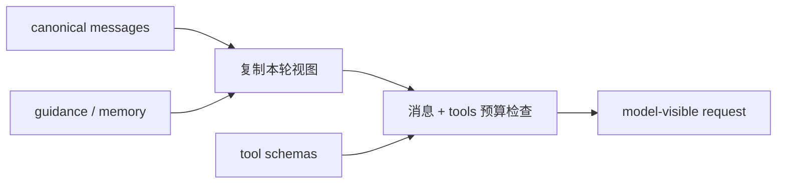
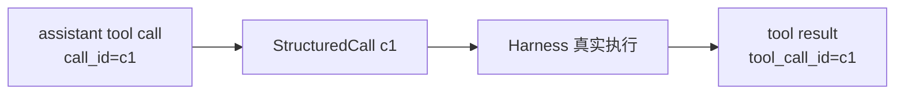
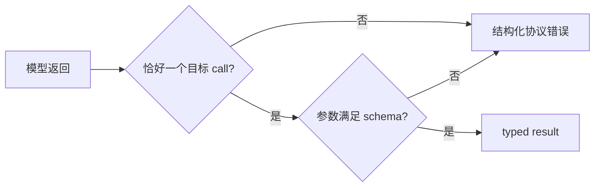
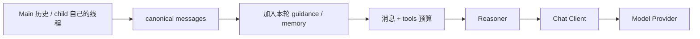
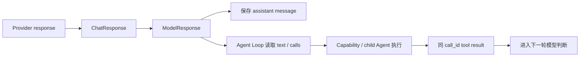

# 04 模型协议与上下文：一次 Agent 思考怎样发给模型，再接回 GitAgent

第 03 章已经讲过 Agent Loop：模型提出下一步，GitAgent 执行，再把真实结果写回，让模型继续判断。本章只放大其中的“模型调用边界”，回答四个问题：模型这一轮究竟看到什么；Main 和 child 的消息从哪里来；Provider 的响应怎样变成 GitAgent 能理解的决定；工具调用怎样和后续结果稳定对应。

Capability 的权限和执行放在第 05、06 章，上下文压缩算法放在第 10 章，崩溃恢复放在第 09 章。本章只讲这些模块在模型调用边界上怎样衔接。

---

## 1. 模型调用的基本闭环

模型不会自动看到仓库，也不会因为输出了 tool call 就直接改变文件或 GitHub。以“读取 `auth.py` 并解释登录失败”为例，第一轮模型只能看到 GitAgent 提供的消息和可用工具描述。它可以提出“读取这个文件”，但真正读取仍由 Harness 完成。



这里要先把“决定”和“事实”分开：模型负责表达它下一步想做什么，GitAgent 负责检查这个动作能不能执行、真正执行，并把真实结果写回。这样模型不能把自己的猜测直接伪装成工具结果，权限和状态检查也有明确的落点。

---

## 2. AgentContext 是完整运行状态，模型只看到其中一个视图

一个正在运行的 Agent 不只有聊天消息。运行时还需要保存父子 Agent 关系、当前 run 身份、waiting 状态、未闭合调用、Coding Workspace、候选补丁、验证结果、读取状态等信息。这些数据对程序很重要，但没有必要全部改写成自然语言发给模型。

因此 GitAgent 把“完整运行状态”和“本轮模型输入”分开。可以把它理解成：

```text
AgentContext
├── 模型消息线程
├── 父子 Agent 与调用身份
├── waiting / pending 控制状态
├── Coding Workspace 与业务产物
├── read cache / 文件读取状态
└── guidance / memory 等本轮可选信息
          │
          └── 只挑本轮需要的内容形成 messages + tools
```

模型调用时真正使用的核心只有两部分：当前可见消息，以及当前允许模型表达的工具 schema。父子关系、workspace 对象、缓存账本等继续由 Harness 用结构化状态维护。

这样设计的原因很直接：控制状态和模型证据的生命周期不同。waiting、workspace、读取状态需要程序精确维护；guidance、Memory 等信息可能只在某一轮有用。把它们全部长期写进聊天记录，会让消息历史既臃肿又难以恢复。

---

## 3. Main 和 child 为什么使用不同的消息来源

Main Agent 面向一个长期 Session，需要延续用户之前的交互；Repository、Issue、PR、Coding 等 child Agent 则只负责某个局部任务，会产生大量文件读取、搜索和验证结果。如果所有 Agent 共享一条全局聊天记录，局部代码探索会持续污染 Main 的上下文，其他 child 也会看到大量与自己无关的信息。

因此两类消息线程的起点不同。

### 3.1 Main：从 Session 历史恢复长期线程

用户开始新的 Turn 后，应用已经把当前输入记录进 Session Event History。随后 Context Builder 从持久历史中投影 Main 当前应该看到的标准消息，再加入当前版本的 Main system prompt 和本轮工具定义。



这不是简单把数据库内容原样拼接。历史事件需要先恢复成合法的 user / assistant / tool 消息；过去如果发生过 compaction，也要重放对应的压缩结果；消息和 tool schemas 还要一起参加上下文预算检查。

Main 之所以从持久事件重建，是因为长期会话不能依赖某个 Python 进程一直活着。只要 Session 历史完整，新进程仍然能得到同样的消息事实。

### 3.2 child：从自己的角色和委派任务开始

child Agent 第一次运行时会建立独立消息线程。它的起点主要是自己的 system 规则，以及父 Agent 交给它的结构化任务和实体信息。



父 Agent 不需要复制 child 内部的所有过程，只需要接收最终结构化结果。这样 Main 保持长期连续性，child 保持局部上下文，两者通过明确的 Agent 调用边界连接。

一个正在运行的 Agent 在工具结果写回后再次思考时，也不会每次重新从整份 Session Event History 构造线程。它会继续使用自己的 canonical message thread；Event History 主要负责 Main 初始构造和跨进程恢复。

---

## 4. canonical messages 与“本轮可见视图”还要再分一层

同一个 Agent 的消息线程并不意味着每一轮模型输入都完全一样。本轮可能需要额外的 Agent guidance、按需 Memory 内容；同时 tool schemas 也会占模型窗口。

因此发给模型之前，AgentContext 会从稳定消息线程复制出一份本轮视图，再加入临时信息，最后做上下文预算检查。



这里有三个关键点。

第一，guidance 和额外 Memory 默认是临时注入。本轮需要它们，不代表它们应该永久变成业务聊天历史。

第二，预算不能只计算消息文本。模型工具的名称、描述和参数 schema 同样占上下文窗口，所以 GitAgent 按 `messages + tools` 的整体大小判断是否需要压缩。

第三，压缩后的请求仍必须保持 tool call / tool result 协议合法。具体 Light、Summary、Emergency 三档策略在第 10 章展开，本章只需要记住：压缩发生在模型请求边界，而且不会把控制状态本身随意变成摘要文字。

这种拆法让稳定历史保持可恢复，而每轮模型视图可以根据当前任务动态变化。

---

## 5. Reasoner 与 Chat Client 为什么还要分开

GitAgent 内部希望得到的是“模型这一步决定了什么”：有没有自然语言结果、有没有结构化调用、assistant message 应该怎样进入下一轮。外部模型服务返回的却是 Provider SDK 对象、字符串形式的 function arguments、token usage，以及某些 endpoint 特有字段。

如果 Agent Loop 直接依赖这些 Provider 数据结构，一旦换模型服务或兼容接口，上层运行协议就会跟着变化。因此模型边界被拆成两层。

| 层 | 负责什么 |
|---|---|
| Reasoner | 把模型结果解释成 GitAgent 自己的 ModelResponse / StructuredCall，并提供普通、结构化、纯文本等调用合同 |
| Chat Client | 构造真实 Provider 请求，做 endpoint 兼容，解析原始响应和服务端 usage |

### 5.1 Chat Client 先处理 Provider 差异

发送请求时，Chat Client 会复制当前消息，Provider 特有的适配只作用在 outbound 副本上。例如某些兼容服务需要额外 reasoning 字段，这些字段不应该反过来污染 GitAgent 的 canonical history。

```text
canonical messages
      ↓ 复制
Provider-specific adaptation
      ↓
outbound request
      ↓
Model Provider
```

发送前还会根据当前请求占用估算剩余输出空间：输入已经占满上下文时，会在本地直接报 Context Window 错误，而不是继续发送一个不可能产生有效输出的请求。

这里要区分两种 token 数据：本地估算用于预算控制；Provider 返回的 prompt/completion usage 是服务端实际报告。两者用途不同，不应该混为一个“精确 token 统计”。

### 5.2 Provider 响应先归一成通用 ChatResponse

不同 SDK 的返回格式先在 Chat Client 边界收束成少量稳定字段：文本内容、tool calls、prompt/completion usage，以及需要时保留的 reasoning 内容。

Provider function arguments 通常是 JSON 字符串。Chat Client 会在这里解析成对象；如果不是合法 JSON，或者结果不是 JSON object，就直接形成结构化输出错误，不会把坏参数一路传到 Capability 层。

### 5.3 Reasoner 再变成 Agent Loop 使用的决定

Reasoner 继续把通用响应转换成 GitAgent 内部语义：

```text
ModelResponse
├── text
├── calls: StructuredCall[]
└── assistant_message
```

`text` 可以成为普通 Agent 结果；`calls` 交给 Agent Loop 调度；`assistant_message` 则作为标准模型消息保留在当前线程中。模型如果既没有可用文本，也没有任何结构化调用，就意味着这一轮没有产生可解释决定，会按协议错误处理。

Reasoner 与 Chat Client 的分离本质上是在隔离两个变化方向：上层 Agent 协议希望稳定，底层模型 Provider 可以变化。

---

## 6. call_id 怎样把“模型提出动作”和“真实结果”闭合

一轮模型可以同时提出多个工具调用。如果工具结果只是作为普通文本追加回来，下一轮模型无法可靠判断哪段结果属于哪个动作，恢复时也无法判断哪些调用已经结束。

因此模型 tool call、内部 StructuredCall 和后续 tool result 共享同一个调用身份。



Reasoner 返回后，AgentContext 会先保存标准 assistant message，也就是“模型已经提出 c1”这个事实。工具真正执行完成以后，再用同一个 id 写入 tool result。

如果一轮里有 c1、c2、c3，Harness 就可以通过 assistant calls 与 tool results 的差集判断还有哪些调用没有闭合。这个关系不仅服务下一轮模型输入，也是等待恢复、并发提交和协议校验的基础。

这里同时保留两种表示是有必要的：StructuredCall 适合运行时调度；标准 assistant/tool message 适合模型协议和历史重放。它们不能互相替代，但必须共享稳定调用身份。

---

## 7. 普通 Agent 决策和机器可消费结果使用不同输出合同

普通 Agent step 允许模型返回文字，也允许提出一个或多个工具调用。但 Approval Intent、Memory Extraction 等辅助流程后面要直接读取字段，不能再从一段自然语言里猜结构。

因此 Reasoner 提供不同的输出合同。

| 合同 | 期待结果 | 典型用途 |
|---|---|---|
| 普通 Agent 调用 | text 和 / 或 structured calls | Main / Domain / Coding 正常推理 |
| typed structured output | 恰好一个指定 function，并且 arguments 满足目标 schema | 分类器、Memory Extractor 等 |
| text-only | 纯文本 | 只需要自然语言结果的辅助流程 |

结构化流程会同时检查调用数量、目标 function 名称和参数 schema。只返回文本、调用错 function、一次返回多个最终结果，或者字段类型错误，都不能当成合法 typed result。



schema 通过只代表“结果形状满足机器合同”，不代表事实一定正确，更不代表获得执行权限。例如 `{intent: approve}` 结构合法，只能说明分类器输出符合格式；真正的 Approval 仍要结合当前 pending proposal 和运行时授权状态。

---

## 8. 模型边界的错误按发生阶段区分

请求太长、Provider 网络失败、模型返回非法 arguments，表面上都可能表现为“一轮模型调用失败”，但后续处理完全不同。因此错误会在最早能够确定问题的边界上归类。

| 失败阶段 | 典型情况 | 处理语义 |
|---|---|---|
| 请求构造 | 输入和工具已经占满 context window | Context Window 错误，调整上下文而不是盲目重试 Provider |
| Provider 调用 | timeout、HTTP / 服务端失败 | Provider 错误，由 Agent Loop 的模型重试策略处理 |
| 输出协议 | function arguments 非法、typed result 不符合合同 | Structured Output 错误，让模型重新表达 |

这种分层让恢复策略不会混在一起。请求装不下时重试同一个网络请求没有意义；网络暂时失败和模型返回错误 JSON 也不应该共享同一条纠错路径。

---

## 9. 一次模型调用从准备到闭环的完整顺序

把前面的机制合起来，可以分成“构造请求”和“处理响应”两段。

请求侧：



响应侧：



以读取 `auth.py` 为例：第一轮模型提出 read call，系统先把这个调用作为 assistant message 保存，再真正读取文件；结果使用同一个 call id 写回。第二轮模型因此能同时看到“上一轮我要求做什么”和“运行时实际得到了什么”。

---

## 10. 为什么这些边界值得单独存在

前面已经先讲了实现，再回头看设计理由会更清楚。

完整 AgentContext 与模型视图分离，是为了让 waiting、workspace、缓存等控制状态保持精确数据结构；Main 历史与 child 线程分离，是为了兼顾长期会话和局部上下文隔离；canonical messages 与本轮临时视图分离，是为了让 guidance、Memory 和压缩策略不会污染永久历史。

Reasoner 与 Chat Client 分离，是为了让 GitAgent 的模型协议不依赖某个 Provider SDK；call id 贯穿 tool call 和 result，是为了让并发、等待和恢复都能找到稳定的因果关系；普通输出与 typed output 分离，是为了让需要机器继续消费的流程有严格合同，而不是再解析自然语言。

这些抽象会增加几个中间对象，但它们对应的是不同的失败和变化来源。真正需要维护时，可以明确判断问题属于消息构造、Provider 适配、结构化输出，还是后续 Capability 执行，而不是所有问题都堆到 Agent Loop 里。

---

## 11. 代码定位

下面的路径用于需要核对实现时定位，不要求靠记源码变量来理解正文。

| 想核对的问题 | 主要位置 |
|---|---|
| AgentContext、模型消息线程、本轮临时视图、open calls | `gitagent/harness/context/state.py` |
| Main Session history 怎样形成消息、context budget | `gitagent/harness/context/builder.py` |
| 标准 assistant / tool message 协议 | `gitagent/harness/context/messages.py` |
| Main messages 怎样进入运行时 | `gitagent/application/bootstrap.py`、`gitagent/application/service.py` |
| 模型决定和结构化调用的数据结构 | `gitagent/agent_loop/models.py` |
| 普通 / structured / text Reasoner 合同 | `gitagent/model/reasoner.py` |
| Provider 请求、outbound 适配、通用响应和 usage | `gitagent/model/chat_client.py` |
| 上下文压缩详细策略 | 第 10 章 |

下一章继续往下追：模型已经返回 StructuredCall 以后，GitAgent 怎样把它映射到 Native、GitHub/MCP、Skill、RAG 等真实能力，并完成发现、授权和调用。→ [05 Capability 与工具系统](05-capability-and-tool-system.md)
