# 05 Capability 与工具系统：GitAgent 怎样把不同工具组织成一套统一能力

上一章已经讲清楚：模型最终会产出结构化调用。接下来真正要解决的问题是，模型写出的这个调用名称怎样找到实际工具、当前 Agent 是否有资格使用、参数怎样检查、底层动作怎样执行，以及不同来源的错误怎样统一返回。

GitAgent 把这些事情集中放进 Capability 系统。

这一章的学习顺序刻意按照“先看系统怎样做，再理解设计原因”来安排。阅读时先建立完整执行链，再分别理解 Catalog、Registry、Provider、PermissionPolicy 等组件。每个关键设计点后面都会用 STAR 做一次复盘，帮助复习时把背景、目标、实现和结果连起来。

---

## 1. 先建立整体认识：Capability 系统处在调用链的什么位置

先把 Capability 系统放回整个 Agent 执行流程里看。

模型不会直接调用 GitHub Client、文件系统函数或者 MCP HTTP 接口。模型先看到一批经过筛选的“可调用能力”，随后返回结构化调用。Harness 再把模型调用还原成内部 Capability id，经过 Capability 层完成校验、授权和执行。

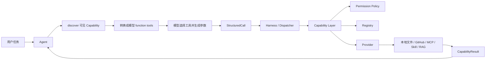

从这张图先记住一句话：

> Capability 系统负责把“模型想做一个动作”转换成“系统确认这个动作当前存在、允许执行、参数有效，并通过正确的底层实现完成调用”。

它位于模型协议和真实执行资源之间，是一层稳定的控制边界。

### 1.1 本章需要分清的六个对象

| 对象 | 可以把它理解成什么 | 主要职责 |
|---|---|---|
| `CapabilityDefinition` | 配置中的能力说明书 | 声明稳定 id、provider、source、访问等级、静态绑定信息 |
| `Capability` | 当前运行时的一项能力 | 保存描述、状态、输入输出 schema、访问等级等模型可见和执行所需信息 |
| `CapabilityBinding` | 能力到实现的连接线 | 记录这项能力应该交给哪个 Provider，以及 Provider 内部目标是什么 |
| `CapabilityRegistration` | Capability 与 Binding 的组合 | Registry 实际保存和解析的注册单元 |
| `CapabilityRegistry` | 当前运行时能力表 | 保存此刻真正存在的能力，并根据 capability id 找到绑定 |
| `CapabilityLayer` | 能力系统总入口 | 负责加载、发现、授权、调用、错误恢复和 Failure Guard |

其中还有两个会贯穿整章：

- `PermissionPolicy` 决定某个 Agent 能看到什么、能调用什么、哪些动作需要审批。
- `Provider` 负责把统一的 Capability 调用真正翻译到底层系统。

先理解这些对象之间的关系，后面的 Native、MCP、Skill、RAG 就会非常自然。

---

## 2. 一项 Capability 到底包含哪些信息

### 2.1 先看它怎样设计

在 GitAgent 里，一项能力需要同时服务模型层和执行层，因此它不能只有一个函数名称。

运行时的 `Capability` 主要保存下面这些信息：

| 信息 | 用途 |
|---|---|
| `id` | 系统内部稳定标识，例如 `native.read`、`github.get_pr` |
| `kind` | 标记能力属于 Native Tool、MCP Tool、Skill 或 RAG |
| `description` | 告诉模型这项能力适合完成什么任务 |
| `source_id` | 标记它属于哪个能力来源，例如 `native`、`github`、`context7`、`rag` |
| `status` | 表示当前是 AVAILABLE、UNAVAILABLE 还是 DISABLED |
| `access` | 表示 READ、WRITE、DESTRUCTIVE 访问等级 |
| `input_schema` | 约束模型传入的参数结构 |
| `output_schema` | 约束 Provider 返回的数据结构 |

与此同时，系统把“能力本身是什么”和“能力具体怎样执行”分开保存。

`CapabilityBinding` 负责连接实现，它保存 capability id、provider id，以及 Provider 自己能够识别的 target。两者组合成 `CapabilityRegistration` 后进入 Registry。

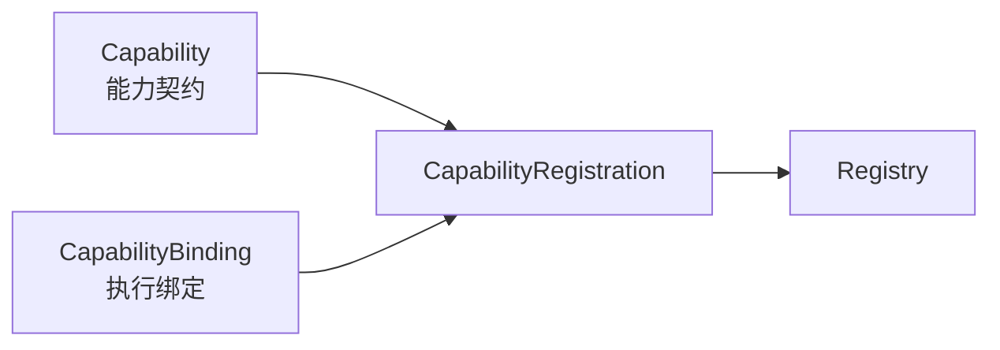

这种拆法很重要。模型关心的是名称、描述和参数；Provider 关心的是自己的 handler、远端工具名、Skill 路径或知识库对象。两部分可以各自变化，又能通过 registration 保持明确对应关系。

### 2.2 用一个具体例子理解

以 `native.edit` 为例。

对模型来说，它是一项“精确修改文件内容”的能力，模型需要知道文件路径、旧文本、新文本这些参数。

对权限系统来说，它属于 WRITE。

对 NativeProvider 来说，它需要绑定到真正执行文本替换的 handler。

对执行调度来说，它会修改工作区，因此应该按写资源处理。

同一个 Capability 在不同层承担不同意义，这也是 Capability 对象需要携带结构化元数据的原因。

### 2.3 STAR 复盘

| STAR | 这一设计点对应的内容 |
|---|---|
| S — Situation | 模型工具既需要给 LLM 看，也需要给权限、调度和底层执行使用 |
| T — Task | 用一个稳定对象表达“这项动作是什么”，同时保留到具体实现的明确连接 |
| A — Action | 用 `Capability` 保存动作契约，用 `CapabilityBinding` 保存执行绑定，再组合成 `CapabilityRegistration` |
| R — Result | 模型协议、权限控制和 Provider 实现可以围绕同一个 capability id 协作，各层职责仍然清楚 |

---

## 3. 启动阶段：Capability 系统怎样被组装起来

理解运行时调用之前，先看应用启动时这一整套系统怎样建立。

### 3.1 第一步：读取 `capabilities.yaml`

应用通过 `CapabilityCatalog.from_file()` 读取 `capabilities.yaml`。

这里的 Catalog 主要保存两类静态信息：

1. 固定 Capability 的定义；
2. 每个 Agent 的 discover / invoke 权限规则，以及 MCP server 配置。

Catalog 在读取时就会做结构检查，例如：

- 默认策略必须是 discover deny、invoke deny；
- capability id 必须落在对应 source 下；
- Native Capability 必须配置 handler；
- MCP Capability 必须配置 server 和 remote name；
- Skill Capability 必须配置 Skill 文件路径；
- 不支持的 provider 或 transport 会直接被拒绝。

这一步处理的是“配置本身是否合法”。此时还没有真正得到运行时可调用能力。

### 3.2 第二步：创建 PermissionPolicy 和 CapabilityLayer

应用把 Catalog 中的 Agent 权限配置交给 `PermissionPolicy`，随后创建 `CapabilityLayer`。

CapabilityLayer 内部拥有：

- 一个 Registry；
- 一个 PermissionPolicy；
- 一个 FailureGuard；
- Trace；
- 当前已经添加的 Providers。

可以把它看成 Capability 系统的总控制器。

### 3.3 第三步：根据配置创建不同 Provider

当前应用启动时会加入四类 Provider：

| Provider | 负责的来源 |
|---|---|
| `NativeProvider` | 本地工作区文件、搜索、编辑、Bash、时间等 |
| `MCPProvider` | GitHub 本地 adapter 和 Context7 远端 MCP 工具 |
| `SkillProvider` | 固定可信目录中的 `SKILL.md` |
| `RAGProvider` | 已注册的本地知识库 |

这里有一个很容易混淆的点：MCPProvider 同时可以持有不同类型的 client。

GitHub 在当前实现里通过 `local_adapter` 连接本地 GitHub Client；Context7 使用 `streamable_http` 连接远端 MCP 服务。它们在 Capability 层共享 MCPProvider 的绑定和调度方式，底层连接方式仍然不同。

### 3.4 第四步：调用 `layer.load()` 收集 Provider 快照

每个 Provider 都实现 `load()`，返回自己当前的 `CapabilityRegistration` 列表。

CapabilityLayer 收到这些 registration 后会先验证 Provider 所有权。例如，一个由 `native` Provider 返回的 binding，其 `provider_id` 也必须是 `native`。

随后 Layer 按 `source_id` 把结果写入 Registry。

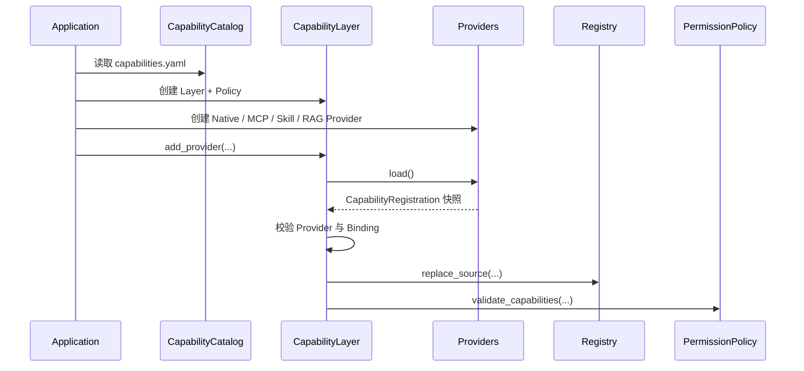

### 3.5 第五步：对运行时能力和权限做交叉检查

Provider 都加载完成以后，PermissionPolicy 会检查当前 Registry 中的能力是否与 Agent 权限配置一致。

例如：

- READ 能力如果被 discover，通常需要位于 invoke.allow；
- 普通 WRITE / DESTRUCTIVE 能力不能随意放进 allow；
- `native.bash` 使用单独的命令级策略；
- Coding Agent 的工作区文件写操作有专门规则。

所以启动阶段不仅确认“工具能不能加载”，还会确认“权限配置能不能和这些工具正确配合”。

### 3.6 STAR 复盘

| STAR | 这一设计点对应的内容 |
|---|---|
| S — Situation | 能力来自配置、本地 handler、GitHub Client、远端 MCP、Skill 文件和动态知识库，启动时状态并不完全相同 |
| T — Task | 在 Agent 开始推理前，建立一份经过校验的运行时能力集合 |
| A — Action | Catalog 读取静态定义，应用创建 Provider，Provider `load()` 生成 registration，Layer 按 source 写入 Registry，最后校验权限 |
| R — Result | Agent 开始运行时，Registry 已经拥有一份可解析、带状态、带 schema、带执行绑定的能力快照 |

---

## 4. Catalog 与 Registry：一个保存配置意图，一个保存当前运行状态

这两个名字很接近，也是复习时最容易混淆的一组概念。

### 4.1 Catalog 怎样工作

Catalog 来自 `capabilities.yaml`，主要描述人工维护的稳定配置。

例如一项 MCP 能力会在配置里固定：

- 本地 capability id；
- 属于哪个 source；
- 交给哪个 MCP server；
- 对应哪个 remote tool name；
- 访问等级；
- 是否启用。

这里表达的是“系统允许并认识哪些固定能力”。

RAG 稍微特殊。知识库是动态注册的，因此 `rag.<knowledge_base_id>` 由 RAGProvider 根据 KnowledgeBaseManager 当前状态生成，不依赖固定 CapabilityDefinition。

### 4.2 Registry 怎样工作

Registry 保存当前进程里真实注册成功的 `CapabilityRegistration`。

它提供三类核心操作：

- `resolve(id)`：根据 id 找到 Capability 和 Binding；
- `list()`：得到当前所有 Capability；
- `replace_source(source_id, registrations)`：整体替换某个来源的能力快照。

`replace_source` 很关键。

假设 Context7 上一次有两项已经配置映射的远端工具，刷新以后其中一项消失。系统会用新的 source 快照覆盖旧快照，对应能力也就从 Registry 中消失。这样 Registry 能反映“此刻实际有什么”。

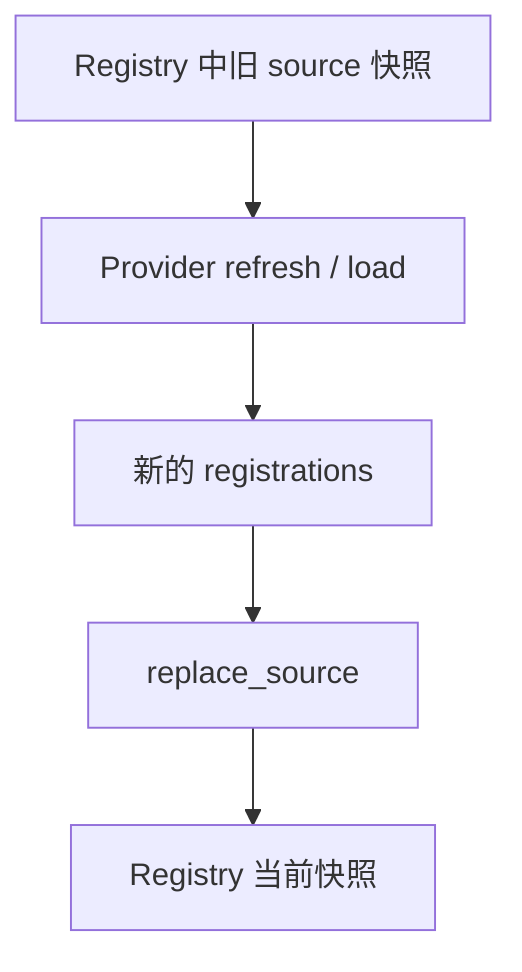

替换过程还具有回滚保护。新 registration 注册过程中一旦出现异常，Registry 会恢复之前的内容，避免留下半更新状态。

### 4.3 为什么两层都需要存在

理解方法很简单：

- Catalog 更接近“管理员希望系统提供什么”；
- Registry 更接近“运行过程中此刻真正能解析到什么”。

远端服务临时离线、Skill 文件缺失、知识库状态变化，都可能让运行时状态和静态配置不同。

### 4.4 STAR 复盘

| STAR | 内容 |
|---|---|
| S — Situation | 静态配置相对稳定，外部服务和本地资源的可用状态会变化 |
| T — Task | 同时保存稳定授权边界和当前运行事实 |
| A — Action | Catalog 保存静态定义，Registry 保存 Provider 当前注册结果，并按 source 原子替换 |
| R — Result | 系统可以刷新运行状态，同时保留稳定 capability id 和本地配置边界 |

---

## 5. Provider：不同底层工具怎样接入统一 Capability 协议

### 5.1 Provider 的公共职责

从 CapabilityLayer 的视角看，Provider 需要完成的核心事情非常少。

最主要的是：

1. `load()`：告诉系统“我当前有哪些 registration”；
2. `invoke()`：根据 binding 执行一次真实调用；
3. 可选的 `refresh()`：重新发现或更新来源状态；
4. 可选的 `reconnect()`：在连接故障后恢复连接；
5. `describe_execution()`：告诉 Execution 这次调用适合并发还是需要独占资源。

这套接口把底层差异收在 Provider 内部。

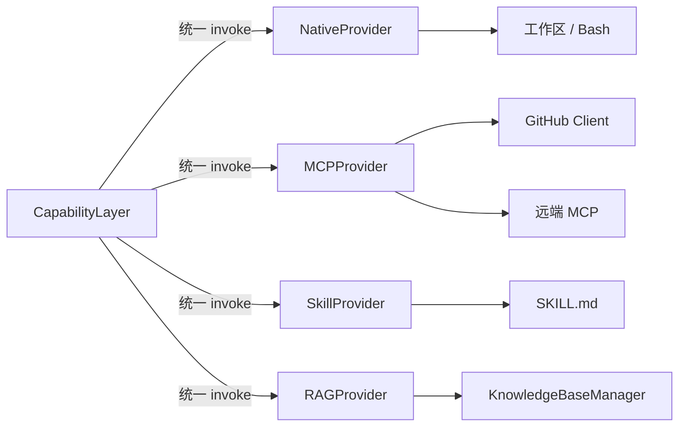

### 5.2 Provider 内部需要完成“绑定翻译”

每类 Provider 都会把 CapabilityBinding 中的 target 解释成自己认识的对象。

- NativeProvider 的 target 包含 handler 和 schema；
- MCPProvider 的 target 包含静态定义、远端工具描述和 schema；
- SkillProvider 的 target 指向受信任 Skill 定义；
- RAGProvider 的 target 保存知识库身份和当前状态。

CapabilityLayer 不需要理解这些 target 的内部结构，只需要把 registration 对应的 binding 交还给正确 Provider。

### 5.3 STAR 复盘

| STAR | 内容 |
|---|---|
| S — Situation | 文件操作、GitHub API、HTTP MCP、Skill 文本和知识库检索拥有完全不同的调用方式 |
| T — Task | 给上层提供一套稳定调用协议，同时保留各来源自己的实现细节 |
| A — Action | 每类来源实现 Provider，由 Binding 保存 Provider 所需目标，Layer 只通过统一 `load/invoke/refresh` 接口交互 |
| R — Result | Agent Loop 和 Harness 无需针对每一种 SDK 或 transport 编写独立调用流程 |

---

## 6. Discover：当前 Agent 怎样得到自己的工具集合

Provider 已经把能力放进 Registry，下一步才轮到 Agent 看工具。

### 6.1 Discover 实际做了什么

`CapabilityLayer.discover(context)` 会遍历 Registry 当前能力，并保留两类条件同时满足的项：

1. Capability 状态是 `AVAILABLE`；
2. `PermissionPolicy.can_discover()` 判断当前 Agent 的 discover pattern 匹配这项能力。

这里的 `InvocationContext` 至少携带当前 run、session、agent、repository，以及可能存在的 coding workspace 等信息。

当前 discover 的核心过滤依据是“运行状态 + Agent discover 策略”。

### 6.2 每个 Agent 得到的集合不同

`capabilities.yaml` 为不同 Agent 配置不同 discover 列表。

例如：

| Agent | 典型可见能力 |
|---|---|
| Main | 少量读取能力、Context7、RAG |
| Repository | 仓库树、代码搜索、文件读取、符号查找、历史、Skill 等 |
| Issues | Issue 读取与写入、相关仓库读取、参考资料 |
| Pull Requests | PR 信息、diff、review、merge 相关能力、代码审查 Skill |
| Coding | 仓库读取、本地文件工具、精确编辑、Bash、Skill、RAG、Context7 |

因此模型并不会拿到 Registry 的完整工具表。

### 6.3 Discover 后怎样变成模型 function tools

Harness 的 `llm_tools()` 会把 discover 的 Capability 转换成模型工具格式。

模型最终看到的主要是：

- function name；
- capability description；
- input schema。

内部 capability id 还会转换成模型函数名。例如点号和连字符会被转换成安全的 function name 形式。模型返回调用后，Harness 再根据当前 discover 集合把这个函数名解析回 capability id。

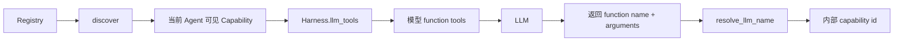

这里还有一层额外限制：Main Agent 构造 provider tools 时会使用 `read_only=True`，因此即使 discover 集合中出现其他访问等级的能力，模型工具生成阶段仍可以进一步只保留 READ。

### 6.4 为什么 discover 和 invoke 要分开

Discover 控制“模型能看到什么”。Invoke 授权控制“系统最终允许执行什么”。

模型工具列表会影响模型行为，所以越聚焦越容易降低误选工具的概率。执行阶段仍然必须重新授权，因为模型返回的调用属于外部输入，不能只依赖先前发给模型的工具列表。

### 6.5 STAR 复盘

| STAR | 内容 |
|---|---|
| S — Situation | 不同 Agent 职责不同，完整工具集既庞大又包含不适合当前角色的动作 |
| T — Task | 只把当前角色需要且当前可用的工具交给模型，同时保留执行阶段的最终权限检查 |
| A — Action | Registry 先按 AVAILABLE 过滤，PermissionPolicy 再按 Agent discover pattern 过滤，Harness 转成 function schema |
| R — Result | 模型看到的工具集合更小、更符合角色，真实调用仍然受 invoke 权限保护 |

---

## 7. Invoke：一次 Capability 调用怎样真正执行

这一节是整章最重要的部分。前面的所有组件最后都会汇合到这里。

先看完整流程，再逐步拆开。

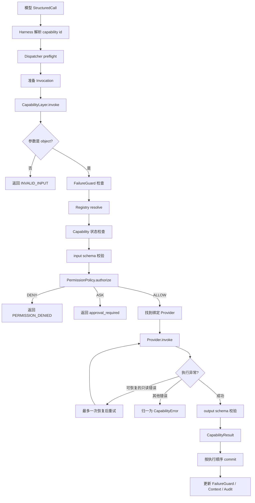

### 7.1 Dispatcher 先做执行前检查

CapabilityLayer 之前还有 Harness 的 Structured Call Dispatcher。

Dispatcher 会先检查这次调用是否满足工作流层面的前置条件，例如 protected capability 的业务约束，以及是否刚刚重复提交了完全相同的调用。

这一层掌握的是 Agent 工作流状态，因此适合处理“当前流程走到这里能不能做”的问题。

### 7.2 CapabilityLayer 先检查参数容器类型

进入 `CapabilityLayer.invoke()` 后，系统首先要求 arguments 必须是对象结构。

如果模型传入列表、字符串等形态，会直接得到 `INVALID_INPUT`，Provider 完全不会执行。

### 7.3 检查 FailureGuard

Layer 会根据下面三部分生成调用身份：

- 当前 agent id；
- capability id；
- 经过稳定序列化的 arguments。

如果同一个 run 中，这个完全相同的调用已经被 FailureGuard 记录为失败，并且当前调用没有经过对应的 preflight 放行，系统可以直接返回 `REPEATED_FAILURE`。

### 7.4 从 Registry 解析 registration

接着系统使用 capability id 调用 Registry `resolve()`。

找不到时返回 `CAPABILITY_NOT_FOUND`。

找到以后还要检查状态。状态未达到 `AVAILABLE` 时会返回 `UNAVAILABLE`，并尽量附带 Provider 给出的不可用原因。

### 7.5 校验 input schema

如果 Capability 定义了 `input_schema`，Layer 会在 Provider 执行前校验 arguments。

这一层保证模型虽然能生成 JSON 参数，也必须满足能力契约要求，例如：

- 必填字段存在；
- 字段类型正确；
- 数值范围满足限制；
- 不允许的额外字段不会混入调用。

输入不合法时依然不会触发底层副作用。

### 7.6 执行 PermissionPolicy.authorize

参数通过以后，Layer 才进行 invoke 授权。

授权结果有三种：

| 决策 | 含义 | 后续行为 |
|---|---|---|
| `ALLOW` | 当前上下文允许执行 | 继续调用 Provider |
| `ASK` | 需要明确审批 | 返回 `approval_required` |
| `DENY` | 当前上下文禁止调用 | 返回权限错误 |

这里会再次检查 Agent invoke 配置，因此 discover 通过并不能替代 invoke 授权。

### 7.7 找到正确 Provider 并执行

Registration 的 Binding 保存 `provider_id`。

Layer 会从已加载 Provider 表中找到对应 Provider，并再次确认 Provider id 与 Binding 一致。确认完成后调用 `provider.invoke(binding, arguments, context)`。

到这一刻，真实文件操作、GitHub API、HTTP 请求、Skill 读取或者 RAG 检索才真正发生。

### 7.8 只读调用允许非常有限的自动恢复

Provider 抛出异常后，Layer 会先把异常归一成统一 CapabilityError。

当前自动恢复范围非常保守，只针对 READ Capability：

- TIMEOUT 可以重试一次；
- UNAVAILABLE 可以尝试 reconnect / refresh 后重试一次；
- RATE_LIMITED 只有在 `retry_after` 很短时才允许等待后重试。

WRITE 和 DESTRUCTIVE 不进入这套自动重试逻辑。

原因会在错误处理章节集中解释。

### 7.9 Provider 成功后还要检查 output schema

底层调用成功返回数据，并不代表整个 Capability 调用已经成功。

如果定义了 `output_schema`，Layer 还要验证 Provider 返回的数据是否符合约定。

这里尤其需要关注写操作：Provider 已经执行以后才发现输出结构错误，外部副作用可能已经发生。因此系统会在错误 details 中记录 `provider_executed` 和 `side_effect_possible`，供后续恢复逻辑判断。

### 7.10 最后返回统一 CapabilityResult

成功时结果会根据 Capability kind 分类：

- Native / MCP → `data`；
- Skill → `context`；
- RAG → `retrieval`。

失败时统一返回失败状态和 CapabilityError。

Agent Loop 因而可以用同一种结果协议处理不同 Provider。

### 7.11 FailureGuard 在 commit 阶段更新

FailureGuard 的失败事实并不会在任意工作线程结束时立即写入。

`commit_failure_guard()` 明确放在有序 commit 路径中：

- 成功调用会清掉对应失败记录；
- 普通失败会记录调用身份和错误类型；
- `REPEATED_FAILURE`、`DUPLICATE_CALL` 这类已经属于重复控制的错误不会再次登记。

这样做可以让并发执行时的“实际完成顺序”和“Agent 观察到的提交顺序”保持清晰边界。

### 7.12 STAR 复盘

| STAR | 内容 |
|---|---|
| S — Situation | 模型调用属于外部生成输入，而且底层能力可能产生文件、网络或远端仓库副作用 |
| T — Task | 在真实执行前逐层确认调用有效，在执行后统一整理结果和失败语义 |
| A — Action | Dispatcher preflight → FailureGuard → Registry → schema → authorize → Provider → 恢复 → output schema → ordered commit |
| R — Result | 每次调用拥有清晰检查路径，模型错误、权限错误、底层错误和返回结构错误可以被分开识别 |

---

## 8. PermissionPolicy：系统怎样控制“看得见”和“真的能执行”

### 8.1 权限配置采用默认拒绝

`capabilities.yaml` 顶层要求：

- discover 默认 deny；
- invoke 默认 deny。

因此某项能力只有明确出现在 Agent 的规则里才有机会被看见或调用。

Agent 规则分成两层。

第一层是 `discover`，控制模型工具集合。

第二层是 `invoke`，进一步分成：

- allow；
- ask；
- deny。

规则支持 pattern，例如 `context7.*` 或 `rag.*`。

### 8.2 启动时先检查权限配置有没有自相矛盾

PermissionPolicy 不会等到运行中才发现配置冲突。

启动阶段会检查同一 Capability 是否同时落在 allow / ask / deny 多个桶里，也会检查访问等级和权限桶是否匹配。

例如 READ Capability 应进入 allow；普通远端 WRITE / DESTRUCTIVE 动作通常需要 ask。

### 8.3 Coding Workspace 的本地修改是一个专门分支

Coding Agent 在隔离工作树中执行本地修改时，`native.write`、`native.edit`、`native.delete` 这类带 path 的 Native 写能力可以配置为 allow。

PermissionPolicy 仍会要求 `InvocationContext` 中存在 active workspace root。缺少工作区时直接拒绝。

这说明权限判断不仅看 capability id，也会结合当前执行上下文。

### 8.4 Bash 还有第二层命令策略

`native.bash` 在 capability 级别进入 allow 后，还要经过 `BashCommandPolicy`。

策略会解析命令 token，并识别：

- 只读 Git 观察命令；
- 测试、lint、typecheck、build 等真实验证命令；
- package manager 中可能修改依赖或发布内容的命令；
- 管道、重定向、命令连接、子 shell 等复杂 shell 结构。

因此 `native.bash` 的 capability 权限只解决“这个 Agent 有没有 Bash 入口”，命令策略继续解决“这一条具体命令能不能执行”。

需要特别注意：当前 Native Bash 是宿主机进程执行机制。工作树范围和命令策略可以降低误操作风险，但它们不等同于操作系统级文件系统或网络 sandbox。

### 8.5 STAR 复盘

| STAR | 内容 |
|---|---|
| S — Situation | 一个 Agent 可能只负责阅读，另一个 Agent 可能需要改文件、发评论或合并 PR，各动作风险差异很大 |
| T — Task | 同时控制模型可见范围和最终执行资格，并让高风险动作获得额外约束 |
| A — Action | 默认拒绝；discover 控制可见性；invoke 使用 allow/ask/deny；Coding Workspace 和 Bash 再结合上下文做专门判断 |
| R — Result | Agent 职责可以通过配置明确表达，执行阶段还有最终授权入口，高风险动作不会仅凭模型选择就直接发生 |

---

## 9. NativeProvider：本地文件与命令能力怎样设计

NativeProvider 是最适合理解“结构化工具”价值的一组能力。

### 9.1 它先把本地动作拆成明确职责

当前 NativeProvider 包含：

| Capability | 主要用途 |
|---|---|
| `native.read` | 读取已知文件的有限行范围 |
| `native.glob` | 按路径模式找文件 |
| `native.grep` | 按正则搜索文本位置 |
| `native.now` | 获取本地时间 |
| `native.write` | 创建或完整覆盖文本文件 |
| `native.edit` | 对唯一旧文本做精确替换 |
| `native.delete` | 删除普通文件 |
| `native.bash` | 执行通过策略检查的单条命令 |

这些工具各自拥有自己的 input schema 和 output schema。

模型需要显式表达“我要找路径”“我要读这个范围”“我要把这一段替换成另一段”，系统就能获得更清楚的操作意图和结构化结果。

### 9.2 文件路径怎样限制在授权范围内

NativeProvider 会把工作区路径解析到授权 root 下，并拒绝：

- 绝对路径；
- 包含 `..` 的逃逸路径；
- resolve 后离开授权 root 的路径；
- 运行时保留的 blocked path；
- 通过 workspace 入口绕到 Memory root 的访问。

Memory root 只能通过被授权的命名 root 读取，并且保持只读。

当 Coding Agent 拥有独立 worktree 时，`InvocationContext.workspace_root` 会让 NativeProvider 把当前调用范围切换到这棵工作树。

### 9.3 为什么查找、读取、修改要拆开

先看推荐的文件操作路径：

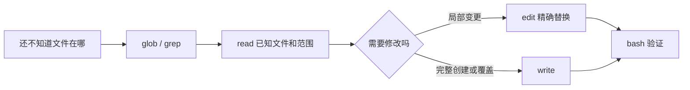

每一步都给下一步提供更明确证据。

`glob/grep` 负责定位；`read` 负责建立当前文件事实；`edit/write` 负责修改；`bash` 负责运行项目自己的验证命令。

这样 Harness 和 Agent 都更容易知道“读了什么、改了什么、验证了什么”。

### 9.4 `native.edit` 怎样处理并发变化和定位歧义

`native.edit` 要求模型提供：

- 文件路径；
- `old_text`；
- `new_text`。

Provider 会统计 `old_text` 在当前文件里的出现次数。

| 匹配次数 | 含义 | 行为 |
|---|---|---|
| 0 | 模型依据的旧内容已经不符合当前文件 | 返回冲突，让 Agent 重新读取 |
| 1 | 修改位置唯一 | 执行替换 |
| 多次 | 修改目标存在歧义 | 返回冲突，让 Agent 提供更长上下文 |

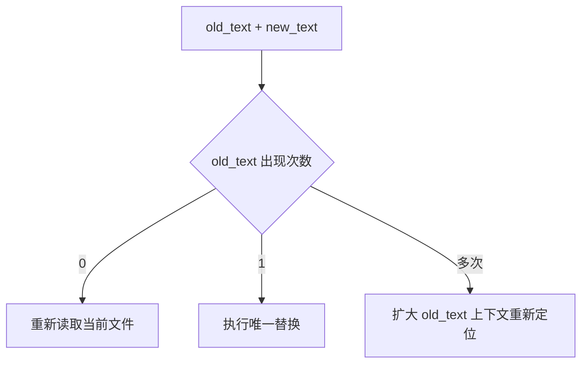

这里没有让工具自动猜测模型想修改哪一处。修改前提需要由模型通过上下文明确表达。

### 9.5 执行调度信息也由 Provider 提供

NativeProvider 的 `describe_execution()` 会告诉 Harness：

- READ Capability 可以并发；
- WRITE / DESTRUCTIVE Capability 对当前 workspace 申请独占写资源。

因此 Capability 除了负责“能不能执行”，还向下一章的 Execution 层提供“应该怎样调度”的语义。

### 9.6 STAR 复盘

| STAR | 内容 |
|---|---|
| S — Situation | Coding Agent 需要查找、读取、修改和验证真实项目文件，本地工具如果过于自由，操作意图和影响范围很难判断 |
| T — Task | 把本地开发动作拆成可验证、可限制、可调度的结构化操作 |
| A — Action | 分离 glob/grep/read/edit/write/bash；限制授权 root；精确 edit 要求唯一匹配；Provider 给出读写执行 profile |
| R — Result | 文件操作拥有明确证据链，路径和修改范围更容易控制，并发调度也能依据读写语义进行 |

---

## 10. MCPProvider：GitHub 本地适配和远端 MCP 怎样共用一套接入方式

### 10.1 先理解 MCPProvider 自己负责什么

MCPProvider 保存两类东西：

- MCP server 定义；
- 每项固定 Capability 对应的 `MCPToolBinding`。

Binding 中保留：

- 静态 CapabilityDefinition；
- 对模型展示的描述；
- input schema；
- output schema。

执行时，MCPProvider 根据 definition 中的 `server_id` 找到 client，再根据 `remote_name` 调用对应工具。

### 10.2 GitHub 使用 local adapter

当前 `github` server 在配置里使用 `local_adapter`。

应用会把已经创建好的 GitHub Client 注入 MCPProvider。

对于这种 client，MCPProvider 会直接根据 `remote_name` 找到 GitHub Client 方法，并从 Python 方法签名推导 input schema 和 output schema。

调用时如果 server 配置要求 `inject_repository`，Provider 会从 `InvocationContext.repository` 补入 repository 参数。

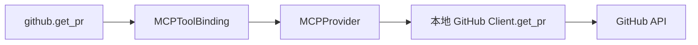

所以这里的 MCPProvider 更像统一适配层。真实 GitHub 请求仍由 GitHub Client 完成。

### 10.3 Context7 使用 Streamable HTTP

Context7 server 使用 `streamable_http`。

应用会创建 `StreamableHTTPTransport` 作为 client 交给 MCPProvider。

第一次调用远端工具时，Transport 会先初始化 MCP 会话，然后调用 `tools/list` 或 `tools/call`。

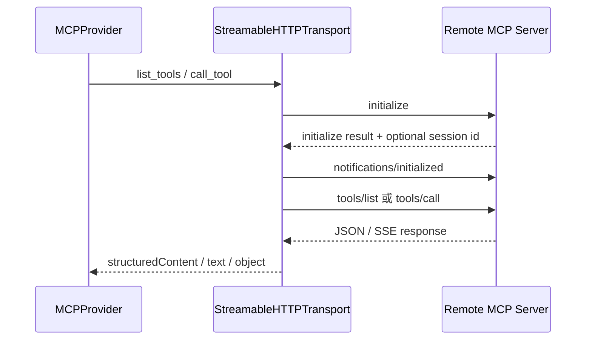

Transport 负责会话和 HTTP 协议细节，MCPProvider 继续负责 capability binding、状态、schema 和异常翻译。

### 10.4 Refresh 怎样更新远端工具信息

当 client 支持 `list_tools()` 时，MCPProvider 可以 refresh。

它会读取远端当前工具列表，然后只处理已经存在本地 CapabilityDefinition 的映射：

- 远端仍存在的已配置工具，可以更新 description、input schema、output schema；
- 已配置工具在远端消失时，会从新的 Provider 快照中消失；
- 远端新出现但本地从未配置映射的工具，不会自动生成新的固定 Capability。

随后 CapabilityLayer 再按 source 使用 `replace_source()` 更新 Registry。

这让“远端工具状态变化”和“本地授权边界变化”成为两件独立的事情。

### 10.5 MCP 错误怎样先在 Provider 边界归类

MCPProvider 会把常见 transport / client 异常转换成 Provider 级错误，例如：

- 401 → authentication；
- 404 → resource not found；
- 409 → conflict；
- 429 → rate limit；
- timeout → provider timeout；
- 连接不可用 → provider unavailable。

对于写操作，它还会关注请求是否可能已经发出。连接断开时如果远端副作用存在不确定性，会按更谨慎的超时语义处理。

### 10.6 STAR 复盘

| STAR | 内容 |
|---|---|
| S — Situation | GitHub Client 和远端 Context7 的连接形式不同，但从 Agent 角度都属于结构化外部工具 |
| T — Task | 让它们进入统一 Capability 协议，同时保留不同 transport 的实现方式 |
| A — Action | MCPProvider 用 server_id + remote_name 绑定工具；local adapter 调本地 client；streamable_http 调远端 transport；refresh 只更新已配置映射 |
| R — Result | Agent 使用相同调用流程，连接细节集中在 Provider / Transport，远端变化也不会自行扩张本地能力集合 |

---

## 11. SkillProvider：怎样把“做事方法”接入 Capability 系统

### 11.1 Skill 的运行方式

SkillProvider 从固定可信目录读取配置允许的 `SKILL.md`。

每项 Skill Capability：

- input schema 为空对象；
- access 为 READ；
- 文件存在且配置启用时状态为 AVAILABLE；
- 调用后返回 Skill 文本内容。

Skill 路径还必须位于 trusted root 内，并且目标文件名必须是 `SKILL.md`。

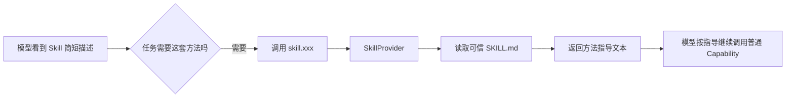

### 11.2 Skill 在系统里产生什么效果

Skill 调用只给模型增加一段方法上下文。

例如 Debug Skill 可以指导 Coding Agent先建立故障覆盖、确认因果链、做聚焦修复、再独立验证。后续真正读取文件、编辑代码、运行测试时，Agent 仍然需要调用相应 Native 或 Repository Capability。

Skill 本身不会因此获得新的文件、GitHub 或 Bash 权限。

### 11.3 STAR 复盘

| STAR | 内容 |
|---|---|
| S — Situation | 某些任务难点在处理方法和步骤顺序，单纯增加底层工具无法保证模型采用合适流程 |
| T — Task | 让模型按需加载可靠工作方法，同时不改变执行权限 |
| A — Action | 把可信 `SKILL.md` 暴露成 READ Capability，模型需要时主动调用并获取全文 |
| R — Result | 方法指导可以模块化复用，真实副作用依旧受普通 Capability 权限和 Provider 控制 |

---

## 12. RAGProvider：动态知识库怎样表现成普通只读能力

### 12.1 RAG Capability 怎样生成

RAGProvider 和固定 Catalog 能力有一点区别。

它会询问 `KnowledgeBaseManager` 当前已经注册的知识库，并为每个知识库动态生成 `rag.<knowledge_base_id>` Capability。

每项 RAG Capability 都有统一查询 schema，模型需要传入一个聚焦的 `query`。

状态根据知识库运行状态决定：

- READY / STALE 可以作为 AVAILABLE 暴露；
- ERROR 等状态会表现为 UNAVAILABLE。

### 12.2 调用结果怎样统一

Provider 调用 KnowledgeBaseManager 完成检索，并返回结构化结果，其中包含：

- knowledge base id；
- stale 标记；
- hits；
- hit count；
- 可选 notice 和耗时信息。

对 Agent Loop 来说，RAG 仍然按照 discover → schema → authorize → invoke → CapabilityResult 这条主流程执行。

### 12.3 STAR 复盘

| STAR | 内容 |
|---|---|
| S — Situation | 知识库数量和状态会动态变化，内部还有索引、同步、检索等复杂机制 |
| T — Task | 让 Agent 以简单统一方式查询当前可用知识库 |
| A — Action | RAGProvider 根据 KnowledgeBaseManager 动态生成 READ Capability，并统一 query / result schema |
| R — Result | Agent 无需理解向量索引内部生命周期，只需调用 `rag.*` 能力完成检索 |

RAG 的索引和知识库生命周期适合单独深入，本章只关注它怎样接入 Capability 层。

---

## 13. 错误系统：不同 Provider 的失败怎样变成统一语义

### 13.1 Provider 先抛出接近底层事实的错误

不同来源会出现不同异常：

- 文件冲突；
- HTTP 超时；
- 认证失败；
- 速率限制；
- 资源不存在；
- 远端服务不可用；
- 工具执行失败；
- 输入或输出不合法。

Provider 边界先尽量把 SDK / transport 异常翻译成 Provider 错误。

### 13.2 CapabilityLayer 再归一成 CapabilityError

Layer 捕获 Provider 异常后通过 `normalize_provider_error()` 转成有限的 CapabilityErrorType。

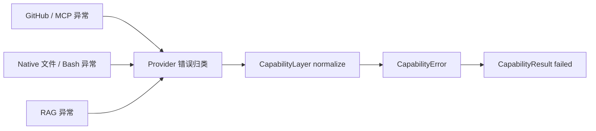

Agent Loop 因此不需要认识 `urllib`、GitHub SDK、文件系统或知识库内部异常类型。

### 13.3 为什么自动重试只覆盖少量 READ 错误

READ 调用通常没有外部写副作用，所以一次超时或临时不可用后进行有限恢复，风险相对容易判断。

WRITE / DESTRUCTIVE 调用情况复杂得多。

例如“发布评论”的 HTTP 请求发出后连接中断，本地只知道响应没有收到，却无法直接确定远端到底有没有成功创建评论。此时自动重试可能产生重复副作用。

因此当前 CapabilityLayer 只对少量 READ 错误做最多一次自动恢复。

### 13.4 STAR 复盘

| STAR | 内容 |
|---|---|
| S — Situation | 每个 Provider 的异常体系不同，写调用还存在“请求是否已经生效”的不确定性 |
| T — Task | 给 Agent Loop 提供稳定错误类型，并避免恢复机制扩大副作用 |
| A — Action | Provider 先做来源级错误翻译，Layer 再统一成 CapabilityError；自动恢复只覆盖少量可判断的 READ 情况 |
| R — Result | 上层可以统一处理失败，同时保留认证、冲突、限流、超时、不可用等关键语义 |

---

## 14. FailureGuard：系统怎样阻止模型反复撞同一个错误

### 14.1 FailureGuard 怎样记录一次失败

FailureGuard 为失败调用构造稳定身份：

`agent id + capability id + 规范化 arguments`

arguments 会排序并序列化，所以字段顺序变化不会被误认为新的调用。

失败事实按 `run_id` 保存，只影响当前运行。

### 14.2 为什么记录动作放到 ordered commit

Execution 可能并行运行多个只读 Capability。

如果哪个线程先结束就立刻修改 Agent 可见状态，后续行为会依赖线程完成时机。GitAgent 因此把 FailureGuard 更新放进 ordered commit。

这时系统已经决定哪些结果按什么顺序正式提交给 Agent，上下文状态和失败状态可以一起前进。

### 14.3 Dispatcher 的 duplicate call 与 FailureGuard 有什么区别

两者关注的时间尺度不同。

- Dispatcher 会检查模型是否紧接着又提交了完全相同的调用，给出 duplicate / repeated correction 反馈；
- FailureGuard 记住当前 run 中已经正式提交的失败事实，可以阻止后面再次盲试同一 capability + arguments。

Provider 自己的网络重试又属于另一层，它处理的是单次调用内部的临时连接失败。

### 14.4 STAR 复盘

| STAR | 内容 |
|---|---|
| S — Situation | 模型看到失败后可能重复生成完全相同调用，尤其在错误信息没有被充分利用时 |
| T — Task | 阻止当前 run 中已经证明失败的同一动作无限循环 |
| A — Action | 用规范化调用身份记录失败，并在有序 commit 后更新 FailureGuard |
| R — Result | 重复失败可以快速被识别，减少无意义步骤，同时不把并发线程完成顺序混入 Agent 状态 |

---

## 15. 把所有部分串起来：一次“查资料并修改代码”的完整 Capability 链

现在用一个实际任务把前面所有组件连起来。

假设 Coding Agent 需要修复一个第三方 Python 库 API 使用错误。

### 第 1 步：Agent 获取当前工具集合

CapabilityLayer 从 Registry 中筛出 AVAILABLE 能力，再根据 coding Agent 的 discover 配置过滤。

Coding Agent 可以看到仓库读取、本地文件、Context7、RAG、Skill 和验证工具。

Harness 把这些 Capability 转换成模型 function tools。

### 第 2 步：模型先加载 Debug Skill

模型判断当前任务需要系统化排障，于是调用 `skill.debug`。

SkillProvider 读取固定可信 `SKILL.md`，返回方法指导文本。

这一步只增加上下文，不修改仓库。

### 第 3 步：模型查询第三方库资料

如果库 id 未知，模型先调用 Context7 的 resolve capability，再调用文档查询 capability。

MCPProvider 把调用交给 StreamableHTTPTransport，Transport 建立 MCP 会话并访问远端工具。

返回资料仍然封装成 CapabilityResult。

### 第 4 步：定位当前仓库代码

Agent 可以用 repository search 查远端仓库事实，也可以在 active coding workspace 使用 `native.grep` / `native.glob` 定位文件。

找到目标路径以后，再通过 bounded read 读取相关范围。

### 第 5 步：精确修改文件

模型根据刚刚读到的文本生成 `native.edit` 调用。

CapabilityLayer 先做 schema 和权限检查；NativeProvider 再确认路径位于 active workspace，并要求 `old_text` 唯一匹配。

修改成功后返回结构化 diff 和 changed 状态。

### 第 6 步：运行真实验证

模型调用 `native.bash` 执行项目测试、lint 或 typecheck。

PermissionPolicy 先确认 coding Agent 具有 Bash 入口，BashCommandPolicy 再判断这条命令属于允许的真实验证命令。

命令在当前 coding workspace 中执行，结果以受限输出返回。

### 第 7 步：结果按顺序提交回 Agent

Execution 负责调度调用，Dispatcher / Context 负责 ordered commit。

Capability 的成功、失败、FailureGuard 更新和审计信息在提交路径中形成稳定的 Agent 观察结果。

整条链可以画成：

这条链包含 Skill、远端 MCP、Repository、本地 Native 等多种来源，但上层一直使用同一套 Capability 协议。

---

## 16. 到这里再讨论设计原因：Capability 层解决了哪些系统问题

前面已经完整走过“怎样设计”和“怎样执行”，现在再回头看这一层存在的原因会更容易理解。

### 16.1 把模型协议和底层 SDK 解耦

模型只需要认识 capability name、description 和 schema。

GitHub Client 怎样发送 API、Context7 怎样握手、Skill 怎样读文件、RAG 怎样查索引，都留在 Provider 内部。

这样上层 Agent 不会被某个 SDK 的方法名和异常类型绑死。

### 16.2 把“发现权限”和“执行权限”集中管理

如果每个 Agent 自己维护一套工具列表和权限判断，很容易出现角色之间规则漂移。

Capability 系统通过 Catalog + PermissionPolicy 集中配置，启动时还会做交叉校验。

### 16.3 给动态外部服务保留稳定本地边界

远端 MCP 可以变化，RAG 知识库也可以变化。

Provider refresh 和 Registry snapshot 允许运行状态更新，本地固定映射和权限配置仍然由 GitAgent 控制。

### 16.4 给 Execution 提供统一调度语义

Provider 还能描述 invocation 的并发和资源声明。

READ 通常可以并发；对 workspace 或 repository 的写操作通常申请独占资源。

这样工具来源差异不会阻止 Execution 做统一批处理和并发控制。

### 16.5 给错误处理提供统一语言

CapabilityError 把底层异常压缩成有限、可推理的错误类别。

Agent 能据此判断应该换参数、重新读取、等待、停止调用还是请求用户审批。

---

## 17. 整章 STAR 总结

### S — Situation：系统面对什么现实情况

GitAgent 的动作来源很多：本地工作区、GitHub API、远端 MCP、Skill、RAG。它们的 schema、连接方式、权限风险、可用状态、并发语义和异常类型都不同。

同时，模型生成的调用不能直接被当成可信执行指令。每个 Agent 还有自己的职责边界。

### T — Task：Capability 系统要完成什么任务

系统需要建立一条稳定边界，让模型始终通过结构化能力做事，并且在真实执行前回答下面几个问题：

1. 这项能力当前存在吗？
2. 当前 Agent 看得到它吗？
3. 参数符合契约吗？
4. 当前上下文允许执行吗？
5. 应该交给哪个 Provider？
6. 出错以后怎样统一表达？
7. 这次调用怎样参与并发和有序提交？

### A — Action：GitAgent 具体怎样实现

GitAgent 使用 Catalog 保存静态能力定义和 Agent 权限配置；Provider 把不同来源转换成 CapabilityRegistration；Registry 保存当前运行时快照；discover 生成每个 Agent 的可见能力集合；Harness 把 Capability 转换成模型 function tools；Dispatcher 处理工作流 preflight；CapabilityLayer 在 invoke 中完成参数校验、Registry 解析、权限授权、Provider 调用、有限恢复、输出校验和结果归一；FailureGuard 在 ordered commit 后记录失败事实；Provider 另外提供执行 profile 给 Execution 层使用。

### R — Result：最终得到什么

上层 Agent 使用一套稳定协议就能访问多种底层资源。

新增或替换 Provider 时，不需要改写 Agent Loop 的基本调用协议。权限配置、错误处理、动态刷新和并发描述都有集中入口。模型获得的是经过筛选的结构化动作集合，真实副作用继续受运行时授权和 Provider 边界控制。

可以把最终结构压缩成下面这张图：

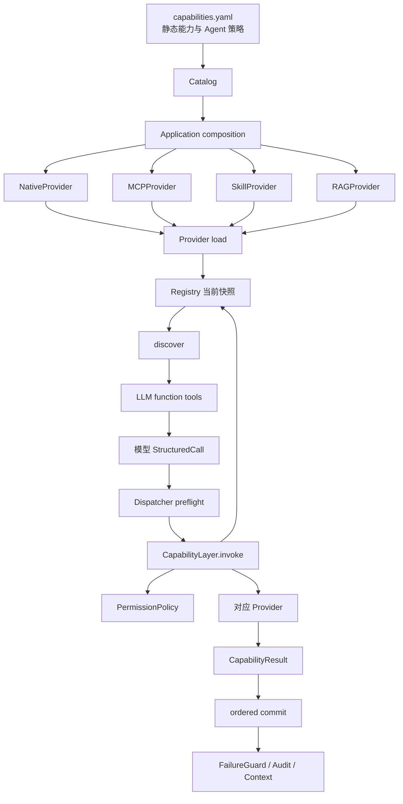

---

## 18. 复习时应该怎样讲这套系统

如果面试或复习时需要在几分钟内讲清楚，建议按下面顺序。

先说整体职责：Capability 层位于模型 StructuredCall 和真实工具之间，负责统一能力发现、授权、执行和结果协议。

然后画四个核心盒子：Catalog、Registry、PermissionPolicy、Provider。

接着沿一项能力的生命周期讲：

`配置定义 → Provider load → Registry → discover → LLM tool schema → StructuredCall → preflight → invoke 校验与授权 → Provider → CapabilityResult → ordered commit`

再举两个来源不同的例子：

- `native.edit`：说明本地工具怎样做路径约束和唯一匹配；
- `context7.query-docs`：说明远端 MCP 怎样通过 stable capability id 接入。

最后补充两个容易拿分的设计点：

- discover 和 invoke 分层，模型可见性不能代替真实授权；
- WRITE / DESTRUCTIVE 调用不会参与通用自动重试，因为远端副作用可能存在不确定性。

如果还能继续展开，再讲 Skill、RAG、FailureGuard 和 ExecutionProfile。

---

## 19. 常见混淆点

| 容易混淆的说法 | 更准确的理解 |
|---|---|
| Capability 只是函数包装 | Capability 还承载 id、schema、状态、访问等级、来源等执行契约 |
| Catalog 就是当前工具列表 | Catalog 保存静态配置意图，Registry 保存当前运行时 registration |
| 模型没有看到某个工具就已经完成安全控制 | invoke 阶段还会重新执行真实授权 |
| MCPProvider 里的 GitHub 每次都经过远端 MCP HTTP | 当前 GitHub server 使用 local adapter，真实 API 由本地 GitHub Client 调用 |
| 远端 MCP 新增工具后会自动出现在 Agent 工具箱 | refresh 只更新已有本地映射，新的远端名称没有固定映射就不会自动获得能力身份 |
| Skill 会直接完成调试或代码审查 | Skill 返回工作方法文本，后续动作仍通过普通 Capability 完成 |
| RAG 需要 Agent Loop 使用专门检索协议 | RAGProvider 把知识库包装成普通 READ Capability |
| worktree + Bash policy 等于完整 OS sandbox | 当前实现仍运行宿主机进程，工作区和命令策略主要提供范围与命令约束 |
| Provider 返回成功就一定完成 Capability 调用 | 返回数据还可能需要经过 output schema 校验 |
| FailureGuard 在 Provider 报错时立刻修改全局状态 | 它通过 ordered commit 更新当前 run 的失败记录 |

---

## 20. 代码定位：复习某个问题时应该看哪里

本章不通过大段代码解释设计。真正需要核对实现时，可以按问题定位文件。

| 想核对的问题 | 主要位置 |
|---|---|
| 应用怎样组装整套 Capability 系统 | `gitagent/application/capabilities.py` |
| 固定能力和 MCP server 配置怎样读取 | `gitagent/capability/catalog.py` |
| Capability / Binding / Registration / Result 数据结构 | `gitagent/capability/models.py` |
| 当前运行时 registration 怎样保存和按 source 替换 | `gitagent/capability/registry.py` |
| load / refresh / discover / invoke / retry / FailureGuard | `gitagent/capability/layer.py` |
| Agent discover / invoke / Bash 权限策略 | `gitagent/capability/policy.py` |
| schema 定义和运行时校验 | `gitagent/capability/schema.py` |
| Capability 错误归一 | `gitagent/capability/errors.py` |
| Native 文件与 Bash 工具 | `gitagent/capability/providers/native.py` |
| GitHub local adapter 和远端 MCP binding | `gitagent/capability/providers/mcp.py` |
| Skill 文件加载 | `gitagent/capability/providers/skill.py` |
| RAG 动态 Capability | `gitagent/capability/providers/rag.py` |
| MCP Streamable HTTP 会话与 RPC | `gitagent/infra/mcp/transport.py` |
| Capability 怎样转换成模型 function tools | `gitagent/harness/execution.py` |
| StructuredCall preflight、batch 执行与 commit | `gitagent/harness/structured_call_dispatcher.py` |
| 固定能力、server 和 Agent 权限配置 | `capabilities.yaml` |

---

## 21. 一句话收尾

> GitAgent 的 Capability 系统先把各种底层动作注册成统一的运行时能力，再按 Agent 角色筛选给模型；模型发起调用后，系统继续经过工作流检查、schema 校验、权限授权和 Provider 执行，最后用统一结果协议提交回 Agent。

掌握这一条主线以后，再看 Native、MCP、Skill、RAG，都可以理解成“不同来源怎样接入同一条 Capability 生命周期”。

下一章进入 Execution 层，继续回答一个新的问题：模型一次提出多个 Capability 后，系统怎样决定并发、串行、资源冲突和最终提交顺序。参见 [06-execution-and-concurrency.md](06-execution-and-concurrency.md)。
