# 05 Capability 与工具系统：不同工具怎样被组织成一套统一能力

上一章停在 StructuredCall：模型已经明确表达“想调用什么、参数是什么”，但它还没有真正接触文件系统、GitHub、MCP 服务、Skill 或 RAG。接下来要解决的是：这个调用怎样找到真实实现；当前 Agent 能不能看到和执行；输入输出怎样校验；不同底层错误怎样统一；动态来源变化以后运行时怎样更新。

GitAgent 用 Capability 系统处理这些问题。本章先把 Capability 的运行结构和生命周期讲清楚，再分别看 Native、GitHub/MCP、Skill、RAG 四类 Provider 怎样适配进来，最后讨论为什么要这样设计。

---

## 1. Capability 位于模型调用和真实工具之间

模型不会直接调用 GitHub Client、文件系统函数或 MCP HTTP 接口。应用启动时，系统先把不同来源的动作整理成统一 Capability；每个 Agent 只能看到自己允许发现的那部分。模型返回调用以后，Harness 再把模型函数名还原成内部 Capability id，经过工作流检查、schema、权限和执行调度，最后交给绑定的 Provider。

真正执行时再走另一段：

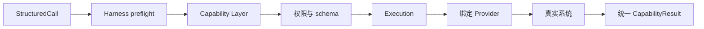

这层的核心价值不是“给函数再包一层名字”，而是建立一个稳定动作契约：上层 Agent 只认识 Capability，底层 Provider 负责把这个契约翻译成具体实现。

---

## 2. 一项 Capability 需要描述哪些事情

一项运行时能力既要给模型看，又要给权限、执行和结果校验使用，所以仅有函数名不够。可以把 Capability 信息分成四组。

| 信息组 | 主要内容 | 用途 |
|---|---|---|
| 身份与来源 | 稳定 id、类型、source | 让运行时明确这是什么能力、来自哪里 |
| 模型可见合同 | 描述、input schema | 告诉模型什么时候用、参数怎样组织 |
| 执行约束 | READ / WRITE / DESTRUCTIVE、当前状态 | 参与权限、审批和调度 |
| 结果合同 | output schema | 检查 Provider 返回是否满足统一协议 |

同时，GitAgent 把“能力是什么”和“能力具体由谁实现”分开。

- **Capability** 描述稳定动作契约。
- **Binding** 描述它应该交给哪个 Provider，以及 Provider 内部要调用哪个目标。
- 二者组合成运行时 registration，放入 Registry。

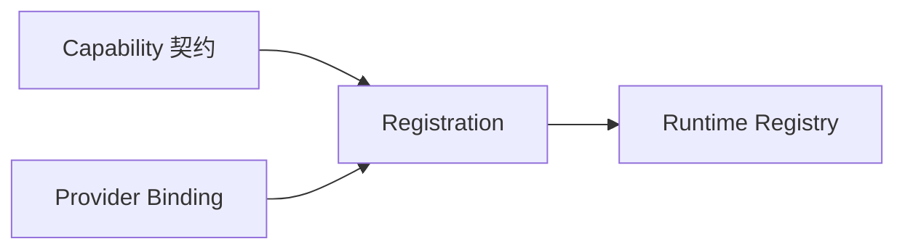

以文件精确编辑为例：对模型来说，它是“用旧文本定位并替换”的写能力；对权限系统来说，它属于本地 WRITE；对 Native Provider 来说，它绑定到真实文件编辑实现；对 Execution 来说，它会占用当前 workspace 的写资源。统一 Capability 让这些层围绕同一个动作身份协作。

---

## 3. 应用启动时，Capability 系统怎样组装

理解调用之前，先看运行时能力从哪里来。启动过程可以分成“读取静态策略”和“让 Provider 生成当前快照”两段。

### 3.1 静态配置先定义固定能力和 Agent 权限

`capabilities.yaml` 主要保存三类内容：固定 Capability 定义、每个 Agent 的 discover / invoke 策略，以及 MCP server 配置。

加载时会先做结构校验。例如：默认 discover 和 invoke 必须采用 deny；固定 Native 能力必须有本地 handler；MCP 能力必须能找到 server 和 remote tool；Skill 必须指向允许的 Skill 文件；未知 Provider 或 transport 会在启动阶段直接报错。

这里得到的是“系统配置上认识哪些能力、希望怎样授权”，还不是当前进程真正可用的运行时快照。

### 3.2 再创建 Permission Policy、Registry 和 Provider

应用根据权限配置创建 Permission Policy，再创建 Capability Layer。Capability Layer 持有运行时 Registry、权限策略、Failure Guard、Trace，以及已经装配的 Provider。

当前主要有四类 Provider：

| Provider | 适配的真实来源 |
|---|---|
| Native Provider | 本地工作区文件、查找、编辑、Bash、时间等 |
| MCP Provider | GitHub 本地 adapter，以及 Context7 等远端 MCP 工具 |
| Skill Provider | 可信目录中的 `SKILL.md` |
| RAG Provider | 当前 Knowledge Base Manager 中已注册的知识库 |

其中 GitHub 和 Context7 都经过 MCP Provider，但连接方式不同：GitHub 使用本地 adapter，实际请求由本地 GitHub Client 完成；Context7 使用 Streamable HTTP 连接真正的远端 MCP server。也就是说，MCP Provider 在这里承担的是统一工具绑定和协议适配，不代表所有 MCP 类型能力都一定经过远端 HTTP。

### 3.3 Provider 生成 registration 快照

每个 Provider 在 `load` 时返回自己当前拥有的 registration。Layer 会检查 registration 是否确实归属于这个 Provider，然后按 source 把整个快照写入 Registry。

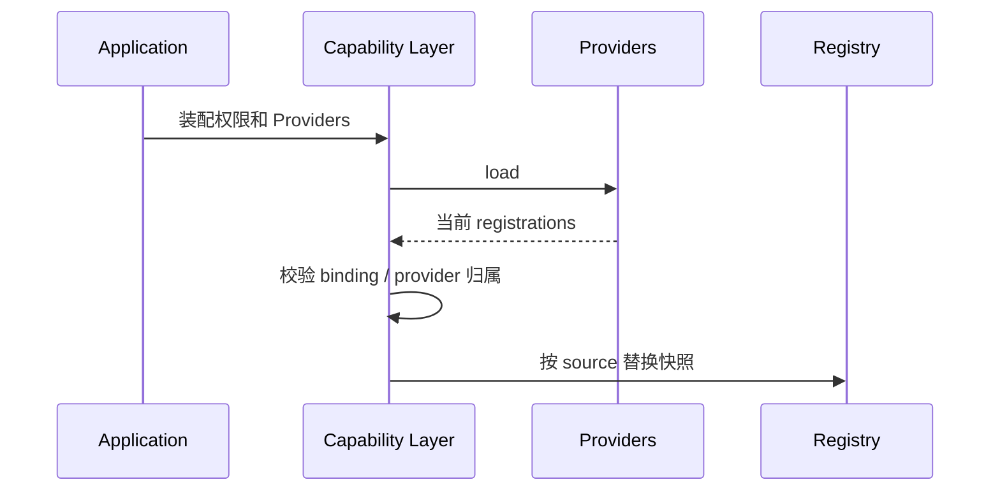

所有 Provider 加载完成以后，权限层还会做交叉校验，确认“运行时真实存在的能力”和“Agent 权限规则”没有明显冲突。例如普通远端写操作不能被误配置成无条件 allow；Coding Agent 的本地写能力则走专门的 workspace 规则。

这样启动失败会尽量发生在真正执行任务之前，而不是等模型选中某个工具时才发现配置根本不成立。

---

## 4. Catalog 和 Registry 为什么同时存在

这两个概念看起来都像“工具表”，但作用不同。

### 4.1 Catalog 表达配置意图

Catalog 来自 `capabilities.yaml`，更接近稳定配置。对于固定 MCP 能力，它会保存本地 Capability id、所属 source、目标 MCP server、远端工具名、访问等级和启用状态。

因此 Catalog 主要回答：**GitAgent 这份应用配置认识并允许映射哪些固定能力。**

RAG 是一个例外：知识库可能运行时动态注册，所以 `rag.<knowledge_base_id>` 不要求提前在 Catalog 为每个知识库写一条固定定义。

### 4.2 Registry 表达当前运行时事实

Registry 保存当前进程真实注册成功的 registration。它需要支持按 id 解析能力、列出当前能力，以及按 source 整体替换快照。

按 source 替换很重要。假设 Context7 上一次有两个已配置映射，刷新后其中一个远端工具消失，新快照会覆盖旧快照，消失的能力也会从 Registry 退出。替换过程中如果某个新 registration 本身非法，会恢复原快照，避免运行时停在“只更新了一半”的状态。

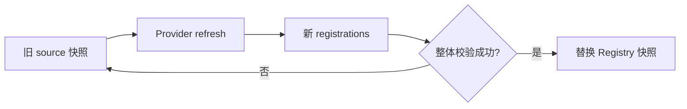

因此可以把二者简单区分为：Catalog 是“配置上希望有什么”，Registry 是“当前真正解析得到什么”。远端服务下线、Skill 文件缺失、RAG 状态变化都可能让两者暂时不同。

---

## 5. Provider 是怎样把四种完全不同的来源统一起来的

Capability Layer 只要求 Provider 提供一组稳定能力：加载当前 registration、执行一次调用，必要时刷新或重连，并描述这次调用的执行语义。底层 target 怎么解释，由 Provider 自己负责。

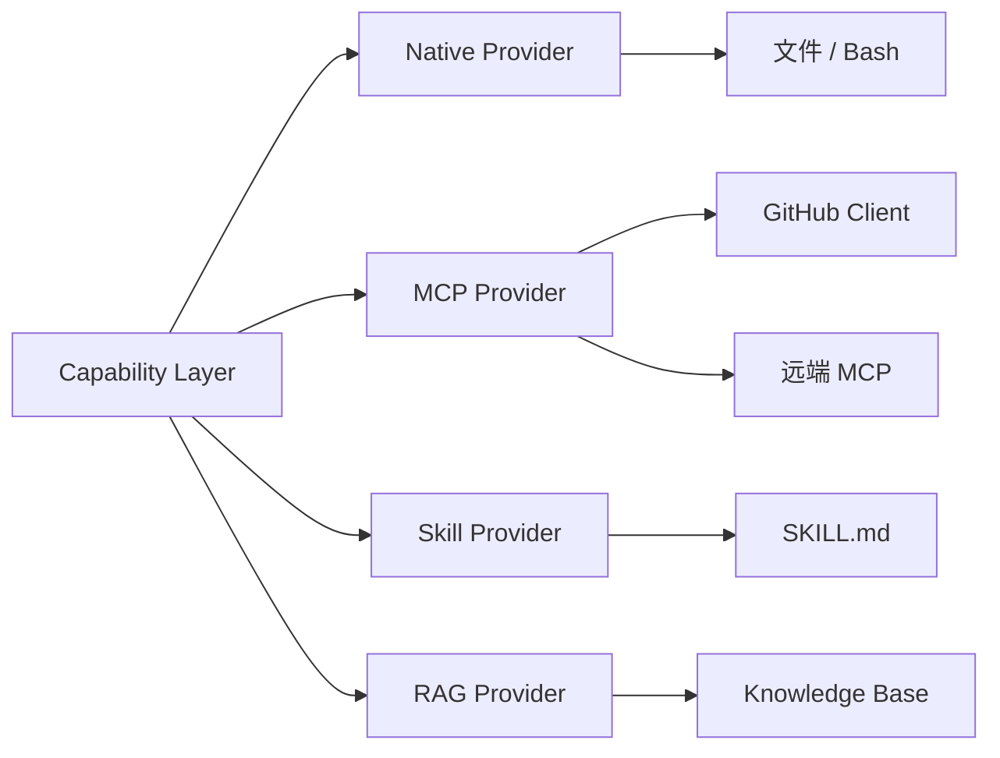

Provider binding 因来源而不同：Native binding 指向本地 handler；MCP binding 需要知道 server 和 remote tool；Skill binding 指向可信 Skill 定义；RAG binding 指向知识库身份和当前状态。Capability Layer 不理解这些细节，只把 binding 交回所属 Provider。

这就是适配层的关键：统一的是上层生命周期，不是强行让底层实现长得一样。

---

## 6. Discover：模型最终能看到哪些工具

Registry 中有一项能力，不等于所有 Agent 都能看到它。每次给 Agent 构造工具列表时，Layer 会先过滤当前 AVAILABLE 的 Capability，再结合当前 Agent 的 discover 规则。

典型可见范围如下：

| Agent | 常见可见能力 |
|---|---|
| Main | 少量只读信息、Context7、RAG 等 |
| Repository | 仓库树、搜索、文件读取、符号、历史、Skill |
| Issues | Issue 读取/写入、相关仓库读取、参考资料 |
| Pull Requests | PR metadata、diff、Review、Merge 相关能力、代码审查 Skill |
| Coding | 仓库读取、本地文件工具、精确编辑、Bash、Skill、RAG、Context7 |

然后 Harness 把这些 Capability 转成模型 function tools，只暴露模型真正需要的三类信息：工具名、用途描述和 input schema。内部 Capability id 会转换成适合模型 function calling 的安全名字；模型返回以后，再在当前可见集合中还原成内部 id。

Main 在生成 tools 时还可以进一步只保留 READ，即使权限配置里存在别的能力，也不会全部暴露给 Main 模型。

### 为什么 discover 和 invoke 不能合成一个检查

Discover 解决“模型看见什么”。工具列表越聚焦，模型越不容易误选，也能减少 tool schema 占用。

Invoke 解决“系统现在是否真的允许执行”。模型返回的调用仍然是不可信输入，所以执行时必须重新做授权。不能因为系统之前把某个工具 schema 发给模型，就把它当成永久执行许可证。

---

## 7. 一次 Capability 调用怎样真正执行

这一段是整个 Capability 系统的核心。为了避免一张过长 Mermaid，把流程拆成“进入 Provider 之前”和“Provider 返回以后”两段。

### 7.1 执行前：先证明这次调用有资格进入 Provider

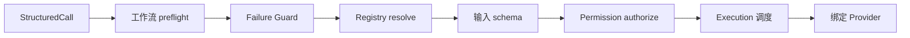

第一步是工作流层的 preflight。Dispatcher 掌握当前 Agent 流程，所以适合检查一些单靠 Capability id 无法判断的业务前提，例如 protected mutation 是否与当前 PR、候选补丁或 workflow stage 对应，以及模型是否刚刚重复提交同一动作。

进入 Capability Layer 后，参数首先必须是对象结构。随后 Failure Guard 会根据当前 Agent、Capability id 和规范化参数判断，这个完全相同的调用是否已经在当前 run 中稳定失败过。

接着 Registry 解析 registration。能力不存在会得到“找不到能力”，当前状态不是 AVAILABLE 会得到“能力不可用”，这些情况都不会进入底层 Provider。

找到能力以后才校验 input schema，确保必填字段、类型、范围和额外字段都符合契约。schema 通过后，再执行 Permission Policy，结果只有 ALLOW、ASK、DENY 三种。ASK 会形成 approval required，DENY 直接停止；只有 ALLOW 才会继续。

最后 Execution 根据这次调用的执行描述安排并发、资源和 lane，然后才真正进入 Provider。

### 7.2 Provider 返回后：仍然没有立刻算成功

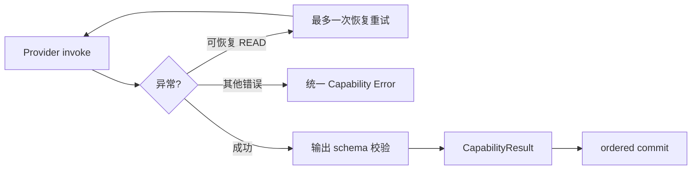

READ Capability 遇到少量瞬时故障时允许非常有限的自动恢复：timeout 可以再尝试一次；unavailable 可以在 Provider 支持时先 reconnect / refresh；短时间 rate limit 可以按很小的 retry-after 等待后再尝试。WRITE 和 DESTRUCTIVE 不进入这条通用自动重试路径，因为第一次请求是否已经产生副作用可能无法判断。

Provider 正常返回以后，还要做 output schema 校验。这个检查的位置很重要：如果底层是写操作，Provider 可能已经执行了副作用，随后才发现返回格式不符合契约。此时错误会记录“Provider 已执行”和“可能存在副作用”，让恢复逻辑知道这不是一个可以无脑重放的普通格式错误。

成功结果最终被整理成统一 CapabilityResult。Native 和 MCP 主要返回结构化 data；Skill 返回上下文文本；RAG 返回检索结果，但 Agent Loop 看到的仍是同一套成功/失败外壳。

Failure Guard、read cache、workspace revision、Audit 等逻辑状态不会由哪个 worker 先结束就先更新，而是在 ordered commit 时统一推进。这样并发完成顺序不会悄悄改变 Agent 观察到的历史。

---

## 8. Permission Policy：控制“能看见”和“真能执行”

权限采用默认拒绝：没有明确规则的能力既不会自然出现在工具箱里，也不会自然获得执行资格。

每个 Agent 有 discover 规则和 invoke 规则；invoke 再分 allow、ask、deny。规则支持 pattern，所以一组相关能力可以集中表达，但启动时仍会检查一项 Capability 是否错误地同时落入多个冲突桶。

### 8.1 Coding Workspace 的本地写是专门例外

Coding Agent 需要真正修改隔离工作区，所以本地 write / edit / delete 可以被配置成直接 allow。但这个 allow 不是“随便写宿主机”：调用上下文必须存在 active coding workspace，Native Provider 还会继续做路径限制。

也就是说，权限判断不仅看动作名字，还要结合“当前是不是处在合法工作区”这一运行状态。

### 8.2 Bash 还有第二层命令策略

Coding Agent 拥有 Bash 入口，也不意味着任意 shell 字符串都能执行。命令还要经过 Bash Command Policy，区分只读 Git 观察、测试/lint/typecheck/build 等验证、可能修改依赖或发布内容的命令，以及 pipe、重定向、命令连接、subshell 等复杂 shell 结构。

Capability 权限回答“这个 Agent 有没有 Bash 入口”，命令策略回答“这一条具体命令能不能执行”。

这里必须保持一个实现边界：Native Bash 最终仍然是宿主机进程。workspace root 和命令策略能约束常见路径和命令，但不等于容器、namespace、seccomp 这类操作系统级 sandbox。

---

## 9. Native Provider：本地文件和 Bash 怎样适配成 Capability

Native Provider 直接面向当前工作区，是最典型的“结构化工具”实现。

### 9.1 工具按职责拆开

当前本地能力包括有限范围读文件、glob、grep、当前时间、完整写文件、精确 edit、删除普通文件，以及经过策略检查的 Bash。

这样模型需要明确表达自己在做哪一步：先定位文件，再读取当前事实，再修改，最后验证。相比一个“万能 shell”，Harness 能更清楚地知道哪些动作属于读取、哪些动作真正改变文件。

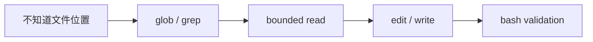

### 9.2 文件路径怎样被限制

文件类能力会把模型给出的相对路径解析到授权 root 下。绝对路径、包含 `..` 的逃逸路径、解析后离开 root 的路径、运行时 blocked path 都会被拒绝。Memory 等受保护目录也不会因为模型从 workspace 路径绕过去就失去边界。

Coding Agent 有独立 worktree 时，调用上下文会把 Native Provider 的根切换到当前 Coding Workspace。于是同一套 read/edit 工具可以复用，但实际操作范围由 Harness 提供的 workspace 决定，而不是模型自己随意选择 cwd。

### 9.3 精确 edit 怎样避免改错位置

精确编辑要求模型提供当前文件中的旧文本和替换后的新文本。Provider 会在真实文件里统计旧文本出现次数：没有匹配通常说明模型依据的内容已经过时；只有一次匹配才执行；出现多次则说明定位有歧义，需要模型给出更多上下文。

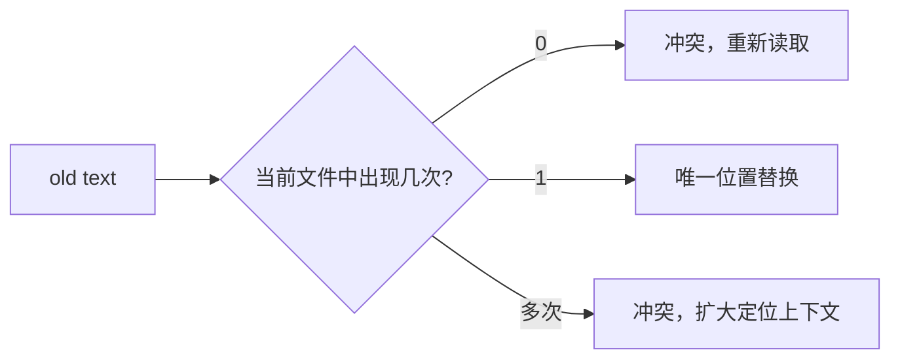

工具不会替模型猜“你大概想改哪一处”。这样能把并发变化和定位歧义显式暴露出来。

### 9.4 Native Provider 也提供执行语义

只读能力通常可以进入 concurrent group；写和破坏性能力会声明当前 workspace 的写资源。因此 Provider 不只负责“怎么执行”，还负责告诉 Execution“这次调用会碰什么共享资源、能不能并发”。

---

## 10. MCP Provider：GitHub 本地 adapter 与远端 MCP 怎样共用一层

MCP Provider 负责把已经配置的 MCP-style 工具映射成 Capability。它维护 server 定义和每项能力的 tool binding；执行时先根据 binding 找到目标 server，再根据 remote tool 名称调用对应 client。

### 10.1 GitHub：本地 adapter，不经过远端 MCP HTTP

GitHub server 当前配置为 local adapter。应用已经有一个 GitHub Client，MCP Provider 把它作为 client 注入。

对于这种本地 client，Provider 根据固定能力定义里的 remote name 找到 GitHub Client 方法，并从本地方法签名推导参数和返回 schema。某些 GitHub 调用还要求 Provider 从 Invocation Context 自动补入当前 repository，这样模型不需要重复提供由 Session 已经确定的仓库身份。

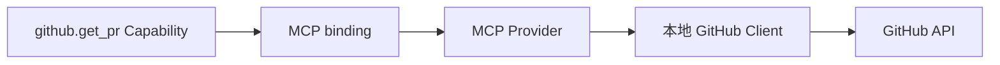

所以 GitHub 在 Capability 层复用了 MCP Provider 的统一 binding 和错误处理，但真实网络请求仍由本地 GitHub Client 发出。

### 10.2 Context7：真正的 Streamable HTTP MCP

Context7 使用远端 Streamable HTTP transport。Transport 首次使用时会建立 MCP 会话，完成 initialize / initialized，再进行 tools/list 或 tools/call，并处理 JSON / SSE 响应。

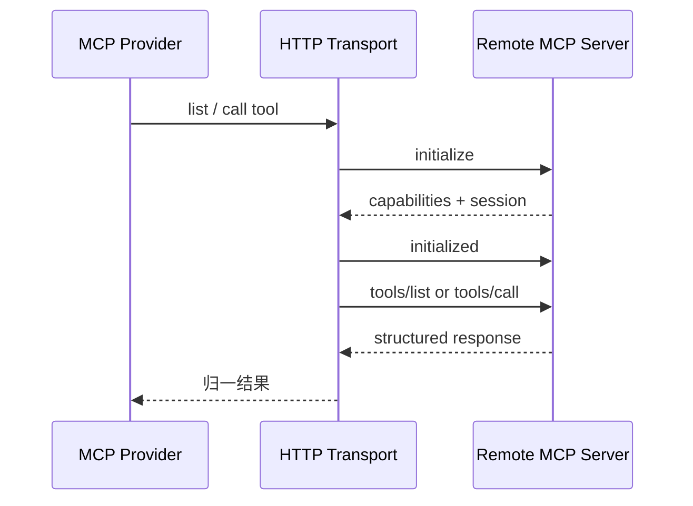

Transport 负责 HTTP 和 MCP 会话，MCP Provider 继续负责本地 Capability binding、schema、状态和错误翻译。这样网络协议变化不会直接泄漏到 Capability Layer。

### 10.3 Refresh 只更新已授权映射，不自动扩大工具面

远端 MCP server 支持 tools/list 时，Provider 可以刷新当前工具描述。远端仍存在的已配置工具可以更新 description 和 schema；已配置工具消失时会从新快照退出。

但远端突然新增的陌生工具不会因为出现在 tools/list 里就自动获得本地 Capability 身份。没有本地固定映射，就不会自然进入 Agent 工具箱。

这层选择很重要：远端服务可以动态变化，但 GitAgent 的本地授权边界不会跟着远端列表自动扩张。

### 10.4 MCP 错误先在 Provider 边界转成稳定语义

认证失败、not found、conflict、rate limit、timeout、连接不可用等 transport / client 异常会先在 Provider 边界归类，再由 Capability Layer 进一步转成统一 Capability Error。

对于写操作还要记录请求是否可能已经发出。网络断开时，如果无法证明远端没有收到请求，就不能把它当成普通“未执行失败”自动重试。

---

## 11. Skill Provider：把工作方法接入，但不扩大权限

Skill 与普通可执行工具不同。它的作用是给模型补充“这类任务应该怎么做”的方法知识。

Skill Provider 只从固定可信目录读取允许的 `SKILL.md`。Skill Capability 通常没有业务参数，属于 READ；目标文件必须位于 trusted root，而且必须是明确的 Skill 文件。

例如 Debug Skill 可以告诉 Coding Agent 应该先稳定复现、确认因果、做聚焦修复、再独立验证。但真正读文件、编辑代码、运行测试，仍然要分别经过 Repository / Native / Bash Capability。

所以加载 Skill 不等于获得任何新执行权限。它增加的是方法上下文，不是运行能力。

---

## 12. RAG Provider：动态知识库怎样表现成普通 READ Capability

RAG 不要求每个知识库都提前写进固定 Catalog。Provider 会询问 Knowledge Base Manager 当前有哪些知识库，然后为每个可用库动态生成 `rag.<knowledge_base_id>`。

每项 RAG Capability 使用统一的聚焦 query 参数。READY 和 STALE 知识库可以作为 AVAILABLE 暴露；ERROR 等无法可靠查询的状态会表现为 UNAVAILABLE。

调用时，RAG Provider 把 query 交给 Knowledge Base Manager，返回知识库身份、stale 状态、hits、命中数量以及必要 notice。对上层 Agent 来说，它仍然只是一个普通 READ Capability：discover、schema、authorize、Execution、Provider、CapabilityResult 的生命周期完全复用。

RAG 的 Dense/BM25/Rerank、版本过滤和知识库 sync 放在第 12 章；本章只需要理解它怎样接回统一工具系统。

---

## 13. 错误为什么要经过 Provider 和 Capability 两层归一

不同底层会抛出完全不同的异常：文件冲突、GitHub HTTP 错误、MCP transport timeout、RAG unavailable、输入错误等。Agent Loop 如果直接看到这些 SDK 和系统异常，就必须知道每个 Provider 的实现细节。

因此 Provider 先尽量把底层异常翻译成接近业务事实的 Provider Error，Capability Layer 再把它们收束成有限的 Capability Error 类型。

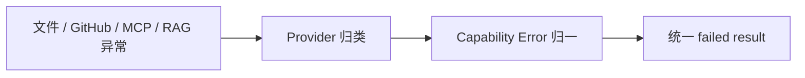

这样上层只需要区分 authentication、not found、conflict、timeout、unavailable、rate limited、invalid input 等稳定语义，不需要认识 urllib、GitHub Client 或知识库内部异常。

### 为什么 WRITE 不参加普通自动 retry

READ 一般不会创建远端副作用，所以 timeout 或短暂 unavailable 可以在严格限制下再尝试一次。WRITE / DESTRUCTIVE 不同：请求可能已经到达远端，只是响应丢失。自动再发一次可能重复创建评论、Review、分支或提交。

因此远端写失败更关注“请求是否已发送、结果是否确定”，而不是简单的“异常类型能不能重试”。这部分在第 08、09 章会结合 Approval 和恢复继续讲。

---

## 14. Failure Guard：阻止模型反复撞同一个已经稳定失败的动作

Provider retry 只处理一次调用内部的短暂故障。模型收到失败以后，还可能在下一轮原样提交同一个 Capability 和完全相同参数。Failure Guard 用来处理这种跨 step 的无效循环。

它用当前 Agent、Capability id 和规范化参数构造稳定调用身份，并按 run 保存失败记录。只有失败沿 ordered commit 正式进入 Agent 历史以后，记录才生效；成功调用则会清理对应失败身份。

这样并发执行时，不会因为某个 worker 恰好先失败就提前改变后续模型可见状态。

Dispatcher 的 duplicate-call 检查和 Failure Guard 处理的时间尺度不同：前者更关注模型紧接着重复提交同一调用；后者记住当前 run 中已经正式提交的失败事实。Provider retry 则更底层，只处理单次网络/服务故障。

---

## 15. 为什么 Capability 要这样设计

前面已经先按运行顺序讲完实现，现在再看设计取舍。

第一，它把模型协议和底层 SDK 解耦。Agent 只认识稳定 id、描述和 schema；文件系统、GitHub Client、远端 MCP、Skill 文件和知识库索引分别留在 Provider 内部。

第二，它把“模型可见性”和“真实执行权限”集中管理。每个 Agent 不需要自己维护一套工具注册与授权代码；discover 和 invoke 分开后，既可以让模型工具箱保持聚焦，又不会把“看见过 schema”误当成执行许可证。

第三，它允许动态来源变化而不自动扩大权限。Registry 可以跟着 Provider refresh 更新当前可用快照，但远端 MCP 新工具不会绕过本地配置直接出现，RAG 动态库也仍然经过统一权限和状态判断。

第四，它给 Execution 提供统一语义。不同 Provider 都能描述并发模式和资源声明，于是上层可以统一处理 READ 并发、workspace 写冲突和有序提交，而不需要为每一种工具来源写独立调度器。

第五，它给错误和恢复提供共同语言。底层异常最终会变成有限的 Capability Error，写操作还会保留“是否可能已经产生副作用”这类信息，后续恢复不需要重新猜测底层 SDK 到底发生了什么。

代价是多了一层 Capability / Binding / Registry / Provider 抽象，但这些对象分别对应稳定契约、执行连接、运行时快照和底层适配，变化方向并不相同。把它们合成一个巨大工具表，短期代码更少，长期会把权限、动态刷新和 Provider 差异重新耦合起来。

---

## 16. 代码定位

下面用于需要核对实现时定位，不要求靠源码变量才能理解正文。

| 想核对的问题 | 主要位置 |
|---|---|
| 应用怎样装配 Capability 系统 | `gitagent/application/capabilities.py` |
| 固定能力和 MCP server 配置 | `gitagent/capability/catalog.py` |
| Capability / Binding / Registration / Result | `gitagent/capability/models.py` |
| 运行时 Registry 和按 source 替换 | `gitagent/capability/registry.py` |
| load / refresh / discover / invoke / retry / Failure Guard | `gitagent/capability/layer.py` |
| discover / invoke / Bash 权限策略 | `gitagent/capability/policy.py` |
| schema 定义和运行时校验 | `gitagent/capability/schema.py` |
| Capability 错误归一 | `gitagent/capability/errors.py` |
| Native 文件与 Bash | `gitagent/capability/providers/native.py` |
| GitHub local adapter 与远端 MCP binding | `gitagent/capability/providers/mcp.py` |
| Skill 加载 | `gitagent/capability/providers/skill.py` |
| RAG 动态 Capability | `gitagent/capability/providers/rag.py` |
| MCP Streamable HTTP 会话 | `gitagent/infra/mcp/transport.py` |
| Capability 转成模型 function tools | `gitagent/harness/execution.py` |
| StructuredCall preflight、batch 与 commit | `gitagent/harness/structured_call_dispatcher.py` |
| 固定能力、server 和 Agent 权限配置 | `capabilities.yaml` |

下一章进入 Execution：当模型一次提出多个 Capability 或子 Agent 调用后，系统怎样决定哪些能并行、哪些需要独占资源，以及为什么物理完成顺序不能直接变成 Agent 的逻辑提交顺序。→ [06 执行与并发](06-execution-and-concurrency.md)
