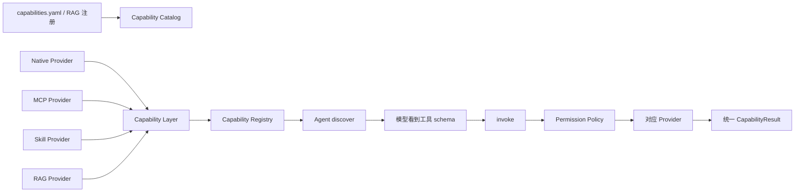
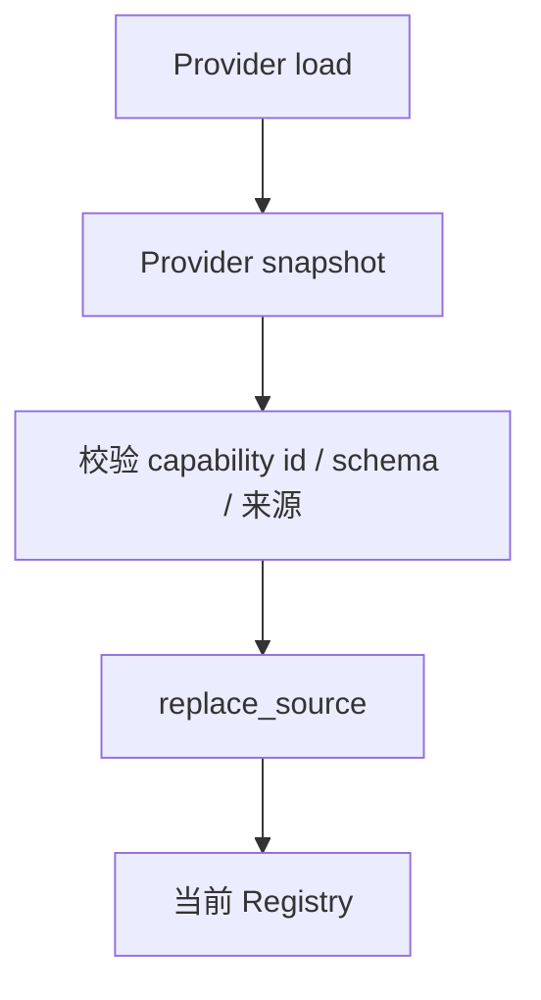
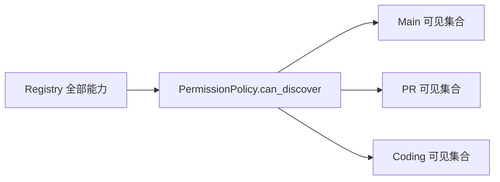
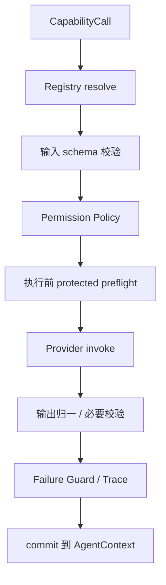
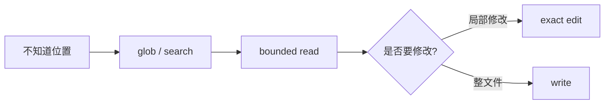
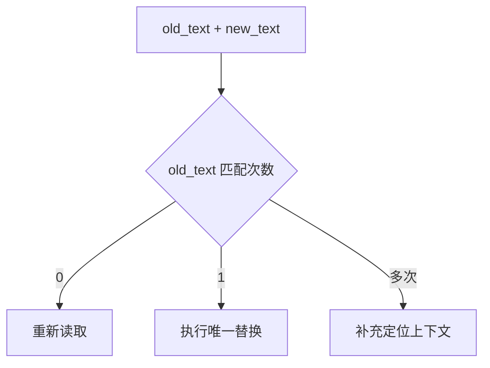
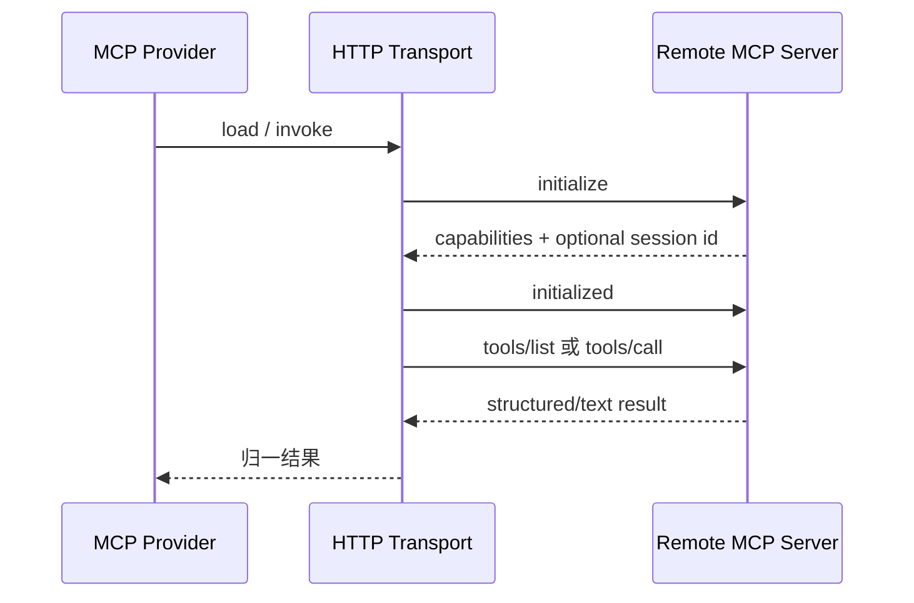
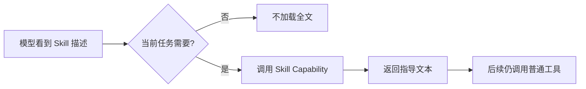
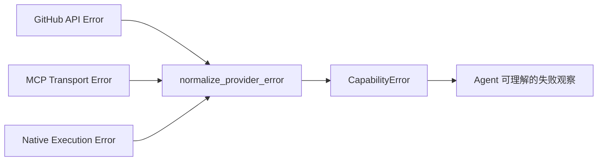

# 05 Capability 与工具系统：不同来源的动作怎样变成统一、可控的能力

上一章的模型已经能够提出 StructuredCall。现在问题变成：**这个名字对应什么工具？当前 Agent 能不能看见它？参数是否符合要求？它来自本地函数、GitHub、远端 MCP、RAG 还是 Skill？执行失败又怎样用统一方式返回？**

GitAgent 用 Capability 层回答这些问题。本章先讲一项能力从“配置中的定义”到“真正执行”的完整生命周期，再解释不同工具来源怎样接入。

---

## 1. 先看 Capability 层的整体结构

可以把 Capability 系统理解成“稳定能力目录 + 动态 provider 绑定 + 权限入口”。

先分清三个概念。

| 概念 | 它解决什么 |
|---|---|
| Catalog | 配置上“应该有哪些稳定能力、归哪个 provider、允许谁使用” |
| Registry | 当前运行时“现在实际有哪些能力可用” |
| Provider | “这项能力真正怎么调用底层系统” |

Capability Layer 把三者组织在一起，给上层 Harness 一个统一入口。

---

## 2. Capability 本身包含什么

一项 Capability 不是一个裸函数名。至少需要表达：

- 稳定 capability id；
- 对模型展示的名称与描述；
- 输入 schema；
- 来源 provider；
- 读/写等访问等级；
- 哪些 Agent 可以发现和调用；
- 当前状态是否可用；
- 运行时执行描述，例如并发方式和资源声明。

这样模型看到的是“结构化动作契约”，而执行层拿到的是“可授权、可调度的运行对象”。

例如“读取文件”和“发布评论”即使底层最后都可以实现成某个 Python 方法，它们在 GitAgent 中仍然是完全不同的 Capability：前者只读并且通常可重试，后者产生公开副作用，可能需要审批，而且网络失败后的语义不同。

---

## 3. 启动时怎样从 Provider 建立当前 Registry

应用启动能力层时，会先加载各个 Provider 的当前快照。Provider 返回自己的能力绑定，Capability Layer 会检查这些绑定是否符合 Catalog 预期，再把来源快照写进 Registry。

这里使用“按来源替换”而不是只追加，意味着 provider 刷新以后，已经消失的能力可以从 Registry 中移除，而不会因为曾经出现过就永久残留。

Registry 是运行时真相；Catalog 是配置意图。两者之间需要校验，不能把远端随便返回的工具直接当成本地已经授权的新能力。

---

## 4. Agent 的 discover 不是“把全部工具都发给模型”

每个 Agent 在构造模型请求时，会通过 Capability Layer 发现自己当前允许看到的能力。

过滤条件至少包含：

1. 能力当前存在且可用；
2. 当前 Agent 被配置允许发现；
3. 当前运行模式允许使用；
4. 需要特殊上下文的能力已经具备对应条件。

因此 Main、PR、Coding 得到的工具集合不同。

“看不见”能够减少模型误选，但真正调用时仍会再次授权。工具列表不是安全检查的唯一位置。

---

## 5. 一项 Capability 调用实际经过哪些检查

模型已经提出 capability id 和参数后，一次调用大致按下面顺序进入系统。

不同检查拥有不同信息，因此不应该揉成一个大 `if`。

| 检查 | 它能确认什么 |
|---|---|
| Registry | 这项能力现在是否存在 |
| schema | 参数形状是否合法 |
| Permission Policy | 当前 Agent / Scope 是否允许调用 |
| protected preflight | 某些高风险业务前提现在是否仍成立 |
| Provider | 底层动作真实执行结果 |
| 输出校验 | 返回值是否满足能力约定 |
| Failure Guard | 同一失败是否已经需要阻止继续盲试 |

---

## 6. Native Provider 怎样提供本地结构化工具

Native Provider 负责一组本地能力，例如：

- 按范围读取文件；
- glob 路径发现；
- grep 内容搜索；
- 写文件、精确编辑、删除；
- 执行受策略检查的命令；
- 读取当前时间等基础操作。

这些入口与“给模型一个任意 Shell”不同。文件读取会显式表达路径和行范围；编辑会表达旧文本和新文本；结果会携带足够的路径、范围、变化状态等元数据。

这样 Harness 才能知道：这次到底读了什么、改了什么，以及后面文件读取缓存是否仍然有效。

Native Provider 负责具体本地动作，但“某个 Agent 能不能写”仍由 Capability 权限与 Coding Workspace 约束共同决定。

---

## 7. 文件工具为什么要按“定位、读取、编辑”分开

GitAgent 的本地/仓库工具不是用一个 `filesystem()` 入口包办全部事情。

### 定位阶段

glob 适合回答“有哪些路径”；grep / search 适合回答“这个词出现在哪里”。

### 阅读阶段

read 适合读取已知文件的有限范围，并返回行号与截断信息。

### 修改阶段

edit 适合在已知上下文中进行精确替换；write 适合创建或覆盖完整文本文件。

这样每一步都能给下一步更明确的证据，而不是让模型自由拼 Shell 命令再从 stdout 猜发生了什么。

---

## 8. 精确 edit 怎样避免“模型猜错修改位置”

局部编辑要求提供旧文本和新文本，并要求旧文本在目标文件中恰好匹配一次。

- 匹配 0 次：当前文件与模型认知不一致，需要重新读取；
- 匹配多次：修改位置不唯一，需要扩大上下文；
- 只匹配 1 次：执行替换，并报告文件是否真正变化。

工具不替模型猜“你大概想改第二处”。模型需要先把修改前提说清楚。

---

## 9. Bash Capability 在 GitAgent 中扮演什么角色

真实项目验证最终需要执行项目自身命令，例如测试、lint、build。GitAgent 因此保留 Bash 类能力，但先经过命令策略分类。

命令策略会区分读取/观察、真实验证和高风险形式，并检查管道、重定向、连接符等结构。允许的命令在当前 Coding Workspace 作为工作目录执行。

命令返回有限的 stdout / stderr 尾部，避免整个构建日志吞掉模型上下文。

需要特别明确：

- worktree 限定了默认工作目录和候选文件空间；
- command policy 限制允许启动的命令形式；
- **它们不等于操作系统级 sandbox。**

一个被允许的测试程序仍然是宿主机进程，它内部可能做比命令名更多的事情。当前实现不能据此声称拥有完整文件系统/网络隔离。

---

## 10. GitHub 能力怎样进入 Capability 层

GitHub 是重要外部能力来源。当前实现通过本地 MCP-style Provider 适配 GitHub Client 方法，把它们转成统一 CapabilityBinding。

例如读取 Issue、读取 PR、获取 diff、提交 Review、创建分支、commit、merge 都可以表现为 Capability。

但要区分两层：

- 它们在 Capability 层使用统一 provider/binding 形式；
- 底层真实 GitHub 操作由 GitHub Client 直接调用 API。

因此不能因为 Provider 名字里有 MCP 概念，就说每次 GitHub 调用都经过远端 MCP Streamable HTTP。

---

## 11. 远端 MCP Provider 怎样接入外部工具

对于 Context7 一类远端服务，GitAgent 使用 Streamable HTTP transport。

连接流程可以概括为：

Provider 负责把远端工具名称、描述和 schema 对应到本地稳定 capability id。Transport 只处理协议会话和请求，不负责本地 Agent 权限。

当前实现覆盖的是项目需要的最小远端 MCP 连接，不应描述成完整覆盖 MCP 所有传输和高级特性。

---

## 12. MCP refresh 为什么不会让远端自动扩张权限

远端 MCP 服务的工具可能变化。刷新时 Provider 会重新读取当前工具描述和 schema，再更新已有映射。

如果原来映射的工具已经消失，对应绑定会被移除，Registry 的来源快照也随之更新。

但远端突然新增一个工具，并不意味着它自动成为 GitAgent 的新能力。稳定 capability id、允许的 Agent 和权限仍然来自本地配置/注册。

所以刷新解决的是“当前已授权映射是否还存在、schema 是否变化”，而不是“把远端所有东西自动安装进模型工具箱”。

---

## 13. Skill Provider 返回的是方法指导，不是额外执行权

Skill 用来解决“这类任务应该按什么方法处理”。例如调试 Skill 可以给 Coding Agent 一套排查步骤。

当前 Skill Provider 从配置允许的固定可信目录读取 `SKILL.md`。模型先看到 Skill 的简短能力说明，需要时再调用并取得完整指导。

Skill 文本不会直接运行脚本，也不会给 Coding Agent 新的 GitHub 权限。它改变的是模型的处理方法，不改变 Harness 的授权边界。

---

## 14. RAG Provider 为什么也表现成只读 Capability

注册后的知识库会暴露为只读检索能力。模型传入聚焦查询，Provider 返回带知识库身份、命中片段、来源和新鲜度的结果。

RAG 的索引、同步和版本生命周期很复杂，但对 Agent Loop 来说，它依然是一项只读 Capability。这说明统一能力层的价值：**上层不需要因为底层是向量库就发明另一种调用协议。**

RAG 的内部设计单独放在第 12 章。

---

## 15. Provider 错误怎样被归一

底层来源会产生不同错误：HTTP 超时、认证失败、速率限制、对象冲突、执行失败、输入错误等。

Capability 层会把这些错误归一为有限类别，并附上是否可恢复、建议等待等结构化信息。Agent Loop 不需要认识每个 SDK 的异常类。

“归一”不等于所有错误都能重试。尤其是发生远端写入后连接中断，系统可能无法确定副作用是否已经发生。这类情况会在第 08、09 章按副作用语义处理。

---

## 16. Failure Guard 怎样阻止同一个失败被模型无限重复

模型收到一次可恢复错误以后，可能会重新尝试。但如果完全相同的调用身份和错误反复出现，继续盲试只会浪费步骤，甚至放大风险。

Capability Layer 维护 Failure Guard，记录当前调用对应的失败事实。执行提交后，如果失败达到需要阻断的条件，后续相同调用可以被直接挡住，直到上下文变化或状态被清除。

它解决的是“模型层重复同一个失败动作”的问题，与 provider 内部网络重试、Execution 的 batch 失败策略是不同机制。

---

## 17. 一次“查资料后修改代码”的 Capability 链

假设 Coding Agent 要修一个不熟悉的第三方库调用。

**第一步：发现工具。** 当前 Coding 模式只能看到允许的仓库读取、Skill、参考资料、工作区编辑和验证能力。

**第二步：加载 Skill。** 模型调用调试方法指导。Provider 返回文本，不发生仓库副作用。

**第三步：查询远端参考资料。** MCP Provider 通过 transport 获取文档结果，Capability Layer 统一返回。

**第四步：读取当前代码。** 本地/仓库读取工具返回明确路径、范围和版本证据。

**第五步：精确编辑。** patch 工作区里的 edit 要求唯一匹配，并报告是否实际变化。

**第六步：真实验证。** Bash 经过命令策略，在当前工作树执行测试。

这六步来自四种不同 provider，但 Agent Loop 使用的始终是同一套 capability id、schema、result 和 error 协议。

---

## 18. STAR 复盘：为什么还要 Capability 层，不能让 Agent 直接调函数

### S — Situation

GitAgent 的动作来自本地文件、GitHub API、远端 MCP、RAG 和 Skill。它们的连接方式、错误类型和副作用完全不同。如果 Agent 直接依赖每个底层函数，权限、schema、发现和错误处理会散落到所有 Agent 中。

### T — Task

系统需要一个稳定边界，让 Agent 只面对“这项动作叫什么、参数是什么、我能不能用”，同时让底层 provider 可以刷新或替换，而不会把 transport 细节泄漏到业务层。

### A — Action

GitAgent 用 Catalog 表达本地能力意图，用 Registry 表示当前可用快照，用 Provider 封装真实实现；discover 和 invoke 都经过 PermissionPolicy；输入/输出使用 schema；provider 错误统一归一；Native、GitHub/MCP、Skill、RAG 都接入相同调用协议；动态刷新只能更新已有授权映射，不自动扩张权限。

### R — Result

上层 Agent 和 Harness 可以用统一协议处理完全不同来源的能力，权限和错误语义也有集中入口。代价是每个工具要维护明确 capability 定义和 provider binding，不能只写一个函数就算接入完成。

核心收益是：**工具来源可以变化，但“模型如何获得动作资格”保持稳定。**

---

## 19. 这一章最容易混淆的地方

| 误解 | 正确理解 |
|---|---|
| Capability 就是函数的包装 | 不够。它还包含 schema、权限、来源、状态和执行语义 |
| 模型看不到工具就绝对安全 | 不是。invoke 时仍要真正授权 |
| MCP Provider = 所有能力都走远端 MCP | 不是。GitHub 当前主要是本地适配器，远端 MCP 才走 HTTP transport |
| Skill 会安装或运行脚本 | 当前不会。它主要返回按需指导文本 |
| Bash 在 worktree 内执行 = OS sandbox | 不是。工作目录隔离不等于宿主机级隔离 |
| Provider refresh 会自动授权新工具 | 不会。远端发现不能自行扩大本地权限 |

---

## 20. 复习时怎样讲这一章

推荐先画四个盒子：Catalog、Registry、Provider、Permission Policy。然后讲一项能力从 load → discover → invoke → result 的生命周期，再用 Native、远端 MCP、Skill 各举一个例子。

一句话总结：

> Capability 层把“底层能做什么”转换成“当前 Agent 被允许以什么结构做什么”，让工具实现和 Agent 控制协议分开。

## 21. 代码定位

| 想核对的问题 | 主要位置 |
|---|---|
| Capability Catalog | `gitagent/capability/catalog.py` |
| 当前 Registry | `gitagent/capability/registry.py` |
| discover / invoke / failure guard | `gitagent/capability/layer.py` |
| Agent 权限与 Bash 策略 | `gitagent/capability/policy.py` |
| Native 工具 | `gitagent/capability/providers/native.py` |
| MCP / GitHub binding | `gitagent/capability/providers/mcp.py` |
| Skill | `gitagent/capability/providers/skill.py` |
| RAG Capability | `gitagent/capability/providers/rag.py` |
| MCP HTTP transport | `gitagent/infra/mcp/transport.py` |
| GitHub 真实 API 适配 | `gitagent/infra/github/client.py` |
| 能力配置 | `capabilities.yaml` |

下一章进入真正的运行阶段：[模型一次提出多个 Capability 后，Execution 怎样决定哪些并行、哪些串行，以及结果什么时候算“提交”](06-execution-and-concurrency.md)。
