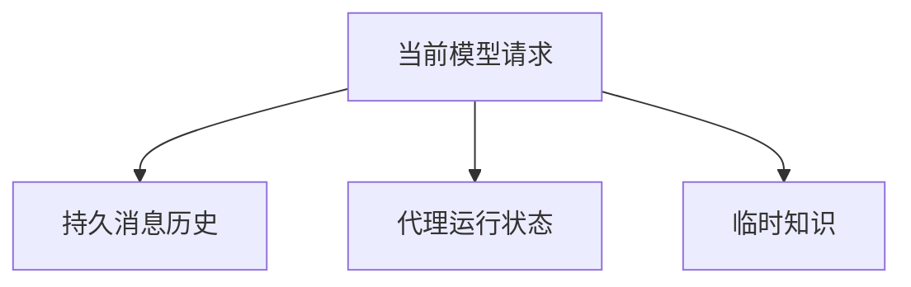
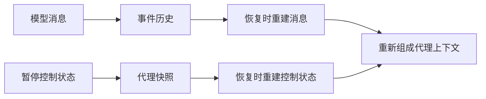
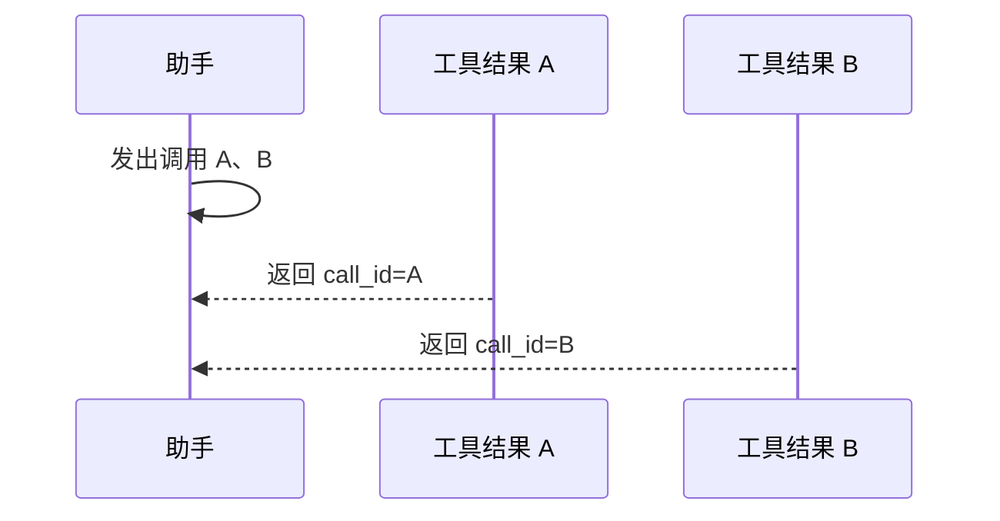
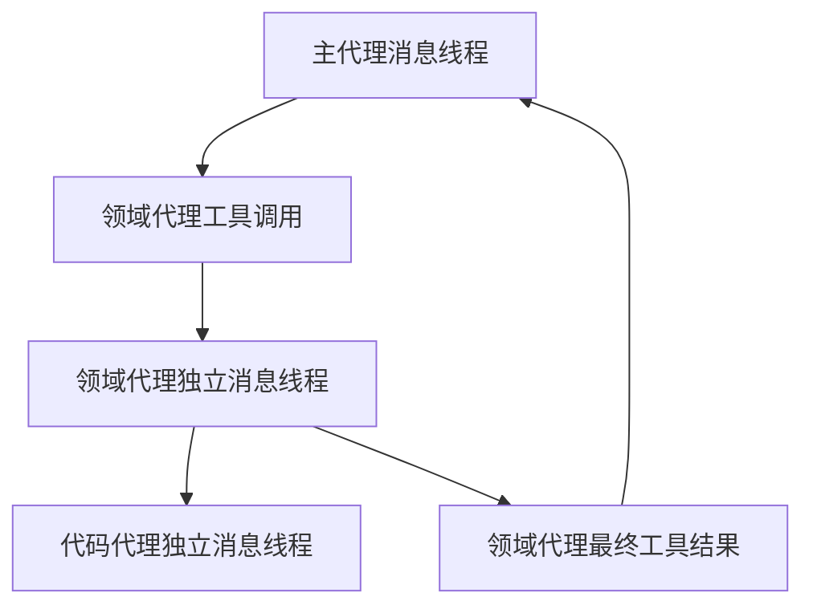
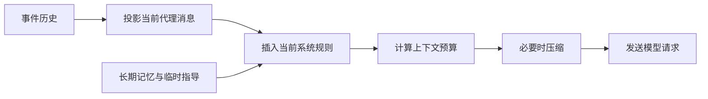
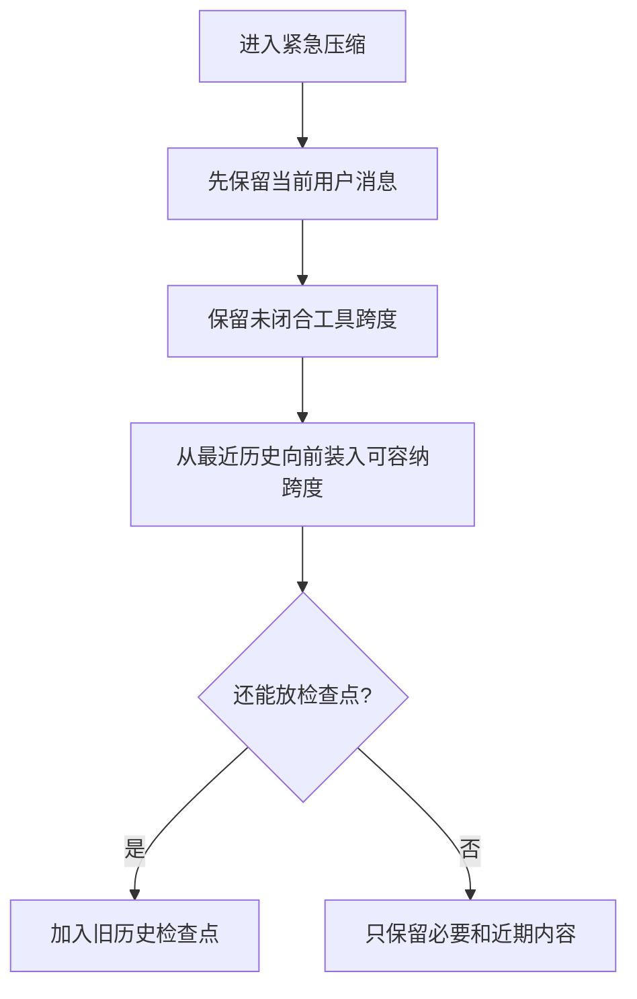
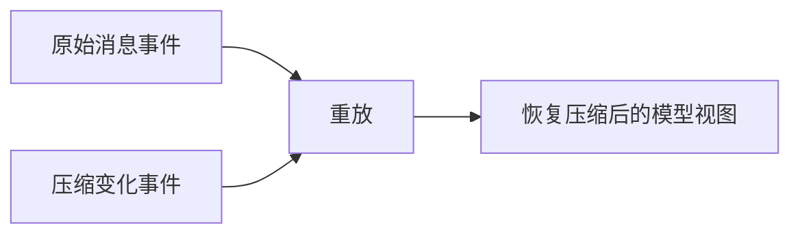
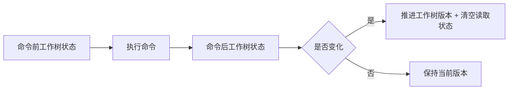

# 05 上下文系统：模型看到什么，运行时又保存什么

## 本章先回答什么

很多代理系统把“上下文”理解成一个越来越长的 `messages` 数组。GitAgent 不能这样做。

模型需要看到的是对话和工具历史；运行时需要保存的是审批、子代理和未提交结果；长期记忆属于跨会话知识；文件读取还要知道哪些行已经读过。把这些状态都塞进消息历史，会让恢复、压缩和缓存互相污染。

所以这一章的主线是：**GitAgent 怎样把不同生命周期的信息拆开，再在每次模型请求前把它们重新组合成一个合法上下文。**

### 本章的 STAR 主线

| 阶段 | 本章要解决的问题 |
|---|---|
| 情境 S | 消息会不断增长，工具协议不能被拆坏，运行时状态又不适合全部写进消息 |
| 任务 T | 区分持久历史、代理控制状态和临时知识，并在上下文压力下保持可重放性 |
| 行动 A | 重放消息 → 注入当前系统规则和临时知识 → 预算计算 → 分级压缩 → 记录压缩变化 → 读取缓存和文件覆盖协同 |
| 结果 R | 模型上下文有界，工具协议保持完整，进程恢复后能够重建中断前同类视图，代码阅读不会机械重复 |

---

## 1. 情境：为什么“消息越多越好”是错误目标

消息历史越长，模型知道的信息越多，但同时会出现三个问题。

| 问题 | 直接后果 |
|---|---|
| 上下文窗口有限 | 旧消息和大型工具结果会挤占当前任务空间 |
| 工具调用有协议结构 | 不能只删一条工具结果或一条助手调用 |
| 有些状态不是给模型看的 | 审批计划、活跃子代理和缓存不应该依赖自然语言 |

再加上长期记忆和文件读取状态，单一消息数组很快承担过多职责。

因此 GitAgent 先把“上下文”拆成三种不同状态。

---

## 2. 任务：三类上下文必须分开



| 类型 | 保存什么 | 持久化方式 | 是否直接给模型看 |
|---|---|---|---|
| 持久消息历史 | 用户消息、助手消息、工具调用、工具结果、压缩记录 | 追加式事件历史 | 是 |
| 代理运行状态 | 审批、等待、子代理、未提交结果、业务产物、读取状态 | 等待时保存暂停快照 | 部分状态通过工具结果或系统构造间接体现 |
| 临时知识 | 长期记忆页面、当前指导、当前环境信息 | 不作为普通消息长期保存 | 是，只在当前请求注入 |

这三类状态的生命周期不同，所以权威来源也必须不同。

---

## 3. 为什么消息历史要有唯一持久化来源

代理上下文本身在内存中也持有消息，但暂停快照明确不保存消息副本。

消息的持久化权威是事件历史。



为什么不能两边都存？

如果进程在“事件文件写完、快照没写完”或者反过来的时刻退出，两份消息可能不一致。恢复时就不知道相信哪份。

GitAgent 选择：**消息只存一份，控制状态另存。**

---

## 4. 工具协议为什么是上下文系统的硬约束

助手可以一次发出多个工具调用，后续工具消息用 `call_id` 逐项闭合。



上下文系统要求：

- 工具结果只能指向当前未闭合调用；
- 一个 `call_id` 只能闭合一次；
- 上一组工具调用没有闭合前，不能随意插入普通消息；
- 压缩时不能只删除调用或结果的一半。

这意味着上下文压缩的最小单位不是“消息”，而是“协议跨度”。

---

## 5. 子代理为什么有自己的消息线程

主代理调用领域代理时，父模型只看到一个代理工具调用。

领域代理内部会读取文件、调用 GitHub、甚至继续委派代码代理。如果这些内部消息全部写进主代理线程，主上下文会迅速膨胀。

所以每个子代理按 `agent + run_id` 维护自己的模型消息。



父代理只接收子代理最终结果，不接收其完整内部历史。

这样既控制上下文规模，也维持代理职责边界。

---

## 6. 系统消息为什么不是永久历史

系统消息描述的是当前运行规则，而不是过去发生的事实。

会话持续一段时间后，以下内容可能变化：

- 当前仓库；
- 当前执行配置；
- 长期记忆索引；
- 当前任务相关记忆页面；
- 代理提示词版本。

所以恢复时不会把会话开始时的系统消息永久沿用。系统会使用**当前系统规则**，再拼接持久历史。

| 内容 | 是否属于历史事实 |
|---|---|
| 用户说过的话 | 是 |
| 助手和工具结果 | 是 |
| 当前系统提示 | 否，属于当前执行环境 |
| 当前选中的长期记忆 | 否，属于当前请求上下文 |

这让长期会话不会被旧系统规则绑定。

---

## 7. 一次模型请求的上下文是怎样拼出来的

可以把构造过程理解成四步。



### 第一步：投影持久消息

主代理只取主代理消息；领域代理按自己的 `run_id` 重建内部消息。

### 第二步：插入当前系统规则

系统消息由当前环境生成，不从历史直接照搬。

### 第三步：加入临时知识

长期记忆和领域指导只在当前请求中出现，不写成普通用户消息。

### 第四步：计算消息和工具定义的总预算

工具结构本身也占上下文，所以预算不能只统计消息文本。

---

## 8. 为什么上下文压力要在请求发出前计算

等待模型服务返回“上下文过长”已经太晚。

GitAgent 在调用模型前估算消息和工具定义的总占用，再根据窗口大小得到压力比例。

当前使用三档压力：

| 阶段 | 大致窗口占用 | 处理重点 |
|---|---:|---|
| 轻量压缩 | 50% | 缩小大型可重新获取工具结果 |
| 历史摘要 | 70% | 把较早历史折叠成确定性检查点 |
| 紧急压缩 | 90% | 只保留协议必需内容和近期关键跨度 |

三级策略的核心是：**先丢最容易重新获取的信息，再动历史语义。**

---

## 9. 第一档：为什么先压缩大型工具结果

仓库文件、搜索结果、日志常常占据大量令牌。

这些内容有一个共同特点：可以再次通过工具获取。

达到第一档压力后，系统会把大型工具结果正文替换成短提示，但保留工具消息本身和 `call_id`。


对比来看：

| 信息 | 重获成本 | 第一档是否优先压缩 |
|---|---|---|
| 文件正文 | 低，可重新读取 | 是 |
| 搜索结果 | 低，可重新搜索 | 是 |
| 用户目标 | 高，不应轻易丢失 | 否 |
| 代理关键结论 | 较高 | 否 |

这是一种按“信息可恢复性”排序的压缩策略。

---

## 10. 第二档：为什么历史摘要使用确定性规则

大型工具结果压缩后仍然超出第二档压力，系统开始折叠较早历史。

GitAgent 没有再调用一个模型自由总结旧对话，而是用固定规则生成检查点。

检查点会保留：

- 用户和助手文本的有界片段；
- 工具名称和有界参数；
- 工具结果的有界内容；
- 旧检查点中的已有摘要。

这样做的原因是可重放。

如果摘要由另一个模型自由生成，同一份历史在两次恢复时可能产生不同摘要，还可能引入原历史不存在的新事实。

确定性检查点牺牲一些语言自然度，换来恢复一致性。

---

## 11. 为什么压缩必须按“原子跨度”进行

假设历史是：

```text
助手：调用 A、B
工具：A 结果
工具：B 结果
```

不能只删除 B 结果，也不能只保留工具结果不保留调用。

因此上下文系统先把历史拆成原子跨度。

| 原子跨度类型 | 包含内容 |
|---|---|
| 普通用户消息 | 单条用户消息 |
| 普通助手消息 | 单条无工具调用助手消息 |
| 工具调用跨度 | 助手工具调用 + 对应全部工具结果 |
| 子代理收束跨度 | 代理调用、子代理结果及关联收束消息 |

摘要和紧急裁剪只在跨度边界操作。

这就是“理解工具协议”的上下文压缩，而不是字符串截断。

---

## 12. 第三档：紧急压缩为什么先保护协议，再保护近期历史

进入第三档压力后，系统允许丢弃更多旧内容，但有两类不能删除：

1. 当前用户消息；
2. 含未闭合工具调用的完整跨度。



当前工具协议比普通旧历史优先级更高。

如果连这些强制内容本身都超过模型窗口，系统直接返回上下文超限错误，不再任意截断。

---

## 13. 为什么压缩之后还要重新校验消息协议

压缩算法会重写消息列表。任何算法错误都可能制造未闭合工具调用。

所以每次压缩完成后，系统还要再次检查工具协议。

只有“压缩后仍合法”的消息才能进入模型请求。

这是一条很重要的工程习惯：**优化步骤不能因为属于内部实现，就免于验证核心不变量。**

---

## 14. 压缩变化为什么也要持久化

如果只在内存里压缩消息，进程重启后重新读取事件历史，会得到完整未压缩消息。

模型中断前和恢复后看到的上下文就不同。

GitAgent 保存的是“压缩变化”，不是重新保存一份完整消息快照。



压缩变化包含：

- 哪些大型工具结果被替换；
- 生成了什么检查点；
- 原历史中哪些消息索引继续保留。

原始事件没有被删除，所以事实历史仍然完整。

---

## 15. 普通读取缓存解决的不是上下文大小问题

上下文压缩减少模型输入。

读取缓存减少外部调用次数。

两者经常一起出现，但用途不同。

普通读取能力使用“能力编号 + 规范化参数”作为缓存键。相同读取在同一次代理运行中再次出现时，可以直接复用结果。

| 机制 | 解决的问题 |
|---|---|
| 上下文压缩 | 已有结果太大，占据模型窗口 |
| 读取缓存 | 模型重复请求完全相同读取 |
| 文件读取覆盖 | 请求参数不同，但读取范围重叠 |

文件读取是更复杂的第三种情况。

---

## 16. 为什么代码阅读不能只靠普通缓存

代理读取代码时常出现区间扩展。

第一次读 1—200 行，第二次请求 1—400 行。

两次参数不同，普通缓存无法命中，但前 200 行已经读过。

GitAgent 为文件读取维护独立覆盖记录，身份由：

```text
仓库 + 文件路径 + Git 引用
```

组成。

为什么还要有 Git 引用？

同一个 `src/a.py` 在默认分支和合并请求头提交中可能内容不同。两个版本不能共享“已读”状态。

---

## 17. 文件读取覆盖怎样把请求改写成“只读缺口”

假设当前覆盖：1—200 行。

模型请求：1—400 行。

系统真正交给提供方的范围是：201—400 行。


请求完全覆盖时，系统甚至不访问提供方，只返回“该范围已经读取”的观察信息。

批量读取也对每个文件分别计算缺口。

这比普通缓存更接近真实代码阅读过程。

---

## 18. 为什么文件结束位置也要进入读取状态

提供方返回“没有截断”时，系统知道文件已经读到结尾。

覆盖记录会保存 EOF 行位置。

下一次模型请求“继续读下一段”时，如果已经越过 EOF，系统可以直接判断没有新内容。

否则模型可能不断发出继续读取，即使文件已经结束。

因此文件读取状态实际上包含两类信息：已读区间和结束位置。

---

## 19. 为什么提供方读取结果还要再次校验后才能更新覆盖

覆盖记录属于运行时权威状态。

如果提供方返回错文件、错起止行或者非法结构，系统不能把请求文件标成“已读”。

提交阶段会核对：

- 返回路径是否匹配；
- 行号范围是否合法；
- 批量返回数量是否一致；
- 正文是否为文本；
- 截断标记是否合法。

只有验证过的结果才能推进阅读覆盖。

这避免“缓存元数据比真实结果更可信”的错误。

---

## 20. 写操作为什么要清空读取缓存和文件覆盖

读取状态都建立在“资源内容没有变化”这个前提上。

一项写操作成功提交后，旧读取可能已经过时。

GitAgent 采用简单而保守的策略：清空普通读取缓存和文件阅读覆盖。

| 方案 | 优点 | 缺点 |
|---|---|---|
| 精确推导哪些缓存受影响 | 命中率高 | 需要理解每种写操作影响范围，复杂 |
| 写后统一失效 | 一致性边界清晰 | 会丢掉部分仍然有效的缓存 |

GitAgent 选择后一种。

---

## 21. 命令执行为什么还要检测真实工作树变化

代码代理通过文件写、编辑、删除能力修改内容时，系统明确知道是否发生变化。

受限命令也可能修改工作树，例如某些格式化或生成步骤。

所以执行命令前后会记录工作树状态。



这让缓存失效依赖真实文件变化，而不是依赖“工具名看起来像不会写”。

---

## 22. 长期记忆为什么不进入普通消息和普通读取缓存

长期记忆页面会因为自动提取、手工写入、TTL、停用和整理而变化。

当前任务选中的页面只适合当前模型请求。

GitAgent 把它们临时注入系统上下文，而不是追加成普通持久用户消息。

页面正文也不进入普通读取缓存长期复用。

| 内容 | 进入持久消息吗 | 进入普通读取缓存吗 |
|---|---|---|
| 用户消息 | 是 | 不适用 |
| 仓库文件读取 | 工具结果会进入消息 | 可以 |
| 长期记忆选中页面 | 否，临时注入 | 不使用普通读取缓存 |
| 暂停审批计划 | 否，属于控制状态 | 不适用 |

这样下一轮任务可以重新检索记忆，而不会被上一轮选择结果永久绑定。

---

## 23. 用一次代码阅读把整章串起来

用户要求解释一个复杂模块。

### 第一步：重建当前代理消息

事件历史投影出该代理持久消息，当前系统规则重新生成。

### 第二步：加入长期记忆

和当前模块相关的项目记忆被检索并临时加入系统上下文。

### 第三步：计算预算

消息加工具定义达到第一档压力，大型旧文件结果被替换成压缩提示。

### 第四步：模型请求文件 1—400 行

读取覆盖发现 1—200 已读，只把 201—400 交给提供方。

### 第五步：结果提交

返回结构通过校验，覆盖扩展到 1—400。工具结果按原 `call_id` 进入消息。

### 第六步：上下文继续增长

达到第二档压力，较早协议跨度被折叠成确定性检查点。压缩变化写入事件历史。

### 第七步：进程重启

系统从原始消息事件和压缩变化重新构造同类模型视图，再恢复代理控制状态。

这条链同时体现消息、压缩、读取覆盖和恢复四个机制。

---

## 24. 结果：上下文系统最终建立了什么

| 设计 | 得到的结果 |
|---|---|
| 消息、控制状态、临时知识分层 | 不同生命周期不会互相污染 |
| 当前系统规则动态重建 | 长会话不会沿用过期运行规则 |
| 压缩理解工具协议 | 不会为了省令牌破坏 `call_id` 关联 |
| 三级压缩 | 从可重获内容到旧历史逐级牺牲信息 |
| 压缩变化持久化 | 进程恢复后能够重建压缩视图 |
| 普通读取缓存 | 避免完全重复读取 |
| 文件区间覆盖 + EOF | 避免重叠读取和无效继续读取 |
| 写后统一失效 | 读取状态不会在资源变化后继续伪装有效 |

代价是上下文系统不再是简单消息数组，而是消息投影、压缩计划、临时注入、读取缓存和文件覆盖共同组成的状态系统。

GitAgent 接受这部分复杂度，因为它换来的是：**模型看到的内容有界，运行时保存的事实仍然可重放。**

---

## 25. 复习时怎样讲这一章

可以按下面顺序复述：

1. GitAgent 不把所有上下文都塞进消息，先分持久消息、运行时控制状态和临时知识；
2. 消息只有事件历史这一份持久化真相，暂停快照不复制消息；
3. 工具调用和结果必须作为完整协议跨度处理；
4. 每次请求重新生成当前系统规则，再注入当前长期记忆；
5. 上下文达到 50%、70%、90% 压力时，依次压工具结果、旧历史检查点和紧急保留；
6. 压缩变化进入事件历史，所以重启后能够重放；
7. 普通读取用缓存，文件读取用“仓库 + 路径 + Git 引用”的区间覆盖和 EOF；
8. 写操作或真实工作树变化后，读取状态统一失效。

## 26. 代码定位

| 想核对的问题 | 代码位置 |
|---|---|
| 消息规范和工具协议检查 | `gitagent/harness/context/messages.py` |
| 主代理上下文怎样从事件历史构建 | `gitagent/harness/context/builder.py` |
| 消息和压缩事件怎样投影 | `gitagent/harness/context/projector.py` |
| 领域代理怎样构造模型请求和临时注入 | `gitagent/harness/context/state.py` |
| 上下文预算和分级压缩 | `gitagent/harness/context/budget.py` |
| 文件阅读覆盖、缺口和 EOF | `gitagent/harness/file_reads.py` |
| 压缩变化怎样持久化 | `gitagent/infra/persistence/sessions.py`、`event_log.py` |
