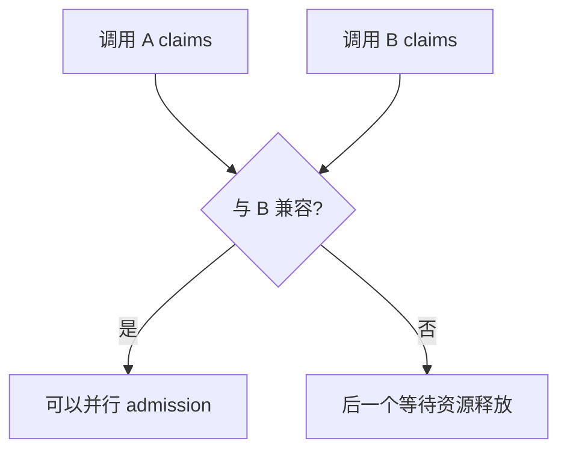
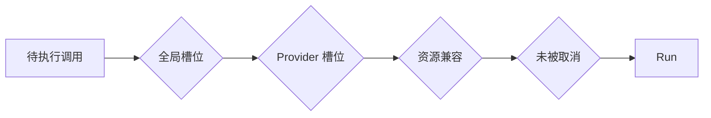
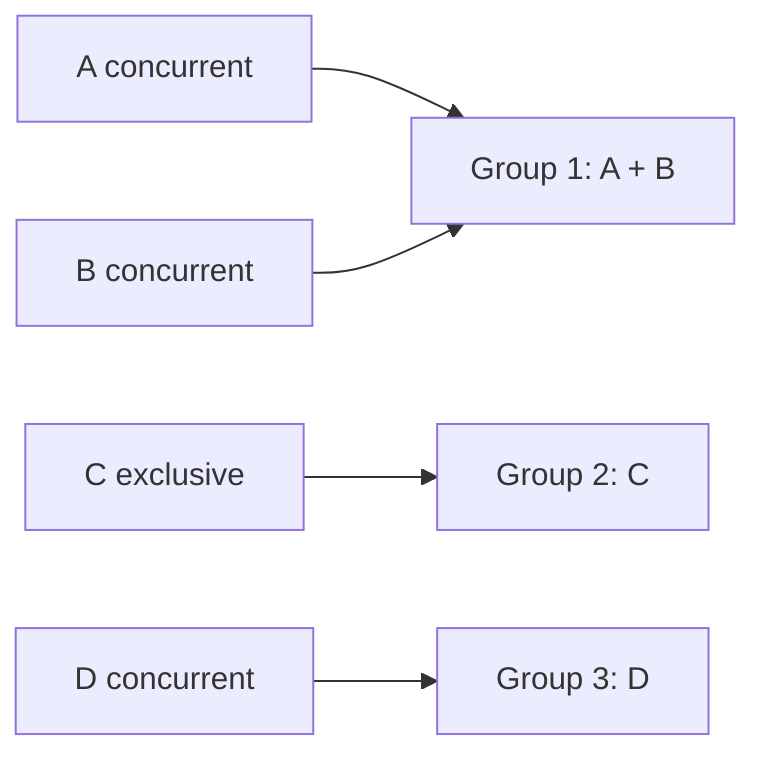
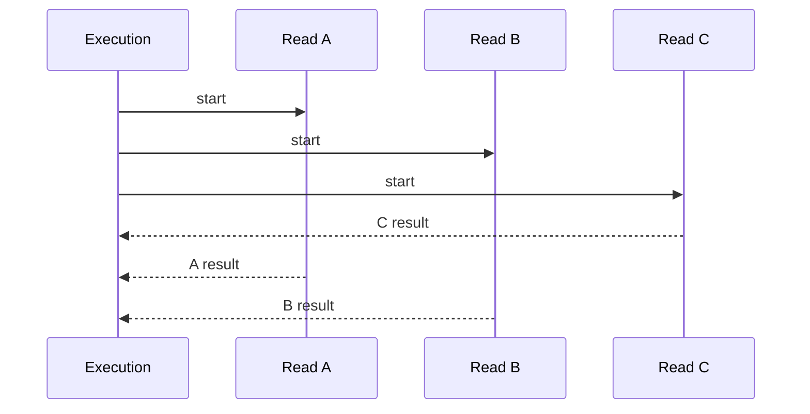
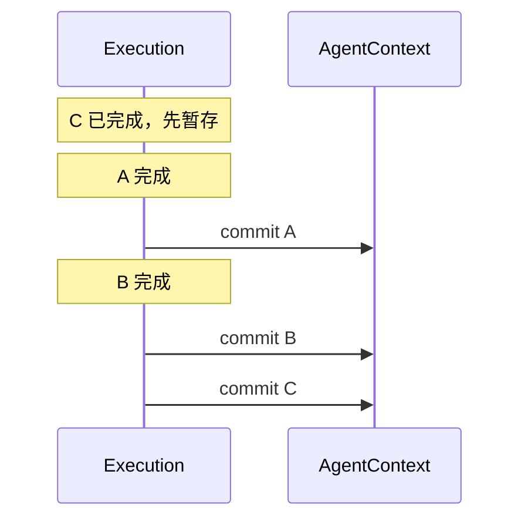
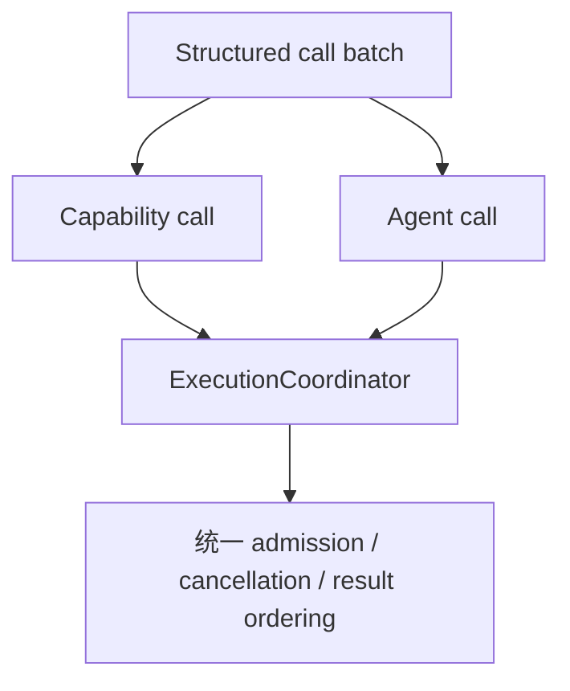
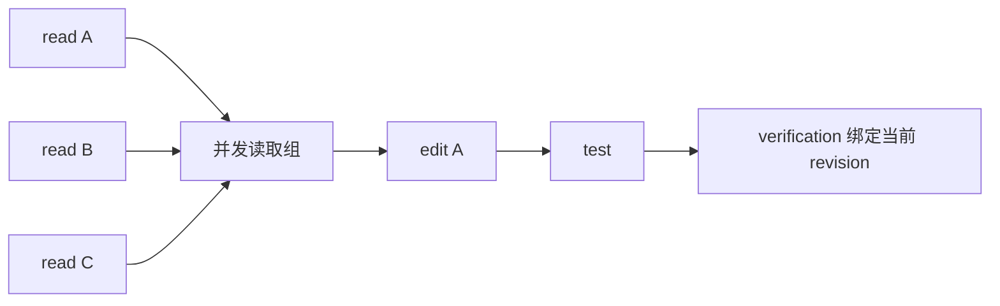

# 06 执行与并发：调用怎样并行运行，又不打乱 Agent 的逻辑顺序

前两章已经把模型调用变成 Capability，并完成权限和 schema 校验。接下来才进入真正的执行问题：**模型一次提出多个调用时，哪些可以一起跑，哪些必须串行；一个线程先完成后，什么时候才允许它改变 AgentContext；一个失败又应该影响当前调用、当前组还是整个批次。**

本章只讲执行协调。某项能力本身怎样实现看第 05 章，远端写为什么不能盲目重试看第 08、09 章。

---

## 1. 先看 Execution 层在 pipeline 中的位置

这条链里最重要的区分是：

**Run 解决“动作什么时候在物理世界执行”；Commit 解决“动作什么时候成为 Agent 的逻辑事实”。**

如果先理解这一点，后面的线程池、资源锁和 waiting 都会容易很多。

---

## 2. 每项执行先获得一个 ExecutionProfile

Execution Coordinator 不根据工具名字猜并发，而是使用能力或 Agent 提供的 `ExecutionProfile`。

这个 profile 主要表达三类信息。

| 信息 | 回答的问题 |
|---|---|
| ConcurrencyMode | 这项调用能否与其他兼容调用并行 |
| ResourceClaims | 它会占用哪些逻辑资源 |
| FailureScope | 失败以后应该阻断多大范围 |

例如一个纯读取可以声明为 concurrent；某个必须严格顺序的动作可以声明 exclusive；信息不足时使用 unknown，调度会更加保守。

这比按“read = 并发、write = 串行”的单一规则更精确，因为两个读取也可能争用同一个受限 provider，而两个写入是否冲突还取决于资源范围。

---

## 3. ResourceClaims 怎样描述“能不能一起跑”

ResourceClaims 可以理解成一项调用对逻辑资源的占用声明。典型资源可能是：

- 当前 coding workspace；
- 某个仓库缓存镜像；
- 某个受保护远端对象；
- 其他需要串行化的共享状态。

调度器比较两个调用的 claims，只有兼容时才允许同时占用。

资源声明是运行时语义，不等于操作系统文件锁的自动推导。Provider 或 Harness 必须知道哪些动作共享什么资源，调度器才能做出正确决定。

---

## 4. Provider 并发上限和资源冲突是两道不同限制

即使两个调用在逻辑资源上兼容，也可能来自同一个 provider。系统还有 provider 级并发容量，以及整个 execution 层的总并发容量。

所以一个调用真正开始 Run 前，需要同时满足：

1. 全局执行槽还有容量；
2. 对应 provider 还有容量；
3. ResourceClaims 与当前活动调用兼容；
4. 当前 cancellation scope 没有要求停止。

可以把 admission 想成多个闸门串联。

因此配置 `max_concurrency` 很大并不保证实际就会同时跑那么多任务；更窄的 provider 或资源限制仍然会收紧并发。

---

## 5. 一批调用不是任意重排，而是按连续兼容段处理

假设模型按 A、B、C、D 的顺序提出调用。A、B 互相兼容，C 是独占动作，D 又可以并发。

调度不会把 A、B、D 全部抽出来先跑，再把 C 放最后，因为那改变了模型原始顺序中 C 的位置。

更接近实际的理解是：先把**连续的兼容调用**形成执行组。

Group 1 可以内部并行，但 Group 2 要在它完成到合适边界后再推进；D 不会因为自己可并行就跨过 C 提前成为逻辑事实。

这是“并发不改变调用顺序”的第一层保证。

---

## 6. Prepare 阶段到底做什么

Prepare 发生在真正 Run 之前。它尽量把“无需产生底层副作用就能确认的条件”先检查完。

通常包括：

- 调用名称与 call_id 是否有效；
- capability / child agent 是否存在；
- 参数 schema 是否成立；
- 当前 Agent 是否有权调用；
- 是否需要 approval；
- 该调用的 ExecutionProfile 是什么；
- 某些保护性业务条件能否提前确认。

Prepare 失败时，调用可以直接形成结构化失败，而不用占执行线程去访问 provider。

对于需要等待用户审批的调用，Prepare 可以把它转换成 suspend/waiting，而不是先做远端写再问用户。

---

## 7. Run 阶段只负责获得“物理结果”

真正访问 provider、文件系统、GitHub API，或者启动 child Agent，发生在 Run。

多个 compatible 调用可以同时 Run。因此完成顺序由真实耗时决定，而不是模型调用顺序。

例如模型同时读取三个文件：

此时 Execution 已经“知道”C 的物理结果，但 AgentContext 还不一定能先消费 C。

---

## 8. Commit 阶段为什么必须单独存在

Commit 按模型原始调用顺序把结果写进 AgentContext。

如果 A、B、C 的完成顺序是 C → A → B，逻辑提交仍然是 A → B → C。

Commit 不只是“把字符串追加到消息”。它还可能更新：

- 文件读取覆盖；
- workspace revision；
- verification revision；
- Failure Guard；
- Trace / Audit；
- open tool call 的闭合状态。

这些状态依赖逻辑顺序，因此不能由 worker thread 谁先结束谁先修改。

---

## 9. 文件写入为什么尤其需要有序 Commit

假设 A 是读取文件，B 是写文件，C 又读取同一文件。即使 B 的底层写动作完成得很快，缓存失效和 revision 推进也应该在模型原始逻辑位置被提交。

如果 worker thread 自己修改共享读取状态，C 可能在逻辑上“越过”B，看到错误的缓存版本。

所以 GitAgent 把 provider 返回的“实际是否变化”等事实先作为物理结果保存，再由 Commit 阶段更新工作树 revision 和读取缓存。

第 07、10 章会分别展开 revision 和读取状态。

---

## 10. FailureScope 怎样控制失败影响范围

不是所有失败都应该让整个模型批次立即停止。

可以把失败范围理解成三类思想：

| 范围 | 适合的语义 |
|---|---|
| 当前调用 | 一项独立读取失败，其他不相关调用仍可能有价值 |
| 当前执行组 | 组内存在依赖或语义不可继续，需要收束同组 |
| 后续批次 | 某项失败让后面的动作前提不再成立，需要停止继续推进 |

Execution Coordinator 根据 ExecutionProfile 和实际失败判断是否停止 batch，并为尚未稳定的调用形成取消或失败结果。

重要的是：**“一个 future 抛异常”只是物理事件；“这次失败应该让谁停止”是 Harness 的语义决定。**

---

## 11. waiting 出现在批次中间时怎样收束

假设 A、B、C 在同一模型响应中，B 需要审批。

Prepare B 时可以发现它需要等待，Loop 进入 waiting。但 A 或 C 可能已经在某个并行组里启动。

运行时必须把当前批次推进到一致边界：

- 已经安全完成的结果要按顺序提交；
- 尚未开始且不应越过 waiting 的调用不能偷偷继续；
- 已启动但需要取消的调用要有明确取消结果；
- open tool protocol 不能留下无法解释的洞。

waiting 保存的不是“线程池现在有哪些 future”，而是经过收束后的逻辑调用状态。

这为第 09 章的跨进程恢复提供了基础。

---

## 12. Cancellation 为什么需要自己的作用域

Execution Coordinator 维护 cancellation scope，把一棵 Agent 运行中的 future 和 child Agent 关联起来。

当父运行取消时：

1. 标记 cancellation requested；
2. 尝试取消尚未开始的 future；
3. 通知活动 child Agent；
4. 资源等待者被唤醒并重新判断；
5. Agent Loop 为 open calls 收束终态。

已经进入外部系统并产生副作用的操作不能靠 future.cancel 撤回。因此 Execution cancellation 解决“停止还没稳定完成的工作”，不解决远端事务回滚。

---

## 13. Agent 调用和 Capability 调用怎样共享同一调度框架

执行层不只调工具。child Agent 也可以获得 ExecutionProfile，并占用并发容量。

这样一次模型响应如果提出多个独立领域子任务，Harness 可以在配置和资源允许时并行运行 child Agent；如果它们声明独占或资源冲突，就自动串行。

这说明 Execution 层调度的是“受 Harness 管理的执行单元”，而不局限于某一种 provider 函数。

---

## 14. ExecutionProfile 的 unknown 为什么要保守处理

如果运行时不知道一项调用的资源和并发语义，最危险的做法是默认它可以随意并行。

因此 unknown profile 会采用更保守的执行策略。它不是错误，而是表示“当前没有足够事实证明并行安全”。

这个设计让 provider 新增能力时，不会因为忘记声明冲突资源就自动获得最大并发。

代价是可能牺牲一些本来可并行的性能，但不会用猜测换取并发。

---

## 15. 一次“三个文件读取 + 一次编辑 + 一次测试”怎样调度

假设 Coding Agent 一轮提出：读取 A、读取 B、读取 C。下一轮提出编辑 A，再运行测试。

### 第一轮

三个读取拥有兼容资源，可以进入同一 concurrent group。它们物理完成顺序任意，最后按模型顺序 commit。

### 第二轮

编辑 A 会修改 coding workspace，因此会获得相应资源声明，并在 commit 时推进 workspace revision、失效相关读取状态。

测试命令必须在编辑后的工作树上运行，因此不能通过并发重排越过编辑。验证结果在 commit 时绑定当前 revision。

这个例子说明，并发只发生在语义允许的位置；“能同时启动”不是调度器唯一目标。

---

## 16. STAR 复盘：为什么线程池本身不够

### S — Situation

Agent 会一次提出多项工具和 child 调用。单纯线程池可以让函数同时运行，却不知道模型原始顺序、资源冲突、provider 限流、waiting、call_id 协议和失败作用范围。

### T — Task

系统需要在不改变 Agent 逻辑的前提下利用独立调用的等待时间，同时确保副作用、缓存、验证和恢复状态都按稳定顺序更新。

### A — Action

GitAgent 为执行单元提供 ExecutionProfile，用 ConcurrencyMode、ResourceClaims、FailureScope 描述语义；用全局/provider 容量和资源 claim 做 admission；连续兼容调用组成执行组；物理 Run 与逻辑 Commit 分离；waiting、cancel 和失败都由统一协调器收束。

### R — Result

独立读取和 child 任务能够真实重叠执行，但 AgentContext 仍按模型原始调用顺序推进。代价是需要维护暂存结果、资源声明和取消树，Provider 也要提供足够准确的执行语义。

这套设计的核心不是“最大化并发”，而是：**只在能够证明不会破坏逻辑语义的地方并发。**

---

## 17. 这一章最容易混淆的地方

| 误解 | 正确理解 |
|---|---|
| 线程先返回 = 结果先进入 AgentContext | 不是。要等有序 Commit |
| read 一定能并发，write 一定串行 | 不够。真正依据是 ExecutionProfile 和 ResourceClaims |
| max_concurrency 就是实际并发数 | 不是。provider 容量和资源冲突都会进一步限制 |
| cancel future 可以回滚外部副作用 | 不能 |
| 并发优化就是把所有可并行调用抽出来重排 | 不是。不能跨过不兼容调用改变原始顺序 |

---

## 18. 复习时怎样讲这一章

推荐只抓住三层：

> 先用 ExecutionProfile 判断调用的并发和资源语义，再经过全局/provider/资源 admission；Run 可以乱序完成，但 Commit 必须按模型调用顺序。waiting、失败和取消也在这个逻辑顺序上收束。

如果面试追问并发正确性，再讲“连续兼容组”和“workspace revision 为什么只能在 commit 推进”。

## 19. 代码定位

| 想核对的问题 | 主要位置 |
|---|---|
| ExecutionProfile / ResourceClaims / FailureScope | `gitagent/harness/execution.py` |
| 全局与 provider 并发容量 | `gitagent/harness/execution.py` |
| 结构化调用 prepare/run/commit | `gitagent/harness/structured_call_dispatcher.py` |
| Agent Loop 的 batch 推进 | `gitagent/agent_loop/loop.py` |
| Capability 调用 commit | `gitagent/harness/context/state.py` |

下一章把执行落到最重要的写路径：[Coding Agent 怎样在隔离工作树里把模型意图变成真实且经过验证的 CandidatePatch](07-coding-workspace-and-verification.md)。
