# 06 执行与并发：GitAgent 怎样安全地跑完一批调用

第 05 章解决了一个前置问题：模型最终拿到的是经过 Capability 层统一描述和权限约束的动作。到了这一章，问题进入运行阶段：**当模型一次给出多个 Capability 调用或子 Agent 调用时，Harness 怎样决定执行顺序、怎样利用并发、怎样处理共享资源、怎样把结果稳定地写回 AgentContext。**

这一章先讲系统具体怎么搭、调用具体怎么走，再讨论这些设计带来的收益和取舍。阅读时建议一直抓住两条线：

- **物理执行线**：调用何时真正访问文件系统、远端 provider 或启动子 Agent。
- **逻辑提交线**：执行结果何时正式改变 AgentContext，成为后续模型步骤可以依赖的事实。

整套设计的核心可以先记成一句话：**允许安全的工作同时运行，但 AgentContext 始终按模型原始调用顺序推进。**

---

## 1. 先看完整设计：一个调用批次会经历什么

模型返回一批 structured calls 后，执行路径可以先抽象成下面这张图。

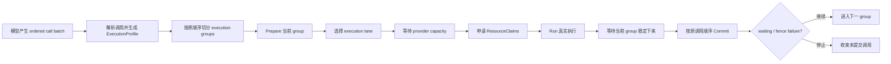

这里有四个很重要的边界。

| 边界 | 它负责什么 | 主要实现位置 |
|---|---|---|
| 调用语义描述 | 告诉 Runtime 这项调用能否并发、占哪些资源、失败影响多大 | `ExecutionProfile` |
| 调度与 admission | 决定哪些调用组成一组，以及什么时候真的获得运行资格 | `ExecutionCoordinator` |
| 真实执行 | 调 provider、访问工作区、运行子 Agent | `run_call` 及各 Provider |
| 有序提交 | 更新缓存、revision、Failure Guard、tool result、waiting 等逻辑状态 | `commit_call` / `AgentContext` |

因此，线程池只承担其中一部分工作。真正决定“这一批调用能不能安全跑完”的，是 profile、分组、admission、group quiescence 和 ordered commit 共同形成的执行协议。

### STAR 小结

| STAR | 本节对应内容 |
|---|---|
| S — Situation | 一次模型响应可能同时包含多项工具调用和子 Agent 调用。 |
| T — Task | Harness 需要让可并发的工作重叠执行，同时保持模型调用顺序可以被稳定解释。 |
| A — Action | 系统把一批调用依次经过 profile、group、prepare、admission、run、quiesce、commit。 |
| R — Result | 物理完成顺序可以变化，AgentContext 的逻辑推进仍然稳定。 |

---

## 2. 第一步：先给每个调用一张“执行说明书”

Execution Coordinator 不根据函数名临时猜测并发关系。每个调用在进入调度前都会获得一个 `ExecutionProfile`。它可以理解成 Runtime 使用的执行说明书，里面有三部分信息。

| 字段 | 作用 | 当前实现 |
|---|---|---|
| `ConcurrencyMode` | 说明这项调用是否允许进入并发组 | `CONCURRENT` / `EXCLUSIVE` / `UNKNOWN` |
| `ResourceClaims` | 说明运行期间会读写哪些逻辑资源 | `read` 与 `write` 两组资源 key |
| `FailureScope` | 说明调用失败后是否要阻断后续调用 | `ISOLATED` / `FENCE` |

### 2.1 `CONCURRENT`：允许和兼容调用一起运行

`CONCURRENT` 用于已经明确知道并发语义的调用。它必须搭配 `ISOLATED` failure scope。

当前 Native Provider 对普通只读能力会给出 concurrent profile；MCP Provider 对只读远端工具也采用 concurrent profile。Issues、Pull Requests、Repository 这些只读型领域 Agent 同样配置为 concurrent。

这里的“允许并发”只代表它具备进入并发组的资格。后面仍然要经过资源兼容、线程池容量和 provider 容量检查。

### 2.2 `EXCLUSIVE`：当前调用单独形成一个执行组

`EXCLUSIVE` 表示调度器会把这项调用放进单独的 group。它必须搭配 `FENCE` failure scope。

Native 的写操作会声明 workspace 写资源；MCP 的写操作会声明 repository 写资源。Coding Agent 本身配置为 exclusive，用来建立单独的 Agent 执行边界；它内部涉及 workspace 的具体步骤还会另外申请 workspace 资源，并维护 mutation 与 verification 状态。

另外，当权限预判得到 `ASK` 或 `DENY` 时，Dispatcher 会把原 profile 收紧成 exclusive，同时保留原来的资源 claims。这样需要审批或已经被权限规则挡住的调用会形成明确的顺序边界。

### 2.3 `UNKNOWN`：信息不足时采用保守语义

Provider 如果没有提供合法 profile、profile 计算过程出错，或者 Agent profile 无法确定，Harness 会降级为 `UNKNOWN`。

当前 `UNKNOWN` 会带上针对当前 repository 的保守写资源，例如 workspace 与 repo 资源，并使用 `FENCE`。这意味着调度器没有足够信息证明它可以安全并发时，会先保护共享状态。

### 2.4 Profile 从哪里来

Capability 的 profile 由绑定它的 Provider 根据“这一次具体调用”返回。这个设计允许同一个 Provider 下的不同能力具有不同并发语义。

子 Agent 的 profile 来自 `AgentSpec.execution_profile`。Harness 还会检查父子 Agent depth；profile 分类异常时，同样会降级到 `UNKNOWN`。

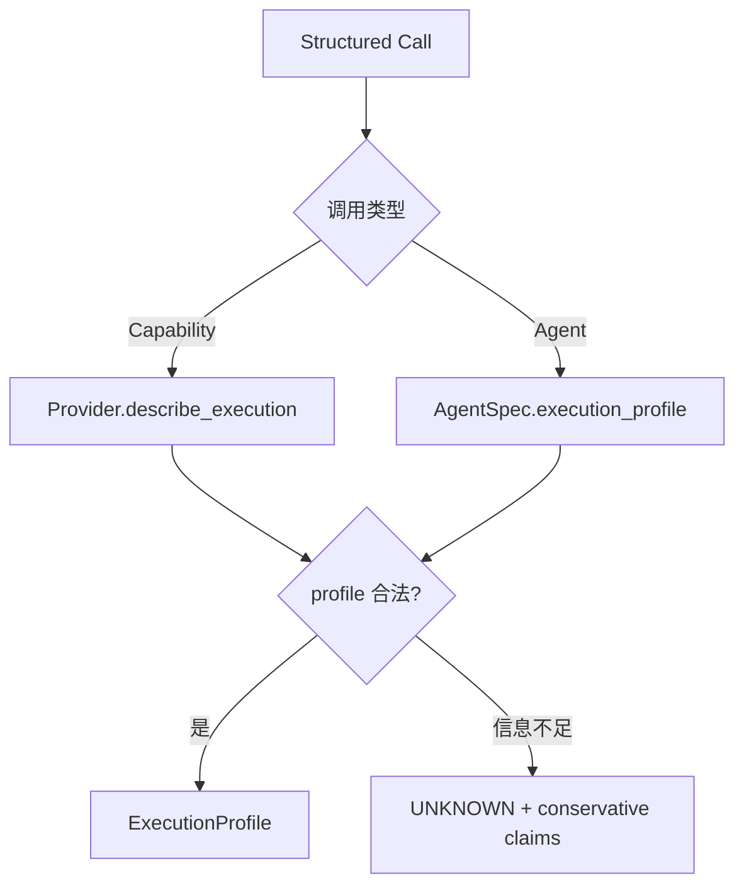

### STAR 小结

| STAR | 本节对应内容 |
|---|---|
| S — Situation | Runtime 需要在真正运行前知道每项调用的并发、资源和失败语义。 |
| T — Task | 把这些语义从具体工具实现中提取出来，交给统一协调器使用。 |
| A — Action | Provider 或 AgentSpec 生成 `ExecutionProfile`；异常和缺失信息统一降级为 `UNKNOWN`。 |
| R — Result | Coordinator 可以用统一规则调度不同 Provider 和不同 Agent，同时对未知行为保持保守。 |

---

## 3. 第二步：按原调用顺序切分 execution group

拿到 profiles 后，Coordinator 从第一个调用开始向后扫描，形成一个个 execution group。

分组规则很具体：

1. 如果当前位置是 `EXCLUSIVE` 或 `UNKNOWN`，当前 group 只有这一项。
2. 如果当前位置是 `CONCURRENT`，Coordinator 会继续查看后面的调用。
3. 后续调用也必须是 `CONCURRENT`。
4. 新调用的 `ResourceClaims` 必须与当前 group 中已有每项调用都兼容。
5. 一旦遇到不满足条件的调用，本组立即结束，下一组从这里重新开始。

假设模型依次给出 A、B、C、D、E：

- A、B 都是 concurrent，资源互不冲突；
- C 也是 concurrent，但它和 B 存在资源冲突；
- D 是 exclusive；
- E 又是 concurrent。

最终分组会是：

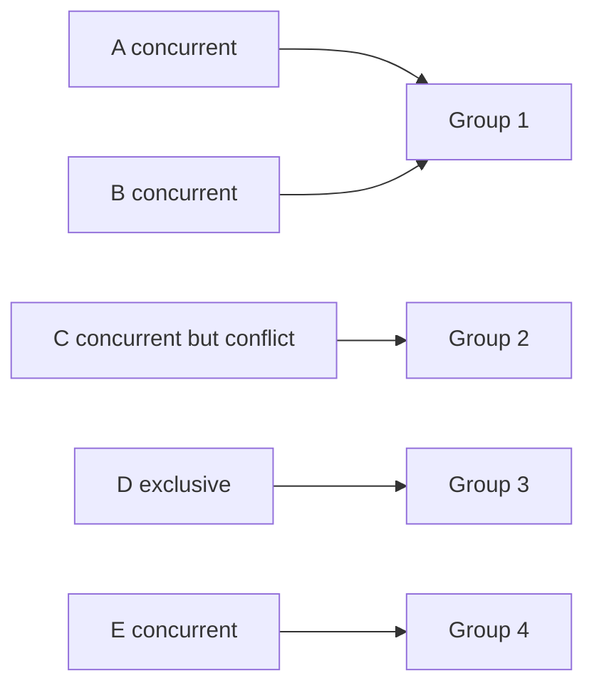

这里最值得注意的是“连续”两个字。Coordinator 不会扫描整批调用后把所有 concurrent 项重新拼成一组。D 后面的 E 也不会提前跨过 D 运行。

这样一来，模型产生的调用序列天然形成一道道顺序边界。组内可以利用并发，组与组之间按照原序推进。

### STAR 小结

| STAR | 本节对应内容 |
|---|---|
| S — Situation | 一批调用中可能交替出现独立读取、共享资源访问和独占操作。 |
| T — Task | 找出可以一起运行的局部区间，同时保留模型原有顺序边界。 |
| A — Action | Coordinator 只合并连续、均为 concurrent、且 claims 两两兼容的调用。 |
| R — Result | 调度能获得局部并发，又不会通过全局重排让后面的调用跨过前面的逻辑边界。 |

---

## 4. ResourceClaims：把“共享状态冲突”说清楚

`ResourceClaims` 用逻辑资源 key 描述一次调用在运行期间要读什么、写什么。它的结构很简单：`read` 保存读资源，`write` 保存写资源。

兼容规则和常见读写锁类似。

| 调用 A | 调用 B | 是否兼容 | 原因 |
|---|---|---|---|
| read X | read X | 可以 | 两边都只读取 X |
| read X | write X | 冲突 | B 可能在 A 读取期间修改 X |
| write X | read X | 冲突 | A 的修改会影响 B 的读取 |
| write X | write X | 冲突 | 两边都可能改变 X |
| write X | write Y | 可以 | 资源 key 不同 |

当前常见资源 key 包括 `workspace:<repo>` 与 `repo:<repo>`。Provider 或 Harness 负责把真实操作映射成这些逻辑资源。

### 4.1 分组时检查一次，真正 Run 前还会再申请一次资源

看到这里容易产生一个疑问：既然 group 已经检查过 claims，运行前还需要 `ResourceClaimManager` 做什么？

原因在于 group 只解决“当前这一批调用内部能否放在一起”。运行时还可能存在其他活跃 batch、嵌套 Agent 或直接 Runtime lease。真正进入 `run_call` 前再次申请资源，可以让共享资源约束覆盖更大的运行范围。

`ResourceClaimManager` 会维护：

- 每个资源当前有多少 reader；
- 哪些资源已有 writer；
- 一个 FIFO waiter 队列。

等待者只有排到队首并且资源可用时才能进入临界区。资源释放后，等待者会被唤醒重新判断。

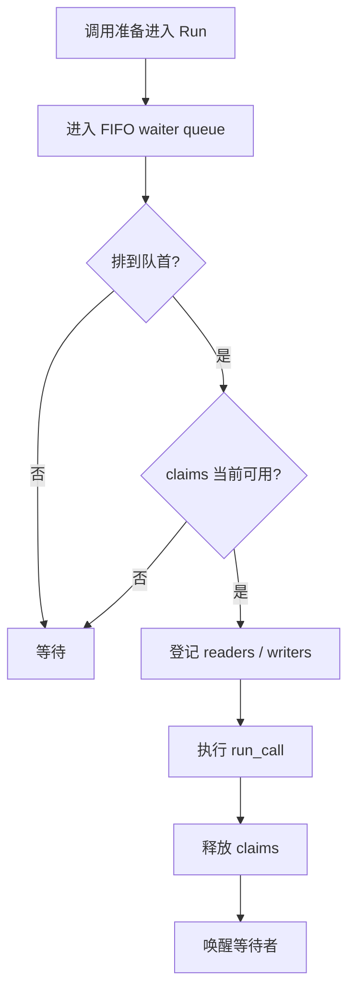

FIFO 会牺牲一部分极端情况下的吞吐量，因为队首调用暂时拿不到资源时，后面的兼容调用也不能直接插队。换来的结果是资源 admission 的行为更容易预测，也避免长期等待者被持续越过。

### STAR 小结

| STAR | 本节对应内容 |
|---|---|
| S — Situation | 多个 batch 和嵌套 Agent 可能同时触碰同一 workspace 或 repository。 |
| T — Task | 在整个 Runtime 范围内协调共享资源访问。 |
| A — Action | 用 read/write claims 描述资源，再由 FIFO `ResourceClaimManager` 在运行前原子申请和释放。 |
| R — Result | 调用即使来自不同 batch，也要经过同一套资源冲突规则。 |

---

## 5. 第三步：Prepare 当前 group

每个 group 真正提交到线程池之前，Coordinator 会按照原调用顺序调用 `prepare_call`。这一阶段的目标是把可以提前确定的调用信息整理好，让 worker 拿到的任务尽量完整。

Capability 与子 Agent 的 Prepare 内容不同。

### 5.1 Capability 的 Prepare

Dispatcher 会先做 capability preflight，主要处理：

- open call 与 `call_id` 的一致性；
- 受保护能力的业务校验；
- 重复调用检查；
- 参数在文件读取协议中的预处理；
- 只读结果是否已经可以从 read cache 覆盖；
- Failure Guard 对本次执行参数的预判。

如果 preflight 已经可以形成结构化失败，例如输入无效或重复调用，系统会把这个失败记录保存下来。后面的 Run 阶段直接返回该记录，不再访问真实 Provider。

`prepare_capability_call` 还会为文件读取计算实际读取范围，或者命中当前 AgentContext 的只读缓存。这里得到的是“准备好的调用记录”，还没有把结果提交进 AgentContext。

### 5.2 子 Agent 的 Prepare

子 Agent 调用会在这一阶段创建 child `AgentContext`，写入 parent run、parent call、目标任务等关联信息，并执行父 Agent 提供的 child prepare 逻辑。

真正启动 child Agent loop 要等到 Run 阶段。

### 5.3 Prepare 与审批的关系

权限层会在进入 Coordinator 前先做一次无副作用 permission decision。得到 `ASK` 或 `DENY` 时，profile 会被收紧为 exclusive。

需要用户审批的 Capability 在真实调用流程中会返回 `approval_required` 结构化结果。这个结果随后按原顺序进入 Commit，Dispatcher 在 Commit 时创建 pending approval，并把当前 AgentContext 置于 waiting 状态。

因此可以把审批过程理解成两步：**调度前先收紧执行边界，提交时再正式建立 waiting 状态。**

---

## 6. 第四步：Run 前要经过三层 admission

Prepare 完成后，group 中的调用开始被安排到具体 execution lane。当前实现有三种 lane。

| Lane | 用途 | 容量来源 |
|---|---|---|
| `capability` | Capability 调用 | Capability 专用 `ThreadPoolExecutor` |
| `domain` | 顶层 Agent 调用子领域 Agent | Domain Agent 专用 `ThreadPoolExecutor` |
| `inline` | 更深层的子 Agent 调用 | 当前 worker 线程直接执行 |

这里有一个需要特别纠正的概念：当前实现没有一个把所有调用统一限制住的“全局 max concurrency”。Capability 与 Domain Agent 分别有自己的线程池容量。

配置中的主要并发参数是：

| 配置 | 控制范围 |
|---|---|
| `execution.capability_max_concurrency` | Capability worker 数量 |
| `execution.domain_agent_max_concurrency` | 顶层领域子 Agent worker 数量 |
| `execution.provider_concurrency` | 每个 Capability Provider 的独立并发上限 |

### 6.1 Capability lane：线程池容量

Capability 被提交到 capability executor。线程池有空 worker 后，任务才会真正进入 `_admitted_run`。

### 6.2 Provider capacity：同一个 Provider 还有自己的 Semaphore

Capability 如果绑定到具体 Provider，还要申请对应 provider semaphore。

例如 capability pool 可以同时容纳多项任务，但某个 RAG Provider 的并发上限更小，那么落到这个 Provider 的调用会继续排队。这样可以把“Runtime 能跑多少任务”和“某个底层服务能承受多少请求”分开控制。

### 6.3 Resource admission：最后再申请 claims

拿到 provider slot 后，调用继续向 `ResourceClaimManager` 申请自己的 claims。资源可用后才进入真实 `run_call`。

所以 Capability 的运行路径可以概括为：

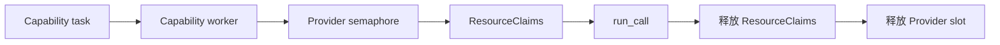

子 Agent 没有 provider semaphore，它主要受 domain lane 容量与 ResourceClaims 控制。

### 6.4 为什么更深层 Agent 使用 inline

顶层 Agent 的直接领域子 Agent 可以进入 domain executor 并发运行。进入更深层级后，后续 child call 使用 inline lane，在当前 worker 中继续执行。

从运行结构看，这会让一条嵌套 Agent 链保持在已经占用的 worker 内，不再继续向共享 domain pool 递归提交新任务，也让嵌套 cancellation tree 更容易沿当前执行链传播。

### STAR 小结

| STAR | 本节对应内容 |
|---|---|
| S — Situation | 即使调用语义允许并发，线程、Provider 和共享资源的实际容量仍然有限。 |
| T — Task | 把不同来源的容量约束分层管理。 |
| A — Action | Capability/Domain 使用独立 lane；Capability 再经过 provider semaphore；最后统一申请 ResourceClaims。 |
| R — Result | 并发量由真实瓶颈逐层收紧，不会只依赖一个粗粒度数字。 |

---

## 7. 第五步：Run 可以乱序完成，但当前 group 要先稳定下来

组内任务提交后，worker 会真正访问 Provider、工作区或子 Agent。多个任务的完成顺序由真实耗时决定。

假设同一 group 有 A、B、C 三个读取：

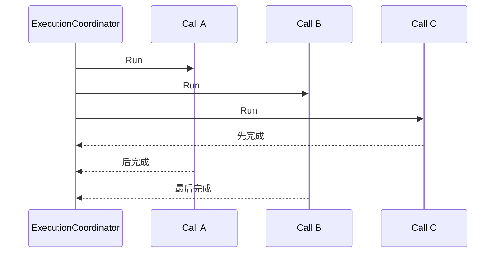

Coordinator 不会在 C 一完成时立刻把 C 写进 AgentContext。它会先等待当前 group 进入稳定状态，也就是 group 中已调度的工作都已经完成、取消或形成可解释的终态。

实现上 `_run_group` 会收集每个位置对应的 outcome，并保留一个 `resolved` 标记。即使某个 worker 很早返回，结果也只是暂存在当前 group 的 outcome 中。

### 7.1 普通 Exception 与执行中断分开处理

Capability 正常边界内的失败最终应当形成结构化失败结果；某些 Python `Exception` 如果从 worker 逃出，也会先作为该调用的 outcome 被收集，再在后续边界转成内部错误或失败处理。

更高层的中断，例如 cancellation 或其他 `BaseException`，会触发当前 cancellation handle。Coordinator 会尝试取消还没有开始的 future，并继续等待已经启动的任务收束。

这个“先让 group 稳定下来，再 Commit”的步骤非常重要。它避免 Commit 正在修改共享逻辑状态时，同组 worker 还在后台继续产生难以追踪的运行结果。

---

## 8. 第六步：按照模型原顺序 Commit

当 group 稳定后，Coordinator 按 group 中的原始索引顺序调用 `commit_call`。

假设物理完成顺序为 C → A → B，逻辑提交仍然是 A → B → C。

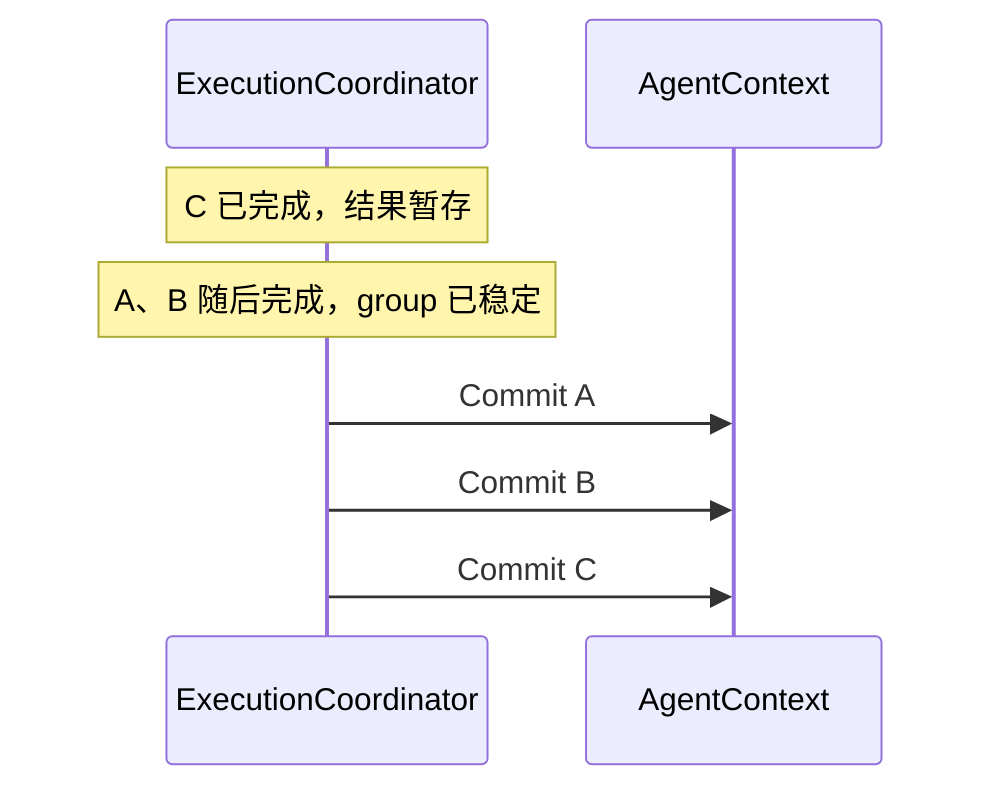

### 8.1 Commit 对 Capability 做了哪些事情

`AgentContext.commit_capability_call` 会根据调用类型和结果更新一系列逻辑状态，例如：

- 完成文件读取覆盖与 observation 整理；
- 对成功写操作清理 read cache 与 file-read 状态；
- 在真实文件发生变化时推进 coding workspace revision；
- 在验证命令成功执行后记录 validation revision 与 verification observation；
- 将成功的普通 READ 结果写入 read cache；
- 提交 Failure Guard 状态；
- 写入 capability audit 信息。

Dispatcher 随后会把最终 observation 追加成对应 `call_id` 的 tool result。

因此，Commit 会改变后续模型步骤能够观察到的状态。它必须服从 ordered call protocol。

### 8.2 Run 中也可能检测到真实 mutation

以 `native.bash` 为例，Run 前后会比较 worktree state。如果命令实际修改了工作树，系统会立刻记录 mutation，并清理读取状态。

这个保护处理发生在真实执行边界，因为外部命令可能产生副作用。随后 Commit 仍负责把此次调用的逻辑结果、验证记录、Failure Guard 和 tool result 按顺序写入上下文。

所以理解 Run / Commit 时可以这样区分：

| 阶段 | 关注点 |
|---|---|
| Run | 获得真实执行结果，并在必要时及时保护物理状态一致性 |
| Commit | 按模型顺序把结果转换成 Agent 可依赖的逻辑事实 |

### STAR 小结

| STAR | 本节对应内容 |
|---|---|
| S — Situation | 并发任务的完成顺序不可预测，AgentContext 中很多状态又带有顺序语义。 |
| T — Task | 在利用并发的同时，保证模型看到的调用历史、缓存、revision 和失败记录有稳定顺序。 |
| A — Action | group 先 quiesce，再按原调用位置逐项 Commit。 |
| R — Result | 物理执行可以乱序，逻辑事实仍按照模型发出的顺序建立。 |

---

## 9. waiting：审批出现在批次中间时怎样暂停

waiting 是理解 ordered commit 的一个很好的例子。

假设同一 concurrent group 中有 A、B、C，三项调用都已经 Run 完。Commit A 后继续处理 B，B 的结果是 `approval_required`。

Dispatcher 在 Commit B 时会：

1. 创建 approval；
2. 把 approval 信息放进 `context.pending`；
3. 让 B 的 commit decision 返回 `waiting`。

Coordinator 收到 waiting 后，不会继续 Commit C。C 的物理结果已经存在，所以它会通过 `suspend_call` 保存到 `context.uncommitted_capability_results`，然后结束当前 batch 推进。

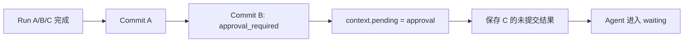

用户之后批准或拒绝，Agent Loop 会恢复 open call protocol。对于之前已经保存的 C，Loop 可以从 `uncommitted_capability_results` 取回结果，再按照 open calls 的顺序继续 Commit，无需重新执行 C。

这里要分清两个概念：

- **已执行**：Provider 或 worker 已经产生物理结果。
- **已提交**：结果已经在正确逻辑位置进入 AgentContext。

waiting 允许系统保存“已经执行但尚未提交”的结果。持久化和恢复章节会继续讨论这个状态如何跨 turn 处理。

---

## 10. FailureScope：失败后要不要拦住后面的调用

当前 `FailureScope` 只有两种。

| FailureScope | 调用失败后的动作 | 常见来源 |
|---|---|---|
| `ISOLATED` | 当前失败被记录，后续调用仍可继续 | `CONCURRENT` profile |
| `FENCE` | 当前失败形成顺序栅栏，后续未稳定调用被取消/收束 | `EXCLUSIVE` / `UNKNOWN` profile |

这两个值和 `ConcurrencyMode` 有强约束：

- `CONCURRENT` 必须搭配 `ISOLATED`；
- `EXCLUSIVE` 与 `UNKNOWN` 必须搭配 `FENCE`。

因此一次普通并发读取失败时，同组其他独立读取仍然有价值，Coordinator 可以继续按顺序提交它们。

如果独占写操作失败，后面的调用很可能依赖这次写入建立的新状态。FENCE 会阻止 batch 继续越过这个失败点。

### 10.1 FENCE 发生在 Commit 之后

Coordinator 会先把当前失败调用本身 Commit 成稳定的失败事实，再判断 `failure_stops_batch`。如果 profile 是 FENCE，它会为后续尚未 settled 的 calls 生成 cancelled tool result，并结束 batch。

这样失败本身不会凭空消失，模型下次仍然能看到“哪一项失败、后面的哪些调用因此没有继续”。

### STAR 小结

| STAR | 本节对应内容 |
|---|---|
| S — Situation | 有些失败只影响当前读取，有些失败会破坏后续动作的前提。 |
| T — Task | 明确失败传播边界。 |
| A — Action | Profile 用 `ISOLATED` 或 `FENCE` 声明失败语义；Coordinator 在 ordered commit 后决定是否停止 batch。 |
| R — Result | 独立失败不会无谓拖停整批调用，关键顺序边界失败也不会被后续动作直接越过。 |

---

## 11. Cancellation：怎样把父任务、future 和子 Agent 一起收束

Execution Coordinator 为每次活跃 batch 创建 `_CancellationHandle`。这个 handle 保存三类信息：

- 一个 cancellation `Event`；
- 当前 batch 已提交的 futures；
- 当前执行链下注册的 child cancellation handles。

如果一个 child Agent 在某个 worker 内启动新的 batch，新 batch 会通过 thread-local cancellation 关系挂到父 handle 下，形成临时 cancellation tree。

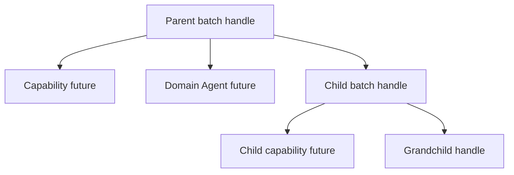

发出 cancel 后，系统会做几件事情：

1. 设置 cancellation event；
2. 唤醒正在等待 ResourceClaims 的调用；
3. 尝试取消尚未开始的 futures；
4. 递归取消 child handles；
5. 已启动任务继续收束到稳定边界；
6. Coordinator 为仍未 settled 的 open calls 生成可解释的取消结果。

Provider semaphore 的等待也会周期性检查 cancellation event；资源等待使用 Condition，被 cancel 时会主动唤醒。

需要特别注意：future cancellation 只能阻止尚未开始或能够响应取消的本地工作。已经发给外部系统的写请求可能已经产生副作用。远端副作用的确认、重试与恢复要结合第 08、09 章的 mutation 语义处理。

---

## 12. Capability 调用和子 Agent 调用怎样共用同一套 Coordinator

ExecutionCoordinator 面向的是“受 Harness 管理的执行单元”。CapabilityCall 和 AgentCall 最终都会通过同一个 `execute` 协议进入协调器。

两类调用共享：

- ExecutionProfile；
- execution group；
- ResourceClaims；
- cancellation；
- ordered commit；
- waiting 与 failure fence 的收束逻辑。

差异主要在 Run 和 Commit 的具体动作。

| 阶段 | CapabilityCall | AgentCall |
|---|---|---|
| Prepare | preflight、准备参数、缓存/读取协议 | 创建 child context、准备 child |
| Run | 调 Capability Provider | 启动 child Agent loop |
| Commit | commit capability record、追加 tool result | 完成 child、把 child 输出写回 parent |
| Lane | capability | domain 或 inline |

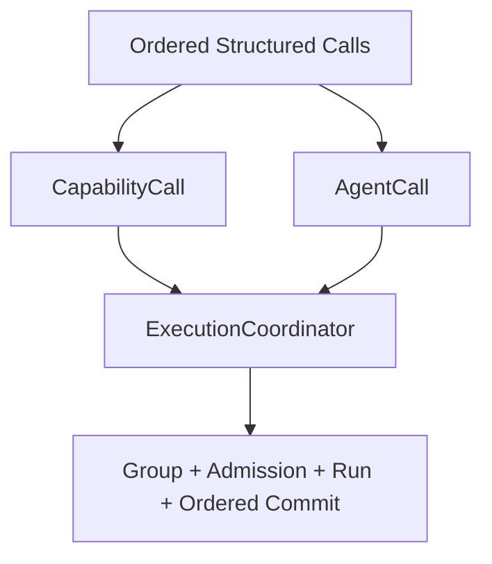

统一之后，Agent Loop 不需要为“工具并发”和“子 Agent 并发”维护两套完全独立的调度协议。

---

## 13. 用一个完整例子串起来：读取、编辑、验证怎样执行

假设 Coding Agent 的工作分成两轮。

第一轮，模型同时提出三个互不冲突的读取调用：read A、read B、read C。

第二轮，模型提出 edit A，随后运行测试。

### 13.1 第一轮：三个读取

Native READ 会得到 concurrent profile。三个调用的 claims 兼容，所以它们进入同一个 execution group。

Coordinator 依次 Prepare 三项调用，然后把它们提交到 capability lane。每项调用还会经过 native provider semaphore 与 ResourceClaimManager。

三项读取可以任意顺序完成。等 group 稳定后，Coordinator 仍按模型给出的 read A → read B → read C 顺序 Commit。

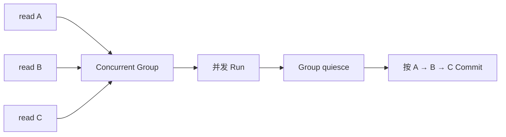

### 13.2 第二轮：edit A

Native 写操作会得到 exclusive profile，并声明当前 workspace 写资源。它单独形成一个 group。

Run 阶段真正修改文件。Commit 阶段会根据结果清理读取状态；如果工具报告文件实际发生变化，coding workspace revision 会推进。

### 13.3 接着运行测试

测试通过 `native.bash` 执行。由于它位于 edit 后面的调用位置，前一个 exclusive group 完成并 Commit 后才会进入后续 group。

验证命令成功后，Commit 会记录当前 revision 对应的 validation 信息。于是验证结论明确对应“编辑之后的工作树版本”。

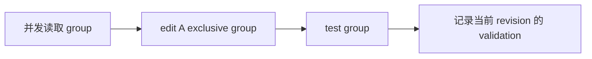

这个例子把本章最重要的关系串了起来：**并发发生在语义允许的 group 内；涉及 mutation 和验证时，group 边界与 ordered commit 会把状态变化固定在明确位置。**

---

## 14. 这套设计解决了哪些具体问题

到这里再讨论设计原因会更容易理解，因为每个机制已经有了明确位置。

### 14.1 只用线程池会缺少调用语义

线程池知道任务什么时候有 worker，却不知道 repository、workspace、approval、FailureScope 和模型调用顺序。ExecutionProfile 与 Coordinator 补上了这层 Harness 语义。

### 14.2 只按 READ/WRITE 分类仍然太粗

READ/WRITE 是 Capability 的访问级别；执行并发还要考虑 Provider 容量、具体逻辑资源、Agent 类型以及分类失败后的保守策略。ResourceClaims 提供了比单一 access level 更细的冲突表达。

### 14.3 只按完成顺序写回会让上下文变得不稳定

并发 worker 的完成顺序受网络、磁盘和调度影响。ordered commit 把这些不确定性隔离在 Run 阶段，AgentContext 仍然保持可重复解释的调用顺序。

### 14.4 waiting 需要区分“执行完成”和“逻辑提交”

一个后续调用可能已经跑完，但前面的审批调用让上下文暂停。`uncommitted_capability_results` 提供了中间承接点，使系统可以保存真实结果，同时守住 open call 的顺序。

### 14.5 取消需要覆盖嵌套 Agent

Agent 调 Agent 后会形成运行树。CancellationHandle 把 futures、资源等待者和 child handles 连接起来，使父任务停止时可以沿调用树传播取消信号。

---

## 15. STAR 总复盘

### S — Situation

GitAgent 一轮模型响应可以包含多个 CapabilityCall，也可以混合 AgentCall。这些调用的耗时、共享资源、Provider 限制、副作用和失败传播范围都不同；子 Agent 还会继续产生嵌套执行。

### T — Task

Harness 需要同时满足四个目标：利用独立任务的等待时间、保护共享资源、保持模型调用顺序、让 waiting / failure / cancellation 都能收束成可恢复的逻辑状态。

### A — Action

GitAgent 采用了一条分层执行链：

1. Provider 或 AgentSpec 为每项调用给出 `ExecutionProfile`；
2. Coordinator 只把连续且 claims 兼容的 concurrent 调用组成一组；
3. 当前 group 按原顺序 Prepare；
4. Capability 和 Domain Agent 进入各自 lane；
5. Capability 再经过 provider semaphore；
6. 所有执行单元运行前都要申请 ResourceClaims；
7. group 内任务可以并发 Run；
8. group 先进入稳定状态，再按照模型原顺序 Commit；
9. waiting 保存已执行但未提交的结果；
10. `ISOLATED` / `FENCE` 控制失败传播；
11. cancellation tree 负责收束 futures、资源等待与嵌套 Agent。

### R — Result

独立读取和领域子任务可以真正重叠执行；共享 workspace、repository 与 Provider 不会被无约束争用；AgentContext 的 tool call、缓存、revision、verification 与失败事实仍有稳定顺序；发生审批暂停或父任务取消时，系统也能把当前执行批次收束到可解释状态。

这套方案付出的成本也很明确：Provider 与 Agent 必须提供可靠的执行语义，Runtime 要维护 outcome 暂存、资源队列和 cancellation tree，并发度有时会为了顺序稳定与保守安全而降低。

---

## 16. 复习时最容易混淆的概念

| 容易混淆的说法 | 更准确的理解 |
|---|---|
| `CONCURRENT` 就会立刻并行 | 它只获得进入并发组的资格，后面还有 lane、provider 和 resource admission |
| 所有并发共用一个全局槽位 | Capability 与 Domain Agent 当前使用不同线程池，Provider 还有各自的 semaphore |
| group 已经检查 claims，运行时就不用再检查 | group 处理当前批次内部兼容性，ResourceClaimManager 还要协调跨 batch 与嵌套执行 |
| worker 先完成，Agent 就先看到结果 | worker 结果先暂存，group 稳定后按原调用顺序 Commit |
| approval 在 Prepare 时直接把 Agent 挂起 | 调度前会先收紧 profile；正式 pending/waiting 在 `approval_required` 结果被 ordered commit 时建立 |
| FailureScope 有“调用 / group / batch”三档 | 当前实现只有 `ISOLATED` 与 `FENCE` 两档 |
| cancel future 可以撤销已经发生的远端写 | cancellation 负责停止和收束运行工作，已经发生的外部副作用需要单独确认和恢复 |
| READ 一定可以并发 | 当前 Provider 通常给 READ concurrent profile，但最终仍以 ExecutionProfile、claims 和 admission 为准 |

---

## 17. 面试或复述时怎样讲这一章

建议先画下面这条主线，再展开细节：

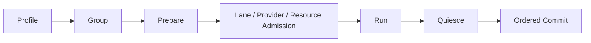

然后按三层解释：

第一层讲**执行语义**：`ExecutionProfile = ConcurrencyMode + ResourceClaims + FailureScope`。

第二层讲**并发落地**：连续兼容调用组成 group，Capability/Domain 有独立 lane，Capability 还有 provider semaphore，运行前统一申请资源。

第三层讲**正确性收束**：group 先稳定，再按模型顺序 Commit；waiting 暂存未提交结果；FENCE 截断后续调用；cancellation tree 收束嵌套任务。

一句话总结可以说：

> GitAgent 把“能不能同时跑”和“什么时候算进入 Agent 逻辑历史”分成两层管理：安全的调用可以并发 Run，所有结果仍通过 group quiescence 与 ordered commit 按模型顺序进入 AgentContext。

---

## 18. 代码定位

| 想核对的问题 | 主要位置 |
|---|---|
| `ExecutionProfile`、`ResourceClaims`、`FailureScope` | `gitagent/harness/execution.py` |
| group 切分、lane、provider semaphore、resource admission | `gitagent/harness/execution.py` |
| cancellation handle 与 cancellation tree | `gitagent/harness/execution.py` |
| Capability profile 如何向 Provider 查询 | `gitagent/capability/layer.py` |
| Native READ/WRITE 的执行 profile | `gitagent/capability/providers/native.py` |
| MCP READ/WRITE 的执行 profile | `gitagent/capability/providers/mcp.py` |
| Capability batch 的 prepare/run/commit/waiting | `gitagent/harness/structured_call_dispatcher.py` |
| Capability 与 Agent 混合 batch | `gitagent/agent_loop/loop.py` |
| `prepare_capability_call` / `execute_capability_call` / `commit_capability_call` | `gitagent/harness/context/state.py` |
| Coding Agent 的 exclusive profile | `gitagent/agents/coding.py` |
| Issues / Pull Requests / Repository 的 concurrent profile | `gitagent/agents/issues.py`、`pull_requests.py`、`repository.py` |
| 并发相关配置 | `config.json` 的 `execution` 部分 |

下一章继续沿着这条执行链看最重要的写路径：[Coding Agent 怎样在隔离工作树里完成修改，并把验证结果绑定到正确 revision](07-coding-workspace-and-verification.md)。
