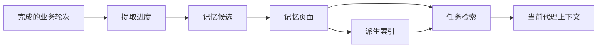
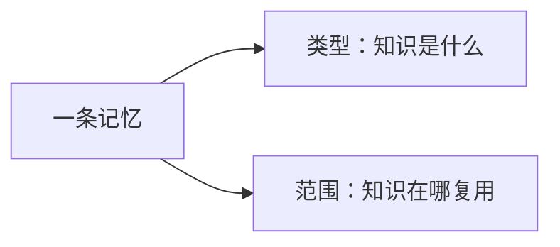
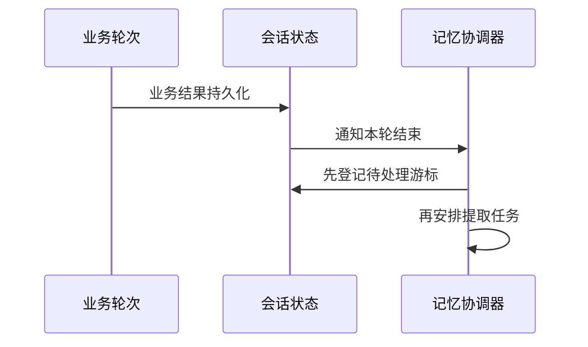
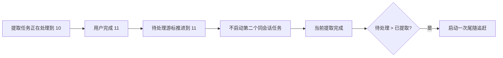
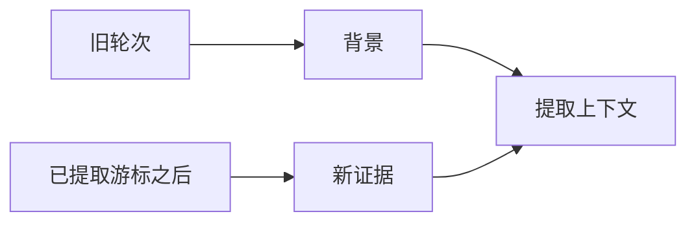
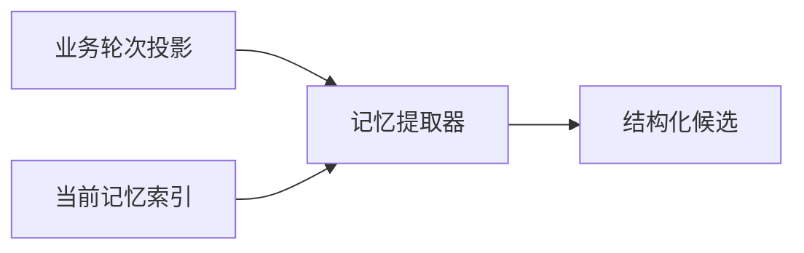
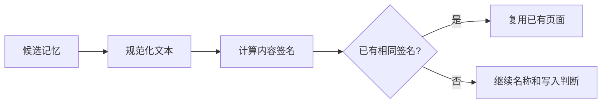
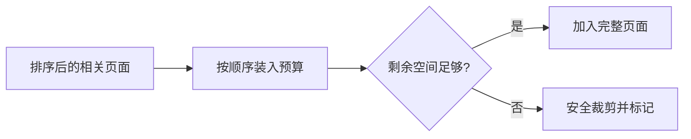

# 06 长期记忆：一条会话信息怎样变成可复用知识

## 本章先回答什么

会话历史能回答“这次会话说过什么”，却不能自然解决“用户上周说过的项目约定，今天还要不要记得”。

把所有历史永久塞进上下文也不是答案。旧对话会持续增长，临时排查过程会变成长期噪声，项目事实还会过期和被替代。

所以长期记忆要解决的是另一类问题：**哪些信息值得跨轮、跨会话保留；它们怎样被提取、存储、检索、更新、停用和删除。**

### 本章的 STAR 主线

| 阶段 | 本章要解决的问题 |
|---|---|
| 情境 S | 会话历史太完整、太短期，也缺少过期和冲突语义，不能直接充当长期知识库 |
| 任务 T | 把少量稳定知识从已完成业务历史中提取出来，独立存储，并按当前任务重新检索 |
| 行动 A | 完成轮次登记 → 双游标追赶 → 有界证据构造 → 结构化提取 → 页面校验与去重 → 索引 → 检索 → 生命周期整理 |
| 结果 R | 长期知识可以跨会话复用，又不会和完整对话历史混在一起；提取失败也不会回滚业务结果 |

---

## 1. 情境：为什么完整聊天记录不是长期记忆

两者保存的信息目标完全不同。

| 维度 | 会话历史 | 长期记忆 |
|---|---|---|
| 目标 | 保存交互事实和工具协议 | 保存少量未来仍有价值的知识 |
| 生命周期 | 当前会话 | 跨会话 |
| 内容密度 | 高，包含大量过程信息 | 低，只保留筛选结果 |
| 过期处理 | 上下文压缩 | TTL、停用、替代、整理 |
| 检索方式 | 按消息顺序重放 | 按当前任务重新选择 |
| 失败影响 | 可能影响当前轮次 | 不应改变已完成业务轮次 |

例如一次缺陷排查中，十几次命令失败属于会话历史，但“这个仓库提交前必须运行某项测试”可能值得成为长期记忆。

所以 GitAgent 没有让长期记忆成为“更长的聊天记录”，而是建立独立知识生命周期。

---

## 2. 任务：长期记忆有哪些核心对象

整个系统可以从三个对象理解：页面、索引和提取进度。



| 对象 | 是不是权威状态 | 作用 |
|---|---|---|
| 记忆页面 | 是 | 保存一条长期知识和生命周期元数据 |
| `MEMORY.md` 索引 | 否，可重建 | 给模型一个当前活跃记忆目录 |
| 提取游标 | 是 | 记录业务历史已经处理到哪里 |
| 整理状态 | 是 | 记录上次集合维护时间和进度 |

最重要的权威关系是：**页面是知识真相，索引只是页面集合的视图。**

---

## 3. 为什么页面而不是一份不断增长的大文件

每条记忆保存成独立 Markdown 页面，并带严格元数据。

这种结构允许每条知识单独拥有：

- 页面编号；
- 名称和说明；
- 类型；
- 作用范围；
- 分类和标签；
- 重要程度；
- 来源；
- 创建和更新时间；
- TTL；
- 停用状态；
- 被替代关系；
- 内容签名；
- 正文。

如果所有记忆都写进一份自由文本，系统很难回答“这一条是否过期”“这一条是手工还是自动”“这一条是否应该停用”。

独立页面把生命周期管理从文本编辑变成结构化状态管理。

---

## 4. 为什么分成私有和项目两个作用范围

GitAgent 需要同时记住两类知识。

| 范围 | 绑定身份 | 典型内容 |
|---|---|---|
| 私有 | 用户账户 | 用户偏好、长期交互要求、稳定反馈 |
| 项目 | 用户账户 + 仓库 | 仓库约定、模块背景、项目参考信息 |

两类页面存放在不同根目录。

目录身份使用稳定账户和仓库标识的哈希，而不是直接用展示名称。

这样仓库改名不会让旧记忆丢失归属，不同账户也不会共享私有页面。

---

## 5. 记忆类型和作用范围为什么不能合并

页面还带类型，例如用户信息、反馈、项目知识、参考信息。

类型回答“这条知识是什么”。

作用范围回答“它可以在哪个边界复用”。



分开以后，系统可以表达：

- 私有范围的用户反馈；
- 项目范围的参考资料；
- 项目范围的稳定工程约定。

如果把二者合成一个枚举，知识语义和访问边界会被绑死。

---

## 6. 一轮业务结束后，记忆提取为什么不立刻阻塞用户

记忆提取属于派生任务。

业务回复和远端动作已经完成后，系统才考虑“这一轮有没有值得长期保存的内容”。



这里的顺序很关键：**先持久化“还有工作没做”，再启动后台任务。**

后台线程可以因进程退出消失，但待处理进度不能丢。

---

## 7. 为什么需要“已提取”和“待处理”两个游标

每个会话保存两个进度值。

| 游标 | 含义 |
|---|---|
| 已提取游标 | 已经成功完成长期记忆判断的最后业务轮次 |
| 待处理游标 | 当前至少需要处理到的业务轮次 |

正常关系是：

```text
待处理游标 >= 已提取游标
```

假设已提取到 8，用户刚完成第 10 轮：

```text
已提取 = 8
待处理 = 10
```

提取成功后：

```text
已提取 = 10
待处理 = 10
```

提取失败时，已提取仍然是 8。

这比“后台线程是不是还活着”更可靠，因为进度本身进入数据库。

---

## 8. 为什么同一会话不会同时启动多个提取任务

用户可能在提取第 8—10 轮时，又完成了第 11 轮。

最直接的做法是再起一个线程处理 11。这样两个提取器可能同时读取和写记忆页面。

GitAgent 选择同一会话只运行一个提取任务。

新轮次只推进待处理游标。



这种方式把多个后台任务合并成“推进同一个进度游标”。

---

## 9. 服务重启后，为什么不需要恢复原后台线程

后台线程不是持久对象，也没有必要持久化 Future。

服务重建时只读两个游标。

如果：

```text
待处理游标 > 已提取游标
```

说明还有记忆任务没有完成，系统重新安排一次提取。

这体现一条常见的异步设计原则：**持久化工作进度，不持久化执行线程。**

---

## 10. 提取器看到的不是完整会话原文

完整事件历史里包含工具调用、日志、内部代理过程等大量噪声。

记忆提取上下文只投影已完成业务轮次，并把每轮压缩成有限字段。

| 字段 | 作用 |
|---|---|
| 用户内容 | 用户提出了什么 |
| 助手内容 | 系统最终回答了什么 |
| 路由结果 | 本轮属于哪个领域 |
| 领域摘要 | 领域工作完成了什么 |
| 轮次编号 | 建立顺序 |
| 新证据标记 | 区分本次必须处理内容和旧背景 |

提取器处理的是“业务历史投影”，不是代理内部全部工具日志。

---

## 11. 为什么要区分“新证据”和“背景轮次”

已提取游标之后的轮次是本次必须处理的新证据。

游标之前的旧轮次只提供上下文背景。



这个区分决定上下文超限时谁可以被牺牲。

旧背景可以裁剪，新证据不能静默丢掉。

否则系统可能没有真正处理第 10 轮，却把已提取游标推进到 10。

---

## 12. 提取上下文太大时，为什么只删除旧背景

长期记忆提取本身也使用模型，也受上下文窗口限制。

如果输入太大，系统优先删除旧背景轮次。

| 内容 | 上下文压力下能否删除 |
|---|---|
| 游标之前的旧背景 | 可以 |
| 游标之后的新证据 | 不可以 |

所有背景都删掉后，新证据仍然放不下，提取直接失败，已提取游标不推进。

这保证“游标推进”有明确语义：游标覆盖的轮次确实进入过提取判断。

---

## 13. 为什么提取器是一个隔离元代理

提取器的任务不是继续帮助用户完成仓库工作，而是判断“哪些内容值得长期保存”。

所以它没有：

- Shell；
- 仓库读取工具；
- GitHub 写工具；
- 会话修改工具。

它只接收：

- 有界业务轮次投影；
- 当前记忆索引；
- 结构化输出要求。



这限制了会话文本中的指令影响范围。提取过程不能顺便去执行用户任务。

---

## 14. 提取器为什么必须输出结构化候选

提取结果不是一段 Markdown。

每条候选需要明确字段：名称、说明、类型、范围、分类、重要程度、TTL、标签和正文。

一次提取还有候选数量上限。

这样做有两个目的：

1. 控制一次业务轮次让长期记忆膨胀的速度；
2. 让存储层可以继续执行确定性校验和生命周期处理。

结构化输出失败可以有限纠正。持续失败时，本次提取结束，游标不推进。

---

## 15. 为什么模型候选不能直接写磁盘

模型输出通过结构校验，只说明“字段形状正确”。

存储层还要保证持久化不变量。

| 存储校验 | 目的 |
|---|---|
| 名称转安全 slug | 防止任意路径写入 |
| 类型、范围、分类校验 | 保持页面协议稳定 |
| 文本长度上限 | 控制磁盘与上下文规模 |
| 重要程度和 TTL 范围 | 保证生命周期字段有效 |
| 标签和替代编号校验 | 保证引用关系合法 |
| 敏感内容清洗 | 防止凭据进入长期记忆 |

模型契约和存储契约是两层边界。

---

## 16. 内容签名怎样避免同一知识反复生成页面

自动提取器可能在不同轮次多次判断同一条知识值得保存。

存储层根据作用范围、类型、说明和正文生成规范化内容签名。



相同签名不创建新页面。

这让去重由存储层保证，而不是依赖模型“记得自己以前写过什么”。

---

## 17. 同名页面和相同签名为什么是两个问题

### 相同签名

说明核心内容相同，直接复用已有页面。

### 同名但签名不同

说明同一个主题出现了新内容。

自动页面可以更新原主题页面的说明、正文、重要程度、TTL 和标签。

| 情况 | 处理 |
|---|---|
| 名称不同，签名相同 | 视为相同知识，复用 |
| 名称相同，签名不同 | 同一主题演进，更新自动页面 |
| 与手工页面同名 | 自动候选不能覆盖手工页面 |

这样既能去重，也能让长期知识随项目变化更新。

---

## 18. 为什么手工记忆比自动记忆优先级高

用户明确保存的页面来源是手工。

自动系统不会：

- 覆盖同名手工页面；
- 自动停用手工页面。

如果用户手工写入的内容与一个自动页面完全相同，系统还能把原页面提升为手工来源。

这表达的是知识治理优先级：**用户明确保存 > 模型自动推断。**

---

## 19. 页面文件怎样保证长期存储安全

页面名称最终会进入文件系统，所以路径安全不能依赖模型输出。

存储层会：

- 要求根目录是绝对路径；
- 使用安全 slug 构造文件名；
- 检查文件名和元数据名称一致；
- 拒绝路径逃逸和符号链接；
- 使用临时文件和原子替换写入；
- 限制目录和文件权限；
- 读取时重新计算内容签名。

长期记忆不是临时缓存。它的文件安全标准接近会话持久化状态。

---

## 20. 为什么索引可以随时重建

`MEMORY.md` 只列当前活跃页面的摘要信息。

页面创建、更新、停用、删除后，索引重新生成。


索引损坏时，不需要恢复“上一版索引”，只需要重新扫描页面。

这让派生视图不会成为第二份权威状态。

---

## 21. 当前任务怎样从页面集合里选出相关记忆

代理不会把全部页面正文塞进上下文。

检索分两层：完整活跃索引 + 少量选中页面。

| 内容 | 作用 |
|---|---|
| 完整索引 | 告诉模型“系统还记得哪些主题” |
| 选中页面正文 | 给当前任务真正需要的具体知识 |

检索器根据名称、说明、标签和分类匹配查询词，重要程度提供辅助分数。

对 Unicode 查询还会处理非 ASCII 词和双字符片段，改善中文等语言的简单匹配。

页面数量较小、元数据较强，所以这里选择可解释的结构化排序，而不是额外引入向量数据库。

---

## 22. 为什么检索结果也有独立预算

长期记忆不是“永久免预算知识”。

一次检索只选择少量页面，页面正文还有总字节限制。

页面超过剩余预算时，会按 UTF-8 安全边界裁剪，并明确标记截断。



长期记忆先受自己的预算约束，再进入整体上下文预算。

---

## 23. 为什么旧页面要带“需要核对当前事实”的警告

项目会变化。

一条几个月前的“当前默认分支行为”可能已经失效。

长期记忆更接近持久知识缓存，不是仓库和 GitHub 当前状态的权威来源。

因此页面长时间未更新时，检索渲染会提醒代理：使用前需要用当前仓库和远端证据核对。

这避免模型把“记得的东西”当成“现在一定是真的”。

---

## 24. TTL、停用和遗忘为什么是三种不同状态

| 状态 | 文件是否保留 | 是否进入活跃检索 | 适用场景 |
|---|---|---|---|
| TTL 到期 | 保留 | 否 | 自动时间失效 |
| 停用 | 保留 | 否 | 重复、被替代、生命周期整理 |
| 遗忘 | 删除 | 否 | 用户明确要求删除 |

为什么不都直接删除？

因为自动整理需要保留历史关系和替代信息。停用比物理删除更适合系统维护。

用户明确遗忘则属于不同语义，最终删除页面文件。

---

## 25. “整理”为什么不是再让一个模型自由改写记忆

长期记忆积累后，会出现重复和被替代页面。

GitAgent 的自动整理使用确定规则，而不是让模型重新总结整套记忆。

### 显式替代

新页面声明 `supersedes` 时，被替代的自动页面可以停用。

### 重复分组

系统按内容签名和规范化说明等规则分组，再选择代表页面。

选择代表时优先：

1. 手工页面；
2. 更高重要程度；
3. 更新更近；
4. 稳定页面编号顺序。

其他自动页面停用。

这让知识可见性变化能够复现，也保护用户手工内容。

---

## 26. 为什么整理不是每个轮次都运行

提取和整理解决的是不同问题。

| 过程 | 目标 | 频率 |
|---|---|---|
| 提取 | 追赶新业务轮次 | 随轮次推进 |
| 整理 | 清理长期页面集合冗余 | 低频 |

自动整理有时间间隔、累计会话数和短时间节流等门槛。

上次整理时间和会话标记进入数据库；短时间检查节流只放在当前进程内。

这样进程重启不会丢长期维护进度，也不需要持久化每一次短暂检查。

---

## 27. 记忆失败为什么不回滚业务轮次

这条边界值得单独强调。

业务轮次已经持久化后，记忆提取才启动。

提取失败：

- 记录追踪；
- 已提取游标不推进；
- 待处理游标保留；
- 后续可以补做。

整理失败：

- 记录追踪；
- 整理进度不推进。

用户已经得到的回复和已经完成的远端动作不会回滚。

长期记忆因此是**可补偿派生系统**，不是主业务事务的一部分。

---

## 28. 用一条项目约定把整章串起来

用户在一次仓库讨论中明确说：“这个仓库提交前必须运行完整单元测试。”

### 第一步：业务轮次正常完成

用户回复和本轮工作先进入持久状态。

### 第二步：登记提取进度

待处理游标推进到本轮编号，再启动后台提取。

### 第三步：构造证据

本轮作为新证据进入提取上下文，少量旧轮次提供背景。

### 第四步：提取器生成候选

模型输出项目范围、工程约定类型的结构化候选。

### 第五步：存储层校验

页面名称转安全 slug，字段检查，敏感信息检查，计算内容签名。

### 第六步：写页面并更新索引

没有相同签名时创建页面，`MEMORY.md` 重建。提取成功后已提取游标推进。

### 第七步：未来另一个会话修改代码

当前任务检索到这条页面。模型得到完整索引和相关页面正文，并在验证计划中考虑这项约定。

### 第八步：以后同一约定再次被提取

内容签名相同，存储层复用原页面，不制造重复知识。

这条链包含了提取、存储、检索和去重的完整生命周期。

---

## 29. 结果：长期记忆系统最终保证了什么

| 设计 | 得到的结果 |
|---|---|
| 页面和会话历史分离 | 长期知识不会被短期工具噪声淹没 |
| 页面是权威、索引可重建 | 派生目录损坏不会丢失知识真相 |
| 双游标 | 后台线程消失后仍能知道处理进度 |
| 同会话提取合并 | 不会堆积互相竞争的提取任务 |
| 新证据不可静默裁剪 | 游标推进具有可信语义 |
| 隔离提取器 | 记忆判断不会继续执行用户任务 |
| 存储层二次校验和内容签名 | 自动提取具备安全边界和幂等性 |
| 手工页面优先 | 用户明确知识不会被自动系统覆盖 |
| TTL、停用、替代、整理 | 长期知识有生命周期，而不是永久累积 |
| 提取失败与业务隔离 | 记忆系统故障不污染已完成业务结果 |

代价是长期记忆需要页面存储、索引、游标、提取器、检索和整理多条链。

GitAgent 接受这部分复杂度，因为长期知识真正困难的不是“保存文本”，而是**决定何时可信、何时过期、何时重复、何时应该从当前上下文消失。**

---

## 30. 复习时怎样讲这一章

可以按下面顺序复述：

1. 会话历史保存完整过程，长期记忆只保存跨会话仍有价值的少量知识；
2. 每条记忆是独立页面，页面是权威，索引可以从页面重建；
3. 页面分私有和项目范围，并有类型、TTL、来源、替代关系等生命周期字段；
4. 每轮业务完成后先推进待处理游标，再异步提取；
5. 已提取和待处理双游标让进程重启后可以补做，不需要恢复后台线程；
6. 提取上下文区分新证据和旧背景，新证据不能为了上下文窗口被丢掉；
7. 提取器只输出结构化候选，存储层再做路径、字段、敏感内容和内容签名校验；
8. 查询时给模型完整索引和少量相关页面；
9. 重复、过期和替代页面通过确定规则处理，手工页面优先；
10. 记忆失败只保留待处理进度，不回滚已经完成的业务轮次。

## 31. 代码定位

| 想核对的问题 | 代码位置 |
|---|---|
| 页面字段和记忆类型 | `gitagent/memory/models.py` |
| 页面写入、校验、去重、TTL、停用和遗忘 | `gitagent/memory/pages.py` |
| 索引生成 | `gitagent/memory/index.py` |
| 查询排序和页面预算 | `gitagent/memory/search.py` |
| 业务轮次怎样变成提取证据 | `gitagent/memory/extractor.py` |
| 双游标、同会话合并和失败补做 | `gitagent/memory/hooks.py` |
| 自动整理门槛和维护状态 | `gitagent/memory/dream.py` |
| 记忆游标怎样持久化 | `gitagent/infra/persistence/sessions.py` |
