# 07 Coding Workspace 与验证：代码候选是怎样一步步构造出来的

前一章讲的是 Execution 层怎样安排调用、控制并发并按逻辑顺序提交结果。本章继续往下看 Coding Agent 的 patch 模式，重点回答一件事：**当模型决定修改代码以后，GitAgent 怎样把“我要改代码”逐步变成一份可以检查、可以验证、可以交给上层继续处理的本地候选。**

这一章沿着真实状态变化讲实现过程，并在关键位置解释设计原因、边界和代价。复习时重点关注 `source_ref`、workspace、revision、verification 之间怎样互相约束。

本章只覆盖本地候选构造和验证。候选怎样进入远端 Mutation Plan、怎样经过审批并最终影响 GitHub，放在第 08 章讨论。

---

## 1. 先建立整体认识：这个模块到底由哪些部分组成

进入细节前，先把整条 patch 链路看完整。Coding Agent 在 patch 模式下会维护一块临时 Git 工作区，并围绕这块工作区不断执行“读取 → 修改 → 验证 → 再修改”的循环。等当前状态可以收束时，Harness 再从真实 Git 工作树中生成 `CandidatePatch` 和 `VerificationReport`。

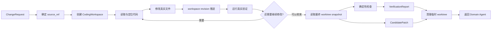

这条链路里有三个状态最值得先记住。

| 状态 | 放在哪里 | 它回答的问题 |
|---|---|---|
| `source_ref` | `ChangeRequest` 与 `CodingWorkspace` | 这次修改从哪个精确 Git commit 开始 |
| `revision` | `CodingWorkspace` | 当前工作树在本次任务里经历了第几轮真实变化 |
| 验证事件 | `AgentContext.observations` | 哪条真实验证命令针对哪个 revision 执行，结果怎样 |

还要先澄清一个容易混淆的数据边界：`CandidatePatch` 当前包含新增、修改、删除文件，patch 文本和最终文件内容等候选事实；`source_ref` 留在 `ChangeRequest/CodingWorkspace` 这条任务链里，`CandidatePatch` 数据结构本身没有单独的 SHA 字段。理解这一点以后，后面就不会把“候选内容”和“候选来源版本”混成一个对象。

---

## 2. 第一步：先把修改的起点固定下来

### 2.1 系统具体怎么做

Domain Agent 要调用 Coding Agent 进行 patch 时，会准备一个结构化 `ChangeRequest`。这个对象至少描述目标仓库和修改目标，还可以携带目标分支、Issue 编号、建议标题、已知目标文件等信息。

真正影响 Coding Workspace 基线的是 `source_ref`。

如果上层已经知道精确 commit SHA，就直接把它放进 `ChangeRequest.source_ref`。如果上层没有提供，Coding Agent 初始化 patch workspace 时会读取仓库默认分支，并把当时解析到的默认分支 commit SHA 写回 `ChangeRequest`。从这一刻开始，本次任务使用这个 SHA 作为固定基线。

随后 `CodingWorkspace` 会再次检查 `source_ref` 的格式，只接受精确 commit SHA。工作区创建完成以后，还会执行一次 HEAD 解析，确认临时 worktree 的 HEAD 与预期 SHA 完全一致。

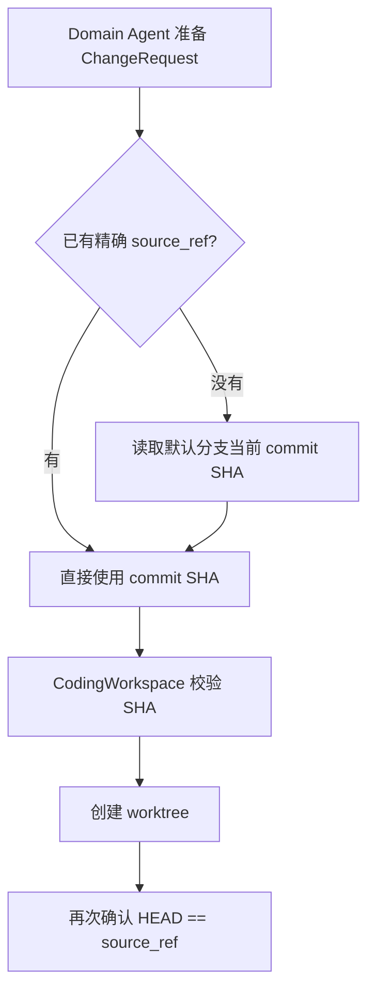

因此，这一阶段完成以后，系统已经得到一个明确答案：**本次代码修改从哪个不可变 Git commit 开始。**

## 3. 第二步：基于这个 commit 创建独立 Coding Workspace

### 3.1 系统具体怎么做

`CodingWorkspace` 没有直接在 GitAgent 项目目录里修改目标仓库。它使用两个受管理区域：一个区域保存目标仓库的本地 repository cache，另一个区域保存每次 patch 任务自己的临时 worktree。

创建流程可以分成四步。

第一步，检查目标仓库的本地 cache 是否存在。没有 cache 时，系统会先 clone 一份不 checkout 工作树的本地仓库副本。

第二步，检查 `source_ref` 对应 commit 是否已经存在于 cache。缺少时先 fetch 远端引用，再尝试针对这个精确 SHA 获取对象。如果最终仍然找不到该 commit，workspace 创建直接失败，系统不会偷偷换用另一个 commit 继续。

第三步，为当前任务创建独立 worktree。创建时使用 detached HEAD，并明确指定 `source_ref`。

第四步，在新 worktree 中读取 HEAD，确认它与 `source_ref` 完全一致。只有这一步通过，workspace 才进入 prepared 状态。

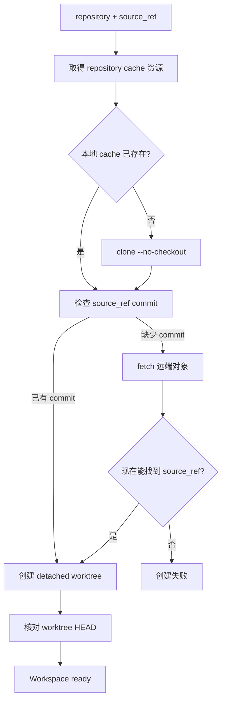

这里的 repository cache 可以被针对同一仓库的多个任务复用，但具体编辑目录属于当前任务。于是“共享 Git 对象”和“独立修改现场”被拆成两层。

### 3.2 repository cache 为什么还要加资源协调

cache 中不仅有 Git 对象，还包含 worktree 管理相关的 Git 元数据。创建、fetch、remove、prune 等操作可能同时触碰这些共享状态。

所以 `CodingWorkspace` 在准备和清理期间，会向 Execution Coordinator 申请一个仓库级写资源，资源键形如 `repository-cache:<repo>`。同一仓库上会改动 cache 元数据的操作需要依次进入，等前一个释放以后后一个再继续。

每个任务拥有独立目录，可以隔离文件内容；资源 claim 进一步保护共享 Git 元数据。两个机制负责不同层次的问题。

## 4. 第三步：把 Coding Agent 的工具绑定到当前 workspace

### 4.1 系统具体怎么做

worktree 创建好以后，Harness 在构造 `InvocationContext` 时，会把当前 `CodingWorkspace.root` 放进 `workspace_root`。Native Provider 后续执行 read、glob、grep、write、edit、delete、bash 等能力时，都能从 invocation context 取得当前任务的工作区根目录。

模型调用文件工具时只提供工作区内的相对路径。Provider 会检查路径是否为绝对路径、是否包含 `..`，随后进行路径解析，再确认解析结果仍然位于当前 workspace 内。这样即使路径中涉及符号链接，最终真实位置仍要经过根目录边界检查。

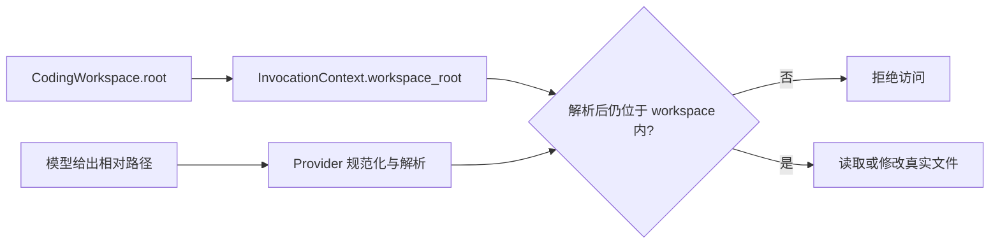

这使 workspace 的归属由 Harness 决定。模型只负责表达“我要操作这个工作区里的哪个相对路径”，不需要在每次工具调用里重新声明任意工作目录。

### 4.2 Bash 的工作目录怎样确定

`native.bash` 同样从 `InvocationContext.workspace_root` 取得 cwd。验证命令因此会在当前 Coding Workspace 中启动，并且只保留一组受限环境变量。

Bash 还有单独的命令策略。Coding profile 会放行经过识别的观察命令和真实验证命令，对 shell chaining、重定向、pipe、subshell 等语法采用更严格的处理。Coding patch 场景里，如果 Bash policy 给出需要额外批准的结果，当前实现会直接拒绝这类命令，避免 patch 阶段绕过既定执行边界。

### 4.3 这套路径边界能保证到什么程度

文件能力可以严格检查最终路径是否仍落在 workspace 根目录下。Bash 的保证范围更窄：Harness 能控制命令分类、启动 cwd 和传入环境，但当前实现没有提供容器、namespace、seccomp 一类操作系统级隔离。

因此，Coding Workspace 适合称为**受管理的 Git 候选工作区**。它能够约束 GitAgent 自己的文件工具并管理工作目录，仍需把 Bash 子进程看作本机进程来理解其安全边界。

## 5. 第四步：每次真实变化怎样推进 workspace revision

### 5.1 revision 表示什么

`CodingWorkspace` 创建时 `revision = 0`。它不表示 Git commit 数量，也不要求每次修改都生成新的 commit。它表示**本次临时工作区在运行时记录中经历了多少轮真实内容变化**。

只要当前候选内容真的发生变化，revision 就会向前推进。这样 Harness 可以区分“验证的是刚才那一版”还是“验证以后代码又变了”。

### 5.2 write、edit、delete 怎样判断有没有真实变化

Native Provider 在执行文件修改后会返回 `changed` 信息。

`write` 会比较写入前后的文本；内容相同则 `changed=false`。`edit` 会比较替换前后的完整文本；新旧内容相同也不会产生真实变化。`delete` 成功删除普通文件后会报告变化。

Execution 把能力结果 Commit 到 `AgentContext` 时，会先处理读取状态：成功的 WRITE/DESTRUCTIVE 能力会清空旧 `read_cache` 和文件读取记录，避免后续继续复用修改前的读取结果。随后，如果这次调用属于当前 Coding Workspace 的文件写入/破坏能力，并且结果里的 `changed` 为真，才调用 `workspace.record_mutation()` 让 revision 加一。

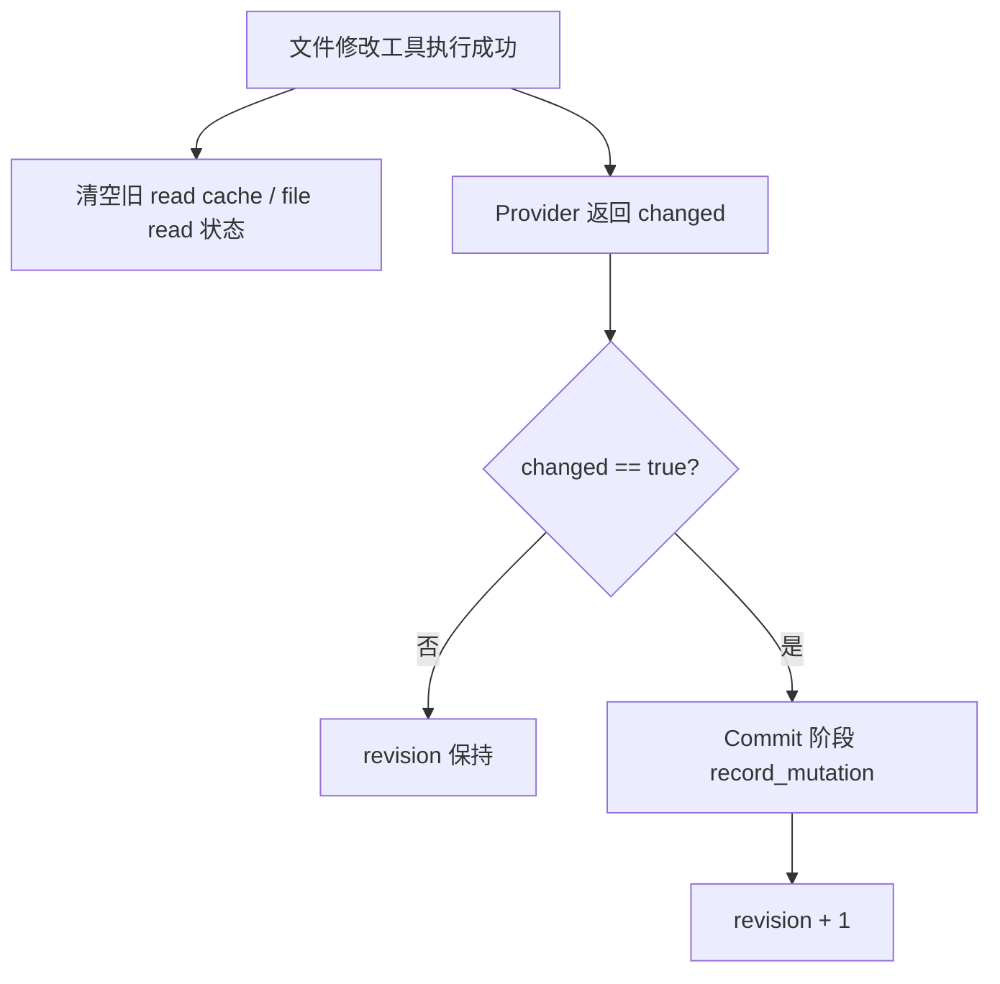

这里把“工具调用成功”“读取缓存需要失效”“候选真的变了”分成三个概念。一次无效果写入会让旧读取缓存失效，但不会制造新的 workspace revision。

### 5.3 Bash 如果改了文件怎么办

真实项目命令也可能产生文件变化。例如某些测试会更新快照，某些格式化或构建命令会生成 Git 可见文件。

为覆盖这种情况，执行 `native.bash` 前，`AgentContext` 会先让 workspace 捕获一份 Git 可见状态；命令结束后再次捕获。如果两份状态不同，Harness 会把它当成一次真实 mutation，revision 同样加一，并清理旧读取缓存。

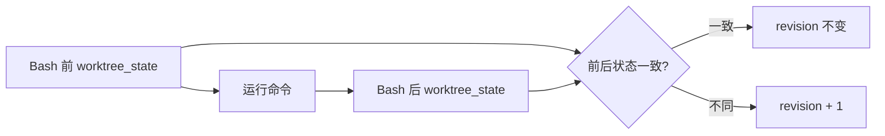

这个细节很重要，因为“代码变化”并不只来自 write/edit/delete 三个文件工具。Harness 关心的是最终 Git 工作树是否发生真实变化。

## 6. 第五步：验证怎样和当前 revision 建立联系

### 6.1 先判断一条 Bash 命令算不算真实验证

Coding Agent 可以运行 Bash，但并非所有成功退出的命令都具有验证价值。Harness 会通过 `BashCommandPolicy.is_real_verification()` 对命令进行分类。

当前 coding profile 能识别的典型验证包括 Python 测试、类型检查、Ruff check、Python 编译检查，Node 包管理器中的 test/lint/typecheck/check/build 脚本，以及 Cargo、Go 中常见的 test/check/build/vet/clippy 等命令。版本查询、帮助信息和普通观察命令不会被当成真实验证。

所以 `echo ok` 即使 exit code 为 0，也不能给候选增加“已经验证”的证据。

### 6.2 一次真实验证执行后记录什么

当命令被识别为真实验证时，Commit 阶段会把结果写入 `AgentContext.observations`，事件类型为 `coding_verification`。

对于正常启动并执行完的验证命令，事件会记录当前 `revision`、命令文本、exit code、stdout 尾部和 stderr 尾部。同时 workspace 会把 `last_validated_revision` 更新为当前 revision。

如果验证命令本身没有成功执行，例如运行环境缺少工具，系统仍然会记录当前 revision 和 `unavailable_reason`，让“验证无法执行”成为显式事实。

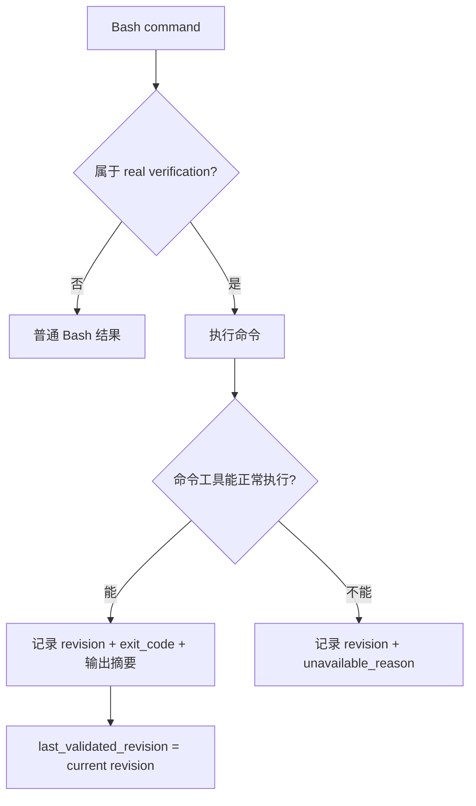

### 6.3 “有验证覆盖”和“验证通过”要分开理解

这是整个模块最关键的概念之一。

| 概念 | 判断依据 | 含义 |
|---|---|---|
| 当前 revision 有验证事件 | observations 中存在相同 revision 的 `coding_verification` | 系统知道针对当前候选尝试过哪项真实验证 |
| 当前 revision 被正常验证命令覆盖 | `last_validated_revision == revision` | 至少有一条真实验证命令完成了执行过程 |
| 某项检查 PASS | 对应验证 exit code 为 0，或确定性检查成功 | 这项具体检查通过 |
| `VerificationReport.passed` | 最终 checks 中没有 FAIL | 这份候选的汇总验证结论通过 |

例如测试命令正常运行后返回 exit code 1，系统仍然知道“revision=3 跑过这条真实测试”；随后生成的 `VerificationCheck` 会标记为 FAIL，`VerificationReport.passed` 也会变成 false。

如果验证工具根本无法启动，事件里会保存 unavailable reason。这样上层看到的是明确失败原因，不会把“缺少验证环境”误解成“测试通过”。

### 6.4 后续修改会怎样影响旧验证

假设 revision=2 时测试通过，然后模型又修改了文件，revision 变为 3。旧事件仍然保留，因为它有审计价值；finalization 在判断当前候选时只把 revision=3 的事件当成当前证据。

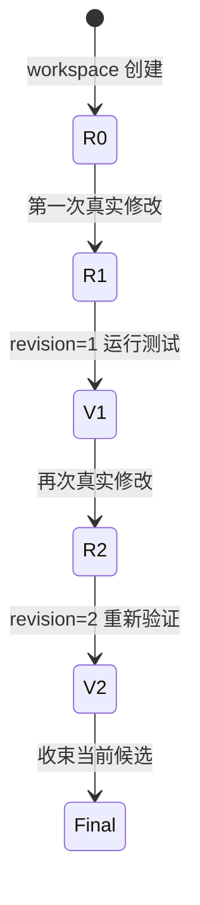

因此，旧验证不会随着后续编辑自动“迁移”到新候选上。

## 7. 第六步：什么时候可以把工作树收束成 CandidatePatch

### 7.1 finish 调用先经过哪些检查

模型认为 patch 已经处理完时，需要单独调用运行时 finish 工具。这个 finish 调用不能和其他结构化调用混在同一条响应里。

Runtime 收到 finish 后，会先读取当前 workspace snapshot。没有任何真实 changed files 时直接拒绝收束。

接着 Runtime 查找当前 revision 的 `coding_verification` 事件。当前 revision 连一条验证事件都没有时，同样拒绝收束。对于已经正常执行的验证命令，还会检查 `last_validated_revision` 是否等于当前 revision。

如果当前 revision 记录的是验证工具不可用，Runtime 会保留这项失败事实，并允许继续生成验证报告。这样候选可以带着明确的失败状态返回上层，由上层决定后续流程。

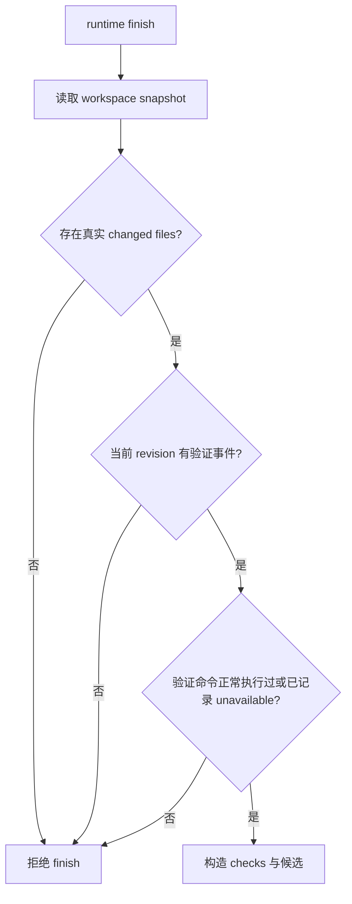

这里的 finish 门槛负责确认“当前候选有真实变化，并且当前 revision 的验证状态已经被记录”。所有检查是否 PASS 会在 `VerificationReport` 中继续表达。

### 7.2 CandidatePatch 怎样从真实 worktree 生成

Workspace 的 `snapshot()` 直接读取 Git 工作树状态。它会分别找出 tracked changes 和 untracked files，再整理出新增、修改、删除文件集合。

对于新增和修改文件，snapshot 还会读取最终文本内容；对于 tracked change，会生成相对 HEAD 的 Git diff；对于 untracked 新文件，会补充对应的新增文件 diff。最后形成完整的 changed files 和 patch 文本。

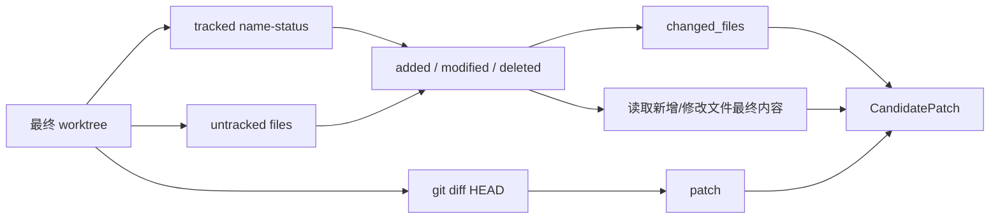

`CandidatePatch` 因此描述的是当前文件系统和 Git diff 的事实。模型之前说自己改了哪些文件，只能作为意图；最终 changed files 由 snapshot 重新计算。

### 7.3 确定性检查在这个时候加入

finalization 还会对 snapshot 中新增和修改后的文件内容执行 `deterministic_code_checks()`。

当前检查覆盖 Python 语法、JSON/TOML/YAML 解析、未解决的 Git 冲突标记，以及尾随空格、Python tab 缩进、超长行等文本卫生问题。

这些检查不会替代项目测试。它们提供一组机器可以稳定判断的基础规则：语法或配置解析错误会形成 FAIL，文本卫生问题通常形成 WARN。

### 7.4 VerificationReport 怎样汇总

Runtime 会把所有记录过的真实验证事件转换成 `VerificationCheck`。当前 revision 的非零 exit code 会成为 FAIL；旧 revision 上已经被后续修改淘汰的失败会降为 WARN，并在 details 中说明已经被后续编辑覆盖。随后再追加确定性检查结果。

`VerificationReport.passed` 的规则很直接：最终 checks 中只要还有 FAIL，passed 就是 false。

这意味着 Coding Workspace 可以整理出一份带失败验证的 CandidatePatch 和 VerificationReport；Domain Agent 收到后会继续执行更高层门槛。例如 Repository、Issue、PR 的 patch 流程都要求 `verification.passed` 为 true 才继续排队远端变更。

这一层分工很重要：Coding Workspace 负责**如实形成候选和验证报告**，Domain Agent 负责**判断这份报告是否足够进入具体业务发布流程**。

### 7.5 finalization 结束时还会做什么

候选和报告构造完成以后，Runtime 会把 snapshot 计算出的 changed files 写回 `ChangeRequest.target_files`，让上层看到最终实际影响范围。

随后临时 worktree 会被 cleanup；`context.coding_workspace` 被清空，`context.code_candidate` 保存 `CandidatePatch`，`context.verification` 保存 `VerificationReport`，并把 coding task 标记为完成。

因此，Coding Agent 完成 patch 后，上层继续依赖的是稳定的领域对象和验证结果，不需要长期持有那块临时目录。

## 8. 把 revision 和验证放在一起看：真正的状态机是什么样

理解这个模块时，可以把 `source_ref` 当成横向不变的起点，把 `revision` 当成任务内部不断向前走的版本号。

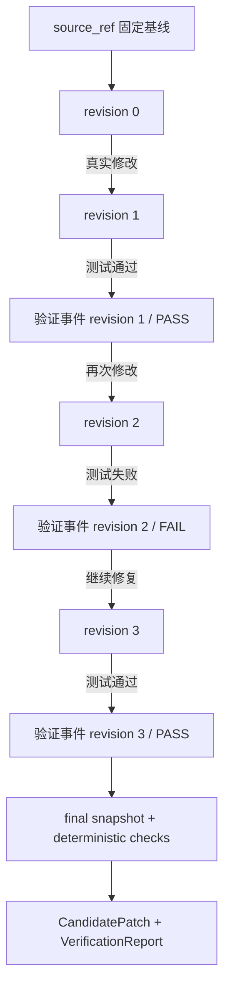

这里有一条很实用的判断方法：

> `source_ref` 回答“从哪一版仓库开始”，`revision` 回答“这次临时工作区现在走到哪一版”，验证事件回答“哪一版执行了什么检查、结果怎样”。

只要把这三个问题分开，Coding Workspace 的设计就会清晰很多。

---

## 9. 用一次完整 patch 串起所有步骤

假设用户要求修复缓存过期判断，并补上对应测试。

| 阶段 | Workspace 状态 | Harness 做的事情 | 此时能得出的结论 |
|---|---|---|---|
| 1. 准备请求 | 尚未创建 | `ChangeRequest` 确定仓库、描述、source_ref | 修改起点已经固定 |
| 2. 创建 workspace | revision=0 | 准备 cache，创建 detached worktree，核对 HEAD | 有一块基于精确 commit 的临时工作区 |
| 3. 读取代码 | revision=0 | read/grep/glob 都绑定当前 workspace | 已找到需要修改的位置 |
| 4. 修改实现 | revision=1 | edit 真实改变文件，Commit 推进 revision | 候选出现第一轮变化 |
| 5. 补测试 | revision=2 | 再次真实修改 | 当前候选已经走到 revision 2 |
| 6. 跑目标测试 | revision=2 | 记录真实验证事件，exit code 非零 | revision 2 的验证失败 |
| 7. 修复实现 | revision=3 | 新 mutation 使旧验证退出当前证据范围 | 需要针对 revision 3 重新验证 |
| 8. 再跑测试和 lint | revision=3 | 记录新的验证事件 | 如果检查全通过，report 可以得到 passed=true |
| 9. finish | revision=3 | snapshot、确定性检查、生成候选与报告 | 得到真实 CandidatePatch 和 VerificationReport |
| 10. 返回上层 | workspace 已清理 | Domain Agent 接收结构化结果 | 可以继续判断是否进入远端变更流程 |

这个例子中最值得记住的地方是：**验证描述的是某个候选版本的证据，它会随着真实修改的出现而需要重新建立。**

---

## 10. 这个模块实际提供了哪些保证

前面已经把实现走完，现在可以把设计能力边界集中整理一下。

| 能力 | 当前实现怎样保证 | 边界 |
|---|---|---|
| 固定修改基线 | `ChangeRequest.source_ref` + worktree HEAD 校验 | SHA 保存在任务上下文链路中，CandidatePatch 本体没有 SHA 字段 |
| 隔离每次修改现场 | 每个任务独立 detached worktree | repository cache 仍属于共享 Git 状态，需要资源 claim |
| 限制文件工具路径 | InvocationContext 绑定 root，Provider 做相对路径与 resolve 检查 | Bash 子进程没有 OS 级 sandbox |
| 识别真实候选变化 | 文件工具 `changed` + Bash 前后 worktree_state 对比 | revision 是运行时计数，并非 Git commit |
| 保持验证新鲜度 | 验证事件记录 revision，后续 mutation 推进 revision | 旧事件保留用于审计，但不能覆盖当前候选 |
| 区分验证尝试与验证通过 | event 记录执行结果，report 根据 FAIL 汇总 passed | 当前 revision 有验证记录仍可能得到 passed=false |
| 生成候选事实 | final snapshot 读取 Git 状态、diff 和最终文件内容 | 上层仍需结合业务语义、人审与远端计划继续处理 |

这张表也解释了为什么本章只叫“Coding Workspace 与验证”。它负责把本地候选做成可检查的结构化事实，远端写入权限和业务审批由下一层继续负责。

---

## 11. 复习时建议按这条主线讲

面试或复习时，不需要从类名开始背。先讲状态流会更容易说明白：

> Domain Agent 先用 `ChangeRequest` 固定 source SHA，Coding Agent 再基于这个 SHA 创建独立 detached worktree。所有文件能力都绑定这块 workspace。每次真实文件变化都会推进 workspace revision，真实验证命令会把结果记录到当时的 revision。后续只要再次修改，旧验证就退出当前证据范围。finish 时 Harness 从真实 Git 工作树重新计算 changed files 和 patch，再加入确定性检查形成 `VerificationReport`。验证通过以后，上层 Domain Agent 才会继续准备远端变更。

如果还要再展开，就按“基线 → workspace → 路径 → revision → verification → snapshot → Domain Agent gate”这个顺序继续讲。

---

## 12. 代码定位

| 想核对的问题 | 主要位置 |
|---|---|
| worktree 创建、cache、snapshot、cleanup、revision 字段 | `gitagent/harness/coding_workspace.py` |
| patch 初始化、finish 门槛、CandidatePatch 与 VerificationReport 构造 | `gitagent/agents/coding.py` |
| revision 推进、Bash 前后状态比较、验证事件记录 | `gitagent/harness/context/state.py` |
| workspace root 注入 InvocationContext | `gitagent/harness/execution.py` |
| 文件路径检查、write/edit/delete 的 changed、Bash cwd | `gitagent/capability/providers/native.py` |
| Bash 命令分类与真实验证识别 | `gitagent/capability/policy.py` |
| 语法、配置和文本卫生的确定性检查 | `gitagent/harness/validation/code.py` |
| ChangeRequest、CandidatePatch、VerificationReport 数据结构 | `gitagent/domain/models.py` |
| 上层对 verification.passed 的发布门槛 | `gitagent/agents/repository.py`、`issues.py`、`pull_requests.py` |

下一章继续看候选离开本地 Coding Workspace 以后发生什么：[CandidatePatch 怎样进入 Mutation Plan，并经过审批真正影响 GitHub](08-approval-and-remote-mutations.md)。
