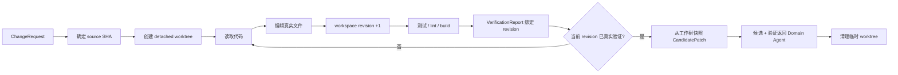
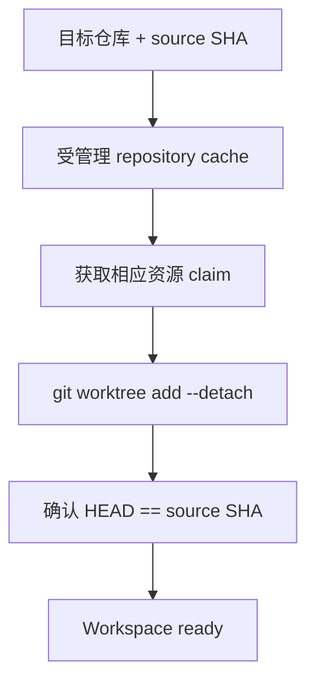
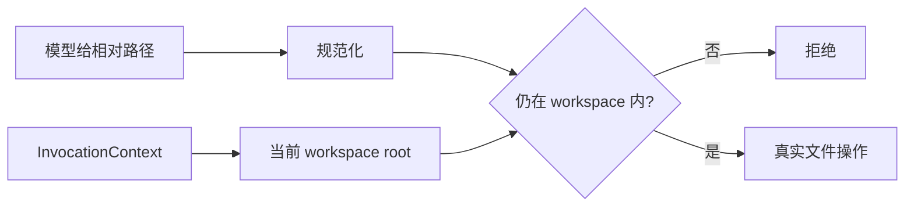
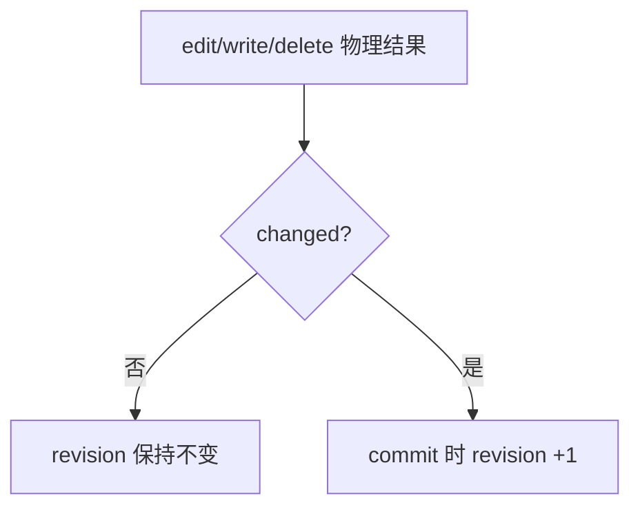
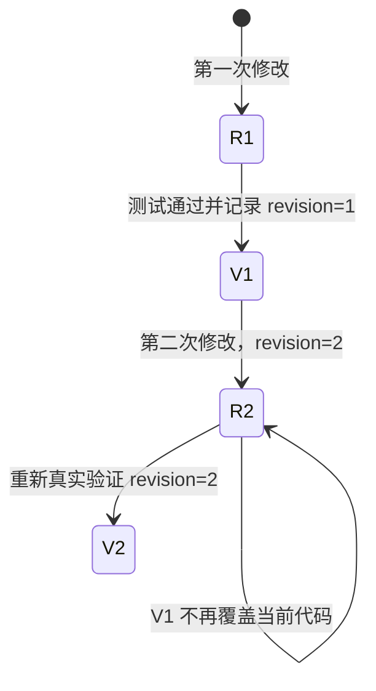
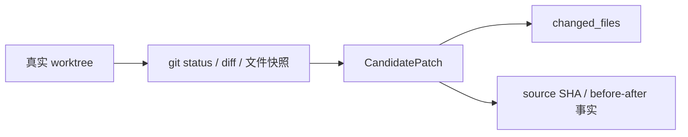
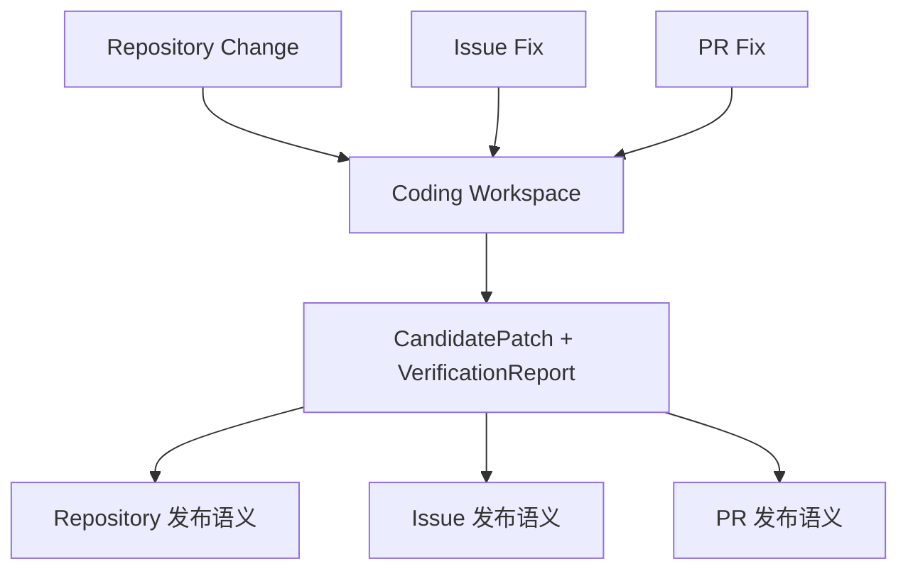

# 07 Coding Workspace 与验证：怎样把模型的修改意图变成可信 CandidatePatch

前一章已经知道 Execution 怎样安全运行本地工具。本章专门看 GitAgent 的代码修改路径：**Coding Agent 在哪里改文件，候选基于哪个版本，怎样记录“工作树已经变了”，验证怎样和某一版代码绑定，最终 CandidatePatch 又怎样从真实文件状态产生。**

本章只负责“本地候选是否可信”。候选怎样获得远端发布资格放到第 08 章。

---

## 1. 先看代码候选的完整生命周期

这条链最重要的是两个绑定：

1. **候选绑定 source SHA**：说明模型是在什么代码版本上工作的；
2. **验证绑定 workspace revision**：说明哪一版修改真正跑过检查。

---

## 2. ChangeRequest 先固定“改什么”和“基于什么”

领域 Agent 在让 Coding Agent 进入 patch 模式前，会形成结构化 `ChangeRequest`。

它不是一段随意 Prompt，而是给修改建立最基本的业务边界：

- 用户目标是什么；
- 目标仓库是什么；
- 当前任务来自 Repository、Issue 还是 PR；
- 候选应该基于哪个精确 source SHA；
- 必要时还携带实体编号、分支等上下文。

如果只有 branch 名而没有精确 SHA，同一个“main”在任务执行期间可能已经指向另一份代码。绑定 SHA 后，后面可以明确说“这份 CandidatePatch 是基于哪一个不可变版本产生的”。

---

## 3. Coding Workspace 怎样创建

进入 patch 模式后，Coding Workspace 会在受管理目录中为当前任务准备一个临时 Git worktree。

实现上会先准备本地仓库缓存/镜像，再基于目标 source SHA 创建 detached worktree。不同任务可以共享只读缓存基础，但每次修改使用自己的工作树目录。

“detached”意味着候选不直接依赖某个本地可移动分支名。创建完成后还会核对工作树 HEAD 是否正是预期 source SHA。

---

## 4. 为什么共享 cache 还需要资源协调

多个并行任务可能针对同一个远端仓库。每个任务拥有独立 worktree，但它们可能共同依赖同一个本地缓存仓库。

缓存准备、fetch 或 worktree 管理并不是完全无冲突的。所以 Workspace 会向 Execution 层声明相应资源，避免两个任务在不安全的位置同时改共享 Git 元数据。

这说明“有独立目录”不等于“所有 Git 操作天然并发安全”。目录隔离和资源协调解决的是两层问题。

---

## 5. 模型看到的是逻辑 workspace，不是任意路径参数

Coding Agent 不应该通过工具参数自行声明“这次去另一个目录执行”。当前 invocation context 已经绑定本次 Coding Workspace。

Native Provider 在处理文件写、edit 和 bash 时，会从当前 invocation context 取得工作区根目录。路径还要经过规范化和边界检查，防止通过 `..`、绝对路径或符号链接把目标跳到受管理根之外。

这让“工作区是谁的”由 Harness 决定，而不是由模型每次调用时重申。

---

## 6. 路径检查解决什么，不能解决什么

路径边界可以阻止文件工具直接访问工作区外的路径，也会检查符号链接解析后的真实位置仍然落在允许根目录。

但它不能提供操作系统级安全隔离。

尤其是 Bash：一个被允许执行的测试进程从受管理工作目录启动，不代表这个子进程在内核层被禁止访问其他路径或网络。当前实现没有因为使用 worktree 和路径校验就自动获得容器、namespace、seccomp 一类 sandbox 保证。

因此文档只把它称为**受管理的候选工作区**，不会把它夸大成完整安全沙箱。

---

## 7. 文件修改怎样推进 workspace revision

Coding Workspace 维护一个 revision 计数。它表示“当前候选内容经历过多少次已经提交到逻辑状态的真实变更”。

关键点是：并不是模型调用了 write/edit 就一定推进 revision。

Provider 会报告这次操作是否实际改变文件；Execution Commit 阶段根据真实结果决定是否记录 mutation。

例如把一个文件替换成和原内容完全相同的内容，`changed = false`，不应该让系统误以为出现了新代码版本。

revision 在 Commit 阶段推进，也保证了并发物理完成顺序不会破坏逻辑修改顺序。

---

## 8. 为什么验证也要绑定 revision

假设模型：

1. 修改代码；
2. 跑测试，测试通过；
3. 又修改代码；
4. 直接说“完成”。

如果系统只保存一个 `tests_passed = true`，第三步之后仍然会保留旧绿色标志，看起来新代码也通过了测试。

GitAgent 的 VerificationReport 会绑定运行验证时的 workspace revision。

因此“通过过测试”和“当前候选通过测试”是两个不同结论。

---

## 9. 什么才算真实验证

Coding patch 需要的不是任意 shell 成功，而是能反映项目行为的验证。

常见真实检查包括：

- 项目测试；
- lint；
- type check；
- build；
- 项目定义的验证脚本。

Bash command policy 会判断命令是否属于允许的验证形式。单纯 `echo ok`、查看版本号或纯只读命令不能冒充代码验证。

此外 Harness 会记录每项 VerificationCheck 的命令、结果和必要摘要，让上层知道候选经过了什么，而不是只收到一个模糊的“已验证”。

---

## 10. Deterministic Code Checks 在哪里发挥作用

真实项目命令由模型选择并执行，但 Harness 还可以执行确定性的代码检查，对候选是否满足基本结构要求做补充判断。

模型判断和确定性检查的角色不同：

- 模型适合选择与当前改动相关的测试，并理解输出；
- 确定性检查适合验证明确机器规则。

最终 VerificationReport 可以汇总这些证据，但不会因为模型说“应该没问题”就生成成功检查。

---

## 11. CandidatePatch 为什么从真实工作树生成

Coding Agent 最终不能自己填写一份“我改了 A 和 B”的 CandidatePatch 作为权威。

Workspace 会读取 Git 工作树当前状态，比较 source SHA，计算真正的 changed files、文件内容和相关差异，再形成 CandidatePatch。

这样候选对象描述的是文件系统事实，而不是模型自述。

如果模型声称改了三个文件，但实际只变了两个，CandidatePatch 以真实工作树为准。

---

## 12. patch 最终提交前有哪些门槛

Coding Agent 想结束 patch 任务时，会检查当前状态是否满足候选要求。核心逻辑可以理解为：

1. Workspace 已准备，且基于正确 source SHA；
2. 实际存在用户要求的有效修改；
3. CandidatePatch 能从真实工作树构造；
4. 当前 workspace revision 有真实 VerificationReport 覆盖；
5. 必要结构化结果完整。

如果当前 revision 未验证，Agent 不能靠一段自然语言直接跳过。它需要继续执行验证，或明确返回不能完成的状态。

---

## 13. 候选形成后为什么可以清理 worktree

上层 Domain Agent 后续真正需要的是稳定 CandidatePatch、VerificationReport、source SHA 和业务上下文，而不是一直保留某个临时目录。

因此 patch 完成后，Coding Workspace 可以清理 worktree。远端发布阶段使用候选对象中的确定内容重新执行对应能力。

这降低了长 Session 累积临时目录和本地分支状态的风险。

当然，如果任务中途失败，清理逻辑也要尽量收束未完成 workspace。持久恢复并不是试图让一个临时 worktree 永久存在；第 09 章会说明受支持的恢复边界。

---

## 14. Repository、Issue、PR 为什么共享同一候选构造方式

三个领域的发布语义不同，但“如何证明这份代码候选是基于某个版本真实产生、且当前 revision 被验证”是同一个技术问题。

所以它们都把 patch 交给 Coding Agent / Coding Workspace，拿回相同类型的 CandidatePatch 和 VerificationReport。

这让“候选正确性”和“发布业务规则”解耦：本章只处理前者，第 08 章处理后者。

---

## 15. 一次实际 patch 的状态变化

假设用户要求把缓存过期判断修正并补测试。

**准备阶段**：Repository Agent 形成 ChangeRequest，固定 source SHA。Coding Workspace 基于该 SHA 创建 detached worktree。

**读取阶段**：Coding Agent 定位实现和测试，读取必要范围。此时 revision 仍为 0。

**第一次修改**：edit 改实现，物理结果 `changed=true`；Commit 后 revision 变为 1。

**第二次修改**：write/edit 补测试；Commit 后 revision 变为 2。

**第一次验证**：运行目标测试，失败。VerificationReport 记录 revision=2 的失败检查。Agent 继续。

**第三次修改**：修正实现，revision 变为 3。之前 revision=2 的任何验证都不能覆盖新候选。

**第二次验证**：测试和 lint 在 revision=3 通过。

**候选收束**：Workspace 从真实文件系统构造 CandidatePatch，确认 changed files 与 source SHA；VerificationReport 覆盖 revision=3。Coding Agent 可以完成。

这个例子最值得记住的是：**测试不是“任务属性”，而是某一版工作树的证据。**

---

## 16. STAR 复盘：为什么先构造本地候选，再考虑远端写入

### S — Situation

模型修改代码时容易出现版本漂移、路径误写、声称修改但文件没变、测试通过后又继续修改等问题。如果直接把模型生成的 patch 文本或文件内容推到远端，系统很难证明发布的究竟是哪一版代码。

### T — Task

需要建立一条从精确来源版本到真实工作树、真实修改、真实验证再到稳定候选的证据链，同时把代码构造和 GitHub 发布分开。

### A — Action

GitAgent 用 ChangeRequest 固定 source SHA，用 detached worktree 隔离候选；文件能力绑定当前 workspace 并做路径校验；真实 mutation 在 Commit 时推进 revision；VerificationReport 绑定 revision；最终 CandidatePatch 从实际 Git 工作树生成，而不是由模型自报；满足门槛后清理临时 workspace。

### R — Result

Domain Agent 拿到的是一个有明确来源和验证依据的候选对象，可以在不同业务场景下安全地继续生成发布计划。代价是需要维护 Git cache、worktree、revision 和验证状态，并增加本地磁盘与 Git 操作。

核心结果是：**模型负责提出和实施修改，但“最终到底改成什么、哪一版验证过”由真实工作树和 Harness 决定。**

---

## 17. 这一章最容易混淆的地方

| 误解 | 正确理解 |
|---|---|
| worktree 是完整安全沙箱 | 不是，只是受管理的 Git 候选工作区 |
| 跑过一次测试就可以一直沿用 | 不是，验证绑定具体 workspace revision |
| 模型说 changed files 是 A/B/C 就以它为准 | 不是，CandidatePatch 来自真实 worktree |
| 调用 edit 就一定增加 revision | 不是，只有实际 changed=true 的 mutation 在 Commit 时推进 |
| Coding Agent 完成 patch 就已经写入 GitHub | 不是，此时只形成本地候选 |

---

## 18. 复习时怎样讲这一章

推荐围绕两个版本号讲：

> source SHA 固定“从哪一版代码开始”，workspace revision 固定“当前候选改到了第几版”。每次真实修改推进 revision，每次验证绑定 revision；最终 CandidatePatch 从真实 worktree 生成。只有当前 revision 被真实验证，候选才能交给上层考虑发布。

## 19. 代码定位

| 想核对的问题 | 主要位置 |
|---|---|
| worktree 创建、快照与清理 | `gitagent/harness/coding_workspace.py` |
| Coding patch 状态机 | `gitagent/agents/coding.py` |
| Native 文件写/edit/bash | `gitagent/capability/providers/native.py` |
| 文件与 Bash 权限策略 | `gitagent/capability/policy.py` |
| 确定性代码检查 | `gitagent/harness/validation/code.py` |
| ChangeRequest / CandidatePatch / VerificationReport | `gitagent/domain/models.py` |

下一章接着回答候选之后的问题：[一份 CandidatePatch 怎样变成精确 Mutation Plan，并经过用户审批真正影响 GitHub](08-approval-and-remote-mutations.md)。
