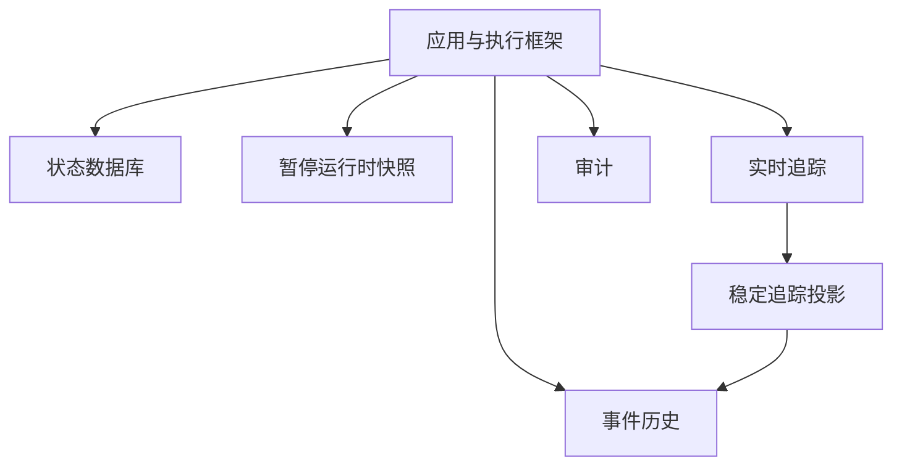
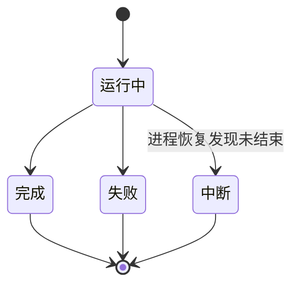
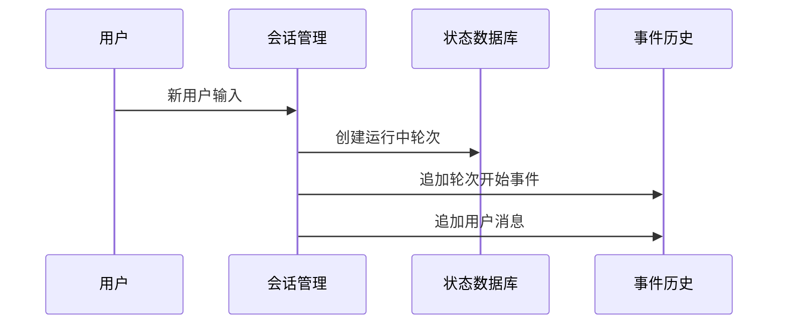
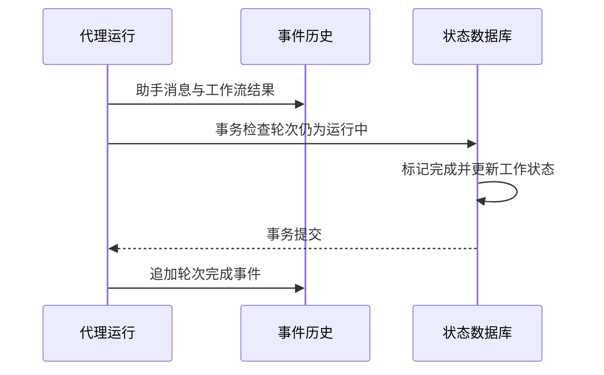
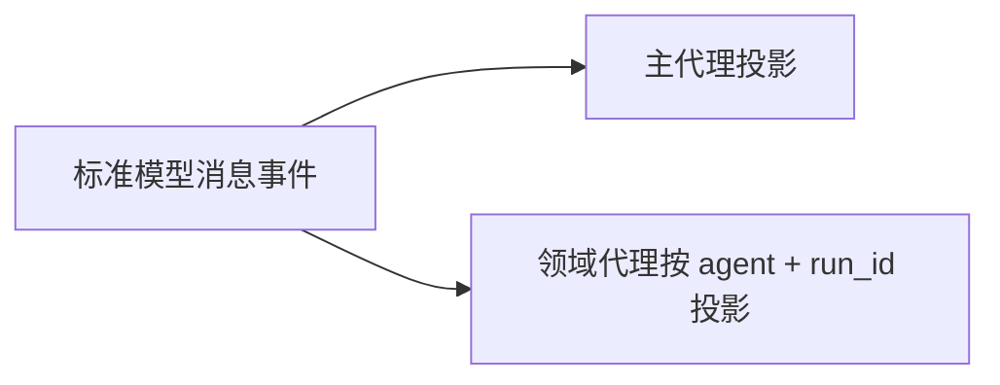
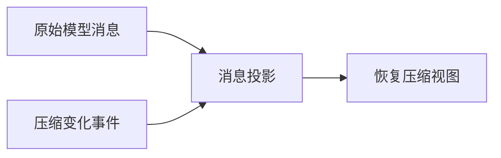
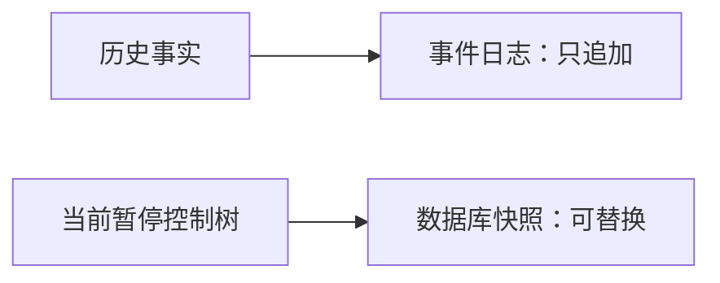
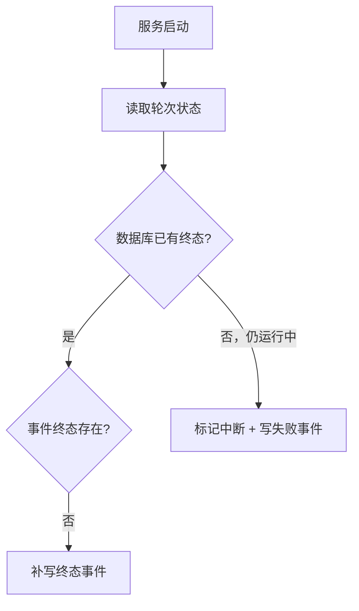
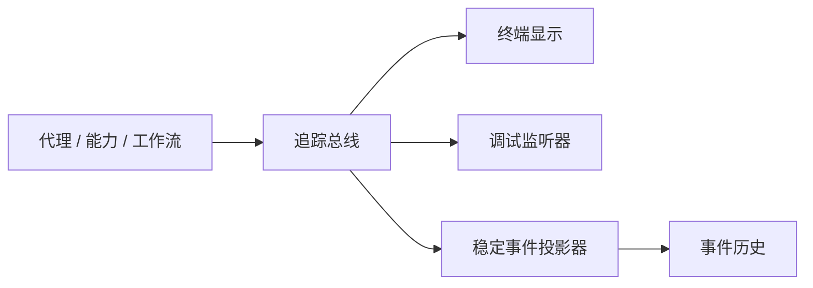

# 07 持久化、事件历史与可观测：既要知道“现在是什么”，也要知道“发生过什么”

## 本章先回答什么

GitAgent 运行时会产生很多状态：会话当前做到哪、这一轮是否完成、模型看过哪些消息、审批停在哪里、长期记忆处理到哪、某个能力为什么失败。

如果只存数据库终态，无法重建模型历史；如果只存消息，无法恢复审批和子代理控制状态；如果把实时日志当成持久状态，又会让界面文案和调试细节变成业务真相。

所以这一章要讲清楚：**GitAgent 为什么同时需要状态数据库、追加式事件历史、暂停快照、实时追踪和审计，它们怎样分工，又怎样在进程重启后重新拼起来。**

### 本章的 STAR 主线

| 阶段 | 本章要解决的问题 |
|---|---|
| 情境 S | 当前状态、历史事实、暂停控制点和实时调试信息具有不同读写方式，不能塞进一种存储 |
| 任务 T | 为每类数据指定唯一权威边界，并让跨文件中断能够被保守修复 |
| 行动 A | 业务轮次写状态库和事件历史 → 模型消息持续追加 → 等待时写暂停快照 → 追踪投影稳定事件 → 启动时修复终态与坏尾部 |
| 结果 R | 当前状态可查询、模型历史可重放、等待状态可恢复、实时执行可观察，同时避免多份互相冲突的真相 |

---

## 1. 情境：为什么一种存储不够

先看几类问题分别需要什么数据结构。

| 问题 | 最合适的数据形态 |
|---|---|
| 这一轮现在是运行中还是完成 | 可查询状态表 |
| 模型按什么顺序看过哪些消息 | 追加式事件历史 |
| 当前审批停在哪个调用 | 可更新的暂停快照 |
| 终端要实时显示“正在读取文件” | 实时追踪流 |
| 哪个代理调用了哪项写能力 | 审计记录 |

如果全部写进一张大表，消息重放会很笨重；如果全部写 JSONL，查询“当前未完成轮次”又很低效。

GitAgent 选择让不同数据结构承担自己擅长的职责。

---

## 2. 任务：五层状态各自是什么权威



| 层 | 权威回答的问题 |
|---|---|
| 状态数据库 | 当前会话、轮次、工作状态和维护进度是什么 |
| 事件历史 | 按顺序发生了什么，模型消息是什么 |
| 暂停快照 | 等待中的代理树停在哪个控制点 |
| 实时追踪 | 当前执行过程正在发生什么 |
| 审计 | 哪个代理对哪项能力做了什么 |

这五层有数据交叉，但不互相替代。

---

## 3. 为什么会话身份不直接用仓库名称

仓库名称会变，GitHub 服务地址也可能不同。

GitAgent 用稳定身份构造会话范围：

- 账户身份：服务地址 + 认证用户数字编号；
- 仓库身份：服务地址 + 仓库数字编号；
- 再加会话编号。

仓库全名保留为展示字段。

| 方案 | 风险 |
|---|---|
| 用 `owner/repo` 当永久主键 | 仓库改名后历史身份变化 |
| 用数字编号但不带服务地址 | 不同 GitHub 服务可能冲突 |
| 服务地址 + 数字编号 | 身份稳定且来源明确 |

持久化从一开始就把“展示名称”和“稳定身份”分开。

---

## 4. 状态数据库里为什么既有会话，又有轮次

会话和轮次解决不同粒度的问题。

### 会话

保存跨多个用户输入持续存在的信息：

- 标题；
- 当前仓库；
- 工作状态；
- 摘要与上下文边界；
- 暂停代理快照。

### 轮次

每次用户输入创建一个单调编号，状态从运行中走向完成、失败或中断。



轮次是业务提交单元。会话是多个业务轮次共享的长期容器。

---

## 5. 会话工作状态和暂停代理快照为什么不是一回事

这两个字段都挂在会话上，但生命周期不同。

| 状态 | 例子 | 任务完成后是否保留 |
|---|---|---|
| 工作状态 | 当前目标、焦点、实体清单、未解决问题 | 可以保留 |
| 暂停代理快照 | 待审批调用、活跃子代理、未提交结果 | 运行结束后清空 |

工作状态描述“这段工作长期关注什么”。

暂停快照描述“当前代理执行停在哪”。

把两者分开后，运行时恢复不会把应用层工作摘要和代理内部状态混成一份 JSON。

---

## 6. 状态数据库为什么不是裸 SQLite 连接

持久化层还负责文件安全、事务和数据清洗。

数据库路径必须是绝对路径。POSIX 环境下会检查：

- 父目录和数据库文件不是符号链接；
- 当前用户拥有这些路径；
- 目录和文件权限受限；
- 数据库确实是普通文件。

写事务使用立即事务，异常时回滚。读连接使用只读模式。

这说明“数据库文件在哪里、谁能替换它”也是状态安全的一部分。

---

## 7. 为什么数据库启动时还要验证结构本身

GitAgent 不满足于“表存在就能跑”。

启动时会检查：

- 数据库完整性；
- 表集合；
- 每张表的建表结构；
- 索引集合和定义；
- 结构版本；
- 外键；
- 是否存在额外触发器或视图。

已知旧版本只有在完全符合预期旧结构时才迁移。

为什么这么严格？

因为持久状态会参与审批恢复和代理树恢复。未知触发器或字段语义可能改变写入行为，系统不能把“能打开数据库”当成“状态契约可信”。

---

## 8. 为什么所有数据库写入都经过敏感信息边界

状态里可能包含模型输出、错误文本、工具参数和业务对象。凭据可能意外混入这些字符串。

存储层在最终 SQL 写边界统一清洗。

它会识别：

- 配置中的已知密钥值；
- 常见令牌形式；
- 私钥文本；
- `api_key`、`access_token`、`secret`、`password` 等字段。

普通状态写入会脱敏。长期记忆等更严格入口可以选择发现密钥就拒绝保存。

这比让每个业务模块自己记得“写库前脱敏”更可靠。

---

## 9. 为什么状态对象还要有字节边界

模型生成内容没有天然大小上限。

状态存储会限制文本和 JSON 大小，也拒绝非有限浮点值。

| 边界 | 作用 |
|---|---|
| 文本字符 / 字节上限 | 防止单字段无限膨胀 |
| JSON 总字节上限 | 控制暂停快照和工作状态规模 |
| JSON 类型校验 | 保证恢复后得到稳定数据类型 |
| 非有限数字拒绝 | 保证序列化一致 |

持久化边界不是“什么都能塞进去”，而是有明确数据契约。

---

## 10. 一轮用户输入怎样同时进入数据库和事件历史

创建业务轮次时，两个存储各做一件事。



数据库回答“现在有一个运行中的第 N 轮”。

事件历史回答“第 N 轮开始了，用户说了什么”。

两边记录的是同一个业务时刻的不同视角。

---

## 11. 一轮成功时，为什么不能只写一个“完成”状态

业务执行成功后，持久化链条还有多个动作。



为什么完成标记放在最后？

因为事件历史和数据库不是一个跨文件事务。系统需要让“业务终态”和“历史终态”都有明确恢复规则。

如果数据库已经完成、事件终止标记没写进去，启动修复可以根据数据库补。

---

## 12. 失败轮次为什么也必须成为正式业务终态

失败不是 stderr 里的日志。

数据库会把轮次标记为失败并记录结束时间，事件历史追加失败事件和有界错误信息。

这样后续系统能区分：

- 正常完成；
- 明确失败；
- 因进程退出而中断。

这三种状态在恢复和用户解释上含义不同。

---

## 13. 为什么模型消息还要作为标准事件单独保存

实时追踪也会描述工具调用，但追踪不适合作为模型消息权威来源。

GitAgent 将进入代理消息线程的标准模型消息单独写入事件历史。

领域代理消息还带：

- 代理名称；
- `run_id`；
- 所属轮次。



这样同一会话里多次调用仓库代理，也能重建各自独立消息线程。

---

## 14. 事件历史为什么选择追加式 JSONL

追加式事件文件有几个适合代理历史的特点。

| 特点 | 价值 |
|---|---|
| 只追加，不原地改旧事件 | 历史顺序容易推理 |
| 每行一个事件 | 进程中断容易发现半写尾部 |
| 事件有单调编号 | 可以检测缺口和乱序 |
| 可记录消息和压缩变化 | 适合重放模型视图 |
| 每个会话独立文件 | 会话隔离和回收简单 |

它不是数据库备份，而是一条“发生过什么”的时间线。

---

## 15. 事件编号和业务轮次编号为什么分开

一轮用户输入可能产生很多事件：用户消息、模型消息、工具结果、审批等待、领域结果、完成标记。

所以：

```text
事件编号 = 会话内所有事件的全序
轮次编号 = 这些事件属于哪次用户交互
```

一个轮次对应多个事件。

分开以后，系统既能按会话事件顺序重放，也能按轮次聚合业务结果。

---

## 16. 事件写入为什么也需要路径和内容安全

事件文件里可能出现代码、工具参数和模型回答。

写入前会处理：

- 事件结构校验；
- 内容脱敏；
- 不同事件类型的字段边界；
- 单事件最大字节；
- 文件锁；
- 单调事件编号；
- 刷新和文件同步；
- 路径所有权和符号链接检查。

“日志”并不意味着可以降低持久化安全标准。

---

## 17. 进程写到一半退出时，为什么只修复坏尾部

JSONL 最后一个事件可能只写了一半。

读取时系统验证每行完整性和事件编号连续性。

| 损坏位置 | 处理 |
|---|---|
| 最后一行不完整 | 保留完整前缀，可在下次写入前截断 |
| 中间一行不完整或非法 | 报错，不跳过 |

原因是完整前缀可以证明。中间缺一条事件后，后面的工具协议和状态可能已经失去来源。

GitAgent 只修复能够确定属于“最后一次写入被中断”的损坏。

---

## 18. 上下文压缩为什么也必须成为事件

压缩改变模型之后看到的历史视图。

如果只在内存里压缩，进程恢复后重放原始消息，模型上下文会回到未压缩状态。

所以事件历史还保存压缩变化：

- 哪些工具结果被替换；
- 生成了什么检查点；
- 哪些原消息继续保留。



原始事实仍在，模型视图变化也能重放。

---

## 19. 为什么暂停运行时不能也写成追加事件

代理等待审批时，整棵控制树中有很多“当前值”：待审批计划、活跃子代理、未提交结果、读取缓存。

这些状态会在下一轮恢复后被更新或清空。

追加事件适合记录历史事实，但读取“当前暂停树”会很麻烦。

所以暂停状态放在数据库会话记录中，作为一份可替换快照。



两种数据使用不同更新模型。

---

## 20. 暂停快照为什么明确禁止保存消息

消息已经有事件历史作为权威来源。

如果暂停快照也保存消息，就会出现两份可变副本。

所以快照只保存：

- 代理身份和父子关系；
- 步数；
- 观察状态；
- 审批与用户输入等待；
- 活跃子代理；
- 未提交能力结果；
- 候选补丁、验证报告等业务产物；
- 读取缓存和文件覆盖。

恢复时消息从事件历史来，控制状态从快照来。

---

## 21. 为什么恢复暂停快照还要重新验证

持久化并不自动意味着可信。

应用服务重建代理树时会重新检查：

- 根代理类型；
- 父子拓扑；
- 仓库身份；
- 父 `call_id`；
- 待用户输入对应的原调用；
- 未提交结果和原参数；
- 待审批写计划与当前结构化产物。

写计划尤其会重新计算再比较。

这保证“持久化恢复”不会比“第一次执行”拥有更宽松的安全边界。

---

## 22. 启动时怎样修复数据库和事件历史之间的短暂不一致

数据库和事件文件不在一个原子事务里，所以进程可能停在二者之间。

启动恢复主要处理两类情况。

### 数据库已经有业务终态，事件历史缺终止标记

系统根据数据库状态补写完成或失败事件。

### 数据库仍然显示轮次运行中

系统把它改成中断，并写一条恢复失败事件。



系统不会用普通助手消息猜测轮次是不是已经成功。

数据库承担业务终态权威。

---

## 23. 实时追踪为什么单独存在

事件历史适合重放，不适合直接驱动终端界面的细粒度进度。

追踪总线用于实时发布：

- 代理开始和结束；
- 能力调用；
- 审批等待；
- 重试和恢复；
- 失败、拒绝、取消；
- 工作流进度。



实时追踪和持久事件共享来源，但不共享全部字段。

---

## 24. 为什么界面显示文案不能直接成为持久历史

追踪事件区分稳定信息和界面显示文案。

界面文案会为了可读性变化，例如“正在检查…”、“正在读取…”。

如果这些文字直接进入业务历史，改一个终端文案就会改变持久化语义。

所以持久追踪投影只保存稳定字段。

| 字段 | 用途 | 是否适合持久化 |
|---|---|---|
| 稳定事件名称 | 机器和调试语义 | 是 |
| 结构化细节 | 恢复与调试 | 选择性保存 |
| 界面显示文案 | 用户体验 | 否 |

界面和事实历史因此解耦。

---

## 25. 为什么终端监听器崩了不能让业务失败

终端渲染是旁路消费者。

一个追踪监听器抛异常时，系统不能让正在进行的 GitHub 写入或代理运行因此失败。

普通监听器异常会被隔离。

持久追踪投影器则不同，它承担稳定历史写入职责，不只是界面插件。

这两个消费者虽然都订阅追踪事件，但可靠性等级不同。

---

## 26. 为什么追踪不能复制完整能力输入输出

能力调用可能携带：

- 大量代码；
- 搜索全文；
- 任务日志；
- 长期记忆正文；
- 潜在敏感信息。

追踪需要的是解释运行，而不是保存业务数据副本。

所以检索能力只记录查询长度、命中数量和文档标识；长期记忆读取只记录页面位置；错误输出也会截成有界尾部。

可观测系统本身也遵守最小化原则。

---

## 27. 审计和追踪为什么还要分开

追踪回答“系统怎样运行”。

审计回答“谁对什么能力做了什么”。

| 维度 | 追踪 | 审计 |
|---|---|---|
| 重点 | 执行过程和状态变化 | 行为主体、能力、访问级别、审批和结果 |
| 消费者 | 终端、调试、持久事件投影 | 安全与行为复盘 |
| 顺序 | 实时事件顺序 | 有序提交顺序 |

审计在能力结果提交阶段记录，所以不会按线程完成顺序乱序。

当前审计主要是进程内记录；需要跨进程保留的稳定事实进入事件历史。

---

## 28. 事件历史回收为什么需要数据库配合

旧会话事件文件可以按保留时间回收。

但回收器不能仅根据文件修改时间删除。

它先从数据库获取当前存在的会话范围，排除活跃会话，再只处理受管理目录中的合法事件文件。

删除时仍执行路径和符号链接检查。

这说明回收不是“日志目录清理脚本”，而是持久化生命周期的一部分。

---

## 29. 用一次等待审批把整章串起来

用户要求修改仓库。

### 第一步：创建业务轮次

数据库记录运行中轮次，事件历史记录用户消息。

### 第二步：代理运行

模型消息和工具结果作为标准事件持续追加；实时能力过程通过追踪总线显示。

### 第三步：生成候选并进入审批

代理树进入等待。应用服务把控制状态写入暂停快照。消息不复制进去。

### 第四步：进程退出

事件历史和暂停快照仍在磁盘。

### 第五步：服务重启

先修复中断轮次和事件坏尾部，再从事件历史投影消息，从快照恢复控制状态，并重新验证审批计划。

### 第六步：用户批准

原代理树继续运行，新的模型和能力事件继续追加。任务完成后数据库写入轮次终态，暂停快照清空，事件历史追加完成标记。

这条流程解释了五层状态为什么必须分工。

---

## 30. 结果：持久化和可观测系统最终保证了什么

| 设计 | 得到的结果 |
|---|---|
| 数据库保存当前状态 | 会话、轮次和维护进度易于查询 |
| 事件历史只追加 | 模型和工作流历史可重放 |
| 暂停快照独立保存控制树 | 审批和用户输入可以跨进程恢复 |
| 消息只在事件历史持久化 | 不存在两份消息真相 |
| 启动修复使用数据库终态 | 跨文件中断有明确权威依据 |
| 事件只修复坏尾部 | 不伪造中间历史 |
| 追踪和界面解耦 | UI 故障和文案变化不污染业务 |
| 稳定追踪投影 | 实时事件可以选择性进入持久历史 |
| 审计跟随有序提交 | 行为记录顺序和代理实际状态一致 |

代价是系统维护多种状态载体，也需要明确它们之间的权威关系。

GitAgent 接受这部分复杂度，因为它换来的是：**进程可以退出，界面可以失败，消息可以压缩，但系统仍知道什么是当前状态、什么是历史事实、什么只是实时观察。**

---

## 31. 复习时怎样讲这一章

可以按下面顺序复述：

1. GitAgent 先区分当前状态、历史事实、暂停控制和实时观察，所以不能只用一种存储；
2. 数据库保存会话、轮次、工作状态、记忆游标，事件历史保存模型消息和按序事件；
3. 暂停代理树单独放在数据库快照里，明确不复制消息；
4. 一轮开始和结束会同时更新数据库和事件历史，两者不是跨文件事务，所以启动时要修复终态缺口；
5. JSONL 只修复最后一条半写事件，中间损坏直接报错；
6. 上下文压缩变化也作为事件保存，用于恢复模型实际视图；
7. 实时追踪负责终端和调试，界面文案不进入持久历史；
8. 审计在有序提交阶段记录，使行为顺序和代理状态一致。

## 32. 代码定位

| 想核对的问题 | 代码位置 |
|---|---|
| 数据库路径、事务、脱敏和结构校验 | `gitagent/infra/persistence/store.py` |
| 会话、轮次、暂停快照和记忆游标 | `gitagent/infra/persistence/sessions.py` |
| 追加式事件、坏尾部和回收 | `gitagent/infra/persistence/event_log.py` |
| 模型消息和压缩事件怎样投影 | `gitagent/harness/context/projector.py` |
| 实时追踪事件和监听器 | `gitagent/infra/observability/trace.py` |
| 能力审计 | `gitagent/infra/observability/audit.py` |
| 应用服务怎样组合消息和暂停状态 | `gitagent/application/service.py` |
