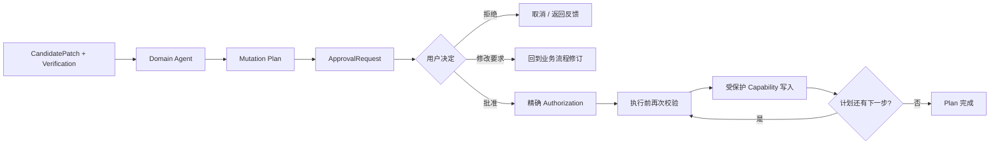
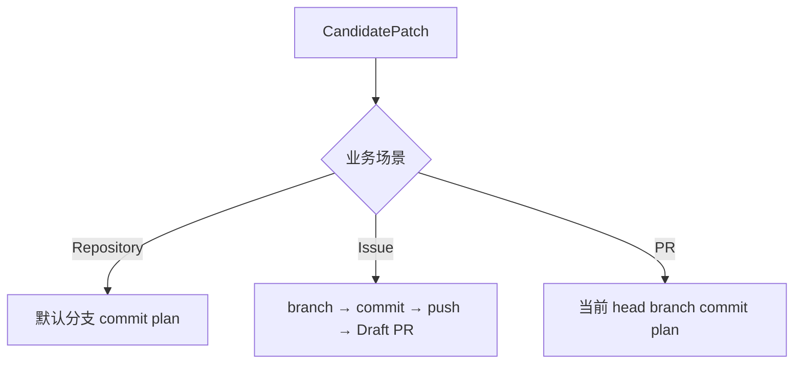
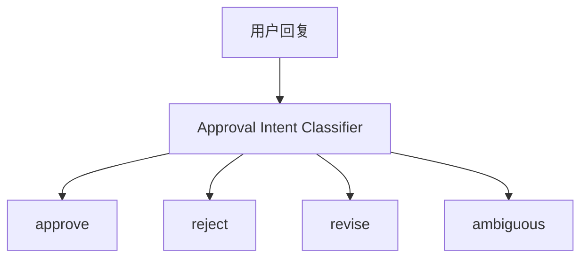
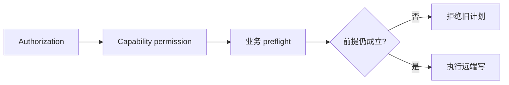
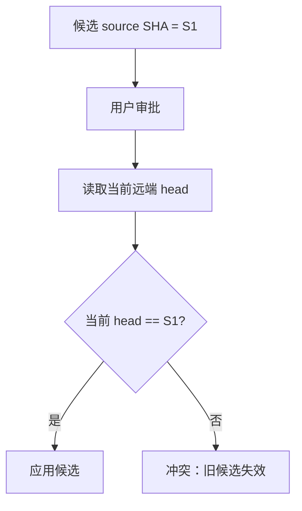
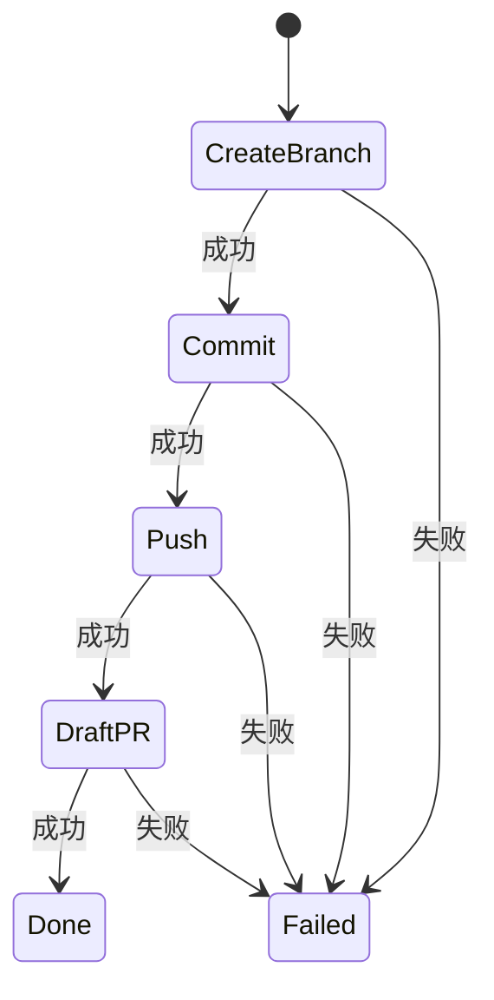
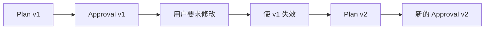
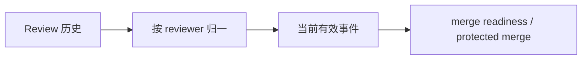
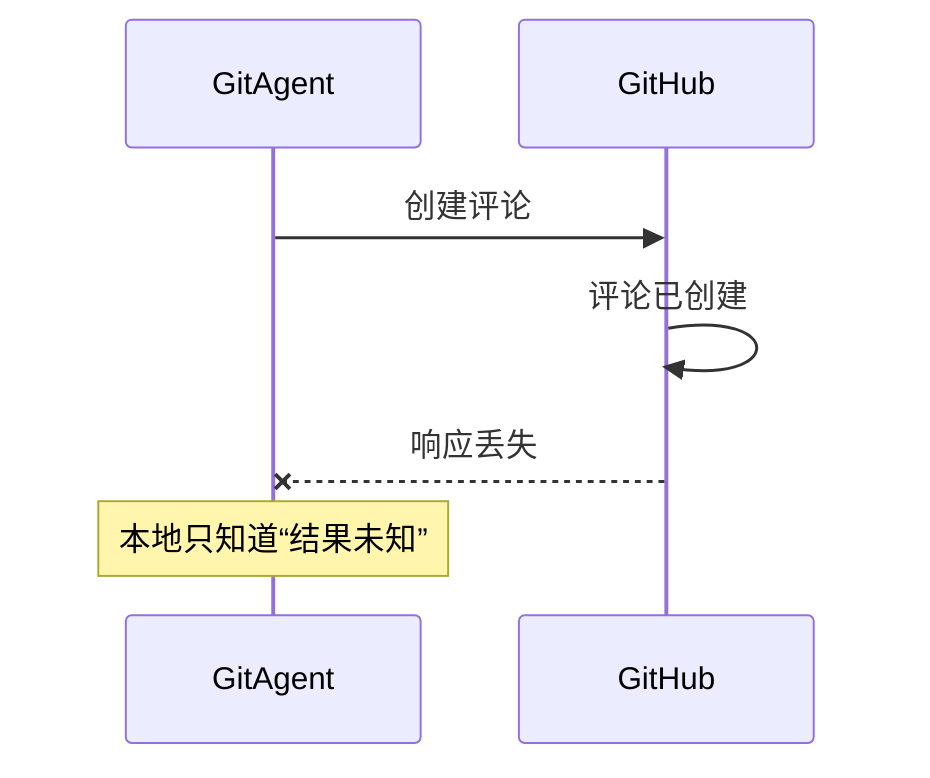

# 08 Approval 与远端 Mutation：候选怎样获得真正影响 GitHub 的资格

上一章停在 CandidatePatch：代码已经在本地真实修改并验证，但还没有影响 GitHub。本章继续这条链：**不同业务场景怎样把候选转换成 Mutation Plan，用户到底批准的是什么，批准以后为什么还要重新检查远端状态，多个步骤又怎样按精确顺序消费授权。**

本章只讲“从候选到远端副作用”。持久化等待和重启恢复放到第 09 章。

---

## 1. 先看远端写入资格链

这条链里最值得先记住的是：

**CandidatePatch 说明“代码候选是什么”；Mutation Plan 说明“准备怎样影响远端”；Approval 说明“用户精确授权哪一组动作”。**

三者是不同对象，不能互相代替。

---

## 2. Domain Agent 怎样把候选转换成 Mutation Plan

同一份代码候选在不同业务里应该采用不同发布方式，因此 Mutation Plan 由 Domain Agent 构造，而不是 Coding Agent。

### Repository 修改

普通仓库修改可以形成“对默认分支提交候选”的计划，但必须绑定创建候选时观察到的默认分支 head SHA。

### Issue 修复

Issue 修复通常不直接修改默认分支，而是形成：

1. 创建修复分支；
2. 把 CandidatePatch 提交到该分支；
3. 发布/推送分支；
4. 创建 Draft PR。

### PR 内修复

PR patch 绑定当前 PR 的 head branch 和原始 head SHA，候选准备提交到当前 PR 分支。

因此 CandidatePatch 本身不携带“应该发布到哪里”的最终决定。发布语义属于业务层。

---

## 3. Mutation Plan 不是一段给用户看的自然语言

计划会包含一组结构化的 `PlannedCapabilityCall`。每一步都有稳定 capability id 和规范化参数。

例如 Issue 修复的计划不是简单写“创建分支并提 PR”，而是把每项具体动作拆成明确调用和顺序。展示给用户的 Approval Summary 可以用更友好的文字，但真正授权仍然指向结构化计划。

这样运行时才能回答：

- 用户批准的是哪项 capability；
- 参数是不是同一组；
- 当前要执行的是第几步；
- 是否有人在等待期间悄悄改了计划。

---

## 4. ApprovalRequest 精确绑定哪些东西

ApprovalStore 创建的请求会绑定当前 Session 和待执行动作。可以把授权身份理解成下面几部分共同决定：

| 绑定项 | 防止什么问题 |
|---|---|
| Session | 不能拿另一个会话的批准复用 |
| capability id | 批准评论不能变成批准 merge |
| 规范化参数 | 批准正文 A 不能改成正文 B |
| 计划顺序 | 多步骤动作不能跳步或换顺序 |
| 当前请求状态 | 已取消、失效或完成的授权不能再次消费 |

这和“用户说了 yes”差别很大。自然语言只表达用户意图，运行时最后消费的是精确授权对象。

---

## 5. 用户回复怎样被解释成批准、拒绝还是修改

当系统处于等待审批时，下一条用户输入不会首先回到 Main Agent 做新路由。应用先知道当前正在等待哪一个 Approval。

用户可能说：

- “批准”；
- “不要执行”；
- “内容改短一点再给我看”；
- “可以，但别创建 PR”。

Approval Intent Classifier 会结合当前待审批上下文，把回复分类成批准、拒绝、修改要求或无法明确判断。

分类结果只是对自然语言意图的解释。真正 approve 时，Authorization 仍然绑定原始精确计划；revise 则需要回到业务流程生成新候选或新计划，旧授权不会被偷偷改参数后继续使用。

---

## 6. 用户批准后为什么还不能直接调用 Provider

等待审批期间，外部世界可能变化。

例如：

- 默认分支已经有别人提交；
- PR head SHA 已经更新；
- PR 已经关闭；
- Review 或 CI 状态变化；
- 待发布评论对应的业务状态已经不同。

因此批准只回答“用户是否授权原计划”，不回答“原计划现在是否仍然正确”。

真正写入前，调用还会重新经过 Capability 权限和 protected validation。

这种“用户授权”和“当前事实检查”分开，是远端 mutation 的核心边界。

---

## 7. expected head SHA 怎样阻止把旧候选写到新代码上

Repository 和 PR 修改都使用乐观并发思想。

创建 CandidatePatch 时系统已经知道 source SHA。生成远端 commit 计划时，会把“期望当前 head 仍然等于这个 SHA”作为参数或前提。

执行时重新读取/检查远端 head：

如果已经变成 S2，系统拒绝，而不是自动把旧候选硬套上去。

这不是悲观锁。审批期间其他人仍然可以提交；GitAgent 只是在真正写入时确认“我之前验证过的前提还成立”。

---

## 8. Issue 修复计划怎样按顺序消费授权

多步骤计划的难点不只是“是否批准”，还包括“执行到了哪里”。

Issue 修复可以依次创建分支、提交、发布，再建 Draft PR。后一步依赖前一步成功，因此不能并发，也不能因为用户批准整个计划就随便跳到最后。

ApprovalStore 会验证当前调用是否正是计划中的下一项。前一项没有完成时，后一项没有资格消费授权。

这样“批准一组动作”仍然保留内部顺序约束。

---

## 9. 为什么授权不能被模型自行扩大

模型可能在计划执行中又产生新的想法。例如用户批准“发布评论”，模型随后觉得“顺便加个标签”也不错。

新的调用参数不在原 ApprovalRequest 中，就不拥有旧授权。它必须走自己的权限和审批逻辑。

同理，用户批准 PR #10 的 merge，不意味着同一个 Session 里其他 PR 也获得 merge 权限。

Approval 不是给 Agent 发一张“本轮可以写 GitHub”的通行证，而是一份**精确动作能力票据**。

---

## 10. 修改计划以后旧 Approval 怎样处理

用户要求修改草稿、变更分支名或调整候选以后，原计划的参数已经不再表示用户现在看到的内容。

系统需要让旧 Approval 失效或被 supersede，再为新的精确计划建立新请求。

不能保留“用户曾经批准过类似事情”这个模糊事实，然后把它套到新计划。

---

## 11. PR Review 发布和 PR Merge 是两种不同的保护动作

PR Agent 可以生成代码审阅，但真正发布 Review 是远端写入。系统会把待发布 Review 正文、事件和目标 PR 固定成计划，再等待用户批准。

Merge 更严格，因为它改变 PR 生命周期和目标分支。除了 Approval，还要重新检查：

- PR 当前仍 open；
- 当前不是不允许合并的状态；
- head SHA 与已评估版本一致；
- 当前有效 Review 满足要求；
- CI 当前状态满足要求；
- 其他 merge readiness 条件仍成立。

所以“用户批准 merge”不代表忽略业务阻塞项。

---

## 12. 当前 Review 怎样参与 Merge 前置判断

PR 历史里同一个审阅者可能先 REQUEST_CHANGES，后面又 APPROVE。运行时需要归一成每位审阅者当前有效 Review，而不是把所有历史事件都当永久阻塞。

同理，CI 也关注当前相关 workflow 状态。新的提交产生新运行以后，不能让一条旧失败永远定义当前 head。

这些判断属于 PR 业务层，而不是 ApprovalStore 自己凭空理解 GitHub 语义。

---

## 13. 为什么远端写的失败不能和读取一样自动重试

读取类能力通常满足一个简单性质：同一个请求再读一次，不会多创建一个外部对象。

写入不同。假设“发布评论”请求已经到达 GitHub，GitHub 成功创建了评论，但响应在网络中丢失。客户端看到的是超时，却不知道副作用是否发生。

如果此时自动重试，可能发布两条相同评论。

因此远端 mutation 的恢复策略必须区分：

- 明确没有执行；
- 明确执行失败且无副作用；
- 结果不确定，可能已经发生副作用。

最后一种不能简单当作“可安全重试”。第 09 章会把错误分类和恢复边界一起说明。

---

## 14. Approval 等待期间为什么可以跨进程恢复

Approval 本身是稳定结构化对象，Agent Loop 的 waiting 状态也有明确调用身份。因此进程退出后，应用可以恢复“当前正在等待哪一个精确计划”的控制状态。

但恢复不是把旧 Python future 重新接起来，而是从持久状态重建 AgentContext、pending call 和 ApprovalStore，再等待用户输入。

恢复后真正执行时仍然按当前环境重新校验。旧审批对象不是对世界状态的永久证明。

详细的状态来源和恢复步骤放在下一章。

---

## 15. 一次 PR Merge 怎样走完资格链

假设用户问：“如果 PR #45 没问题就合并。”

**收集事实**：PR Agent 读取当前 PR、head SHA、Review 和 CI，必要时调用 Coding Agent Review。

**形成 readiness**：当前 open、非 Draft、代码审阅无 blocking issue、人工 Review 和 CI 满足要求。

**生成计划**：PR Agent 构造精确 merge capability 调用，参数包含目标 PR 和必要版本约束。

**进入 Approval**：系统把待执行动作展示给用户，同时保存 pending 控制状态。

**用户批准**：应用把回复识别为 approve，ApprovalStore 对原精确调用授权。

**执行前重验**：重新确认 PR 状态和当前 head。假设此时 head 已变化，那么旧 code review 和旧 readiness 不再证明新 head 安全，系统拒绝旧 merge 计划。

**只有前提仍成立才执行**：调用真实 GitHub merge 能力，成功后完成 Approval，并返回业务结果。

这说明“批准”处在资格链中间，不是最后一个检查点。

---

## 16. STAR 复盘：为什么审批不能只是一个 yes/no 弹窗

### S — Situation

代码候选形成到用户真正回复之间，远端状态可能变化；同一计划可能包含多个写步骤；自然语言回复也可能表示批准、拒绝或修改要求。远端写一旦发生，网络失败还可能让本地无法确定副作用是否已经落地。

### T — Task

系统需要让用户授权和具体动作一一对应，让计划修改后旧授权立即失效，让每一步执行仍然验证当前事实，并避免把不确定写失败当成普通可重试错误。

### A — Action

GitAgent 由 Domain Agent 把 CandidatePatch 转换成结构化 Mutation Plan；ApprovalRequest 绑定 Session、capability、规范化参数和步骤顺序；用户自然语言先分类成意图，再对精确计划授权；执行前重新经过权限和业务 preflight；代码发布用 expected head SHA 做版本检查；多步骤计划顺序消费授权；计划修订会 supersede 旧 Approval；不确定远端写失败不盲目重试。

### R — Result

模型不能因为一次用户同意就获得泛化写权限，旧候选也不能在远端变化后悄悄继续发布。代价是远端工作流更长，冲突时需要用户或 Agent 重新取证、重新构造候选和重新审批。

核心收益是：**用户批准的是一个仍需满足当前事实的精确计划，而不是对 Agent 的长期信任授权。**

---

## 17. 这一章最容易混淆的地方

| 误解 | 正确理解 |
|---|---|
| CandidatePatch 已验证，所以可以直接 push | 不可以。还缺业务发布计划和远端授权 |
| 用户说“批准”以后就跳过权限检查 | 不会。授权和当前状态检查是两层 |
| Approval 绑定的是一段自然语言 | 不是。真正消费的是精确 capability + 参数 + 顺序 |
| old approval 可以用于修订后的新计划 | 不可以。参数变化后应生成新授权 |
| 网络超时的远端写一定没发生 | 不能这样假设 |
| Merge 只需要用户批准 | 不是，还要满足当前 PR / Review / CI / head 等业务前提 |

---

## 18. 复习时怎样讲这一章

推荐围绕“资格链”讲：

> 本地先形成基于精确 source SHA、当前 revision 已验证的 CandidatePatch；Domain Agent 再把它变成业务特定 Mutation Plan；用户审批绑定精确调用和顺序；真正执行时仍重新检查 Capability 权限和当前远端事实。任何一层前提变化，旧授权都不能把旧候选强行发布。

## 19. 代码定位

| 想核对的问题 | 主要位置 |
|---|---|
| ApprovalRequest / ApprovalStore | `gitagent/harness/constraints/approval.py` |
| Repository / Issue Mutation Plan | `gitagent/harness/mutation_plans.py` |
| 结构化调用等待和执行 pending plan | `gitagent/harness/structured_call_dispatcher.py` |
| 用户审批意图识别 | `gitagent/application/approval_intent.py` |
| 服务层继续审批 | `gitagent/application/service.py` |
| PR protected validation / merge readiness | `gitagent/agents/pull_requests.py` |
| GitHub commit / push / review / merge | `gitagent/infra/github/client.py` |

下一章解决这条链最容易被忽略的问题：[如果进程退出、错误发生或 Session 重启，GitAgent 凭什么知道任务之前进行到哪里](09-persistence-recovery-observability.md)。
