# 08 Approval 与远端 Mutation：已验证候选怎样一步步获得 GitHub 写入资格

上一章停在 `CandidatePatch` 和 `VerificationReport`：代码已经在本地独立工作区里完成真实修改，也已经经过验证，但 GitHub 还没有发生变化。

这一章继续沿着这条链往下走，重点讲清楚：**GitAgent 怎样把“已经验证的候选”或“准备执行的远端写动作”转换成可审批的结构化计划，怎样等待用户决定，批准以后又怎样精确消费授权并真正调用 GitHub。**

这一章沿真实远端写入链讲机制，同时保留每一步的设计原因、失败语义和当前实现边界。复习时重点关注计划怎样冻结、授权怎样消费，以及批准后哪些事实会重新核验。

本章只讲 Approval 与远端 Mutation 的运行链路。进程退出后的持久化恢复、错误状态重建和 Trace/Audit 放在第 09 章。

---

## 1. 先建立整体认识：远端写入链到底由哪些部分组成

远端 Mutation 可以理解成一条“资格逐层收紧”的执行链。

在这条链里，模型不能拿着一段自然语言直接修改 GitHub。真正进入 Provider 的写操作，最终都会变成一个带固定 capability id、固定参数和固定执行顺序的结构化调用。

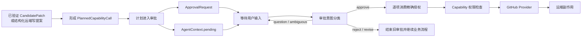

先把几个核心对象分清楚，后面的流程会容易很多。

| 对象 | 它保存什么 | 它主要回答什么问题 |
|---|---|---|
| `CandidatePatch` | 本地最终文件内容、删除文件、patch、摘要等 | “准备发布的代码候选是什么” |
| `PlannedCapabilityCall` | 一个 capability id 和一组参数 | “准备调用哪项远端能力，参数是什么” |
| Mutation Plan | 按顺序排列的一组 `PlannedCapabilityCall` | “这次远端修改要按什么步骤执行” |
| `ApprovalRequest` | approval id、Session、仓库、摘要、计划和审批状态 | “当前等待用户确认的提案是哪一份” |
| `PendingCall` | approval id、摘要、待执行调用，以及必要的 provider call id | “Agent Loop 当前停在哪个待审批调用上” |
| `PermissionPolicy` | 每个 Agent 对 capability 的 allow / ask / deny 规则 | “这个调用能直接执行、需要审批，还是直接拒绝” |
| GitHub Provider | 真正调用 GitHub，并执行 mutation 自身的参数与版本检查 | “远端副作用怎样真正落地” |

这里最重要的关系可以记成三句话：

**候选描述内容，计划描述动作，审批描述用户对这份精确动作计划的决定。**

这三个层次会互相引用，但职责没有混在一起。

## 2. 第一步：先把“准备怎样修改 GitHub”变成 Mutation Plan

### 2.1 远端写计划有两条主要来源

当前实现里，Mutation Plan 并不只有一种生成方式。理解这一点非常重要。

第一条路径来自**已经验证的代码修改**。这类计划主要由 Harness 或 Domain Agent 的确定性逻辑生成。系统已经拿到 `CandidatePatch` 和通过的 `VerificationReport`，随后根据业务场景决定代码要发布到哪里。

第二条路径来自**Domain Agent 已经给出的结构化 GitHub 写调用**。例如发布 PR Review、Merge PR、发布 Issue 评论。Agent 先产生一个结构化 capability call；Dispatcher 和 Capability 层检查后发现它属于 `ask` 权限，于是把这一项调用转成待审批计划。

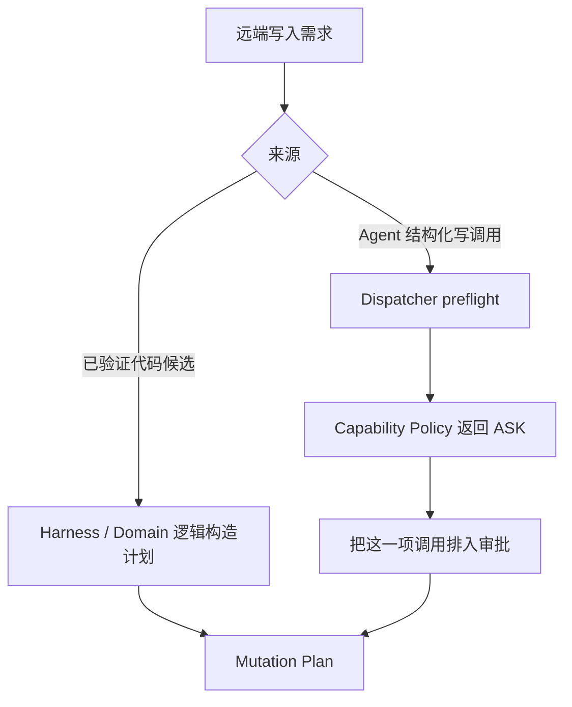

所以，“Mutation Plan”表示的核心含义是**已经冻结下来、准备交给审批系统的一组具体远端调用**。它的来源可以不同。

### 2.2 Repository 修改怎样形成计划

Repository 场景用于直接修改默认分支。

Coding Agent 完成 patch 后，Dispatcher 会先确认：

- `code_candidate` 已存在；
- `change_request` 已存在；
- `verification` 已存在并且 `passed=true`。

这些条件通过后，`repository_change_mutation_plan` 生成一个单步骤计划：把当前候选作为一次 `github.commit_to_default_branch` 调用提交到默认分支。

这个调用会携带 `ChangeRequest.source_ref` 作为 `expected_head_sha`。也就是说，这份计划同时带着一句机器可检查的前提：**默认分支当前仍然应该停在生成候选时使用的那个 commit。**

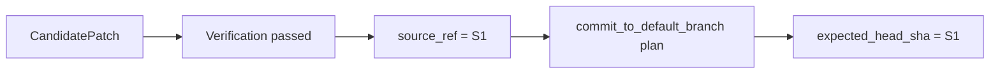

还有一层额外保护：普通模型调用路径不能直接提议 `github.commit_to_default_branch`。`validate_protected_capability` 会拒绝这种直接调用。默认分支提交必须从已经验证的 Repository mutation plan 进入审批链。

### 2.3 Issue 修复怎样形成四步计划

Issue 修复采用更保守的发布方式。经过验证的候选不会直接写默认分支，而会形成固定的四步计划：

1. 从已审阅的默认分支 head 创建修复分支；
2. 把 `CandidatePatch` 提交到这个分支；
3. 确认这个分支已经可以作为远端分支使用；
4. 创建 Draft PR。

分支名由 Session 派生，形式类似 `gitagent/<session-suffix>`。创建分支和提交候选都携带同一个原始 `source_ref`。

这并不矛盾。新分支刚创建时就指向 `source_ref`，因此紧接着向该分支提交候选时，预期 parent 仍然是这个 SHA。

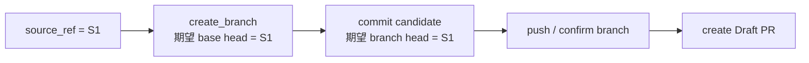

### 2.4 PR 内修复怎样形成计划

PR patch 场景先读取当前 PR metadata，并把当前 PR head SHA 放进 `ChangeRequest.source_ref`。Coding Agent 基于这个 SHA 生成和验证候选。

候选返回 PullRequestAgent 后，系统继续检查：

- 验证已经通过；
- `source_ref` 存在；
- 当前 PR head branch 能确定；
- PR 的 head repository 与当前 repository 一致。

如果 PR 来自 fork，当前实现不会自动向对方 fork 的 source branch 写入。

条件满足时，PullRequestAgent 会排入一个单步骤 `github.commit` 计划。它绑定当前 PR head branch、候选文件、删除文件、候选摘要和原始 head SHA。

### 2.5 一张表记住三类代码候选的发布方式

| 业务场景 | Mutation Plan | 关键版本约束 |
|---|---|---|
| Repository 修改 | 直接向默认分支提交一次候选 | 默认分支 head 必须等于 `source_ref` |
| Issue 修复 | create branch → commit → push → Draft PR | 创建分支和第一次 commit 都绑定 `source_ref` |
| PR 内修复 | 向当前 PR head branch 提交候选 | 目标 branch 和 head SHA 必须与已观察 PR 一致 |

## 3. 第二步：计划进入审批前，先做确定性保护检查

有些 Mutation Plan 是 Harness 根据已验证候选直接构造出来的；还有一些远端写是模型通过 capability 直接提出的。对于后一类调用，Dispatcher 会在它进入 Approval 之前先做一次 `preflight_capability`。

这里最重要的一层是 `validate_protected_capability`。它针对少数高风险 GitHub 写能力做业务约束检查。

### 3.1 默认分支提交

`github.commit_to_default_branch` 在普通结构化调用路径中会被直接拦截。它只能从 Repository 已验证候选的专用计划路径执行。

这样模型无法跳过 Coding Agent 和 Verification，直接拼一组文件参数要求写默认分支。

### 3.2 Issue 回复发布

当当前 Context 正处于 Issue reply workflow 时，`github.post_comment` 必须与已经审阅的 draft 完全对应：目标 Issue、正文和 workflow stage 都要匹配。

模型临时换一段正文，或者拿同一轮流程去评论另一个 Issue，都会被业务 gate 拒绝。

### 3.3 PR Review 发布

`github.post_review` 需要满足：

- 当前 Agent 是 PullRequestAgent；
- 目标 `pr_number` 与当前活动 PR 一致；
- `event` 只能是 `COMMENT`、`APPROVE`、`REQUEST_CHANGES`；
- Review body 不能为空。

这一步先确认“这是一份合法并且属于当前 PR 的 Review 提案”，随后才有资格进入用户审批。

### 3.4 PR patch commit

PR patch 有两层来源不同的约束，需要分开理解。

PullRequestAgent 从 Coding Agent 接回候选后，会先确认 Verification 已通过、`source_ref` 存在、PR head branch 能确定，并且 source repository 属于当前仓库。随后它直接使用 `CandidatePatch` 构造单步骤 `github.commit` 计划，因此文件、删除文件、message 和 `expected_head_sha` 天然来自已验证候选。

如果模型之后通过普通结构化调用路径再次提出 `github.commit`，`validate_protected_capability` 还会进一步核对：

- 当前 Agent 是 PullRequestAgent；
- 存在 Coding Agent 生成的 `CandidatePatch`；
- `VerificationReport` 已通过；
- 参数里的文件、删除文件、message、`expected_head_sha` 与候选和 `ChangeRequest` 一致；
- branch 与已经观察到的 PR head branch 一致；
- source repository 属于当前仓库，fork PR 不进入自动写分支路径。

### 3.5 PR Merge

`github.merge` 在进入 Approval 前会检查：

- 当前 Agent 是 PullRequestAgent；
- 最近一次 `merge_readiness` 的状态已经达到“准备合并”；
- merge 参数中的 `expected_head_sha` 与最近观察到的 PR head SHA 一致；
- `pr_number` 与当前观察到的 PR 一致。

这里的 `merge_readiness` 来自 PullRequestAgent 对 PR metadata、代码审阅、有效 Review、CI workflow 等证据的综合判断。

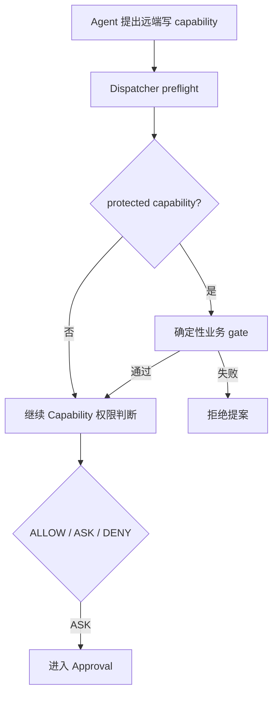

## 4. 第三步：把计划同时保存成 ApprovalRequest 和 PendingCall

Mutation Plan 准备好以后，Dispatcher 的 `queue` 会做两件关键事情。

第一件事是调用 `ApprovalStore.create`，创建 `ApprovalRequest`。

第二件事是在当前 `AgentContext` 上写入 `PendingCall`，让 Agent Loop 明确进入“等待用户处理这份提案”的控制状态。

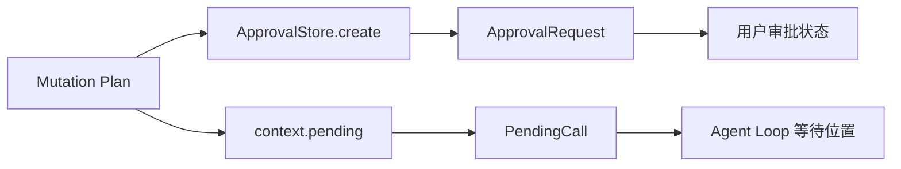

### 4.1 ApprovalRequest 保存什么

一个 `ApprovalRequest` 会保存：

| 字段 | 作用 |
|---|---|
| `approval_id` | 这一次审批的稳定身份 |
| `session_id` | 它属于哪一个 Session |
| `repository` | 提案记录面向哪个仓库 |
| `summary` | 给用户理解方案的摘要 |
| `calls` | 真正待授权的结构化调用列表 |
| `decision` | 当前还未决定、Approve、Reject、Superseded 或 Invalidated 等状态 |
| `_remaining` | 还没有被消费的精确调用序列 |

创建 Request 时，ApprovalStore 会把每个 capability id 和 arguments 规范化成稳定字符串，放进 `_remaining`。

规范化会固定参数键的顺序，所以参数对象即使来自不同构造路径，只要语义完全一致，就可以稳定比较；任何字段值发生变化，得到的精确调用快照也会变化。

### 4.2 PendingCall 保存什么

`PendingCall` 保存 approval id、summary 和同一组 calls。对于“模型先发出 capability call，随后 Capability 层返回 `approval_required`”这种路径，它还会记录原来的 `provider_call_id`。

这个字段很有用：用户批准后执行真正调用时，第一步可以继续沿用原来的 provider tool call 身份，工具调用与后续工具结果仍然保持同一条关联链。

### 4.3 用户看到的摘要和运行时授权依据是两层数据

Approval Summary 用于帮助用户理解：会改哪个仓库、哪些文件、验证结果怎样、风险是什么、Draft PR 标题是什么等。

如果当前有 `CandidatePatch`，服务层在用户询问提案详情时还可以把候选文件内容和 Diff 一起展示出来。

真正用于授权比较的依据仍然是 `calls` 里的 capability id 和 arguments。Summary 适合阅读，结构化调用适合确定比较。

### 4.4 一个需要准确记住的实现边界

`ApprovalRequest` 里确实保存 `repository`，恢复持久化审批时也会校验 repository 是否一致。

但当前 `ApprovalStore.authorize` 真正消费授权时，直接检查的是：

- approval id 是否存在；
- Session 是否一致；
- decision 是否为 `Approve`；
- capability id 与参数是否等于 `_remaining` 的第一项。

`authorize` 本身没有再单独比较 repository 字段。因此复习实现时，最好把 repository 理解为 Approval Request 的上下文与恢复一致性信息，不要把它描述成 `authorize` 当前直接参与比较的字段。

## 5. 第四步：等待审批时，下一条用户输入先进入 Approval Intent Classifier

当某个 AgentContext 存在 `pending` 时，Service 收到下一条用户输入后，会先找到当前真正处于等待状态的 Context，然后把用户输入和当前提案上下文交给 `ApprovalIntentClassifier`。

Classifier 会把回复整理成五类动作：

| action | 含义 | 对 pending 的处理 |
|---|---|---|
| `approve` | 用户明确同意当前提案 | 进入真正执行 |
| `reject` | 用户明确拒绝 | 关闭当前审批 |
| `revise` | 用户要求修改提案内容或候选 | 结束旧授权链，回到修改流程 |
| `question` | 用户在询问当前提案 | 保留 pending，返回提案说明 |
| `ambiguous` | 无法可靠判断用户意图 | 保留 pending，请用户说清楚 |

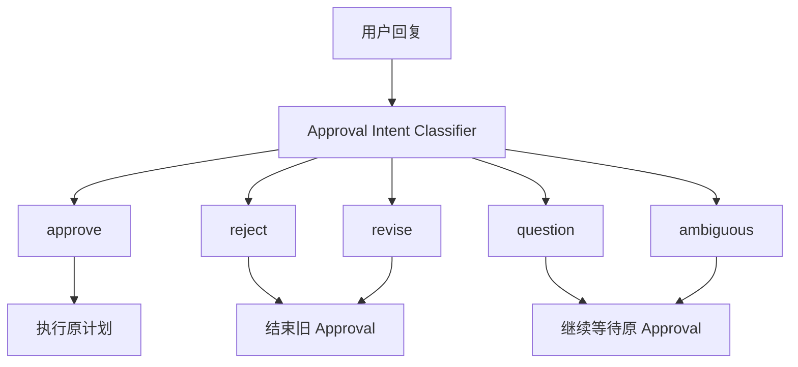

### 5.1 approve 怎样继续

Classifier 返回 `approve` 后，Agent Loop 会调用 Dispatcher 的 `apply_user_decision`。

Dispatcher 先把 ApprovalRequest 标记为 `Approve`，然后清掉 `context.pending`，把刚才保存下来的 `PendingCall` 交给 `execute_pending`。

这里有一个很关键的先后顺序：**用户决定只改变 Approval 状态，真正 GitHub 写入由后面的 `execute_pending` 单独完成。**

### 5.2 reject 怎样继续

对于普通拒绝，Dispatcher 会把当前 ApprovalRequest 标记为 `Reject`，清掉 pending，并把拒绝信息作为结构化结果或用户指令送回原工作流，让 Agent 继续收束。

### 5.3 question 和 ambiguous 怎样继续

这两类不会消费，也不会关闭 Approval。

`question` 会返回当前 proposal description；`ambiguous` 会返回一条澄清问题。下一条用户输入仍然围绕原来的 pending proposal 处理。

### 5.4 revise 怎样继续

修改请求会让旧计划失去继续授权的资格，不过不同工作流的处理方式略有区别。

PR Review 有一个专门的文本修订路径。系统会基于用户指令生成新的 Review body，把旧审批标记为 `Superseded`，再针对新的 `github.post_review` 参数创建一个全新的 Approval。

Repository 修改收到 revise 后，会把修订要求追加到 `ChangeRequest`，同时清掉旧 `code_candidate` 和 `verification`。随后工作流重新进入代码修改与验证过程。旧 pending 在通用 decision 处理里结束，后续新候选会产生新的计划。

其他普通 revise 也不会继续复用旧 pending calls，而会把修订指令交还业务 Agent 重新推进。

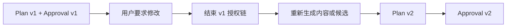

## 6. 第五步：批准后，PermissionPolicy 怎样逐项消费精确授权

用户批准以后，`execute_pending` 会按照 `pending.calls` 的原顺序逐项执行。

对每一步，Context 都通过 `invoke_approved` 把同一个 `approval_id` 带回 Capability 层。

Capability 层再次根据 Agent 的 invoke policy 判断当前 capability。远端 WRITE/DESTRUCTIVE 能力配置在 `ask` 中时，Policy 看到 approval id 后会调用 `ApprovalStore.authorize`。

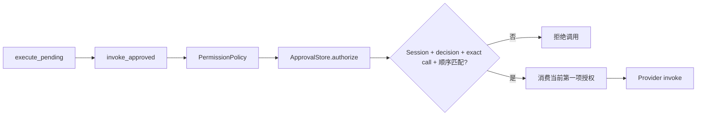

### 6.1 精确匹配到底检查什么

当前 `authorize` 会检查四件事。

第一，`approval_id` 必须指向一个真实存在的 Request。

第二，这个 Request 的 `session_id` 必须和当前 Session 一致。

第三，Request 的 decision 必须已经是 `Approve`。

第四，当前 capability id 与参数必须和 `_remaining[0]` 完全一致。

只要其中任何一项不匹配，调用都会在进入 Provider 之前被拒绝。

### 6.2 参数为什么要做规范化比较

计划创建时，ApprovalStore 会把 capability id 和 arguments 转成规范化 JSON 形式。对象键会排序，空格等表示差异会被消除。

这样比较关注的是结构化值本身。

例如用户批准的是“给 PR #45 发布某段 Review body”，那么后面偷偷换成 PR #46、改正文、改 event，都会得到不同的精确调用快照，旧审批无法消费这项调用。

### 6.3 顺序怎样被固定下来

`_remaining` 是一个有顺序的队列。

当前执行只能匹配队首。匹配成功后，这一项会先从 `_remaining` 移除，然后 Provider 才开始执行。

因此多步骤计划无法跳步。Issue 修复计划如果第一步还没有消费，第四步的 Draft PR 调用无法拿到这份 Approval 的执行资格。

### 6.4 Approval 更像一组一次性动作票据

一份多步骤 Approval 可以覆盖多个远端动作，但每一项动作都只能按原顺序消费一次。

它不会让 Agent 获得“接下来都可以写 GitHub”的通用权限。模型如果在执行中临时增加一项新 mutation，新调用没有出现在 `_remaining` 中，自然无法使用旧 approval id 通过检查。

## 7. 第六步：多步骤 Mutation Plan 怎样真正执行

`execute_pending` 的实现很直接：对 `pending.calls` 做顺序遍历，一步成功以后再执行下一步。

Issue 修复就是最典型的例子。

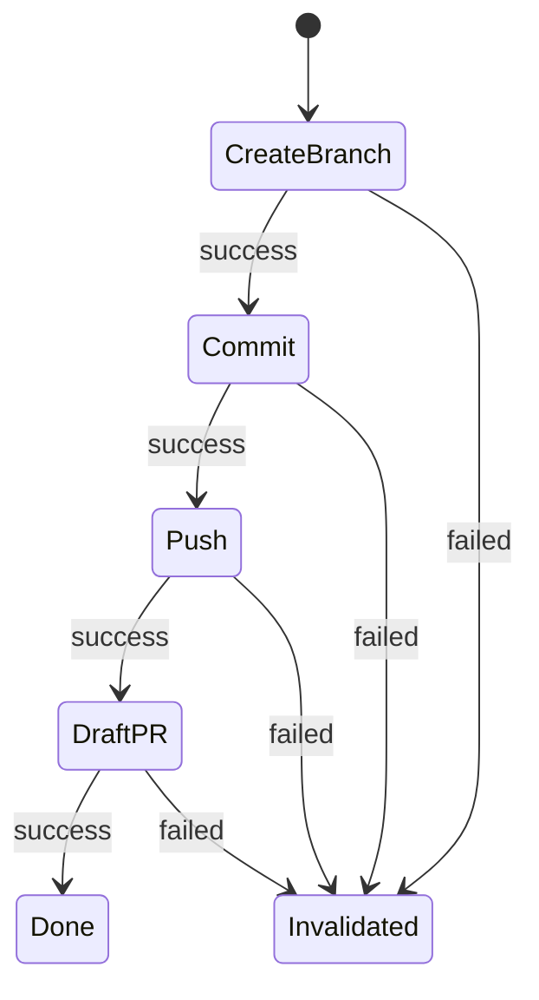

### 7.1 每一步成功后发生什么

Provider 返回 success 后，Dispatcher 会记录 capability observation，并把工具结果写回 Agent 消息线程。

随后 for-loop 才进入下一项调用。

所有 calls 都成功以后，Dispatcher 会调用 `ApprovalStore.complete`，确认 decision 是 `Approve` 并且 `_remaining` 已经为空。

如果列表执行完以后还有未消费授权，系统会把它当成工作流错误处理。

### 7.2 中间一步失败后发生什么

只要某一步返回 failed，Dispatcher 会立即：

1. 把整个 approval 标记为 `Invalidated`；
2. 清空剩余授权；
3. 记录结构化 capability error；
4. 停止执行后续步骤。

这里没有自动继续跑剩余计划。

### 7.3 已经成功的前置副作用不会自动回滚

多步骤计划目前没有事务型 rollback。

例如 create branch 已成功，后面的 commit 失败，那么前面创建出来的 branch 仍可能留在 GitHub。系统会让原 Approval 失效并停止后续步骤，但不会自动删除已经创建的 branch。

所以，多步骤计划提供的是**顺序控制和失败截断**，并没有提供跨 GitHub API 的原子事务。

这个边界和下一章的恢复设计关系很大。

## 8. 第七步：批准之后，真正的 GitHub 写入前还会检查什么

这一节需要非常准确，因为这里很容易把“提案前检查”和“批准后检查”混在一起。

用户批准后，`execute_pending` 会通过 `invoke_approved` 直接进入 Capability 层。Capability 层会重新做 schema 校验和 PermissionPolicy 授权消费，然后调用 Provider。

**Dispatcher 的 `validate_protected_capability` 当前不会在 `execute_pending` 中统一再跑一遍。**

因此，审批等待期间的“远端状态是否变化”主要依赖各个 GitHub mutation 自己的参数语义和 Provider 检查。

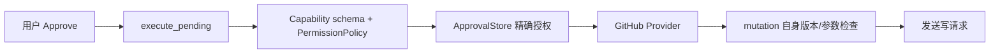

### 8.1 create_branch 怎样检查默认分支有没有变化

`github.create_branch` 会先读取 base branch 当前 ref，得到真实 head SHA。

如果真实 SHA 和计划里的 `expected_head_sha` 不相等，Provider 直接返回冲突，而且这个失败发生在创建 branch 的 POST 请求之前。

因此，Issue 修复在等待审批期间如果默认分支从 S1 前进到 S2，旧计划不会从 S2 悄悄创建修复分支。

### 8.2 commit 怎样检查目标分支有没有变化

`github.commit` 先读取目标 branch 当前 ref。

只有当前 branch head 与 `expected_head_sha` 相等，Provider 才继续读取 parent tree、创建 blob、tree 和 commit，最后用非 force 方式推进分支 ref。

PR patch 和 Issue 修复中的 commit 都依赖这条检查。

### 8.3 commit_to_default_branch 怎样检查默认分支有没有变化

Repository 直接修改默认分支时，Provider 会重新解析默认分支并读取当前 head。

当前 head 必须和候选生成时记录的 `source_ref` 一致，后续才创建 tree、commit 并推进默认分支。

这条路径对“审批等待期间默认分支有人提交”有明确的执行时保护。

### 8.4 merge 怎样绑定已审阅的 PR head

`github.merge` 不会先单独 GET 一次 PR head。它会把计划中的 `expected_head_sha` 作为 `sha` 参数直接发送给 GitHub Merge API。

GitHub 只会在当前 PR head 与这个 SHA 匹配时接受这次带版本条件的 merge 请求。

因此 merge plan 仍然绑定到了已审阅 head，只是版本比较由 GitHub merge API 完成。

### 8.5 push 当前做的事情

当前 GitHub client 的 `push` 语义比较轻。因为前面的 commit 本身已经通过 GitHub API 更新了远端 branch ref，所以 `push` 这一步主要读取该 branch ref，确认分支存在，然后返回 pushed 状态。

复习时不要把这一项理解成本地 Git CLI 再执行一次网络 push。

### 8.6 create_draft_pr 和 post_review 的当前边界

`create_draft_pr` 会强制 `draft=true`，然后直接调用 GitHub 创建 PR。它没有额外的 `expected_head_sha` 参数。

`post_review` 在提案阶段经过 PullRequestAgent 的目标 PR、event 和 body 检查；批准后 Provider 会直接 POST Review。当前执行路径不会再次读取 PR metadata 来重新跑同一套 protected validation。

这说明不同 mutation 的“批准后新鲜度检查”强度并不完全相同。

### 8.7 Merge readiness 当前也不会在批准后统一重算

Merge 提案进入 Approval 前，PullRequestAgent 已经计算 `merge_readiness`，其中会综合：

- PR 是否 open；
- PR 是否仍是 Draft；
- Coding review 是否存在阻塞问题；
- 目标与实现是否一致；
- 每位 reviewer 当前有效 Review；
- 当前相关 CI workflow run 状态。

`validate_protected_capability` 会要求 readiness 已经达到“准备合并”，并把 merge 参数绑定到当时观察到的 PR head SHA。

用户等待一段时间后再批准时，当前 Harness 不会重新获取 Review 和 CI 并重新计算 readiness。它依靠 merge 的 `expected_head_sha` 防止 head 悄悄变化；如果 Review 或 CI 在 head 不变的情况下发生变化，Harness 自己不会在批准恢复点重新取证。

GitHub 仓库自己的 branch protection 可能继续拒绝不满足平台规则的 merge，但那属于 GitHub 端约束，不能当成当前 Harness 已经重新执行过 readiness 检查。

### 8.8 把“审批前”和“批准后”的检查分开记

| 检查 | 主要发生位置 | 批准后是否统一重跑 |
|---|---|---|
| PR merge readiness | PullRequestAgent + protected validation | 当前不会统一重算 |
| PR Review 目标/event/body | protected validation | 当前不会统一重跑 |
| PR patch 参数是否等于 CandidatePatch | protected validation | 当前不会统一重跑 |
| Approval capability/arguments/order | PermissionPolicy + ApprovalStore | 会，每一步执行前都检查 |
| create_branch 当前 base head | GitHub Provider | 会，在真实创建分支前读取 |
| commit 当前 branch head | GitHub Provider | 会，在真实 commit 前读取 |
| default-branch commit 当前 head | GitHub Provider | 会，在真实 commit 前读取 |
| merge 当前 head 是否等于 expected SHA | GitHub Merge API 条件 | 会，通过 `sha` 条件约束 |

## 9. `expected_head_sha`：代码类远端 Mutation 的核心版本锚点

第 07 章已经介绍了 `source_ref`：Coding Agent 基于一个精确 commit 构造候选。

到了第 08 章，这个精确 SHA 会继续进入远端 Mutation Plan，成为 `expected_head_sha`。

可以把这条链记成：

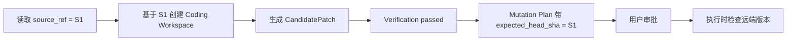

### 9.1 Repository 修改的例子

假设候选基于默认分支 S1 生成，并通过了全部验证。

系统生成 `commit_to_default_branch(expected_head_sha=S1)` 的计划，然后等待用户。

等待期间，其他开发者把默认分支推进到了 S2。

用户此时点击批准，ApprovalStore 仍然可以确认“用户确实批准过这项 S1 计划”，但 Provider 重新读取默认分支后会看到 S2，于是拒绝旧 mutation。

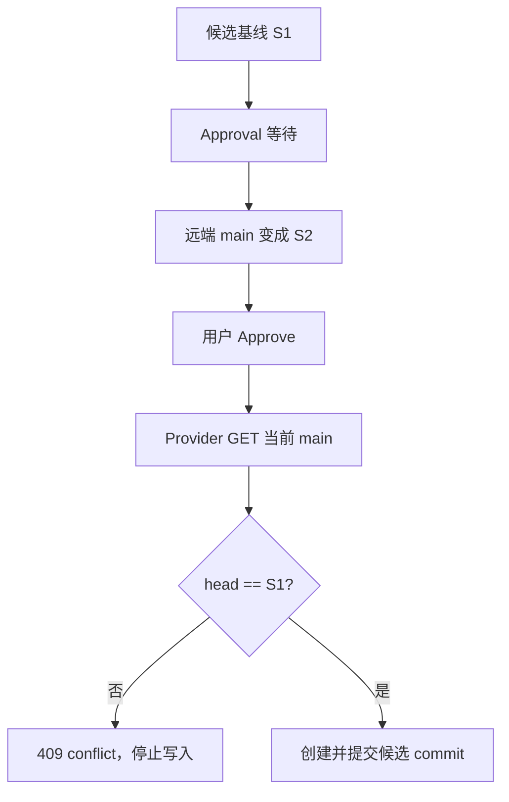

### 9.2 这是一种乐观并发控制

审批期间，GitAgent 不会锁住远端 branch，也不会阻止其他人继续提交。

系统允许外部世界正常变化，只在真正执行 mutation 时比较“现在看到的版本”与“生成候选时依赖的版本”。

这就是典型的 optimistic concurrency 思路。

## 10. Review 历史和 CI 怎样参与 Merge readiness

Merge readiness 是 PR 提案阶段的一个重要结构化产物。

PullRequestAgent 会读取当前 PR metadata、Review 历史、workflow runs，再结合 Coding review 的结论生成三组信息：

- `satisfied`：已经满足的条件；
- `blockers`：当前明确阻塞 merge 的条件；
- `remaining`：还缺少证据或需要人工确认的事项。

最后根据这三组内容得到 readiness status：

| 情况 | readiness status |
|---|---|
| 存在 blocker | `需要继续修改` |
| 没有 blocker，但仍有 remaining | `处理少量事项后合并` |
| blocker 和 remaining 都为空 | `准备合并` |

只有最后一种状态才允许 `github.merge` 通过 protected validation 进入 Approval。

### 10.1 Review 历史先归一成“每位 reviewer 当前有效状态”

同一个 reviewer 可能先提交 `REQUEST_CHANGES`，后来又提交 `APPROVE`。

Merge readiness 不会简单把所有历史事件永久叠加。`effective_review_events` 会先按 reviewer 归一，取每位 reviewer 当前有效的 Review 状态，再判断是否仍存在有效的 `REQUEST_CHANGES` 或已经出现有效的 `APPROVE`。

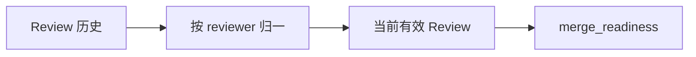

### 10.2 CI 也只看当前相关 workflow runs

PullRequestAgent 会从已经观察到的 workflow runs 中整理当前相关运行。

只要存在失败 run，就产生 blocker；没有任何 CI 证据时进入 remaining；还有未完成 run 时也进入 remaining；全部完成且没有失败才算 satisfied。

## 11. WRITE / DESTRUCTIVE Capability 失败后为什么不会自动重试

这一节放在执行链讲清楚以后再看，会更容易理解。

CapabilityLayer 对 Provider 调用有统一重试框架，但 `_recoverable` 明确限制：**只有 READ capability 才可能因为 TIMEOUT、UNAVAILABLE 或短时间 RATE_LIMITED 进行一次恢复重试。**

WRITE 和 DESTRUCTIVE capability 不进入这条自动重试路径。

### 11.1 远端写失败存在“副作用是否已经发生”的不确定窗口

以发布 Review 为例：

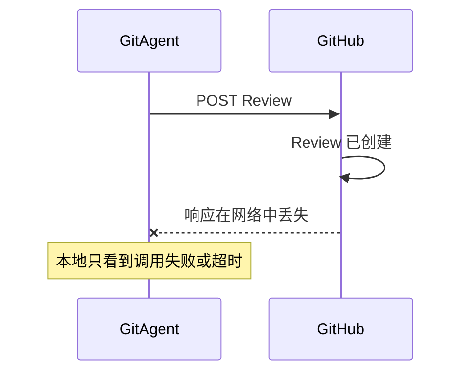

这时客户端无法仅凭超时判断 GitHub 有没有已经完成写入。

如果 CapabilityLayer 自动把同一个 WRITE 再发一次，就可能创建重复评论、重复 Review 或其他重复副作用。

### 11.2 版本冲突类失败更容易判断

create branch、commit、default-branch commit 在发现 `expected_head_sha` 不匹配时，会在真正写请求之前抛出冲突，并标记 `request_sent=false`。

这一类错误有比较明确的“写请求尚未发送”语义。

但通用远端 WRITE 错误不能都拥有这种保证，所以 CapabilityLayer 采用更保守的统一策略：远端 mutation 不自动重试。

### 11.3 多步骤计划失败后也不会自动重放整份计划

前面已经看到，`execute_pending` 中任何一步失败都会 invalidate 当前 Approval 并停止。

系统不会因为“用户已经批准整个 Issue 修复计划”就从头再跑 create branch、commit、push、Draft PR。

下一章会继续讨论：哪些失败可以安全恢复，哪些失败必须先重新读取远端事实再决定下一步。

## 12. 用四个完整场景把整条链串起来

前面的模块拆开看完以后，再把常见场景从头走一遍。

### 12.1 Repository：直接修改默认分支

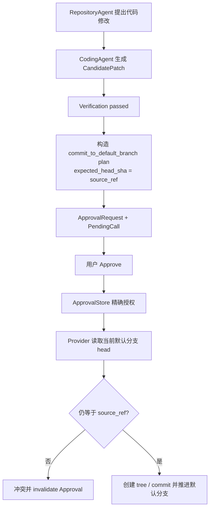

这个场景最适合记住“Verified Candidate → Mutation Plan → Approval → expected head check → Remote Mutation”这条主链。

### 12.2 Issue：修复问题并创建 Draft PR

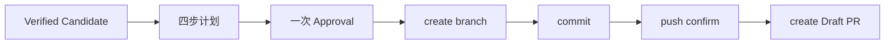

同一个 Approval 覆盖四项已经固定的动作，每一步按 `_remaining` 顺序消费。

任何一步失败，剩余计划停止，旧 Approval 失效；已经完成的前面步骤不会自动撤销。

### 12.3 PR patch：把已验证候选提交到当前 PR branch

PullRequestAgent 先把当前 PR head SHA 作为 `source_ref` 交给 Coding Agent。

候选通过验证后，系统检查当前 PR branch、source repository 和候选参数，再创建单步骤 `github.commit` Approval。

用户批准后，Provider 重新读取该 branch head。只有它仍然等于候选的原始 head SHA，commit 才会继续。

### 12.4 PR Merge：先形成 readiness，再审批精确 merge call

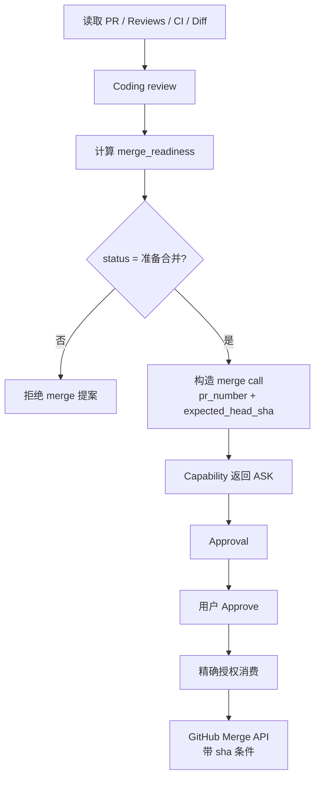

这个场景还要额外记住：readiness 在提案前形成；批准后当前 Harness 不会统一重新读取 Review 和 CI。merge 的 head 版本仍然通过 `expected_head_sha` 得到保护。

---

## 13. 这一模块的职责边界怎样划分

把源码按职责重新归纳，可以得到下面这张图。

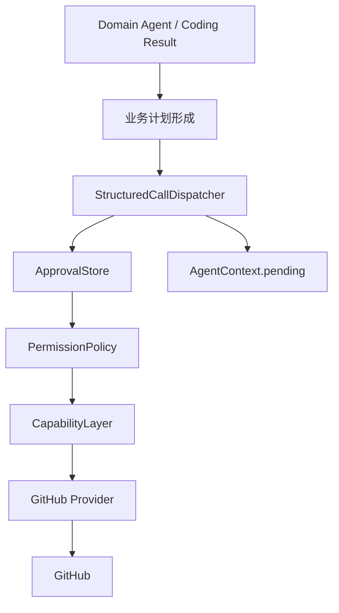

| 层 | 主要职责 | 不应该承担的职责 |
|---|---|---|
| Domain Agent | 决定业务动作、收集业务证据 | 自己发放最终授权 |
| Coding Agent | 生成并验证本地候选 | 决定用户是否同意远端写 |
| StructuredCallDispatcher | 业务 preflight、排队 Approval、恢复后执行 pending plan | 代替 GitHub Provider 实现所有远端细节 |
| ApprovalStore | 保存审批状态、精确调用队列、一次性顺序授权 | 理解 PR Review/CI 的业务语义 |
| PermissionPolicy | 根据 Agent policy 决定 ALLOW/ASK/DENY，并接入 ApprovalStore | 自己生成业务候选 |
| GitHub Provider | 执行真实 GitHub API 和 mutation 自身检查 | 判断自然语言用户意图 |

这张表很适合复习时定位问题。

如果你在问“为什么这个 Merge 连 Approval 都进不去”，先看 PullRequestAgent readiness 和 protected validation。

如果你在问“用户明明批准了，为什么参数改一点就执行不了”，看 ApprovalStore 的 exact-call 比较。

如果你在问“用户批准后 main 更新了，为什么 commit 被拒绝”，看 GitHub Provider 的 `expected_head_sha` 检查。

如果你在问“超时后为什么没有自动再发一次”，看 CapabilityLayer 的 READ-only recoverable 策略。

---

## 14. 最容易混淆的几个点

| 容易产生的理解 | 当前实现 |
|---|---|
| `CandidatePatch` 验证通过后就能直接写 GitHub | 还要形成业务 Mutation Plan，并经过远端写权限与 Approval |
| Mutation Plan 全部由 Domain Agent 手工生成 | 已验证代码路径有确定性 plan builder；普通远端写也可能由结构化 capability call 在 `ASK` 后自动排成单项 Approval |
| Approval 只保存一个 yes/no | ApprovalRequest 还保存 calls，并维护有顺序的 `_remaining` 精确调用队列 |
| 用户批准后模型可以调整调用参数 | 参数变化后 exact-call 匹配失败，旧 approval id 无法授权 |
| 多步骤 Approval 可以从任意一步开始 | 只能匹配 `_remaining[0]`，所以必须按原顺序消费 |
| 所有 protected validation 都会在批准后重新运行 | 当前不会统一重跑；批准后主要重新做 Capability 授权和 mutation 自身的远端版本检查 |
| Merge Approval 后一定重新读取 Review 和 CI | 当前 Harness 没有这一步；提案前 readiness 已计算，执行时主要用 expected head SHA 约束版本 |
| WRITE 超时以后 Runtime 会自动重试一次 | 自动恢复重试只面向 READ，远端 WRITE/DESTRUCTIVE 不自动重试 |
| Issue 四步计划失败后会整体回滚 | 当前只停止并 invalidate；已经成功的前置 GitHub 副作用可能保留 |
| `push` 等于执行本地 `git push` | 当前 GitHub client 中它主要确认 branch ref 已存在 |

---

## 15. 复习时可以怎样讲这一章

如果面试或复习时需要在几分钟内把这一模块讲清楚，可以沿着下面这条线：

> 第 07 章先产生基于精确 `source_ref` 的 `CandidatePatch` 和验证结果。第 08 章再根据 Repository、Issue、PR 等业务场景把它转换成结构化 Mutation Plan；普通 Review、Merge、评论等远端写也会先变成结构化 capability call。计划进入 Approval 后，ApprovalStore 保存 exact capability + arguments + 顺序，AgentContext 保存 pending 控制点。用户回复先经过 intent classifier，真正批准后 PermissionPolicy 才逐项消费 Approval。随后 Provider 执行 GitHub mutation；代码类写操作通过 `expected_head_sha` 检查关键版本前提。多步骤计划中途失败会让旧 Approval 失效并停止，远端 WRITE 不做自动透明重试。当前 protected validation 主要发生在提案阶段，批准后没有统一重新计算 PR readiness，这一点需要单独记住。

这段话基本覆盖了本章的主设计链和关键边界。

---

## 16. 代码定位

| 想核对的问题 | 主要位置 |
|---|---|
| `ApprovalRequest` / `ApprovalStore` / exact-call 顺序授权 | `gitagent/harness/constraints/approval.py` |
| Repository / Issue 代码候选 Mutation Plan | `gitagent/harness/mutation_plans.py` |
| Approval queue、pending 执行、protected validation | `gitagent/harness/structured_call_dispatcher.py` |
| `PendingCall` 数据结构 | `gitagent/agent_loop/models.py` |
| `invoke_approved` 与 Capability 调用上下文 | `gitagent/harness/context/state.py` |
| Capability 的 ALLOW / ASK / DENY 与 Approval 消费 | `gitagent/capability/policy.py` |
| WRITE 不自动重试的 Capability 执行策略 | `gitagent/capability/layer.py` |
| 用户 approve / reject / revise / question / ambiguous 分类 | `gitagent/application/approval_intent.py` |
| 等待审批后的 Service 恢复与 PR Review 修订 | `gitagent/application/service.py` |
| PR patch、merge readiness | `gitagent/agents/pull_requests.py` |
| Review 历史归一 | `gitagent/domain/reviews.py` |
| create branch / commit / default commit / Review / Merge 的 GitHub 实现 | `gitagent/infra/github/client.py` |
| 各 Agent 对 GitHub mutation 的 `ask` 配置 | `capabilities.yaml` |

下一章继续回答这条链的另一个问题：[如果进程退出、写调用失败或 Session 重启，GitAgent 怎样恢复之前的控制状态，并判断哪些动作还能安全继续](09-persistence-recovery-observability.md)。
