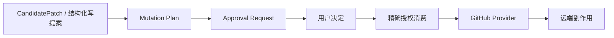
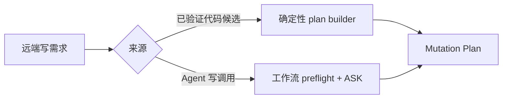
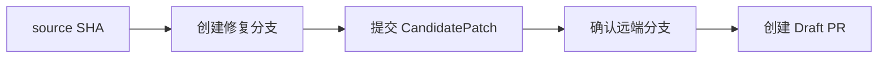
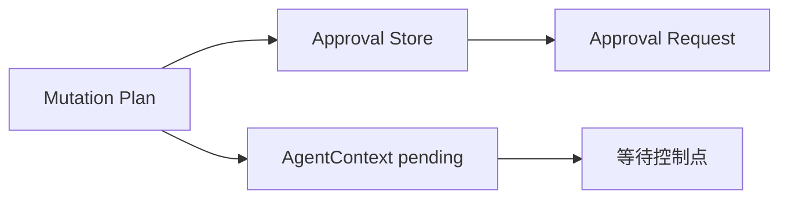
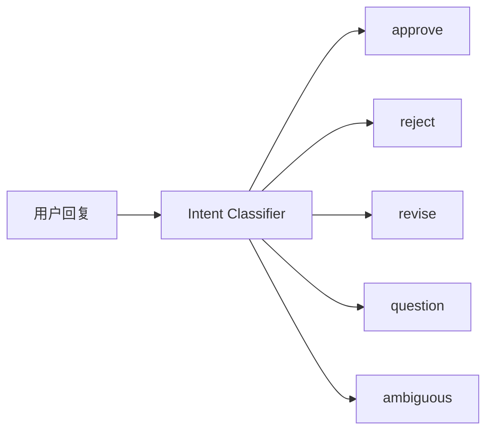
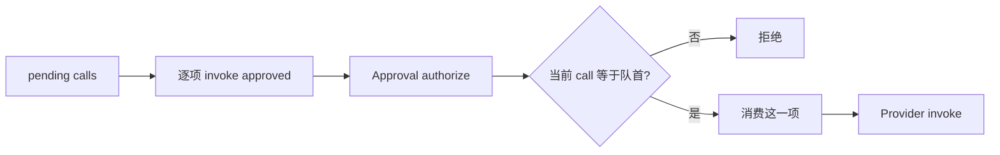
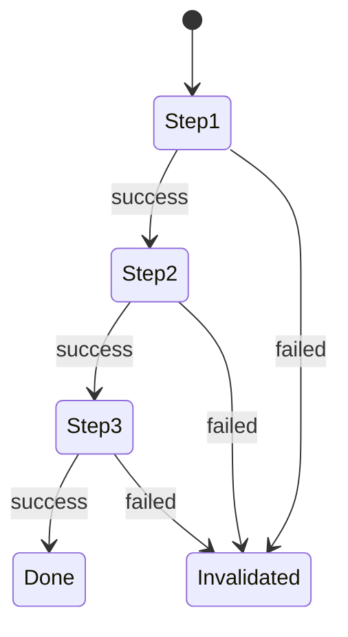
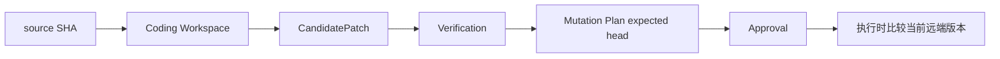

# 08 Approval 与远端 Mutation：本地候选怎样获得 GitHub 写入资格

第 07 章结束时，Coding Agent 已经得到 CandidatePatch 和 VerificationReport，但 GitHub 还没有发生变化。本章继续讲远端写入链：怎样把候选或其他 GitHub 写动作冻结成结构化计划，怎样等待用户批准，批准以后如何精确消费授权，以及真正写入前哪些远端事实会重新检查。

理解这一章时要一直区分三件事：**候选描述“要发布什么内容”，Mutation Plan 描述“准备执行哪些远端动作”，Approval 描述“用户是否同意这份精确动作计划”。**

---

## 1. 远端写入先经过一条资格链

模型不能拿一段自然语言直接修改 GitHub。真正进入 GitHub Provider 的写操作最终都必须变成具体 Capability 和参数。

其中还有两类检查分布在不同位置：计划进入 Approval 前，Dispatcher 会检查当前业务状态是否允许提出这个写动作；用户批准后，Capability 层会再次核对精确授权，GitHub Provider 再检查与这项 mutation 直接相关的远端版本条件。

这三层不能互相替代。用户同意某个动作，不代表远端版本条件仍然成立；远端版本仍然匹配，也不代表用户批准过这次写入。

---

## 2. Mutation Plan 从哪里来

当前远端写计划主要有两种来源。

第一类来自已经验证的代码候选。这里计划通常由 Harness 或 Domain Agent 的确定逻辑构造，因为系统已经知道真实 changed files、验证结果和 source SHA，不需要再让模型自由拼出一套发布参数。

第二类来自 Domain Agent 的普通结构化 GitHub 写调用，例如发布评论、PR Review 或 Merge。调用先经过工作流检查和 Capability 权限判断；如果权限是 ASK，就把这一项精确调用转成待审批计划。

因此 Mutation Plan 的共同含义不是“由谁生成”，而是：**一组已经固定下来的远端动作，接下来等待用户决定。**

---

## 3. 三类代码候选怎样变成不同的发布计划

代码候选的发布方式由业务场景决定。

### 3.1 Repository 修改：直接写默认分支

Repository 流程只有在候选、ChangeRequest 和通过的 VerificationReport 都存在时，才会构造默认分支提交计划。

计划会把候选文件内容交给默认分支提交能力，并带上候选生成时的 source SHA 作为 expected head。含义是：这份候选只允许应用到它真正基于的那一版默认分支。

普通模型调用路径不能直接提出默认分支提交。这个高风险能力由 protected validation 拦住，必须经过“Coding Agent 生成候选 → Verification 通过 → 专用 plan builder”这条路径。

### 3.2 Issue 修复：创建分支、提交、确认分支、Draft PR

Issue 修复不会直接写默认分支，而是固定形成四步计划：

创建分支和第一次 commit 都绑定原 source SHA。新分支刚创建时应该正好指向这个 SHA，所以后续提交可以确认它仍然是候选预期的 parent。

### 3.3 PR 内修复：提交到当前 PR head branch

PR patch 先把当前 PR head SHA 作为 Coding Agent 的 source SHA。候选通过验证后，Pull Request Agent 还会确认目标 branch 可确定，而且 PR 的 source repository 就是当前仓库。来自 fork 的 PR 当前不会自动向对方 fork 写入。

满足条件后形成单步骤 commit plan，文件内容、删除文件、提交说明和 expected head 都来自已验证候选及当前 PR 信息。

| 场景 | 计划 | 关键版本约束 |
|---|---|---|
| Repository | 默认分支 commit | 当前默认分支 head 必须等于候选 source SHA |
| Issue | create branch → commit → branch confirm → Draft PR | 创建分支和首次 commit 都绑定 source SHA |
| PR patch | commit 到 PR head branch | branch 和 head SHA 必须与已观察 PR 一致 |

这种分工让 Coding Agent 只负责“候选是否成立”，Domain Agent 再决定“业务上应该怎样发布”。

---

## 4. 计划进入 Approval 前先做业务保护检查

Capability schema 只能回答“参数形状是否合法”，不能回答“当前业务流程是否允许做这件事”。因此部分 GitHub mutation 在进入 Approval 前还会经过 protected validation。

### 4.1 默认分支提交

普通结构化调用不能直接执行默认分支提交。只有由 Repository 的已验证候选构造出的专用计划才有资格进入审批。

### 4.2 Issue 回复

如果当前正在走 Issue reply workflow，评论目标和正文必须与已经生成、给用户审阅的 draft 对应。模型不能在审批前临时换正文或换 Issue。

### 4.3 PR Review

Review 提案会核对当前 Agent 是否确实在处理这个 PR、PR 编号是否一致、event 是否属于允许类型、正文是否为空。通过以后才有资格等待用户批准。

### 4.4 PR patch

由已验证 CandidatePatch 构造计划时，文件和 expected head 天然来自候选。如果模型又通过普通调用路径提出 commit，还会重新核对当前 Agent、候选、验证状态、文件内容、删除文件、branch、expected head，以及 source repository 是否属于当前仓库。

### 4.5 PR Merge

Merge 进入 Approval 前要求 Pull Request Agent 已经形成“准备合并”的 readiness，并且 merge 参数绑定当前观察到的 PR 编号和 head SHA。

这里的 readiness 会综合 PR 是否 open/draft、代码 Review、有效人工 Review 和 CI 等证据。

这些检查放在提案阶段，是为了确保用户看到的本身就是一份符合当前业务流程的计划，而不是先让用户批准、执行时才发现计划从一开始就不成立。

---

## 5. Approval Request 与 Pending Call 分别保存什么

计划进入审批时，系统同时保存两个不同用途的对象。

Approval Request 保存 approval identity、所属 Session、repository、给用户看的摘要、精确 calls 和当前 decision。内部还维护一个“尚未消费的调用队列”，每项由 Capability id 和规范化参数表示。

Pending Call 则放在当前 AgentContext，告诉 Agent Loop“当前停在这份 Approval 上”。它保存同一组 calls；如果这份 Approval 来自模型先提出的 Capability call，还会保留原来的 provider call identity，使批准后第一项工具结果可以继续闭合同一条调用链。

摘要和授权依据要分开理解：summary 可以为了用户阅读展示仓库、文件、Diff、验证结果和风险；真正决定旧 Approval 能不能授权当前调用的，是结构化 Capability id、arguments 和顺序。

当前实现中 repository 会保存在 Approval Request，并参与持久化恢复一致性检查；真正逐项 authorize 时，核心比较的是 approval identity、Session、decision 以及当前 call 是否等于剩余队列的第一项。复习时不要把 repository 描述成每次 authorize 都直接比较的参数。

---

## 6. 用户回复先经过 Approval Intent 分类

Agent 处于 pending 时，下一条用户输入不能直接当成“批准”。用户可能说“可以”“不行”“把 Review 写短一点”“这个会改哪些文件？”或者一句含义不清的话。

服务层会把用户输入和当前 proposal 上下文交给 Approval Intent Classifier，整理成五类动作：approve、reject、revise、question、ambiguous。

approve 会把 Approval 状态改为已批准，再进入真正的 pending execution；reject 会关闭旧 Approval 并把拒绝事实送回原流程；question 和 ambiguous 不消费 Approval，系统仍然保持等待；revise 则结束旧授权链，让业务流程产生新的内容或候选。

PR Review 的 revise 可以生成新 Review body，并让旧 Approval 变成 superseded，再创建新 Approval。Repository 修改收到 revise 时，会把修订要求放回 ChangeRequest，清掉旧 CandidatePatch 和 Verification，重新走 Coding 和验证。

关键边界是：**Intent Classifier 只理解自然语言，不发放写权限。** 真正可执行授权仍由 Approval Store 和 Capability Policy 管理。

---

## 7. 批准后怎样逐项消费精确授权

用户批准以后，系统按 pending plan 的原顺序逐项执行。每一步都带回同一个 approval identity，Capability Policy 对需要 ASK 的写能力再次向 Approval Store 请求授权。

authorize 会确认 Approval 存在、属于当前 Session、decision 已经是 Approve，而且当前 Capability 和规范化 arguments 与剩余队列第一项完全相同。

参数使用稳定 JSON 形式比较，因此 key 顺序或空格不影响语义；但 PR 编号、正文、event、branch、expected head 等任何值发生变化，都会成为不同调用，旧 Approval 不能继续授权。

剩余调用是有序队列，只允许消费队首。Issue 四步计划不能跳过 create branch 直接执行 Draft PR。匹配成功后，这一项先从授权队列移除，再真正进入 Provider，所以同一项授权不能被重复消费。

可以把 Approval 理解成一组一次性、有顺序的动作票据，而不是临时获得“GitHub 写权限”。

---

## 8. 多步骤计划怎样处理成功和失败

多步骤计划按顺序执行，一步成功后才进入下一步。全部 calls 成功并且授权队列已经为空，Approval 才算完整结束。

任何一步失败都会立即停止后续步骤，并使旧 Approval 失效，剩余授权被清空。系统不会因为“用户已经批准整份计划”就从中间自动继续，也不会从头自动重放。

这里没有跨 GitHub API 的事务 rollback。前面一步已经成功产生的远端副作用可能保留。例如 create branch 成功后 commit 失败，分支可能仍然存在。Approval 提供的是顺序控制和失败截断，不是分布式事务。

因此恢复时不能简单“把剩余步骤再跑一遍”，还要结合当前远端事实判断之前究竟已经发生了什么。

---

## 9. 批准以后，哪些检查会重新执行

这是本章最容易误解的地方。用户批准后，pending plan 会重新经过 Capability schema、Permission Policy 和 Approval 精确授权，但 Dispatcher 在提案阶段做的 protected validation **不会统一再完整跑一次**。

所以批准等待期间的外部变化，主要依赖各个 GitHub mutation 自己的版本条件和 Provider 检查。

### 9.1 create branch

Provider 会先读取 base branch 当前 head。只有它仍然等于计划中的 expected head，才真正创建分支。默认分支在等待期间从 S1 变成 S2 时，旧计划会在写请求前冲突。

### 9.2 commit

向普通 branch 或 PR branch 提交前，Provider 会先读取目标 branch 当前 head，只有它仍然等于 expected head 才继续创建 blob、tree、commit 并推进 ref。

### 9.3 default-branch commit

默认分支提交同样会重新读取当前默认 branch 和 head，要求它仍然等于候选 source SHA。

### 9.4 merge

Merge 不一定先单独 GET PR head，而是把 expected head 作为 GitHub Merge API 的 `sha` 条件发送。GitHub 只会在当前 head 匹配时接受这次 merge。

### 9.5 push / branch confirm

当前所谓 push 更接近确认远端 branch ref 已存在，因为前一步 commit 已通过 GitHub API 更新远端 ref。它不是在本地再执行一次 `git push`。

### 9.6 create Draft PR 和 post Review

这两类操作没有统一 expected-head 机制。Draft PR 会强制 draft=true；Review 的目标 PR、event、body 在提案阶段已经经过 protected validation，但批准以后当前路径不会重新读取全部 PR metadata 再执行同一套检查。

因此不同 mutation 的“审批后新鲜度保护”强度并不相同，不能笼统说“批准后所有业务条件都会重新验证”。

---

## 10. expected head 是代码类远端写入的版本锚点

第 07 章的 source SHA 表示 CandidatePatch 从哪一版代码生成。到了远端计划中，这个 SHA 会继续作为 expected head，直到真正执行 mutation。

审批等待期间不会锁住 GitHub 分支。其他开发者可以正常提交；GitAgent 只在真正执行时比较“当前版本”和“候选依赖版本”。这是一种乐观并发控制。

例如候选基于 main=S1 生成，等待期间 main 前进到 S2。用户批准的仍然是那份 S1 计划，Approval 本身没有被篡改；但 Provider 会看到当前 main 已经不是 S1，于是拒绝执行。这里分别守住了“授权没有变化”和“外部前提没有变化”两个条件。

---

## 11. Merge readiness 在哪里起作用

Pull Request Agent 在提出 Merge 前，会综合当前 PR、代码 Review、有效人工 Review 和 CI 状态形成 readiness。

同一 reviewer 的历史 Review 不会全部永久叠加，而是先归一成这个 reviewer 当前有效状态。例如先 REQUEST_CHANGES、后来 APPROVE，当前有效状态应该反映最新 Review，而不是同时保留两个相互冲突的结论。

CI 也基于当前观察到的 workflow runs：存在失败就是 blocker；没有任何 CI 证据或仍有进行中的 run，通常仍有 remaining；完成且无失败才算 satisfied。

只有没有 blocker、也没有 remaining 时，Merge 才有资格进入 Approval。

但这套 readiness 主要发生在**提案前**。用户等待一段时间后再批准，当前 Harness 不会统一重新获取所有 Review 和 CI 再重算 readiness。执行阶段主要靠 expected head 约束 PR 代码版本；如果 head 没变但 Review 或 CI 状态发生变化，Harness 自己不会在恢复点重新取证。

GitHub branch protection 可能继续拒绝不满足平台规则的 Merge，但那属于 GitHub 端保护，不能描述成 GitAgent 已经重新计算过 readiness。

---

## 12. 为什么远端 WRITE 不自动重试

Capability 层只对少量 READ transient error 做一次有限恢复。远端 WRITE / DESTRUCTIVE 不进入通用 retry，原因在于失败时经常存在“副作用是否已经发生”的不确定窗口。

例如发布 Review：GitHub 可能已经创建成功，但响应在网络中丢失。本地看到 timeout，并不能证明 Review 没有出现。如果自动再发一次，就可能制造重复副作用。

代码类 expected-head 冲突比较明确，因为 Provider 可以在真正写请求之前发现版本不匹配，并明确知道“写请求尚未发送”。但这种保证不能推广到所有 mutation，所以统一策略保持保守：写失败后停止自动重放，让上层重新读取外部事实再决定下一步。

多步骤 plan 同样不会在失败后自动从头重放。这个选择和第 09 章的恢复语义直接相关。

---

## 13. 为什么 Approval 要和 Capability 权限、Provider 检查分开

前面先讲了整条实现，现在可以看设计原因。

Capability Permission 负责一般动作权限：某个 Agent 能否调用这个能力，是否必须询问用户。Approval 负责一次具体 proposal：用户批准的是哪些 Capability、哪些参数以及什么顺序。Provider 的版本检查则负责外部事实：真正执行时，目标 branch/head 是否仍然满足这次计划的前提。

如果只有 Capability allow/deny，没有精确 Approval，“允许 GitHub 写”会过于宽泛，用户批准 Review #45 后模型可能换成 #46 仍然拥有权限。如果只有 Approval 没有 Provider 版本检查，用户批准期间远端代码发生变化，旧候选仍可能被应用到新的 head。如果只靠 Provider 版本检查，则完全没有解决“用户是否同意这次持久副作用”。

因此这三层分别回答：**这个角色平时有没有这类能力；用户有没有批准这一次具体动作；执行时外部世界是否仍然满足计划前提。**

代价是远端 mutation 链更长，而且部分业务检查在提案前、部分版本检查在 Provider，必须清楚知道每一层保证了什么。当前实现也有明确边界：protected validation 不会在批准后统一重跑，Merge readiness 不会自动重新取证，多步骤计划没有事务回滚。

---

## 14. 代码定位

| 想核对的问题 | 主要位置 |
|---|---|
| Approval Request、精确调用和顺序消费 | `gitagent/harness/constraints/approval.py` |
| Repository / Issue 代码候选 Mutation Plan | `gitagent/harness/mutation_plans.py` |
| Approval queue、pending 执行、protected validation | `gitagent/harness/structured_call_dispatcher.py` |
| Pending Call 数据结构 | `gitagent/agent_loop/models.py` |
| approved invocation 与 AgentContext | `gitagent/harness/context/state.py` |
| Capability ALLOW / ASK / DENY 与 Approval 消费 | `gitagent/capability/policy.py` |
| WRITE 不自动重试 | `gitagent/capability/layer.py` |
| approve / reject / revise / question / ambiguous 分类 | `gitagent/application/approval_intent.py` |
| 等待审批后的恢复与 PR Review 修订 | `gitagent/application/service.py` |
| PR patch 与 Merge readiness | `gitagent/agents/pull_requests.py` |
| Review 历史归一 | `gitagent/domain/reviews.py` |
| create branch / commit / default commit / Review / Merge | `gitagent/infra/github/client.py` |
| Agent 对 GitHub mutation 的 ask 配置 | `capabilities.yaml` |

下一章继续回答：如果进程退出、日志尾部损坏、Session 恢复或远端写结果不确定，GitAgent 怎样保存并重建控制状态。→ [09 持久化、恢复与可观测性](09-persistence-recovery-observability.md)
