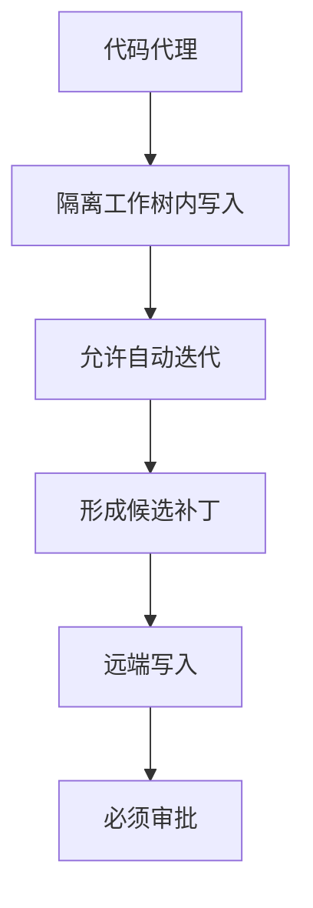
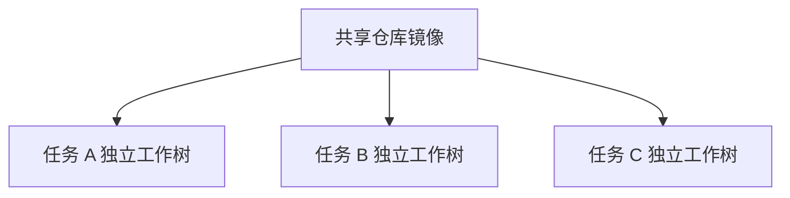
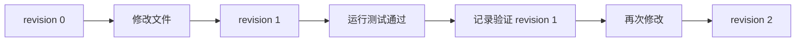
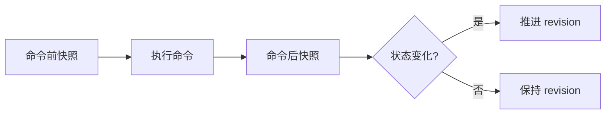
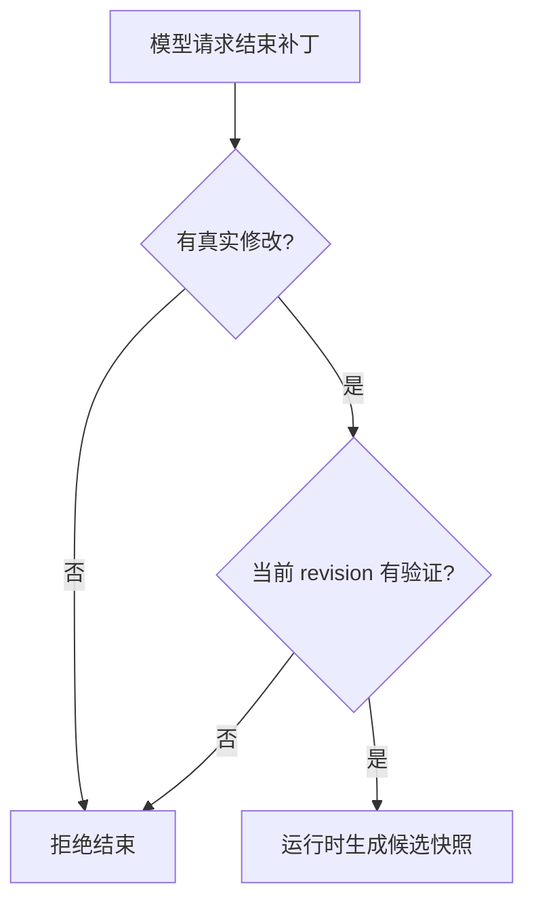
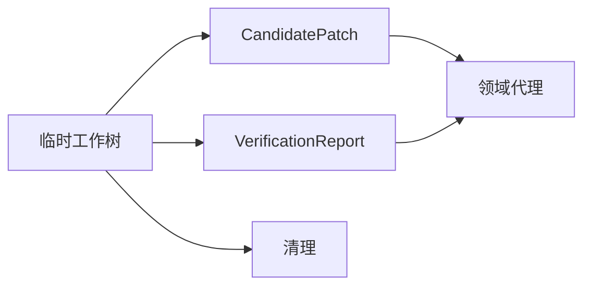
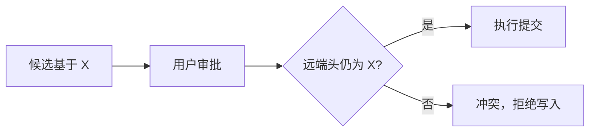
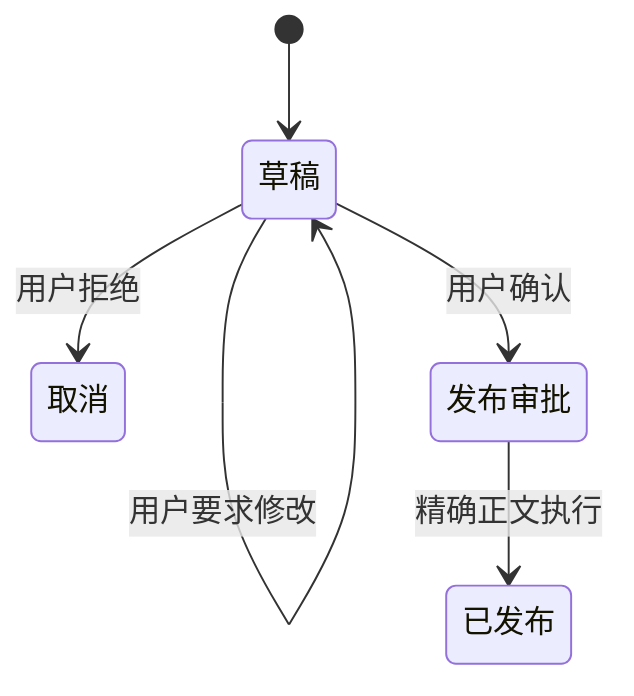

# 08 执行安全、审批与隔离工作区：一份本地候选怎样获得远端写入资格

## 本章先回答什么

GitAgent 最危险的能力不是“模型会写代码”，而是模型写完代码以后还能继续执行 GitHub 写操作。

如果代码生成、命令执行、远端提交、评论发布和合并都处于同一个自治循环，模型一次判断错误就可能直接变成外部副作用。提示词只能降低错误概率，不能成为权限边界。

所以这一章的主线不是安全规则清单，而是：**一份修改怎样从“模型想改代码”开始，经过隔离工作树、真实验证、候选补丁、确定性写计划和用户审批，最后才获得远端写资格。**

### 本章的 STAR 主线

| 阶段 | 本章要解决的问题 |
|---|---|
| 情境 S | 代码代理既能修改文件，又可能触发远端副作用；如果只靠提示词和一次审批，模型可以越过用户审阅边界 |
| 任务 T | 把本地候选构造和远端副作用彻底拆开，让每一次写入都能证明来源、内容、目标和用户授权 |
| 行动 A | 工具可见性 → 工作区隔离 → 命令策略 → 精确提交基线 → 工作树版本 → 真实验证 → 候选补丁 → 确定性写计划 → 精确审批 → 受保护执行 |
| 结果 R | 代码代理可以自主迭代本地候选，但不能直接发布；用户批准的内容和真正执行的内容保持一致，审批后状态变化也能被检测 |

---

## 1. 情境：为什么“让模型改完直接推送”不可接受

先比较两条路径。

### 直接路径


这条路径的问题是，模型同时拥有“生成候选”和“发布候选”的控制权。

### GitAgent 路径


两条路径最大的区别不是多了几个步骤，而是**控制权发生了转移**。

代码代理只负责生成候选。远端写入必须经过领域状态和用户审批。

---

## 2. 任务：安全链要证明哪几件事

一项远端代码写入在真正执行前，需要回答六个问题。

| 问题 | GitAgent 用什么状态证明 |
|---|---|
| 这份修改基于哪个代码版本 | 精确来源提交编号 |
| 模型到底改了哪些文件 | 隔离工作树真实快照 |
| 当前文件状态是否被验证 | 工作树版本 + 验证记录 |
| 准备写到哪里 | 领域代理生成的确定性变更计划 |
| 用户批准了什么 | 精确能力编号和规范化参数 |
| 审批后远端状态是否变化 | 预期头提交编号等并发检查 |

这六个问题共同构成写入资格。

如果其中任何一项无法证明，系统不会把模型文本当成替代证据。

---

## 3. 第一层：模型只能看到自己职责范围内的能力

权限边界从工具发现阶段开始。

| 代理 | 可以看到的写能力 | 看不到的能力 |
|---|---|---|
| 主代理 | 无普通远端写能力 | GitHub 提交、评论、合并等 |
| 仓库代理 | 领域相关远端写入口，通常需要审批 | 其他领域写操作 |
| 议题代理 | 议题字段、评论、修复工作流相关写入口 | 合并请求无关写操作 |
| 合并请求代理 | 审阅、分支提交、合并等受保护能力 | 无关领域写操作 |
| 代码代理 | 隔离工作区内本地文件修改 | GitHub 远端写操作 |

这意味着代码代理从工具层面就没有“推送远端”的接口。

提示词会告诉它不要尝试远端写入，但真正边界是能力发现。

---

## 4. 为什么代码代理可以本地写，却不需要每次编辑都审批

普通写能力通常需要审批。

代码代理的本地编辑是一个受隔离条件约束的例外。

如果每次改一行代码都让用户审批，代码代理无法形成正常的“读取—修改—测试—再修改”循环。

GitAgent 把风险边界放在工作区外侧：



本地免审批的前提是：当前代理确实是代码代理，并且运行时已经创建有效工作树。

这不是“代码代理拥有本机写权限”，而是“代码代理拥有当前候选工作区的局部写权限”。

---

## 5. 工作区根目录为什么不能由模型提供

假设本地写工具允许参数中传入“安全根目录”。

模型完全可以把 `/tmp`、用户目录或其他路径声明成自己的工作区。

所以工作区根目录不是工具参数，而是运行时事实。


只有代码代理拥有活动工作树时，执行框架才把真实根目录注入能力调用上下文。

模型不能伪造这项信息。

---

## 6. 本地文件能力怎样保证路径没有逃出工作树

本地写能力的风险不只来自绝对路径，还来自路径解析和符号链接。

GitAgent 需要阻止：

- `../` 路径穿越；
- 绝对路径指向工作区外；
- 符号链接跳到其他目录；
- 删除非普通文件；
- 把会话、记忆或其他状态目录当成代码目标。

路径检查关注解析后的真实位置，而不是字符串是不是以工作区路径开头。

| 看起来安全的字符串检查 | 真实风险 |
|---|---|
| 路径以工作区前缀开头 | 中间符号链接仍可能跳出工作区 |
| 不出现 `..` | 绝对路径仍可能越界 |
| 文件名来自模型 | 模型可以构造恶意目标 |

因此本地写权限必须和运行时工作区根目录、真实路径解析一起使用。

---

## 7. 为什么命令执行不能和普通文件工具使用同一权限规则

一个 Shell 能力可以运行测试，也可以删除文件、安装依赖、下载脚本。

只把它标成“写能力”或“读取能力”没有足够表达力。

GitAgent 为命令单独设置命令级策略。

命令经过词法解析后，再判断程序和参数。


这避免“命令开头是 pytest”就被视为安全。

例如 `pytest && <其他命令>` 的风险来自整条 Shell 组合，不来自第一个程序名。

---

## 8. 代码代理的命令策略为什么只允许观察和真实验证

代码补丁阶段需要两类命令。

| 类型 | 目的 | 例子 |
|---|---|---|
| 观察 | 读取 Git 状态和环境信息 | 状态、差异、历史、版本信息 |
| 真实验证 | 验证候选代码 | 测试、类型检查、静态检查、编译、构建 |

安装依赖、发布包、任意下载执行等操作不属于这条自动补丁链。

GitAgent 的目标不是给代码代理一个通用开发终端，而是给它完成候选构造所需的最小命令集合。

---

## 9. 为什么命令策略中的“需要审批”在代码代理里会变成拒绝

远端写能力得到“需要审批”后，可以等待用户确认。

本地命令不能使用同一逻辑。

否则模型可以把一个不在安全命令集合中的系统命令包装成：

> 这个命令需要用户批准。

用户一批准，沙箱边界就被人工审批穿透。

所以代码工作区中的含糊命令不会进入人工放行，而是直接拒绝。

这条规则可以概括成：**审批不能替代隔离。**

---

## 10. 候选工作树为什么必须从精确提交开始

用户说“修改 main”还不足以建立候选基线。

分支名称会移动。代码代理开始工作和结束工作之间，远端默认分支可能已经出现新提交。

所以变更请求需要一个完整来源提交编号。


如果目标提交在本地镜像里不存在，系统会抓取远端再寻找这一个提交。

目标提交仍不可用时，任务失败。

系统不会悄悄换成“现在最新的 main”继续修改。

这保证候选补丁有确定基线。

---

## 11. 为什么使用共享仓库镜像加独立工作树

如果每个代码任务都完整克隆一次仓库，成本很高。

GitAgent 复用本地仓库镜像，再为每个任务建立独立 detached worktree。



共享镜像负责 Git 对象和远端抓取。独立工作树负责具体文件修改。

这种结构同时获得缓存复用和任务隔离。

---

## 12. 共享镜像为什么还需要资源锁

虽然任务工作树不同，Git 的 worktree 元数据仍然属于共享镜像。

以下操作会修改共享状态：

- clone / fetch；
- worktree add；
- worktree remove；
- worktree prune。

所以它们使用同一个“仓库缓存写资源”。

普通工作树内文件编辑不需要一直持有这把锁。

这把并发边界放在真正共享的地方，而不是把整个代码任务串行化。

---

## 13. 工作树版本编号为什么是验证链的核心

模型说“我运行过测试”没有意义，除非系统知道测试覆盖的是当前代码状态。

工作树因此维护一个单调版本编号。



到了 revision 2，revision 1 的测试结果不能继续证明当前代码有效。

候选结束检查需要回答的是：

```text
最近有效验证版本 == 当前工作树版本 ?
```

这比“本任务曾经运行过测试”严格得多。

---

## 14. 哪些动作会推进工作树版本

### 本地文件写、编辑、删除

能力执行成功后会说明内容是否实际变化。只有真实变化才推进版本。

### 命令导致的文件变化

部分验证或构建命令也可能修改文件。

因此执行命令前后会读取工作树状态。



版本跟实际工作树内容绑定，不跟某个工具名称绑定。

---

## 15. 工作树状态为什么连未跟踪文件也要算进去

Git 差异只能覆盖已跟踪文件变化。

代码代理还可能新增未跟踪文件。

工作树状态会同时捕获：

- 跟踪文件二进制差异；
- 未跟踪文件路径；
- 未跟踪普通文件内容；
- 符号链接目标；
- 非普通文件模式信息。

这样命令新建文件也能被版本变化检测出来。

工作树版本因此代表“Git 可见修改 + 未跟踪内容”的整体状态。

---

## 16. 真实验证记录到底保存什么

受命令策略认可的测试、类型检查、静态检查、编译和构建执行后，会生成验证观察。

| 字段 | 用途 |
|---|---|
| 命令 | 知道执行了什么检查 |
| 退出状态 | 判断通过或失败 |
| 输出尾部 | 给模型和人工审阅提供有限证据 |
| 错误尾部 | 解释失败原因 |
| 不可用原因 | 区分“失败”和“工具不存在” |
| 工作树版本 | 证明检查覆盖哪一版代码 |

完整日志不会无限进入候选补丁。系统保留足够的验证证据和有界输出。

---

## 17. 验证工具不可用时为什么不能写成“通过”

某些仓库环境可能缺少测试工具。

这种情况进入“不可用”或跳过状态，而不是通过。

| 情况 | 验证报告语义 |
|---|---|
| 命令执行并退出 0 | 通过 |
| 命令执行并失败 | 失败 |
| 命令在当前环境不可用 | 跳过 / 不可用 |

这让人工审阅能够区分“验证成功”和“没有办法验证”。

---

## 18. 为什么模型不能用一句“完成了”结束补丁任务

补丁模式有专用运行时结束动作。

模型调用结束动作后，运行时自己检查：

- 工作树是否真的有变化；
- 当前工作树版本是否有真实验证；
- 可用验证是否覆盖当前版本；
- 最终文件快照是否满足确定性代码检查。



模型只有“请求结束”的权力，没有“宣布结束条件成立”的权力。

---

## 19. 候选补丁为什么必须从真实工作树快照生成

结束检查通过后，系统读取工作树当前状态，形成候选补丁。

候选保存：

- 新增文件；
- 修改文件；
- 删除文件；
- 最终文件正文；
- Git 补丁；
- 摘要；
- 根因；
- 风险；
- 后续验证要求。

路径还会再次检查是否仍在工作树内，修改对象必须是普通文件。

模型不能直接返回一份“这些是我改后的文件”作为候选真相。

**候选真相来自文件系统，不来自模型陈述。**

---

## 20. 候选形成后为什么要清理工作树

候选补丁和验证报告已经把远端写入需要的事实结构化保存下来。

临时工作树不应该继续成为后续审批和写入的隐式依赖。

候选生成后，工作树被清理。

领域代理接收的是稳定产物：



这把“候选构造阶段”和“远端发布阶段”明确切开。

---

## 21. 领域代理怎样把候选补丁变成远端写计划

不同业务场景的远端动作不同。

| 场景 | 候选最终怎样进入 GitHub |
|---|---|
| 普通仓库修改 | 精确提交到默认分支 |
| 议题代码修复 | 创建分支 → 提交候选 → 发布分支 → 创建草稿合并请求 |
| 合并请求内修复 | 提交到当前合并请求头分支 |
| 议题回复 | 发布用户确认后的精确草稿 |
| 合并请求审阅 | 发布精确审阅正文和事件类型 |
| 合并请求合并 | 合并当前已审阅头提交 |

这些计划不是模型自由生成的一段说明，而是结构化能力调用列表。

审批和执行都使用同一组规范化调用。

---

## 22. 普通仓库修改为什么绑定默认分支当前头提交

仓库候选在来源提交 X 上生成。

用户审批期间，默认分支可能已经从 X 前进到 Y。

直接把候选写到现在的默认分支，可能覆盖一个模型没有看过的新状态。

所以默认分支提交计划会绑定预期头提交 X。



这属于乐观并发控制：审批绑定的是一个确定版本，不是一个会移动的分支名称。

---

## 23. 议题修复为什么不能直接写默认分支

议题修复具有更强的人工作业边界。

GitAgent 固定采用：


草稿合并请求给用户和协作者留下代码审阅机会。

审批覆盖整条顺序计划，而不是只批准“修复这个议题”。

每一步必须按计划顺序消费授权。

---

## 24. 合并请求补丁为什么只能写当前头分支

合并请求代理在生成补丁前读取当前头分支和头提交。

代码代理从该精确提交建立工作树。

候选通过验证后，远端提交必须满足：

- 当前代理仍然是合并请求代理；
- 文件和删除集合完全等于候选；
- 提交说明与候选一致；
- 预期头提交等于候选来源提交；
- 目标分支仍然是当前合并请求头分支。

外部派生仓库的合并请求不会自动走直接提交路径。

系统不会假设当前凭据有权安全修改另一个仓库的分支。

---

## 25. 合并为什么不仅要审批，还要绑定“准备合并”状态

“用户批准合并”并不等于任何时候都能合并同一个编号。

合并请求代理会先形成结构化合并准备状态。

它综合：

- 合并请求是否开放；
- 是否为草稿；
- 代码审阅是否有阻塞问题；
- 实现与目标是否一致；
- 当前有效人工审阅；
- 当前持续集成状态。

只有状态达到“准备合并”，合并调用才通过受保护检查。

合并参数还绑定当前已审阅头提交。

所以审批对象是：**某个具体头提交状态下、已满足合并条件的合并请求。**

---

## 26. 议题回复为什么也需要“草稿—确认—发布”链

评论虽然不改代码，也属于外部可见写操作。

议题代理先生成草稿，让用户看到确切文本。



发布参数必须与当前草稿完全一致。

这样用户审阅的文本和真正发布的文本没有漂移空间。

---

## 27. 为什么修改后的审阅正文必须创建新审批

审批绑定的是精确参数。

用户如果在审批阶段要求“把审阅正文改一下”，参数已经变化。

旧审批不能继续授权新内容。

GitAgent 会：

1. 使旧审批失效或被替代；
2. 闭合旧工具调用；
3. 使用新正文形成新工具调用；
4. 生成新的审批计划。

这是一条通用原则：**参数变化，授权身份就变化。**

---

## 28. 审批到底绑定了什么

审批不是一个布尔值。

它保存：

- 审批编号；
- 会话；
- 仓库；
- 给用户看的摘要；
- 完整能力调用列表；
- 尚未消费的调用顺序；
- 用户决策。

真正执行每一步时，需要满足：

```text
当前会话一致
+ 用户已明确批准
+ 当前能力编号一致
+ 当前规范化参数一致
+ 当前调用正好是剩余计划第一项
```

匹配后只消费这一项。

这让审批从“允许写”变成“允许按这个顺序执行这些精确动作”。

---

## 29. 多步骤计划为什么中间失败后不能继续消费授权

议题修复计划有多步。

假设创建分支成功，提交失败。

后面的发布分支和创建草稿合并请求不能继续执行。

因为这两个动作建立在“候选已经正确提交”这个前提上。

所以中间步骤失败后，剩余审批失效。


审批顺序和工作流顺序是同一条约束。

---

## 30. 用户自然语言怎样变成审批决策

用户在等待审批时可能输入：

- “可以”；
- “不要发”；
- “把标题改一下”；
- “这会改哪些文件？”；
- 一句无法确定含义的话。

应用服务先把自然语言分类成：批准、拒绝、修改、提问、含糊。

| 用户意图 | 是否消费审批 |
|---|---|
| 批准 | 是 |
| 拒绝 | 结束或失效 |
| 修改 | 否，形成新提案 |
| 提问 | 否 |
| 含糊 | 否，继续等待 |

审批存储不直接解析开放文本，只接收确定枚举。

自然语言理解和权限消费因此分层。

---

## 31. 用户批准后，为什么仍然不能直接调用 GitHub

审批是授权凭据，不是跳过安全链的后门。

批准后的调用仍然经过：


受保护检查还会验证候选补丁、实体编号、草稿正文、预期头提交等业务事实。

用户批准只解决“这个动作是否被授权”，不能替代“这个动作现在是否仍然合法”。

---

## 32. 审批等待跨进程恢复时，为什么要重新计算写计划

暂停快照会保存审批编号和完整调用计划。

进程重启后，系统不能直接信任保存的参数。

对于代码变更类计划，会根据当前快照中的：

- 变更请求；
- 候选补丁；
- 验证报告；

重新生成计划，再逐项和保存计划比较。

不一致时拒绝恢复。

这防止持久化快照中的写参数被修改后通过“恢复”获得授权。

---

## 33. 写操作网络超时为什么仍然不能因为“已经审批”就重试

用户批准的是一次精确调用。

这不等于授权系统在网络异常后重复执行任意次数。

远端写调用如果出现结果不确定状态，系统不会自动重试。

审批解决权限问题；副作用不确定性属于执行语义问题。

两者不能互相替代。

---

## 34. 用一次仓库修改把整章串起来

用户要求修复默认分支上的一个缺陷。

### 第一步：仓库代理形成变更请求

系统读取当前默认分支头提交 X，并把 X 作为候选来源基线。

### 第二步：代码代理创建隔离工作树

共享仓库镜像中创建基于 X 的 detached worktree，检查 `HEAD == X`。

### 第三步：本地修改和验证

模型可以在工作树内编辑。每次真实变化推进 revision。测试结果绑定当前 revision。

### 第四步：请求结束补丁

运行时检查当前 revision 已被真实验证，读取实际工作树快照，生成候选补丁和验证报告，随后清理工作树。

### 第五步：仓库代理生成远端计划

计划只包含一项默认分支提交，文件内容等于候选，预期头提交为 X。

### 第六步：用户审批

审批保存会话、能力、规范化参数和顺序。系统暂停等待。

### 第七步：执行前重新检查

用户批准后，原调用重新进入能力层和受保护检查。远端头仍为 X 时才执行。

### 第八步：远端状态变化

如果默认分支已经前进到 Y，提交返回冲突，不把候选静默写到新基线上。

这条链说明 GitAgent 的安全目标不是“阻止模型写代码”，而是**确保本地候选和远端副作用之间存在一条可验证的资格链。**

---

## 35. 结果：安全链最终保证了什么

| 设计 | 得到的结果 |
|---|---|
| 工具发现最小权限 | 主代理和代码代理无法直接调用不属于角色的远端写能力 |
| 运行时注入工作区根目录 | 模型不能伪造本地安全边界 |
| 路径与命令二次策略 | 本地修改被限制在候选工作区和允许命令集合 |
| 精确来源提交 | 候选基线可证明 |
| 工作树 revision | 验证结论和当前代码状态绑定 |
| 真实快照生成 CandidatePatch | 模型不能伪造最终文件内容 |
| 候选与发布分离 | 代码代理可以迭代，但不能直接推送 |
| 确定性写计划 | 用户审批对象和真正执行对象可以精确比较 |
| 审批按参数和顺序消费 | 批准不能变成长期写权限 |
| 预期头提交 | 审批后远端变化能够被检测 |
| 恢复时重算计划 | 持久化状态不能篡改待执行动作 |
| 写入结果不确定不自动重试 | 审批不会放大网络故障副作用 |

代价是一次代码修改要经过多层结构化状态，链路明显长于“模型改完直接 push”。

GitAgent 接受这部分复杂度，因为安全的关键不是“模型更听话”，而是**模型即使判断错误，也无法单独把错误候选变成未经审阅的远端副作用。**

---

## 36. 复习时怎样讲这一章

可以按下面顺序复述：

1. GitAgent 先把本地候选构造和远端发布拆开，代码代理没有 GitHub 写权限；
2. 代码代理的本地写例外只在运行时注入的隔离工作树内成立；
3. 文件路径和命令都有第二层安全策略，命令审批不能穿透沙箱；
4. 工作树从精确提交建立，并校验 HEAD，不会自动改用新默认分支；
5. 文件或命令造成的实际变化推进 revision，真实验证记录自己覆盖的 revision；
6. 模型只能请求结束补丁，运行时从真实工作树快照生成 CandidatePatch；
7. 领域代理根据业务类型生成固定远端写计划；
8. 审批绑定会话、能力、参数和顺序，参数变化就需要新审批；
9. 用户批准后，调用仍要重新经过能力层和受保护业务检查；
10. 写计划绑定预期头提交，恢复时重新计算，网络不确定写入也不会自动重试。

## 37. 代码定位

| 想核对的问题 | 代码位置 |
|---|---|
| 代理能发现和调用哪些写能力 | `capabilities.yaml`、`gitagent/capability/policy.py` |
| 审批请求怎样绑定精确调用并按顺序消费 | `gitagent/harness/constraints/approval.py` |
| 受保护能力、审批等待和恢复怎样执行 | `gitagent/harness/structured_call_dispatcher.py` |
| 隔离仓库镜像、工作树、revision 和快照 | `gitagent/harness/coding_workspace.py` |
| 仓库、议题修复等写计划怎样生成 | `gitagent/harness/mutation_plans.py` |
| 候选的确定性代码检查 | `gitagent/harness/validation/code.py` |
| 本地能力提交怎样推进工作树 revision | `gitagent/harness/context/state.py` |
| 代码代理补丁结束门槛 | `gitagent/agents/coding.py` |
| 审批意图和暂停恢复 | `gitagent/application/service.py` |
