# 09 领域代理与业务工作流：一个用户任务怎样在代理之间交接

## 本章先回答什么

GitAgent 没有用一个“大代理”同时负责会话理解、议题处理、合并请求审阅、仓库修改和代码修复。

原因不是为了增加代理数量，而是这些任务需要不同证据、不同权限和不同结束条件。一个负责会话路由的代理不需要 GitHub 合并权限；一个负责代码修改的代理需要本地工作区写权限，却不应该拥有远端发布权限。

所以这一章的主线是：**用户任务怎样从主代理进入领域代理，领域代理怎样收集足够事实，再把代码层任务交给代码代理，结构化产物又怎样返回并驱动后续业务流程。**

### 本章的 STAR 主线

| 阶段 | 本章要解决的问题 |
|---|---|
| 情境 S | 一个通用代理面对过大的工具集合、模糊权限和不同业务状态，难以保证最小权限和证据完整性 |
| 任务 T | 用固定代理拓扑把会话路由、领域决策和代码工作分开，并定义清晰的证据与产物交接协议 |
| 行动 A | 主代理识别领域 → 领域代理收集实体证据 → 按任务模式委派代码代理 → 子代理返回结构化产物 → 领域代理形成业务结论或写计划 → 主代理完成会话表达 |
| 结果 R | 每类代理只持有完成自身职责所需的工具和状态，代码分析与业务决策可以复用，同时高风险写操作仍由领域状态约束 |

---

## 1. 情境：为什么一个通用大代理会越来越难控制

假设只有一个代理，它同时拥有仓库读取、议题修改、合并请求审阅、本地文件编辑、Shell、提交和合并能力。

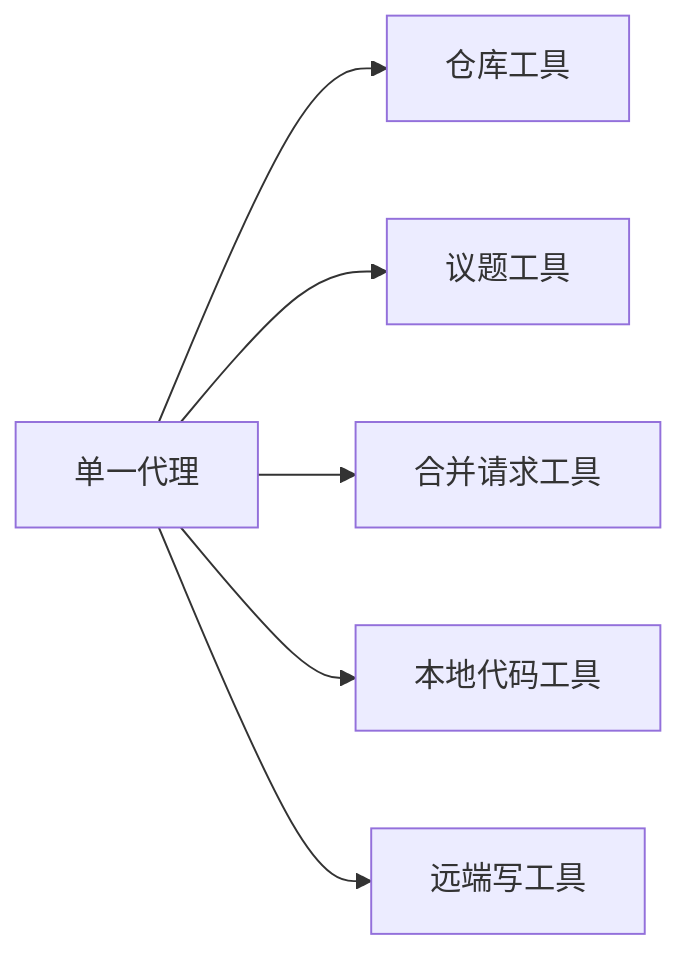

问题会同时出现在三个层面。

| 问题 | 单一代理的困难 |
|---|---|
| 工具选择 | 每轮需要在大量语义相近工具中选择 |
| 权限 | 路由任务也暴露高风险写权限 |
| 证据 | 不同业务需要的前置事实难以统一约束 |
| 状态 | 草稿回复、代码补丁、审阅和合并拥有不同结束条件 |
| 恢复 | 一份运行状态要容纳所有业务工作流 |

GitAgent 选择固定层级代理树，而不是让一个模型承担全部角色。

---

## 2. 任务：五类代理分别负责什么

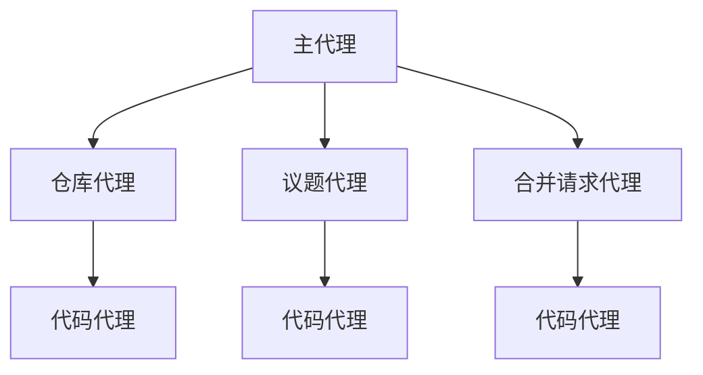

| 代理 | 核心职责 | 典型权限边界 |
|---|---|---|
| 主代理 | 理解用户目标、选择领域、维持会话 | 只使用少量读取能力，不直接远端写 |
| 仓库代理 | 仓库探索、解释、历史、方案、普通代码修改 | 可读仓库，远端默认分支写入需要审批 |
| 议题代理 | 议题查询、管理、回复、议题修复 | 只处理议题相关远端状态 |
| 合并请求代理 | 审阅、持续集成、修改、发布审阅、判断合并条件 | 只处理合并请求相关高风险动作 |
| 代码代理 | 代码语义分析、方案、审阅、持续集成分析、候选补丁 | 可读代码；补丁模式只能写隔离工作树 |

这种划分围绕两个边界：**谁理解业务实体，谁处理代码语义。**

领域代理知道当前议题或合并请求是什么；代码代理知道怎样阅读和修改代码。

---

## 3. 主代理为什么只负责“选择领域”，不直接处理所有细节

主代理持有最长的会话历史。它需要理解用户是在问仓库、议题还是合并请求。

如果它同时承担领域内部全部工具调用，主上下文会包含大量文件读取、差异、日志和审阅记录。

主代理的工作更接近一个路由和会话协调层。

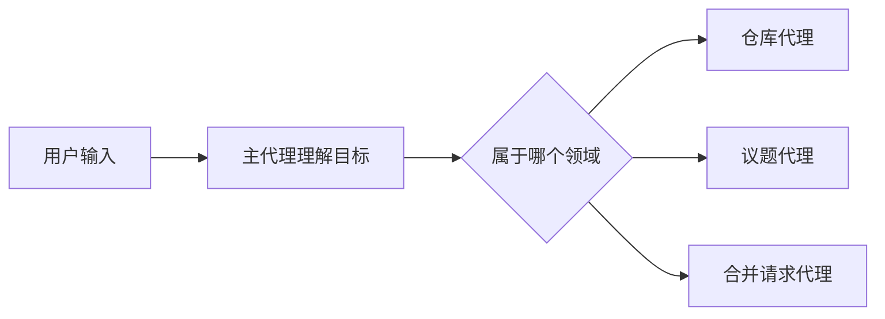

它把完整领域任务和实体编号交给子代理，不把自己的自然语言推理过程当成交接协议。

---

## 4. 主代理创建领域代理时，究竟交接了什么

子代理不是拿到一句“帮我处理一下”。

运行时会建立一份独立上下文，并写入结构化信息。

| 交接内容 | 作用 |
|---|---|
| 当前目标 | 子代理知道要完成什么 |
| 仓库身份 | 所有读取和写入有明确范围 |
| 实体类型和编号 | 议题或合并请求不用重新从文本猜编号 |
| 父 `run_id` 和 `call_id` | 子代理结果能回到原父调用 |
| 长期记忆指导 | 当前项目约定可进入领域任务 |

领域代理因此从一份明确任务状态开始，而不是从父代理全部消息复制开始。

---

## 5. 为什么领域代理还需要自己的消息线程

领域任务可能需要很多步骤。

合并请求代理可能读取元数据、差异、审阅、工作流运行和日志；仓库代理可能多次搜索符号和文件。

这些内部消息保留在领域代理自己的 `run_id` 线程中。

父主代理只看到：

```text
一次领域代理调用
→ 一次领域代理结果
```

这降低主代理上下文压力，也让领域代理的恢复可以按自己的运行编号重建。

---

## 6. 仓库代理面对的任务为什么要分“解释、方案、补丁”

仓库相关请求表面上都叫“看代码”，实际目标不同。

| 用户目标 | 代码代理模式 | 需要的产物 |
|---|---|---|
| 解释某个模块 | explain | 结构化代码解释 |
| 给出修改思路 | plan | 结构化修改方案 |
| 真正修改仓库 | patch | CandidatePatch + VerificationReport |

仓库代理负责判断任务需要哪一种结果。

代码代理不使用一个自由文本输出覆盖所有场景，因为父代理后续需要不同字段做不同决策。

---

## 7. 仓库代理怎样先收集证据，再决定是否委派代码代理

仓库代理可以直接使用目录、搜索、文件、符号和历史读取能力。

简单查询可能在领域代理内部完成。

需要代码语义分析或修改时，它把当前已观察到的证据打包成代码任务。

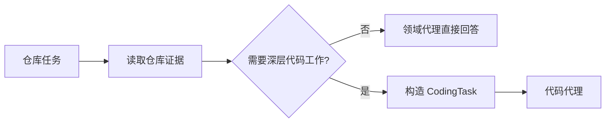

代码代理得到的证据来自已执行能力结果，而不是父代理口头复述。

---

## 8. 仓库修改为什么还要有一份 ChangeRequest

用户说“修一下这个问题”只描述目标，没有定义候选的版本边界。

仓库代理在进入补丁模式时形成 `ChangeRequest`。

它可以保存：

- 仓库；
- 修改说明；
- 来源提交；
- 基础分支；
- 目标文件；
- 建议标题等。

`ChangeRequest` 的职责不是描述最终补丁，而是固定“这份候选是在什么业务目标和什么代码基线上生成”。

后面的 CandidatePatch 描述“实际改成什么”。VerificationReport 描述“这份实际状态怎样被验证”。

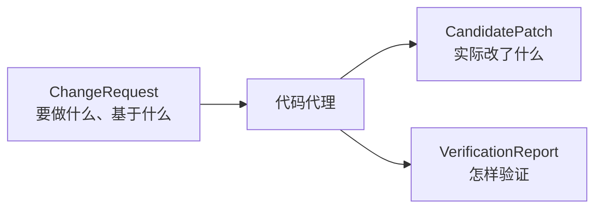

三者承担不同职责。

---

## 9. 代码代理完成后，为什么不是把最终文本交回父代理就结束

子代理会返回自然语言结果，但父代理真正依赖的是结构化产物。

仓库代理在子代理完成后，把对应字段复制回自己的领域上下文。

| 代码模式 | 回传产物 | 父代理用途 |
|---|---|---|
| explain | 解释对象 | 汇总文件、符号和解释结果 |
| plan | 修改方案 | 返回用户或支持后续工作 |
| patch | 候选补丁、验证报告、变更请求 | 判断是否生成远端写计划 |

补丁候选存在但验证不通过时，仓库代理不会创建默认分支写提案。

这说明父子代理交接不是“文本接力”，而是“结构化状态迁移”。

---

## 10. 议题代理为什么有三条不同业务路径

议题领域里至少有三种任务。

| 路径 | 目标 | 是否需要代码代理 |
|---|---|---|
| 议题查询或字段管理 | 读取、创建、更新、锁定议题 | 通常不需要 |
| 议题回复 | 生成并发布讨论文本 | 不需要代码代理 |
| 议题代码修复 | 根据议题内容修改仓库 | 需要 |

把三类任务混成一个流程会让草稿审批和代码补丁审批互相干扰。

所以议题代理内部还维护独立回复工作流状态。

---

## 11. 议题代码修复为什么必须先真正读取议题

用户可能只说“修复 #123”。

代码代理不能只根据这个编号开始猜问题。

议题代理在创建代码任务前，要求上下文里已经有 `github.get_issue` 的成功观察结果。

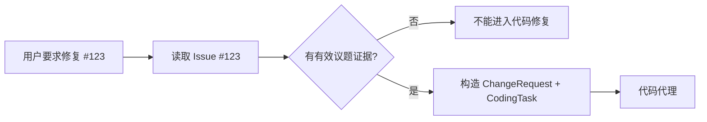

代码任务证据会带有限的议题标题、正文、标签、状态等字段。

这样代码代理处理的是“已读取的当前议题”，不是编号背后的想象内容。

---

## 12. 议题修复完成后，为什么创建草稿合并请求而不是直接提交默认分支

代码代理返回验证通过的候选后，议题代理不会沿用仓库代理的默认分支提交计划。

议题修复使用固定发布路径：

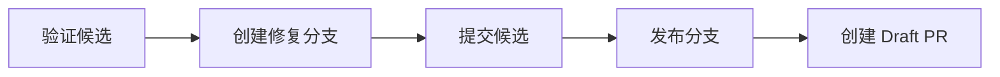

原因是议题修复通常需要独立审阅过程。

草稿合并请求还会带人工审阅包，包含候选摘要、根因、文件、验证、风险和相关议题。

领域代理决定了“同样一份 CandidatePatch 在这个业务场景应该怎样发布”。

---

## 13. 议题回复为什么完全不走代码代理

用户要求“回复这个 Issue”时，核心风险是公开文本，而不是代码语义。

议题代理自己读取议题和评论，然后生成草稿。

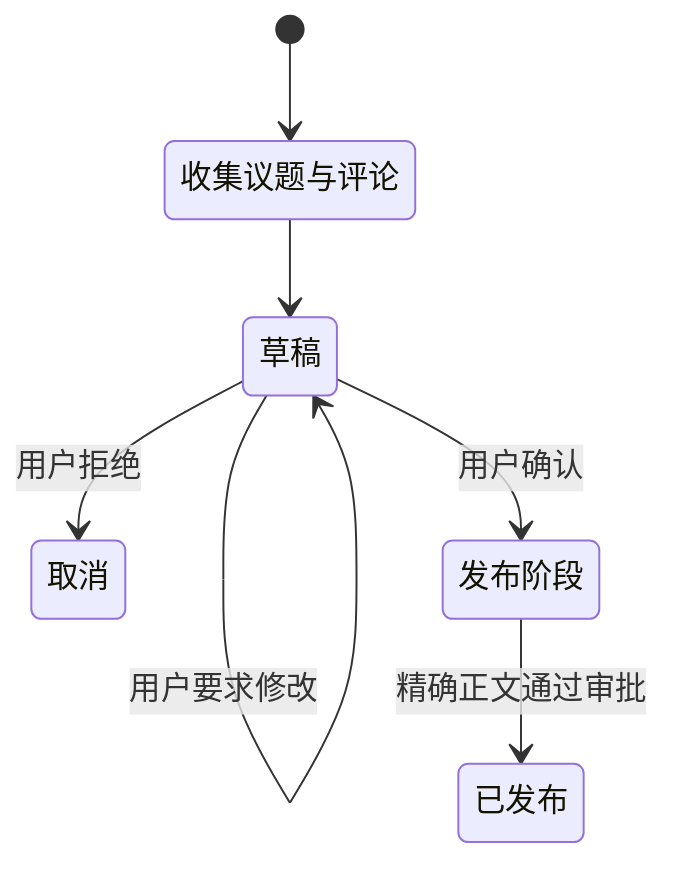

这个流程说明多代理拆分并不是“所有复杂任务都交给代码代理”。

只有代码语义任务才进入代码代理。

---

## 14. 合并请求代理为什么比仓库代理需要更多种证据

合并请求不是单纯代码差异。

它同时包含：

- PR 元数据；
- 变更文件；
- 代码差异；
- 普通评论；
- 正式 Review；
- 工作流运行；
- CI Job 日志；
- 头分支和基线信息。

这些证据回答的问题不同。

| 证据 | 回答什么 |
|---|---|
| PR 标题和正文 | 目标是什么 |
| changed files / diff | 实际改了什么 |
| Review | 人工审阅当前状态是什么 |
| 评论 | 讨论中提出了什么问题 |
| workflow runs | 当前持续集成是否完成 |
| job logs | 失败具体发生在哪里 |
| head SHA | 当前候选和合并动作绑定哪个版本 |

合并请求代理需要把这些事实组织成不同任务模式的证据包。

---

## 15. 为什么不同代码任务要拿不同证据包

代码审阅、CI 分析和审阅讨论不是同一问题。

| 代码代理模式 | 主要证据 |
|---|---|
| review | PR 目标、差异、变更文件、读取到的文件内容 |
| ci | 当前 workflow runs、job logs、代码差异 |
| review_dialogue | 正式 Review、普通评论、代码证据 |
| patch | 当前 PR 元数据、head SHA、变更文件和代码证据 |

领域代理不会把所有数据无差别塞给代码代理。

这样既减少上下文，也让代码代理知道当前要回答的具体问题。

---

## 16. 代码代理为什么不只是“写代码代理”

它承担所有需要代码语义理解，但又不应该拥有领域远端写权限的工作。

当前主要模式可以分成两类。

### 分析型

- explain；
- review；
- plan；
- review_dialogue；
- ci。

### 修改型

- patch。

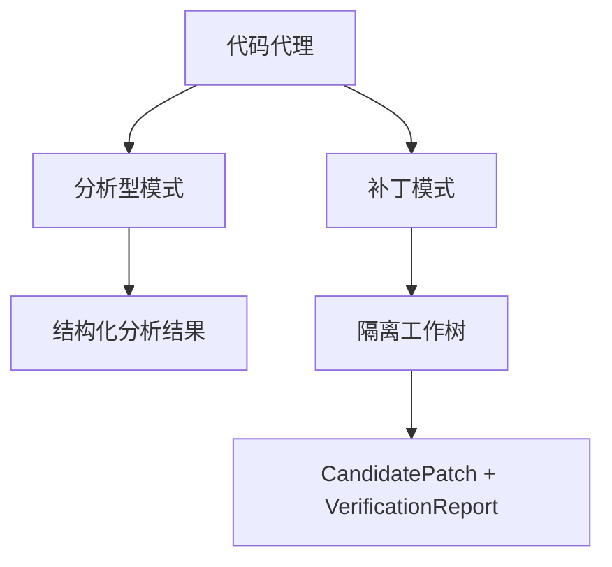

这种设计让代码能力成为可复用底层能力，而领域权限仍留在父代理。

---

## 17. 分析型代码任务为什么也必须返回结构化结果

代码审阅不能只返回一句“看起来没问题”。

父合并请求代理还要用审阅结果判断合并准备度。

因此审阅结果包含结构化字段，例如：

- 摘要；
- 阻塞问题；
- 影响；
- 建议；
- 测试评估；
- 风险；
- 审阅建议；
- 与目标是否一致。

模型在收集完证据后，需要调用专门结果工具返回这些字段。

普通最终文本没有结构化结果时，运行时不会把它当成完整审阅产物。

---

## 18. 为什么分析型代码代理可以继续读取，但不能继续委派代理

代码代理需要在形成结论前继续读取代码、搜索符号或查询参考资料。

所以它仍然可以使用读取能力。

但它位于固定代理树最深层，不能再创建新的子代理。

| 能力 | 允许吗 | 原因 |
|---|---|---|
| 继续读取仓库 | 允许 | 完成代码语义分析所需 |
| 使用参考检索 | 允许 | 支持代码理解 |
| 本地修改 | 只在 patch 模式工作树内 | 形成候选 |
| 调用另一个代理 | 不允许 | 防止代理树无限扩张和职责重新路由 |
| GitHub 远端写 | 不允许 | 领域发布权留在父代理 |

代码代理职责到代码层结束。

---

## 19. 合并请求审阅结果为什么还不能直接决定“可以合并”

模型代码审阅只是一个证据来源。

真正的合并准备状态还要结合远端事实。

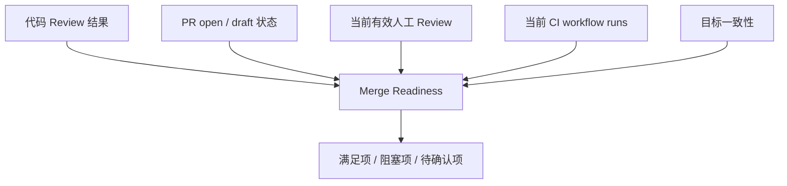

这避免一个模型审阅结论覆盖 GitHub 当前状态。

例如模型认为代码没有问题，但 PR 仍是 Draft，或者 CI 失败，系统仍然不能进入准备合并。

---

## 20. 为什么人工 Review 不能把所有历史状态简单累加

一个审阅者可能先 `REQUEST_CHANGES`，修改完成后又 `APPROVE`。

如果把全部历史事件并列判断，旧的要求修改会永久阻塞合并。

GitAgent 会计算当前有效 Review 状态。

持续集成也有同类问题：同一个 workflow 可能运行多次。旧失败不应该永远代表当前提交失败。

领域判断关注的是**当前有效证据**，不是历史事件总数。

---

## 21. 合并准备状态怎样把多种证据压成一个业务判断

最终状态分成三组事实。

| 分组 | 例子 |
|---|---|
| 已满足 | PR open、不是 Draft、代码审阅无阻塞、CI 已完成未失败 |
| 阻塞项 | Review 要求修改、目标实现不一致、CI 失败 |
| 待确认项 | 尚无人工批准、CI 未完成、代码审阅需要人工确认 |

状态规则是：

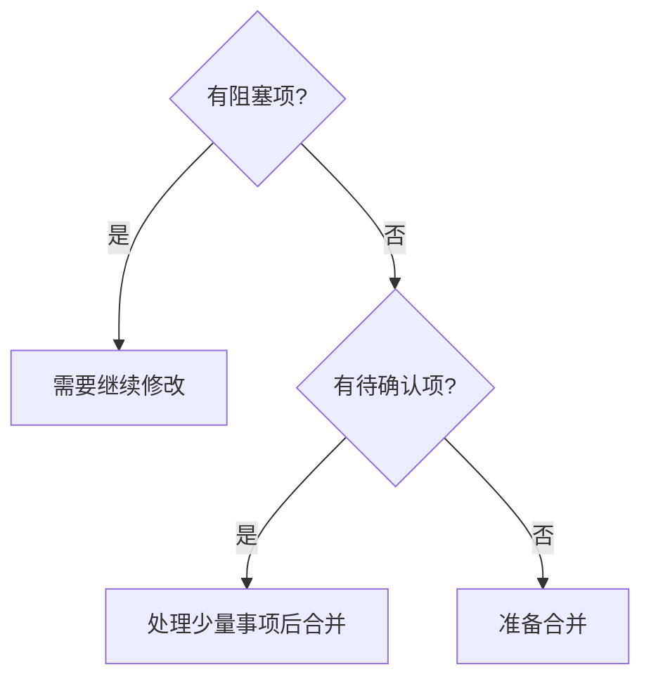

后续合并能力检查的是这份结构化状态，而不是模型文字。

---

## 22. 合并请求补丁为什么必须从当前 head SHA 开始

PR 可能在任务期间继续更新。

合并请求代理进入 patch 模式前，需要已经读取当前 PR 元数据。

它用当前头分支和头提交构造 ChangeRequest。

代码代理在该提交上生成候选。

候选回来后，领域代理只允许把它提交到同一 PR 头分支，并绑定原 head SHA。

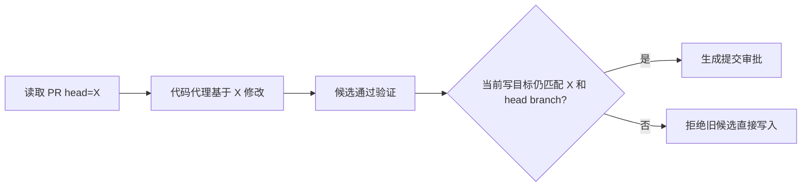

这把 PR 修改和具体版本关联起来。

---

## 23. 为什么 Fork PR 不自动走同一条提交路径

当前 PR 的头分支可能属于另一个仓库。

即使系统能够读这份 PR，也不能假设当前凭据应该自动向外部仓库写入。

所以合并请求代理检测到来源仓库与当前仓库不同后，不创建默认的直接 commit 写计划。

这是领域代理根据业务实体关系增加的边界，不能只靠通用能力权限判断。

---

## 24. 子代理结果回到父代理后，状态怎样继续流转

父代理会根据代码任务模式，把结构化结果放入自己的对应字段。

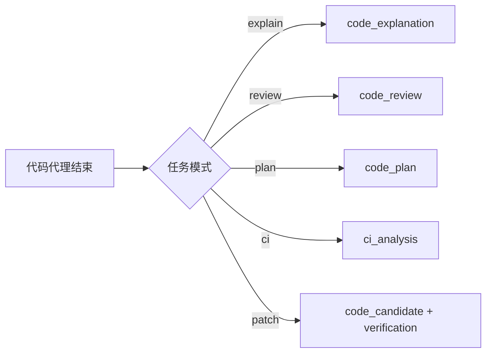

这些字段随后驱动父代理自己的业务逻辑。

例如：

- `code_review` 会触发合并准备判断；
- `code_candidate + verification` 会触发写计划构造；
- `code_plan` 进入领域结果；
- `ci_analysis` 进入 PR 持续集成结论。

父代理不需要重新解析子代理文本。

---

## 25. 为什么领域代理结果也同时有“文本”和“结构化结果”

领域代理有两个消费者。

一个是父主代理，需要一条自然语言工具结果继续会话。

另一个是应用层，需要结构化领域结果用于持久化、展示和后续工作流。

| 输出 | 消费者 | 作用 |
|---|---|---|
| 领域代理最终文本 | 主代理 | 继续自然语言会话 |
| RepositoryResult / IssueAgentResult / PullRequestAgentResult | 应用层 | 保存业务产物、文件、审阅、候选等 |
| 审批等待状态 | 运行时 | 暂停并跨轮恢复 |

同一代理可以同时产生表达层结果和控制层结果。

---

## 26. 三条业务链放在一起看，代理分工会更清楚

### 仓库解释

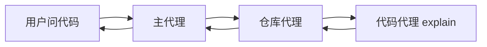

没有远端写入，重点是代码语义结果。

### 议题代码修复

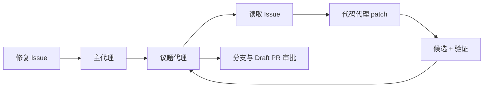

议题证据决定代码任务，领域代理决定候选如何发布。

### 合并请求审阅与合并

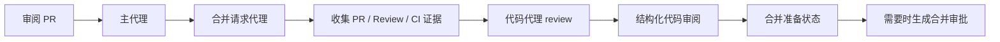

代码代理只给代码判断，最终合并条件由领域代理组合多种事实。

---

## 27. 结果：多代理架构最终解决了什么

| 设计 | 得到的结果 |
|---|---|
| 主代理只负责路由和会话 | 高风险领域工具不会暴露给会话根代理 |
| 领域代理按实体拆分 | Issue、PR、Repository 有各自证据和工作流 |
| 代码代理作为共享代码层 | 解释、审阅、方案和补丁可以复用同一代码能力 |
| 固定代理拓扑 | 权限、恢复和并发深度可控 |
| 子代理独立消息线程 | 领域内部工具历史不会淹没主会话 |
| CodingTask 传递任务和证据 | 父代理不用靠自然语言复述上下文 |
| 结构化代码产物回传 | 父代理能做确定性后续判断 |
| 领域代理生成业务写计划 | 同一候选在不同业务场景使用不同发布方式 |
| 合并准备组合多种证据 | 模型代码审阅不会单独决定破坏性动作 |

代价是系统需要维护父子状态迁移、不同领域结果对象和多套工作流。

GitAgent 接受这部分复杂度，因为代理拆分真正带来的价值不是“多个模型一起工作”，而是**每一层只处理自己能够证明和控制的那部分状态。**

---

## 28. 复习时怎样讲这一章

可以按下面顺序复述：

1. 一个大代理会同时面对过多工具、权限和业务状态，所以 GitAgent 使用固定 Main → Domain → Coding 拓扑；
2. 主代理只识别领域并传递任务、仓库、实体编号和长期指导，不直接远端写；
3. 领域代理负责收集当前业务实体证据，并判断是否需要代码代理；
4. 仓库任务分解释、方案和补丁，补丁使用 ChangeRequest 固定目标和来源基线；
5. 议题修复必须先读取议题，验证候选通过后走分支和 Draft PR；议题回复则使用独立草稿发布流程；
6. 合并请求代理按 review、ci、review_dialogue、patch 等模式构造不同证据包；
7. 代码代理的分析型模式返回结构化结果，补丁模式返回 CandidatePatch 和 VerificationReport；
8. 子代理产物回到父上下文后，领域代理继续形成合并准备状态或远端写计划；
9. 合并准备由代码审阅、PR 状态、当前人工 Review 和 CI 共同决定；
10. 主代理最后只接收领域结果，把业务内部状态重新收束成用户会话。

## 29. 代码定位

| 想核对的问题 | 代码位置 |
|---|---|
| 主代理怎样发现领域并创建子代理 | `gitagent/agents/main.py` |
| 仓库解释、方案、修改怎样委派代码代理 | `gitagent/agents/repository.py` |
| 议题管理、回复和代码修复状态机 | `gitagent/agents/issues.py` |
| PR 证据、代码审阅、CI、补丁和合并准备 | `gitagent/agents/pull_requests.py` |
| 代码代理各任务模式和结构化产物 | `gitagent/agents/coding.py` |
| 代理循环怎样创建和收束 child context | `gitagent/agent_loop/loop.py` |
| 不同领域的远端写计划 | `gitagent/harness/mutation_plans.py` |
| 应用服务怎样处理领域结果和等待恢复 | `gitagent/application/service.py` |
