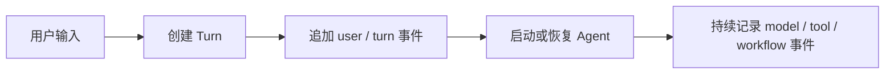
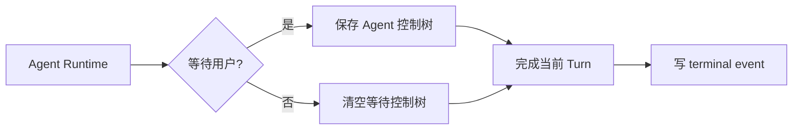
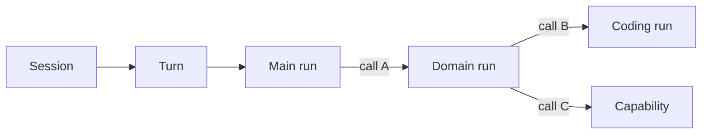
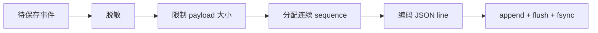
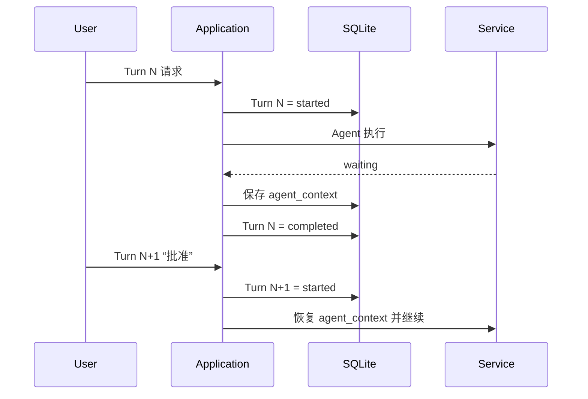
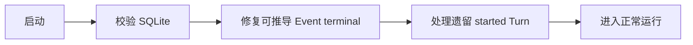
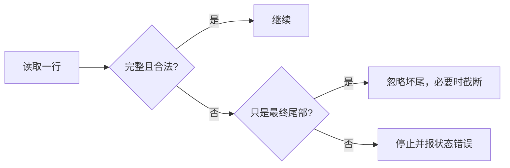
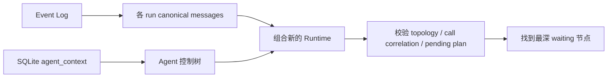
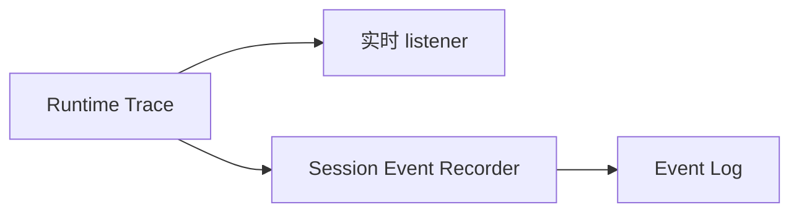

# 09 持久化、恢复与可观测性：一次运行怎样保存，并在重启后安全接上

第 08 章已经出现了一个典型等待点：Mutation Plan 已经生成，用户还没有批准。这个等待可能持续很久，期间进程可以退出。重新启动以后，旧的 Agent 对象、线程池、HTTP 连接和内存 Approval Store 都已经不存在，但系统仍然要知道之前发生过什么、哪棵 Agent 树停在哪里、原 Approval 到底授权了什么。

GitAgent 没有尝试“把整个 Python Runtime 序列化”。它把持久化拆成几类不同的数据：当前业务状态、按时间发生的事件、等待中的控制树。恢复时重新创建运行设施，再把这些持久事实组合成新的 Agent Runtime。

---

## 1. 先分清四类状态

一次用户输入大致会经历下面两段。第一段负责记录 Turn 和运行历史：

第二段负责在运行结束时保存“完成”或“等待”：

持久状态可以分成四类：

| 状态 | 物理位置 | 主要保存什么 | 主要用途 |
|---|---|---|---|
| Session / Turn 当前状态 | SQLite | Session scope、Turn status、working state、时间等 | 快速查询当前业务状态 |
| 等待中的 Agent 控制树 | SQLite 的 Session 记录 | Agent 层级、父子调用、pending、领域产物、读取状态 | 跨进程恢复等待位置 |
| Session Event Log | 每个 Session 的 append-only JSONL | 用户/模型消息、tool call/result、Agent/Workflow 事件、compaction | 重建消息线程、保留顺序历史 |
| Trace / Audit | 进程内；Trace 的稳定子集写入 Event Log | 实时运行过程和 Capability 责任信息 | CLI 展示、调试、分析 |

这里有两个容易混淆的点。所谓 Pause Snapshot 只是“等待中的 Agent 控制树”这个逻辑概念，物理上保存在 SQLite Session 的 `agent_context` 字段里，并没有另一套独立 snapshot 文件。TraceBus 和 AuditLog 本身也不是持久数据库；Trace 中适合长期保存的稳定事件会经 recorder 进入 Event Log，而当前 AuditLog 主要是进程内记录。

---

## 2. Session、Turn、Agent Run 和 Call 构成一条身份链

一个 Session 里可以连续发生很多 Turn；一个 Turn 内可能有 Main、Domain、Coding 多层 Agent；每个 Agent 又会发出多个 Capability 或 child Agent call。恢复不能只靠“最近一条消息”，必须知道每份状态属于谁。

可以把身份层级理解为：

- Session 标识连续会话；
- Turn 标识一次用户输入对应的应用处理；
- Agent run 标识某个具体 Agent 的运行实例；
- call id 标识一次结构化 Agent / Capability 调用以及它的结果。

父子 Agent 的暂停状态还会保存“这个 child 来自父 run 的哪一次调用、调用名称和参数是什么”。恢复时系统不会只相信 JSON 树形关系，还会回到父 Agent 的模型消息线程，确认那里确实存在对应的未闭合 child call，而且名称、参数和 call id 能对应。

因此 run / call identity 不只是日志字段，它们是恢复协议的一部分。恢复出来的 child 必须能证明自己为什么挂在当前父节点下面。

---

## 3. SQLite 保存“现在是什么状态”

SQLite 负责结构化、可事务更新的当前状态。和本章直接相关的内容主要包括：

| 数据 | 主要内容 |
|---|---|
| Session | 会话身份、账户/仓库 scope、标题、时间 |
| Working state | 当前目标、focus、manifest、open question 等 |
| Agent context | 等待中的 Agent 控制树 |
| Turn | sequence、started / completed / failed / interrupted、起止时间 |
| Context summary 边界 | 支持上下文压缩和恢复的摘要边界 |

State Store 会在写入时经过 JSON / 文本校验和敏感信息处理；数据库打开时也会校验 schema metadata、表结构、索引、外键和 SQLite integrity。

一个重要约束是：暂停控制树里不保存模型 `messages`。消息历史由 Event Log 负责。如果同一份可变消息同时存在于 snapshot 和 event history，两边很容易在崩溃窗口产生分叉；现在恢复消息只有一条主要来源，控制状态也有单独权威来源。

这也是 SQLite 与 Event Log 分工的核心：SQLite 适合回答“现在是什么状态”，Event Log 适合回答“按顺序发生过什么”。

---

## 4. Event Log 保存“发生过什么”

Agent 运行是一条有顺序的事件流：用户消息、模型消息、tool call、tool result、child Agent、compaction、最终回答都有先后关系。GitAgent 为每个 Session 维护一份 append-only JSONL。

追加事件时，大致经过：

Event envelope 会带版本、连续 sequence、时间、Session，以及可选的 Turn、Agent 和 data。长期恢复最关键的事件包括用户/assistant 消息、canonical model message、tool call/result、Agent 生命周期、workflow 事件、compaction checkpoint 和 Turn terminal event。

模型线程恢复通过 projector 完成。Main 根据 Session 可见历史恢复；Domain / Coding 根据 Agent 身份和 run identity 取回自己的 model messages。历史里如果已经发生 compaction，projector 还会重放当时记录的 replacement、retain indexes 和 checkpoint，使恢复后的模型视图与压缩后的运行状态一致。

Event Log 选择 append-only，而不是每次重写整份聊天数组，是因为执行本身天然是顺序事件。它也让崩溃恢复可以保留已经完整写入的前缀。

---

## 5. Waiting 和 Turn completed 为什么可以同时成立

这是整个恢复模型里最重要的边界之一。

假设 Turn N 中，Agent 生成了一份待审批计划并进入 waiting。GitAgent 会保存当前 Agent 控制树，然后**正常完成 Turn N**。它不会让数据库里的 Turn 一直保持 started 几个小时。

用户稍后回复“批准”时，会创建 Turn N+1。新的 Turn 读取上一轮保存的 `agent_context`，恢复原来的等待节点，再把这条新输入交进去。

这样正常用户等待与异常中断就能区分开：waiting 表示上一轮已经形成了合法暂停点；遗留 `started` Turn 则表示上次进程没有正常收尾。

---

## 6. 暂停控制树具体保存什么

等待点可能位于 Main → Domain → Coding 的深层 child。恢复时不仅要知道“正在等待”，还要知道哪个 Agent 在等、它来自父节点哪个调用、已经产生了哪些领域结果、有没有未提交但已执行的 Capability 结果。

暂停状态会递归保存几组数据：

| 状态组 | 保存内容 | 恢复用途 |
|---|---|---|
| Agent identity | Agent 类型、run identity、原始 Turn | 找回具体运行实例 |
| 父子关联 | parent run/call、调用名称和参数 | 重新挂回父节点并校验 |
| 执行位置 | steps、waiting、active children | 找到真正暂停的位置 |
| Approval | approval identity、摘要、精确 calls、必要的 provider call identity | 恢复待审批计划 |
| 领域产物 | CandidatePatch、ChangeRequest、Verification、Issue/PR 工作流状态 | 不重做已经完成的业务工作 |
| 辅助状态 | observations、read cache、FileReadLedger、uncommitted results | 保持调用协议与读取状态 |

不会保存的内容包括模型消息、线程池、Future、HTTP 连接、文件描述符和锁。消息从 Event Log 恢复；进程设施由新进程重新创建。

这种选择让 snapshot 聚焦“下一步怎么继续”，而不是试图冻结一个 Python 进程。

---

## 7. Pending Approval 跨进程以后怎样恢复

Approval Store 本身在内存里。进程退出后，旧 Approval Request 对象已经不存在，但暂停控制树中保存了 approval identity、summary 和精确 mutation calls。

新进程不会直接把这些数据无条件塞回 Approval Store。Service 会先根据当前 Agent 类型和已经恢复的领域产物重新证明这份计划仍然是允许的形状。

例如：Repository 代码修改会要求 ChangeRequest、CandidatePatch、Verification 仍然存在且验证通过，并重新构造计划与持久计划比较；Issue 修复会重新核对候选生成的计划；Pull Request 的受保护写入会重新经过相应的 protected capability 校验。

计划通过验证后，才使用原 approval identity、Session、repository、summary 和 calls 重建新的内存 Approval Request。之后真正批准时，仍然按第 08 章的精确 Capability + arguments + 顺序逐项消费。

因此重启不会因为“磁盘里有一个旧 approval id”就自动恢复写权限。持久计划先要和恢复出来的业务状态重新对得上。

---

## 8. 程序启动时先修复持久化收尾问题

进程可能在任意写入点退出，常见的持久化不一致包括：Event Log 最后一行只写了一半；SQLite 已经有 Turn 终态但 terminal event 没来得及追加；SQLite 仍留下 started Turn。

启动阶段会先处理可以根据现有权威状态确定的修复，不会自动重放未知业务动作。

第一类 repair 会用 SQLite 已知终态补缺失的 Session/Turn terminal event。第二类 repair 会把遗留 started Turn 标记为 interrupted，并追加带 recovered 标记的失败事件。

这一步修复的是“持久化收尾”，不是“重新继续上一次执行到一半的 Turn”。如果一个写请求是否已经到达 GitHub 无法从本地状态确定，启动流程不会凭猜测补执行。

---

## 9. Event Log 尾部损坏为什么只容忍最后一行

append-only JSONL 最常见的崩溃损坏是最后一次写入没完成，文件末尾留下半行。Reader 会逐行检查换行、JSON、连续 sequence、Session 和事件字段。

只有最终坏尾符合“append 时进程突然退出”的故障模型，因此可以保留前面完整事件。中间行损坏或 sequence 断裂意味着整个历史链的可信度已经受影响，继续跳过会破坏 call correlation 和消息顺序，所以系统会拒绝恢复。

---

## 10. 用户再次输入时，Runtime 怎样重建

当 Session 中仍有合法 `agent_context`，用户发来新输入后，恢复分成“消息”和“控制树”两条支线。

实际顺序可以这样理解：

1. 新输入创建新的 Turn，并根据保存状态判断这轮主要由哪个 waiting Agent 接住。
2. Main 消息从 Event History 构造。
3. Service 新建 Main AgentContext，再递归恢复 active children；每个 child 必须符合固定 Agent topology 和当前 repository scope。
4. Domain / Coding 的消息按 Agent 和 run identity 从 Event Log 投影。
5. 恢复 waiting、领域产物、read cache、FileReadLedger 和可能存在的 uncommitted results。
6. 校验父子 call correlation：child 声明的 parent call 必须在父线程中真实存在且尚未闭合，调用名称和参数要一致。
7. 校验 pending mutation plan，通过以后才恢复内存 Approval。
8. 沿 child 树找到最深的 waiting context，把当前用户输入交给它继续处理。

恢复失败时会显式报 State / Routing 类错误，不会自动补造缺失的父调用、run identity 或授权关系。

---

## 11. 三种“恢复”处理的对象不同

复习时不要把所有 recovery 都理解成“程序重启以后接着跑”。

| 恢复类型 | 触发条件 | 系统动作 | 是否继续原业务动作 |
|---|---|---|---|
| Event Log 尾部修复 | 最终 JSONL 记录写到一半 | 忽略/截断坏尾，保留有效前缀 | 不涉及业务执行 |
| Interrupted Turn 修复 | SQLite 遗留 started Turn | 标记 interrupted 并补终态事件 | 不继续这个 Turn |
| Waiting Runtime 恢复 | Session 保存合法 Agent 控制树，用户有新输入 | 重建消息和控制树，从等待点继续 | 在新的 Turn 中继续 |

正常 Approval / user wait 属于第三类；执行到一半突然崩溃属于第二类。这个区别决定了系统不会把“进程死掉”误认为“已经安全暂停”。

---

## 12. 错误恢复为什么按层处理

GitAgent 没有一个覆盖全系统的统一 retry loop。不同层掌握的事实不同，安全恢复方式也不同。

| 失败位置 | 当前处理思路 |
|---|---|
| 模型结构化协议 | 把协议错误变成 observation，让模型有限次数重新表达 |
| LLM Provider | 当前 step 内做有限 provider retry |
| Capability 输入/权限 | 直接返回结构化失败，让 Agent 改路径 |
| READ Provider | timeout / unavailable / 短 rate limit 可有限恢复一次 |
| WRITE / DESTRUCTIVE | 结果可能不确定，不做透明自动重试 |
| Provider 已执行但输出 schema 错 | 标记 provider 已执行、可能有副作用，然后停止重试 |
| Persistence 损坏 | 只修复有明确证据可推导的部分，否则停止恢复 |

### 12.1 模型协议错误

call identity 重复、结构化参数形状错误等问题发生在 Capability 合法执行之前。Agent Loop 会把协议错误写成新的 observation，让模型重新表达；连续错误达到上限后收束失败。这是在修正“模型怎么表达动作”，不是重放真实副作用。

### 12.2 READ Provider 的有限恢复

只读请求遇到 timeout、unavailable 或很短的 rate limit 时，可以最多再尝试一次。因为重复读取通常不会创建远端对象，风险更容易控制。

### 12.3 WRITE 结果未知

远端写请求发出后连接中断时，客户端可能无法确认副作用是否已经发生。此时会形成更保守的 uncertain execution 语义，不自动重放。后续要重新读取外部事实，再由业务层判断评论、Review、branch 或 commit 是否已经存在。

### 12.4 Failure Guard

Failure Guard 解决的是另一个层次：Provider retry 已结束后，模型可能在后续 step 原样提交已经稳定失败的 Capability + arguments。失败只有在 ordered commit 后才记录，后续相同调用可以直接得到 repeated failure，避免无信息循环。

这些机制的共同原则是：**恢复动作必须和当前层真正知道的事实匹配。**

---

## 13. Trace、Audit 和持久历史怎样连接

TraceBus 提供低延迟的进程内运行事件。Agent、Capability、workflow 会产生 started、progress、completed、waiting、failed、denied、cancelled 等事件，CLI 和调试监听器可以实时消费。

同时，Session Event Recorder 会把适合长期保存的 Trace 子集转换成 Session Event，例如 Capability call/result、Agent lifecycle、workflow step 和 verification。UI 专用 display text 不会被当成稳定历史写盘。

AuditLog 则更关注 Capability 的责任信息：哪个 Session / Agent 调了什么能力、访问等级、approval identity、最终结果和错误类型。当前它主要是 Harness 内存记录，没有独立 durable audit 文件。

所以跨进程分析主要依赖 Event Log；Audit 是当前 Runtime 的补充责任视图。如果未来需要独立、长期、不可抵赖审计，还需要额外 durable sink。

---

## 14. 指标尽量从已有持久事实投影

Application metrics 不应该成为新的状态权威。Turn latency 可以直接用 SQLite 的创建/完成时间计算；Context usage 可以从 Event Log 中的 usage workflow event，加上当前等待控制树，得到各 Agent/run 最近的上下文占用和 active/waiting/completed 状态。

这些都是只读 projection。指标计算出错不应该改变业务恢复状态，也不应该反向写回 Agent 控制树。

---

## 15. 持久化出口还承担安全边界

State Store 和 Event Log 写盘前都会做统一敏感信息处理，避免配置过的 secret value 和常见凭证字段原样进入持久状态。

POSIX 环境下，状态目录和文件会收紧 ownership / 权限，并拒绝或避免跟随符号链接。Event Log 还限制单个事件大小；tool arguments 和 result 的持久预览有更小预算，超出时保存截断信息和原始大小，而不是无限写入完整内容。

这些保护集中在最终持久化出口，是因为上层 Agent、Provider 和 workflow 很难各自保证所有文本都已经安全处理。不过 sanitizer 不能理解所有业务敏感语义，因此仍应遵循“只保存恢复和调试真正需要的信息”。

---

## 16. Event Log GC 为什么先看 SQLite 中仍然存在的 Session

长期运行会积累很多 Session JSONL。GC 不会简单按文件年龄删除，而是先读取 SQLite 中仍存在的 Session scope，把它们视为 active。只有不再被数据库 Session 引用、并且超过 retention 的事件文件才进入清理候选。

这样一个长时间等待用户审批的 Session 即使很久没有新事件，只要 Session 仍然存在，它的 Event Log 就不会因为“文件太旧”被普通 GC 单独删掉。

---

## 17. 为什么要把 SQLite、Event Log 和暂停控制树分开

前面先讲了实现，再看设计原因会更清楚。

SQLite 擅长维护当前结构化状态和事务更新；append-only Event Log 擅长保存顺序历史并重放消息；暂停控制树则只需要保存“下一步如何继续”的控制数据。把三者混成一个巨大 Session JSON，会让每次模型消息都重写整棵 Runtime，也会出现“消息历史和等待状态谁才是权威”的问题。

这种拆分也让崩溃边界更明确：Event Log 最终半行可以按 append 故障模型修复；SQLite started Turn 可以标记 interrupted；合法 waiting 则通过独立控制树跨 Turn、跨进程继续。系统不需要假装这些情况属于同一种“resume”。

代价是 SQLite 和 JSONL 之间没有覆盖所有写入的一次性事务，所以启动时需要 repair；恢复时还要把消息和控制状态重新组合，并做 call correlation 和 mutation plan 校验。GitAgent 接受这部分复杂度，是为了避免通过“重放聊天”去猜一个高风险 Agent 原来停在哪里。

---

## 18. 代码定位

| 想核对的问题 | 主要位置 |
|---|---|
| SQLite schema、事务、完整性检查、脱敏、文件权限 | `gitagent/infra/persistence/store.py` |
| Session / Turn 生命周期、startup repair、agent_context | `gitagent/infra/persistence/sessions.py` |
| append-only JSONL、坏尾处理、Trace 投影、GC | `gitagent/infra/persistence/event_log.py` |
| Main / Domain 消息投影 | `gitagent/harness/context/projector.py` |
| 暂停控制树序列化、恢复、pending plan 校验 | `gitagent/application/service.py` |
| Turn 创建、完成、失败和 Service 重建 | `gitagent/application/bootstrap.py` |
| AgentContext 父子关联和恢复树校验 | `gitagent/agent_loop/loop.py` |
| Approval 跨进程恢复的精确授权语义 | `gitagent/harness/constraints/approval.py` |
| Capability batch、pending 和提交 | `gitagent/harness/structured_call_dispatcher.py` |
| Capability retry、Failure Guard、provider error | `gitagent/capability/layer.py`、`gitagent/capability/errors.py` |
| 实时 Trace | `gitagent/infra/observability/trace.py` |
| 当前进程 Audit | `gitagent/infra/observability/audit.py` |
| Context usage / Turn latency projection | `gitagent/application/metrics.py` |

下一章继续处理另一类长任务状态：模型上下文不断增长，以及文件读取状态怎样避免重复、在修改后失效并随等待恢复。→ [10 上下文治理与读取状态](10-context-governance-and-read-state.md)
