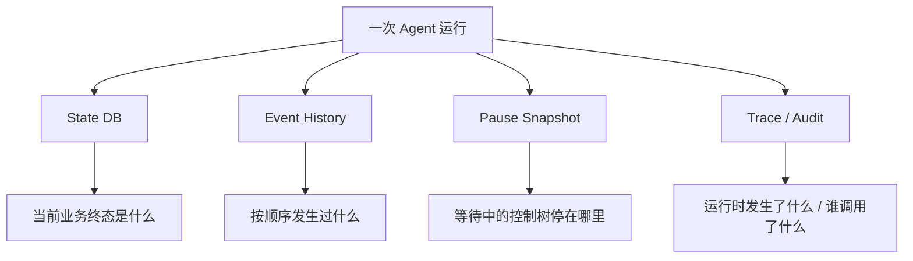
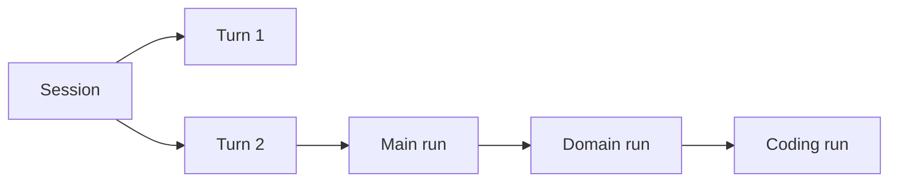
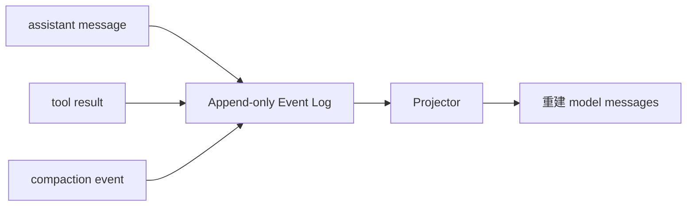
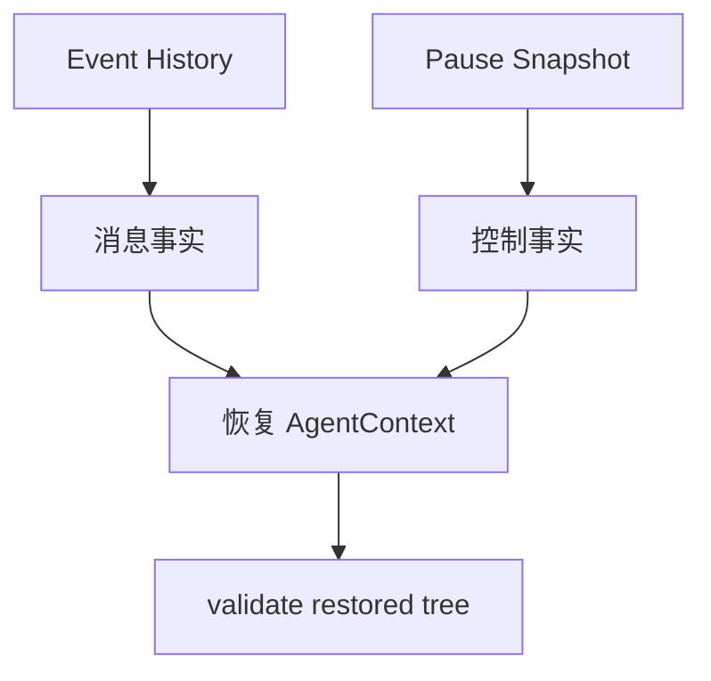
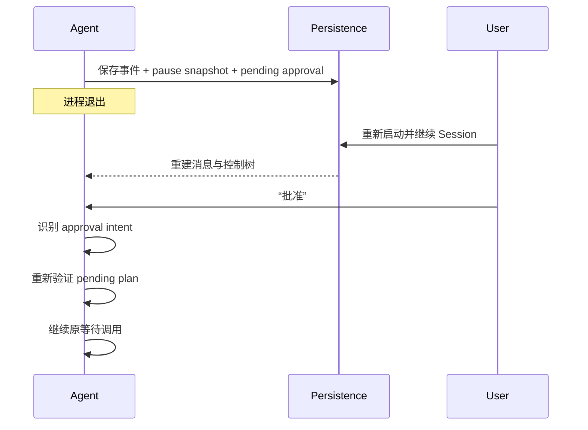

# 09 持久化、错误恢复与可观测性：进程退出后，GitAgent 怎样知道之前发生了什么

前一章出现了一个关键场景：Agent 正在等待用户审批，但进程可能退出。除此之外，运行过程中还会遇到模型格式错误、provider 超时、远端写结果不确定、日志尾部损坏等问题。

这一章把这些问题放在一起，是因为它们都围绕同一个核心：**哪些状态是权威事实，哪些状态可以重建；失败后从哪里恢复；恢复时哪些动作可以继续，哪些动作绝不能靠猜测重放。**

---

## 1. 先看 GitAgent 保存的四类运行证据

不要把“持久化”理解成只有一个数据库。GitAgent 使用不同存储回答不同问题。

| 状态来源 | 主要保存什么 | 主要用途 |
|---|---|---|
| State DB | Session、Turn、必要暂停状态与业务索引 | 查询当前终态、恢复会话骨架 |
| Event History | 追加式消息和重要运行事件 | 重建消息事实、审计历史顺序 |
| Pause Snapshot | 等待中的 Agent 控制树 | 恢复 pending call / child / approval 控制点 |
| Trace | 运行阶段、调用、计时、错误等实时观测 | 调试和性能观察 |
| Audit | capability 级主体与动作记录 | 高风险行为追踪 |

这些状态有重叠信息，但职责不同。尤其不能把 Trace 当作业务状态权威，也不能只靠聊天消息恢复 waiting 控制树。

---

## 2. Session、Turn 和 Run 的身份怎样串起来

持久化首先要回答“这些记录属于谁”。

可以把身份层级理解成：

- Session 表示连续会话；
- Turn 表示一次用户输入对应的业务处理；
- run_id 表示某个具体 Agent 的运行线程；
- call_id 连接父子调用或工具调用。

有了这些身份，事件历史才能在同一 Session 中区分不同 Agent 的消息线程，Audit 也能说明某次 capability 属于哪一轮工作。

---

## 3. State DB 保存“当前状态”，不是完整聊天副本

状态数据库适合保存结构化、可查询的业务数据，例如 Session 当前是否 active、Turn 的状态、暂停元数据等。

它还会对持久化对象做 schema 版本和完整性检查，并对不应该直接明文落盘的敏感配置做相应处理/约束。

但消息历史的权威来源并不依赖把每条消息复制进 Session 行。GitAgent 把消息事实放到追加式事件历史里，这样状态更新和历史重放分别使用更适合自己的存储方式。

可以把区别记成：

- DB 更像“当前表格”；
- Event History 更像“按时间追加的账本”。

---

## 4. Event History 为什么采用追加式 JSONL 事件

模型消息、工具调用、工具结果、压缩事件等具有明显时间顺序。追加式事件记录可以保留“先发生了什么、后发生了什么”。

每个 Agent run 的消息事件可以被投影回标准消息线程。

这里的关键点是：**事件历史保存事实变化，而不是每一步都重写一份完整最终消息数组。**

这样恢复可以从事件流重新投影当前视图，压缩也可以作为事件的一部分被重放。

---

## 5. 日志尾部损坏为什么可以有限容错

追加文件最常见的异常之一是进程在最后一次写入中间崩溃，导致最后一行 JSON 不完整。

Reader 会对坏尾部采取有限容错：如果只有末尾不完整，可以忽略这个未完成尾项；如果中间出现结构损坏，则不能假装整份历史可信。

这条边界很重要：

- **尾部截断**有明确的进程崩溃解释；
- **中间损坏**意味着历史链本身可能已经不可信。

系统不会为了“尽量启动”而默默跳过任意坏事件。

---

## 6. 消息为什么从 Event History 恢复，而不是从 Pause Snapshot 恢复

Pause Snapshot 的职责是保存控制状态，不是再复制一整份聊天历史。

恢复 waiting Agent 时：

1. 从 Event History 按 run_id 投影标准消息；
2. 从 Pause Snapshot 恢复 AgentContext 的等待、pending calls、child 控制结构和领域状态；
3. 把两者组合成可继续运行的 Context；
4. 对恢复出来的结构做校验。

这样消息只有一个主要权威来源，避免“快照里的消息”和“事件历史里的消息”长期分叉。

---

## 7. Pause Snapshot 到底保存什么

等待发生时，应用需要保存“下一次输入应该回到哪里”。因此快照重点是 Agent 树的控制形状，例如：

- 当前 Agent 类型和 run_id；
- 父调用身份；
- 当前 waiting state；
- pending structured call；
- child context；
- 领域状态和必要结构化产物；
- Approval / Mutation Plan 的必要引用或序列化状态。

它不会尝试序列化线程、future、HTTP 连接、打开的文件句柄等进程内对象。

跨进程恢复的对象必须是**业务状态**，不是“上次 Python 运行时恰好长什么样”。

---

## 8. 一次 Approval 等待怎样跨进程恢复

假设 Issue 修复已经生成四步 Mutation Plan，用户还没批准就关闭了程序。

恢复后不会重新让 Main Agent 从“修复 Issue”开始完整规划一遍，也不会直接假定旧计划仍然安全。服务层会先重建原等待点，再验证 pending mutation plan 是否仍符合当前受保护规则。

---

## 9. 恢复时为什么要重新验证控制树

序列化状态来自旧进程，当前代码和配置则来自新进程。恢复时至少要验证：

- Agent 拓扑是否合法；
- parent / child / call_id 关系是否闭合；
- waiting context 是否真有对应 pending call；
- 结构化领域状态是否满足当前 schema；
- pending mutation plan 是否仍然是当前允许恢复的形状。

如果恢复数据缺失关键身份，最危险的做法是“猜一个默认值继续跑”。GitAgent 对关键恢复状态采用 fail closed：宁可把 Session 标记为不可安全恢复，也不伪造授权或调用身份。

---

## 10. 启动时的 repair 解决什么

进程可能在数据库状态更新到一半时中断。例如 Turn 已经标记 running，但实际上已经没有任何运行时任务可以继续。

应用启动时会扫描并修复部分明显的“遗留活动状态”，把没有可恢复控制点的旧 active/running 状态收束到一致终态，避免 UI 永久显示一个不存在的任务仍在运行。

repair 的边界是持久状态一致性，不是替用户重新执行未知副作用。

---

## 11. 先把错误分成“在哪一层失败”

要理解恢复，先不要问“能不能重试”，而要先问错误属于哪一层。

| 错误层 | 例子 | 主要处理者 |
|---|---|---|
| 模型协议 | 工具参数不是合法对象、结果 schema 不对 | Reasoner / Agent Loop |
| Capability | 能力不存在、输入不合法、权限不足 | Capability Layer |
| Provider 读取 | 网络超时、速率限制、服务暂不可用 | Provider / Capability Layer |
| Execution | 资源等待、取消、组内失败 | Execution Coordinator |
| Coding 验证 | 测试失败、当前 revision 未覆盖 | Coding Agent / Workspace |
| 受保护远端写 | head 冲突、PR 状态变化、结果不确定 | Domain / protected validation |
| 持久化恢复 | snapshot/schema/事件损坏 | Persistence / Application Service |

不同错误拥有不同事实，因此不存在一个全局“retry 3 次”就能安全处理全部情况的策略。

---

## 12. 模型结构错误怎样恢复

模型成功返回响应，但 StructuredCall 或专用结果不符合契约时，这属于语义/格式纠错。

运行时把错误转成模型可以理解的观察，再进入一个新的 Agent step，让模型修正。它会消耗 Agent 步数预算，但不会假装之前的无效调用已经执行。

如果模型持续违反协议，最终由步数或 failure guard 收束任务，而不是无限循环。

这种恢复的关键是：**没有底层副作用，因此可以安全地要求模型重新表达。**

---

## 13. 只读 Provider 错误什么时候可以重试

对于明显可重试的读取，例如暂时性网络错误或 rate limit，Capability/Provider 层可以根据结构化错误中的 retryable / retry_after 信息进行有限恢复。

但重试必须有上限，并记录错误事实。持续失败以后，Failure Guard 或 Agent 会改用其他路径/向用户说明，而不是永远卡住。

读取类动作通常容易重试，是因为再次执行不会额外创建远端对象。但即使是读操作，也要区分认证失败、输入错误等确定性问题，这些不应靠重复调用解决。

---

## 14. 远端写“结果未知”为什么是最特殊的失败

前一章已经举过评论发布的例子。写请求可能已经到达外部系统，却在响应返回前断线。

这时有三种事实状态：

1. 明确未执行，可以重新尝试；
2. 明确失败且无副作用，可以按策略处理；
3. **执行结果未知，不能确定副作用是否发生。**

第三种不能自动 retry，因为重试可能产生重复评论、重复 Review、重复分支或其他不可逆动作。

恢复更合理的方向是先重新读取外部事实，确认目标对象当前是否已经存在/变化，再由领域逻辑决定下一步，而不是把网络异常简单映射成“再 POST 一次”。

---

## 15. Failure Guard 和 retry boundary 怎样配合

Failure Guard 记录“同一个动作已经以同样方式失败”。Retry boundary 决定“这一层是否有足够事实安全重试”。

可以把它们分工成：

- Retry boundary 防止**错误层级**上的重试扩大副作用；
- Failure Guard 防止**模型行为**在收到失败后反复提交同一个无效动作。

例如参数 schema 错误应该让模型改参数，而不是 provider 重试；认证失败应该让配置/用户处理，而不是模型反复调用；不确定远端写应该先核对外部状态，而不是自动重放。

---

## 16. Trace 记录什么

Trace 面向“运行时发生了什么”。它会围绕 Session/Turn/run 和 capability 记录阶段、耗时、错误、等待、模型/工具等事件，帮助回答：

- 某个 Turn 花时间在哪里；
- 哪个 capability 最慢；
- 并发调用是否真正重叠；
- Agent 什么时候进入 waiting；
- 某次失败从哪一层产生。

Trace 适合调试和性能分析，但不是恢复业务状态的权威来源。不能因为 Trace 里出现“调用开始”就认定副作用已经完成。

---

## 17. Audit 和 Trace 为什么分开

Audit 关心的是更稳定的责任链：谁、在什么 Session、以哪个 Agent 身份，对哪个 capability、以什么结果进行了调用。

尤其是受保护写入，需要可追踪“审批前后发生了什么”。

Trace 可以为了性能观察而包含更丰富的运行细节，甚至有采样/轮转；Audit 则更强调高风险动作的主体和结果。两者目标不同，所以不会用同一套日志语义代替。

---

## 18. 日志和持久化怎样避免泄漏敏感信息

运行时可能经过 access token、环境变量、GitHub 返回内容和模型上下文。可观测系统不能为了“记录一切”把秘密原样写入日志。

因此配置打印、Trace/Audit payload 和持久化对象需要经过字段选择、脱敏和 schema 约束。高风险数据只保存恢复真正需要的部分。

这并不意味着系统能自动识别所有业务敏感文本，而是说明日志设计要遵循“最少必要信息”，不能把完整请求对象无脑序列化。

---

## 19. GC 和清理怎样保持持久数据可控

长期运行会积累旧 Session、Turn、事件和观测文件。Persistence 提供清理机制，按生命周期删除已经过期且不再需要恢复的状态。

清理必须尊重引用关系：还在等待的 Session 不能因为时间到了就只删掉事件历史，留下一个无法解释的 pause snapshot；同样，不应该让旧临时 workspace 依赖成为持久恢复前提。

可恢复状态应该尽量由稳定序列化对象组成，而不是无限保存所有运行时副产物。

---

## 20. 一次“超时 + 进程重启 + 继续审批”的完整例子

假设 PR Agent 已经形成 Review 发布计划，系统正在等用户。

**进入等待**：ApprovalRequest、pending call 和 Agent 控制树进入暂停状态；模型消息和工具历史已经在 Event History 中。

**进程退出**：内存里的 AgentLoop、future 和 HTTP 连接全部消失，但稳定状态仍在。

**程序重启**：应用装配当前 Capability 和模型环境；读取 State DB，发现该 Session 可恢复；从 Event History 重建各 run 消息，从 Pause Snapshot 重建控制树；校验 call_id、waiting 和 pending plan。

**用户批准**：下一条输入被识别成对旧等待点的回复，而不是新的 Main 路由。

**执行前外部读取超时**：如果这是安全只读 preflight，可以按有限策略重试；仍失败则把结构化错误交回业务层，而不会直接执行写操作。

**下一次成功读取**：发现 PR head 已变化。protected validation 拒绝旧 Review/merge 计划，需要重新取证。

这个例子说明：恢复的目标不是“尽最大可能继续执行”，而是**恢复到足够准确的控制点，然后重新证明下一步仍然有资格执行。**

---

## 21. STAR 复盘：为什么状态、错误和观测必须分层

### S — Situation

Agent 任务会跨多轮、跨多个 child、跨审批等待，进程还可能随时退出。与此同时，同一个“失败”可能是模型格式错、网络读超时、写结果未知或持久数据损坏。只保存最终聊天记录无法恢复控制状态，只做自动重试又可能重复副作用。

### T — Task

系统需要明确每类事实的权威来源，能够从稳定数据重建 waiting Agent，同时根据失败发生的层级决定是让模型纠错、有限重试、重新读取事实、拒绝旧计划，还是直接 fail closed。

### A — Action

GitAgent 用 State DB 保存当前业务状态，用追加式 Event History 保存消息与历史事件，用 Pause Snapshot 保存等待控制树；恢复时分别重建消息和控制状态并验证结构；启动时 repair 遗留状态；错误按模型、Capability、Provider、Execution、Mutation 等边界归一；Failure Guard 阻止重复无效动作；不确定远端写不自动重试；Trace 与 Audit 分别承担运行观察和高风险责任追踪。

### R — Result

进程重启后可以继续明确等待点，而不是从头猜任务；失败处理更贴近副作用语义；运行过程也有足够证据支持调试和评测。代价是需要维护多种持久状态、schema 版本和一致性校验。

核心结果是：**恢复不是恢复线程，而是恢复已经确认的业务事实和控制协议；重试不是默认动作，而是建立在“再次执行仍安全”的证据上。**

---

## 22. 这一章最容易混淆的地方

| 误解 | 正确理解 |
|---|---|
| DB 里有 Session 就足够恢复 | 不够。消息历史和 waiting 控制树还有各自来源 |
| Pause Snapshot 复制完整聊天历史 | 不需要；消息主要由 Event History 投影 |
| Trace 可以作为恢复权威 | 不可以。Trace 是观测，不是业务提交记录 |
| 所有网络错误都可以 retry | 不可以，尤其远端写结果未知时 |
| 恢复就是重新跑最后一个调用 | 不是。先恢复控制点，再重新验证是否有资格继续 |
| 忽略任何坏日志行都能提高可用性 | 不对。只有可解释的坏尾部可以有限容错，中间损坏不能静默跳过 |

---

## 23. 复习时怎样讲这一章

建议先讲三份权威：

> State DB 说“现在是什么状态”，Event History 说“过去按顺序发生了什么”，Pause Snapshot 说“等待中的 Agent 树停在哪里”。恢复时消息从事件重建，控制从快照重建，再验证 pending plan；错误是否重试则取决于副作用语义，而不是一个统一次数。

然后用“远端写响应丢失为什么不能自动重试”作为设计取舍例子。

## 24. 代码定位

| 想核对的问题 | 主要位置 |
|---|---|
| SQLite 存储、事务和 schema 边界 | `gitagent/infra/persistence/store.py` |
| Session / Turn、Pause Snapshot 与恢复状态 | `gitagent/infra/persistence/sessions.py` |
| Event History、坏尾部和事件保留 | `gitagent/infra/persistence/event_log.py` |
| 服务层保存、恢复、pending plan 校验 | `gitagent/application/service.py` |
| AgentContext 树校验 | `gitagent/agent_loop/loop.py` |
| Capability 错误与 Failure Guard | `gitagent/capability/errors.py`、`gitagent/capability/layer.py` |
| Trace / Audit | `gitagent/infra/observability/` |
| 持久数据生命周期清理入口 | `gitagent/infra/persistence/sessions.py`、`event_log.py` |

下一章不再讨论跨进程，而是处理另一个“运行越久越难”的问题：[上下文越来越大以后，GitAgent 怎样压缩历史、维护文件读取状态，又不破坏工具协议](10-context-governance-and-read-state.md)。
