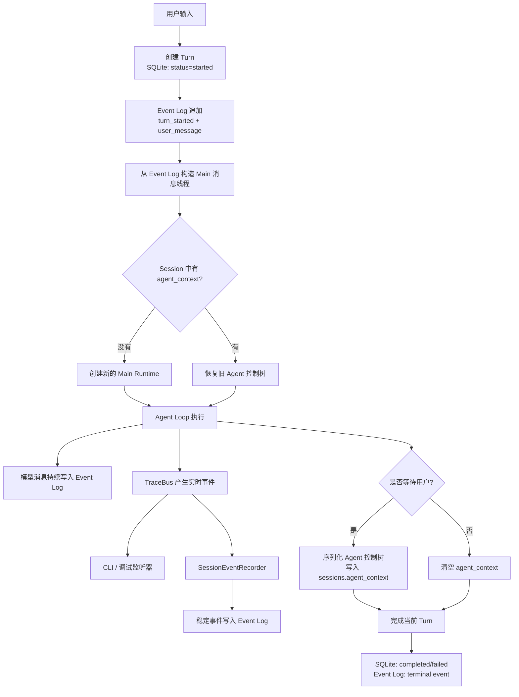
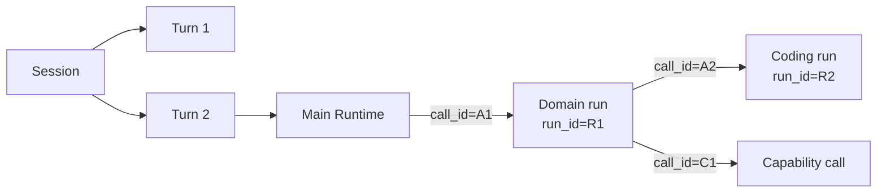
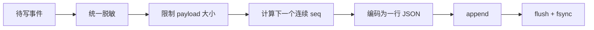
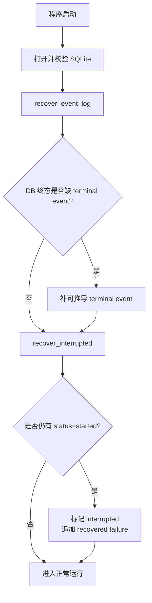
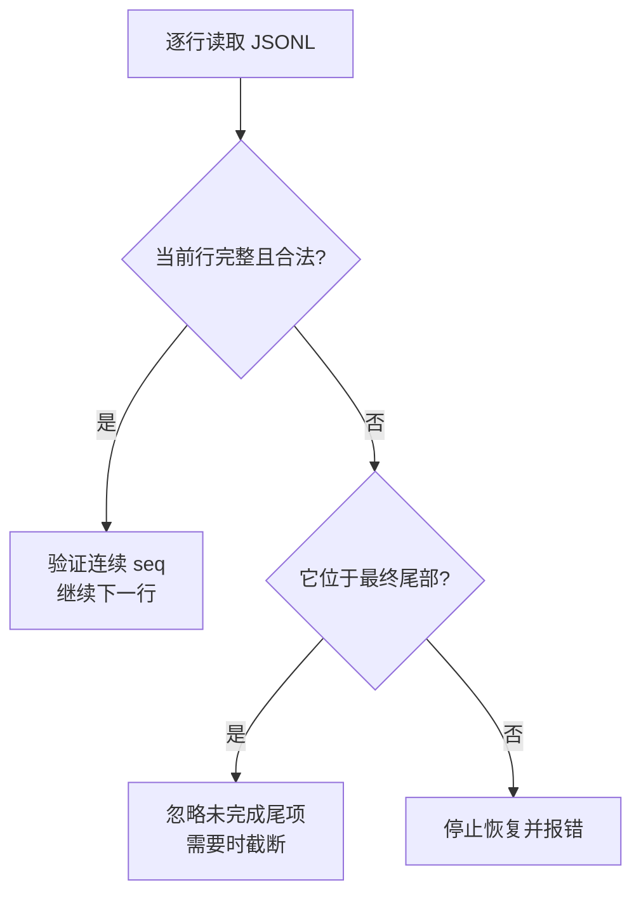
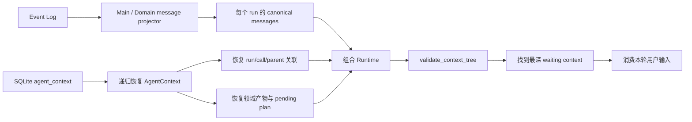
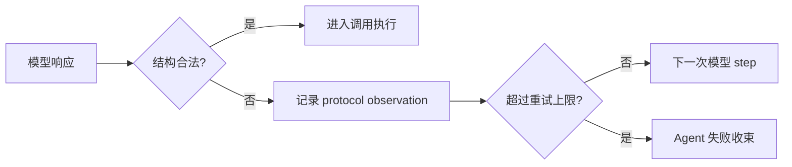
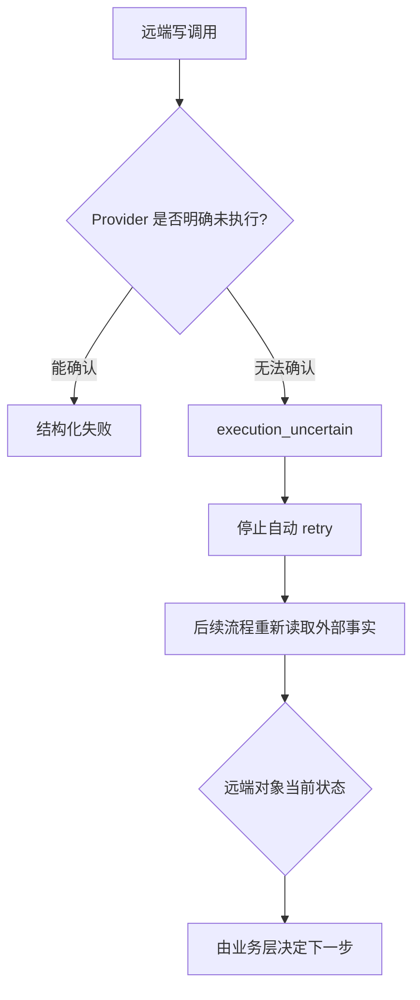
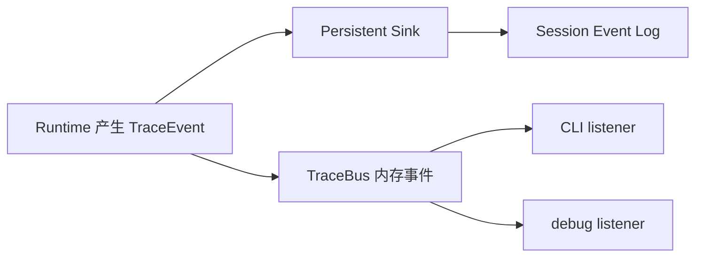
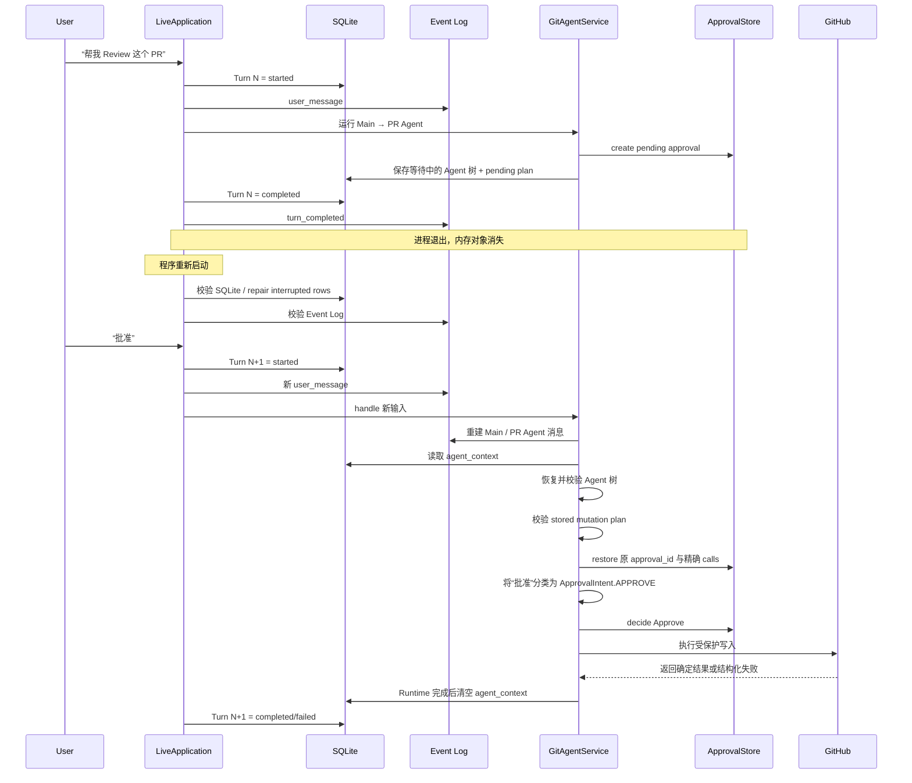

# 09 持久化、恢复与可观测性：GitAgent 如何把一次运行保存下来，并在重启后安全接上

第 08 章讲到 Approval：Agent 已经准备好远端 Mutation Plan，但用户还没有批准。这个等待可能持续几秒，也可能持续几小时。等待期间程序可能退出，下一次启动时，内存里的 Agent 对象、线程、HTTP 连接和 ApprovalStore 都已经消失。

这一章从系统真实的运行顺序出发，先回答 GitAgent **具体保存了什么、什么时候保存、重启后怎样重建**，再讨论这些设计为什么合理。错误恢复和可观测性也放在同一条时间线上理解，这样更容易看出它们与持久化之间的关系。

本章按照 STAR 的节奏展开：

- **S — Situation**：先给出系统正处在什么运行场景；
- **T — Task**：说明这一层需要保证什么；
- **A — Action**：重点讲实现怎样组织数据、怎样执行、怎样恢复；
- **R — Result**：最后再解释这样设计带来的效果、理由和边界。

全章先记住一句话：**GitAgent 保存的是可验证的业务状态和运行证据，恢复时重新组装 Agent Runtime，再从一个明确的等待点继续。**

---

## 1. 先看完整设计：一次用户输入会经过哪些持久化步骤

先不讨论原因，只看系统实际怎样跑。



这张图里有四个需要先区分的概念：

| 概念 | 实际落点 | 保存内容 | 主要用途 |
|---|---|---|---|
| Session / Turn 状态 | SQLite | 会话范围、Turn 状态、working state、时间戳 | 查询当前业务状态、判断 Turn 是否完成 |
| 等待中的 Agent 控制树 | SQLite 的 `sessions.agent_context` | Agent 层级、run/call 关联、pending approval、等待点、领域产物 | 跨进程恢复等待中的 Runtime |
| Session Event Log | 每个 Session 一份 append-only JSONL | 用户/模型消息、工具调用与结果、Agent/Workflow 事件、压缩事件 | 重建消息线程、保留运行历史 |
| Trace / Audit | 进程内对象；Trace 的稳定子集会投影到 Event Log | 实时运行事件、Capability 结果责任信息 | CLI 展示、调试、运行分析 |

这里有一个很容易记错的地方：文档里可以把 `agent_context` 代表的等待状态称作 **Pause Snapshot**，它的物理存储就在 SQLite Session 行中，并没有单独再维护一套 Snapshot 文件。

另一个容易记错的地方是 Trace 和 Audit 的耐久性。`TraceBus` 和 `AuditLog` 本身都保存在当前进程内；其中 Trace 配置了 `SessionEventRecorder`，会把适合长期保存的事件同步投影进 Session Event Log。当前 `AuditLog` 没有独立的跨进程持久化文件。

理解了这张总图，后面的恢复逻辑会自然很多。

---

# 第一部分：先把“谁的状态”分清楚

## 2. Session、Turn、run_id、call_id 怎样组成一条身份链

### S — Situation：一个 Session 里同时存在多层 Agent

用户看到的是一个连续会话，Runtime 内部却可能经历 Main Agent、Issue Agent、PR Agent、Repository Agent 和 Coding Agent。某个 Agent 还会产生多个结构化工具调用。

如果只保存“当前消息是什么”，恢复后就无法判断一条工具结果应该回给哪个调用，也无法判断一个 Coding child 原来挂在哪个 Domain Agent 下面。

### T — Task：每份持久状态都要能够回答“它属于谁”

恢复需要同时确认四个层级：

| 身份 | 表示什么 | 生命周期 |
|---|---|---|
| `session_id` | 一段连续会话 | 跨多个用户 Turn |
| `turn_seq` | 一次用户输入对应的一轮应用处理 | 每次输入递增 |
| `run_id` | 某个具体 Agent Runtime 实例 | 一个 Agent 调用线程 |
| `call_id` | 一次结构化 Agent/Capability 调用 | 一次调用及其结果 |

### A — Action：把身份沿 Runtime 树和事件流一起保存

可以把它理解成下面的关系：



Session Event 会带 `session_id`，能归属到用户会话；与当前输入有关的事件会带 `turn_seq`；Domain/Coding 模型消息还会记录 `run_id`；父子 Agent 的快照会保存 `parent_run_id`、`parent_call_id`、`parent_call_name` 和调用参数。

恢复时，系统不会只相信树形 JSON 的父子关系。它还会回到模型消息线程，确认父节点里确实存在那个尚未闭合的结构化 Agent call，并检查 call 名称、参数和 `call_id` 都能对应起来。

### R — Result：身份链让恢复过程可以做“相关性校验”

这套身份设计的价值在于：恢复出来的 child 必须能够证明自己来自哪次父调用。缺少关键身份、调用已经闭合、参数对不上、child 挂错父节点时，恢复会直接失败。

因此 `run_id` 和 `call_id` 不只是日志字段，它们也是恢复协议的一部分。

---

# 第二部分：持久化具体怎样设计

## 3. SQLite 保存哪些状态

### S — Situation：应用需要快速知道“现在处于什么状态”

启动 CLI、切换 Session、列出 Turn、判断某轮是否成功时，系统需要直接查询当前状态。如果每次都从整份 JSONL 事件历史重新推导所有 Session 元数据，读取路径会变得很重，事务更新也很难组织。

### T — Task：维护一份结构化、可事务更新的当前状态

SQLite 负责 Session 和 Turn 的当前结构化状态。

### A — Action：StateStore 提供统一 SQLite 边界

当前 schema 里，与本章直接相关的核心内容可以这样理解：

| 数据 | 关键字段 | 作用 |
|---|---|---|
| Session | `session_id`、account/repository scope、title、时间戳 | 定位会话 |
| Session working state | goal、focus、manifests、open question | 给下一轮应用层提供稳定工作状态 |
| Session agent context | `agent_context` | 保存等待中的 Agent Runtime 控制树 |
| Turn | `session_id + seq + status`、开始/结束时间 | 记录每轮是否 started/completed/failed/interrupted |
| Context summary 边界 | boundary / summary 字段 | 支持上下文治理，详见第 10 章 |

StateStore 在写入时使用事务边界；写入值会先经过统一的 JSON/文本校验和敏感信息处理。数据库启动时还会检查 schema metadata、表结构、索引、外键以及 SQLite integrity。

`agent_context` 有一个明确约束：其中不能出现 `messages` 字段。消息线程有自己的 Event Log 来源。

### R — Result：当前状态查询和消息历史各自保持清晰职责

SQLite 很适合回答“这个 Turn 最终是什么状态”“这个 Session 现在有没有等待中的 Runtime”“当前 working state 是什么”。

把模型消息从 `agent_context` 中排除，可以避免同一条消息同时存在于 Snapshot 和 Event Log 两份可变副本里。恢复时消息只有一条主要重放路径，控制状态也有明确的存储位置。

---

## 4. Event Log 怎样保存按时间发生的事实

### S — Situation：Agent 运行本身是一条有顺序的事件流

一次 Agent 执行里可能依次出现用户消息、模型 tool call、Capability 结果、child Agent 调用、压缩 checkpoint、最终回答。这里的先后关系会影响下一步模型上下文，也会影响调试时对执行路径的判断。

### T — Task：保留可按顺序重放的 Session 历史

Event Log 需要满足几件事：事件有稳定顺序、单条记录可校验、进程异常退出时尽量保住已经完整写入的部分、恢复时能够重新投影消息线程。

### A — Action：每个 Session 使用一份 append-only JSONL

Event Log 的物理路径按 account key 和 repository key 的哈希值分目录，再以 `session_id.jsonl` 保存。这样文件名不会直接暴露 account/repository 标识。

每次追加事件时会执行下面这条路径：



事件 envelope 至少包含版本、连续 `seq`、事件类型、UTC 时间、Session、可选 Turn、可选 Agent 和 data。

Event Log 里最重要的几类内容包括：

| 事件 | 用途 |
|---|---|
| `user_message` / `assistant_message` | Session 对话层展示与投影 |
| `model_message` | 精确保存 Agent 真正加入模型线程的 canonical message |
| `tool_call` / `tool_result` | 保留 Capability 调用和返回的稳定观测 |
| `agent_started` / `agent_completed` | 观察 Agent run 生命周期 |
| `workflow_step` / `workflow_outcome` | 保存工作流过程和终态事件 |
| `compaction_checkpoint` | 记录消息压缩产生的确定性变化 |
| `turn_started` / `turn_completed` / `turn_failed` | 对齐应用层 Turn 生命周期 |

模型消息恢复依靠 projector。Main 线程使用 `derive_main_messages`；Domain/Coding 线程使用 `agent + run_id` 过滤自己的 `model_message`。压缩发生后，projector 会按 `compaction_checkpoint` 重放保留索引、工具结果替换和 checkpoint，从而得到压缩后的模型可见线程。

### R — Result：历史可以重放，也方便解释执行过程

追加式日志很适合“发生过什么”这一类问题。它保留事件顺序，同时避免每次消息变化都重写整个聊天数组。

这种设计也给恢复留下了清晰边界：消息通过事件重放得到；等待中的控制树通过 `agent_context` 得到。两条路径最后在 Service 层汇合。

---

## 5. 一个 Turn 从开始到结束到底写了哪些东西

这一节非常重要，因为很多“重启后怎样继续”的困惑，都来自没有分清 Turn 和等待状态的关系。

### S — Situation：用户每发一条输入，应用都会创建一个新 Turn

假设用户第一次说：“帮我修复 Issue #42。”Agent 最后生成修改方案并请求审批。用户暂时没有回复。

### T — Task：这一轮要形成完整业务记录，同时保留下一轮可以继续的等待点

当前 Turn 需要有明确终态；等待中的 Agent 树也需要跨 Turn 保留下来。

### A — Action：一次正常 Turn 的写入顺序

```mermaid
sequenceDiagram
    participant U as User
    participant APP as LiveApplication
    participant DB as SQLite
    participant EL as Event Log
    participant SVC as GitAgentService
    participant LOOP as Agent Loop

    U->>APP: 输入请求
    APP->>DB: 创建 Turn(status=started)
    APP->>EL: turn_started + user_message
    APP->>EL: 读取历史并构造 Main messages
    APP->>SVC: handle(...)
    SVC->>LOOP: 新建或恢复 Runtime

    loop Agent 执行
        LOOP->>EL: model_message
        LOOP->>EL: 经 Trace 投影的稳定事件
    end

    alt 进入等待
        LOOP-->>SVC: waiting
        SVC->>DB: 保存 sessions.agent_context
    else 已完成
        SVC->>DB: 清空 sessions.agent_context
    end

    SVC-->>APP: ServiceResult
    APP->>EL: assistant_message / workflow_outcome
    APP->>DB: Turn -> completed + 更新 working_state
    APP->>EL: turn_completed
```

这里最关键的事实是：**Agent 进入等待以后，这个用户 Turn 仍然会正常完成。**

等待状态通过 `agent_context` 延续到未来。等用户下一次回复时，应用会创建新的 Turn，再把这条新输入交给原来的等待点。

因此“跨进程等待”可以理解成：

> Turn N 已经结束；Session 里留下一个可恢复的 Agent 控制树。用户的下一条回复属于 Turn N+1，Turn N+1 会先恢复这个控制树，再继续原来的业务流程。

### R — Result：等待不需要把一个数据库 Turn 长时间保持在 running

这样设计以后，等待几小时不会让 Turn 一直停在 `started`。历史里能清楚看到“第 N 轮提出审批请求，第 N+1 轮用户批准”。

同时，进程中途崩溃产生的 `started` Turn 可以单独被识别为异常中断，不会与正常的用户等待混在一起。

---

# 第三部分：Pause Snapshot 具体保存什么

## 6. `agent_context` 怎样保存一棵等待中的 Agent 树

### S — Situation：等待点可能藏在 Main → Domain → Coding 的深层结构里

用户看到的可能只是一句“是否批准发布 Review？”，Runtime 内部却需要知道：哪个 Domain Agent 在等、它由 Main 的哪个 call 创建、已经生成了什么候选、哪个 Approval 正在 pending、消息线程里哪个 tool call 还没有闭合。

### T — Task：把继续执行所需的业务控制状态变成纯数据

这些数据必须可以写进 JSON，进程重启后再构造成新的 Python 对象。

### A — Action：递归序列化 AgentContext

`GitAgentService._serialize_context` 会把当前 Runtime 树投影成结构化对象。核心内容可以分成六组：

| 状态组 | 保存内容 | 恢复时的作用 |
|---|---|---|
| Agent 身份 | agent、run_id、origin_turn_seq | 找回具体 run |
| 父子关联 | parent_run_id、parent_call_id、parent_call_name、调用参数 | 重新挂回父节点并校验结构化调用 |
| 执行位置 | steps、waiting_for_user、active_children | 找到真正等待点 |
| Approval 状态 | approval_id、summary、计划中的 calls、provider_call_id | 重建待审批计划 |
| 领域产物 | CandidatePatch、ChangeRequest、Verification、Issue reply、Coding task 等 | 恢复已经完成的业务工作 |
| Runtime 辅助状态 | observations、read cache、file read ledger、uncommitted capability results | 保持协议关联和读状态 |

`active_children` 会递归保存，所以 Main 可以携带 Domain child，Domain child 也可以携带 Coding child。

模型消息不会进入这份对象。恢复某个 Agent 时，Service 会使用 Event Log 重新取得该 run 的 canonical messages。

线程池、Future、HTTP 连接、文件描述符、锁等进程对象也不会进入快照。新进程会重新创建这些运行设施。

### R — Result：恢复对象聚焦在“下一步如何继续”

这套 Snapshot 保存的重点是控制协议和已经产出的业务结果。运行设施由新进程重新装配，可以减少 Python 运行时细节对持久格式的污染。

另外，Snapshot 中没有消息副本，所以 Event Log 的 message replay 和 Snapshot 的 control restore 可以分别校验，最后再组合。

---

## 7. Pending Approval 跨进程后怎样重新变成可用授权对象

### S — Situation：ApprovalStore 本身只活在进程内

程序退出后，旧 `ApprovalStore` 里的 `ApprovalRequest` 对象全部消失。不过 `agent_context.pending` 已经保存了 approval id、summary 和精确 Mutation calls。

### T — Task：新进程要恢复同一个待审批请求，同时防止旧计划被悄悄改写

恢复出来的 Approval 需要继续绑定原 Session、repository 和精确调用序列。

### A — Action：先验证持久化计划，再调用 ApprovalStore.restore

恢复 pending plan 时，Service 会先按 Agent 类型检查它是否仍符合允许的形状。

例如：

| Agent | 恢复时会核对的核心内容 |
|---|---|
| Repository Agent | ChangeRequest、CandidatePatch、Verification 都存在且验证通过；重新计算出的 Mutation Plan 与存储计划相同 |
| Issue Agent | Issue fix 的代码计划必须与已验证候选重新计算结果一致；Issue reply 必须与 draft 内容对应 |
| Pull Request Agent | 只允许规定范围内的受保护写入，并重新经过 protected capability 校验 |

计划通过检查以后，Dispatcher 才会调用 `ApprovalStore.restore`，使用原 `approval_id`、Session、repository、summary 和 calls 重建一个新的内存 ApprovalRequest。

用户真正批准以后，授权消费仍然逐项比较精确 capability id 和规范化参数，并保持计划顺序。

### R — Result：进程重启不会自动扩大旧授权范围

持久化里保存的是待审批计划的精确描述。新进程先重新证明“这份计划仍然和当前恢复出的业务产物一致”，再建立可消费的内存授权。

这样可以避免 Snapshot 被部分修改以后直接获得写权限，也让第 08 章的精确 Approval 语义跨进程延续。

---

# 第四部分：重启以后怎样恢复

## 8. 启动阶段先做结构修复，再处理新的用户输入

### S — Situation：进程可能在任意写入点退出

常见情况有三类：

1. Event Log 最后一行只写了一半；
2. SQLite 已经把 Turn 标记为 completed，但 `turn_completed` 事件还没有追加成功；
3. SQLite 里仍存在 `started` Turn，说明上次进程没有正常收尾。

### T — Task：先把能够确定的持久状态整理到一致形态

启动阶段只修复可以从现有权威状态推导出来的事实。无法确定的业务动作不会自动补执行。

### A — Action：SessionManager 初始化时执行两步 repair

第一步是 `recover_event_log()`。

它读取 SQLite 中的 Session 和 Turn，再查看 Event Log：

- Session 存在、整份 Event Log 缺失时，补 `session_started`；
- SQLite 已明确显示某个 Turn 为 completed/failed/interrupted，而对应 terminal event 缺失时，补相应 terminal event；
- SQLite 仍显示 `started` 的 Turn 暂时跳过，交给下一步处理。

第二步是 `recover_interrupted()`。

它把所有遗留 `started` Turn 更新为 `interrupted`，写入完成时间，并追加一个 `turn_failed` 事件，标记 `recovered=true`。

可以画成：



### R — Result：repair 处理“持久化收尾”，不重放未知副作用

SQLite 和 JSONL 是两套文件，二者之间没有一个覆盖全部写入的分布式事务。启动 repair 用可推导事实补齐终态标记，可以缩小进程崩溃留下的不一致窗口。

同时，这个 repair 有明确边界：SQLite 没保存的用户消息正文、远端 GitHub 写入结果等内容无法凭空重建。系统会保留中断事实，把业务判断留给后续显式恢复流程。

---

## 9. Event Log 尾部损坏怎样处理

### S — Situation：append-only 文件最常见的损坏发生在最后一次写入

进程可能在写 JSON 的中途退出，于是文件末尾留下半行。这样的故障有非常明确的形成原因。

### T — Task：保留此前完整事件，同时识别更严重的历史损坏

Reader 需要区分“最后一次 append 没写完”和“日志中间已经坏掉”。

### A — Action：只对最终坏尾项做有限恢复

读取时会逐行检查：

- 每行必须以换行结束；
- JSON 必须能够解析；
- `seq` 必须从 1 开始连续递增；
- event 的 Session、时间、turn_seq、agent 和 data 必须满足结构要求。

如果问题只出现在文件最后一行，Reader 会把它标成 damaged tail，并忽略这条未完成事件。下一次 append 需要确定日志 head 时，可以把文件截断到最后一个完整事件的位置，再继续追加。

如果中间某一行无法解析、没有正常换行，或者 seq 不连续，读取会失败并抛出 StateError。



### R — Result：容错范围与故障成因一致

末尾半行很符合“append 时进程退出”的故障模型，因此可以保留之前已经完成的历史。中间损坏意味着历史链可能被修改、截断或部分破坏，继续跳过会让后续 call correlation 和消息顺序失去可信基础。

---

## 10. 用户再次输入时，Service 怎样重建等待中的 Runtime

### S — Situation：程序已经重启，Session 里仍有 `agent_context`

此时内存中没有原 Agent 对象，也没有旧 ApprovalStore。用户输入“批准”。

### T — Task：把 Event Log 中的消息事实和 SQLite 中的控制事实重新拼成可运行 AgentContext

恢复需要保证：消息属于正确 run、Agent 拓扑合法、等待调用仍然能在消息线程中找到、pending plan 仍满足安全条件。

### A — Action：恢复分成“重建消息”和“重建控制树”两条支线



具体过程可以按下面的顺序理解。

**第一步：新的用户输入先创建新的 Turn。**

应用读取保存的 `agent_context`，先判断当前等待由哪个 Domain Agent 持有，因此新的 `user_message` 可以标记对应 agent。随后照常创建新 Turn。

**第二步：Main 消息线程从 Event Log 构造。**

ContextBuilder 根据 Session 历史构造当前 Main messages。Service 收到这些 messages 后再加载 `agent_context`。

**第三步：递归恢复 Runtime 树。**

Service 从 Main 开始创建新的 AgentContext，再按照 `active_children` 递归创建 Domain/Coding child。每个 child 必须属于当前 repository，也必须符合固定的 Agent 拓扑。

**第四步：每个 Agent 的消息从 Event Log 投影。**

Main 使用当前已经构造好的 Main messages；Domain/Coding 使用 `agent + run_id` 找到自己的 `model_message` 序列。恢复出来的线程为空时直接报错。

**第五步：恢复等待点和领域状态。**

系统恢复 `waiting_for_user`、pending approval、领域产物、file read ledger、read cache，以及可能存在的 uncommitted capability results。

**第六步：验证 call correlation。**

如果一个 child 说自己来自 `parent_call_id=A1`，父消息线程里就必须存在未闭合的 `agent__<child>` call A1，而且参数必须一致。等待用户的 runtime call 也会执行相同类型的校验。

**第七步：验证 pending mutation plan。**

Service 根据恢复出的候选、验证报告和业务状态重新计算或检查允许的计划形状，通过以后才恢复 ApprovalRequest。

**第八步：找到最深的等待节点继续。**

`waiting_context()` 沿 active child 向下寻找最深的 paused context。用户的“批准”“拒绝”“修改”或普通回答会交给这个节点处理。

### R — Result：恢复从明确控制点继续，旧运行时对象无需保留

这一流程把“历史消息”和“当前控制位置”分别恢复，再通过 call correlation 合并。新进程可以使用新的模型客户端、线程池、Capability provider 和 ApprovalStore，同时继续之前已经确认的业务进度。

恢复失败时，系统会给出 RoutingError/StateError，不会补造缺失的 parent call、run_id 或授权关系。

---

## 11. 一定要区分三种“恢复”

复习时最容易把三件事混成一句“程序重启后继续跑”。实际上它们处理的对象不同。

| 恢复类型 | 触发条件 | 系统动作 | 会不会自动继续原动作 |
|---|---|---|---|
| Event Log 尾部修复 | JSONL 最终事件写到一半 | 忽略/截断坏尾项，保留此前完整事件 | 不涉及业务动作 |
| Interrupted Turn 修复 | SQLite 中遗留 `started` Turn | 标记 `interrupted`，追加失败终态 | 不会继续该 Turn |
| Waiting Runtime 恢复 | Session 中存在合法 `agent_context`，用户发来新输入 | 重建消息和控制树，校验后从等待点继续 | 会在新的 Turn 中继续 |

这张表非常值得记住。

正常等待属于第三类。它保存的是上一轮已经形成的暂停控制点。真正“进程执行到一半突然死掉”的当前 Turn 会进入第二类，启动时被收束成 interrupted。

---

# 第五部分：错误恢复怎样按层设计

## 12. 先看错误恢复的整体分层

### S — Situation：同样叫“失败”，背后的事实完全不同

模型输出格式错、LLM 服务短暂超时、只读 GitHub 请求超时、远端写请求响应丢失、SQLite 数据损坏，这些情况都可能表现成异常，但安全的处理方式差异很大。

### T — Task：让掌握事实最多的那一层决定怎样恢复

GitAgent 不设置一个覆盖全部系统的统一 retry 循环。每层只处理自己能够判断的恢复条件。

### A — Action：把恢复边界放在对应层

| 失败位置 | 典型情况 | 当前处理方式 |
|---|---|---|
| Agent 结构化协议 | 模型 tool call 形状、call_id、结构化结果不合法 | 把错误写成 observation，允许模型重新表达，受 `max_structured_retries` 限制 |
| LLM Provider | 模型提供方连续失败 | Agent Loop 在当前 step 层有限重试，受 `max_provider_retries` 限制 |
| Capability 输入/权限 | schema 错、Capability 不存在、没有权限 | 直接返回结构化失败，让 Agent 改路径 |
| READ Capability Provider | timeout、unavailable、短 retry-after rate limit | CapabilityLayer 最多再尝试一次 |
| WRITE / DESTRUCTIVE Provider | timeout、连接中断、执行结果不明 | 不进入自动 provider retry |
| Capability 输出 schema | provider 已执行，但返回结果不符合 schema | 记录 `provider_executed` 与 `side_effect_possible`，直接失败 |
| Persistence | DB/schema/Event Log 结构损坏 | 停止恢复或只做有明确证据的 repair |

### R — Result：重试条件与副作用语义绑定

这一分层的核心收益是，每一层都基于自己掌握的事实做决定。模型协议层知道“调用还没有合法进入 Capability”；CapabilityLayer 知道访问级别是 READ 还是 WRITE；Persistence 知道哪些终态能够从 SQLite 推导。

这样可以避免一个通用 retry 策略把安全的格式纠错和高风险的远端写重放混在一起。

---

## 13. 模型结构化输出错误怎样恢复

### S — Situation：模型返回了响应，但不符合当前调用协议

例如 call_id 重复、调用数量超过限制、StructuredCall 参数形状错误。此时真正的 Capability 可能还没有执行。

### T — Task：给模型一次纠正表达的机会，同时阻止无限循环

### A — Action：Agent Loop 把协议错误变成新的 observation

Agent Loop 捕获 `StructuredOutputError` 后，会关闭当前未完成调用，记录 `structured_output_error` observation。必要时还会给模型线程加入一条纠错提示，要求下一次严格遵守当前 structured-call contract。

随后进入新的 Agent step。连续结构化错误超过 `max_structured_retries` 时，当前 Agent 会失败收束。



### R — Result：格式纠错不会被误解成底层副作用重试

这里恢复的是“模型怎样表达调用”。在 Capability 尚未合法执行的场景里，让模型修正格式风险较低。重试次数仍有限制，避免模型长期卡在同一个协议错误里。

---

## 14. READ Capability 怎样做有限 Provider 恢复

### S — Situation：只读请求可能遇到短暂网络故障

GitHub 查询、MCP 读取等 READ Capability 可能遇到 timeout、provider unavailable 或短时间 rate limit。

### T — Task：对短暂故障提高成功率，同时保证调用不会无限等待

### A — Action：CapabilityLayer 只给 READ 类故障一个有限恢复窗口

Capability 调用进入 provider 后，当前实现最多执行两次 attempt。

第一次失败后，只有下面几类 READ 错误满足恢复条件：

| 错误 | 恢复动作 |
|---|---|
| `timeout` | 直接进入第二次 attempt |
| `unavailable` | provider 支持 reconnect 时先 reconnect + refresh，再尝试 |
| `rate_limited` | 只有 `retry_after` 存在且不超过 2 秒时等待后重试 |

认证失败、输入错误、资源不存在、冲突等情况不会靠 provider retry 解决。

### R — Result：短暂读取故障可以自愈，确定性错误很快暴露

READ 调用重复执行通常不会额外创建远端对象，因此可以给瞬时错误一次恢复机会。把尝试次数固定在很小范围，也能避免一次 Capability 长时间占住 Agent Loop。

---

## 15. WRITE 结果未知时为什么必须停下来

### S — Situation：远端已经收到请求，但客户端没拿到响应

例如 GitAgent 向 GitHub 发布评论，请求已经发出，连接在返回响应前断开。此时客户端无法确认评论到底有没有创建成功。

### T — Task：避免重复副作用

系统需要把“请求明确失败”和“执行结果未知”区分开。

### A — Action：mutation provider 错误会映射成更保守的错误类型

`CapabilityLayer` 知道 Capability 的 access level。WRITE / DESTRUCTIVE 调用出现超时或连接类异常时，不会进入 READ 使用的自动恢复分支。

当超时发生在请求已经发出之后，错误会归一为 `execution_uncertain`。一些无法判断请求阶段的 mutation timeout / connection failure 也会按不确定执行处理。

还有一个容易忽略的场景：provider 已经正常返回，但输出不符合 Capability output schema。此时系统会记录 `provider_executed=true`；如果调用具有写副作用，还会记录 `side_effect_possible=true`，然后停止自动重试。



### R — Result：网络故障不会自动变成第二次远端写

远端 mutation 的最大风险常常来自“第一次其实成功了，客户端误以为失败”。停止自动重放可以避免重复评论、重复 Review、重复分支或重复提交。

后续如果要恢复，需要重新读取 GitHub 当前事实，再由 Domain 层判断目标对象是否已经存在、head 是否变化、旧计划是否仍有效。

---

## 16. FailureGuard 怎样阻止模型重复提交同一个失败动作

### S — Situation：Capability 已经失败，模型下一步可能原样再发一次

例如认证失败后，模型仍然用完全相同的 capability 和参数再次调用。Provider retry 已经结束以后，这种重复通常没有新的信息价值。

### T — Task：阻止同一 run 中的无效循环

### A — Action：用规范化调用身份记录失败

FailureGuard 根据 agent、capability id 和排序后的规范化 arguments 生成调用身份，并按 `run_id` 保存失败记录。

当失败结果沿有序 commit 路径提交以后，FailureGuard 才记录这个 identity。之后同一 run 再出现完全相同调用时，可以返回 `repeated_failure`，不再进入 provider。

调用成功时，对应 identity 会被清除。

Dispatcher 还会检查紧邻的重复 structured call：第一次重复可产生 `duplicate_call` 纠正信号；模型收到纠正后仍再次原样提交时，会升级为更明确的 repeated failure。

### R — Result：Provider 恢复和模型行为恢复各管一层

Provider retry 处理一次 Capability 内部的短暂故障；FailureGuard 处理 Agent 在多个 step 之间反复提交同一失败动作的问题。两层配合后，既保留有限自愈空间，也能阻止模型把失败循环放大。

---

# 第六部分：可观测性怎样接到持久化历史上

## 17. TraceBus 怎样提供实时运行视图

### S — Situation：用户和开发者需要看到 Agent 当前正在做什么

一次 Turn 可能包含多个 Agent、多次 Capability 调用、并发执行、等待、失败和自动压缩。只看最终回答无法定位时间花在哪里，也无法知道当前停在哪一层。

### T — Task：提供低延迟的进程内事件流，同时保留可长期分析的稳定子集

### A — Action：TraceBus 同时服务实时监听器和 persistent sink

TraceEvent 有三类 category：`agent`、`capability`、`workflow`，并使用 started/progress/completed/waiting/failed/denied/cancelled 等状态描述过程。

每个事件可以带：

- Session 和当前绑定的 `turn_seq`；
- event name；
- details；
- duration；
- 面向 UI 的 `display_message`。

TraceBus 的发送顺序可以这样看：



`SessionEventRecorder` 负责把 Trace 中适合长期保存的部分转换成 Session Event：

- Capability `call.started` → `tool_call`；
- Capability `call.succeeded/call.failed` → `tool_result`；
- Agent 生命周期 → `agent_started/agent_completed/workflow_step`；
- verification 和其他 workflow 事件 → 对应 workflow event。

`display_message` 只用于当前 UI 展示，不会被 SessionEventRecorder 写入持久历史。

### R — Result：实时展示和历史重放可以共享同一事件入口

Runtime 只需要发 Trace，CLI 就能即时看到进度；需要长期保留的稳定字段再经过 recorder 进入 Event Log。这样 UI 文案可以更灵活，持久事件格式也能保持更稳定。

---

## 18. AuditLog 当前怎样工作

### S — Situation：Capability 调用还需要一条更直接的责任记录

Trace 更关注执行阶段和运行过程。Capability 完成 Harness 后处理以后，还需要记录主体、访问级别、审批身份和最终结果。

### T — Task：在当前进程内提供简洁的 Capability audit trail

### A — Action：Harness 在结果提交后记录 AuditEvent

AuditEvent 包含 Session、Agent、Capability id、action、AccessLevel、approval id、结果，以及 call id、参数键、attempt 数和错误类型等 details。

记录时机放在 Harness 完成 Capability post-processing 以后，因此 Audit 中的结果反映 Runtime 最终看到的结构化 outcome。

当前 `AuditLog` 是内存列表，由每个 AgentHarness 持有；代码里没有把 AuditLog 直接写入独立持久文件。

### R — Result：当前进程内可以快速查询责任链，跨进程历史主要依靠 Event Log

这一点在复习时要说准确。Trace 的稳定子集已经进入 Session Event Log，里面有 tool call、tool result、Agent 和 workflow 事件，可以支持跨进程运行分析。AuditLog 目前更适合作为当前 Runtime 的补充审计视图。

如果未来需要独立、长期、不可抵赖的审计介质，还需要在 AuditLog 之外增加专门 durable sink。

---

## 19. 指标怎样从持久状态投影出来

### S — Situation：一些观测值在程序重启后仍然需要查看

例如用户想知道每个 Turn 花了多久、哪个 Agent run 的上下文已经接近窗口上限。

### T — Task：优先使用已有持久证据计算指标

### A — Action：Application metrics 采用只读 projection

当前有两类典型指标：

| 指标 | 数据来源 | 计算方式 |
|---|---|---|
| Turn latency | SQLite Turn 的 `created_at/completed_at` | 直接计算 wall-clock duration |
| Context usage | Event Log 中持久化的 context usage workflow event + 当前 `agent_context` | 按 agent/run 取最新 input token 快照，并标记 active/waiting/completed |

Context usage 的 live 状态还会参考当前 Snapshot：只要某个节点有 pending、waiting request 或等待中的 child，就可以把它标记成 waiting。

### R — Result：指标层保持只读，不反向改变 Runtime 状态

这类 projection 只解释已经保存的状态和事件。调试指标出现问题时，不会影响业务恢复路径，也不会把统计系统变成新的状态权威来源。

---

# 第七部分：安全边界和生命周期

## 20. 持久化怎样降低秘密泄漏和路径攻击风险

### S — Situation：Agent 会接触 token、环境变量、远端返回内容和用户文本

如果简单把所有 Python 对象原样 JSON 化，日志很容易混入凭证；如果状态文件路径允许符号链接或错误权限，还可能把秘密写到意外位置。

### T — Task：把安全检查放在最终写入边界

### A — Action：SQLite 和 Event Log 都经过统一的安全约束

StateStore 会在字符串、Mapping、列表等数据写入前递归处理已配置 secret value 和常见凭证模式。明显的 `api_key`、`access_token`、`secret`、`password` 字段也会被处理。

SQLite 状态目录在 POSIX 上要求当前用户拥有，目录权限收紧为 `0700`，数据库文件收紧为 `0600`，并拒绝符号链接路径。

Event Log 使用类似的目录/文件所有权和权限约束，并以 `O_NOFOLLOW` 能力降低符号链接跟随风险。

另外，Event Log 会限制单个事件大小；tool arguments 和 tool result content 还有更小的预览边界，超出后保存截断信息和原始字节数。

### R — Result：敏感信息保护集中在持久化出口

这样上层 Agent 和 Capability 不需要各自实现一套日志脱敏逻辑，最终进入 SQLite/Event Log 前还有统一防线。

这套机制依赖已知模式和字段规则，无法自动理解所有业务敏感文本。因此设计原则仍然是只保存恢复、调试真正需要的信息，避免把完整请求对象无差别写盘。

---

## 21. Event Log GC 怎样避免删掉仍在使用的 Session

### S — Situation：长期使用会积累大量 JSONL Session 历史

### T — Task：删除已经没有数据库 Session 引用、并且超过保留期的旧事件文件

### A — Action：GC 先收集当前 SQLite 中仍存在的 Session scope

`collect_event_logs()` 会从 SQLite 读取所有现存 Session，传给 Event Log GC 作为 active scopes。GC 扫描受管理的 Session JSONL，只会考虑不在 active scope 集合里的文件，再根据 retention days 判断是否过期。

直接删除 Session 时，SessionManager 会先删除 SQLite Session，然后调用 Event Log delete 删除对应 JSONL，并清理空目录。

### R — Result：仍可恢复的 Session 历史不会被仅按文件年龄清掉

只要 Session 仍存在于数据库，它的 Event Log 就属于 active scope。一个正在等待用户审批的 Session 因此不会因为等待时间较长而被普通事件 GC 单独删掉。

---

# 第八部分：完整案例，把所有设计串起来

## 22. “等待审批 → 退出程序 → 重新启动 → 用户批准”完整时间线

下面用一个 PR Review 场景把持久化、恢复和错误边界放在一起。

### S — Situation

用户让 PR Agent 生成 Review。Agent 完成分析以后，准备调用 `github.post_review`，权限策略要求用户审批。用户看到 Review 草稿后关闭程序，稍后重新启动，再输入“批准”。

### T — Task

系统需要做到四件事：

- 已经生成的 Review 草稿和精确写入计划不能丢；
- 重新启动后要回到同一个 PR Agent 等待点；
- 旧 Approval 的 scope 不能被扩大；
- 真正写入时如果远端结果不确定，不能自动重复发布。

### A — Action：按时间顺序看系统如何执行



如果 GitHub 写入正常返回，流程完成，`agent_context` 清空。

如果写请求发出以后连接中断，Capability 层会返回 `execution_uncertain`，当前写调用不会自动再发一次。下一步需要读取 PR 当前状态，确认 Review 是否已经出现，再由业务流程决定后续动作。

### R — Result

这个案例体现了整章的设计主线：

**等待通过 Snapshot 延续，消息通过 Event Log 重放，授权通过精确计划重建，继续执行前通过结构校验重新证明控制关系，远端写入失败则根据副作用事实决定恢复方式。**

进程重启不会要求 Main Agent 从“用户最初想做什么”重新猜一遍，也不会把旧内存对象当作必须保留的前提。

---

# 第九部分：STAR 总复盘

## 23. 用 STAR 复述这一章

### S — Situation

GitAgent 的一次任务会跨多个 Agent、多个 Turn 和人工审批等待。进程可能在等待期间退出，也可能在某个 Turn 执行中崩溃。与此同时，运行过程中存在模型协议错误、Provider 短暂故障、远端写入结果未知和持久化文件损坏等不同失败类型。

### T — Task

系统需要同时保证：

1. 当前 Session/Turn 状态可查询；
2. 模型消息和调用历史可按顺序重放；
3. 等待中的 Agent 控制树可以跨进程重建；
4. 恢复出来的 parent/child/call/approval 关系能够重新验证；
5. 失败恢复遵守副作用边界；
6. 运行过程有足够证据支持 CLI 展示、调试和指标分析。

### A — Action

GitAgent 使用 SQLite 保存 Session、Turn、working state 和 `agent_context`；使用每 Session 一份 append-only Event Log 保存消息和稳定运行事件；模型消息在执行过程中直接进入 Event Log；进入等待时递归序列化 AgentContext；重启后从 Event Log 恢复消息，从 `agent_context` 恢复控制树，再验证拓扑、call correlation 和 mutation plan。

启动阶段先补可由 SQLite 推导的 Event terminal marker，再把遗留 `started` Turn 标记为 interrupted。Event Log 只容忍有明确故障模型的最终坏尾项。

错误恢复按层处理：模型协议错误在 Agent Loop 内纠正；LLM provider 有自己的有限重试；READ Capability 对少数 transient provider error 最多多尝试一次；WRITE/DESTRUCTIVE 遇到结果不确定时停止自动重放；FailureGuard 阻止同一 run 重复提交完全相同的失败调用。

TraceBus 提供实时事件，稳定子集经 SessionEventRecorder 进入 Event Log；AuditLog 保存当前进程内的 Capability audit trail；指标层从 SQLite、Event Log 和当前 Snapshot 做只读 projection。

### R — Result

这套设计让系统在重启以后能够回到一个可证明的等待控制点，同时保持消息历史、业务状态和实时观测各自的职责边界。

代价也很明确：SQLite 与 JSONL 之间需要 startup repair；Snapshot schema 必须长期维护；恢复逻辑需要做较多结构校验；独立的长期 Audit sink 目前仍未提供。

从工程角度看，这些复杂度换来的是更可控的失败语义：已经确认的状态可以恢复，无法确认的副作用会停下来重新取证。

---

## 24. 复习时最值得抓住的六个区别

| 容易混淆的概念 | 应该怎样理解 |
|---|---|
| SQLite 与 Event Log | SQLite 负责当前结构化状态；Event Log 负责按顺序发生的历史和模型消息 |
| Pause Snapshot 与独立存储 | Pause Snapshot 是逻辑概念，实际保存在 `sessions.agent_context` |
| Turn completed 与 Runtime waiting | 当前 Turn 可以已经 completed，同时 Session 仍保存等待中的 Agent Runtime |
| Interrupted Turn 与 waiting resume | interrupted 表示上次执行没有正常完成；waiting resume 表示上一轮已保存合法等待点，下一轮继续 |
| Trace 与 durable history | TraceBus 本身在内存中；稳定子集会同步投影到 Event Log |
| READ retry 与 mutation recovery | READ transient error 可以有限重试；远端写结果不确定时先停止，再读取外部事实 |

如果这六组区别讲清楚，这一章的大部分设计就已经掌握了。

---

## 25. 代码定位：复习时去哪里核对实现

| 想核对的问题 | 主要位置 |
|---|---|
| SQLite schema、事务、完整性检查、脱敏和文件权限 | `gitagent/infra/persistence/store.py` |
| Session / Turn 生命周期、startup repair、agent_context 写入 | `gitagent/infra/persistence/sessions.py` |
| append-only JSONL、坏尾部处理、Trace 持久投影、GC | `gitagent/infra/persistence/event_log.py` |
| Main/Domain 消息怎样从 Event Log 投影 | `gitagent/harness/context/projector.py` |
| Snapshot 序列化、恢复、pending mutation plan 校验 | `gitagent/application/service.py` |
| 应用层 Turn 创建、完成、失败和重建 Service | `gitagent/application/bootstrap.py` |
| AgentContext 父子关联和恢复树校验 | `gitagent/agent_loop/loop.py` |
| ApprovalStore 跨进程恢复所需的精确授权语义 | `gitagent/harness/constraints/approval.py` |
| Pending approval、Capability batch 和调用提交 | `gitagent/harness/structured_call_dispatcher.py` |
| Capability retry、FailureGuard、provider error 归一化 | `gitagent/capability/layer.py`、`gitagent/capability/errors.py` |
| 实时 Trace | `gitagent/infra/observability/trace.py` |
| 当前进程 Audit | `gitagent/infra/observability/audit.py` |
| Context usage / Turn latency projection | `gitagent/application/metrics.py` |

下一章继续处理另一类“运行越久越难”的状态问题：[上下文越来越大以后，GitAgent 怎样压缩历史、维护文件读取状态，并保持工具协议完整](10-context-governance-and-read-state.md)。
