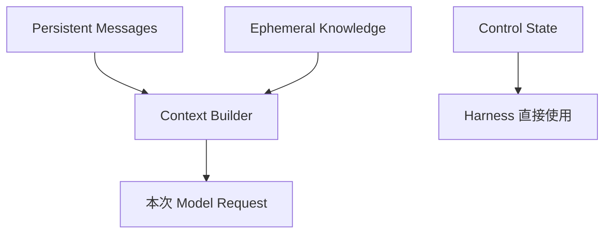
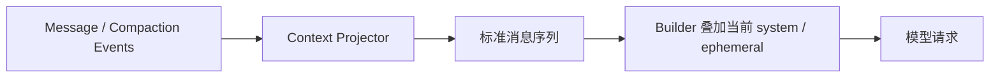
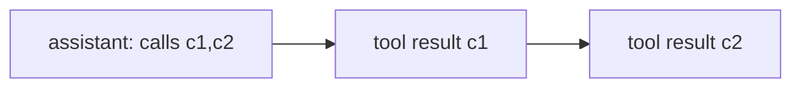
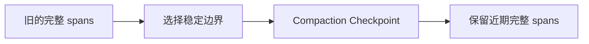
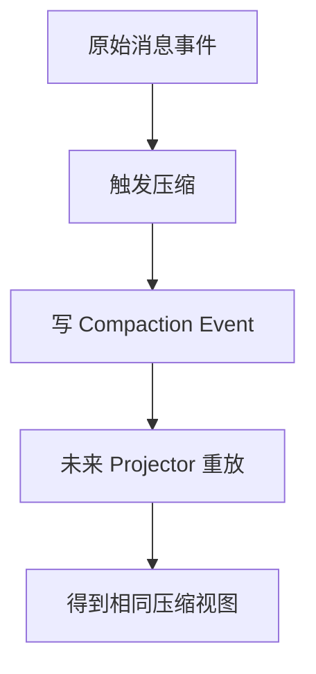
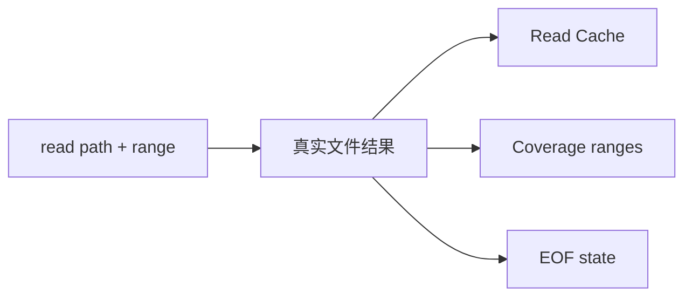
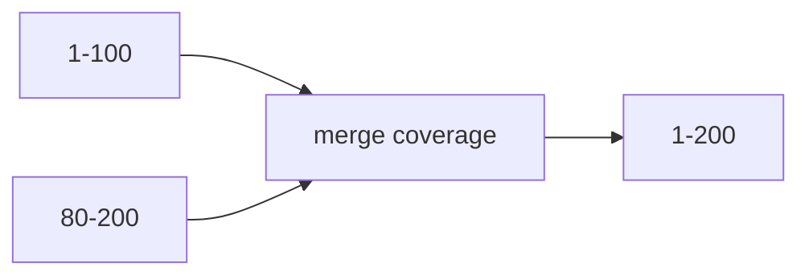
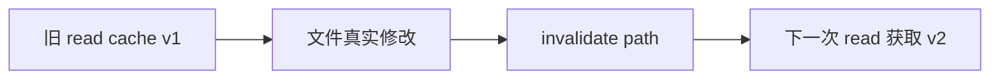
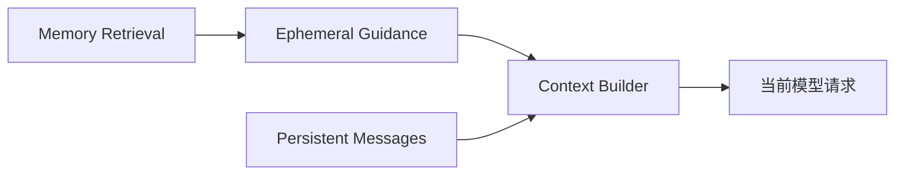
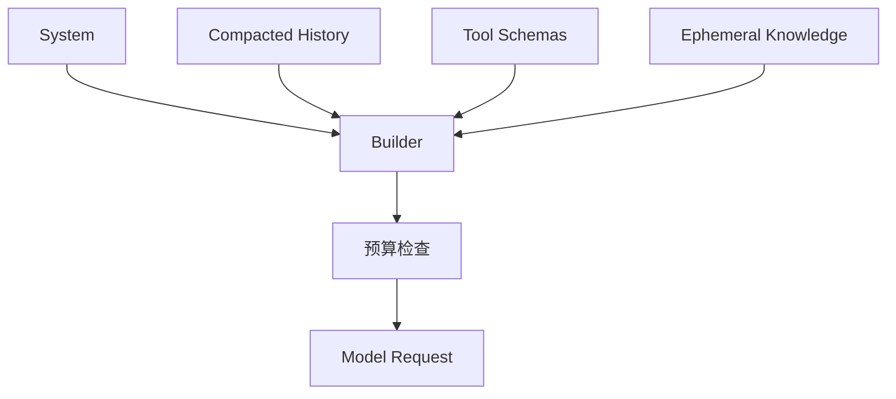

# 10 上下文治理与读取状态：长会话怎样控制 token，又不破坏工具协议

前面已经知道 AgentContext 会持续积累模型消息、工具调用和工具结果。任务一长，问题就出现了：**哪些历史可以缩短，哪些调用/结果不能拆开；重复读文件怎样避免；文件修改以后旧读取为什么必须失效；这些优化又怎样在恢复后保持一致。**

本章只处理“当前会话里的上下文和读取状态”。跨会话知识放在第 11 章，文档知识库放在第 12 章。

---

## 1. 先看 Context 系统的三层状态

GitAgent 不把所有信息都当成一串无限增长的聊天消息。

| 层 | 例子 | 生命周期 |
|---|---|---|
| Persistent Messages | 用户消息、assistant tool calls、tool results、压缩事件后的投影 | 可持久化、可重放 |
| Control State | waiting、open calls、workspace revision、读取覆盖 | 由运行时维护，不必全部发给模型 |
| Ephemeral Knowledge | 当前系统 Prompt、相关长期记忆、临时引用 | 每次请求按当前状态重建 |

这里最关键的设计是：**运行时状态不等于模型消息，模型消息也不等于所有可恢复状态。**

---

## 2. model messages 怎样从事件历史投影出来

第 09 章已经知道消息事实主要进入 Event History。Context Projector 会把相关事件按 run_id 和顺序投影成标准模型消息。

这让恢复后不需要保存一个“已经拼好但可能过时”的最终 prompt。当前系统规则、可见工具和临时知识可以按照新进程的当前配置重新加上去。

---

## 3. 为什么工具调用和工具结果必须当成原子 span

一个 assistant message 可能一次提出多个 tool calls，随后有多个对应 tool result。对模型协议来说，这几条消息构成一个整体调用 span。

压缩不能只删掉中间的 tool result，却保留 assistant 的 open call；也不能保留 tool result 但删掉它的调用来源。

因此 Context 系统先识别这些原子 span，后续压缩以 span 为单位处理，而不是简单按“最老的 N 条消息”切掉。

这正是 Agent Loop 的 call_id 协议对上下文治理提出的约束。

---

## 4. 先理解三档上下文压力，而不是先背百分比

当前实现使用分级压力区间来选择不同强度的压缩策略。常见阈值大致围绕 50%、70%、90% 的 context window 使用量。

可以理解成三种状态：

| 压力 | 目标 | 典型动作 |
|---|---|---|
| 中等 | 先去掉最容易重新获得的冗余 | 缩短旧工具结果、去重明显重复信息 |
| 较高 | 明显收缩早期历史 | 对旧 span 做摘要、保留近期交互 |
| 很高 | 确保下一轮请求仍有输出空间 | 更积极压缩，只保留关键 checkpoint 与近期状态 |

数字是实现参数，不是设计本身。设计重点是：**压力越大，压缩越激进，但始终不能破坏协议和必要控制证据。**

---

## 5. 第一级压缩怎样优先处理可再获取内容

最先缩短的通常是体积大、后续可以重新读取的工具输出，例如长文件片段、搜索结果、冗长日志。

系统不会简单删除“调用发生过”这一事实，而是保留足以让模型知道这个 span 做过什么、结果是什么性质的摘要或占位。

这样模型不会误以为从未执行过那次工具调用，同时可以在需要细节时重新读取当前事实。

这也体现一个原则：**历史细节如果可以安全再获取，就比不可重建的用户决定更适合被压缩。**

---

## 6. 更高压力下怎样形成 deterministic checkpoint

当上下文继续增长，只缩短单个工具输出已经不够。系统会把更早的一段完整历史压成 checkpoint 摘要。

这里“deterministic”主要指 checkpoint 的选择边界和组成遵循确定规则，而不是让模型随机决定“我觉得哪些历史不重要”。

Checkpoint 会尽量保留任务目标、已经确认的事实、重要决策和仍然影响后续的结果。近期交互则继续保持较完整形式。

这样模型得到的是“早期压缩 + 近期细节”，而不是整个历史无限增长。

---

## 7. Compaction 为什么也要写成事件

压缩改变了“以后模型应该看到的历史视图”。如果只在内存里改 messages，进程重启后从原始事件重放就会得到另一份上下文。

因此压缩结果本身会进入 Event History，成为可以重放的 compaction event。

这让“压缩决定”不是进程内临时优化，而是当前 Session 上下文演化的一部分。

---

## 8. open call 为什么不能跨压缩边界被破坏

如果当前正在等待某个 tool result，assistant call 已经存在但结果尚未闭合，那么这一段仍然属于活动协议。

压缩器必须避开这种不完整 span。否则恢复或下一次模型请求可能出现“调用已经消失，但工具结果又到达”之类无法解释的状态。

因此压缩只处理已经达到稳定边界的历史。正在运行、等待或未闭合的调用属于控制活跃区，不是普通旧消息。

---

## 9. 文件读取状态解决的是另一个问题：避免重复取同一事实

上下文压缩控制“已经拿到的信息怎样进入模型”。File Read State 则控制“同一文件是否还需要再次访问底层”。

每次成功读取文件后，系统记录：

- 路径；
- 版本/内容指纹；
- 已读取的行范围；
- 是否已经到达 EOF；
- 对应缓存内容。

下次读取同一版本的相同范围时，可以直接利用缓存或判断覆盖关系。

---

## 10. Coverage 为什么比“这个文件读过”更准确

文件可能很长，Agent 只读过其中一部分。如果只记录 `read=True`，后面很难判断第 500–700 行有没有看过。

因此读取状态记录区间覆盖。

例如先读 1–100，再读 80–200，coverage 可以合并成 1–200。下次请求 20–50 已经完全覆盖；请求 180–260 则只有一部分覆盖，还需要读取未覆盖范围。

这让缓存按“事实范围”工作，而不是按“文件名是否出现过”工作。

---

## 11. EOF 状态为什么也值得保存

如果一次读取已经明确到达文件末尾，那么后续继续请求更大的结束行没有必要再次访问文件系统，只要文件版本没变。

例如读取 1–500，但文件实际只有 230 行。系统可以记录“230 是当前 EOF”。下次读取 200–1000 时，已有缓存就能说明 230 之后不存在内容。

这是小优化，但长任务反复探索同一文件时能减少无意义 I/O 和工具消息。

---

## 12. 文件发生真实变化后，旧读取状态必须失效

读取缓存只有在“文件版本没变”时才是事实。

当 edit/write/delete 在 Commit 阶段确认 `changed=true` 后，相关文件的读取缓存、coverage 和 EOF 状态会失效。

如果写调用只是 no-op，没有改变文件，则不需要无意义地清掉缓存。

这和第 07 章 workspace revision 是同一思想：只有真实状态改变，才推进依赖它的版本化状态。

---

## 13. worktree / source 变化为什么会整体影响读取缓存

不仅单文件写会让缓存失效。切换到另一份 source SHA、创建新的 Coding Workspace，或者整体工作树来源变化时，旧读取内容也不再能代表当前文件事实。

因此读取状态和 workspace 身份绑定。不能把“之前在 main@S1 读过 config.py”直接复用到 PR@S2 的工作区。

缓存命中必须建立在“同一逻辑文件版本”的条件上，而不是只比较路径字符串。

---

## 14. 工具结果缓存怎样减少 I/O，却不一定减少模型 token

即使读取命中缓存，运行时仍可能需要把结果作为 tool result 发送给模型。如果结果完整进入 prompt，模型输入 token 仍然存在。

所以要区分：

- Read Cache：减少底层文件/网络访问；
- Context Compaction：减少保留在模型上下文中的历史体积；
- Provider Prompt/KV Cache：模型服务内部优化，属于另一层。

GitAgent 的读取状态和上下文治理主要控制前两者，不能把“cache hit”直接写成“模型 token 零成本”。

---

## 15. 长期记忆怎样进入当前上下文但不污染消息历史

第 11 章会讲 Memory 的完整生命周期。这里只说明注入方式。

当前任务开始或模型请求构造时，可以检索和当前目标相关的长期记忆，并作为 ephemeral guidance 加入当前请求。

这些记忆不会伪装成用户曾经在当前 Session 说过的话，也不需要永久复制成每个 run 的历史消息。

因此恢复时可以按当前 Memory 状态重新检索，而不会造成历史重复注入。

---

## 16. Context Builder 怎样形成最终请求

现在可以把第 04 章和本章连起来。

一次模型请求前，Builder 大致需要组合：

1. 当前 Agent 的系统 Prompt；
2. Event History 投影出的、必要时经过 compaction 的持久消息；
3. 当前可见 Capability schema；
4. 当前相关的 ephemeral memory / knowledge；
5. 预留输出预算后仍能放入 context window 的最终内容。

这里没有把 workspace revision、ApprovalStore 等所有控制状态直接序列化给模型。需要模型知道的部分由对应系统以明确形式注入，需要 Harness 自己判断的部分留在控制层。

---

## 17. 一次长 Coding Session 怎样演化

假设 Coding Agent 连续探索了几十个文件，运行了多次测试。

**前期**：context 使用量低，保留较完整工具结果。File Read State 逐步积累覆盖范围。

**中期**：大量旧文件输出占空间。达到中等压力后，旧可再获取结果被缩短；近期修改和验证仍完整保留。

**继续增长**：旧的已闭合 span 被压成 checkpoint，compaction event 写入 Event History。

**文件发生修改**：对应 read cache 失效，workspace revision 推进。之前文件正文的压缩摘要仍然属于历史，但下一次需要当前事实时必须重新读取新版本。

**进程重启**：Projector 从历史事件重放同样的压缩视图，Pause Snapshot 恢复控制状态。读取缓存是否恢复则遵循当前实现支持的状态边界，不能因为历史里曾读过就默认当前文件仍相同。

这说明压缩和缓存的共同原则是：**压缩可以丢可再获取的细节，缓存只能复用仍被版本证明有效的事实。**

---

## 18. STAR 复盘：为什么不能简单“只保留最近 N 条消息”

### S — Situation

Agent 历史里有普通对话，也有带 call_id 的工具协议；工具输出可能非常大；同一个文件还会被多次分段读取和修改。如果只按消息条数截断，可能切断调用协议，也可能保留大量可再获取内容却丢掉关键用户决定。

### T — Task

系统需要在 context window 内尽量保留仍影响当前任务的事实，同时保证调用/结果协议完整；读取侧还要减少重复 I/O，并确保文件变化后旧缓存绝不冒充当前事实。

### A — Action

GitAgent 把消息组织成原子 tool spans，用分级压力策略逐步压缩；更高压力下生成稳定 checkpoint，并把 compaction 记录成可重放事件；活跃 open calls 不跨边界压缩。文件读取独立维护版本、coverage、EOF 和缓存；真实 mutation 在 Commit 后使相关读取状态失效；长期记忆作为 ephemeral guidance 按需注入。

### R — Result

长会话能够在有限窗口中继续运行，而且重启后可以得到一致的历史投影视图；重复文件读取减少，同时不会在文件变化后复用旧事实。代价是 Context 系统必须理解工具协议和版本状态，而不能只是一个字符串截断器。

核心收益是：**上下文可以变短，但任务事实不能因为压缩和缓存变得自相矛盾。**

---

## 19. 这一章最容易混淆的地方

| 误解 | 正确理解 |
|---|---|
| Context 就是一串消息 | 不够。还有控制状态和临时知识 |
| 压缩可以任意删旧消息 | 不可以。tool call/result span 要保持完整 |
| 文件读过一次以后一直可复用 | 不可以。版本或内容变化后必须失效 |
| cache hit = 模型不再消耗对应 token | 不一定；工具缓存与模型 prompt/KV cache 不同 |
| Compaction 只在内存生效 | 不是。压缩结果会形成可重放事件 |
| Memory 应该复制进历史消息永久保存 | 不需要，相关记忆可以作为临时 guidance 注入 |

---

## 20. 复习时怎样讲这一章

推荐用两个词：**span** 和 **version**。

> 上下文压缩以已经闭合的工具 span 为安全边界，压力升高后逐步从缩短旧结果到形成 checkpoint；文件缓存则以文件/workspace 版本为安全边界，记录 coverage 和 EOF，真实修改后立即失效。前者保证消息协议不被切断，后者保证缓存不冒充当前事实。

## 21. 代码定位

| 想核对的问题 | 主要位置 |
|---|---|
| Context 状态和 model messages | `gitagent/harness/context/state.py` |
| 构建与 token 压力处理 | `gitagent/harness/context/builder.py` |
| 历史投影与 compaction | `gitagent/harness/context/projector.py` |
| 标准消息 / tool span | `gitagent/harness/context/messages.py` |
| 文件读取覆盖与缓存 | `gitagent/harness/file_reads.py` |
| 事件历史中的 compaction | `gitagent/infra/persistence/event_log.py` |

下一章进入跨会话状态：[GitAgent 怎样从已完成的交互中提取长期记忆，并处理作用域、冲突、过期和遗忘](11-long-term-memory.md)。
