# 10 上下文治理与读取状态：GitAgent 如何在长会话里控制模型输入与重复读取

前一章讲清楚了 Session、Event History、Pause Snapshot 和恢复流程。本章继续沿着“一个长任务怎样持续运行”这条线，专门解释两个运行时模块：

- **Context Governance**：每次调用模型之前，怎样从历史事实构造当前模型真正能看到的消息；上下文变大以后，又怎样安全压缩。
- **Read State**：Agent 多次读取仓库文件时，怎样记住已经读过哪些范围，减少重叠读取，并在工作区发生变化后让旧状态失效。

这一章的阅读顺序刻意安排成：**先看系统怎么做，再讨论为什么采用这些设计。** 每个核心模块都会先给出执行流程，随后用 STAR 回看设计动机。

---

## 1. 先建立全景：本章其实有两条相互配合的链路

先不要急着记阈值、checkpoint、coverage 这些细节。先看一次长会话里，两条链路分别负责什么。

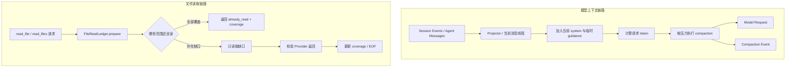

这两条链路关注的对象不同：

| 链路 | 管理的对象 | 直接目标 |
|---|---|---|
| Context Governance | 模型消息、tool call/result、system、临时 guidance | 让下一次模型请求保持可解释、可压缩、可恢复 |
| Read State | 仓库文件读取范围、ref、EOF | 避免重复读取已经覆盖的文件区间 |

它们会在长任务里互相影响：文件读取会产生大量 tool result，tool result 会进入模型历史；历史越来越大后，Context Governance 又会开始压缩这些旧结果。

先记住一句话：

> **Context Governance 管“模型下一轮看到什么”，Read State 管“文件下一次还要不要真的再读”。**

---

# 第一部分：模型上下文是怎样构造出来的

## 2. 第一步：先把持久化事件投影成标准模型消息

### 2.1 先看它怎么做

GitAgent 持久化的是 Session Event。模型接口最终需要的是标准的 `system / user / assistant / tool` 消息序列。

中间由 **Context Projector** 完成转换。

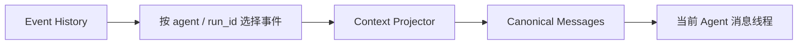

Projector 做的事情可以拆成四步。

### 第 1 步：选择属于当前消息线程的事件

Main Agent 和 Domain Agent 共用同一份 Session Event History，但它们看到的消息线程不同。

| 消息线程 | 投影依据 |
|---|---|
| Main | 取 Main 可见的用户消息、Main model message、相关 compaction event |
| Domain Agent | 按 `agent + run_id` 只恢复这一条 Domain run 的 model message 与 compaction event |

因此，同一个 Session 里可以同时存在 Main、Repository、Coding 等 Agent 的运行事实，恢复时仍然能够把各自的模型线程拆开。

### 第 2 步：把事件转成统一的 canonical message

所有准备进入模型线程的消息都会经过统一格式校验。系统只接受标准 role 和对应字段，例如 tool result 必须带 `tool_call_id`，assistant 的 tool call 必须有合法 call id、函数名和参数字符串。

这一层的作用是把“历史事件格式”收束成“模型接口格式”。后面的压缩、恢复和 token 计算都建立在同一种消息结构上。

### 第 3 步：把 tool result 放回对应 tool call 附近

某些 Agent 调用可能经历异步执行或父子 Agent 调度，事件写入顺序和模型最适合看到的调用顺序可能存在差异。

Projector 会根据 `call_id` 把已经完成的 tool result 关联回原来的 assistant tool call，使模型线程重新形成连续的调用关系。

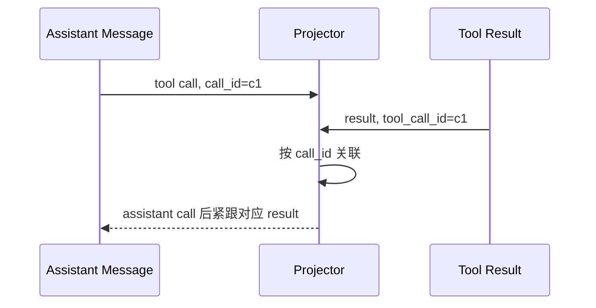

### 第 4 步：应用历史中的 compaction event

如果历史里已经发生过上下文压缩，Projector 会按照 compaction event 中保存的 replacement、checkpoint 和保留索引重新得到压缩后的模型视图。

所以恢复出来的消息线程已经包含过去发生过的压缩决定。

### 2.2 再用 STAR 回看这一步的设计动机

**S — Situation**

一个 Session 里同时有 Main 和多个 Domain run，持久化层保存的是按时间追加的事件，模型接口需要的是连续且满足 tool 协议的消息数组。

**T — Task**

系统需要从同一份事件事实中，稳定恢复出某个 Agent 当前应该看到的模型线程，同时兼容历史中的压缩结果。

**A — Action**

GitAgent 使用 Projector 按 Agent 身份和 `run_id` 选择事件，再统一转成 canonical message；tool call/result 通过 `call_id` 重新关联，compaction event 在投影阶段直接应用。

**R — Result**

消息历史有明确的恢复路径。进程重启以后，不需要依赖一份长期保存的“最终 prompt 副本”，只要事件仍然完整，就能重新得到对应 Agent 的模型视图。

---

## 3. 第二步：在持久消息之外，加入本轮才需要的上下文

### 3.1 先看它怎么做

模型请求并不只包含历史消息。真正发给模型之前，还会加入当前运行环境才能确定的信息。

对于 Main Agent，可以把构造过程理解成：

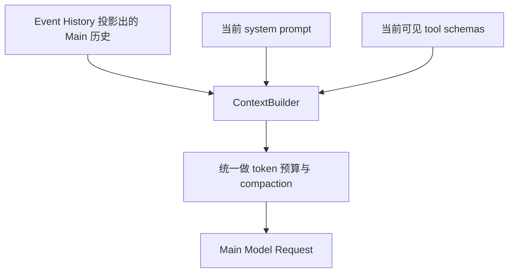

对于 Domain Agent，`AgentContext` 自己维护当前消息线程。在调用模型之前，它会复制这份线程，并把本轮的 guidance、额外 memory read 等临时信息追加进 system message，然后再进入同一套 compaction 逻辑。

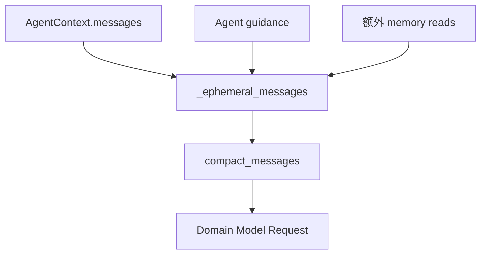

这里需要区分三类信息，而且 Main 与 Domain 的 system 处理方式有一点差别。

| 信息 | 例子 | 当前实现怎样处理 |
|---|---|---|
| Durable thread | user、assistant、tool call、tool result；Domain 线程中的 system | 作为 model message 持久化并可重放 |
| Main current system | Main 当前系统规则 | `ContextBuilder` 构造 Main 请求时放到消息最前面 |
| Ephemeral guidance | Domain 本轮 guidance、额外 memory read | 只参与当前请求构造，不直接写回永久消息内容 |

Domain Agent 的 system message 本身属于它的消息线程。临时 guidance 会在本轮请求里追加到这条 system message 上；如果本轮触发压缩，GitAgent 更新 `AgentContext.messages` 时会把第一条 system 恢复成 Agent 原始的 `system_prompt`，避免临时内容随着压缩永久进入消息线程。

### 3.2 这一步最重要的边界

可以把“模型可见信息”和“Harness 控制状态”分开理解。

例如：

- tool call 是否仍然 open，由 Harness 根据消息协议判断；
- `waiting`、child context、未提交 capability result 属于运行控制状态；
- 文件 coverage 属于读取控制状态；
- 当前 guidance 只有需要模型知道时才进入本轮请求。

这些状态没有必要全部转成聊天文字塞给模型。

### 3.3 STAR 复盘

**S — Situation**

Main 当前 system、Domain guidance、Memory 读取结果等信息的生命周期并不相同。全部永久复制进同一类历史，会让消息越来越大，也会让恢复逻辑难以判断哪些内容应该继续沿用。

**T — Task**

模型每轮都要拿到这一轮有效的信息，同时持久消息线程需要保持稳定、可重放。

**A — Action**

GitAgent 让持久消息继续走事件历史和 Agent 消息线程；Main 的当前 system 在构造请求时加入，Domain 的临时 guidance 只叠加到本轮请求。Domain Agent 在压缩后更新持久消息状态时，会重新放回原始 system prompt。

**R — Result**

模型能够拿到本轮需要的信息，临时 guidance 又不会随着每次请求持续写进永久线程。Main 恢复后可以重新使用当前 system，Domain 的持久消息则继续按自己的 run 进行重放。

---

# 第二部分：上下文太大以后怎样压缩

## 4. 第三步：所有消息先经过统一 token 压力检查

### 4.1 先看它怎么做

Main 和 Domain Agent 最终都复用同一套 `compact_messages` 策略。

输入包括：

- 当前准备发送的 messages；
- 当前 tool schemas；
- 当前 Agent 的 context window 大小。

系统先计算整份请求占用，再得到：

> `context pressure = 当前请求 token / context window token`

当前实现有三档阈值：

| 阶段 | 触发压力 | 主要动作 |
|---|---:|---|
| Light | 50% | 优先缩短较大的旧 tool result |
| Summary | 70% | 把较早的完整消息 span 收成 checkpoint |
| Emergency | 90% | 只保留必须保留的消息，再尽量从最近历史向前补 |

执行顺序固定为：

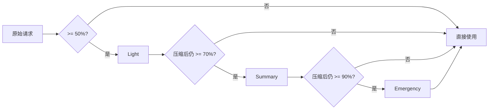

每一级都会重新计算 token。前一级已经把压力降下来时，后面的更激进策略不会继续执行。

### 4.2 STAR 复盘

**S — Situation**

长任务会持续累积消息、工具参数、工具结果和 tool schemas。一次性采用最激进的裁剪会过早损失上下文，完全不处理又会撞上模型窗口上限。

**T — Task**

系统需要随着上下文压力逐步增加压缩强度，并且每次压缩后重新判断是否已经足够。

**A — Action**

GitAgent 使用 Light → Summary → Emergency 的固定阶段，并在每个阶段结束后重新做 token 计算。

**R — Result**

低压力时保留更多细节，高压力时逐步收缩历史。压缩强度和实际请求大小直接关联，行为更容易预测和测试。

---

## 5. Light：先处理体积大的旧 tool result

### 5.1 先看它怎么做

Light 阶段只扫描 `role=tool` 的消息。

当某条 tool result 的估算体积达到 256 token 以上时，系统会把正文替换成一个短说明，其中保留：

- 这是一条已经执行过的工具结果；
- 原结果大概有多大；
- 对应的 `tool_call_id` 仍然存在。

整个过程会从较早消息向后扫描。一旦总体压力已经降到 50% 以下，就停止继续替换。

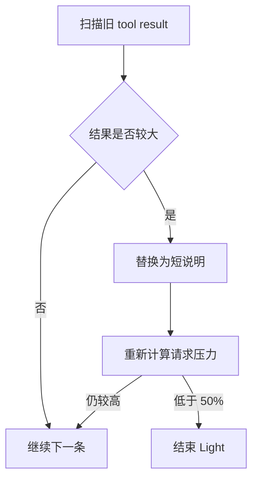

这里保留的是 tool message 的协议外壳。`tool_call_id` 不会因为正文被压缩而消失。

### 5.2 STAR 复盘

**S — Situation**

文件正文、搜索结果、日志等 tool result 往往比普通对话大很多，而且这些内容通常已经参与过前面的推理。

**T — Task**

优先回收大块 token，同时尽量少动用户消息、assistant 结论和调用关系。

**A — Action**

Light 阶段只替换达到一定体积的 tool result，并保留对应 tool call 的身份关系。

**R — Result**

很多长任务只靠这一层就能把请求压回安全区，后续历史仍保留较完整的对话结构。

---

## 6. Summary：按原子 span 把早期历史收成 checkpoint

### 6.1 先理解 atomic span 是什么

Summary 阶段不能随便在任意消息位置切一刀。GitAgent 先把历史拆成 **atomic span**。

普通消息自己就是一个 span。例如一条独立的 user message，可以作为一个完整历史块参与后续边界计算。

带工具调用的 assistant message，会和紧跟其后的匹配 tool result 组成一个 span：

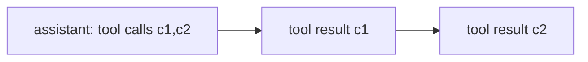

对于 Agent delegation，一组 `agent__...` 调用完成以后，如果后面紧跟一条不再发工具调用的 assistant 消息，这条总结消息也会被纳入同一个 span。

可以把 span 理解成：**模型协议上适合作为一个整体保留或整体折叠的最小历史块。**

### 6.2 Summary 具体怎样选择边界

系统保留当前 system message，然后尝试从最早的完整 span 开始向 checkpoint 中收拢。

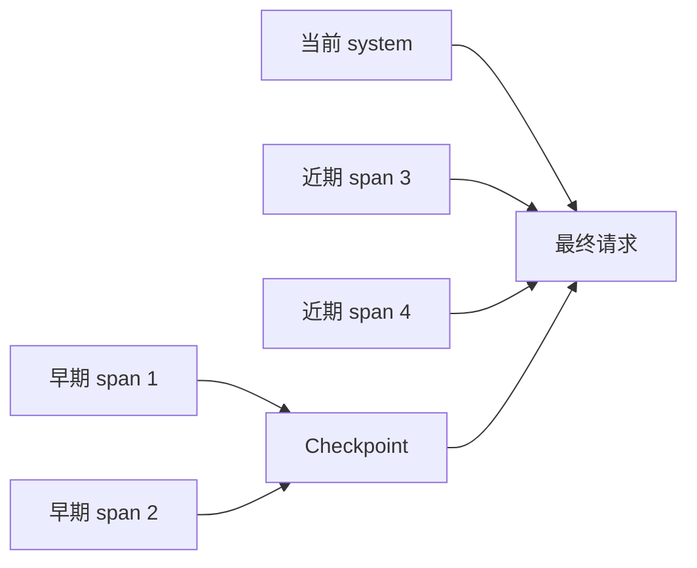

每尝试一个新的边界，系统都会构造候选请求并重新计算 token。

checkpoint 内容由固定规则从被折叠消息中提取：

- 普通 user / assistant 文本保留为有长度上限的摘要记录；
- assistant tool call 保留工具名和有长度上限的参数描述；
- tool result 保留有长度上限的结果描述；
- 如果早期已经存在 checkpoint，会把它的内容继续纳入新的 checkpoint。

这里的“deterministic”主要体现在：**边界选择和 checkpoint 拼接遵循固定程序，不交给模型临场自由判断。**

### 6.3 STAR 复盘

**S — Situation**

Light 只能回收大 tool result。随着会话继续增长，普通对话、工具调用、近期推理也会累计到很大。

**T — Task**

系统需要进一步压缩较早历史，同时避免把一个工具调用协议切成两半。

**A — Action**

GitAgent 先划分 atomic span，再只在 span 边界选择 checkpoint 截止位置。早期完整 span 进入 checkpoint，近期 span 保持原样。

**R — Result**

模型得到“早期压缩视图 + 近期完整细节”。压缩过程仍然能够维持 tool call/result 的结构完整性。

---

## 7. Emergency：先守住最小必要上下文，再尽量保留最近历史

### 7.1 先看它怎么做

如果 Summary 之后压力仍达到 90%，系统进入 Emergency。

这一步的策略发生明显变化。系统先计算哪些消息必须留下：

1. 当前最近一条 user message；
2. 所有仍然存在未闭合 tool call 的 span。

这些消息组成最低保留集合。

随后系统从**最近的 span**开始向前尝试补回历史，只要加入以后仍能放进 context window，就继续保留。

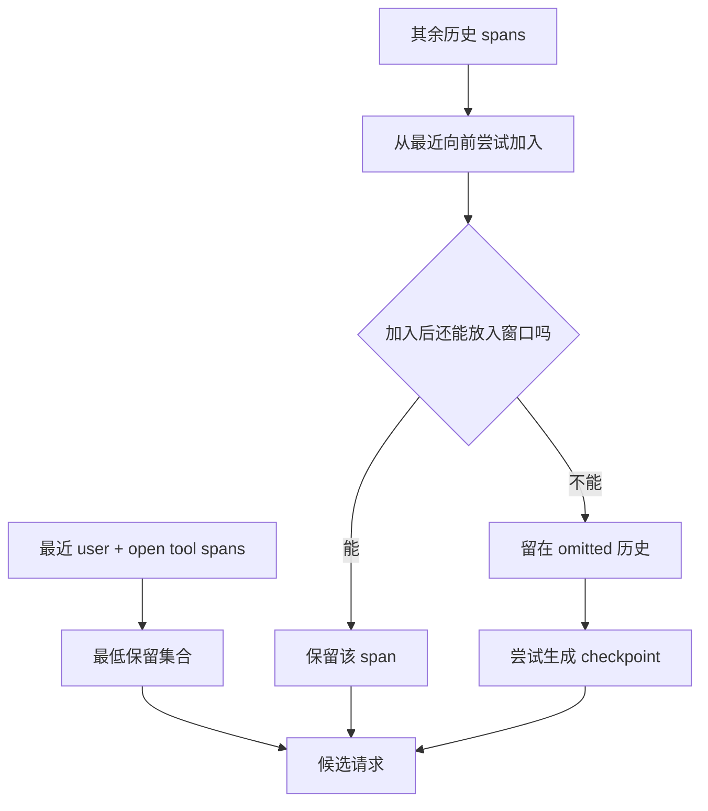

如果被省略的历史还能压成 checkpoint 并放进窗口，系统就加上 checkpoint；如果 checkpoint 本身也放不下，就只保留选中的必要消息和近期 span。

如果连“当前 user + 活跃工具协议”这一最低集合都已经超过窗口，系统直接抛出 `ContextWindowExceeded`，停止继续构造无效请求。

### 7.2 STAR 复盘

**S — Situation**

上下文已经接近窗口极限，继续追求完整历史会让下一次模型调用连最基本的输入空间都没有。

**T — Task**

优先保证当前任务还能继续执行，并保护尚未结束的工具协议。

**A — Action**

Emergency 先固定最近 user message 和 open tool span，再从最近历史向前补充；剩余历史尽量转成 checkpoint。最低集合都放不下时立即失败。

**R — Result**

极端压力下，系统仍然优先保住当前任务入口和活动协议，同时给近期上下文最高保留优先级。

---

## 8. tool call/result 协议是压缩过程里的硬边界

### 8.1 先看协议检查怎样工作

在压缩前和压缩后，GitAgent 都会校验工具消息关系。

一个合法片段通常长这样：

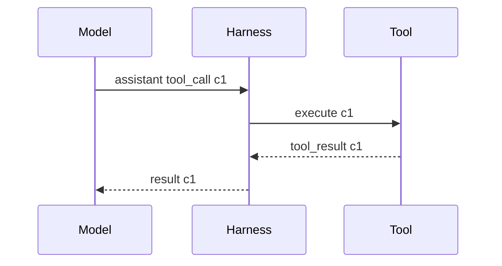

检查规则主要包括：

- tool result 必须找到对应的 assistant tool call；
- 一组 tool calls 尚未全部收到结果时，不能插入无关普通消息打断；
- 前一组调用仍未闭合时，不能开始下一组 assistant tool calls；
- Emergency 必须把 open tool span 保留在最低集合中。

### 8.2 再看为什么这一层不能只按消息条数截断

假设历史顺序是“assistant 发出 `c1` → tool 返回 `c1` → assistant 给出下一步结论”。

如果按“只保留最近 N 条”截断，很容易只剩 tool result，或者只剩 assistant call。模型接口看到的调用链会失去对应关系。

### 8.3 STAR 复盘

**S — Situation**

工具调用在模型协议里依靠 `call_id` 形成成对关系。消息条数和协议边界没有直接对应关系。

**T — Task**

任何压缩都必须保证剩余消息仍然是一条合法的模型调用历史。

**A — Action**

GitAgent 先建立 atomic span，压缩边界只落在 span 之间；压缩前后都运行 tool protocol 校验，Emergency 额外保护 open span。

**R — Result**

上下文可以缩短，但不会留下孤立 tool result、悬空 tool call 或被普通消息打断的未完成协议。

---

# 第三部分：压缩结果怎样跨重启继续生效

## 9. Compaction 保存的是“怎样得到新视图”的持久化增量

### 9.1 先看它怎么做

一次 compaction 发生后，GitAgent 会形成 `MessageCompactionPlan`。计划里可能包含三类信息：

| 字段 | 表达的含义 |
|---|---|
| `tool_replacements` | 哪些 tool result 被 Light 替换成短说明 |
| `checkpoint` | 被折叠历史形成的 checkpoint 内容 |
| `retain_message_indexes` | 原历史里哪些消息继续完整保留 |

随后 Application / SessionManager 把这个计划写成 `compaction_checkpoint` 事件。

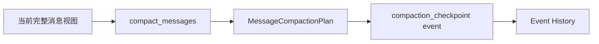

以后恢复消息时，Projector 读到这条事件，就在当时已有的投影视图上应用同一份增量：

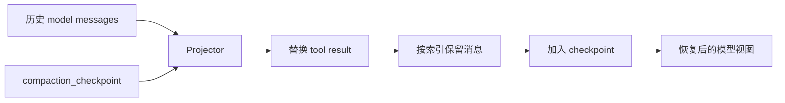

这意味着 compaction 本身也属于 Session 历史演化的一部分。

### 9.2 Main 与 Domain Agent 都会持久化压缩

Main 的 `ContextBuilder` 在构造请求时发现 compaction 后，会直接记录 compaction event。

Domain Agent 通过 `AgentContext.model_messages()` 触发同一套压缩，再由 Application 提供的 compaction sink 把计划写入事件历史，并记录压缩前后的 token 使用量。

两条路径最终都使用同一种 compaction event 语义。

### 9.3 STAR 复盘

**S — Situation**

如果压缩只修改当前进程中的 message list，重启以后重新读取原始事件时，早期大段历史又会全部出现。

**T — Task**

压缩后的模型视图需要能够跨进程重放，而且恢复结果要和压缩发生后的线程保持一致。

**A — Action**

GitAgent 把 replacement、checkpoint、保留索引写成 `compaction_checkpoint` 事件；Projector 在恢复时重新应用这些增量。

**R — Result**

上下文压缩拥有可重放的持久化语义。进程重启不会自动回到压缩前的完整消息视图。

---

# 第四部分：文件读取状态是怎样工作的

## 10. 先区分两个读取机制：通用 Read Cache 与 FileReadLedger

`AgentContext` 里同时存在两个容易混淆的结构。

| 机制 | 适用范围 | 保存内容 | 命中后的行为 |
|---|---|---|---|
| `read_cache` | 一般 READ capability；排除 repository file read 与 memory read | capability 的完整原始结果 | 相同 capability + 参数可以直接复用结果 |
| `FileReadLedger` | `repository.read_file` / `repository.read_files` | 读取 coverage、EOF、repository/path/ref 身份 | 已覆盖范围不再访问 Provider；返回 `already_read + coverage` |

这两个机制的目标都包含“减少重复读取”，实现方式差异很大。

尤其要记住：**FileReadLedger 保存读取覆盖事实，不保存文件正文。**

---

## 11. FileReadLedger 的完整流程：Prepare → Execute → Complete

### 11.1 先看它怎么做

一次仓库文件读取进入 Harness 后，会先经过 `FileReadLedger.prepare()`。

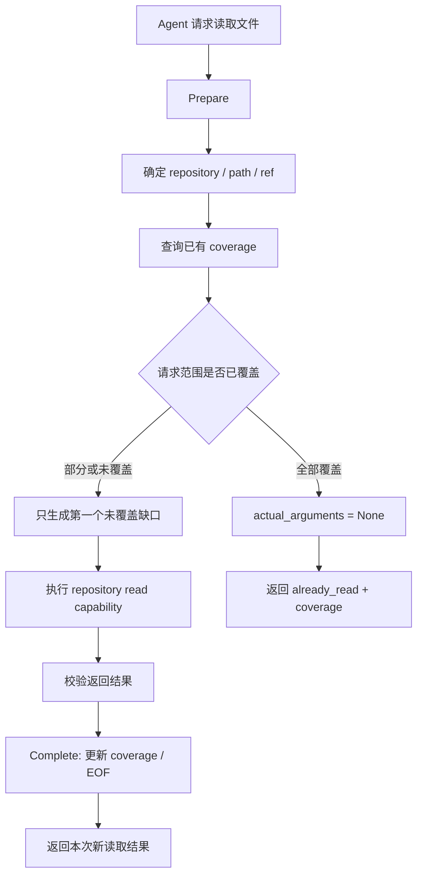

这个过程分三层理解最清楚。

### Prepare：先算“真正还需要读什么”

每个文件读取请求先规范成：

- `path`；
- `start_line`；
- `limit`；
- 用户是否显式传了 `start_line`。

Ledger 用 `(repository, path, ref)` 作为一个文件读取状态的身份键。

随后根据已有 coverage 计算缺口。

### Execute：只把缺口交给底层 Provider

如果整段请求已经覆盖，`actual_arguments` 会变成空，底层 capability 不再执行。

如果只覆盖了一部分，Harness 会把底层请求改成当前范围内的第一个未覆盖区间。

### Complete：先校验结果，再记账

底层返回以后，Ledger 不会直接相信结果。它会检查：

- 返回对象数量是否和实际请求数量一致；
- 返回 path 是否和请求 path 一致；
- `start_line / end_line / content / truncated` 结构是否合法。

校验通过后，才把新的范围加入 coverage，并根据 `truncated` 更新 EOF。

### 11.2 STAR 复盘

**S — Situation**

Coding Agent 会频繁探索同一仓库。一个文件可能先读前 200 行，随后又请求 100–300 行，批量读取还可能同时包含已读和未读文件。

**T — Task**

系统需要避免重复访问已经观察过的区间，同时保证新返回的范围元数据可信。

**A — Action**

GitAgent 把文件读取拆成 Prepare、Execute、Complete。Prepare 计算缺口，Execute 只读取缺口，Complete 校验 Provider 结果后再更新 ledger。

**R — Result**

重复 I/O 明显减少；读取状态有统一入口维护；错误的 Provider 元数据不会直接污染后续 coverage 判断。

---

## 12. Coverage 怎样表示“这个文件到底读到哪里了”

### 12.1 先看区间合并

`FileCoverage` 保存多个已覆盖行区间，读取时会把相邻或重叠范围合并。

例如先后读取：

- 1–100；
- 80–200；
- 250–300。

最终 coverage 会合并成 `[1, 200]` 和 `[250, 300]` 两段，也就是：

| 已读范围 | 状态 |
|---|---|
| 1–200 | 已覆盖 |
| 201–249 | 缺口 |
| 250–300 | 已覆盖 |

如果接下来请求 150–260，Ledger 会发现前半段已经覆盖，当前第一个缺口从 201 开始，因此只需要继续获取缺失部分。

### 12.2 显式 start_line 与省略 start_line 的行为不同

这是当前实现里很容易漏掉的一点。

#### 情况 A：用户显式指定 start_line

例如请求 150–260。Ledger 只在这个指定范围里寻找第一个缺口。

#### 情况 B：用户省略 start_line

这类请求通常表示“继续给我下一段”。Ledger 会从第 1 行开始寻找第一个尚未覆盖的位置，再读取一段新的内容。

因此，多次调用同一个“默认从头读”的文件读取能力时，Ledger 会逐步把读取窗口向后推进，而不会反复从第 1 行开始。

### 12.3 STAR 复盘

**S — Situation**

只记录一个 `read=true` 无法表达长文件的分段读取，也无法判断一个新请求和旧范围重叠了多少。

**T — Task**

读取状态需要精确到行区间，还要支持“继续读下一段”的自然行为。

**A — Action**

GitAgent 用 coverage ranges 保存已读区间，通过 gap 计算得到下一次真实请求；没有显式起始行时，从第一个未覆盖位置继续。

**R — Result**

系统能够区分“整段读过”“只读过一部分”“中间还有缺口”，分段探索长文件时不会重复读取已经覆盖的大块内容。

---

## 13. EOF 怎样让 Ledger 知道文件已经结束

### 13.1 先看它怎么做

Provider 返回文件片段时会同时告诉 Harness 结果是否被截断。

当 `truncated=false`，Ledger 会把本次 `end_line` 记录为 `eof_line`。

例如请求 1–500，文件实际只有 230 行。Provider 返回到第 230 行并标记 `truncated=false`，Ledger 随即记录 `eof_line=230`。

以后再请求 200–1000 时，Ledger 会把可计算范围限制到 EOF，230 之后不会再制造新的读取请求。

### 13.2 STAR 复盘

**S — Situation**

仅有 coverage 时，系统知道哪些行读过，却不知道文件在什么位置结束。一个很大的 limit 可能让 Agent 反复尝试读取文件尾部之外的区域。

**T — Task**

读取状态需要区分“这里还没读”和“这里已经没有内容”。

**A — Action**

完整返回时记录 `eof_line`，后续 gap 计算会先受 EOF 限制。

**R — Result**

文件末尾成为明确状态，后续读取不会继续访问已经确认不存在的行区间。

---

## 14. 批量读取怎样处理“一部分已经读过”的情况

### 14.1 先看它怎么做

`repository.read_files` 可以一次提交多个文件请求。Prepare 会逐个计算 coverage。

假设一次批量请求包含：

| 请求 | 当前状态 | 实际动作 |
|---|---|---|
| `a.py` 1–200 | 已覆盖 | 不访问 Provider |
| `b.py` 1–200 | 未读取 | 真实读取 |
| `c.py` 100–300 | 100–180 已覆盖 | 只请求当前第一个缺口 |

最终传给 Provider 的批量参数只包含仍需真实读取的项。

Complete 阶段再把新结果和“已经覆盖”的项分别整理回当前调用的结果视图。

对完全覆盖的项，返回的是类似 `already_read + coverage` 的状态说明。Ledger 不会从内部拼出旧文件正文，因为它根本没有保存正文副本。

### 14.2 STAR 复盘

**S — Situation**

批量读取中，不同文件的历史 coverage 可能完全不同。如果整批照原参数重新执行，会浪费大量重复 I/O。

**T — Task**

在保持一次批量调用语义的同时，只把真正缺失的读取任务交给 Provider。

**A — Action**

Prepare 对每一项独立算缺口，再重建一份只包含实际读取项的 provider 参数；Complete 把新结果和已覆盖状态重新对应到原请求。

**R — Result**

批量读取也能共享同一份 coverage 状态，已经观察过的文件不会因为和新文件一起批量请求就再次访问底层。

---

# 第五部分：读取状态什么时候失效，什么时候恢复

## 15. 当前实现采用“写成功后整体清空”的保守失效策略

### 15.1 先看它怎么做

只要一个 capability 属于 `WRITE` 或 `DESTRUCTIVE`，并且执行结果为 success，`AgentContext` 就会清空：

- 通用 `read_cache`；
- `FileReadLedger`。

这一步发生在 capability commit 流程中。

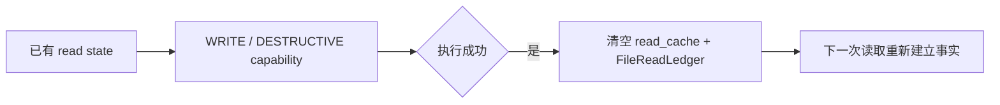

这里采用的是**整体清空**。当前实现没有只按单个 path 精细删除 coverage。

另外，`native.bash` 可能绕过结构化写工具直接改变 worktree。Harness 会比较执行前后的 worktree state；一旦发现变化，同样会：

- 记录 workspace mutation；
- 清空 `read_cache`；
- 清空 `FileReadLedger`。

### 15.2 要和 workspace revision 分开理解

读取状态失效与 workspace revision 都和修改有关，但触发语义不完全相同。

结构化 native write/destructive capability 成功后，读取状态会直接清空。

workspace revision 的推进还会进一步查看这次原始结果是否表明 `changed=true`，用于标记代码工作区真的产生了新的 revision。

因此复习时可以这样区分：

> **读取状态关心“旧读结果还敢不敢继续复用”，workspace revision 关心“工作区事实是否形成了新的代码版本”。**

### 15.3 STAR 复盘

**S — Situation**

文件一旦被修改，旧 coverage 虽然还能说明“过去读过哪些行”，却无法证明这些行仍然代表当前 worktree。

**T — Task**

任何可能改变仓库内容的成功写操作之后，都要避免旧读取状态继续影响新的事实判断。

**A — Action**

当前实现采用保守策略：成功 WRITE / DESTRUCTIVE capability 后整体清空两类读取状态；bash 导致 worktree 变化时也执行同样清理。

**R — Result**

下一次读取会从当前仓库状态重新建立 coverage。实现简单，安全边界清晰，代价是某个局部文件修改也会让其他文件的读取状态一起失效。

---

## 16. repository、path、ref 共同限定一份 FileCoverage

### 16.1 先看它怎么做

FileReadLedger 内部使用三元组作为读取身份：

> `(repository, path, ref)`

因此：

- 同一个 path 在不同 repository 下拥有不同 coverage；
- 同一个 path 在不同 `ref` 下拥有不同 coverage；
- ref 相同且 repository/path 相同时，才能共享这一份行覆盖状态。

这对远端仓库读取尤其重要。例如同一个 `config.py`，Main branch 和某个 PR head 对应的 ref 不同，Ledger 会维护两份独立 coverage。

### 16.2 STAR 复盘

**S — Situation**

路径字符串只能说明文件名，无法单独说明文件来自哪个仓库版本。

**T — Task**

读取覆盖必须绑定到足够明确的仓库身份，避免跨 repository 或跨 ref 复用。

**A — Action**

GitAgent 把 repository、path、ref 一起作为 FileCoverage 的 key。

**R — Result**

同名文件在不同仓库来源下不会共享覆盖状态，读取判断和当前目标版本保持一致。

---

## 17. Pause Snapshot 会保存读取状态，恢复后继续使用

### 17.1 先看它怎么做

当 Agent 因等待用户、审批或其他控制点而保存 Context 时，Application 会把两类读取状态一起序列化进 pause context：

- `read_cache`；
- `file_reads`。

恢复 Context 时：

- `read_cache` 直接还原成字典；
- `file_reads` 通过 `FileReadLedger.from_plain()` 重建 coverage 和 EOF。

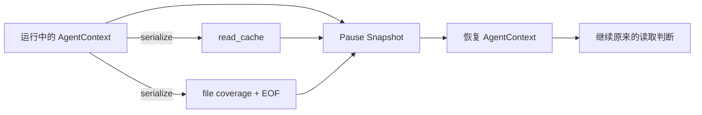

因此，一个 Agent 在暂停前已经读过 `a.py` 1–200，恢复后仍然知道这段范围已经覆盖。

### 17.2 STAR 复盘

**S — Situation**

等待用户输入时进程可能结束。只恢复模型消息，却丢掉读取 coverage，会让恢复后的 Agent 把同一批文件重新读一遍。

**T — Task**

读取控制状态需要和等待中的 Agent 控制树一起恢复。

**A — Action**

Pause Snapshot 序列化通用 read cache 与 FileReadLedger，恢复 AgentContext 时重新装载。

**R — Result**

暂停前后的读取行为保持连续，长任务恢复以后不会因为进程变化立刻丢失所有“已经观察过”的运行状态。

---

# 第六部分：把两套机制放回一次真实长任务

## 18. 一个 Coding Agent 连续工作时，系统内部发生了什么

假设 Coding Agent 要修改一个中型仓库，它连续读取文件、调用模型、修改代码并运行验证。

下面按时间顺序走完整个过程。

### 阶段 1：Agent 第一次读取文件

Agent 请求：

- `service.py` 1–200；
- `models.py` 1–200。

FileReadLedger 里还没有 coverage，所以两次读取都会真实访问 Provider。成功返回后，`service.py` 和 `models.py` 都记录 `[1, 200]` 这一段覆盖范围。

这些正文作为 tool result 进入 Agent 的模型消息线程。

### 阶段 2：Agent 再次请求重叠范围

Agent 又请求 `service.py` 150–350。

Ledger 发现 150–200 已经覆盖，新的缺口从 201 开始，因此只会把缺失区间交给 Provider。

Agent 继续探索时，coverage 会逐步向后扩展。

### 阶段 3：模型历史逐渐变大

随着几十次文件读取、搜索和工具调用累积，`model_messages()` 每次都会计算当前请求 token。

低于 50% 时，消息保持完整。

达到 Light 压力后，旧的大 tool result 开始被替换成短说明。

如果仍然继续增长，Summary 会把较早的完整 span 收进 checkpoint。

### 阶段 4：发生代码修改

Coding Agent 成功执行写操作。

Harness 在 commit capability 时清空通用 read cache 和 FileReadLedger。下一次再读取 `service.py` 时，会重新访问当前 worktree，建立新的 coverage。

此前模型历史里的旧 tool result 仍然属于“当时发生过的历史事实”；读取状态清空解决的是“以后再读时要基于当前文件重新取事实”。

### 阶段 5：Agent 等待用户后进程退出

Pause Snapshot 保存当前控制树，同时保存 read cache 与 FileReadLedger。

Event History 保存模型消息和已经发生的 compaction event。

恢复时：

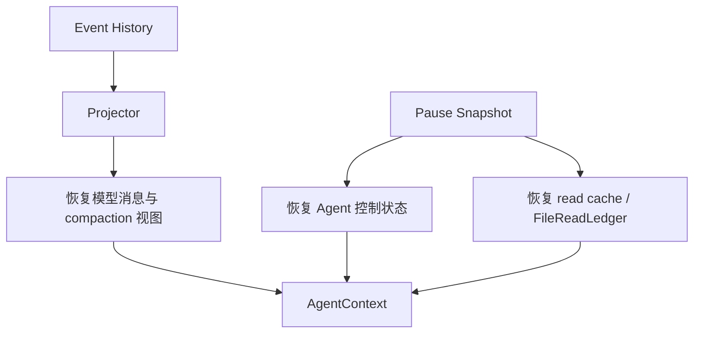

恢复完成以后，模型历史、等待控制点和读取状态各自从对应的持久化来源回来，再组合成可继续运行的 AgentContext。

---

## 19. 这一整套设计的总 STAR

### S — Situation

长 Agent 会话同时面临四类压力：

1. 消息历史持续增长，最终会碰到模型 context window；
2. tool call/result 有严格的 `call_id` 协议，压缩不能破坏调用链；
3. Coding Agent 会重复读取大量文件，需要记住已经观察过的范围；
4. 文件会在任务中被修改，旧读取状态随时可能过期，进程还可能在中途暂停和恢复。

### T — Task

Harness 需要同时维持两种一致性：

- **模型上下文一致性**：压缩以后，消息仍然满足 provider 协议，并且重启后可以恢复出相同的压缩视图；
- **仓库读取一致性**：重复读取尽量被消除，文件变化以后旧 coverage 不再继续影响当前事实，暂停恢复后读取状态仍然连续。

### A — Action

GitAgent 把历史事件投影成 canonical messages，在请求构造阶段加入当前 system 与临时 guidance，然后统一进行 token 压力检查。压缩按 Light、Summary、Emergency 三档推进，边界建立在 atomic span 上，并把 compaction plan 持久化为事件。

文件读取侧单独使用 FileReadLedger，以 `(repository, path, ref)` 记录 coverage 和 EOF；Prepare 只生成未覆盖缺口，Complete 校验 Provider 返回后再更新状态。普通 READ capability 另有通用 `read_cache`。写操作成功或 bash 改变 worktree 后，两类读取状态都会清空；等待中的 Context 会把它们一起保存进 Pause Snapshot。

### R — Result

长会话能够持续控制模型输入体积，tool 协议在压缩后仍然完整，压缩决定可以跨重启重放。Coding Agent 对同一文件的重复访问也被显著减少，仓库变化后又会重新建立读取事实。

整章最终可以压成一句复习结论：

> **消息侧用 atomic span 守住模型协议，用 compaction event 守住恢复一致性；读取侧用 coverage 守住“读过哪里”，用失效清理守住“当前事实”。**

---

## 20. 最容易混淆的概念

| 容易混淆的说法 | 应该怎样理解 |
|---|---|
| Context 等于完整运行状态 | 模型消息只是运行状态的一部分；waiting、child、读取 ledger 等由 Harness 单独维护 |
| Light 会删除整个工具调用 | Light 主要替换较大的 tool result 正文，`tool_call_id` 仍然保留 |
| Summary 可以从任意消息位置截断 | Summary 先构造 atomic span，再从 span 边界折叠早期历史 |
| Emergency 只保留最近几条 | 它先保留最近 user message 和 open tool span，再从最近历史向前补 |
| Checkpoint 只存在内存 | compaction plan 会写成 `compaction_checkpoint` event，恢复时重新应用 |
| FileReadLedger 是文件正文缓存 | 它保存 coverage 和 EOF，不保存正文 |
| 文件读过一次就整体标记已读 | 状态精确到行区间，还会计算缺口 |
| 完全命中 coverage 后会返回旧正文 | 当前实现返回 `already_read + coverage`，并跳过底层读取 |
| 只有 `changed=true` 才清读取状态 | 成功 WRITE / DESTRUCTIVE capability 会清读取状态；`changed=true` 还参与 workspace revision 的推进 |
| bash 不经过结构化写工具，所以读取状态不会变化 | Harness 会比较 bash 前后的 worktree state，检测到变化后清空读取状态 |
| Pause Snapshot 只保存 waiting | 当前 AgentContext 的 read cache 与 FileReadLedger 也会随暂停状态序列化和恢复 |

---

## 21. 复习时建议按这条顺序讲

如果面试或复盘时需要在几分钟内讲清楚本章，可以沿着下面这条链：

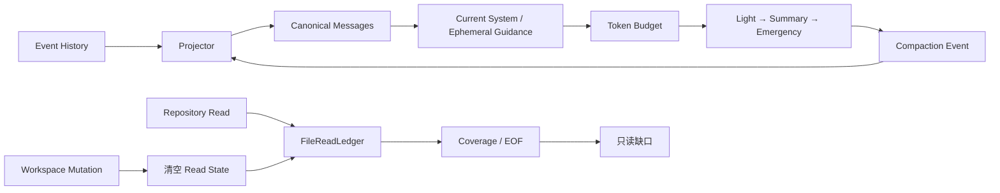

讲述时抓住五个关键词就够了：

**Projection → Ephemeral → Span → Compaction Event → Coverage**

可以这样组织口头答案：

> GitAgent 先从事件历史投影出当前 Agent 的标准消息线程，再加入当前 system 和本轮临时 guidance。发送模型前统一计算 token 压力，50%、70%、90% 分别进入 Light、Summary、Emergency；涉及工具调用的历史先按 atomic span 分组，避免压缩破坏 call/result 协议。压缩计划会写成事件，所以恢复时可以重放同一份模型视图。文件读取另外维护 FileReadLedger，用 repository、path、ref 区分文件身份，用 coverage 和 EOF 记录已经观察过的范围，只把缺口交给 Provider。成功写操作或 worktree 变化后会清空读取状态，暂停恢复时则从 snapshot 重新装载。

---

## 22. 代码定位：复习时应该去哪里核对

| 想核对的问题 | 主要位置 |
|---|---|
| canonical message 格式与 tool call 结构 | `gitagent/harness/context/messages.py` |
| 50% / 70% / 90% 压力阈值 | `gitagent/harness/context/budget.py` |
| Main 请求构造与统一 compaction | `gitagent/harness/context/builder.py` |
| atomic span、Light、Summary、Emergency 具体策略 | `gitagent/harness/context/builder.py` |
| Main / Domain 消息投影与 compaction 重放 | `gitagent/harness/context/projector.py` |
| Domain Agent 临时 guidance、消息线程、read cache | `gitagent/harness/context/state.py` |
| coverage、gap、EOF、批量文件读取 | `gitagent/harness/file_reads.py` |
| compaction event 的持久化格式 | `gitagent/infra/persistence/sessions.py` |
| Pause Snapshot 中读取状态的序列化与恢复 | `gitagent/application/service.py` |

下一章进入跨会话知识层：[GitAgent 怎样从已完成交互中提取长期记忆，并处理作用域、冲突、过期和遗忘](11-long-term-memory.md)。
