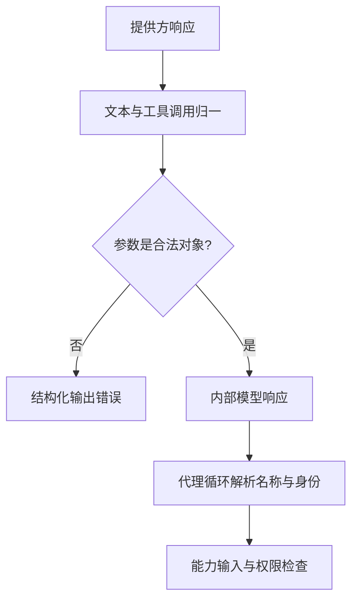

# 10 模型协议与适配：一次推理怎样成为运行时可以接住的决定

## 本章先回答什么

前九章解释了调用进入运行时之后怎样执行。但还有一个更早的问题：模型返回的内容凭什么能成为一次调用？如果更换模型服务，审批、工具协议和上下文恢复是否也要跟着重写？

假设用户要求审阅一个合并请求。模型可能先返回两项读取调用，再返回审阅结论；也可能输出一段解释，却没有给出父代理需要的结构化结果。对人来说，两种回答都像是“模型回复了”。对运行时来说，它们具有不同资格。

本章沿着这次审阅的模型请求展开：**先构造模型真正会看到的输入，再归一响应，最后把表达和控制分开，让模型差异停留在适配边界。**

### 本章的 STAR 主线

| 阶段 | 本章要解决的问题 |
|---|---|
| 情境 S | 模型服务返回文本、工具调用和专有字段，业务流程却需要稳定、可验证的决定 |
| 任务 T | 隔离传输差异，维护调用身份，给结构化结果和上下文余量建立明确契约 |
| 行动 A | 构造请求 → 适配消息 → 估算预算 → 接收响应 → 归一调用 → 校验结果 → 交给代理循环 |
| 结果 R | 业务与调度不直接依赖提供方响应格式，同时明确兼容接口不等于完整模型适配 |

---

## 1. 情境：模型能回答，不等于系统能继续

合并请求代理把审阅任务交给代码代理。代码代理读取差异后，模型回答“没有发现严重问题”。

这句话足够让人理解大意，却不足以驱动合并准备判断。系统仍不知道是否有阻塞问题、是否符合原目标、哪些风险需要人工确认。如果父代理再从这句话里猜这些字段，就把原本确定的业务判断重新变成了一次自然语言推测。

另一种响应更直接：模型发出工具调用。但工具名称可能错误，参数可能不是合法 JSON，或者同一个响应重复使用调用编号。此时不能因为响应来自模型 API，就跳过运行时协议检查。

因此模型接入要同时解决两个问题：让不同服务的响应有统一形状；让形状合法的响应获得与其用途相符的控制资格。

---

## 2. 任务：为什么传输、推理结果和执行要分开

GitAgent 不让一个模型客户端同时负责请求网络、解释业务和执行工具。


模型客户端处理请求、响应归一和用量统计。推理适配层把响应转成文本与结构化调用，并在需要时校验专用结果。代理循环判断如何推进；执行框架才决定动作是否允许发生。

这样，一项 HTTP 参数变化不会要求修改审批状态机；审阅结果增加业务约束，也不需要让网络客户端认识合并请求。

这里的分层价值是限制变化传播，而不是增加包装层数。

---

## 3. 请求出发前，先确定模型可以决定什么

模型请求包含消息和工具定义。消息提供目标与证据，工具定义限定它可以提出的结构化动作。

审阅任务中的代码代理可以读取代码并提交审阅结果，但不能获得 GitHub 合并接口。这个差别在请求发送前就形成了。后续即使模型试图编造合并调用，运行时也不会因此授予权限。

工具定义有双重作用：它向模型说明“怎样表达一个动作”，也占据输入预算。因此上下文统计必须包含最终发送的工具集合，不能只统计聊天正文。

第 02 章讲工具如何经过发现过滤；本章接着处理已经确定的消息和工具，不再自行扩大工具范围。

---

## 4. 为什么普通回复和结构化结果使用不同结束契约

普通会话允许模型以文本结束。需要审阅产物的步骤则要求返回指定结果工具。

可以把二者理解成两种消费方式：文本交给人或上层模型理解；结构化结果交给确定性程序继续判断。后者必须约定字段类型、必需字段和允许值。

下面是一个用于解释边界的简化 schema，并非当前审阅对象的完整定义：

```json
{
  "type": "object",
  "properties": {
    "summary": {"type": "string"},
    "blocking_issues": {
      "type": "array",
      "items": {"type": "string"}
    },
    "aligned_with_goal": {"type": "boolean"}
  },
  "required": ["summary", "blocking_issues", "aligned_with_goal"]
}
```

字段的意义不在于让 JSON 看起来整齐，而在于消除下游猜测：“没有阻塞问题”和“没有提供阻塞问题字段”是两件事。

同样，schema 通过只说明数据满足结构契约，不证明审阅结论符合真实代码。事实判断仍然依赖证据，不能交给类型检查代替。

---

## 5. 专用结果为什么要求恰好一个调用

需要结构化结果时，GitAgent 检查模型是否调用了约定的函数，而且只返回一项调用。

假设本次要求返回审阅对象，模型却同时提交两个互不一致的审阅结果。运行时不能任意挑第一个，也不能自行合并，否则会引入一条未定义的业务规则。返回错误函数名或只有普通文本，同样不能当作成功。

因此这一入口要求“指定函数 + 单一调用 + 参数通过 schema”。对于仍在探索的普通代理步骤，则可以允许多个工具调用。两者对应不同阶段，不是统一禁止模型并行。

结果工具也会进入最终工具列表；组装时去除同名重复项，避免预算看到一份定义，模型实际收到另一份。

---

## 6. 提供方响应怎样转换成内部调用

模型客户端先把内容归一成文本，把每项工具调用归一成调用编号、名称和参数对象。参数字符串必须能解析成 JSON object，数组或普通字符串不满足调用契约。

推理适配层随后形成内部模型响应。它保留文本，也保留结构化调用；如果二者都没有有效内容，当前响应就没有可推进的意义。



注意检查分布在不同层。客户端解析 JSON，代理循环检查调用身份与命名空间，能力层检查具体能力的输入。这让每层只承担自己拥有的信息能够支持的判断。

---

## 7. 为什么归一之后仍保留标准助手消息

内部调用对象便于调度，但恢复需要重建模型原来看到的协议。只有调用名称和参数，还不足以复原助手消息与工具结果之间的对应关系。

因此响应同时保留标准助手消息，包括工具调用编号，以及适配需要的附加字段。代理上下文记录这条消息，后续工具结果再按原编号闭合。

这形成两种用途不同的表示：内部对象用于执行，标准消息用于历史。它们必须指向同一次调用，不能分别生成新身份。

这也是第 01 章坚持 `call_id` 稳定的起点。

---

## 8. 推理字段为什么在发送边界适配

不同服务对 `reasoning_content` 等字段的要求不同。当前实现对模型名称或端点包含 DeepSeek 标识的请求保留该字段，并在工具调用消息缺少它时补入空值；对其他请求则去掉助手消息中的这一字段。

关键不只是“有一个条件判断”，而是判断发生在哪里。适配器复制待发送消息，不直接改写持久历史。同一份会话事实与某个服务要求的请求形式因此可以分开。

这是一项针对特定兼容需求的适配，不是通用模型能力探测。它也不意味着 GitAgent 读取或控制了模型内部的完整推理过程。字段传递、推理强度控制与模型内部计算是不同层面的问题。

---

## 9. 上下文压缩以后，为什么还要计算输出余量

第 05 章已经缩小输入，但请求仍需要给输出留空间。假设模型窗口为 W，发送内容估算占用 I，配置希望最多生成 O，那么客户端实际请求的输出上限是：

```text
实际输出上限 = min(O, W - I)
```

如果剩余空间连一个 token 都没有，客户端直接报告上下文超限，不把必然不合法的请求发给提供方。

这里使用的是经过消息适配后的请求。否则本地计算包含了一个实际不发送的字段，或者遗漏实际发送的工具定义，就会让余量计算偏离真实请求。

这个检查只保证在本地估算下有剩余空间，并不保证余量足以生成完整答案。输出长度是否足够与输入能否装下仍是不同问题。

---

## 10. 为什么 token 估算不能被描述成精确计量

当前通用模型请求采用固定规则：序列化消息与工具，再按 UTF-8 字节数除以三向上取整。它的优点是确定、轻量，而且不依赖某个远端模型的 tokenizer。

代价也明确：相同字节长度的中文、英文、代码和特殊字段，在真实模型里未必占用相同 token 数。因此“本地剩余空间为正”不等于提供方一定接受请求。

客户端收到的 `usage` 则是另一类信息。它用于统计服务报告的输入和输出消耗；服务未提供用量时，当前实现使用零值，不能据此断言模型没有消耗。

文档中应始终区分请求前估算与请求后用量。前者控制预算，后者记录服务报告的实际使用，两者不能交换角色。

---

## 11. 读取缓存、Prompt Cache 和 KV Cache 为什么不能混为一谈

用户连续询问同一文件时，GitAgent 可以复用工具结果，减少文件或网络读取。这个缓存发生在工具层，模型仍可能收到该结果并执行新推理。

模型服务对重复输入的缓存属于另一层：它影响提供方如何复用计算。KV Cache 则属于模型推理内部状态，不能用“缓存了一段文件正文”来代替解释。

当前 GitAgent 没有实现对提供方 KV Cache 的直接管理，也没有在通用响应中单独统计缓存命中用量。稳定的请求组织可能与服务缓存机制有关，但不能据此声称项目已经实现了模型缓存优化。

这个区分决定了性能解释的边界：工具调用变少、输入 token 变少和模型计算被复用，是三个不同结果。

---

## 12. 失败后，到底是谁在重试

模型调用至少涉及两种恢复。网络请求失败可能由 SDK 重试；模型给出的结构不合法，则可能由代理循环反馈错误，再请求模型重新生成。

当前客户端创建 SDK 时设置了 `max_retries=2`。这与执行配置中的结构化纠错上限、能力提供方重试上限不是同一个计数器。一次代理步骤可能包含 SDK 内部尝试，不能把步骤数直接当成 HTTP 请求数。

模型网络重试也不是 GitHub 写操作重试。客户端只取回模型响应，不执行响应中的工具；收到有效响应后，工具才进入 Harness 的权限与副作用边界。

因此第 03 章禁止不确定写操作自动重试，与模型客户端有限网络重试可以同时成立。需要防止混淆的是重试对象。

---

## 13. 看起来有回调，为什么仍不是流式运行

当前调用等待完整模型响应返回，然后才解析工具调用，并把完整文本交给可选回调。它没有逐段消费模型输出，也没有在参数还未收齐时执行工具。

这种同步方式让响应校验和调用批次更容易形成完整边界，但用户需要等待整次生成；运行中如何打断请求，也不能直接等同于取消一个尚未启动的工具任务。

所以本项目的并发重点在工具和子代理调度，不应把它描述成已经具备流式工具参数执行或完整实时交互协议。

---

## 14. 多代理为什么还不等于多模型路由

主代理、领域代理和代码代理承担不同职责，但当前应用装配创建一个模型客户端和共享的推理适配器。不同代理可以有不同上下文窗口和步骤上限，却没有据此自动选择不同模型。

职责拆分与模型选择是两条独立设计轴。前者控制工具、上下文和业务状态，后者涉及质量、成本与延迟的选择策略。

同理，配置一个模型名称表示指定后端，不表示运行时已经能够判断“这项任务应该使用哪种模型”。本章建立的是适配边界，不把尚未实现的选择能力算进当前系统。

---

## 15. 用一次审阅把整章串起来

代码代理首先根据审阅任务构造消息和允许工具。客户端复制消息并适配提供方字段，再估算消息、工具和输出余量。模型返回两项读取调用，客户端把参数解析成对象，推理适配层形成内部响应，同时保留标准助手消息。

代理循环检查调用身份，执行框架完成读取并写回对应结果。模型再次推理，这次提交约定的审阅结果工具。结果必须只有一项、名称正确、参数满足 schema，之后才能成为父代理的审阅产物。

父代理拿到产物后，再结合当前 Review、CI 和合并请求状态判断准备度。模型适配层到这里已经完成职责，它既不批准合并，也不把“审阅通过”当成远端写授权。

这条链说明，一次推理真正进入系统，依靠的是连续的契约交接。

---

## 16. 结果：这一层建立了什么，又没有替系统解决什么

模型客户端隔离传输格式，推理适配层隔离响应语义，代理循环与能力层继续控制执行。换服务时可以集中处理消息差异，业务判断不必重新认识原始响应。

代价是需要维护两种响应表示、多个校验边界，以及不同重试计数。它们值得存在，是因为“服务返回成功”“结构符合要求”“业务结论可信”“动作允许执行”本来就是四件事。

当前实现仍是同步、单一模型配置、基于估算的预算控制和有限提供方适配。明确这些范围，才能准确解释已有设计的价值。

## 17. 复习时怎样讲这一章

从“审阅文本为什么不能直接驱动合并”开始，说明系统为什么需要结构化结果。接着沿请求构造、消息适配、预算、响应归一和结果校验走一遍，再把 `call_id` 接回第 01 章的代理循环。

最后区分三组容易混淆的概念：格式合法与事实正确、模型请求重试与工具执行重试、多代理分工与多模型路由。

## 18. 代码定位

| 想核对的问题 | 代码位置 |
|---|---|
| 请求参数、提供方字段、用量与输出余量 | `gitagent/model/chat_client.py` |
| 普通响应和结构化结果契约 | `gitagent/model/reasoner.py` |
| 统一 token 估算规则 | `gitagent/token_accounting.py` |
| 请求上下文与标准消息记录 | `gitagent/harness/context/state.py` |
| 模型对象如何共享 | `gitagent/application/bootstrap.py` |

下一章继续沿调用向下走：[内置工具、MCP 与 Skills](11-tools-mcp-and-skills.md)。
