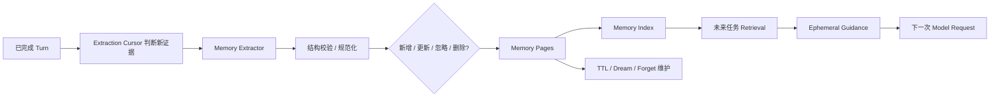
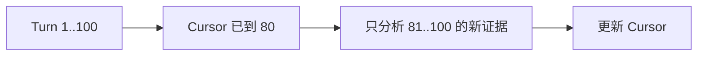
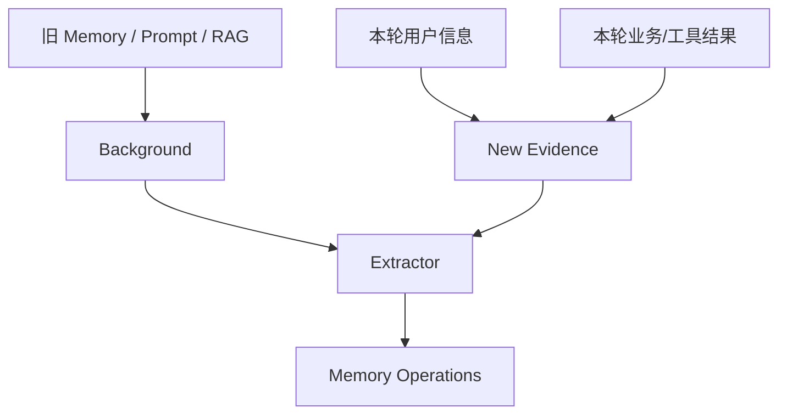
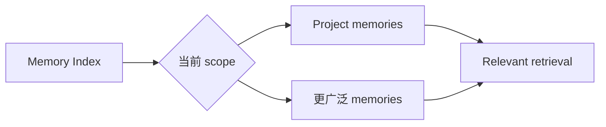
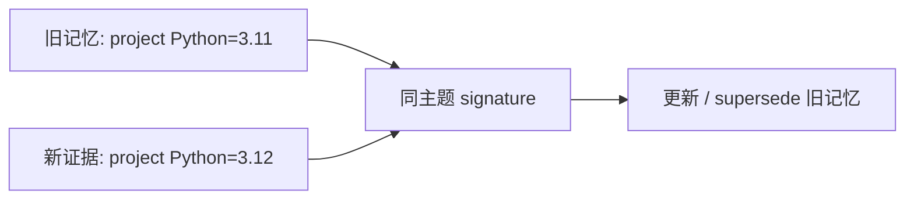
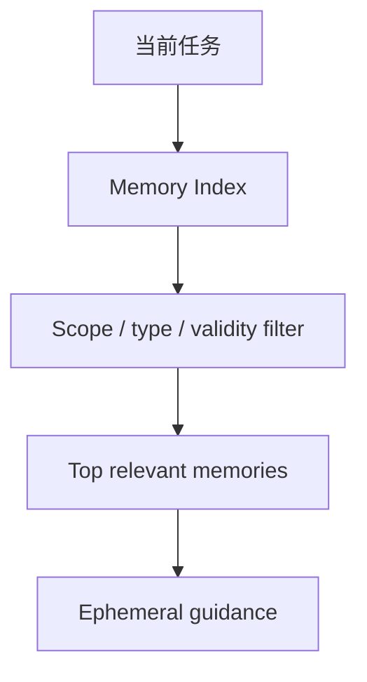
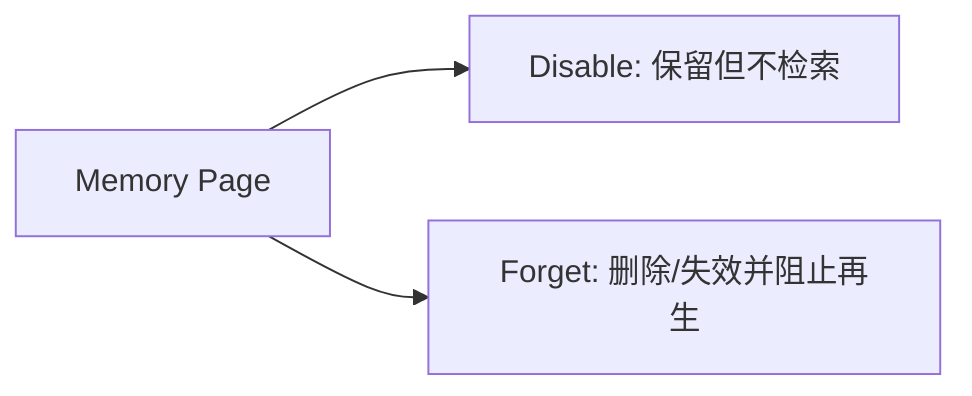

# 11 长期记忆：一次会话里的信息怎样成为以后可复用的知识

第 10 章处理的是“当前 Session 太长怎么办”。长期记忆解决的是另一件事：**这次会话结束以后，哪些稳定信息值得在未来 Session 里继续使用，怎样避免把临时结论、旧事实或用户明确要求遗忘的内容永久带下去。**

本章先走完整的 Memory 生命周期，再解释为什么它和聊天历史、RAG 都必须分开。

---

## 1. 先看长期记忆的完整生命周期

这条链可以先记成五步：

1. 从**已经完成**的交互中识别新证据；
2. 抽取少量值得长期保存的候选记忆；
3. 经过结构和冲突规则后写入 Memory Page；
4. 建索引，在未来任务中按作用域检索；
5. 随时间更新、过期、替代或遗忘。

Memory 不是把每轮对话全文复制到另一个文件夹。

---

## 2. Memory Page 是长期知识的基本单元

一条长期记忆不仅包含一段正文，还需要知道它属于谁、在哪些任务中适用、从哪里来、当前是否仍有效。

可以把 Memory Page 理解成一个带元数据的小知识卡片。

| 元数据 | 作用 |
|---|---|
| type | 这是偏好、项目事实、工作方式还是其他记忆 |
| scope | 只对某个项目适用，还是更广泛适用 |
| source / evidence | 它从哪次交互和哪些证据产生 |
| timestamps | 何时创建、何时更新、何时过期 |
| priority / manual | 用户明确指定的记忆是否应覆盖自动提取 |
| signature / identity | 怎样判断新候选是否和已有记忆是同一主题 |

这样系统后续才有能力更新同一条记忆，而不是每次都新增一份相互矛盾的文本。

---

## 3. 为什么只从完成的业务轮次提取

正在运行的 Turn 里可能有：

- 模型的中间猜测；
- 后来被工具证据推翻的判断；
- 用户尚未确认的草稿；
- 失败后马上会修改的方案。

如果这些内容一出现就写入长期记忆，未来 Session 会把“过程中的临时想法”误当成稳定事实。

因此 Memory 提取更适合以已经收束的 Turn 为证据边界。此时系统至少知道这一轮最终怎样结束，哪些信息真的进入结果或明确用户指令。

这和第 09 章的原则一致：长期状态应该来自稳定业务事实，而不是运行中的随机瞬间。

---

## 4. Extraction Cursor 怎样避免重复提取同一批历史

长期记忆维护可能在每个完成 Turn 之后触发。如果每次都从 Session 第一句重新分析到现在，不仅浪费模型调用，还容易对同一证据反复生成重复记忆。

因此系统维护 extraction cursor，记录某个作用域已经处理到哪个业务位置。

Cursor 是“提取进度”，不是“记忆内容”。真正的记忆仍在 Memory Pages 中。

---

## 5. 提取时怎样区分背景材料和真正的新证据

上下文里可能同时出现旧 Memory、系统 Prompt、RAG 文档和本轮用户/工具消息。如果 Extractor 把旧 Memory 再当作新证据，就会形成自我复制：一条记忆因为被注入模型，下一轮又被抽取成一条“新记忆”。

因此提取需要区分：

- **背景**：帮助理解当前轮次，但不能单独证明要新增记忆；
- **新证据**：本轮用户明确表达、业务结果或可信工具事实。

这样长期记忆不会因为“自己被模型看见过”就无限繁殖。

---

## 6. Memory Extractor 输出的不是自由文本摘要

Extractor 的任务不是写一篇“这次聊天总结”，而是提出结构化 Memory Operations，例如：

- 新增某条记忆；
- 更新已有同主题记忆；
- 让旧记忆失效；
- 明确不需要记忆。

候选需要携带 type、scope、内容和来源依据。运行时会对结构做校验，并检查它是否符合当前允许写入的 Memory 类型。

模型可以判断“这条信息以后可能有帮助”，但真正写入哪些字段、作用域怎样规范化、冲突如何合并仍由 Memory 系统控制。

---

## 7. 哪些信息适合成为长期记忆

长期记忆适合保存**相对稳定、未来重复任务仍有价值**的信息。例如：

- 用户明确的长期工作偏好；
- 某项目约定的稳定开发流程；
- 用户明确要求以后记住的项目背景；
- 经过多轮确认仍有效的工作习惯。

不适合自动长期保存的内容通常包括：

- 当前 PR 的临时 head SHA；
- 一次 CI 的瞬时失败；
- 某条刚读到但可能很快变化的 Issue 状态；
- 模型未经证据支持的推测；
- 大段仓库文件正文。

后面这些应该由当前工具读取或 RAG 文档管理，而不是长期 Memory 充当“陈旧事实缓存”。

---

## 8. Project Scope 和更广作用域怎样区分

同一条偏好在不同项目中的适用范围可能不同。

例如：

- “这个项目提交前必须跑某组检查”是 project scope；
- “我更喜欢回答先给结论再解释”可能是更广泛的用户偏好。

检索时系统会结合当前项目和允许作用域过滤，而不是把所有记忆全塞给所有 Agent。

Scope 是防止“一个仓库的局部约定污染另一个仓库”的第一道边界。

---

## 9. Private / sensitive 边界怎样影响 Memory

Memory 不是越多越好。长期保存意味着未来可能再次被检索和注入，因此私密或高敏感信息尤其需要谨慎。

当前 Memory 模型区分相应的作用域/可见性属性，并通过配置决定哪些信息类型允许保存。自动提取不会把任意模型上下文全部写入长期页。

更重要的是，长期记忆不能成为绕过其他系统权限的侧门：即使 Memory 中提到某个远端事实，当前受保护动作仍然需要当前 GitHub 读取、Capability 权限和 Approval。

Memory 是 guidance，不是 authorization。

---

## 10. Signature 怎样帮助识别“这是旧记忆的新版本”

如果用户先说“这个项目用 Python 3.11”，后来明确改成“已经升级到 3.12”，系统不希望保留两条同样高权重、互相矛盾的当前事实。

Memory 可以通过规范化 signature/identity 判断两个候选是否属于同一主题，再采用替代或更新策略。

Signature 不替代语义判断，但提供一个稳定的冲突定位键，让“更新”不必退化成“永远追加”。

---

## 11. 用户手动记忆为什么拥有更高优先级

自动 Extractor 的判断可能不完美。用户明确要求“记住 X”时，这个意图比模型从间接上下文推断“X 好像值得保存”更强。

因此 Memory 系统需要区分手动/明确记忆与自动提取，避免后台维护轻易覆盖用户直接指定的内容。

反过来，用户明确要求遗忘也必须优先于后台提取，不能下一次 Dream 又从旧历史里把同一内容重新创造出来。

这要求 Forget 不只是删一个索引项，还要影响后续提取和来源处理逻辑。

---

## 12. Memory Index 怎样支持未来检索

Memory Page 是权威内容，Index 用于快速找出和当前任务相关的少量候选。

检索不会把整个 Memory 目录注入 Prompt，而是根据：

- 当前用户/项目 scope；
- 记忆类型；
- 查询相关性；
- 是否过期；
- 是否被 supersede / disabled；
- 优先级；

筛出少量结果。

索引是派生结构。如果索引损坏，可以从 Memory Pages 重新构建；不应该反过来让索引成为唯一真相。

---

## 13. TTL 为什么只适合某些记忆

不是所有长期知识都同样稳定。

例如某个短期项目约定可能只在几周内有价值，某些工作偏好则可能长期适用。Memory Page 可以带 TTL/过期信息，让时间敏感知识在未来自动退出检索。

过期并不一定等于立即物理删除；它首先意味着“当前检索不再把它当有效指导”。后续 Dream/GC 再做真正清理或归档。

这种设计比“所有记忆永久有效”更适合会变化的开发环境。

---

## 14. Disable 和 Forget 是两种不同语义

### Disable

某条记忆仍保留在存储中，但不再参与正常检索。适合暂时停用、保留审计或等待后续确认。

### Forget

用户明确要求遗忘时，目标是让该知识退出未来使用，并清理相应持久内容/索引。系统还要防止后台提取立刻从旧来源重新生成相同记忆。

因此“忘记”不是普通 TTL 过期，也不是只给记录打个 `enabled=false` 就结束。

---

## 15. Dream Maintenance 做什么

长期运行后 Memory 会出现重复、过期、冲突和低质量候选。Dream/maintenance 负责在后台或维护阶段对 Memory Store 做整理。

典型工作包括：

- 合并明显重复记忆；
- 让旧版本被新证据替代；
- 清理已过期内容；
- 重建/修复索引；
- 根据来源和优先级解决冲突。

它不是另一个“自由发挥的 Agent”。维护操作仍要遵守 Memory schema、作用域和用户手动优先级。

---

## 16. Memory 为什么作为 Ephemeral Guidance 注入

检索到的长期记忆不会改写当前用户消息，也不会伪装成“系统永远正确的事实”。它作为当前请求的临时 guidance 进入 Context Builder。

这样模型知道“过去可能有这些稳定偏好/背景”，但如果当前工具证据与旧 Memory 冲突，应该以当前事实为准。

例如 Memory 说“项目默认分支是 main”，但当前 GitHub 读取显示已经改成 trunk，那么受保护工作流必须使用当前远端事实，不能因为长期记忆更早出现就覆盖它。

这就是 Memory 在证据层级中的位置：**帮助理解，不替代当前外部事实。**

---

## 17. Memory 和 RAG 到底有什么区别

这两个系统都可能给模型补充“过去没有出现在当前消息里的内容”，但来源和生命周期不同。

| 对比 | Memory | RAG |
|---|---|---|
| 主要来源 | 用户交互和业务轮次 | 用户/项目提供的文档语料 |
| 单元 | 小型长期知识页 | 文档 chunk |
| 更新方式 | 提取、替代、忘记、TTL | 文档同步、重新索引、版本切换 |
| 主要用途 | 跨会话偏好和稳定背景 | 查找较大文档中的相关证据 |
| 权威性 | guidance，可能随用户/项目变化 | 带来源的参考文档证据 |
| 不适合做 | 保存大段仓库文档 | 记用户长期偏好 |

简单说：Memory 是“从一起工作中学到的少量长期知识”，RAG 是“从外部文档库里检索相关材料”。

---

## 18. 一次偏好更新怎样走完整生命周期

用户在某次完成 Turn 中明确说：“这个仓库以后提交前都先跑单元测试和 lint。”

**提取**：Turn 完成后，cursor 发现这是新证据；Extractor 识别为项目级工作偏好。

**写入**：Memory Store 创建 project-scope page，记录来源、类型和 signature；Index 更新。

**未来 Session**：用户又让 GitAgent 修改同一仓库。Memory Retrieval 根据项目 scope 找到这条记忆，作为 ephemeral guidance 注入 Coding 上下文。

**现实验证**：Coding Agent 最终仍要用当前仓库工具确定真实可运行的测试/lint 命令，Memory 不直接伪造 VerificationReport。

**后来更新**：用户明确说“现在只需要跑新的统一检查脚本”。新证据与旧 signature 属于同一主题，旧记忆被替代，而不是两条互相冲突的当前偏好同时注入。

这个例子说明 Memory 保存的是“长期工作约定”，而不是“上次测试具体输出”。

---

## 19. STAR 复盘：为什么长期记忆不能等于聊天全文

### S — Situation

GitAgent 会跨很多 Session 与同一用户和项目工作。完全不记忆会反复询问稳定偏好；把全部历史永久带入模型又会造成 token 膨胀、旧事实污染、隐私风险和自我复制。

### T — Task

系统需要从已经收束的业务交互中提取少量未来仍有价值的信息，明确作用域和来源；记忆要能被更新、过期和遗忘，并且不能替代当前仓库/GitHub 的真实读取。

### A — Action

GitAgent 用完成 Turn 作为新证据边界，用 extraction cursor 避免重复处理；Extractor 输出结构化 Memory Operations；Memory Pages 保存内容、scope、type、来源、TTL、priority 和 signature；Index 做相关检索；旧 Memory 作为背景而不是新证据；用户手动记忆优先；Disable、Forget 和 Dream 负责生命周期维护；检索结果以 ephemeral guidance 注入当前 Context。

### R — Result

未来 Session 可以复用稳定项目背景和用户偏好，又不会把整个聊天史永久复制进 Prompt。代价是需要维护冲突、作用域、过期和遗忘语义，自动提取也必须接受“宁可少记，也不要把临时猜测长期化”的约束。

核心结果是：**Memory 不是把过去保存得更多，而是把少量真正值得跨会话延续的信息保存得更有边界。**

---

## 20. 这一章最容易混淆的地方

| 误解 | 正确理解 |
|---|---|
| Memory = 压缩后的聊天历史 | 不是。聊天历史属于 Session，Memory 是跨会话的精选知识 |
| Memory 里的远端事实可以直接用于审批写入 | 不可以，当前外部事实仍要实时验证 |
| 每个 Turn 都要新增记忆 | 不需要，没有稳定新知识时可以什么都不写 |
| 旧 Memory 被注入模型后可以再次作为新证据 | 不应该，它属于背景 |
| Forget 就是把一条记录隐藏 | 不够，还要避免未来继续使用和从旧来源立即再生 |
| Memory 和 RAG 只是两种不同向量库 | 不是，它们的数据来源和生命周期完全不同 |

---

## 21. 复习时怎样讲这一章

推荐按“提取、存储、检索、维护”四段讲：

> 完成 Turn 提供新证据，cursor 保证只处理增量；Extractor 生成结构化记忆操作，Memory Page 用 scope/type/source/signature 固定语义；未来按项目和相关性检索为 ephemeral guidance；TTL、supersede、forget 和 Dream 处理知识变化。Memory 只做指导，不替代当前工具事实和授权。

## 22. 代码定位

| 想核对的问题 | 主要位置 |
|---|---|
| Memory 数据模型与 Store | `gitagent/memory/` |
| Memory Index / Retrieval | `gitagent/memory/` |
| Extraction 与 cursor | `gitagent/memory/` |
| Dream / lifecycle 维护 | `gitagent/memory/` |
| Context 中注入 Memory | `gitagent/harness/context/builder.py` |
| 应用层 Memory 装配 | `gitagent/application/bootstrap.py` |

下一章讲另一个知识系统：[RAG 怎样把较大的 Markdown 文档变成带来源、可增量更新和版本切换的检索证据](12-rag-knowledge-system.md)。
