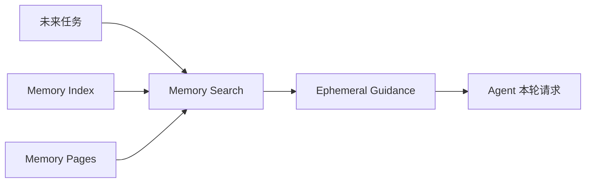
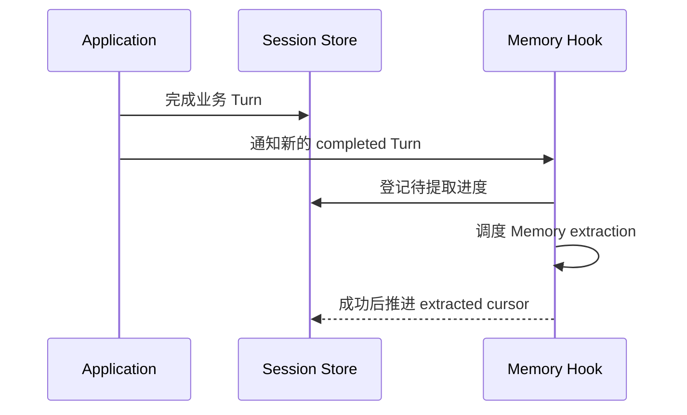
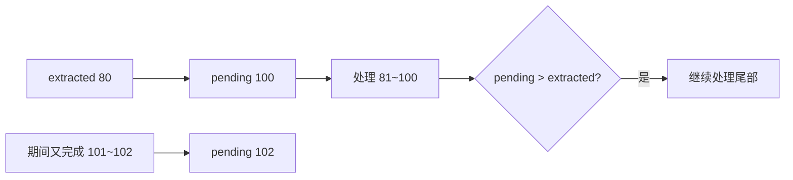
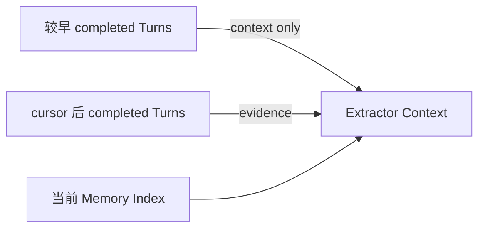
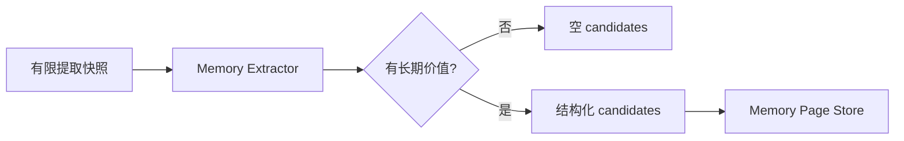
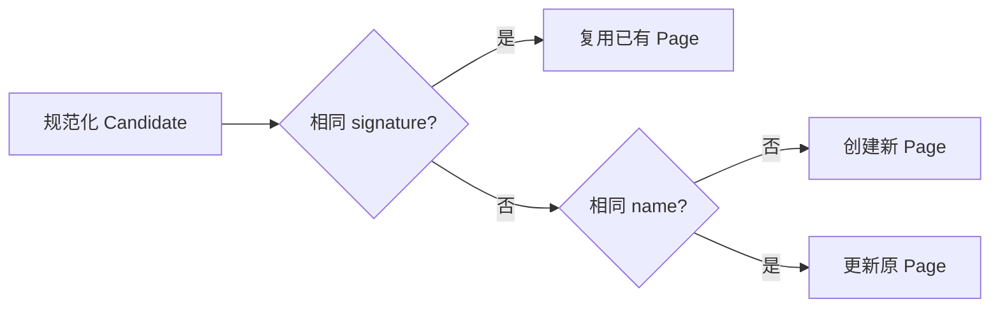
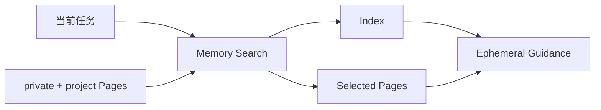

# 11 长期记忆：一次会话中的信息怎样变成以后可复用的知识

第 10 章处理的是当前 Session 内的上下文：消息太多时怎样压缩，读取状态怎样维护。本章处理跨 Session 的另一类问题：一次已经完成的交互里，哪些少量信息值得长期保存，未来任务怎样重新找到它们，以及旧记忆怎样更新、停用或删除。

长期 Memory 不应该成为“把聊天全存下来”的第二套历史，也不应该缓存当前 PR、branch、CI 这类易变化事实。它更适合保存稳定偏好、长期项目约定和难以重新发现的参考入口。

---

## 1. Memory 有三条主链

写入链负责从已完成 Turn 中提取候选：

读取链负责未来任务按需找回：

维护链负责旧知识退出或整理：TTL、Disable、Forget 和 Dream 会改变哪些 Page 还能参加后续检索。

这三条链共享 Memory Page Store，但职责不同：Extractor 负责提出候选，Store 负责安全写入和生命周期，Search 负责选择当前相关内容，Agent 只在本轮模型请求中临时使用这些结果。

---

## 2. Memory 和 Session、实时外部事实的边界

Session / Event History 保存当前会话真实发生的交互和运行事件，主要服务恢复和重放。Repository / GitHub Capability 读取当前文件、branch、Issue、PR、CI 等实时事实。Persistent Memory 位于两者之间，保存从历史交互中筛出来、跨 Session 仍可能有用的稳定知识。

| 信息类型 | 例子 | 主要来源 |
|---|---|---|
| 当前会话过程 | 用户消息、tool result、workflow outcome | Session / Event History |
| 跨 Session 稳定知识 | 用户偏好、项目长期约定、稳定参考入口 | Persistent Memory |
| 当前外部事实 | branch head、PR 状态、CI、代码内容 | Repository / GitHub Capability |

例如“这个仓库提交前长期要求跑 unit test 和 lint”可以进入 project Memory；“PR #45 当前 head 是 abc123”不适合，因为未来可以、也应该重新读取 GitHub。

这条边界决定了 Memory 的证据优先级：当前用户指令和当前 Repository / GitHub 事实高于旧 Memory。Memory 提供背景，不是执行授权或实时状态缓存。

---

## 3. Memory 为什么只在业务 Turn 完成后开始处理

应用会先正常完成业务 Turn，写入用户/assistant 输出、workflow outcome 和 working state，然后才触发 Memory after-turn hook。

这样做有两个重要结果。第一，Extractor 看到的是已经稳定落盘的业务结果，而不是一个还在变化的运行中 Turn。第二，Memory 提取失败不会反向把已经成功的业务任务改成失败；它只影响以后能不能利用这条长期知识。

因此 Memory 是业务完成后的可恢复增强流程，而不是主交易路径的一部分。

---

## 4. pending / extracted cursor 怎样保证增量提取

Session 持久层为 Memory 保存两个进度：一个表示“已经确认需要处理到哪一轮”，另一个表示“已经成功提取到哪一轮”。

假设已经成功处理到 Turn 80，但最新 completed Turn 已经到 100，那么本轮新证据范围就是 81～100。提取过程中如果又完成 Turn 101、102，只需要把 pending 继续向后推进；当前 worker 完成后看到 pending 仍领先，会继续处理尾部，而不是丢掉新 Turn。

同一个 Session 同时只跑一条 extraction 链。新的 Turn-stop 信号只更新 durable pending，不重复启动多个 worker。cursor 只有在 Context Builder、Extractor、Store 全部成功以后才推进；任何中间异常都保留旧 extracted 边界，后续可以从同一位置重新处理。

进程重启后，服务会检查 `pending > extracted` 的 Session 并重新调度，因此 Memory extraction 自己也具备可补偿性。

---

## 5. 提取上下文怎样区分“新证据”和“背景”

Extractor 不能每次把整个 Session 从头重新读一遍。Context Builder 会读取已经 completed 且不超过目标 cursor 的 Turn，再把它们分成两类：

- cursor 之后的新 Turn 标成 evidence，能够支持本轮新增 Memory；
- 更早的 Turn 只作为 context-only，用于解释代词、连续话题和项目背景，不能单独再次证明一条新 Memory。

每个 Turn 单元主要整理用户输入、最终 assistant 输出、路由结果、领域 workflow summary 和 sequence。单段文本还会先做长度限制，避免极端长结果把 extraction context 撑爆。

Builder 默认希望背景窗口保持在最近约 20 个 Turn：先保留全部新 evidence，再用剩余名额补最近旧背景。如果新 evidence 自身已经很多，不会为了硬凑 20 而删除新证据。

真正发给 Extractor 前仍会经过统一上下文预算。如果超限，优先删 context-only；所有可删背景都去掉以后仍然放不下，才让这次提取失败。

当前 Memory Index 也会一并提供给 Extractor，让模型知道已经有哪些主题摘要，减少重复候选。但 Index 本身只是背景，不能独立证明“本轮有新长期事实”。

---

## 6. Memory Extractor 为什么是隔离的短生命周期 Agent

Extractor 的工作不是继续处理业务，而是判断新证据里有没有少量值得长期保存的内容。因此它不拥有 shell、Repository、GitHub、Approval 或 Session mutation 能力，只接收 Context Builder 已经整理好的快照，然后输出结构化 Memory candidates。

一次输出数量有限，每条候选包含名称、描述、类型、作用域、重要度、TTL、标签和正文等字段。Extractor **只提出候选 Page**，没有一套任意“创建 / 修改 / 删除”命令语言。到底新建、更新还是跳过重复，由 Store 根据当前持久状态确定；Disable 和 Forget 也是 Store 的独立操作。

这样隔离的理由是，长期记忆判断本身应该只使用已经完成的证据。Extractor 如果为了“确认一下”又去读 GitHub 或修改 Session，就会把 Memory 维护重新变成一条业务执行链，也会模糊新证据边界。

---

## 7. 哪些内容允许进入长期 Memory

当前 Memory 分成四种类型：

| 类型 | 适合保存的内容 |
|---|---|
| user | 跨项目长期稳定的用户偏好 |
| feedback | 用户明确纠正过、未来仍应遵守的工作方式 |
| project | 某仓库长期有效、难以从当前代码直接恢复的约定或背景 |
| reference | 稳定外部入口、难以重新发现的调查线索 |

作用域则分成 private 和 project。private 在当前账号范围共享，主要容纳 user / feedback；project 在当前账号下按 repository 隔离，主要容纳项目约定和参考入口。

Extractor 会主动排除当前 Issue/PR/CI/branch/commit 状态、原始工具输出、可以实时重读的仓库事实、一次性任务指令、普通聊天摘要、secrets、模型猜测，以及 Agent 自己总结出的偶然“成功经验”。

如果没有明显长期价值，返回空 candidates 是正常结果。Memory 的目标不是尽量多记，而是尽量少保存高价值稳定信息。

---

## 8. Candidate 怎样变成持久 Memory Page

Extractor 输出 Candidate，Memory Page Store 负责确定性校验和持久化。真正落盘后才称为 Page。

Page 除了候选内容，还带稳定 id、source、signature、创建/更新时间、TTL、disabled、supersedes 等生命周期字段。

### 8.1 Page 是权威内容，MEMORY.md 是派生索引

每条 Page 是单独的 Markdown 文件，元数据放在 frontmatter，正文放在 body。private 和 project 使用不同目录，账户和 repository 通过哈希隔离。

`MEMORY.md` 只列当前 active Page 的名称链接和简短描述，并有行数和字节预算。它不是总知识文件；损坏后可以从 Page 重新生成。

### 8.2 Store 不直接相信模型候选

写入前会做 type/scope 枚举、name/category/tag 规范化、文本长度、secret sanitizer、TTL/importance 范围、单层 Markdown 路径、符号链接、ownership 等检查。并发写通过文件锁协调，更新使用临时文件、fsync 和 replace，尽量降低崩溃时出现半文件的风险。

Memory 会跨 Session 长期存在，因此这类文件系统保护比临时 Prompt 更重要：模型只负责判断内容价值，路径安全和写入一致性必须由确定程序控制。

---

## 9. Store 怎样判断“重复”“同一条更新”和“新 Page”

这里需要分清 signature 和 name 的职责。

当前 signature 由 scope、type、description 和 body 的规范化内容计算，更接近**内容指纹**，不是某个业务主题永远不变的语义 id。

处理顺序可以概括为：

相同 signature 主要用于避免完全相同或高度等价的内容重复写入，并在读取 Page 时做完整性核对。signature 没命中但 name 相同时，普通自动 Page 会在原 id 上更新 description、type、importance、TTL、tags、body 等内容，所以 **name 才是当前主要的“同一条知识更新入口”**。

手动来源拥有更高优先级：自动 candidate 不会覆盖同名 manual Page；如果手动保存的内容与已有自动 Page signature 相同，原 Page 可以提升为 manual，并提高重要度。

Page 模型支持 supersedes，Dream 维护时可以根据这个关系停用被替代的旧自动 Page。但当前自动 Extractor 的 candidate schema 没有 supersedes 字段，所以这套能力已经存在于 Store/Dream 层，自动提取路径还没有完整利用。

这套策略比纯 append-only 更容易控制重复，但也有一个现实边界：如果同一主题后来使用了完全不同的 name，当前实现没有语义主题 id 来保证一定合并。

---

## 10. 未来任务怎样检索 Memory

新任务准备 Agent guidance 时，Memory Search 根据当前 query、account scope 和 repository scope 读取 private + 当前 project 的有效 Page。

返回内容分成两部分：

- combined index：当前有效 Memory 的小地图；
- selected pages：和当前 query 最相关的少量完整 Page 正文。

### 10.1 先过滤 active Page

普通检索会排除 disabled 和 TTL 已过期的 Page。超过一定时间未更新的 stale Page 仍可检索，但进入模型时会带核验提示，提醒 Agent 在真正依赖它前结合当前 Repository / GitHub 事实确认。

可以把生命周期状态理解为：

| 状态 | 普通检索 | 文件是否还在 |
|---|---|---|
| active | 可以 | 在 |
| stale | 可以，但带核验提示 | 在 |
| disabled | 不参与 | 在 |
| expired | 不参与 | 在 |
| forgotten | 不参与 | 已删除 |

### 10.2 当前检索不是向量搜索

Memory Search 当前使用轻量词法评分，不依赖 embedding 或向量数据库。主要对 name、description、tags、category 计算词项匹配；非 ASCII 文本还会补充较短字符片段，帮助中文产生一定匹配。

Page body **不直接参加评分**。只有某个 Page 先通过元数据命中以后，它的 body 才会进入 selected pages。

结果先按相关度，再结合 importance、更新时间、名称和 id 做稳定排序。默认只选少量 Page，且 selected body 有独立总字节预算，避免长期 Memory 随 Page 数量增加无限膨胀模型上下文。

### 10.3 Memory 以临时 guidance 进入模型

Main 当前 system 会加入 Memory Index 和命中的 Page；child Agent 则通过 Agent Guidance 在本轮请求构造时临时注入。它们不会反复追加成永久业务聊天消息。

这样 disable、TTL、Dream 或 Page 更新可以在下一次请求立即生效，同时 Session history 不会因为同一条长期记忆每轮都复制一遍而膨胀。

---

## 11. TTL、Disable、Forget、Dream 分别表达什么生命周期

这四个机制不是同一种“删除”。

### 11.1 TTL：退出正常使用，但保留文件

Page 可以带 TTL。到期以后 active 判定为 false，新的索引和普通检索不再包含它，但当前实现不会因为 TTL 到期就自动物理删除 Page。

### 11.2 Disable：暂时停用

Disable 会保留 Page 文件，只让它退出普通 active 集合。它适合“先停用再观察”，也被 Dream 用于整理重复自动 Page。manual Page 默认受到额外保护，不会被普通自动维护轻易 disable。

### 11.3 Forget：物理删除

Forget 会定位唯一 Page，删除 Markdown 文件，fsync 目录并重建索引。当前没有额外 tombstone 记录“这条知识永远不许再出现”。

旧 Turn 已经位于 extraction cursor 之前，只会作为 context-only，所以普通重试不会立刻从老证据重新写回；但未来新的 completed Turn 如果再次提供同类新证据，Extractor 仍可能重新创建候选。这是当前实现边界。

### 11.4 Dream：确定性整理，不是自由模型总结

AutoDream 不会每个 Turn 都运行。它先看时间间隔、累计 Session 数和短期 throttle，满足条件后再调用 Store maintenance；force 可以绕过部分条件。

维护主要处理两件事：显式 supersedes，以及重复 Page。重复组可以按相同 signature，或相同 type + 规范化 description 建立；代表 Page 优先保护 manual，再参考 importance、更新时间和 id，其余符合条件的自动 Page被 disable。最后重建 private / project 索引。

当前 Dream 不是模型驱动的“自由改写所有记忆”，也不会自动物理清理所有 stale/expired Page。它更接近按 metadata 和确定性规则做后台整理。

---

## 12. Memory 在 Agent 证据层级中的位置

Memory Search 把长期知识送入当前请求以后，Agent 仍然要把它当成背景而不是当前事实。

例如某条旧 Memory 说默认分支是 `main`，当前仓库已经改成 `trunk`。真正要执行 GitHub 操作时，应以当前 Capability 读取到的 branch 状态为准。stale Page 的警告就是在提醒这种风险。

因此证据层级可以理解为：当前用户指令和当前外部事实决定这次动作；Memory 提供长期偏好、约定和参考背景。Memory 不应该成为 Approval 凭证、branch head 缓存或当前 CI 状态来源。

这也是 Extractor 不拥有 Repository / GitHub 工具的原因：长期记忆维护不应该在后台重新定义当前业务事实。

---

## 13. Memory、Session、RAG、实时工具怎样分工

| 系统 | 主要来源 | 适合解决的问题 |
|---|---|---|
| Session / Event History | 当前会话真实交互 | 当前 Session 恢复和重放 |
| Persistent Memory | 已完成交互中筛出的稳定信息 | 跨 Session 偏好和长期项目背景 |
| RAG | 较大的文档语料 | “资料里怎么说” |
| Repository / GitHub Capability | 当前外部系统 | “现在真实状态是什么” |

判断一条信息是否适合进 Memory，可以问：它是否需要跨 Session；它会不会很快变化；它能不能从权威外部系统低成本重新读取。越稳定、越长期、越难重新获得的信息，才越适合长期保存。

---

## 14. 为什么 Memory 要拆成 Extractor、Store、Search 和 Dream

前面先讲了实现，再看选型原因。

Extractor 需要模型理解语义，但不应该拥有写文件路径、删除 Page 或访问 GitHub 的自由，因此只输出受 schema 限制的 candidate。Store 掌握持久化、安全、重复更新和生命周期，所以最终写入规则放在确定程序里。Search 每次根据当前任务重新选择少量 Page，使 Memory 更新可以及时生效；Dream 则处理长期运行后仍然出现的重复和替代关系。

cursor 把“哪些 Turn 是新证据”变成持久状态，而不是让 Extractor 每次自己猜；Page 和 Index 分开，使权威内容可以独立检查，索引又可以低成本重建；Memory 以 ephemeral guidance 注入，避免长期知识反复污染 Session history。

这些选择的代价也很明确。当前检索只是轻量词法匹配，语义召回能力有限；同一主题更新较依赖 name 稳定；Forget 没有永久 tombstone；自动 Extractor 还不能直接声明 supersedes。它们属于当前实现边界，而不是设计上已经解决的问题。

---

## 15. 代码定位

| 想核对的问题 | 主要位置 |
|---|---|
| Memory Candidate / Page / SearchHit / Context 数据模型 | `gitagent/memory/models.py` |
| Completed Turn 怎样触发 Memory | `gitagent/application/bootstrap.py`、`gitagent/application/service.py` |
| pending / extracted cursor 持久化 | `gitagent/infra/persistence/sessions.py` |
| Memory 调度、合并、恢复和 Dream 触发 | `gitagent/memory/hooks.py` |
| 提取快照、evidence / context-only | `gitagent/memory/extractor.py` |
| Extractor 允许记什么 | `gitagent/prompts/system/memory_extractor.md` |
| Page 校验、写入、更新、TTL、disable、forget | `gitagent/memory/pages.py` |
| MEMORY.md 索引生成 | `gitagent/memory/index.py` |
| 词法检索、Top hits、stale warning、上下文裁剪 | `gitagent/memory/search.py` |
| Memory 怎样进入 Main / child Agent | `gitagent/agents/main.py`、`gitagent/harness/context/state.py` |
| Dream eligibility 与维护 | `gitagent/memory/dream.py`、`gitagent/memory/pages.py` |
| 应用层整体装配 | `gitagent/application/bootstrap.py` |

下一章进入 RAG：当知识来源不是少量长期 Memory，而是一整个 Markdown 文档库时，GitAgent 怎样切分、建立混合索引、重排和控制检索上下文。→ [12 RAG 知识系统](12-rag-knowledge-system.md)
