# 11 长期记忆：GitAgent 怎样把一次会话中的信息变成以后可复用的知识

第 10 章处理的是当前 Session 内的上下文治理：历史消息越来越多以后，怎样压缩、重建和控制模型输入。

这一章继续往前走一步，讨论跨 Session 的长期记忆。重点放在 GitAgent 当前实现本身：**一轮已经完成的交互怎样进入 Memory 提取流程，候选记忆怎样写成 Page，未来任务怎样检索这些 Page，以及这些内容怎样被更新、停用和整理。**

本章沿写入、读取和维护三条链路展开。先把状态和数据流走通，再在对应位置解释为什么这样设计、失败时怎样处理，以及当前实现还有哪些边界。

---

## 1. 先建立整体地图：长期记忆模块到底由哪些部分组成

先不要急着背概念。把 GitAgent 的长期记忆看成三条主链路就够了：

1. **写入链路**：完成 Turn → 登记待提取进度 → 构造提取上下文 → Memory Extractor → Memory Page。
2. **读取链路**：新任务 → Memory Search → Index + 少量相关 Page → Ephemeral Guidance → Model Request。
3. **维护链路**：TTL / Disable / Forget / Dream → 调整哪些 Page 还能继续参与未来检索。

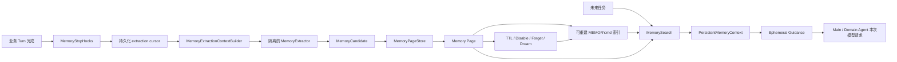

从模块职责上看，可以先记下面这张表。

| 组件 | 它负责什么 | 它不负责什么 |
|---|---|---|
| `MemoryStopHooks` | 在业务 Turn 完成后登记并调度 Memory 工作 | 不决定具体记什么 |
| `MemoryExtractionContextBuilder` | 从 Session 历史中整理有限、可控的提取输入 | 不直接写 Memory |
| `MemoryExtractor` | 判断新证据里有没有值得长期保存的信息，并产出结构化候选 | 不访问仓库、不操作 GitHub、不修改 Session |
| `MemoryPageStore` | 校验候选、决定新增或更新、持久化 Page、维护索引 | 不依赖模型判断文件安全和写入一致性 |
| `MemorySearch` | 从当前账号和仓库可见的有效 Page 中找少量相关内容 | 不做向量检索，也不扫描全文做语义召回 |
| `AutoDream` | 到达维护条件后整理重复和替代关系，并重建索引 | 当前实现没有负责物理删除所有过期 Page |
| `AgentGuidance` / `PersistentMemoryContext` | 把检索结果临时送进当前 Agent 请求 | 不把 Memory 内容追加成永久聊天消息 |

这一章后面的所有细节，都可以放回这三条链路里理解。

---

# 第一部分：长期记忆处理哪类信息

## 2. Memory 在 Session 与实时外部事实之间的位置

GitAgent 的 Session 能保存 Turn、事件、工作状态和恢复信息。它解决的是“这次任务中断以后怎样继续”和“同一次会话怎样重放”。

长期记忆处理另一类数据：**某次会话中出现了少量稳定信息，未来新的 Session 仍可能用到。**

例如用户在一个仓库里多次强调提交前的固定检查方式，这类信息未来仍有价值；一次 PR 当前的 head SHA、某次 CI 的瞬时失败、一次工具调用输出，生命周期通常短很多。

因此系统面对的是三类来源不同的信息：

| 信息 | 典型例子 | 主要保存位置 |
|---|---|---|
| 当前会话过程 | 用户消息、工具调用、workflow outcome | Session / Event History |
| 跨会话稳定知识 | 长期偏好、项目约定、稳定参考入口 | Persistent Memory |
| 可重新读取的外部事实 | 当前分支、Issue 状态、代码内容、CI 结果 | Repository / GitHub / 其他 capability |

长期记忆模块就夹在“会话历史”和“实时外部事实”之间。它保存经过筛选的长期知识，同时仍允许当前工具结果覆盖旧信息。

---

# 第二部分：长期记忆需要满足哪些要求

## 3. 从实现目标看，Memory 系统要同时解决六件事

理解目标时先不用记 cursor 和 signature 的局部设计理由。先看整个模块需要交付什么结果。

| 目标 | 具体要求 |
|---|---|
| 找到长期信息 | 从已经完成的业务交互里识别稳定、未来仍有价值的内容 |
| 控制写入范围 | 临时状态、猜测、秘密、可实时重读的事实不能随意进入长期存储 |
| 支持跨 Session 使用 | 新 Session 能按账号和仓库作用域重新找到相关 Memory |
| 控制旧知识 | 记忆可以过期、停用、删除，也可以被更新版本取代 |
| 不拖垮主业务 | Memory 提取失败时，已经完成的业务 Turn 仍保持成功状态 |
| 可恢复、可审计 | 进程重启后能继续未完成的提取；Page 是可检查的持久文件，索引可以重建 |

下面沿真实运行顺序进入写入、检索和维护流程。

---

# 第三部分：长期记忆怎样写入、检索和维护

## 4. 第一步：业务 Turn 先完成，随后才进入 Memory 流程

### 4.1 实际调用顺序

一次正常业务 Turn 结束时，应用层先把这一轮标记为 completed，写入 assistant 输出、workflow summary、route、entity manifests 和 working state。完成这一步以后，才调用 `memory_after_turn`。

`memory_after_turn` 再把当前 Session 和仓库交给 `MemoryStopHooks.handle_turn_stop`。

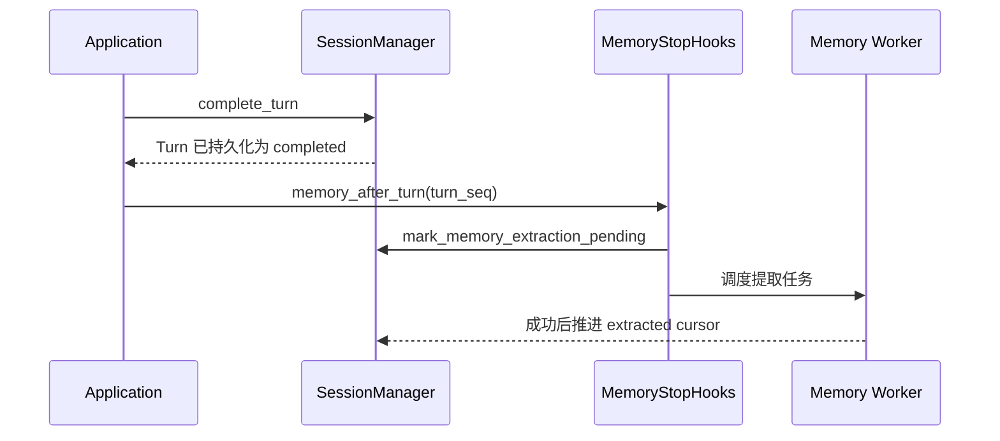

这里有一个很重要的顺序关系：**Memory 的起点是已经完成并持久化的 Turn。**

### 4.2 `pending` 和 `extracted` 两个进度值怎样工作

Session 持久层为 Memory 提取维护两个序号：

- `pending_through_seq`：目前已经确认需要处理到哪个 Turn。
- `extracted_through_seq`：已经成功完成长期记忆提取到哪个 Turn。

假设当前状态是：

| 状态 | seq |
|---|---:|
| 已经提取完成 | 80 |
| 最新需要处理 | 100 |

那么本次提取目标就是 81～100 之间的新证据。

当又有 Turn 101、102 很快完成时，`pending_through_seq` 会继续向后推进。系统不会因为已经有一个提取线程在工作，就丢掉后来完成的 Turn。当前提取结束以后，如果发现 pending 仍领先于 extracted，会再启动一次尾随提取。

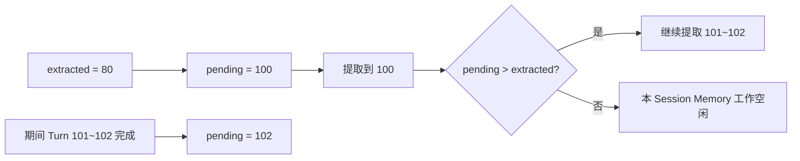

### 4.3 这样安排解决什么问题

Memory 工作依赖的是稳定业务结果。Turn 先完成以后，系统已经知道用户最终输入、主 Agent 最终输出、路由结果和 workflow outcome。提取器看到的内容更接近“这一轮最终发生了什么”。

同时，Memory 成为业务完成后的附加流程。提取失败时，Hook 只记录失败 trace，并保留尚未推进的 cursor；它不会把一个已经 durable 的业务 Turn 改成失败。

### 4.4 这一阶段的 Result

这一层形成了一个很清楚的边界：

> 业务结果先落地，长期记忆随后处理；Memory 可以失败和重试，但不能反向破坏已经成功的业务 Turn。

这也是整个 Memory 模块最重要的可靠性基础。

---

## 5. 第二步：Context Builder 把 Session 历史整理成“背景 + 新证据”

Turn 完成以后，系统还不能直接把整段 Session 扔给提取模型。真正构造输入的是 `MemoryExtractionContextBuilder`。

### 5.1 它先选出哪些 Turn 可以进入提取上下文

Builder 会读取当前 Session 中状态为 completed、并且序号不超过当前目标 `target_through_seq` 的 Turn。

随后它从 Event History 里为这些 Turn 拼出有限信息：

| 字段 | 来源 | 提取器看到它的用途 |
|---|---|---|
| `user` | Main 可见的用户消息 | 判断用户明确表达了什么 |
| `assistant` | Main 的最终回答 | 帮助理解这一轮怎样收束 |
| `route` | route selected 事件 | 知道任务被分到哪类工作流 |
| `domain_summary` | workflow outcome | 知道领域任务最后得到了什么业务结果 |
| `seq` | Turn 序号 | 确定提取进度边界 |
| `evidence` | 由 cursor 计算 | 标记这一 Turn 能否单独支持新增记忆 |

单个用户文本、assistant 文本和 domain summary 还会先做长度限制，避免极端长内容直接撑大提取上下文。

### 5.2 新证据怎样被标记

判断规则很直接：

- `seq > extracted_through_seq` 的 completed Turn 标记为 `evidence=true`。
- 更早已经处理过的 completed Turn 只作为 `context-only`。

例如 cursor 已经到 80，这次目标到 83：

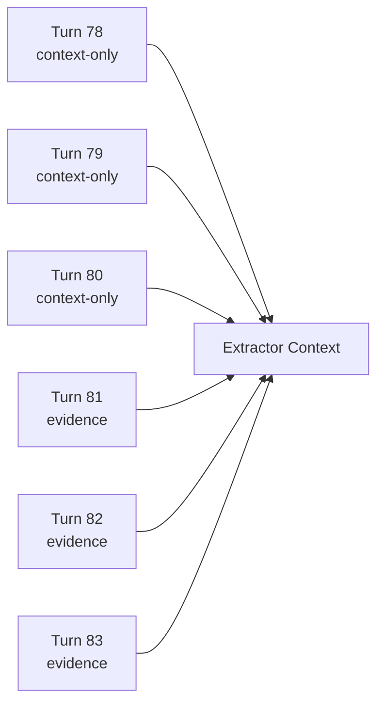

旧 Turn 仍然可以帮助解释代词、延续话题和项目背景，但它们不能独立证明“现在应该再新增一条 Memory”。

### 5.3 上下文怎样控制大小

Builder 的背景窗口默认以 20 个 Turn 为目标。它会先保留所有新 evidence，再用剩余名额补最近的 context-only Turn。如果新 evidence 自身已经超过 20 个，Builder 也不会为了凑这个数字删掉新证据。

提取器真正组装模型请求时还会经过统一的上下文压缩检查。如果超出模型窗口，会优先删除 context-only 单元。只有所有可移除背景都去掉以后仍然超限，才会让这次提取失败。

### 5.4 Memory Index 也会一起交给 Extractor

除了 Turn 单元，Builder 还会读取当前账号和仓库下的 Memory Index。提取器因此可以看到“现在已经有哪些记忆摘要”，降低重复候选的概率。

这里需要区分两种输入角色：

| 输入 | 能否单独支持新 Memory | 主要作用 |
|---|---|---|
| `evidence=true` Turn | 可以 | 提供本次新事实 |
| 旧 Turn | 不可以 | 帮助理解当前新事实 |
| 现有 Memory Index | 不可以 | 帮助发现已有主题和重复内容 |

### 5.5 这样安排解决什么问题

长期运行的 Session 里，旧信息很多。如果每次都重新让模型从第一轮开始判断，提取成本会持续增长，也很容易让同一事实反复生成候选。

把 cursor 和 evidence 标记放到持久层与 Context Builder 里以后，模型无需自己猜“哪些信息已经处理过”。运行时直接把证据边界标出来，结果更稳定，也便于重试。

### 5.6 这一阶段的 Result

Extractor 最终拿到的是一个有限、带证据边界的快照：**少量最近背景 + 所有尚未处理的新 completed Turn + 当前 Memory 索引。**

---

## 6. 第三步：隔离的提取模型负责提出候选，写入规则交给 Store

### 6.1 Extractor 在系统里的身份

`MemoryExtractor` 是一个短生命周期的元代理。它专门做长期记忆筛选，没有参与正常业务路由。

它拿不到这些能力：

- shell；
- repository 操作；
- GitHub 操作；
- 审批操作；
- Session mutation。

它主要接收上一节构造好的提取快照，然后通过结构化输出返回 Memory candidates。

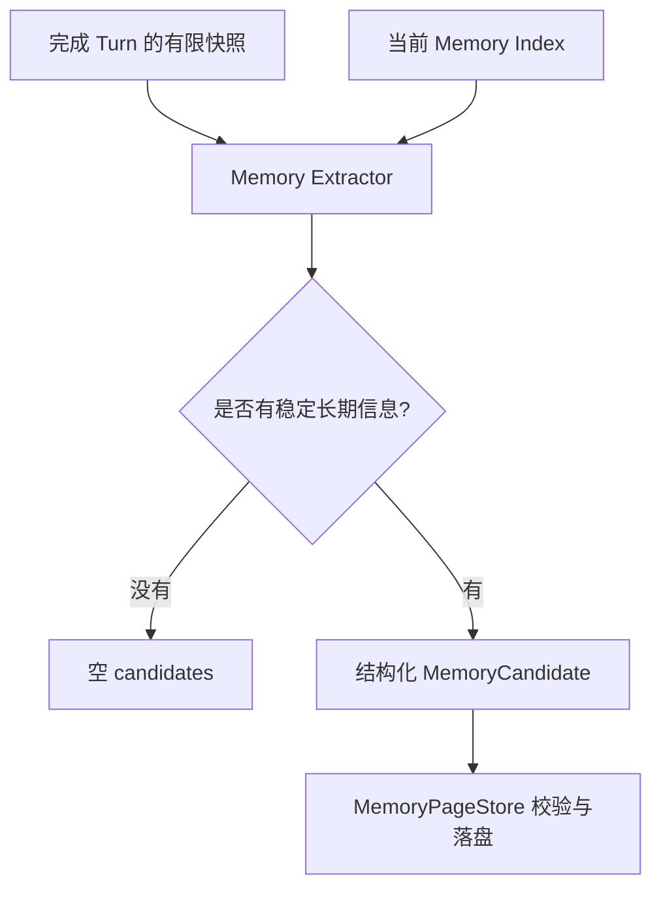

### 6.2 Extractor 能输出什么

当前实现一次最多接收 8 个候选。每个候选都要包含固定字段，例如名称、描述、类型、作用域、重要度、TTL、标签和正文。

这个设计很值得注意：**Extractor 当前输出的是候选 Page 数据，并没有输出一套任意的“新增 / 修改 / 删除”命令语言。**

真正的新增、同名更新、重复跳过，交给 `MemoryPageStore` 根据当前存储状态判断。删除和停用也有单独的 Store 操作。

### 6.3 四种 Memory Type 怎样分工

系统允许四种长期记忆类型：

| type | 适合保存什么 | 例子 |
|---|---|---|
| `user` | 跨项目仍长期稳定的用户偏好 | 用户长期喜欢先看结论再看解释 |
| `feedback` | 用户明确纠正过、以后应继续遵守的工作方式 | 用户明确要求以后某类修改必须先说明风险 |
| `project` | 某仓库长期有效、又很难直接从当前代码恢复的背景或决定 | 团队长期约定的一套提交流程 |
| `reference` | 稳定外部入口或很难再次发现的调查线索 | 某个长期维护的外部设计文档入口 |

### 6.4 两种 Scope 怎样分工

当前作用域只有两类：

| scope | 物理含义 | 典型内容 |
|---|---|---|
| `private` | 当前账号范围共享 | user / feedback |
| `project` | 当前账号下、当前 repository 单独隔离 | project / reference |

提取 Prompt 也要求：账号级用户偏好放 `private`，仓库级背景和参考入口放 `project`。

### 6.5 哪些信息会被主动排除

Extractor 的系统约束明确要求少记，并排除以下内容：

| 不应自动长期保存的内容 | 原因 |
|---|---|
| 当前 Issue / PR / CI / branch / commit 状态 | 很容易变化，应重新读取当前事实 |
| 原始工具输出 | 体积大，通常可以重新获取 |
| 仓库或 GitHub 可直接恢复的事实 | 当前工具读取更可靠 |
| 一次性任务指令 | 生命周期只覆盖当前任务 |
| 普通聊天摘要 | 长期价值太弱 |
| secrets | 不应进入长期 Page |
| 模型猜测 | 缺乏稳定证据 |
| Agent 自己总结出的“成功经验” | 容易把偶然路径固化成规则 |

如果没有明显符合条件的信息，合法输出就是空候选列表。

### 6.6 结构化输出失败怎样处理

Extractor 使用固定 schema 接收结果。如果模型返回格式错误，可以按配置做有限次数的结构化重试。重试仍然失败时，本轮提取失败，cursor 不推进。

这意味着“提取成功”包含两层含义：模型产生了合法结构，并且候选经过后续 Store 校验成功写入或被确认已存在。

### 6.7 这样安排解决什么问题

把 Extractor 做成隔离元代理后，长期记忆判断不会顺手执行远端操作，也不会因为模型在提取阶段“想再确认一下”就读取新的仓库状态。

同时，结构化候选把模型判断限制在可校验的字段里。模型负责判断长期价值，文件路径安全、字段合法性、重复处理和持久化一致性仍由普通程序控制。

### 6.8 这一阶段的 Result

Memory Extractor 的职责可以浓缩成一句话：

> 读取已经划好证据边界的快照，只提出少量长期记忆候选，随后把落盘决定交给 Store。

---

## 7. 第四步：Memory Page 怎样存储，Page 与 Index 各自扮演什么角色

### 7.1 MemoryCandidate 和 MemoryPage 的区别

提取器输出的是 `MemoryCandidate`。Store 校验并补全持久化字段以后，才得到 `MemoryPage`。

Page 比 Candidate 多出一组生命周期和存储字段：

| Page 字段 | 用途 |
|---|---|
| `id` | 一条持久 Page 的稳定标识 |
| `name` | 文件名和同名更新的重要键 |
| `type` / `scope` | 决定语义类型与可见范围 |
| `importance` | 影响索引排序和检索排序 |
| `source` | 标记 extractor、manual、migration 等来源 |
| `signature` | 内容指纹，用于重复判断和完整性校验 |
| `created_at` / `updated_at` | 创建和更新时间 |
| `ttl_days` | 可选有效期 |
| `disabled` | 是否暂停参与正常检索 |
| `supersedes` | 显式声明替代哪些旧 Page |
| `tags` / `category` | 检索时使用的元数据 |
| `body` | 真正长期保存的正文 |

### 7.2 物理目录怎样隔离 private 和 project

Memory 根目录下面，先按账号做哈希隔离，再把账号级和仓库级内容放进不同目录。

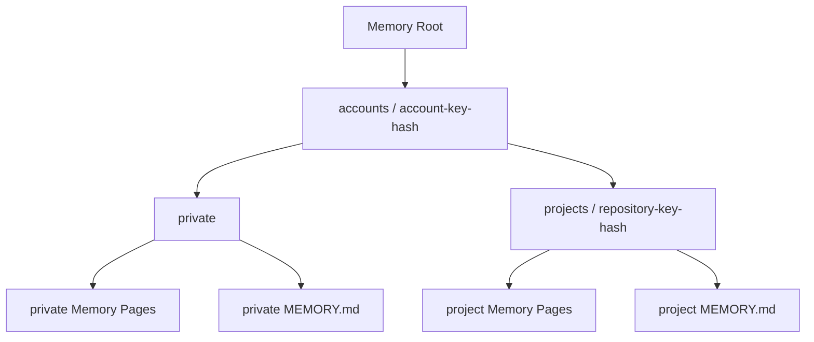

因此同一个用户在两个仓库里的 project Memory 会进入不同物理目录；private Memory 则在该账号范围内共享。

### 7.3 Page 文件是权威内容

`MemoryPageStore` 明确把 Page 文件当作 source of truth。每条 Page 都是一个 Markdown 文件，元数据放在 frontmatter，正文放在 body。

这里最重要的关系是：

> Page 决定“记忆实际是什么”；`MEMORY.md` 只提供当前有效 Page 的摘要索引。

每次需要时，索引都可以根据 Page 重建。所以索引损坏不会天然等于长期知识全部丢失。

### 7.4 Index 保存什么

每个作用域都有自己的 `MEMORY.md`。索引只列当前 active Page，并按 importance 优先，再按名称和 ID 稳定排序。

索引项保存的是名称链接和一行 description，不把每个 Page 的完整 body 全部展开。

索引本身还有行数和字节数上限，当前分别是 200 行和 25 KiB。超过预算时会截断，并加入明确的 truncation warning。

### 7.5 Store 写入前还做哪些保护

Store 不会直接相信模型返回的 candidate。落盘前还会经过一系列确定性检查：

| 检查 | 作用 |
|---|---|
| type / scope 枚举校验 | 防止模型创造未支持的类型 |
| name / category / tag 规范化 | 形成安全稳定的文件标识 |
| 文本长度限制 | 控制单条 Memory 体积 |
| sanitizer | 在应用装配时拒绝 secrets 等敏感文本 |
| ttl / importance 范围校验 | 防止非法生命周期参数 |
| 单层 Markdown 相对路径限制 | 防止 Page 路径逃逸作用域目录 |
| 拒绝符号链接 | 避免利用 symlink 访问作用域外文件 |
| 当前用户 ownership 检查 | 限制不可信文件替换 |
| 文件锁 | 避免并发写操作互相覆盖 |
| 临时文件 + fsync + replace | 尽量保证原子更新和崩溃一致性 |

Page 目录在 POSIX 环境下使用更严格的目录权限，Page 文件也会设置成仅当前用户可读写的权限。

### 7.6 这样安排解决什么问题

长期记忆会跨进程、跨 Session 存活，文件损坏或作用域串写的后果比临时模型上下文更大。把 Page 做成独立、可校验、可重建索引的持久单元后，系统可以单独检查一条记忆，也能安全更新其中一条，而不需要每次重写一个巨大的总文件。

### 7.7 这一阶段的 Result

存储层最终形成“两层结构”：

复习时要优先记住这条关系，因为后面的检索、TTL、Dream 都依赖它。

---

## 8. 第五步：候选到来以后，Store 怎样判断新增、重复和更新

这一部分是旧文档最容易讲混的地方。当前实现里需要分清 `name` 和 `signature` 的职责。

### 8.1 先看完整决策顺序

候选经过规范化以后，Store 会按下面的顺序处理：

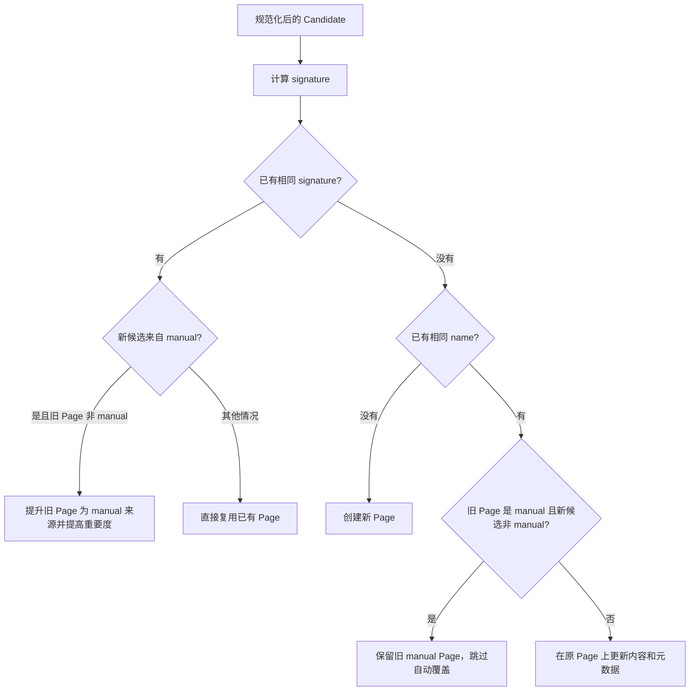

### 8.2 `signature` 实际表示什么

当前 `signature` 根据以下内容规范化后做 SHA-256：

- scope；
- type；
- description；
- body。

因此它更接近“这条 Page 内容的稳定指纹”。正文改变以后，signature 通常也会改变。

所以复习时不要把 signature 理解成“同一业务主题永远固定的语义 ID”。当前实现没有做这种语义主题 ID。

`signature` 主要承担两项工作：

1. 判断已经存在完全相同或高度等价的规范化内容，避免重复写一份。
2. 读取 Page 时重新计算并核对，发现 frontmatter 中的 signature 与正文已经不一致。

### 8.3 `name` 才承担主要的同名更新入口

当 signature 没有命中，但 Store 找到相同 name 的 Page 时，系统会进入同名更新逻辑。

对于普通自动 Page，新 candidate 可以在同一个 Page 上更新 description、type、category、importance、signature、TTL、tags 和 body，同时保留原 id 与 created time。

这让一条长期知识可以在文件层面继续沿用同一个身份。

### 8.4 manual 来源拥有怎样的保护

Store 对手动来源做了两层保护：

- 如果自动 candidate 和一条 manual Page 同名，自动写入不会覆盖这条 manual Page。
- 如果手动写入的内容与已有自动 Page signature 相同，Store 会把原 Page 的 source 提升成 `manual`，并把 importance 至少提高到较高等级。

这体现了一个很清晰的优先关系：用户明确保存的内容，比后台自动猜测“这条信息值得保存”拥有更强控制权。

### 8.5 `supersedes` 在当前实现里怎样使用

Page 模型支持 `supersedes`，Dream 维护时会读取这个关系。如果新 Page 明确声明替代某个旧自动 Page，维护过程可以把旧 Page disable。

这里也要注意当前实现边界：自动 Extractor 的结构化 candidate schema 目前没有 `supersedes` 字段。因此这套替代关系已经存在于 Page/Store/Dream 层，但自动提取路径还没有完整利用这项能力。

### 8.6 这样安排解决什么问题

如果只做 append-only，每次相似信息出现都会新增 Page，时间长了会形成大量重复内容。Store 先做精确内容指纹判断，再做同名更新，可以把常见重复挡在写入层。

manual 保护则避免后台自动提取覆盖用户主动指定的长期信息。

### 8.7 这一阶段的 Result

当前写入策略可以记成四个关键词：

> **signature 去重、name 更新、manual 保护、新 name 新建。**

这比把所有更新逻辑都交给 Extractor 更容易验证，也更容易在没有模型参与的情况下做单元测试。

---

## 9. 第六步：未来新任务怎样重新找到 Memory

长期记忆写进去以后，真正有价值的时刻发生在未来 Session。

### 9.1 新任务先生成 Memory Context

应用层在为 Agent 准备 guidance 时，会根据当前任务 query、account key 和 repository key 调用 `MemorySearch.context`。

返回结果包含两部分：

| 内容 | 作用 |
|---|---|
| `index` | private + 当前 project 的有效 Memory 摘要 |
| `selected_pages` | 根据当前 query 选出的少量相关 Page 正文 |

这两部分最后组成 `PersistentMemoryContext`，再进入 `AgentGuidance` 或 Main Agent 的当前 system 内容。

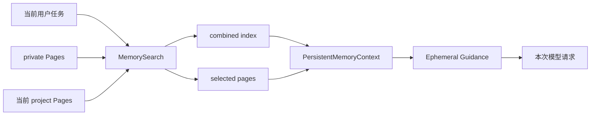

### 9.2 检索前先过滤 active Page

Search 调用 Store 列出 Page 时，会排除 inactive 内容。

当前 active 的定义很直接：

- `disabled=false`；
- 当前时间还没有超过 TTL。

因此 disabled 和 expired Page 不参与正常搜索。

### 9.3 当前检索是轻量词法检索

这一点也很重要。当前 `MemorySearch` 没有使用 embedding 或向量数据库。

它从 query 中提取词项，对 Page 的以下元数据计算匹配分数：

| 字段 | 相对权重 |
|---|---:|
| name | 高 |
| description | 较高 |
| tags | 中等 |
| category | 较低 |

对于非 ASCII 文本，还会补充较短的字符片段，帮助中文等文本产生一定的词项重合。

Page body 当前没有直接参加 `_score` 的检索评分。body 是命中 Page 以后才被带入模型上下文。

### 9.4 排序与数量怎样控制

Page 有正相关分数以后，先按相关分数排序，再用 importance、更新时间、名称和 ID 做稳定的次级排序。

一次最多选少量命中 Page。当前默认上限是 5 条。

此外，选中的 Page body 还有独立的上下文字节预算，当前默认是 20 KiB。超过总预算以后，后面的 body 会被截断或不再加入。

所以长期 Memory 不会因为 Page 数量增加就无限扩张当前模型请求。

### 9.5 stale 与 expired 要分开理解

Page 超过 30 天没有更新时会被标成 stale。stale Page 仍然可以参与检索，但渲染进模型时会附加警告，提醒 Agent 使用前结合当前 repository / GitHub 证据再确认。

expired 则由 TTL 决定。expired Page 会退出正常 active 集合，因此不会继续进入普通索引和检索。

可以这样记：

| 状态 | 还能正常检索吗 | Page 文件还在吗 |
|---|---|---|
| active | 可以 | 在 |
| stale | 可以，但带核验警告 | 在 |
| disabled | 不参与正常检索 | 在 |
| expired | 不参与正常检索 | 当前仍在磁盘上 |
| forgotten | 已删除 | 不在 |

### 9.6 Memory 怎样进入 Main Agent

Main Agent 在构造当前 system 内容时，会加入当前 Memory Index；如果搜索命中了 Page，还会加入这些 Page 的渲染正文。

因此 Main 在当前请求里可以同时看到“有哪些长期记忆摘要”和“和当前任务最相关的少量正文”。

### 9.7 Memory 怎样进入 Domain Agent

Main 创建子 Agent 时，会把当前 `AgentGuidance` 传给 child context。

在 Domain Agent 真正发起模型请求前，`AgentContext` 会把 guidance 作为 ephemeral policy 拼接到本次模型可见消息中。这个拼接发生在请求构造阶段，并不会把 guidance 追加成一条永久业务消息。

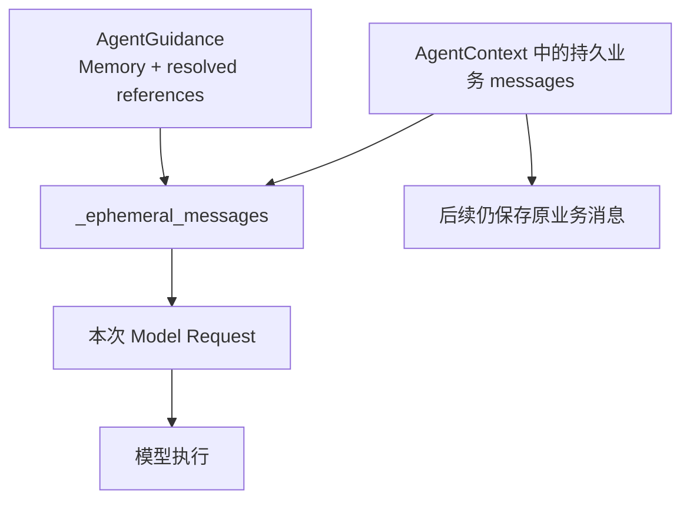

### 9.8 这样安排解决什么问题

长期 Memory 会持续变化。每次模型请求前按当前账号、仓库、任务重新检索，可以让新 Session 使用最新有效 Page，也能让 disable、TTL 和 Dream 的结果立即反映到后续请求。

同时，Memory 以临时 guidance 进入请求后，Session 的业务消息历史不会被大量重复 Memory 污染。

### 9.9 这一阶段的 Result

读取链路最终形成一个非常实用的模式：

> **Index 提供全局小地图，Search 选少量相关 Page，Guidance 只在当前请求临时注入。**

---

## 10. 第七步：TTL、Disable、Forget 和 Dream 怎样维护长期状态

长期记忆写进去以后还会变化。当前实现用四种机制处理这种变化。

### 10.1 TTL：让时间敏感 Page 自动退出 active 集合

Page 可以带 `ttl_days`。判断是否过期时，系统用 `updated_at + ttl_days` 与当前时间比较。

达到过期时间以后，这条 Page 的 `active()` 会返回 false。

索引读取前会重新构建当前作用域的索引，因此 TTL 到期以后，该 Page 会自然从新的 active index 中消失。

这里需要准确理解当前实现：**TTL 主要改变检索资格。过期 Page 当前不会因为 TTL 到期就自动物理删除。**

这样做的直接结果是，过期内容不会继续影响正常模型请求，同时文件仍可用于后续检查、迁移或人工处理。

---

### 10.2 Disable：保留文件，但暂停正常使用

`disable` 会把 Page 的 `disabled` 改成 true，并更新 `updated_at`，随后重建索引。

Page 文件仍然存在，普通 `read_page`、list/search 在不包含 inactive 的情况下不会再返回它。

Disable 很适合“先停用，再观察”的状态，也适合 Dream 对重复自动 Page 做整理。

对 manual Page，Store 默认还会阻止普通自动维护直接 disable，除非调用方明确允许。

---

### 10.3 Forget：直接删除目标 Page

`forget` 会在 private / project 范围内定位目标 Page。如果同一 identifier 在两个 scope 都可能匹配，调用方需要明确 scope，避免误删。

找到唯一 Page 后，Store 会删除对应 Markdown 文件，刷新目录持久状态，并重建索引。

当前实现没有单独维护“曾经被用户遗忘过”的 tombstone 列表。

旧 Turn 已经位于 extraction cursor 之前时，它们只会作为 context-only，不会单独再次证明同一 Memory 应被新增。因此删除后不会因为一次普通重试就立刻从老 Turn 中重新写回。

如果未来新的 completed Turn 再次出现同类新证据，Extractor 仍可能重新创建候选。复习时应把这一点视为当前实现边界。

---

### 10.4 Dream：按条件触发的确定性整理

`AutoDream` 不会每个 Turn 都运行。它先做 eligibility 判断。

当前默认条件包括：

- 距离上一次 Dream 至少达到一定时间，默认 24 小时；
- 自上一次 Dream 后积累到一定数量的 Session，默认 5 个；
- eligibility gate 自身还有短时间节流，默认 10 分钟内不重复做昂贵检查；
- force 模式可以绕过前两项条件直接允许维护。

满足条件以后，Dream 调用 `MemoryPageStore.maintain`。

#### 10.4.1 maintain 当前具体做什么

第一类工作是处理显式 `supersedes`：

如果某个 active Page 声明替代旧 Page，旧 Page 存在、来源为自动、并且还没有被 disable，维护过程会把旧 Page 停用。

第二类工作是整理重复 Page。Store 会按两种方式构造重复组：

- 相同 signature；
- 相同 type 下拥有相同规范化 description。

每个重复组会挑一个代表 Page 保留。选择时优先保护 manual 来源，再参考 importance、更新时间和 ID。

其余符合条件的自动 Page 会被 disable。

最后，private 和 project 两边的索引都会重建。

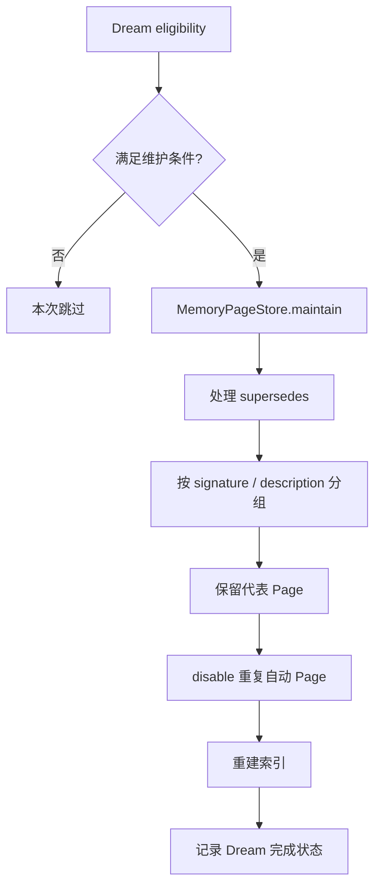

#### 10.4.2 Dream 当前没有做什么

当前 `maintain` 没有实现一套模型驱动的“自由总结器”，也没有把所有 stale/expired Page 做物理垃圾回收。

它的核心工作是确定性整理：遵守 Page metadata、manual 保护、supersedes 和重复规则，然后重建索引。

### 10.5 这样安排解决什么问题

长期运行以后，即使写入层已经做过重复判断，也可能因为名称变化、迁移或人工操作出现重复 Page。Dream 提供第二层整理机会。

TTL、Disable、Forget 又分别表达了三种不同生命周期语义：时间到期、暂时停用、明确删除。把这三种状态分开以后，系统不需要把所有“当前不想用”都处理成物理删除。

### 10.6 这一阶段的 Result

生命周期可以记成下面这张图：

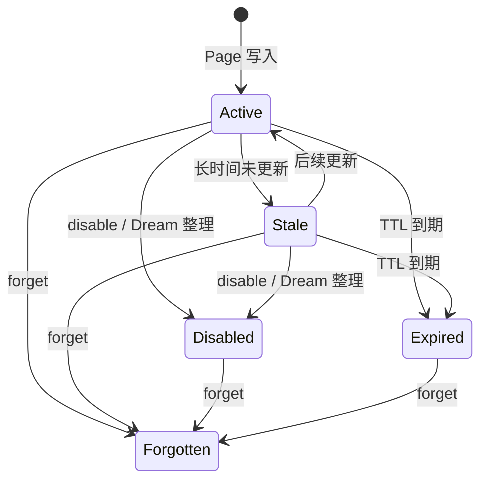

其中 Stale 仍可检索；Expired 和 Disabled 会退出普通检索；Forgotten 对应 Page 文件已删除。

---

## 11. 第八步：并发、失败和进程重建以后怎样继续

长期记忆发生在业务完成以后，所以它还要处理一个现实问题：程序可能在提取中间退出，或者同一 Session 很快连续完成多轮。

### 11.1 同一 Session 同时只安排一条 extraction 链

`MemoryStopHooks` 内部维护正在提取的 session id 集合。

如果某个 Session 已经在 extraction 中，新完成的 Turn 只需要把 durable `pending_through_seq` 推到更后面，不必再同时启动第二个重复 worker。

当前 worker 完成后会检查 pending 是否仍领先。如果领先，就直接再启动尾随 extraction。

这相当于把短时间内多次 Turn-stop 信号合并成一条顺序追赶的提取链。

### 11.2 extraction cursor 只有成功以后才推进

真正的执行顺序是：

1. 读取 durable extraction state；
2. 取当前 pending 作为 target；
3. 构造 context；
4. 调用 Extractor；
5. Store 处理 candidates；
6. 全部成功以后调用 `complete_memory_extraction` 推进 cursor。

任何中间异常都会让本次执行记录为失败，同时 extracted cursor 保持原值。

所以后续可以从同一个边界重新处理。

### 11.3 Service 重建以后会恢复 pending extraction

应用层重新创建服务时，会调用 `resume_pending`。

如果持久化状态显示 `pending_through_seq > extracted_through_seq`，系统会重新调度 extraction。

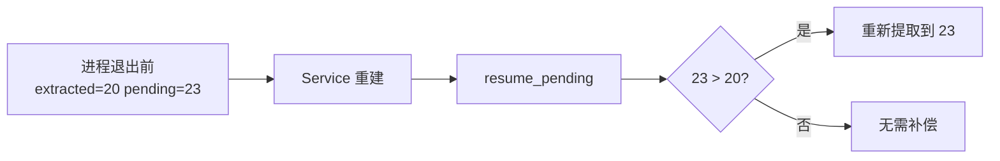

### 11.4 Dream 也限制重复并发

Hook 内部同时只允许一个 Dream 处于运行状态。Dream eligibility 还带短时间 gate throttle，减少频繁检查。

### 11.5 失败隔离带来的效果

业务 Turn 在触发 Memory 前已经完成。Hook 内部对登记、提取、Dream 异常做 best-effort 处理，并记录 Trace。

这让长期记忆成为一种可恢复的增强功能。它失败时会影响“以后能不能利用这条长期信息”，不会让用户刚刚已经完成的仓库分析或 PR 工作流突然变成失败。

### 11.6 这一阶段的 Result

Memory 的可靠性模型可以概括为：

> **业务结果和 Memory 结果分开提交；Memory 用 durable cursor 做补偿，用单 Session 合并调度控制重复工作。**

---

## 12. 第九步：Memory 在证据层级中的位置

前面已经讲清读取链路：Memory Index 和 selected Pages 最终进入当前模型请求。

这时还需要确定它在证据层级中的位置。

Extractor 的系统约束明确要求，当前指令和当前 repository / GitHub 证据优先级更高。Search 对超过 30 天未更新的 stale Page 也会直接加核验警告。

例如某条 Memory 记录“默认分支是 main”，未来仓库已经改成 trunk。当前任务真正要执行 Git 操作时，Agent 仍应读取当前仓库或 GitHub 事实，再决定具体参数。

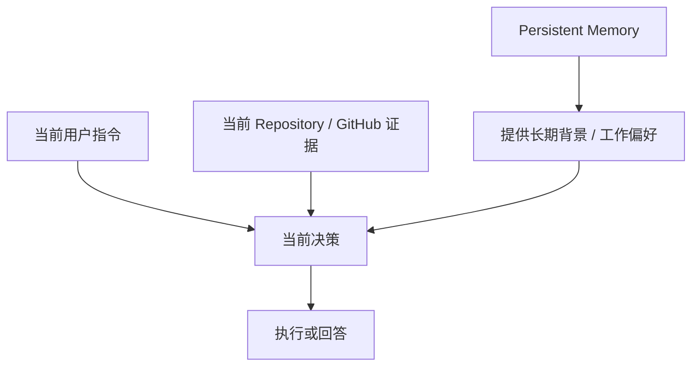

长期 Memory 很适合告诉 Agent“过去长期约定过什么”，不适合充当远端状态缓存和授权凭证。

从这个边界还能看出 Extractor 权限隔离的意义：长期记忆维护不会顺便获得 GitHub、仓库和审批等业务执行能力。

---

# 第四部分：用完整场景检查设计边界

## 13. 用一个完整例子把写入和读取链路串起来

假设用户在仓库 A 的一次 completed Turn 中明确说：

> 这个仓库以后提交前都要先跑单元测试和 lint。

### 第一步：Turn 先完成

应用层先把这一轮业务结果写成 completed Turn。随后 `memory_after_turn` 触发 Memory Hook。

### 第二步：登记 pending cursor

假设上次已经提取到 seq=12，这次 Turn 是 seq=13。SessionManager 会把 `pending_through_seq` 推进到 13。

### 第三步：Builder 构造提取快照

Turn 13 被标记为 `evidence=true`。前面少量 Turn 可以作为 context-only 帮助理解“这个仓库”“提交前”这些语境。

当前 project/private Memory Index 也会一起放进快照。

### 第四步：Extractor 判断长期价值

Extractor 看到这是一条仓库级、未来重复任务还会使用的稳定工作约定，可以生成 `project` scope 的候选。

它不会把“这次 lint 输出 3 个 warning”一起保存，因为那属于当前执行结果。

### 第五步：Store 写 Page

Store 校验候选字段、清理文本、计算 signature。

如果没有同 signature、也没有同 name Page，就创建新 Page；如果以后 Extractor 继续使用同一个 name 产出更新内容，Store 会更新原 Page。

### 第六步：未来新 Session 检索

几天后用户重新打开仓库 A，让 GitAgent 做代码修改。

MemorySearch 会读取该账号的 private Memory 和仓库 A 的 project Memory。当前任务 query 和 Page 的 name / description / tags / category 产生相关匹配后，这条 Page 进入 selected pages。

### 第七步：作为 guidance 进入 Agent

Main 和后续 child Agent 能在本次请求里看到这条长期约定。

真正执行测试时，Coding / Repository 工作流仍需要根据当前仓库内容判断可用测试命令。Memory 只提供“提交前要做哪些检查”的长期意图。

### 第八步：约定后来变化

如果用户后续明确改成“现在统一执行一个新的检查脚本”，新的 completed Turn 会成为新 evidence。

如果候选保持同一个 name，Store 会更新原 Page；如果候选使用了另一个 name，当前实现可能暂时出现两条相关 Page，后续 Dream 只有在 description/signature 重复规则能够识别时才会进一步整理。

这一点说明当前实现仍依赖候选命名稳定性，语义级冲突合并还有继续增强的空间。

---

## 14. 当前实现最值得注意的几个边界

为了复习时不把“理想设计”和“当前代码”混在一起，下面这些点要单独记住。

| 容易想当然的理解 | 当前实现实际情况 |
|---|---|
| signature 可以识别“同一主题的新版本” | signature 根据 scope/type/description/body 计算，更接近内容指纹；同名更新主要靠 name |
| Extractor 可以直接发新增、更新、删除操作 | Extractor 当前只产出 candidates；新增/更新/重复跳过由 Store 决定，删除/停用走独立 Store 方法 |
| Memory Search 是向量语义搜索 | 当前是基于 name、description、tags、category 的轻量词法评分 |
| Search 会直接搜索 Page body | 当前评分不读 body；命中 Page 后才把 body 加入 selected pages |
| TTL 到期会自动删除文件 | TTL 让 Page 退出 active 检索，Page 文件当前仍保留 |
| Dream 会清理所有过期文件 | 当前 Dream 主要处理 supersedes、重复自动 Page 和索引重建 |
| Forget 有永久防再生标记 | 当前会删除 Page 文件，没有独立 tombstone；旧 Turn 因 cursor 只做背景，但未来新证据仍可能再次形成候选 |
| 自动 Extractor 已经完整使用 supersedes | Page/Store/Dream 支持 supersedes，当前 extractor candidate schema 没有该字段 |

这张表很适合代码评审或面试前快速过一遍。

---

## 15. Memory、Session、RAG 和实时工具怎样分工

这几个系统都可能给 Agent 提供“当前用户消息之外的信息”，但生命周期和权威性不同。

| 系统 | 主要来源 | 典型单位 | 适合解决什么问题 | 更新方式 |
|---|---|---|---|---|
| Session / Event History | 当前会话中的真实交互和事件 | Turn / Event / Message | 恢复当前会话、重放执行历史 | 每轮业务持续写入 |
| Persistent Memory | 已完成交互中筛出的稳定长期信息 | Memory Page | 跨 Session 复用偏好和项目背景 | 提取、同名更新、TTL、disable、forget、Dream |
| RAG | 文档语料 | document / chunk | 从较大知识库中找相关材料 | 文档同步、切分、索引更新 |
| Repository / GitHub capability | 当前外部系统 | 当前文件、Issue、PR、CI、branch 等 | 获取实时业务事实 | 每次任务按需重新读取 |

判断一条信息该放哪里时，可以问三个问题：

1. 它需要跨 Session 吗？
2. 它会不会很快变化？
3. 它能不能从权威外部系统低成本重新读取？

长期稳定、跨 Session 有价值、又不适合每次重新推导的信息，才更适合进入 Memory。

---

## 16. 最后再看一次完整数据流

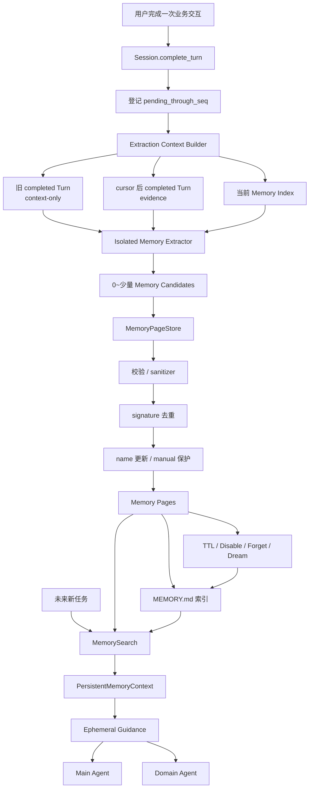

复习时最核心的一条主线就是：

> **完成 Turn 提供稳定新证据，cursor 保证增量处理；Extractor 只负责选候选，Store 负责把候选变成安全持久 Page；未来 Search 按当前账号、仓库和任务找少量相关 Page，再临时送进模型；生命周期机制负责让旧知识逐步退出正常使用。**

---

## 17. 源码定位：复习时应该看哪些文件

| 想核对的问题 | 主要文件 | 重点 |
|---|---|---|
| Memory 数据模型 | `gitagent/memory/models.py` | Candidate、Page、SearchHit、PersistentMemoryContext |
| completed Turn 怎样触发 Memory | `gitagent/application/bootstrap.py`、`gitagent/application/service.py` | `complete_turn` 之后调用 `memory_after_turn` |
| pending/extracted cursor 怎样持久化 | `gitagent/infra/persistence/sessions.py` | extraction state 的登记和推进 |
| Memory 工作怎样调度与恢复 | `gitagent/memory/hooks.py` | coalescing、resume、失败处理、Dream 调度 |
| 提取快照怎样构造 | `gitagent/memory/extractor.py` | completed Turn、evidence 标记、context-only、上下文限制 |
| Extractor 能记什么 | `gitagent/prompts/system/memory_extractor.md` | durable type、scope、禁止保存项、证据规则 |
| Page 怎样校验、写入和更新 | `gitagent/memory/pages.py` | signature、name、manual 保护、TTL、disable、forget、atomic write |
| `MEMORY.md` 怎样生成 | `gitagent/memory/index.py` | active Page、排序、索引预算 |
| Future Session 怎样检索 | `gitagent/memory/search.py` | 词法评分、Top hits、stale warning、上下文裁剪 |
| Memory 怎样进入 Agent | `gitagent/agents/main.py`、`gitagent/harness/context/state.py` | Main system 注入、Domain ephemeral guidance |
| Dream 怎样维护 | `gitagent/memory/dream.py`、`gitagent/memory/pages.py` | eligibility、supersedes、duplicate groups、index rebuild |
| 应用层怎样装配整个模块 | `gitagent/application/bootstrap.py` | Store、Search、Extractor、Context Builder、Dream、Hooks 的依赖关系 |

---

