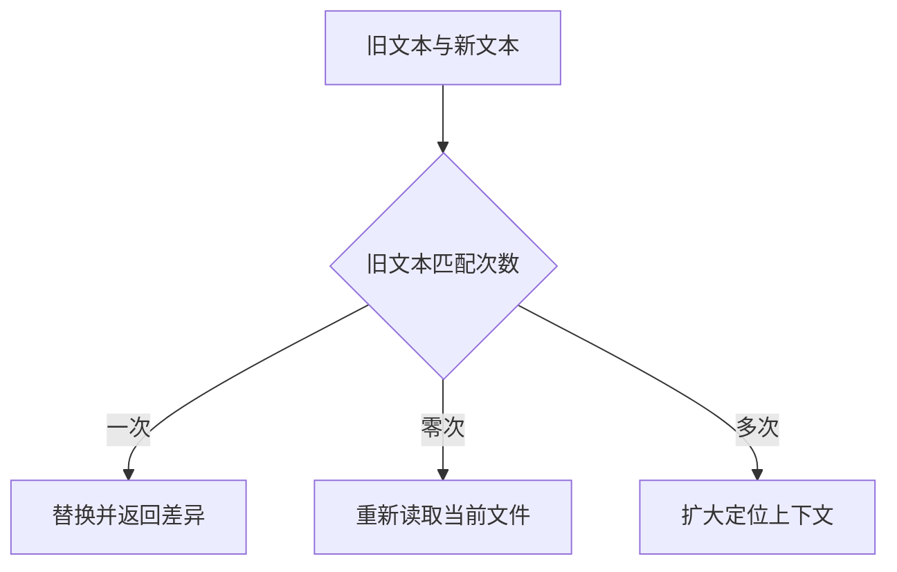
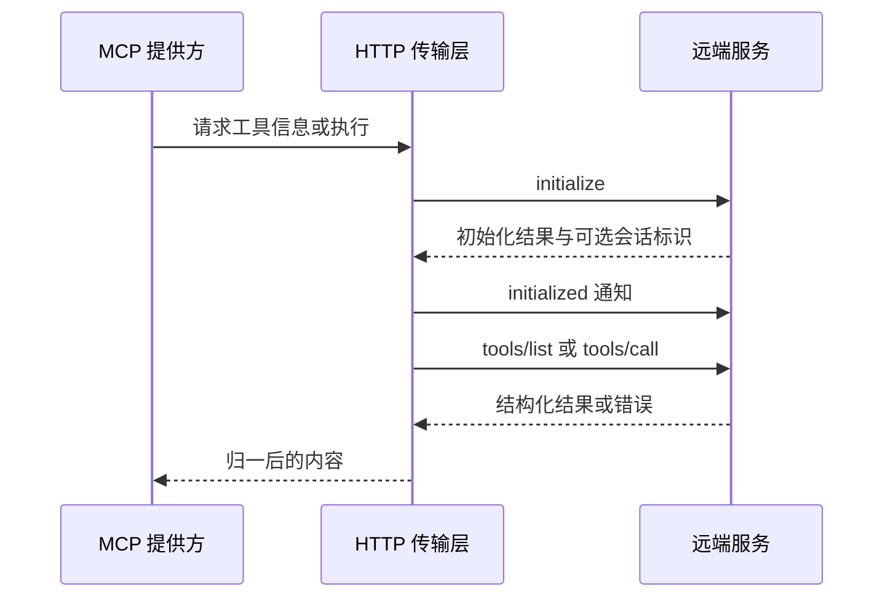

# 11 内置工具、MCP 与 Skills：让代理拿到可用证据，而不只是拿到函数

## 本章先回答什么

第 02 章把不同来源的动作统一成能力。但统一接口不能替代工具本身的设计。一个搜索函数即使能够调用，也可能返回过量文本、遗漏范围说明，或者让代理把“没找到”误解成“根本不存在”。

假设用户要求修复合并请求中的一个缺陷。代理需要先定位代码，再阅读、修改和验证；遇到不熟悉的库时可能查询外部资料，需要系统化排查时可能加载 Skill。每一步都在改变下一次模型决策的依据。

本章沿这条路径解释：**工具如何提供有范围、有版本、有失败语义的证据；MCP 和 Skills 又分别在哪一层扩展代理能力。**

### 本章的 STAR 主线

| 阶段 | 本章要解决的问题 |
|---|---|
| 情境 S | 通用函数和自由命令难以表达证据范围、修改前提与外部连接差异 |
| 任务 T | 让每项工具有清楚的使用目的、输入边界、结果含义和失败后的下一步 |
| 行动 A | 定位 → 有界阅读 → 精确编辑 → 命令验证 → 外部工具连接 → 按需加载指导 → 进入发布适配 |
| 结果 R | 代理能根据可靠观察推进任务，同时不把文本搜索、MCP 接入或命令策略夸大成更强能力 |

---

## 1. 情境：给模型一个终端，为什么还要设计专用工具

从功能上看，一个终端可以搜索、读文件、编辑和运行测试。但这些动作的输入输出完全不同，如果都由模型自由拼命令，运行时很难知道“这次只读取了哪些行”“文件是否真的变化”“失败之后能否重试”。

GitAgent 因此给常见动作提供专用入口。文件读取表达路径和行范围，编辑表达待替换的旧文本，搜索表达查询和范围。执行框架由此获得可检查的语义，而不是只拿到一段命令字符串。

命令入口仍然保留，因为真实测试和构建需要调用项目工具。专用工具和命令的分工，是把能够明确描述的操作结构化，把必须交给项目环境完成的工作保留为受策略约束的执行。

---

## 2. 任务：一次工具结果应当让下一步少猜什么

代理读到一段代码后，至少要知道它来自哪个文件、哪个版本、哪一部分，以及是否还有内容没有返回。

如果结果只有正文，模型可能把文件中间的一段误认为整个文件；如果没有版本，默认分支与 PR 头提交的内容可能被混用；如果没有截断标记，空结果或少量结果会被错误解释成完整调查结论。

因此结果契约不仅携带数据，也携带数据的适用范围。第 05 章的读取覆盖和 EOF 判断，就是建立在这些元数据上的运行时能力。

---

## 3. 为什么先定位，再读取正文

修复缺陷时，代理未必知道文件位置。目录工具适合回答“有哪些路径”，搜索工具适合回答“某个词出现在哪里”，读取工具则回答“这些位置附近的实际代码是什么”。

如果一开始就读取整个仓库，模型会先支付大量上下文成本，之后才知道哪些信息相关。先用路径和有界片段定位，可以把后续阅读集中到少数候选文件。

GitAgent 的工具描述明确区分目录发现、内容搜索、已知路径读取和多文件读取。这个区分同时影响工具选择：模型应根据当前缺少哪种证据选入口，而不是看到“读仓库”就机械使用同一工具。

---

## 4. 搜索为什么需要绑定一次明确的仓库版本

仓库分支会移动。一次搜索先发现路径，随后又读取文件，如果两步来自不同提交，返回的行位置就可能已经失效。

当前远端代码搜索会先取得默认分支头提交，并围绕该提交组织后续正文读取与搜索缓存。缓存键也包含提交编号，避免新版本继续复用旧版本查询结果。

这项设计建立的是默认分支搜索的版本边界，不代表所有搜索接口都可以任意指定 PR 版本。处理 PR 时仍需结合差异、变更文件和显式引用读取来拿到正确证据。

因此，“知道仓库名称”不够，还要知道本次观察对应哪个状态。

---

## 5. 搜索服务不可用时，为什么可以降级却不能假装完整

远端代码搜索可能失败，也可能声明结果不完整。GitAgent 在部分这类情况下会转向默认分支扫描，尝试从仓库内容中寻找字面匹配。

降级可以提供继续工作的机会，但扫描也受范围和数量限制。因此返回结果要说明后端来源、检查过的文件、读取错误以及完整性信息。

这决定了模型能得出什么结论。“在本次已检查范围内没有匹配”是有证据的；“整个仓库没有这个逻辑”则需要更充分的覆盖。工具若不暴露范围，代理就难以区分二者。

搜索契约的价值不仅在成功命中时，也在避免把局部失败包装成全局否定。

---

## 6. 符号查找为什么不等于完整代码语义分析

当前符号查找先搜索名称，再用定义形式的正则识别可能的声明。引用查找则复用文本搜索。

这种实现简单、容易跨多种语言提供基础定位，但不具备完整作用域、类型解析和调用图推导。同名局部变量、动态调用、重载或别名，都可能让文本匹配与真实语义产生差距。

所以这些工具返回的是阅读入口，而不是语言服务器或编译器已经证明的语义关系。代码代理仍需要阅读邻近定义和使用方式，才能形成结论。

把这一边界说清楚，比只列出“支持符号与引用检索”更能说明设计取舍。

---

## 7. 文件读取的行号和截断标记怎样参与下一步决策

找到目标以后，读取工具只返回一个有界范围，并提供行号、正文和截断信息。对本地文件，还可以得到总行数等字段。

结果不是为了还原一个编辑器界面，而是为了让下一步有依据。如果仍被截断，可以继续读后半段；如果确认到了文件末尾，后续重复请求就没有必要。

执行框架会校验提供方返回的路径与范围，再更新读取状态。某个工具声称读了 A 文件，却返回 B 文件的数据，不能让 A 被标记成已经阅读。

这也解释了工具契约和缓存为什么必须一起理解：缓存是否可靠，首先取决于原始观察是否可靠。

---

## 8. 为什么精确编辑要求旧文本只出现一次

代理决定修改某个条件分支后，可以提供旧文本和新文本。当前编辑工具要求旧文本在文件中恰好出现一次。

如果出现零次，可能是模型记错了内容，也可能是文件已经变化；如果出现多次，工具无法判断要改哪一处。两种情况都返回冲突，要求代理补充上下文或重新阅读。

这里没有让工具猜模型意图。唯一匹配把“改哪一处”变成一个可检查前提，代价是模型需要提供足够准确的旧文本。

整文件写入则是另一种契约：它允许创建或覆盖一个文本文件。它与局部编辑不能混为一谈，二者都要通过活动工作区的路径检查。

---

## 9. 为什么成功写入还要返回是否真正变化

把一个文件写成它原来的内容，操作可以成功，但候选状态没有变化。如果仅凭“工具成功”推进工作树版本，就会让旧验证被不必要地作废。

本地写和编辑因此返回实际变化标记。执行框架在有序提交时结合这些信息维护工作树 revision 和读取状态。

工具负责观察具体文件动作；上下文负责决定这项观察何时成为运行时状态。这个分工接回第 04 章的“执行与提交分离”，避免文件线程一完成就提前改变逻辑顺序。

---

## 10. 命令工具的价值为什么在于真实验证

代码改完以后，模型解释修改合理，并不能证明测试通过。命令工具让项目自己的测试、静态检查或构建真正执行，再把退出状态和有限输出交回代理。

当前入口先经过命令策略分类，再将文本解析成参数数组，以活动工作树为工作目录执行。它不是把整段字符串直接交给任意 Shell 解释；策略也会检查连接、管道和重定向等组合形式。

命令结果保留标准输出和错误输出的尾部，避免模型上下文被完整日志占满。不过底层当前先捕获输出再截取尾部，因此返回正文有界，不等于执行过程的输出内存天然有界。

这一细节说明，面向模型的结果预算与进程资源限制是两个问题。

---

## 11. 工作树、命令策略和沙箱各约束什么

独立 worktree 让候选文件与其他任务分开；文件工具的路径校验限制它能修改的目标；命令策略决定哪些命令形式可以启动。

但被允许的测试程序仍在宿主机运行。一个 `npm test` 背后的脚本可以包含比名字更复杂的行为，一个测试用例也可能打开其他目录或连接网络。当前实现没有因为设置了工作目录，就获得操作系统级文件和网络隔离。

所以应把安全结论限定为入口约束和正式业务发布链约束。不能将“代码代理没有 GitHub 写工具”进一步推导成“任意项目代码都不可能产生远端副作用”。

第 08 章的审批解决发布授权，本节的命令入口解决验证调用，两者都不能代替执行环境本身的隔离。

---

## 12. 外部资料为什么需要 MCP，而不是让代理认识每种连接

修复涉及一个不熟悉的库时，代理可能需要查询参考资料。模型只应提出工具名和参数，不需要处理 HTTP 会话、服务初始化或错误响应。

GitAgent 把这些连接细节放在 MCP 适配与传输层，能力层则继续负责权限和统一结果。这里有两种实际来源：GitHub 使用本地适配器直接调用客户端方法；Context7 等远端工具使用 HTTP transport。

二者可以进入同一能力提供方，但不能因此说 GitHub 每次操作都经过远端 MCP 协议。能力包装形式与真实网络传输是不同层次。

---

## 13. 一次远端 MCP 调用怎样建立起来

远端连接先初始化并完成通知，随后才列工具或调用工具。服务返回的会话标识会用于后续请求；没有会话标识时，当前传输层按无状态方式处理。

当前结果处理优先使用结构化内容；单条文本若能解析为 JSON，则转成对象，否则保留文本。HTTP 状态、超时和断连信息继续交给提供方错误归一，最后由能力层决定读取是否能够有限恢复。

这是最小的 Streamable HTTP 接入。不能把它描述为覆盖 MCP 全部传输和高级协议特性的完整客户端。

---

## 14. 工具描述从哪里来，为什么刷新不等于自动安装新工具

当前系统先有配置声明的能力映射：稳定能力编号对应某个服务和远端工具名。本地适配器可以从方法签名形成输入结构；远端工具在刷新时读取服务提供的描述与 schema。

当远端工具消失，刷新会移除对应绑定，第 02 章的来源替换再更新能力目录。这能避免继续暴露失效接口。

不过当前刷新围绕既有映射进行，不是把远端发现的所有新工具自动纳入系统。已移除的映射也不能被假设会在下一次刷新中自动重新出现。接入新工具仍涉及配置、权限和绑定生命周期。

这个限制来自明确选择：远端描述影响当前接口契约，但不应被误解成远端可以自行扩张本地代理权限。

---

## 15. Skill 为什么返回指导，而不是直接完成任务

读取工具解决“当前代码是什么”，MCP 工具解决“怎样调用外部系统”，Skill 解决“这类任务应按什么方法处理”。

例如代码代理加载调试 Skill 后，得到的是排查指导。接下来仍要自己选择读取和验证工具，所有调用继续经过原有权限与执行边界。Skill 文本不会凭空获得新的执行权。

当前 SkillProvider 从固定可信目录读取配置指定的 `SKILL.md`，输入不需要模型指定任意路径。模型先看到能力说明，选中以后才读取全文，因此无需每次请求都注入全部指导。

这里的“可信”是部署与路径来源的约定，不是对文档内容的数字签名认证。当前模块也不负责技能安装、依赖管理或通用脚本调度。

---

## 16. 远端发布为什么还需要解释适配器的真实动作

候选通过验证和审批之后，领域工作流会调用提交与发布相关能力。业务层可以表达“创建分支、提交、发布分支、创建草稿 PR”，但底层并不必然使用本地 Git 命令逐项执行。

当前 GitHub 提交适配通过 API 创建对象和提交，再更新远端分支引用。更新前检查预期头提交，更新引用时不强制覆盖。工作流中的 `push` 入口当前读取并确认远端分支存在，而不是执行一次本地 `git push`；远端分支更新已经发生在前面的 API 操作中。

因此这是一组业务能力名，而不是 Shell 命令的逐字映射。理解真实副作用发生在哪一步，才能正确解释审批消费和网络失败后的不确定性。

---

## 17. 用一次缺陷修复把整章串起来

代理先用搜索定位相关模块，检查结果是否完整，再读取目标版本下的代码。需要方法指导时加载调试 Skill，需要库资料时调用参考工具；两种返回内容都帮助决策，却不会代替当前仓库证据。

进入补丁模式后，代码代理在独立工作树中使用唯一匹配编辑。真实变化由提交阶段写入 revision；验证命令执行后返回退出状态与输出尾部。代码代理根据结果继续修改，或请求形成候选。

父领域代理接收候选与验证报告，创建精确写计划并等待审批。获批后，GitHub 适配器执行实际远端 API 操作。整条路径上，工具既提供观察，也明确观察不能证明什么。

---

## 18. 结果：工具设计最终改变了什么

专用输入让运行时知道动作目的，来源与截断信息让代理知道证据范围，精确编辑让修改前提可检查，验证命令让结果来自真实执行。MCP 把外部连接收在提供方边界，Skill 则把可复用方法按需交给模型。

代价是需要分别维护这些契约，不能靠一个通用终端覆盖全部运行时语义。当前文本检索、有限 MCP transport 和应用层命令策略也各有边界。

这些约束共同形成的价值是：代理每走一步，都能得到足以支持下一步、又不会过度承诺的观察结果。

## 19. 复习时怎样讲这一章

从“为什么一个终端还不够”开始，沿定位、阅读、编辑和验证讲清工具输入输出如何减少猜测。然后说明 MCP 扩展连接、Skill 扩展方法，最后把工具真实副作用接回审批工作流。

收尾时区分文本检索与语义索引、本地适配与远端 MCP、工作树隔离与操作系统级沙箱。它们是理解当前设计的必要边界。

## 20. 代码定位

| 想核对的问题 | 代码位置 |
|---|---|
| 本地读取、唯一替换、命令执行 | `gitagent/capability/providers/native.py` |
| 命令分类和权限入口 | `gitagent/capability/policy.py` |
| 搜索降级、符号定位和远端提交 | `gitagent/infra/github/client.py` |
| 本地与远端工具绑定、刷新 | `gitagent/capability/providers/mcp.py` |
| MCP 初始化、会话和 HTTP 内容处理 | `gitagent/infra/mcp/transport.py` |
| 固定目录 Skill 加载 | `gitagent/capability/providers/skill.py` |
| 工具说明、来源与权限声明 | `capabilities.yaml` |

下一章单独展开另一种证据来源：[RAG 知识库](12-rag-knowledge-system.md)。
