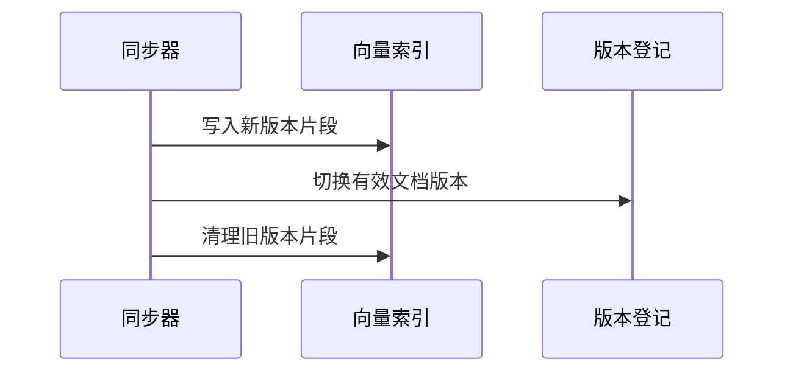

# 12 RAG 知识库：一份文档怎样变成有来源、可更新的任务证据

## 本章先回答什么

代理修复一个模块时，当前仓库可以告诉它代码怎样实现，却未必解释设计背景、团队规范或某个依赖的使用约定。这些信息可能保存在独立 Markdown 文档里。

直接把所有文档放进系统提示会消耗大量上下文，也难以处理更新。只做一次向量检索又不够：相似段落可能缺少关键前提，旧文档可能仍留在索引里，多个重复片段还可能占满结果。

本章沿着一份“接口重试约定”文档展开：**它怎样进入知识库，怎样被切分与检索，更新后怎样切换版本，最后以什么资格参与当前任务。**

### 本章的 STAR 主线

| 阶段 | 本章要解决的问题 |
|---|---|
| 情境 S | 独立文档提供重要背景，但全文注入成本高，检索结果还可能重复、过期或缺少上下文 |
| 任务 T | 建立从来源到索引再到有界证据的生命周期，同时区分参考知识和当前仓库事实 |
| 行动 A | 注册来源 → 结构化分块 → 双路索引 → 版本发布 → 混合召回 → 重排 → 上下文组装 → 新鲜度提示 |
| 结果 R | 文档可以按需成为可追溯证据，更新和失败有明确语义，而不是只剩一组相似文本 |

---

## 1. 情境：为什么长期记忆不能直接替代知识库

第 06 章的长期记忆来自交互中的稳定知识，例如用户偏好和项目约定。它需要判断哪些内容值得保存，并管理自动提取、手工优先和遗忘。

RAG 面对的来源不同：用户已经提供一组文档，系统需要把它们组织成可检索知识，而不是重新判断哪些聊天内容值得提取。它的主要问题是文档结构、索引版本和查询相关性。

例如，“用户偏好先给结论”适合长期记忆；一份十几页的接口规范适合知识库；当前函数是否真的进行了三次重试，则仍应读取仓库代码。

这三类来源可以一起帮助模型，但不能互相替代权威位置。

---

## 2. 任务：为什么来源、索引和结果要分三层

知识库注册后，系统需要知道文档从哪里来、哪一版已经建立索引，以及本次查询命中了哪些片段。


来源文件保存原始知识，登记信息确定当前有效文档版本，索引提供查询加速，返回结果只是一次任务选择出的视图。

如果把索引当成唯一来源，文档删除后就难以解释哪些旧向量应当失效；如果把查询结果当成永久知识，又会把本次选择固定到未来会话。

因此检索系统首先是一套版本与来源管理，再在这之上选择排序算法。

---

## 3. 文档进入系统前，为什么先约束来源范围

当前知识库面向 Markdown 文件。系统从指定目录发现文件，跳过符号链接文件，并检查解析后的路径没有逃出来源范围；读取时要求 UTF-8 文本。

这个限制让索引输入保持可解释：每段内容都能回到一个受管理的相对路径，而不是任意外部文件。它也意味着当前模块不是支持所有办公格式、网页抓取和多媒体解析的通用文档平台。

“接口重试约定”进入系统时，先获得文档身份与内容哈希。路径帮助辨认是哪份文档，哈希帮助辨认是哪一版内容，两者各有用途。

---

## 4. 为什么不能按固定字符数直接切文档

假设文档先写“写操作不允许盲目重试”，下一节才解释“读取超时可以重试一次”。如果机械切在标题与正文之间，检索可能只返回“可以重试一次”，却丢失“读取”这个适用范围。

GitAgent 先按 Markdown 标题识别章节，再在章节内部按 token 大小进一步分块。标题路径被保留下来，并与正文共同进入检索表示。

这样一个局部段落仍然携带“接口约定 → 读取恢复”这类背景。它不能保证每个语义前提都完整，但比只保留孤立正文更有机会维持适用范围。

相邻块还保留重叠，减少边界切开一句解释或一段示例造成的信息断裂。

---

## 5. 一个片段为什么需要比正文更多的身份

“同一个句子”可能出现在不同文档、不同章节，也可能来自同一文档的旧版本。系统必须能区分这些情况。

片段因此关联文档身份、文档版本、章节身份、标题路径和块顺序，并记录相邻块以及可定位的父章节关系。正文签名则帮助识别重复内容。

| 信息 | 后续用途 |
|---|---|
| 文档身份与内容哈希 | 只检索登记为有效的版本 |
| 标题路径与章节身份 | 保留语义范围，控制章节重复 |
| 前后片段与父章节关系 | 命中后补充邻近上下文 |
| 正文签名 | 防止重复证据占满预算 |

这些字段不是为了把结果写得更复杂。后面的版本过滤、多样性和上下文扩展，分别需要其中一部分事实。

---

## 6. 为什么同时建立稠密向量和 BM25 索引

用户可能问“请求失败后是否应该再试一次”，文档却使用“重试策略”这个表达。语义相近但词面不同，稠密向量有助于找到这类内容。

另一种查询包含精确错误码、函数名或配置键。此时词面匹配很重要，BM25 能提供另一条召回路径。

GitAgent 同时保存两种表示，让一次查询从两路获得候选。稠密向量使用本地嵌入模型，稀疏表示使用 BM25，索引存放在本地模式的 Qdrant 中。

这个选择不是声称任一算法总是更好，而是承认代码与规范查询同时包含语义表达和精确标识符。只依靠一条路径，会把另一类信号提前丢掉。

---

## 7. 两路分数不同，为什么使用名次融合

稠密相似度和 BM25 分数不在同一尺度。直接相加意味着默认二者数值可比较，但这个前提并不自然成立。

当前系统使用 Qdrant 提供的 RRF 融合。其一般思想是按候选在各路结果中的名次累加贡献：

```text
融合贡献 ∝ 各召回列表中 1 / (平滑常数 + 名次) 的总和
```

这只是理解名次融合的概念式；具体计算参数由所用组件实现决定，GitAgent 没有在业务代码中另写一套加权公式。

这样，两路都排得靠前的内容更容易进入候选集合，不必先手工校准两种原始分数。当前实现还保留各路来源与名次，方便解释“这条结果是怎样被找到的”。

---

## 8. 为什么混合召回之后还要重排

召回先解决“不要过早漏掉可能相关的内容”。但排在前面的片段也可能只共享背景词，没有直接回答当前问题。

重排阶段把查询与每个候选组成一对，交给本地重排模型评分，再按阈值过滤与排序。模型此时可以同时观察完整查询和候选文本，比单独存储的向量匹配更聚焦于本次问题。

代价是每个候选都增加计算，因此重排只作用于经过召回压缩的候选集合，而不是遍历全部文档。

重排分数也不是事实正确率或经过校准的可信概率。它帮助选择相关内容，不证明文档本身正确，更不能授权代理执行某个动作。

---

## 9. 为什么结果不能简单取分数最高的六段

“读取超时重试”一节可能包含多个相似段落。如果最高分结果都来自同一节，模型得到的仍然只是重复解释，其他约束可能完全没有进入上下文。

当前组装先尝试限制同一文档和同一章节占用的结果数，优先选择不同来源；如果不足，再从暂缓候选中补充。因此它是一种启发式多样性控制，不是严格禁止同文档结果。

这项设计的目的不是追求来源越多越好，而是在有限结果位中兼顾相关性与信息覆盖。高度相关但重复的第六段，可能不如另一节中的一条例外条件有用。

---

## 10. 命中一个片段后，为什么还要回到章节取上下文

查询命中的句子可能写着“这种情况可以重试”，但“这种情况”在上一个片段中才有定义。

因此系统以命中片段为中心，尝试加入前后相邻片段，并在能够定位时加入父章节片段。中心先进入预算，邻近内容只能使用剩余空间。


扩展依赖分块时保存的关系；没有可用父章节正文时，不能凭空补出一段背景。最终得到的是有依据的局部上下文，不是整篇文档的完整替代。

---

## 11. 为什么检索预算和整体上下文预算分开

一次检索即使只返回六条结果，扩展后的正文也可能很大。RAG 因此有独立的正文 token 预算，当前默认是 4000。

组装时先判断中心片段能否放入。中心都放不下，就不把无中心的邻居拼成这条命中；邻居超出预算则可以跳过。这个顺序保证每条返回内容仍围绕真正命中的证据。

这里使用嵌入模型 tokenizer 计算正文开销，与第 10 章通用请求的字节估算不同。检索预算主要控制片段正文，不保证元数据、工具包装和其他消息加起来也只有 4000 token。完整模型请求仍需经过全局预算。

两层限制各解决一个问题：RAG 不独占上下文，整个请求也不超出运行时窗口估算。

---

## 12. 为什么模型参数必须与索引契约一致

当前嵌入与重排模型从本地目录按需加载，按离线方式初始化。嵌入输出还要满足配置的向量维度。

这使“生成向量的模型”和“索引期待的形状”具有可检查关系。模型文件缺失、维度不匹配或重排输出数量错误，都应报告不可用，而不是返回一个貌似正常的空结果。

空命中表示在可用索引中未选出相关片段；模型加载失败表示检索过程未能成立。把二者区分，代理才不会把基础设施故障解释成“知识库没有相关知识”。

本地加载也不等于模型文件可任意信任。模型目录属于部署依赖，其可信来源与运行环境仍应单独保证。

---

## 13. 文档改动后，为什么不能直接原地覆盖旧索引

现在“接口重试约定”增加了一条例外。如果同步一开始就删除旧片段，再生成新向量，中途嵌入失败，原本可用的知识也会消失。

GitAgent 先生成并写入新版本片段，再更新登记库中的有效文档版本，最后清理旧版本。检索按登记的文档哈希过滤，所以尚未正式发布的新片段不会仅因为已经写入向量库就成为有效知识。



这里不把向量库和登记库假装成一个跨系统事务，而是用版本过滤表达可见性。旧数据清理失败时，可能留下空间占用，但旧版本不应继续参与正常查询。

---

## 14. 增量同步为什么先看文件属性，再看内容哈希

每次同步都重新嵌入所有文档成本很高。系统先比较修改时间和大小；这些属性变化后，再读取内容并比较哈希。正文未变时不必重新构建向量。

新增、修改和删除因此有不同处理：新增建立记录与片段，修改切换有效版本，删除从有效文档集合移除并清理旧索引。

这是一个面向受管理本地文档的增量策略，不是防篡改校验。若外部工具改变正文却刻意保持相同大小和时间，属性快速路径可能无法发现。文档新鲜度保证应以这个检测前提为边界。

---

## 15. 同步失败后，为什么还要区分 STALE 和 ERROR

一份知识库更新失败，但旧索引仍可用时，系统可以标记为 STALE，让查询继续使用已发布版本，同时提示来源已变化，需要同步。

如果没有可用索引，或者知识库处于错误状态，查询就不应该伪造参考资料。此时进入 ERROR 或不可用路径。

| 状态 | 对当前查询的含义 |
|---|---|
| READY | 使用已登记的可用版本 |
| STALE | 可以使用旧索引，但明确提示新鲜度不足 |
| ERROR | 检索不可用，不能当作正常空命中 |

这让“继续工作”不必以隐藏过期事实为代价。模型拿到旧规范后，应把它视为带条件的背景，而不是当前仓库事实。

---

## 16. RAG 怎样进入能力层，又为什么不自己修改知识库

每个注册知识库暴露为一个只读能力。调用参数只需要聚焦的查询文本，不接收整段会话或任意索引操作。返回值包含知识库身份、命中、数量、新鲜度和提示。

模型可以决定何时查询，但注册、同步和移除属于知识库管理流程。读取参考资料因此不会顺便改变它正在参考的来源。

RAG 目录加载故障也与其他提供方隔离，不应仅因为知识库不可用就阻止普通仓库工具建立。相应代价是当前代理可能看不到可用 RAG 能力，不能假设所有请求都经过了检索。

当前管理器用锁协调同步与检索，优先保证进程内操作一致性。因此配置允许多个 RAG 调用，并不代表同一管理器的底层查询一定完全并行。

---

## 17. 这些默认参数表达了怎样的取舍

当前配置大致是：每块 500 token、重叠 75；两路各召回 30 个候选，融合后粗选 20 个，最终至多 6 条结果，并受 4000 token 正文预算限制。

从入口到输出逐级缩小，是因为每一层的成本不同。较大的召回集合保留机会，较小的重排集合控制模型计算，少量最终结果控制下游上下文。

块越大，语义背景可能越完整，但命中更不聚焦；块越小，定位更细，却更依赖相邻扩展。重叠与结果去重是一对配套设计：前者降低切分损失，后者避免重复内容消耗预算。

这些数值是当前默认配置，不是由本章证明的最优参数。理解它们的作用方向，比记住数值更重要。

---

## 18. 用“接口重试约定”把整章串起来

文档先从受管理目录进入系统，按标题与 token 边界分块，保留来源、版本和邻接关系。稠密与稀疏表示写入索引后，有效版本正式登记。

用户询问“请求失败后能否重试”。查询经双路召回和名次融合获得候选，重排选出直接相关片段。组装器补充读取与写入的邻近解释，去掉重复片段，并控制正文预算。

代理收到的内容带来源和新鲜度，随后仍需读取当前代码，判断实现是否遵守约定。文档更新时，新版本先入索引再切换登记；同步未完成前，查询只能使用旧版本并得到相应提示。

这条链把检索算法与生命周期连在一起：找到相关段落之前，先要知道哪些段落目前有资格被找到。

---

## 19. 结果：知识库最终提供了什么

RAG 将独立文档转成按需证据，标题与邻接关系减轻碎片化，混合召回与重排分担覆盖和相关性，预算与多样性控制有限上下文的使用。版本登记则让更新、删除和失败有明确可见性。

代价是模型依赖、索引、登记与来源文件需要共同维护。检索结果仍不保证事实最新或答案正确；它提供可追溯参考，当前业务事实继续由仓库和远端读取确认。

## 20. 复习时怎样讲这一章

先解释 RAG 与长期记忆的来源差异，再沿一份文档的注册、分块、双路索引和版本切换建立存储视角。然后沿一次查询解释召回、融合、重排、邻接扩展与预算。

最后回到旧文档的问题：STALE 为什么还能查、ERROR 为什么不能当作空结果，以及参考知识为什么不能覆盖当前代码事实。

## 21. 代码定位

| 想核对的问题 | 代码位置 |
|---|---|
| 知识库、片段、结果和默认参数 | `gitagent/capability/rag/models.py` |
| Markdown 发现、分块与本地嵌入 | `gitagent/capability/rag/ingestion.py` |
| 双路召回、融合和有效版本过滤 | `gitagent/capability/rag/qdrant.py` |
| 重排、多样性、邻接扩展和预算 | `gitagent/capability/rag/retrieval.py` |
| 注册、增量同步和新鲜度 | `gitagent/capability/rag/manager.py`、`registry.py` |
| 只读检索能力与故障隔离 | `gitagent/capability/providers/rag.py` |

下一章把模型、工具和知识系统放回应用入口：[应用装配、配置与 Prompt](13-application-and-prompts.md)。
