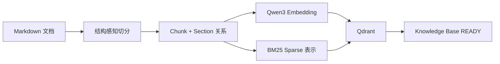
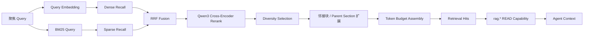

# 12 RAG 知识系统：GitAgent 怎样把文档变成可检索、可更新、可控注入的证据

上一章讨论的是长期 Memory：从已经完成的交互里筛出少量长期有价值的信息，供未来 Session 使用。本章处理另一类知识来源：**较大的 Markdown 文档集合**。这些资料通常已经存在，内容量远大于一次模型请求能够容纳的范围，因此需要经过切分、索引、检索、重排和 Context Assembly，最后只把当前任务真正相关的部分交给 Agent。

这一章重点回答五个问题：文档怎样进入索引；为什么同时使用 Dense Retrieval 和 BM25；为什么粗召回以后还要经过 Cross-Encoder Rerank；怎样在有限 token 预算里恢复足够上下文；文档变化以后怎样保证旧索引不会被当成最新事实。

---

## 1. 先看完整数据流

GitAgent 的 RAG 可以分成两条链。

离线或同步链：



在线检索链：



从整体上看，RAG 在这里承担的是“把大规模已有资料变成少量当前证据”。它和 Agent Loop、Capability、Context 系统之间都有明确接口：RAG 内部负责检索质量和知识库生命周期；Capability 层负责可见性、权限和统一调用协议；Context 层负责最终模型请求的整体 token 预算。

---

## 2. Knowledge Base 为什么需要独立生命周期

一套可用的 RAG 系统需要同时管理两类状态。

第一类是控制面状态，例如知识库叫什么、来源目录在哪里、目前包含哪些文档、上次同步时每个文档是什么版本。GitAgent 使用 SQLite Registry 保存这类信息。

第二类是检索索引，也就是真正用于 Dense 和 BM25 查询的 Qdrant collection。

把两类状态分开以后，系统可以明确回答：

- Registry 认为某个知识库是否存在；
- 当前登记了哪些文档版本；
- Qdrant collection 是否真的存在；
- 本地 Embedding / Reranker 模型是否可用；
- 源文件有没有在上次同步后发生变化。

因此一个知识库拥有三个关键状态：

| 状态 | 含义 | Agent 是否可以检索 |
|---|---|---|
| `READY` | 源文件与最近成功索引一致 | 可以 |
| `STALE` | 源文件已经变化，当前仍保存上一版成功索引 | 可以，但结果带 stale 警告 |
| `ERROR` | 索引、模型或运行依赖已经无法可靠工作 | 暂停暴露为可用 RAG 能力 |

`STALE` 很重要。实际工程里，源文档变化与重新索引之间可能存在时间差。如果每次检测到变化都立即拒绝所有查询，可用性会下降；如果继续把旧索引当作最新资料，又会掩盖知识版本问题。GitAgent 选择继续提供上一份成功索引，同时把 stale 状态显式传到结果中，让 Agent 知道这些内容需要结合当前事实再次确认。

---

## 3. 文档进入索引前为什么先保存稳定身份

知识库扫描来源目录时只接受 Markdown 文件，并且会过滤符号链接，文件解析后的真实路径必须仍位于知识库根目录内。这个边界可以防止索引过程顺着路径跳到知识库之外。

每个文档会记录：

- 相对路径；
- 文件大小和修改时间；
- 内容哈希；
- 稳定 `document_id`。

其中修改时间和大小适合做快速变化检测，内容哈希用于最终确认内容是否真的改变。

这两层判断可以减少不必要的重新 Embedding。文件系统元数据没有变化时，可以直接认为该文档无需重新读取；元数据变化后，系统会重新读取正文并比较内容哈希。如果哈希仍然相同，只更新文件统计信息即可。

文档身份和文档版本也因此分开：`document_id` 主要由知识库和相对路径确定，`content_hash` 表示这个文档当前是哪一版。后续 Qdrant 查询会按当前登记的 `document_id + content_hash` 过滤，从而避免已经被替换的旧版本 chunk 参与正常检索。

---

## 4. 为什么 Markdown 要先按结构切 Section，再按 Token 切 Chunk

直接按照固定字符数切文档很简单，但会带来两个问题。

第一，Markdown 的标题层级本身包含语义结构。同一句话位于“安装 / Linux”还是“API / Authentication”下面，会影响它的含义。

第二，模型和 Embedding 模型真正受 token 数量约束。相同字符数在不同文本里可能对应不同 token 数量。

GitAgent 因此先按 Markdown 的 `H1 ~ H6` 建立 section，再在每个 section 内使用 Embedding 模型自己的 tokenizer 做 token-aware splitting。

每个 chunk 除了正文，还保存：

- `heading_path`：从上层标题到当前标题的路径；
- `section_id`；
- `parent_section_id`；
- 前一个与后一个 `chunk_id`；
- 当前文档版本哈希；
- chunk 自己的内容哈希。

Embedding 时会把 heading path 和正文放在一起。这样一个只写着“设置为 true 即可”的片段，也能带着它所属章节的语义进入向量空间。

当前默认 chunk 大小是 500 token，重叠 75 token。Overlap 用来缓解语义刚好跨越切分边界的问题。代价是索引中会出现一部分重复文本，所以后面的 Context Assembly 还需要按 chunk id 和内容哈希去重。

---

## 5. Dense Retrieval 解决什么问题

Dense Retrieval 会先用本地 Qwen3 Embedding 模型把 Query 编成向量，再在 Qdrant 中做向量相似度召回。

它擅长处理“表达方式不同、语义接近”的情况。例如用户问“恢复中断任务时怎样避免重复副作用”，文档里可能写的是“uncertain write should not be retried automatically”。关键词重合有限，语义向量仍可能把它们拉近。

Dense Retrieval 的弱点也很清楚：精确标识符、函数名、错误码、协议字段等内容往往更依赖词面匹配。一个语义很接近的 chunk 可能得到高分，同时遗漏真正包含目标术语的段落。

因此 GitAgent 没有把 Dense 作为唯一粗召回通道。

---

## 6. BM25 Sparse Retrieval 为什么和 Dense 一起使用

BM25 更关注词项本身。对于 `expected_head_sha`、`FailureGuard`、HTTP 状态码、配置字段、类名这类精确术语，它通常比纯语义向量更稳定。

RAG 在线检索时会同时进行：

- Dense Recall；
- BM25 Sparse Recall。

当前默认两边各召回最多 30 个候选。

这两个排名的分值体系不同。向量相似度和 BM25 分数无法直接安全相加，所以 GitAgent 使用 RRF（Reciprocal Rank Fusion）融合两个排名。

RRF 更关心“一个结果在各路召回中排第几”，对不同检索器的原始 score 标度依赖较小。一个 chunk 如果在 Dense 和 BM25 两边都靠前，会得到更稳定的融合优势；一个只在某一路表现突出的结果仍然有机会进入后续候选。

融合以后先保留较小的 coarse candidate 集合，当前默认上限是 20。这样下一阶段的 Cross-Encoder 无需面对整个知识库。

---

## 7. 为什么 Hybrid Recall 后还需要 Cross-Encoder Rerank

Dense 和 BM25 的目标首先是“别漏掉可能相关的材料”。高召回阶段通常会保留一些噪声。

Cross-Encoder Reranker 做的是第二次、更贵但更精确的相关性判断。它会把 Query 和候选正文成对输入本地 Qwen3 Reranker，让模型直接判断两段文本之间的匹配程度。

这和 Embedding 检索的计算方式不同：Embedding 可以预先为文档编码，在线只需要计算 Query 向量并做近邻搜索，因此适合从大量 chunk 中快速召回；Cross-Encoder 需要针对每个 `query-document` 对重新计算，成本更高，更适合处理已经缩小后的候选集。

GitAgent 会把 rerank score 低于阈值的候选去掉，再按 `rerank_score` 为主、融合分数为辅排序。

因此整套检索形成两级目标：

1. Hybrid Retrieval 尽量把可能有用的证据捞上来；
2. Reranker 从少量候选中提高精排质量。

这种设计也给调参提供了清晰边界。召回率不足时优先检查 chunk、Dense/BM25 recall limit 和 fusion；候选很多但最终相关性差时，再重点检查 reranker 和阈值。

---

## 8. 为什么重排以后还不能直接取 Top-K 塞给模型

单纯取 rerank Top-K 仍然可能出现两个问题。

第一，同一篇文档里的相邻 chunk 内容高度相似，Top-K 可能被一篇文档占满。模型看到很多近似内容，却缺少其他来源的补充证据。

第二，命中的中心 chunk 可能只包含结论的一半。真正理解它还需要前后段落或父 section 的背景。

GitAgent 因此把最终组装拆成“先保证候选多样性，再做局部上下文扩展”。

### 8.1 Diversity Selection

系统优先限制同一文档和同一 section 在第一轮选择中的占比：

- 同一文档优先最多取两个候选；
- 同一 section 优先取一个候选。

超出的高分候选先进入 deferred 集合。如果前面的多样化候选数量不足，再从 deferred 中补回来。

这个策略比较简单，但能防止一个长章节因为切出了很多相似 chunk 而垄断全部结果。

### 8.2 Local Context Expansion

对每个被选中的中心 chunk，系统会尝试补充：

- 前一个 chunk；
- 后一个 chunk；
- 父 section 的一个 chunk。

中心 chunk 负责“命中相关性”，邻接块和父 section 负责“补足语境”。扩展发生在 Rerank 之后，可以把计算成本集中在少量已经确认相关的区域。

### 8.3 去重

Chunk overlap、相邻扩展以及多个候选之间可能带来重复文本。Assembly 会同时跟踪已使用的 chunk id 和内容哈希，避免同一内容被重复加入最终 Context。

---

## 9. Context Token Budget 为什么在 RAG 内部再设一层

即使模型总 Context Window 很大，RAG 也不能无限返回资料。

大量检索正文会挤压：

- 当前用户问题；
- System 约束；
- Agent 历史；
- Tool Call / Result；
- 当前仓库证据。

GitAgent 因此给 RAG 结果设置独立 `context_token_budget`，当前默认是 4000 token。

Assembly 使用 Embedding tokenizer 计算候选片段成本。每加入一段内容都会减少剩余预算。如果中心 chunk 自己已经超过剩余预算，该 hit 会放弃；扩展块超过预算时，可以只舍弃扩展部分。

这体现了一个很重要的 Context Engineering 思路：**检索命中只是候选资格，真正进入模型还要经过预算分配。**

RAG 的目标是提供足够支撑当前判断的证据，而不是尽可能把知识库搬进 Prompt。

---

## 10. Sync 怎样处理新增、修改和删除文档

知识库第一次注册时会完成完整索引：扫描 Markdown、加载文档、切分、Embedding、创建 Qdrant collection、写入所有 chunk，成功后再把知识库登记为 READY。

后续 `sync` 会比较当前目录和 Registry 中保存的上一次文档状态，把文档分成：

- added；
- changed；
- deleted；
- unchanged。

未变化文档无需重新 Embedding。新增和真实内容变化的文档重新切分并 upsert 新版本。

一个值得注意的顺序是：**先把新版本成功写入并更新 Registry，再清理旧文档版本。**

这样可以减少同步过程中留下“旧索引已经删掉，新索引还没成功写完”的窗口。对于 changed 文档，旧版本 chunk 会按 `document_id + old content_hash` 清理；对于 deleted 文档，会清掉这个 `document_id` 的索引内容。

如果同步过程失败，Knowledge Base 会进入错误记录路径，提醒后续显式处理。初始化过程中若刚创建的新 collection 失败，系统会尽力删除这份未完成 collection，避免把半成品当成正常索引。

---

## 11. Freshness Check 怎样发现索引已经过期

每次正式 retrieve 前，Manager 会进行 freshness check。

判断流程分两层。

先比较目录里的相对路径集合。如果文件新增或删除，知识库直接进入 STALE。

文件集合一致时，再看 mtime 和 size。元数据有变化的文件会重新读取并计算内容哈希：

- 哈希相同：正文实际没变，只更新统计信息；
- 哈希不同：标记 STALE。

这个策略兼顾速度和准确性。大多数没有变化的文件只需要一次 stat；出现可疑变化时才读取正文做 hash 确认。

STALE 状态下仍会使用上一次成功索引返回结果，同时 `RetrievalResult` 带上 `stale=true` 和同步提示。Agent 因此可以把它作为参考知识使用，同时避免把它当成当前仓库的权威状态。

---

## 12. 为什么查询时还要按当前 Document Version 过滤

Qdrant collection 可能短时间保留旧版本 chunk，例如新版本刚写入、旧版本清理还没完成，或者一次清理操作异常。

为了避免旧内容混入正常查询，检索会根据 Registry 当前记录的每份 `document_id + content_hash` 构造 active document filter。

Dense、BM25 和融合查询都会受这个过滤条件约束。

这形成两层版本保护：

1. Registry 决定当前认可哪个文档版本；
2. Qdrant 查询只允许这些当前版本进入候选。

因此检索正确性不会完全依赖“旧向量一定已经物理删除干净”。

---

## 13. RAGProvider 怎样把知识系统接回 Agent Harness

RAG 内部有自己的知识库、索引和检索生命周期，但 Agent Loop 不需要理解这些内部细节。

RAGProvider 会为每个已注册知识库生成一个 `rag.<knowledge_base_id>` Capability。它统一声明：

- READ 访问等级；
- 一个聚焦 `query` 参数；
- 结构化 RetrievalResult；
- 当前 AVAILABLE / UNAVAILABLE 状态。

READY 和 STALE 都可以暴露为 AVAILABLE；ERROR 会映射成不可用能力。

模型因此走和其他工具一致的生命周期：

```text
Discover → LLM Tool → StructuredCall → Schema → Permission → RAGProvider → RetrievalResult → Ordered Commit
```

RAG 查询属于只读动作，ExecutionProfile 可以使用 concurrent 模式。多个互不冲突的知识查询因此能够和其他只读调用一起进入并发调度。

这层接入很关键，因为它让“知识检索”继续服从 Harness 的通用约束：Agent 只能看到自己被允许发现的知识库，参数仍经过 schema 检查，错误仍转换成统一 Capability 语义，调用结果仍进入正常 Agent 观察链。

---

## 14. RAG、Memory、Repository Fact 三者怎样分工

这三个系统都可能给模型补充当前用户消息之外的信息，但它们的来源和权威性不同。

| 来源 | 典型内容 | 更新方式 | 最适合回答的问题 |
|---|---|---|---|
| RAG | 文档、规范、设计资料、外部知识 | 文档 sync + 重建索引 | “资料里怎么说？” |
| Memory | 已完成交互里抽出的稳定偏好和长期约定 | extraction / update / TTL / Dream | “以前长期约定过什么？” |
| Repository / GitHub Capability | 当前文件、branch、Issue、PR、CI | 每次任务实时读取 | “现在真实状态是什么？” |

例如 RAG 文档里写“项目默认分支是 main”，Memory 里也记录过类似约定，但当前 GitHub 已经把默认分支改成 trunk。真正执行远端写入时仍要以当前 GitHub Capability 读取到的事实为准。

因此可以把证据优先级理解成：当前用户指令和当前外部事实决定当前动作；Memory 与 RAG 提供背景、规范和历史知识；当它们与实时状态冲突时，需要重新核验实时来源。

---

## 15. 这套设计的主要权衡

### 15.1 Hybrid Retrieval 提高召回，同时增加系统复杂度

Dense 和 BM25 可以互补，但需要同时维护向量模型、稀疏索引和融合逻辑。RRF 让两路结果的组合更稳定，也增加了一层参数和诊断空间。

### 15.2 Cross-Encoder 提高精排质量，同时增加在线延迟

对整个知识库做 Cross-Encoder 代价太高，所以前面必须先有高效粗召回。粗召回数量太少可能漏证据，数量太多又会增加 Rerank 成本。

### 15.3 Chunk 越小定位越精细，语义越容易被切碎

较小 chunk 可以减少无关正文进入 Context，但完整解释可能跨 chunk。GitAgent 使用结构化 section、overlap 和命中后的邻接扩展缓解这个问题。

### 15.4 STALE 提高可用性，同时要求调用方理解“旧索引”语义

继续提供上一份成功索引可以避免知识库短暂不可用，但结果必须显式携带 stale 状态，涉及实时事实时还要再次查询权威来源。

### 15.5 独立 RAG token budget 提高 Context 可控性，同时可能截掉低优先级证据

预算越紧，模型历史和当前仓库证据越安全；预算过小也可能导致补充材料不足。评估时需要同时观察任务成功率、检索覆盖和 Context 成本。

---

## 16. 典型失败应该从哪一层排查

面对“RAG 答错了”，先判断失败发生在哪个阶段，比直接更换 Embedding 模型更有效。

| 现象 | 优先检查 |
|---|---|
| 正确文档根本没进候选 | 文档同步、chunk、Dense/BM25 recall、active version filter |
| 候选里有正确 chunk，但排得很后 | RRF、Reranker、rerank threshold |
| 命中片段太短，缺少解释上下文 | section 切分、neighbor / parent expansion |
| 返回内容高度重复 | diversity 和 content-hash 去重 |
| 相关结果太多挤占 Prompt | result limit、RAG context token budget |
| 文档已经改了却仍看到旧内容 | freshness status、sync、Registry 的 content hash |
| 整个知识库不可用 | 本地模型目录、Python 依赖、Qdrant collection、ERROR 状态 |
| Agent 明明有知识库却看不到工具 | Capability refresh、discover 权限、RAGProvider 状态 |

这张表体现了 RAG Harness 调优的基本方法：先把“召回、排序、组装、生命周期、Agent 接入”分开，再根据证据定位问题。

---

## 17. 当前实现需要特别注意的边界

前面的链路已经把索引、召回、重排、组装和生命周期分别讲清楚。复习时还需要把几个容易被“简化过头”的边界保留下来。

Qdrant 只是索引和查询基础设施，不等于整个 RAG：Markdown 结构切分、本地 Embedding、Cross-Encoder Rerank、多样性选择、邻接/父 section 扩展、token assembly 和知识库状态都在其他组件中完成。Hybrid Retrieval 也只是高召回阶段，RRF 融合以后仍然要经过 Reranker；Rerank 排名前几的 chunk 也不会直接塞进 Prompt，还要继续做去重、上下文扩展和独立预算分配。

STALE 表示“源文档已经变化，但上一份成功索引仍可作为带警告的参考”，不是知识库完全不可用。文件 mtime/size 变化后还会比较内容哈希，正文没变时不需要重新 Embedding。查询时又会按 Registry 当前认可的 document id + content hash 过滤，因此版本正确性不完全依赖旧 chunk 已经物理删除干净。

最后，RAG 提供的是文档证据，不是当前 Repository / GitHub 状态。即使资料里写着某个 branch 或配置，真正执行当前任务仍要重新读取权威外部事实。RAGProvider 把知识库包装成普通 READ Capability，所以 Agent Loop 不需要一套特殊“RAG 协议”；它继续服从 discover、permission、execution 和 ordered commit。

---

## 18. 代码定位

理解设计以后，按问题回源码核对即可：

| 想核对的问题 | 主要位置 |
|---|---|
| Knowledge Base 生命周期、sync、freshness、retrieve 总入口 | `gitagent/capability/rag/manager.py` |
| Markdown 发现、结构切分、本地 Embedding | `gitagent/capability/rag/ingestion.py` |
| READY / STALE / ERROR、Chunk、RetrievalResult 等数据契约 | `gitagent/capability/rag/models.py` |
| Knowledge Base 与当前文档版本的 SQLite Registry | `gitagent/capability/rag/registry.py` |
| Qdrant Dense + BM25 + RRF 与 active document filter | `gitagent/capability/rag/qdrant.py` |
| Cross-Encoder Rerank、Diversity、Expansion、Token Assembly | `gitagent/capability/rag/retrieval.py` |
| RAG 怎样注册成普通 READ Capability | `gitagent/capability/providers/rag.py` |
| RAG Provider 怎样加入统一 Capability Layer | `gitagent/application/capabilities.py` |

下一章进入应用装配与 Prompt：[这些 Harness 模块怎样在真实进程、Session 和模型请求里被组装起来](13-application-config-and-prompts.md)。
