# 13 应用装配、配置与 Prompt：GitAgent 怎样从一组模块变成可运行程序

前面的章节已经分别介绍了 Agent、Agent Loop、Capability、执行、审批、持久化、上下文和 Memory。到这里还差最后一层连接工作：**程序启动时，谁负责创建这些组件；配置怎样进入运行时；用户选定仓库和 Session 以后，哪些对象继续复用，哪些对象重新建立；Prompt 又怎样进入每一次模型请求。**

这一章先把实际设计和运行流程走完整，再用 STAR 回看这些设计解决了什么问题。阅读时先抓住一条主线：

**读取配置 → 校验配置 → 装配 Application 级基础设施 → 选择账户、仓库和 Session → 建立 Session 级 Service → 创建 Turn → 构造当前模型上下文 → 运行或恢复 Agent → 投影结果并持久化。**

Prompt 会穿插在这条链路里：启动时统一加载，运行时按用途取出静态模板或填入当前上下文，再交给对应 Agent 或分类器。

---

## 1. 先看这一层在整个 GitAgent 中处于什么位置

可以先把 Application 层理解成“总装配台”和“会话入口”。前面各章讲的组件都已经有自己的职责，这一层负责把它们连接起来，并管理它们各自应该存活多久。

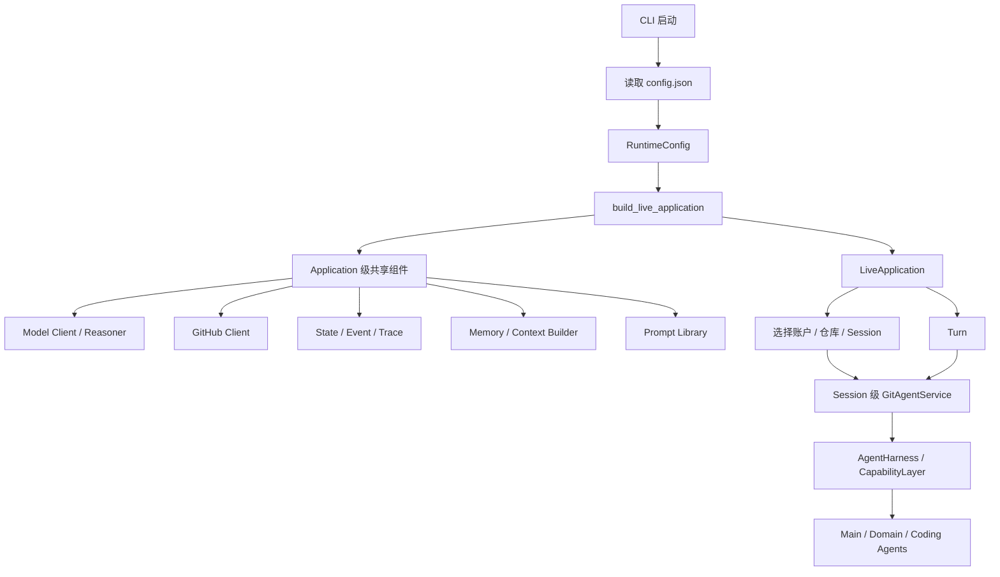

这张图先说明三个层次。

| 层次 | 主要对象 | 负责的事情 |
|---|---|---|
| Application 级 | `LiveApplication`、模型客户端、GitHub 客户端、持久化、Trace、Memory、ContextBuilder | 整个进程运行期间共享的基础设施 |
| Session 级 | `GitAgentService`、`AgentHarness`、`CapabilityLayer`、各 Agent | 服务当前仓库和当前 Session 的运行环境 |
| Turn / Agent Run 级 | Turn、`AgentContext`、当前调用记录 | 记录一次输入以及某棵 Agent 运行树的状态 |

这里有一个很重要的事实：**Application 级对象不会在每次用户输入时全部重新创建；Session 级 Service 会在创建、恢复或切换 Session 时重新建立。**

理解了这个事实，后面的配置、Session 切换、恢复和 Prompt 组合会顺很多。

---

## 2. 程序启动的第一步：把配置文件变成可以信任的 RuntimeConfig

CLI 支持通过 `--config` 指定配置文件。启动时先调用 `RuntimeConfig.from_file`，把 JSON 配置转换成结构化对象，然后才允许进入应用装配阶段。

整个过程可以拆成四步。

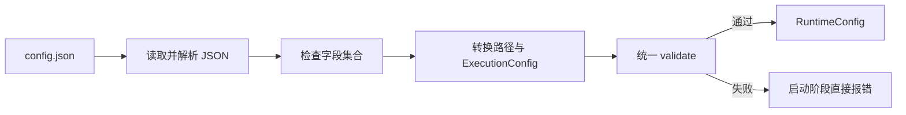

### 2.1 第一步：先检查配置的“形状”

`RuntimeConfig` 对顶层字段采用严格匹配。缺少字段会报错，多出当前实现不认识的字段也会报错。

`execution` 这一组配置还会继续转换成单独的 `ExecutionConfig`，并再次检查其中字段是否完整。

这样做以后，应用后面的模块拿到的是结构明确的配置对象。它们无需反复判断某个键是否存在，也无需各自猜测配置拼写。

### 2.2 第二步：把路径统一解析成绝对路径

`state_path`、`event_path` 和 `memory_path` 可以在配置里写相对路径。加载配置时，相对路径会以**配置文件所在目录**为基准解析，然后保存为绝对路径。

例如，用户从另一个工作目录启动 GitAgent，只要仍然使用同一份配置文件，这些存储目录的含义就保持稳定。

这一步解决的是“路径到底相对谁”的问题。路径在启动阶段统一以后，State、Event 和 Memory 模块只接收已经确定的目标位置。

### 2.3 第三步：检查数值、类型和交叉约束

配置对象会继续验证运行范围。例如：

- token 上限、超时和并发上限需要满足正数要求；
- Agent 深度和重试次数允许为零，但不能出现负数；
- `context_window_tokens` 必须提供 `default`；
- Agent 名称只能来自当前支持的 Main、Repository、Issues、Pull Requests、Coding；
- 单个 Provider 的并发上限不能超过 Capability 总并发上限；
- 状态、事件和 Memory 路径最终都必须是绝对路径。

这些规则都在程序真正进入 Agent Runtime 之前完成检查。

### 2.4 第四步：把后续模块经常使用的配置语义集中起来

`RuntimeConfig` 还提供了两个很实用的统一入口。

第一个是 `context_window_for(agent)`。某个 Agent 有单独配置时使用自己的值，没有时回退到 `default`。这样不同模块不需要重复写一套 fallback 逻辑。

第二个是 `secret_values`。它会汇总模型 API Key、GitHub Token、Context7 Key 等敏感值，后续 StateStore、Capability 等模块可以统一拿来做脱敏或阻断敏感内容落盘。

### 2.5 为什么配置层要先做这么多工作

现在再看设计原因会比较直观。

配置文件处在系统最外层，里面一个错误可能一路传播到模型调用、GitHub 调用、并发执行或持久化。如果等到真正执行远端操作时才发现路径、并发或字段配置有问题，错误位置会离根因很远。

因此这里采用“启动阶段收口”的方式：**先把文本配置转换成结构化对象，再做完整校验，校验通过后其他模块只消费已经整理好的配置。**

它带来的直接结果是，配置错误更早暴露，错误信息也更接近真正的配置问题。

---

## 3. 先分清三类“配置来源”，否则很容易把概念混在一起

当前实现里，并非所有可调内容都来自 `config.json`。这一点在理解 Application 装配时很重要。

| 来源 | 当前承载内容 | 谁负责读取 | 何时确定 |
|---|---|---|---|
| `config.json` | 模型、Token、超时、持久化路径、上下文窗口、执行限制、Memory 自动化开关等 | `RuntimeConfig` | 进程启动时 |
| `capabilities.yaml` | Capability 定义、Provider 归属、Agent 权限等 | `build_capability_layer` | 建立 Service 时 |
| `gitagent/prompts/**/*.md` | System、任务、审批、Memory、Reasoning 等 Prompt 文本 | `PromptLibrary` | 首次加载并在启动时校验 |
| Session / Repository 选择 | 当前账户、仓库、Session 身份 | `LiveApplication` + `SessionManager` | 用户进入具体会话时 |

这里特别要记住两个边界。

`capabilities.yaml` 由应用资源目录定位，当前 `RuntimeConfig` 没有提供“Capability 配置路径”字段。Prompt 根目录同样固定在 `gitagent/prompts` 包目录，运行时配置无法把可信 Prompt 根目录改到其他位置。

这种划分把“部署时经常变化的参数”和“应用自身携带的策略资源”分开管理。后面讲 Prompt 和 Capability 时会继续看到这个边界的作用。

---

## 4. build_live_application：先把进程级基础设施装起来

配置通过校验以后，CLI 调用 `build_live_application(config)`。这个函数是应用的 Composition Root，也就是“依赖从哪里创建、按什么顺序连接”的集中位置。

可以把它看成一条装配流水线。

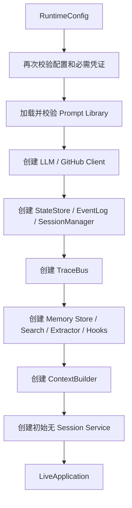

下面按装配顺序理解每一段。

### 4.1 先确认关键凭证具备运行条件

`RuntimeConfig.validate()` 负责通用类型和范围检查。进入 `build_live_application` 后还会确认模型 API Key 和 GitHub Token 已经提供。

原因很简单：后面的真实应用路径依赖模型和 GitHub。如果这两个基础依赖缺失，继续创建一半基础设施没有意义。

### 4.2 Prompt 在其他 Agent 运行之前完成加载检查

Application 启动时会取得全局 `PromptLibrary`，并执行模板校验。

这样 Prompt 文件中明显的模板括号错误会在启动阶段暴露。后续 Agent 真正调用 Prompt 时，还会继续检查模板 key、缺失变量和多余变量。

这里可以先记住一句话：**Prompt 文件属于应用启动资源，模型调用只是消费已经登记的模板。**

### 4.3 创建模型和 GitHub 客户端

接下来创建模型客户端、`LLMReasoner` 和 `GitHubClient`。

这些对象会被多个 Session 使用，因此放在 Application 生命周期中共享。切换 Session 时，没有必要重新建立同一个模型端点和同一个 GitHub API 客户端。

### 4.4 建立 State、Event、Session 和 Trace

`StateStore` 保存结构化状态；`SessionEventLog` 保存 Session 事件；`SessionManager` 负责 Session 和 Turn 的管理；`TraceBus` 再把运行事件写入 Session 事件体系。

它们先于具体 Session Service 创建，是因为 Session Service 后续需要从这里读取已有状态、保存新的运行状态，也要把 Trace 绑定回当前 Session。

### 4.5 建立 Memory 和 Context 相关服务

随后创建 Memory Page Store、Memory Search、Memory Extractor、自动维护 Hooks，以及 Main Agent 使用的 `ContextBuilder`。

这些对象同样按 Application 级共享。某个具体 Session 的 Memory scope 会在使用时通过 account key 和 repository key 确定。

### 4.6 最后得到 LiveApplication

完成这些共享基础设施以后，系统创建一个初始的 `GitAgentService`，然后把全部对象放进 `LiveApplication`。

这个初始 Service 还没有绑定具体 `SessionScope`。它让 Application 在“刚启动、用户还没有选定仓库和 Session”的阶段也拥有完整对象结构。真正进入 Session 时，Application 会准备一个绑定 scope 的新 Service。

这就引出了下一节最关键的生命周期设计。

---

## 5. Application 共享基础设施，Session 拥有自己的运行 Service

原理先看表格。

| 生命周期 | 当前实现中的典型对象 | 生命周期结束的时机 |
|---|---|---|
| Application | `RuntimeConfig`、LLM Client、Reasoner、GitHub Client、StateStore、SessionManager、TraceBus、Memory Store/Search/Hooks、ContextBuilder | 应用关闭 |
| Session Service | `GitAgentService`、`AgentHarness`、`CapabilityLayer`、Main/Repository/Issue/PR/Coding Agent、Approval Intent Classifier | 切换、重建或退出当前 Service |
| Session 持久状态 | `SessionRecord`、事件历史、保存的 `agent_context`、working state | Session 被重置或删除 |
| Turn | 用户本轮输入、Turn 状态、最终投影结果 | 本轮完成或失败 |
| Agent Run | 某个 `AgentContext`、run 级调用与 waiting 状态 | 当前运行树完成或被恢复到下一阶段 |

这里最容易混淆的是“Session Service”和“Session 持久状态”。

Service 是当前进程里的运行对象，可以被销毁和重建；Session 的事件和保存状态由 `SessionManager` 管理，可以跨 Service 重建继续存在。

因此恢复 Session 的本质流程可以理解成：

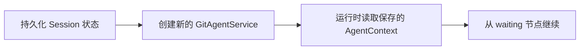

这样，进程内对象可以更新，历史事实和可恢复控制状态仍然保留。

### 为什么 CapabilityLayer 也跟着 Service 重建

`_prepare_service` 在建立 Session Service 时会重新调用 `build_capability_layer`。新的 Capability Layer 会拿到当前 Memory roots、受阻路径、敏感值和共享 GitHub/Trace 依赖，然后创建新的 `AgentHarness` 和 Agent 集合。

这让 Session 相关运行边界在 Service 创建时一次绑定完成。旧 Service 被 invalidate 后，旧 Harness 也失去继续接收新工作的入口。

---

## 6. 用户选择仓库和 Session 时，系统怎样建立稳定的 Scope

GitAgent 的 Session 不能只靠一个随机字符串区分。应用会先根据 GitHub API 地址和认证用户数字 ID 得到账户 key，再根据 GitHub API 地址和仓库数字 ID 得到 repository key，最后组合出 `SessionScope`。

可以把它理解成三层身份。

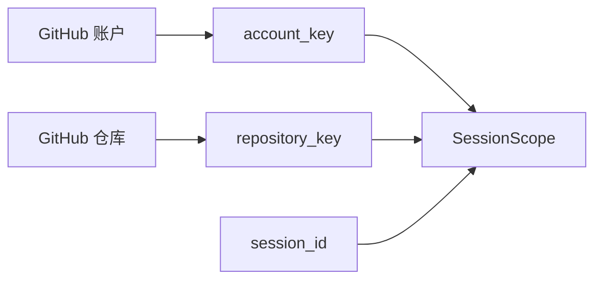

这个 Scope 会被持久化、Memory、Agent Runtime 和恢复逻辑共同使用，所以它属于运行时身份，不只是给模型看的仓库说明。

### 6.1 创建新 Session

创建流程的顺序值得特别注意。

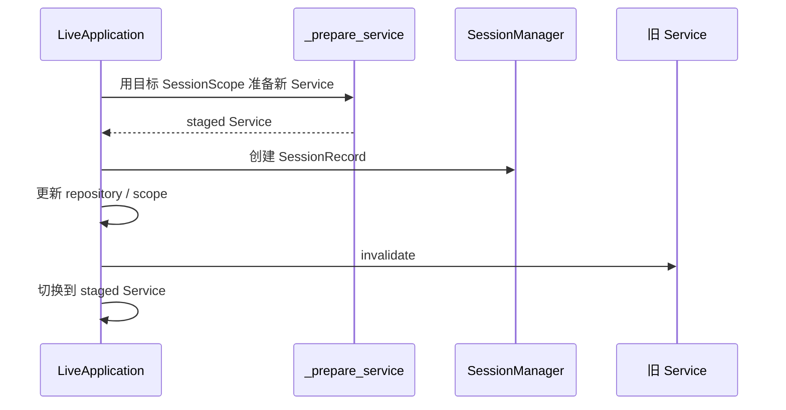

Application 会先准备目标 Service。准备成功以后才创建并切换到新的 Session 运行环境。

### 6.2 恢复或切换已有 Session

恢复和切换的核心思路相同：先找到目标 Session，基于它的 scope 准备新 Service，成功以后再替换当前引用。

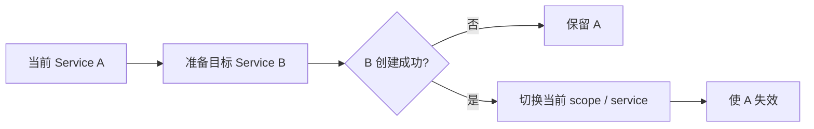

这一顺序的价值在于，目标 Session 如果自身状态或初始化依赖有问题，当前还能工作的 Service 不会提前被破坏。

### 6.3 为什么旧 Service 要 invalidate

切换以后，旧 UI 回调、旧对象引用或异常路径仍有可能持有之前的 Service。

`invalidate` 给 Session Service 增加了一条明确的生命周期边界：旧 Service 失效以后，再有新请求进入会被拒绝。这样同一个进程里不会出现“界面已经切到 Session B，旧 Service A 还在继续接收工作”的混乱状态。

---

## 7. 一次用户输入进入 LiveApplication 后怎样流动

现在进入真正的请求路径。`LiveApplication.handle` 是 CLI 提交普通业务输入时的核心入口。

先看完整顺序。

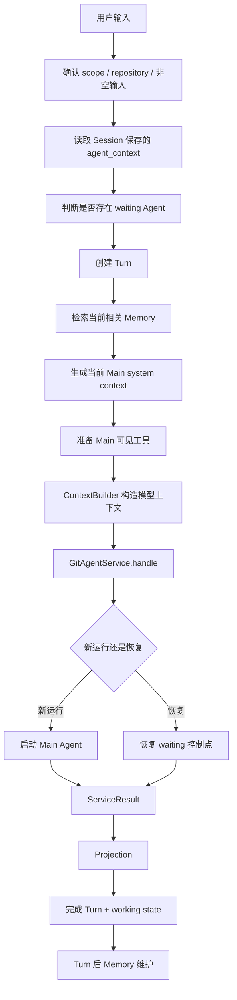

### 7.1 先识别当前输入属于“新任务”还是“继续上一棵运行树”

Application 会读取 Session 中保存的 `agent_context`，并检查里面是否有处于 waiting 状态的 Domain Agent。

这一步发生在创建 Turn 之前，是因为本轮 Turn 需要记录当前输入主要由哪个 waiting Agent 接住。比如上一轮 PR Agent 正在等待用户批准，本轮“可以，发吧”应当继续原 PR 工作流。

### 7.2 无论后面成功与否，都先创建 Turn

识别完 waiting owner 后，Application 调用 `start_turn`。

从这里开始，本次用户输入已经拥有稳定的 Turn 身份。后面即使模型异常、工具异常或用户中断，系统仍然可以把这次尝试记录为失败或中断状态。

这让 Turn 成为真正的业务执行单元，而不只记录成功回答。

### 7.3 构造本轮模型真正看到的上下文

在调用 Service 之前，Application 会先准备三类输入：

1. 当前用户问题和历史消息；
2. 当前 Main Agent 的 system 内容，其中包含仓库身份和相关持久 Memory；
3. 当前 Main Agent 允许看到的工具定义。

随后 `ContextBuilder` 根据上下文窗口限制完成消息构造，并在需要时触发 compaction。

到这里为止，Application 已经把“当前会话事实、当前规则、当前工具”整理成一份模型可用的输入视图。

### 7.4 Service 决定启动 Main Agent 还是恢复旧 Context

`GitAgentService.handle` 会再次读取保存的 Runtime root。

如果没有可恢复 Context，就创建新的 Main `AgentContext` 并启动 Agent Loop。

如果保存的 Context 仍处于有效 waiting 状态，Service 会把本轮构造好的 Main messages 和 tools 更新进去，校验整棵 Context tree，然后从原来的等待点继续执行。

因此用户对审批、草稿修改或补充信息的回复会继续原工作流，不会重新让 Main Agent 从头猜一次任务。

### 7.5 结果先投影，再完成 Turn

Service 返回的是内部 `ServiceResult`。Application 会通过 Projection 提取适合界面和 working state 使用的信息，再调用 `complete_turn` 持久化最终结果。

Projection 主要解决“内部状态很丰富，界面只需要其中稳定的一部分”这个问题。它不会改变 Candidate、Approval、Context 等真实业务对象的权威状态。

### 7.6 异常后为什么可能重建 Service

如果请求已经进入 Service dispatch，随后发生异常或 KeyboardInterrupt，Application 会先把 Turn 标记失败，再尝试重建当前 Session Service。

原因和审批生命周期有关。进程内 Harness 里可能已经产生临时审批或运行状态；一次失败以后继续复用半执行状态，容易让旧授权和新请求混在一起。重建 Service 可以收束这些进程内状态，同时 Session 中已经持久化的 agent context 仍然可以用于后续恢复。

---

## 8. Prompt 系统先解决“Prompt 放在哪里、怎样被可靠地取出来”

讲完 Application 主流程，再来看 Prompt。当前设计把大段 Prompt 文本统一放在 `gitagent/prompts/` 下的 Markdown 文件中，Agent 方法通过模板 key 使用它们。

目录按用途分成几组。

| Prompt 目录 | 主要用途 | 典型消费者 |
|---|---|---|
| `system/` | Agent 角色、工作方式、边界 | Main、Repository、Issue、PR、Coding、Memory Extractor |
| `agents/` | 某个具体子任务的输入说明和输出要求 | Coding、Issue、PR、Context guidance |
| `approval/` | 理解用户对当前 Proposal 的自然语言回复 | `ApprovalIntentClassifier` |
| `reasoning/` | 模型适配层共享的结构化调用说明 | `LLMReasoner` |

### 8.1 文件路径怎样变成模板 key

`PromptLibrary` 会递归读取 `prompts/` 下的 Markdown 模板，跳过 README，然后把相对路径转换成稳定 key。

例如 `system/main.md` 对应 `system.main`，`approval/input.md` 对应 `approval.input`。

Agent 代码只需要引用 key，不需要关心包安装在源码目录还是 wheel 的数据目录中。

### 8.2 静态 Prompt 和动态 Prompt 分开取

没有模板变量的文件通过 `text(key)` 获取。

需要插入动态内容的文件通过 `render(key, ...)` 获取。模板变量使用 `{{name}}` 形式。

两条路径分开以后，静态 Prompt 不会意外接受动态值，动态 Prompt 也必须显式提供自己声明的变量。

### 8.3 render 会严格检查变量

`render` 会检查：

- 模板声明的变量是否全部提供；
- 调用者有没有传入模板没有声明的额外变量；
- 变量值是否为 `None`；
- 模板里有没有残留的不成对双花括号。

替换时只扫描原模板。插进去的 JSON、仓库文本或其他值即使带花括号，也不会被继续当成第二层模板执行。

这一点对包含 JSON 和外部内容的 Prompt 很重要，因为动态数据不会形成新的模板语法。

### 8.4 PromptLibrary 为什么做成进程级缓存

`get_prompt_library()` 会返回进程内共享的 PromptLibrary。首次使用时读取模板，后续 Agent 复用同一份模板集合。

这样每一步 Agent 推理都无需重新扫描 Markdown 文件，所有 Agent 也会看到同一版本的 Prompt。

对应的运行边界也很明确：进程已经启动以后直接修改 Prompt 文件，不会自动让当前进程重新加载；需要重新启动进程才能获得新版本模板。

---

## 9. Prompt 真正进入模型请求时，静态规则和当前上下文怎样组合

PromptLibrary 只负责“加载和渲染模板”。模型最终看到的 system 内容还会根据当前运行上下文继续组合。

Main Agent 是最容易理解的例子。

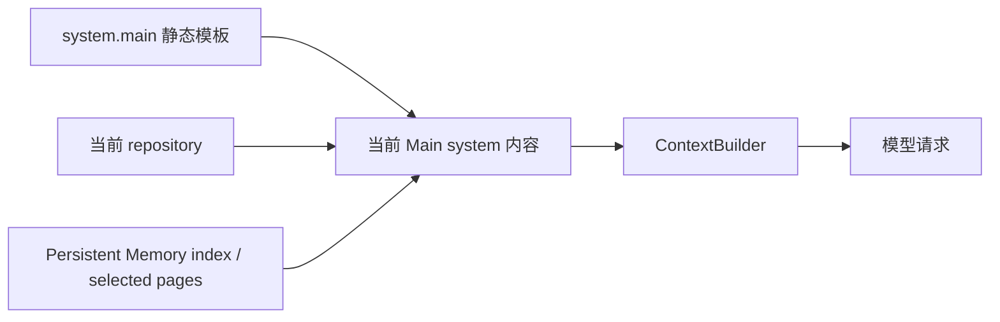

`system.main` 提供稳定的角色和工作规则；当前 repository 告诉模型这一轮正在服务哪个仓库；相关 Memory 提供跨会话保留下来的背景信息。

这三个来源的生命周期不同：

| 内容 | 生命周期 | 谁决定 |
|---|---|---|
| Agent 基础规则 | 应用版本级 | Prompt 文件 |
| 当前仓库 | Session 级 | `LiveApplication` 的 repository / scope |
| 当前相关 Memory | Turn 级动态选择 | `MemorySearch` |

这样组合以后，同一个 Main Agent 角色可以服务不同仓库和不同 Session，同时每轮都得到与当前任务相关的 Memory。

### 为什么恢复 Session 时仍然重新生成当前 system 内容

Session 事件历史保存过去发生过的用户、assistant 和工具消息。每次新请求到来时，Application 重新调用 `current_system`，使用当前版本的基础 Prompt，再加入当前仓库和当前 Memory。

因此升级 Prompt 后，恢复旧 Session 时可以使用新的运行规则；过去的消息事实仍然来自 Event History。历史事实和当前运行规则各自有明确来源。

---

## 10. 为什么 Prompt 文件和 Capability 策略要分开管理

到这里已经清楚 Prompt 是怎样加载和进入模型请求的。现在再讨论设计边界。

Prompt 的强项是帮助模型理解任务语义，例如：当前 Agent 负责什么、什么时候委派 child Agent、怎样组织输出、怎样看待仓库内容。

Capability 和 Runtime Guard 处理的是可执行边界，例如：当前 Agent 能发现哪些能力、参数结构是否有效、某项写操作是否需要 Approval、当前仓库状态是否仍满足执行前提。

可以用三层来理解。

| 层 | 主要问题 | 典型机制 |
|---|---|---|
| Prompt | 模型应该怎样理解任务和选择工作方式 | System / Task / Approval Prompt |
| Schema | 模型产出的调用或分类结果能否被程序稳定解析 | Tool schema、structured output schema |
| Runtime Guard | 这个动作此刻有没有执行资格 | Capability policy、Approval、protected validation、workspace 边界 |

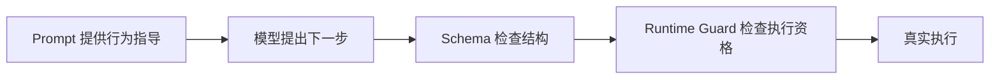

这套分工让 Prompt 可以独立迭代。修改一句角色描述，不会自动改写 Capability 权限；调整 Capability 权限，也无需把完整能力目录复制进每个 Prompt。

### 仓库文本为什么按外部数据处理

GitAgent 会读取 README、源码、Issue、PR 评论等内容。这些文本都可能包含自然语言指令。

Prompt 会告诉模型怎样看待这类内容，运行时还会通过 Capability、Approval 和 workspace 约束限制真实动作。即使仓库文本试图诱导模型执行额外操作，可执行权限仍由运行时机制决定。

这里的核心分工可以记成：**Prompt 降低模型理解偏差，Runtime Guard 控制动作能不能真正发生。**

---

## 11. Approval Intent Prompt：让模型负责理解语言，让 Service 继续掌握工作流

用户面对一个待审批 Proposal 时，回复往往很口语化，例如“可以”“先改短一点”“这个方案具体会动哪里”。程序需要先理解这些话对应什么意图。

`ApprovalIntentClassifier` 会把用户输入和当前 Proposal 上下文填入 `approval.input`，再配合 `approval.system` 交给模型，并要求返回结构化分类结果。

当前分类包括 approve、reject、revise、question 和 ambiguous。

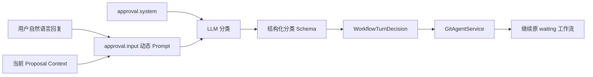

这里要关注职责边界。

Classifier 只产生 `WorkflowTurnDecision`，说明用户当前更接近批准、拒绝、修改、提问还是表达不清。真正的 pending Proposal、精确 Capability 调用和后续执行仍由 Service、Agent Loop、Approval Store 和 Capability 层管理。

如果模型调用失败、返回结构不合法或分类结果无法可信解析，Classifier 会回退到 ambiguous，让系统要求用户表达得更明确。

这样的结果是，语言模糊性可以交给模型处理，执行资格仍然保持在确定性的运行时协议中。

---

## 12. 用一个完整例子把 Application、Config 和 Prompt 串起来

假设用户启动 GitAgent，选择仓库以后输入：**“Review PR #45，先把 review 内容给我看。”**

### 阶段一：启动

CLI 读取指定的 `config.json`。

`RuntimeConfig` 检查字段、执行参数和路径，把相对存储路径解析成绝对路径。

`build_live_application` 校验 Prompt Library，创建模型、GitHub、State、Event、Trace、Memory 和 ContextBuilder，最后得到 `LiveApplication`。

### 阶段二：进入 Session

CLI 先通过 GitHub Token 确认当前账户，再让用户选择或创建 Session。

Application 根据账户和仓库生成 scope，先准备绑定该 scope 的新 `GitAgentService`。准备成功后，当前 Application 切换到这个 Service，并使旧 Service 失效。

### 阶段三：创建 Turn 和模型上下文

用户输入到达 `LiveApplication.handle`。

Application 先读取已有 `agent_context`，确认当前没有需要恢复的 waiting 节点，然后创建新 Turn。

接着检索与这次任务相关的 Memory，取出 `system.main`，加入当前仓库和 Memory，准备 Main Agent 当前可见工具，交给 `ContextBuilder` 形成最终上下文。

### 阶段四：Main 路由到 PR Agent

`GitAgentService` 发现没有可恢复 Runtime，于是启动 Main Agent。

Main Agent 根据 system 规则、用户目标和当前可见 Agent tool，把完整 PR 任务委派给 Pull Request Agent。

PR Agent 再根据自己的 System Prompt、任务 Prompt、Capability 和运行时状态完成证据收集与 review 草稿生成。

### 阶段五：进入 waiting

由于用户要求先看 review 内容，工作流会停在需要用户确认的位置。Service 保存当前 Agent Runtime Context，并返回可展示结果。

Application 通过 Projection 整理输出，完成当前 Turn。

### 阶段六：用户回复“可以，发吧”

这条输入再次进入同一个 `LiveApplication.handle`。

Application 发现 Session 里已有 waiting Agent，新的 Turn 会继续这棵运行树。Service 读取保存 Context，把用户回复交给 Approval Intent Classifier。

Classifier 使用 Approval Prompt 理解“可以，发吧”对应 approve。随后 Service 恢复原 Proposal 的执行流程，运行时审批和 Capability 机制继续检查真正的调用资格。

这个例子把本章三个主题连成了一条线：

**Config 决定运行环境 → Application 负责生命周期和 Session → Prompt 帮模型理解当前角色与语言 → Runtime 继续掌握实际执行协议。**

---

## 13. 这一层的设计取舍

前面的运行链已经体现出一个核心取舍：进程级基础设施尽量共享，Session 相关 Runtime 按 scope 重建。这样可以让模型客户端、GitHub、Persistence、Trace、Memory 等基础设施稳定复用，同时让 Harness、Capability Layer 和 Agent 集合跟随当前 Session 切换，旧 Session 的事件和 waiting Context 仍由持久层保存。

这套组织方式也有成本。`bootstrap.py` 和 `LiveApplication` 会承担较多依赖装配与生命周期协调；Session 切换需要重新创建 Service、Harness 和 Capability Layer；`PromptLibrary` 使用进程级缓存，模板文件在进程运行期间修改后不会自动热加载。Prompt 适合承担模型行为指导，真实权限和副作用资格继续由 Schema、Capability、Approval 等运行时机制控制。

---

## 14. 复习时最容易混淆的几个边界

| 容易混淆的概念 | 应该怎样理解 |
|---|---|
| `config.json` 与 `capabilities.yaml` | 前者提供运行参数，后者是应用携带的 Capability 策略资源 |
| Application 与 Session Service | Application 共享基础设施，Service 绑定当前 Session 运行环境 |
| Service 与持久化 Session | Service 可以重建，Session 的事件和保存 Context 可以继续存在 |
| Prompt 与 Schema | Prompt 帮助模型理解，Schema 约束机器可解析结构 |
| Prompt 与 Runtime Guard | Prompt 提供行为指导，Runtime Guard 决定真实动作是否具备执行资格 |
| System Prompt 与历史消息 | System 内容按当前版本重新构造，历史事实来自 Session Event History |
| Approval Intent 与 Approval 权限 | Intent Classifier 理解用户语言，运行时审批机制继续管理精确 Proposal |
| CLI 与业务 Runtime | CLI 负责输入输出和选择操作，核心请求仍进入 `LiveApplication` / `GitAgentService` |

---

## 15. 一张图复习整章

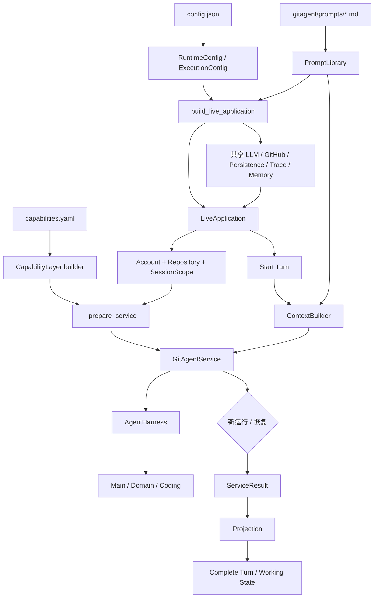

如果只记一句话，可以记成：

**RuntimeConfig 先把外部运行参数整理干净，build_live_application 再创建进程级基础设施；用户进入 Session 后，LiveApplication 为当前 scope 建立 Session Service；每个 Turn 由 Application 组织当前历史、Prompt、Memory 和工具，再交给 Service 启动或恢复 Agent Runtime。**

---

## 16. 代码定位：理解完设计后再回源码核对

| 想核对的设计 | 主要位置 |
|---|---|
| RuntimeConfig / ExecutionConfig 的加载与校验 | `gitagent/application/config.py` |
| Application 总装配 | `gitagent/application/bootstrap.py` 中的 `build_live_application` |
| Session 创建、恢复、切换和 Turn 入口 | `gitagent/application/bootstrap.py` 中的 `LiveApplication` |
| Session Service、waiting 恢复和 Approval Intent 接入 | `gitagent/application/service.py` |
| CLI 怎样读取配置并进入真实 Application | `gitagent/application/cli.py` |
| Capability Layer 怎样从固定资源装配 | `gitagent/application/capabilities.py` |
| Prompt 模板加载、key 和 placeholder 校验 | `gitagent/prompts/library.py` |
| Prompt 文件组织约定 | `gitagent/prompts/README.md`、`gitagent/prompts/` |
| Main System Prompt 怎样加入仓库和 Memory | `gitagent/agents/main.py` |
| Approval Intent Prompt 怎样进入分类器 | `gitagent/application/approval_intent.py` |

下一章进入最后一个问题：前面这些设计怎样被真实评测验证，以及怎样同时观察最终结果、执行轨迹和外部状态变化：[Harness 评测设计](14-evaluation-design.md)。
