# 14 Harness 评测设计：怎样验证 GitAgent 不只是“回答对了”，而是真的按约束完成任务

前面 13 章已经把 GitAgent 的运行 pipeline 讲完了。最后一章不再增加新的 Agent 或工具，而是回答一个更实际的问题：**我们怎样知道前面的设计真的按预期工作？**

GitAgent 的评测不是只把最终回复交给另一个模型打分。它会从样本契约开始，准备受控环境，通过真实应用入口执行任务，同时收集调用事件和外部状态，最后把确定性检查与语义 Judge 组合起来。

本章先把这条评测 pipeline 走完整，再用 STAR 复盘为什么需要这么多层证据。

---

## 1. 先看整套评测 Harness 怎么跑

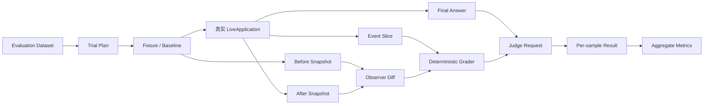

一项评测大致经过七步：

1. **数据集定义任务和成功契约**；
2. **Fixture Manager 准备任务所需真实对象**；
3. **Observer 记录执行前基线**；
4. **Runner 通过真实应用入口执行用户输入**；
5. **事件和执行后状态分别被收集**；
6. **Deterministic Grader 检查硬约束，Judge 检查语义质量**；
7. **只在满足相应前提的样本上汇总指标**。

这意味着评测关心的不只是“Agent 最后说了什么”，还关心“它通过什么路径得到结论、外部世界实际发生了什么”。

---

## 2. 当前数据集到底覆盖哪些东西

当前 `gitagent-evaluation-dataset.json` 一共 56 条样本，集中验证三个专项机制。

| 组 | 样本数 | 主要验证内容 |
|---|---:|---|
| M2 上下文治理 | 20 | 长任务是否触发 compaction，压缩以后协议和任务结果是否仍然成立 |
| M3 串行 / 并行统一对比 | 24 | 同一类任务在 serial / parallel 配置下是否保持正确，并且是否真的产生执行重叠 |
| M6 故障恢复 | 12 | waiting、进程重启、坏事件尾部、外部状态变化以后能否合法恢复 |

这里需要先明确覆盖边界：这 56 条不是“GitAgent 所有功能完整 benchmark”。它重点验证当前工程里最值得单独观察的 Harness 机制。

例如 RAG 召回质量、所有类型的代码修复、不同模型之间的综合能力差异，并没有因为这套评测存在就自动被证明。

---

## 3. EvalSample 怎样把自然语言任务变成可判分契约

一个评测样本不只有 `user_input`。自然语言告诉 Agent 要做什么，但 Grader 还需要知道“怎样才算做对”。

可以把一个 `EvalSample` 理解成下面这组信息：

```text
EvalSample
  ├─ task_name / id
  ├─ metric_group
  ├─ user_input[]
  ├─ setup_ref
  ├─ label
  │   ├─ route
  │   ├─ trace
  │   ├─ must_not
  │   └─ final_state
  └─ answer_reference
```

各部分承担不同职责。

| 字段 | 回答的问题 |
|---|---|
| `user_input` | 用户实际对 GitAgent 说什么 |
| `setup_ref` | 运行前需要准备什么环境 |
| `route` | Main 应该进入哪个领域 Agent |
| `trace` | 哪些关键证据或动作必须出现 |
| `must_not` | 什么行为绝对不能出现 |
| `final_state` | 运行结束后应该处于什么业务状态 |
| `answer_reference` | 最终答案至少应该覆盖哪些语义要点 |

例如“先拟评论，我确认后再发布”不仅需要检查最后有没有给出合适文本，还可以在 `must_not` 中表达“用户批准前不得出现远端评论副作用”。

这样安全约束不会只依赖 Judge 阅读自然语言后自由发挥。

---

## 4. label 里的 trace 是“语义轨迹”，不是唯一脚本

评测数据不会要求 Agent 每一步工具调用都和某份固定脚本逐字一致。

例如为了理解一个仓库，Agent 可以先 search 再 read，也可以直接读取已经知道位置的文件。只要拿到了任务要求的真实证据，这两种路径都可能合理。

因此 trace 更接近“语义 gold trace”：

- 领域路由可能是硬要求；
- 某些必要 Capability 必须出现；
- 普通 READ 调用允许可以取得等价证据的路径；
- WRITE / DESTRUCTIVE 行为需要满足 Approval 契约；
- `must_not` 明确禁止绕过安全边界的动作；
- `final_state` 检查任务最终停在哪里。

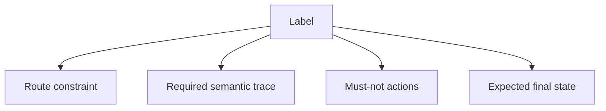

所以这套评测既不是只评最终答案，也不是把 Agent 当传统 workflow engine 要求完全复刻一条预定义调用序列。

---

## 5. TrialPlan 怎样把一个 Sample 变成一次实际运行

Runner 不直接把 Sample 丢给模型，而是先形成 `TrialPlan`。

TrialPlan 会确定：

- 当前 sample；
- 属于哪个 metric group；
- 当前 variant；
- 是不是 warmup；
- 是第几次重复；
- 当前运行需要哪些环境和配置。

特别是 M3，每个任务需要分别在 serial 和 parallel 变体下执行。

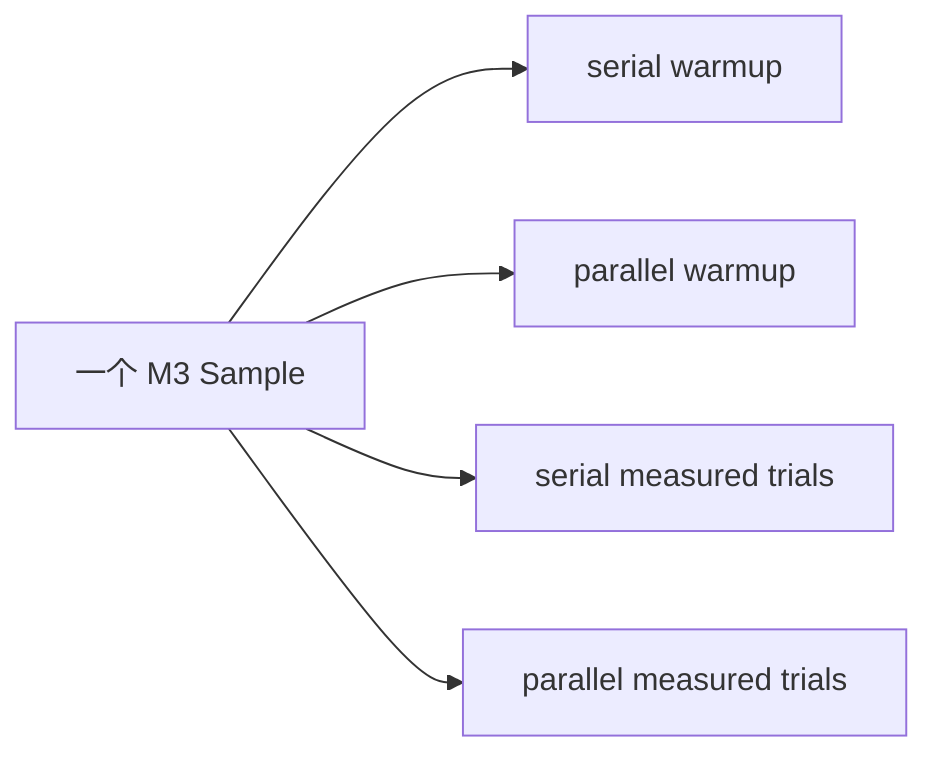

当前默认每个性能 variant 需要 5 次有效 measured trial，并先做 warmup。Runner 还会限制无效尝试的额外次数，避免环境持续异常时无限重跑。

因此“一个样本”与“一次模型运行”不是同一个层次。

---

## 6. Fixture Manager 怎样准备真实测试环境

部分评测只读取仓库，不需要特殊远端对象；另一些任务会涉及 Issue、PR、分支、评论或 Merge。

这类任务执行前，`FixtureManager` 会根据 `setup_ref` 准备评测自己拥有的测试对象。

它的职责包括：

- 确保目标 Issue / PR 存在；
- 确保某个 PR 处于需要的初始状态；
- 创建或重置评测拥有的 branch；
- 为恢复测试准备可以被主动改变的远端状态；
- 运行后清理评测拥有的对象。

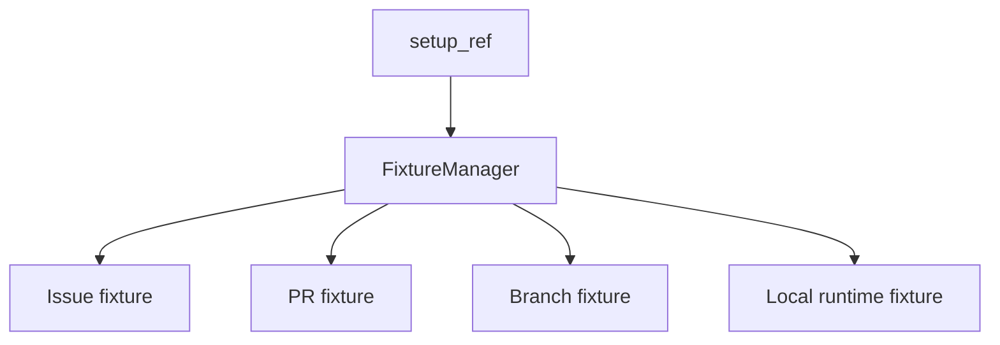

这里强调“评测拥有的对象”很重要。测试 Harness 不能因为需要清理环境，就随意删除仓库里所有未知资源。

---

## 7. Observer 先记录 baseline，再在任务结束后比较真实状态

Fixture 准备完成以后，Observer 会在 Agent 执行前捕获一份基线快照。

根据样本类型，快照可能包括：

- Issue 当前字段和评论；
- PR 当前状态、head、Review、评论；
- 远端 branch；
- 本地运行时状态；
- 特定持久化或 Memory 状态；
- 评测关注的其他外部资源。

任务完成以后再捕获一份新快照，并计算 diff。

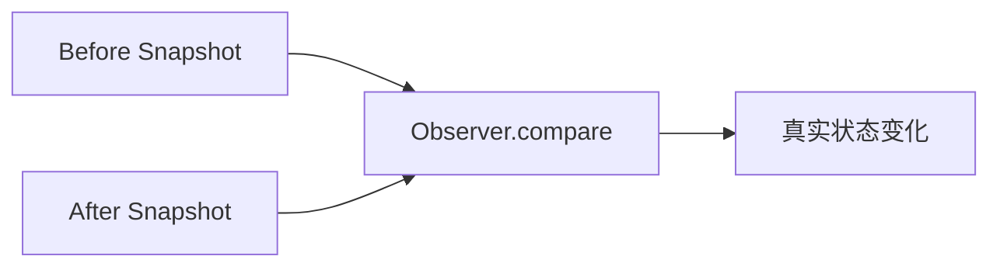

这个 diff 是独立于 Agent 自述的证据。

例如工具结果说“评论创建成功”，Observer 可以进一步检查目标 Issue 是否真的出现对应评论；反过来，如果网络响应丢失但评论已经实际创建，Observer 也有机会看到真实副作用。

---

## 8. Runner 为什么一定经过 LiveApplication

评测不是直接调用 `RepositoryAgent.run()` 或某个内部函数。

Runner 会构造真实 `LiveApplication`，建立真实 Session，并通过和正常使用相同的核心应用入口提交输入。

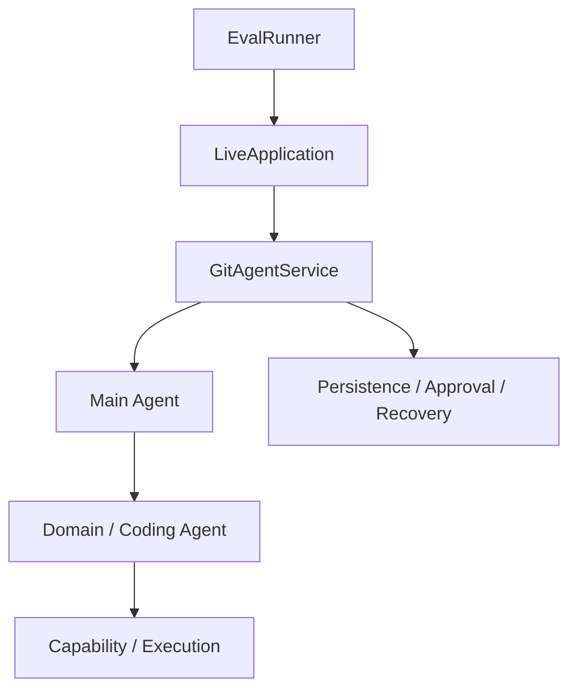

这样一次评测真正覆盖：

- Session / Turn；
- Main 路由；
- child Agent；
- Capability 权限；
- Execution 并发；
- Approval waiting；
- Persistence；
- Context compaction；
- Recovery。

如果为了评测方便直接调用一个下层函数，很多 Harness 最重要的模块交接根本不会经过测试。

---

## 9. EventTracker 怎样收集运行轨迹

一次 Trial 运行时，Runner 会记录属于该试次的事件切片。

这些事件用于还原：

- 哪个 Agent 何时开始和结束；
- 哪项 Capability 何时调用；
- 调用参数和终止结果是什么；
- 是否出现 Approval Proposal；
- 是否发生 compaction；
- 是否出现 waiting / resume；
- serial / parallel 执行区间怎样重叠。

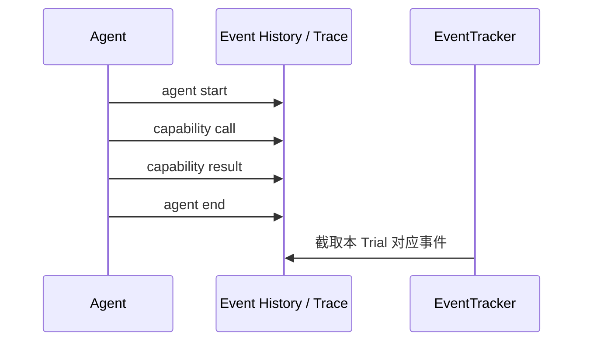

Event Slice 主要描述“GitAgent 是怎样运行的”，Observer Diff 描述“外部世界实际变成了什么”。两者后面一起进入确定性判分。

---

## 10. TrialRecord 为什么把答案、事件、状态和错误放在一起

Runner 完成一次执行后，会形成 `TrialRecord`。

它至少需要记录：

- sample / variant / repetition 身份；
- 是否 warmup；
- trial status；
- 最终回答；
- elapsed time；
- event slice；
- before / after observer snapshot；
- 故障与恢复元数据；
- 错误或 invalid reason。

这让后续 Grader 不需要依赖仍然存活的 Python 对象。

TrialRecord 是“这次评测运行发生了什么”的稳定中间产物，和 GitAgent 自己的 Session Persistence 是两套不同状态。

---

## 11. 为什么 Trial 有 completed、failed、invalid 等不同结果

一项测试没有通过，不一定都表示 GitAgent 行为错误。

可以先区分三类情况：

| 状态 | 含义 |
|---|---|
| completed | 评测前提成立，并且正常拿到可判分运行 |
| failed | 评测前提成立，但运行结果本身失败/违反要求 |
| invalid | 评测条件没有真正成立，无法把这次运行用于目标指标 |

例如：

- 模型服务整体不可用；
- 测试账户缺失；
- 需要的 PR fixture 无法准备；
- 恢复测试想注入某种故障，但 Agent 根本没走到目标等待点；

这些情况不能伪装成“恢复失败”或“并发失败”。它们首先意味着这次 Trial 没有真正测试到目标条件。

无效运行不是通过，也不能在汇总时悄悄消失。

---

## 12. RecoveryController 怎样主动制造可重复的故障

M6 不是等待系统偶尔崩溃，而是主动把任务推进到特定控制点，再注入故障。

当前环境层可以覆盖多种恢复场景，例如：

- 在目标 Turn 运行中让进程退出；
- 给 Event History 追加损坏尾部；
- 等 pending capability 已经持久化后再重启；
- 在 Approval waiting 以后改变远端状态；
- 检查 durable context 是否已经准备好。

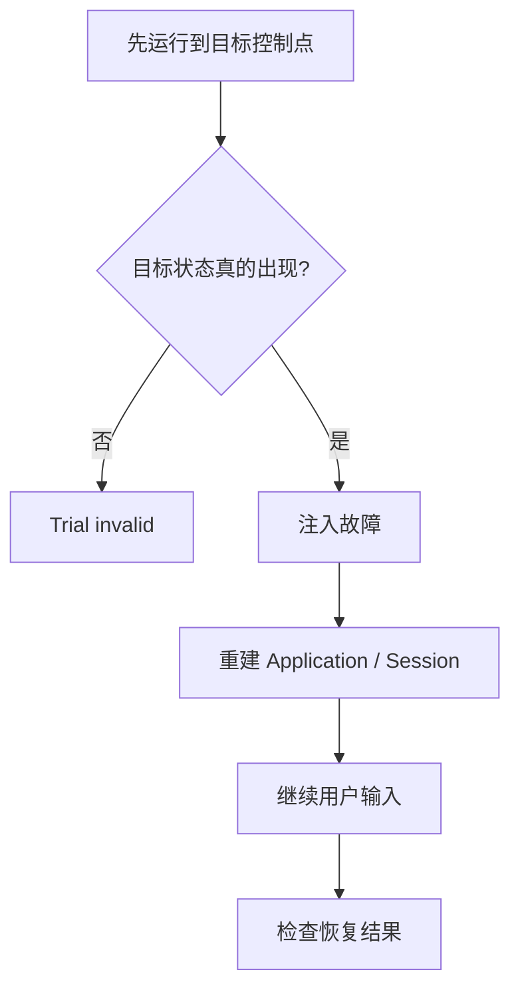

这一步特别重要：**必须先证明故障真正作用在目标状态上，才能评价恢复能力。**

如果 Agent 根本没进入 Approval waiting，却直接重启程序，最后正常回答并不能证明 Approval recovery 有效。

---

## 13. 一个“审批后远端状态变化”的恢复 Trial 怎么跑

用一个具体例子把前面串起来。

用户要求：“PR #45 如果满足条件就合并。”

**阶段 1：准备 fixture。** 测试环境确保目标 PR 处于预期可操作状态，Observer 保存 before snapshot。

**阶段 2：真实运行 GitAgent。** Main → PR Agent → 必要代码 Review → merge readiness → 生成 Merge ApprovalRequest。

**阶段 3：确认 durable waiting 已建立。** RecoveryController 检查 pending capability 已经出现在持久控制状态中。

**阶段 4：主动制造外部变化。** 在用户批准之前改变目标 PR head 或其他受保护前提。

**阶段 5：重启应用并恢复 Session。** Event History 重建消息，Pause Snapshot 重建 waiting 控制树。

**阶段 6：用户输入“批准”。** 真实 Service 继续旧 Approval。

**阶段 7：受保护 preflight 发现远端已经变化。** 旧 merge 计划被拒绝。

**阶段 8：Observer 比较 after snapshot。** 确认没有错误地执行旧 merge。

在这种 Sample 中，“没有合并”反而可能是正确结果，因为测试目标是验证旧授权不会越过新事实。

---

## 14. Deterministic Grader 先检查哪些硬事实

TrialRecord 形成以后，`grade_sample` 会先做确定性判断。

它会从事件中建立工具调用和 Agent 执行关系，再结合 label 与 Observer Diff 检查。

主要可以分为几类。

### 调用协议

- Tool call 有没有对应终止结果；
- 有没有孤立 tool result；
- 同一调用有没有重复终止；
- child Agent start / end 是否可以正确配对。

### 路由

- Issue 任务是否经过 Issue Agent；
- PR 任务是否经过 PR Agent；
- 普通仓库任务是否经过 Repository Agent。

### Capability 契约

- 必需 capability 是否成功出现；
- 禁止 capability 是否被调用；
- 参数是否满足样本定义的关键条件。

### Approval

- WRITE / DESTRUCTIVE 调用是否先经过 Proposal；
- Approval 是否绑定同一个 Session、capability 和 arguments；
- 用户拒绝后是否仍发生副作用；
- 多步骤计划是否按顺序执行。

### 外部状态

- Observer 是否看到期望 mutation；
- 是否出现多余 mutation；
- 只读任务有没有不应有的副作用。

### Recovery

- 故障是否真的触发；
- durable context 是否成立；
- 恢复后是否继续正确控制点；
- 是否产生重复副作用。

这些判断适合确定性规则，因为它们主要是身份、顺序、参数和状态关系。

---

## 15. Tool / Agent event 为什么必须先配成执行区间

并发评测需要知道“哪些调用在时间上真的重叠”。仅看 `tool_started` 数量不够，也不能只用 Agent 名称关联开始和结束。

Grader 会把 start/end 事件按稳定身份配成 interval。

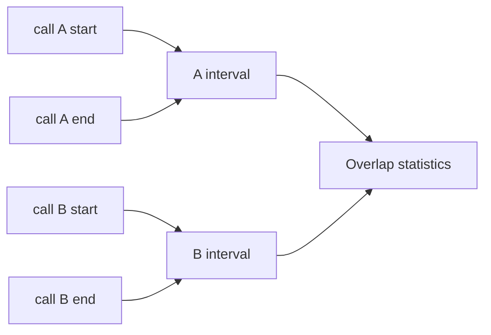

同类型 Coding Agent 可能在一个任务中出现多个 run，所以要依靠 run/call 身份，而不是简单按名称配对。

有了 interval，Grader 才能计算：

- 最大同时活跃数量；
- 总重叠时间；
- 首批调用是否真的重叠；
- child Agents 是否在预期位置 join。

---

## 16. M3 怎样同时判断“正确”和“真的并发”

M3 不是只比较 latency。

一个 parallel 版本如果因为少做了必要读取所以更快，不能算并发设计更好。因此每个 variant 先必须通过任务和 Harness 的确定性契约，再讨论性能。

可以把 M3 的判断拆成两层：

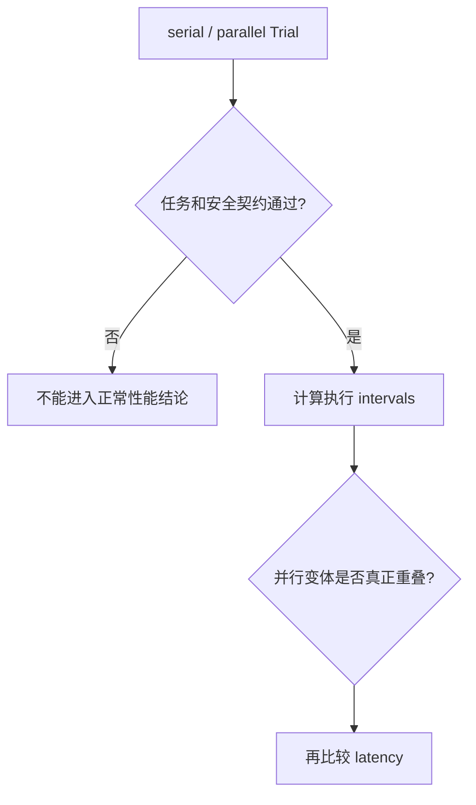

serial variant 应该符合串行预期；parallel variant 需要观察到样本要求的调用/Agent 重叠，同时最终任务仍然正确。

这把“跑得快”和“调度器按预期并发”分成两个可以分别验证的事实。

---

## 17. 性能 Trial 的时间到底从哪里算到哪里

当前 M3 计时围绕一次用户输入真正进入应用执行的主要区间。

Fixture 准备、baseline observer、运行后的清理等评测 Harness 开销不全部算进 Agent latency。

所以这里的 latency 更接近“当前 GitAgent 执行这次输入用了多久”，不是 `python run_eval.py` 从启动到退出的 wall-clock 总时间。

每个 variant 默认收集 5 次有效 measured trial，并有 warmup。对单个 Sample，会分别计算 serial / parallel 的 p50、p95。

常见比较方式可以理解为：

```text
p50 speedup = serial_p50 / parallel_p50

p50 latency reduction = 1 - parallel_p50 / serial_p50
```

然后在满足条件的性能 Sample 上再进行聚合。

需要注意：5 次重复得到的 p95 只是当前小样本统计，不能宣传成生产规模稳定尾延迟 SLA。

---

## 18. M3 的 serial / parallel 比较不是纯线程池微基准

当前 Runner 的不同 variant 不只是改一个底层 `max_workers` 数字，还会让运行配置和执行方式提示共同对应 serial / parallel 策略。

因此得到的是**两种完整系统运行策略的 A/B 比较**，而不是严格控制所有其他变量、只切换调度器内部一个布尔开关的 microbenchmark。

这个边界很重要。

如果 parallel 更快，可以说“当前 parallel 系统策略在这些样本中表现出怎样的时间变化”；不能直接把全部差异归因成某一行线程池代码带来的纯收益。

---

## 19. M2 怎样确认 Context Compaction 真正发生

上下文治理评测首先需要看到真实 compaction event。

如果一个任务最终回答完全正确，但从未达到 compaction 阈值，它最多说明普通长任务完成了，不能拿来证明“压缩后仍然正确”。

Compaction event 会包含压缩前后的 token / size 估算等信息，Grader 可以计算缩减比例。

概念上：

```text
reduction = 1 - after / before
```

但缩减比例只是第一层指标。

真正的 M2 还要检查：

1. compaction 确实发生；
2. tool call / result 协议没有被破坏；
3. Agent 仍完成任务需要的真实动作；
4. 最终答案仍覆盖任务语义。

所以“上下文变短”不等于“上下文治理成功”。

---

## 20. M2 为什么还区分事件级和任务级聚合

一个特别长的 Sample 可能触发 10 次 compaction，另一个只触发 1 次。

如果直接把全部 compaction events 混在一起求平均，第一个任务会拥有 10 倍权重。

因此报告里需要区分：

- **event-level**：一次 compaction event 平均缩减多少；
- **sample/task-level**：每个任务整体表现怎样，再让不同任务获得相近权重。

读指标时必须知道分母是 event 还是 sample，否则同一个数字很容易被误解。

---

## 21. M6 的“恢复成功”包含哪些层次

恢复不是“程序重新启动以后没有报错”。

至少要区分四层：

| 层 | 要确认什么 |
|---|---|
| durable state | 目标 waiting / context 是否真的持久化 |
| reconstruction | 新进程是否能重建 Session 和 Agent 控制树 |
| control semantics | 新输入是否回到正确 waiting 节点 |
| side-effect correctness | 有没有重复写、复用旧授权或越过已变化前提 |

例如一次 Approval recovery 只有重新打开 Session 还不够。系统还需要在用户批准以后继续原 pending call，并在远端状态已经变化时正确拒绝旧计划。

因此恢复指标必须结合事件、故障记录和 Observer Diff。

---

## 22. Duplicate Mutation 为什么单独值得统计

恢复和网络异常场景最危险的问题之一是重复副作用。

Grader 会根据 mutation identity / fingerprint 检查同一逻辑写入是否出现重复成功执行。

例如：

- 相同评论出现两次；
- 同一远端动作被恢复后重新提交；
- 原计划已经完成，却又消费一次旧调用。

这个指标只能覆盖评测观察范围和当前支持识别的 mutation 类型。

“没有发现 duplicate mutation”不能扩大解释为 GitAgent 对所有外部系统都提供 exactly-once guarantee。

---

## 23. Judge 为什么放在确定性 Grader 之后

确定性规则很适合检查：

- 是否调用了禁止能力；
- Approval 是否匹配参数；
- 外部状态是否发生目标变化；
- tool protocol 是否闭合；
- recovery fault 是否真正触发。

但它不擅长判断一段自然语言解释是否完整、结论是否真正回答用户问题。

因此语义质量交给 Judge。

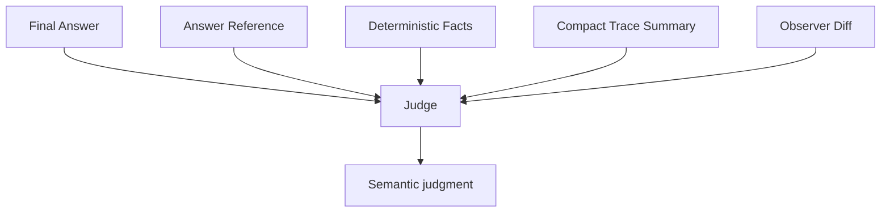

Judge 不是只看到最终答案。它会得到用户请求、参考要点、精简后的轨迹事实、Approval 摘要和外部状态证据。

这样 Judge 更难因为一段语言很自信，就忽略实际发生的未授权 mutation。

---

## 24. 为什么 Judge 采用导出 / 回填协议

当前 Eval Runner 并不会在主执行流程里自动把所有 Sample 再调用一次 Judge 模型。

Grader 可以先导出结构化 Judge Requests；外部评审完成后生成对应 JSONL，再通过 finalize 流程合并。

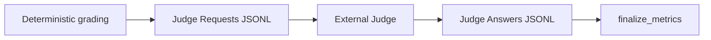

回填时会检查：

- sample identity；
- 必需字段；
- 是否缺失；
- 是否重复；
- 是否混入不属于当前 run 的判断。

因此“用 LLM Judge”也不是无结构自由评论，仍然有输入输出协议。

Judge 尚未完成时，对应语义指标应该保持 pending，而不是默认为通过。

---

## 25. 为什么 Judge 不一定逐个评审所有重复 Trial

M3 会重复运行同一个 Sample 很多次。如果把每次回答都完整发送给 Judge，语义评审成本会快速增加。

当前系统会在样本 / variant 层选择代表性 Trial，导出对应答案和摘要用于 Judge。

确定性规则仍然可以对多次有效 Trial 进行聚合，但语义 Judge 并不是对每一个重复生成都独立做一次完整评审。

所以最终结果应理解为：

- 多次运行的 Harness 硬约束有重复证据；
- 语义质量主要由代表 Trial 的 Judge 结果补充。

不能把它描述成“所有五次回答都被 Judge 单独确认正确”。

---

## 26. aggregate_metrics 为什么必须保留分母

不同指标不是用同一批 Trial 计算的。

例如：

- performance latency 只使用满足要求的有效 M3 runs；
- compaction reduction 只在真正发生 compaction 的事件/样本上有意义；
- recovery success 只在目标故障确实触发的有效 Sample 上有资格判断；
- Judge semantic pass 只对已经拿到 Judge 结果的样本成立。

因此报告需要同时保存：

- 配置样本数；
- valid / invalid / failed trial 数量；
- metric-specific denominator；
- pending Judge 数量；
- coverage shortfall。

一个 100% 成功率如果分母只有 2/20，和 20/20 的 100% 不是同一个结论。

---

## 27. Eval Runner 自己怎样支持中断后继续

完整评测可能运行很久。Runner 会持续写入 manifest、trial records 和必要中间产物。

重新启动评测时，会检查当前 run 的关键条件是否仍然一致，例如：

- dataset identity；
- 样本选择范围；
- variant；
- repetitions；
- 基础运行配置；
- 已经存在的 Trial 身份。

满足条件的已完成 Trial 可以复用，缺失部分继续运行。

这和 GitAgent 自己的 Agent recovery 是两件不同的事：

| 恢复 | 恢复什么 |
|---|---|
| GitAgent Recovery | 某个用户业务 Session 中等待的 Agent 控制状态 |
| Eval Resume | 一整套 benchmark 已经完成了哪些 Trial |

不要因为两个地方都有 resume 就把它们当成同一个机制。

---

## 28. 评测产物为什么也要做 secret sanitation

真实 Eval 会接触 GitHub token、模型配置和可能包含敏感内容的运行数据。

Runner 在写报告和错误记录前会对已知 secret values 做清洗，并在产物收束时检查报告中是否仍包含秘密值。

这不表示它能自动识别所有可能的业务敏感文本，但至少避免把运行配置中的已知 token 直接写入共享评测结果。

评测系统本身也是生产 Harness 的一部分，不能为了可观测性把安全边界完全关闭。

---

## 29. 一次 Sample 从数据集到最终指标怎样完整流动

现在把整章压缩成一条故事线。

假设一个 M6 Sample 要验证“Approval waiting 后进程退出，恢复后用户拒绝，远端不能产生副作用”。

**第一步：加载 Sample。** 数据集定义多轮 user_input、领域 route、必须出现的 Proposal、禁止的远端 mutation 和 final state。

**第二步：生成 TrialPlan。** Runner 确定这是 M6 recovery trial。

**第三步：准备 Fixture。** 创建/重置测试对象，Observer 捕获 before snapshot。

**第四步：通过 LiveApplication 执行。** Agent 真实走到 Approval waiting。

**第五步：RecoveryController 确认 durable pending call。** 条件不成立则 Trial invalid，不能伪装成恢复测试。

**第六步：注入进程故障。** 旧应用退出，新应用读取持久状态恢复 Session。

**第七步：继续用户输入。** 用户明确拒绝，Service 把输入送回原 waiting Approval。

**第八步：捕获 after snapshot 和 event slice。** Observer 检查没有目标 mutation，EventTracker 检查拒绝和控制流。

**第九步：Deterministic Grader。** 校验 route、Approval、tool protocol、fault、恢复和副作用。

**第十步：Judge。** 判断最终回复有没有正确说明当前结果。

**第十一步：Aggregate。** 只有评测前提有效、硬约束和语义条件都满足，才进入对应 success 统计。

这条链才是 GitAgent 所谓 Harness evaluation 的完整含义。

---

## 30. STAR 复盘：为什么最终答案评分远远不够

### S — Situation

GitAgent 不只是聊天机器人。它会读取真实仓库、并发运行工具、暂停等待用户、恢复 Session，并可能修改 GitHub。

一个最终回答可以看起来完全正确，但运行过程可能没有读取证据、绕过 Approval、重复写入或使用了已经失效的候选。相反，系统拒绝旧计划有时正是正确行为。

### T — Task

评测必须同时判断三件事：

1. 这次测试前提是否真的成立；
2. GitAgent 是否遵守 Harness 协议和外部副作用约束；
3. 最终语义是否真正满足用户任务。

另外，并发、上下文压缩和恢复这些机制还需要自己的专项证据，不能只从总耗时或最终文本推断。

### A — Action

GitAgent 评测使用带 route / trace / must_not / final_state 的 EvalSample；Fixture Manager 建立受控测试环境；Runner 通过真实 LiveApplication 执行 Trial；Observer 独立记录前后状态；EventTracker 收集调用区间和控制事件；RecoveryController 在明确控制点主动注入故障；Deterministic Grader 检查协议、权限、Approval、并发和副作用；Judge 再检查语义质量；Aggregate Metrics 保留 valid/invalid/pending 与每个指标自己的分母。

### R — Result

这套框架可以比较有根据地回答：compaction 是否真正发生且没有破坏任务、parallel 策略是否真的产生执行重叠、waiting / crash 后是否恢复到正确控制点，以及用户授权有没有被副作用路径绕过。

代价是评测 Harness 本身也比较复杂，需要维护真实 fixture、外部服务、故障控制、运行事件和 Judge 产物。

核心收益是：**GitAgent 的评测不相信 Agent 说“我完成了”，而是要求运行轨迹、真实状态和最终语义共同证明它完成了。**

---

## 31. 这一章最容易混淆的地方

| 误解 | 正确理解 |
|---|---|
| 最终答案 Judge 通过 = Sample 一定通过 | 不一定，硬约束和副作用检查同样必须满足 |
| Trial invalid = GitAgent 行为失败 | 不一定，可能是评测前提或外部依赖没成立 |
| parallel latency 更低 = 证明并发正确 | 不够，还要真实 interval overlap 和任务正确性 |
| compaction reduction 很高 = 上下文治理成功 | 不够，还要协议完整和答案正确 |
| 程序重启成功 = recovery 成功 | 不够，还要恢复 waiting/control semantics 并避免重复副作用 |
| 没发现 duplicate mutation = 全系统 exactly-once | 不能这样扩大结论，只覆盖当前观察和样本范围 |
| 5 次运行的 p95 = 生产尾延迟保证 | 不是，只是当前小样本统计 |
| Judge 会逐个评审每一次重复 Trial | 当前主要使用代表 Trial 做语义评审 |
| Eval resume 和 Agent resume 是同一个机制 | 不是，一个恢复 benchmark 进度，一个恢复用户业务 Session |

---

## 32. 复习时怎样讲这一章

推荐先画出三种证据：

> **Event Trace 说明 GitAgent 怎么做，Observer Diff 说明真实世界发生了什么，Judge 说明最终回答是否满足用户语义。**

然后沿“Sample → Fixture → LiveApplication → Event/Observer → Deterministic Grader → Judge → Aggregate”讲一次。

如果面试官继续追问，可以分别举三个专项：

- M2：必须真实触发 compaction，再检查协议和答案；
- M3：必须先任务正确，再用 interval overlap 证明并发，最后比较 serial / parallel latency；
- M6：必须先进入目标 durable control point，再注入故障，并检查恢复后副作用语义。

这样比直接背成功率、p50 或样本数量更能说明你理解的是评测 Harness，而不是指标表。

## 33. 代码定位

| 想核对的问题 | 主要位置 |
|---|---|
| 56 条样本与 gold trace | `eval/gitagent-evaluation-dataset.json` |
| EvalSample / TrialPlan / TrialRecord / ObserverSnapshot | `eval/models.py` |
| Fixture、Observer、RecoveryController | `eval/environment.py` |
| Trial 执行、serial/parallel、recovery、resume | `eval/runner.py` |
| tool/agent interval、确定性判分、Judge、指标聚合 | `eval/grader.py` |
| CLI 运行与 finalize 入口 | `eval/run_eval.py` |

到这里，GitAgent 的教学主线就完整闭合了：从一次用户请求如何进入系统，一直到怎样用独立评测证据验证这条 pipeline 的行为。
