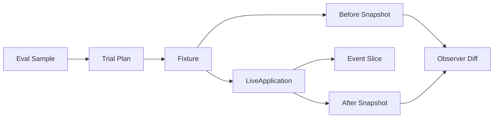
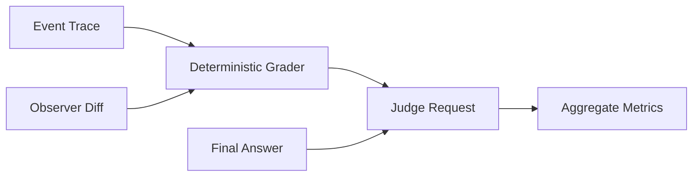
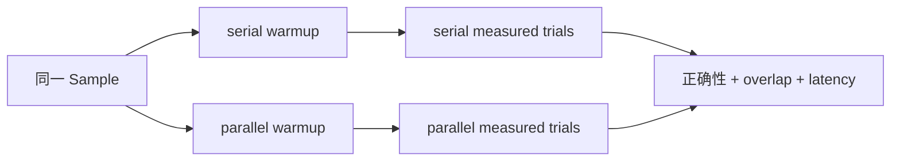
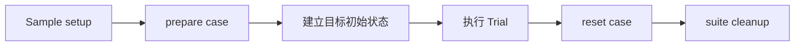
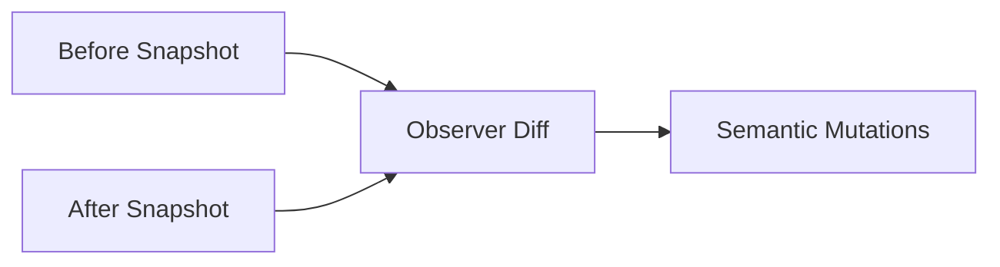
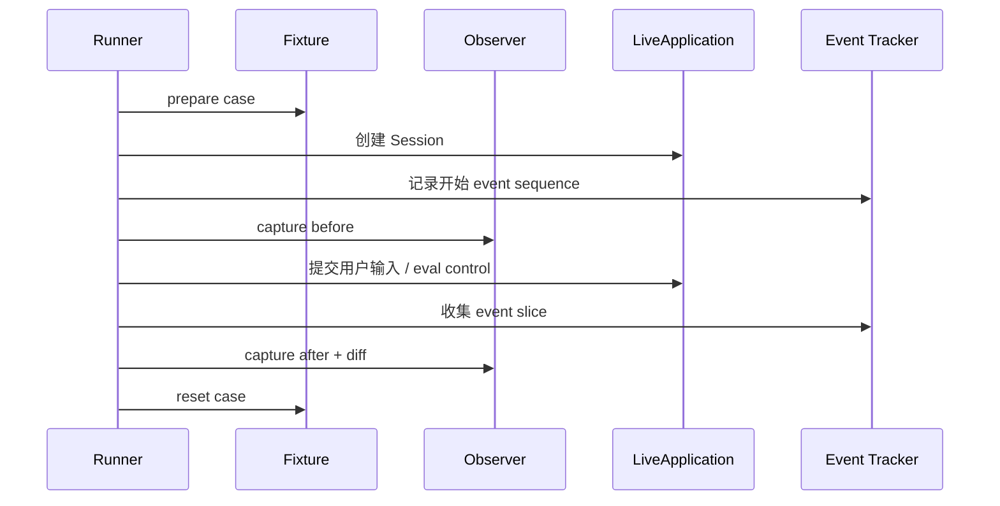
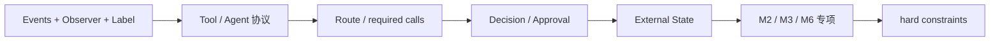
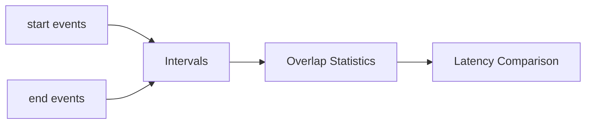
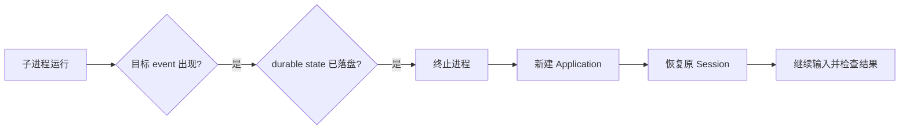
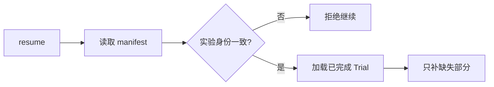

# 14 Evaluation Harness：GitAgent 的评测系统怎样验证真实运行

前面章节分别解释了 Agent、Capability、并发、Approval、恢复和 Context。本章回答最后一个工程问题：这些机制怎样被系统化验证。

GitAgent 的评测不只看最终回答。一个任务可能“文字答对了但越权写入”，也可能“内部 trace 看起来成功但 GitHub 实际没变化”。因此 Evaluation Harness 会同时收集运行轨迹、真实外部状态和最终语义结果，再把适合程序判断的事实与需要语义判断的部分分开评分。

---

## 1. 一次评测分成“真实运行”和“分层判分”两段

真实运行阶段：

判分阶段：

这套 Harness 主要依赖三种证据：

| 证据 | 最擅长回答的问题 |
|---|---|
| Event Trace | Agent 怎么路由、调用了什么、Approval/compaction/并发是否真实发生 |
| Observer Diff | GitHub 或本地仓库最后实际发生了什么变化 |
| Final Answer + Judge | 最终解释在语义上是否完成用户任务 |

Deterministic Grader 位于中间，先把身份、参数、顺序、外部状态和时间区间这些硬事实判完，再让 Judge 只补语义判断。

---

## 2. Dataset 先把自然语言任务变成可判分契约

一条用户输入只能说明“想做什么”，评测还需要知道正确 route、必须出现的关键证据、禁止行为、最终外部状态和回答要求。

当前数据集固定有 56 个样本，分成三个专项：

| 组 | 数量 | 主要验证内容 |
|---|---:|---|
| M2 | 20 | Context compaction 后任务和工具协议是否仍正确 |
| M3 | 24 | serial / parallel 两种完整策略的正确性、真实 overlap 和 latency |
| M6 | 12 | waiting、进程退出、日志损坏、外部状态变化等恢复场景 |

加载数据集时会校验 schema 版本、根字段、样本数量、sample key 与 task/id 对应关系，以及 metric group 是否属于支持集合，避免 benchmark 本身先处于不可解释状态。

每个 Sample 除了真实用户输入，还包含 setup reference、metric group 和一组 label：

| Label | 作用 |
|---|---|
| route | 预期经过哪些 Agent |
| trace | 必须出现的关键语义步骤或 Capability 证据 |
| must_not | 明确禁止出现的行为 |
| final_state | 执行后真实状态应该满足什么 |
| answer_reference | 最终回答应该覆盖哪些要点 |

其中 trace 是 **semantic gold trace**，不是逐行脚本。例如仓库调查可以要求“必须进入 Repository Agent、必须得到某类代码证据、禁止写操作”，但不要求模型严格按某个固定 READ 顺序运行。

这样既保留 Agent 的合理行动空间，又能让安全条件和最终状态有明确检查点。

---

## 3. Trial Plan 把“一个任务”展开成“具体实验运行”

Dataset 中一条 Sample 不一定只运行一次。

M2 通常按正常配置运行一次；M3 必须把同一任务分别跑 serial 和 parallel，并做 warmup 和多次 measured trial；M6 某些样本则需要专门的故障注入流程。

因此 Trial Plan 会固定：sample、metric group、variant、replicate、是否 warmup，以及当前评测账户。后面的事件、Observer 和结果都围绕这个 trial identity 保存。

### 3.1 M2

使用正常运行配置，让真实任务自然积累上下文并观察 auto compaction 是否发生。没有真实 compaction 的运行，不能证明“压缩以后仍然正确”。

### 3.2 M3

同一个 Sample 生成 serial / parallel 两个 variant。

当前默认目标是每侧收集 5 次有效 measured trial。两种 variant 的先后顺序会交替，减少固定执行顺序带来的偏差；环境无效时允许有限额外尝试，但不会无限重跑。

### 3.3 M6

根据恢复场景选择专用执行方式，例如：先形成 durable pending approval 再终止进程；制造 Event Log 尾部损坏；在自然 compaction 后重启；或在 Approval waiting 期间让第二账户修改远端状态。

Trial Plan 的意义是把“任务定义”和“实验怎么跑”分开。同一个 M3 Sample 可以共享相同任务契约，只让 variant 改变运行策略，而不维护两套近似数据集。

---

## 4. 每个实验使用隔离的 Runtime Config

Eval 会真实访问模型、GitHub、SQLite、Event Log 和 Memory。如果不同 Trial 共用同一运行目录，Session 和持久状态会互相污染。

Runner 会从基础配置派生评测配置，保留真实模型/GitHub 连接，同时把 state、event、memory 路径指向当前 run 的隔离目录，并统一把模型 temperature 设为 0。

M3 的三个主要 variant 是：

| variant | 运行策略 |
|---|---|
| normal | 保留正常 execution 配置 |
| all_serial | Capability、Provider、Domain Agent 相关并发都收紧为 1 |
| all_parallel | 提高 Domain Agent 并发，其余按基础并发配置运行 |

此外 M3 会给 serial / parallel 输入附加非常短的执行方式提示，要求独立工作逐个或同时发起。因此 M3 比较的是两种**完整系统运行策略**，不应把最终 speedup 解释成某一个线程池参数的纯微基准收益。

---

## 5. Fixture Manager 先把外部世界准备到可测试状态

很多样本依赖真实 GitHub 对象。如果 Issue、PR、branch 或 Review 条件不对，本次 Trial 即使失败，也无法判断是 GitAgent 行为问题还是环境前提根本没有建立。

Fixture Manager 根据 setup reference 和 Sample 准备测试对象，并记录哪些资源属于本次 eval run。

典型工作包括创建或恢复评测专用 Issue、准备 PR branch、Review 和 CI 条件，以及在 recovery case 中用第二账户制造“外部世界主动变化”。清理只作用于 Harness 明确拥有的对象，避免 Eval 因为 reset 操作破坏真实仓库的非评测资源。

涉及默认分支修改等高风险 fixture 时，还要求显式环境授权，并在清理前再次确认 branch head 没有出现意外漂移。

---

## 6. Observer 独立读取真实外部状态

Event Trace 能说明 GitAgent 尝试了什么，但不能独立证明 GitHub 最终真的变了。Observer 会在 Trial 前后分别读取与当前任务相关的真实状态，再计算差异。

可观察内容包括 Issue 状态/标签/评论、PR open/merged/head/base/Review/changed files、默认分支 commit、远端文件 hash，以及本地测试仓库 HEAD 和 worktree status。

差异会被归一成相对稳定的 mutation，例如 issue_comment、issue_update、pr_review、pr_merge、pr_head、default_branch、local_change。每个 mutation 还会有 fingerprint，用来检查重复副作用。

Observer 的价值是提供独立于 Agent 自述的外部证据：tool result 说“成功”是一层事实，GitHub 当前确实多了一条评论是另一层事实。

---

## 7. Runner 通过真实 LiveApplication 执行

Eval 不直接调用某个 Domain Agent 内部函数，而是建立真实 LiveApplication 和 Session，通过和用户相同的应用入口提交输入。这样 Session、Main 路由、Domain Agent、Capability、Approval、Persistence 和 Recovery 都会真正经过。

一次普通 Trial 的顺序大致是：

正式执行前还会检查测试仓库 grounding：本地 mirror 必须存在、worktree 必须干净、本地 commit 要和远端默认分支一致。否则相关 Trial 标成 invalid，而不是把环境漂移算成 Agent 行为失败。

走真实 Application 的代价是运行更重、依赖更多，因此 Harness 必须明确区分“系统失败”和“实验条件根本不成立”。

---

## 8. Event Tracker 与 Trial Record 把运行固化成证据包

Grader 不依赖仍在内存中的 Application。Runner 会把每次 Trial 的事件范围和状态保存下来，后续判分只读取这些落盘产物。

Event Tracker 第一次接触某个 Session 时记录当前最后 sequence，Trial 完成后只收集这个边界之后的新事件；跨恢复过程涉及多个 Session scope 时，会分别保存 slice 再统一排序。

Trial Record 主要记录 trial/sample/variant/replicate 身份、status、invalid reason 或 error、latency、final answer、event slices、observer path、fault 信息和 eval action log。

最终回答从当前 Trial 事件中的最后一条 assistant message 提取，因此回答、trace 和外部状态仍然属于同一个可追溯证据包。

这种设计也支持 benchmark resume：即使 Runner 中断，已经落盘的 Trial 仍可以在配置一致时复用。

---

## 9. completed、failed、invalid 表达不同实验含义

一个 Trial 没通过，可能是系统真的表现错误，也可能是模型/GitHub/fixture/第二账户等外部前提没有建立。如果不区分，指标会失去意义。

| 状态 | 含义 | 是否算有效实验 |
|---|---|---|
| completed | 运行正常结束，可以继续判约束 | 是 |
| failed | 实验条件成立，但执行或硬约束失败 | 是 |
| invalid | 目标实验条件没有形成，缺少判分资格 | 否 |

典型 invalid 包括外部服务整体不可用、必须的第二账户缺失、Fixture 无法准备、grounding revision 不一致、Recovery 样本预期 durable pending 但实际没形成，以及 M3 某侧收不到足够有效 repetitions。

invalid 不能偷偷从报告消失，也不能当成系统失败。Aggregate 必须同时展示 configured、valid、invalid、failed 和各指标自己的分母。

---

## 10. Deterministic Grader 先判断机器能够确定的事实

Grader 输入主要来自 Event、Observer 和 Sample label。判分可以理解成六层：

### 10.1 Tool / Agent protocol

Tool call 和 terminal result 用 call identity 配对，检查缺失结果、孤立 result、重复 terminal 等问题。Agent started/completed 用 run identity 配对，因此同类型 Coding Agent 多次运行也能区分 invocation。

### 10.2 Route 和必需 Capability

根据 label.route 检查真实 Agent 路径，再从 semantic trace 中提取可以确定识别的 Capability 证据和调用次数。

### 10.3 Decision、must-not 和 Approval

对于 concrete ALLOW / ASK / DENY 能力，检查实际决策是否符合 label。GitHub WRITE / DESTRUCTIVE 还会验证 pending proposal、最终成功 mutation 的参数是否和 proposal 精确一致、reject 后有没有继续写、重复 approve 是否造成重放。

Coding Workspace 内部允许的 `native.*` 修改属于本地候选构造，不会错误套用 GitHub Approval 规则。

### 10.4 External State

Observer diff 用来确认需要副作用的样本是否真的出现目标 mutation，只读样本是否保持无 mutation，最终变化类型和数量是否符合 final_state，以及有没有未授权或 fingerprint 重复副作用。

先把这些硬事实固定下来，可以避免 LLM Judge 自由解释“看起来大概成功了”。

---

## 11. M2 怎样验证 Context Compaction

M2 的目标不是只证明“token 变少”，而是证明**真实发生自动压缩以后，工具协议和任务仍然成立**。

Grader 从 compaction event 中读取压缩前后 token、context window、Agent 等信息，并计算 compression ratio。统计同时保留 event-level 和 task-level：前者看每次压缩本身，后者先在每个任务内汇总，避免某个特别长的 Sample 因为触发很多次压缩而获得过高权重。

M2 还检查：

- auto compaction 是否真的出现；
- peak context 前后怎样变化；
- compaction 以后 tool call/result protocol 是否仍完整；
- 最终任务硬约束是否通过；
- Judge 回填后回答和 semantic trace 是否正确。

因此高 compression ratio 本身不能代表 Context Governance 成功。如果压缩破坏未闭合 tool call，或者任务结果变错，M2 仍然失败。

---

## 12. M3 怎样验证并发，而不只比较耗时

parallel 版本变快可能是因为真的并发，也可能是漏做工作；即使两个版本都完成，也不能仅凭 wall-clock 推断内部是否存在 overlap。

M3 会先把 Tool / Agent start/end 事件配成时间 interval。Tool 主要依赖 call/run identity，Agent 依赖 run 和 parent run，这样能够识别同一父节点下的 sibling work。

parallel 侧会检查目标 interval 数量、first batch 是否足够、是否存在真实同时活跃区间；Agent 并发还要确认 parent 在 children 完成后正确 join。serial 侧则要求没有 parallel overlap。

只有两侧都满足相同任务契约，并且 parallel 结构确实符合预期以后，才比较 measured latency。每个 Sample 分别得到 serial / parallel p50、p95，再计算 speedup 或 latency reduction。

每侧默认只有少量有效 repetitions，所以这里的 p95 适合 benchmark 内部 A/B，不应扩展成生产 SLA。

M3 最终证明的是：**任务没有因为并发漏做；并行策略真实产生 overlap；在这个前提下再观察整体 latency 差异。**

---

## 13. M6 怎样主动制造并验证 Recovery

Recovery 不能依赖“测试时碰巧崩一次”。Harness 必须先把系统推进到目标控制点，再在那个位置注入故障。

对于需要真实进程终止的 case，Recovery Controller 会启动独立 GitAgent 子进程，同时观察两类条件：目标 Event 已经出现，并且对应 durable state 已经落盘。只有两者都成立，父进程才终止子进程。

当前恢复样本包括 pending approval、普通 waiting、active siblings 中断、malformed event tail、Approval 等待期间外部状态变化，以及 post-compaction restart 等场景。

M6 至少检查四层事实：

| 层 | 要证明什么 |
|---|---|
| durable state | 故障发生前目标控制状态确实已经持久化 |
| reconstruction | 新 Application 能恢复对应 Session |
| control semantics | 后续输入回到正确等待点 |
| side effect correctness | 没有重复 mutation，也没有错误使用失效授权 |

因此“程序重启后还能回答”远远不够。恢复评测真正关心的是控制关系和副作用语义是否仍然正确。

---

## 14. Judge 只补确定规则难以判断的语义

最终解释有没有真正回答用户、调查结果是否组织正确、Recovery 后有没有准确说明当前状态，这些问题很难全部写成稳定规则。

Runner 会导出 Judge Request，内容包括用户任务、gold label、answer reference、Final Answer、精简 trace summary、Approval/Observer 信息和 Deterministic Grader 已经确定的 hard facts。

不同专项关注点略有不同：M2/M3 主要判断 answer facts 和 semantic trace；M6 还判断 recovery semantics。

Judge 输出使用结构化 schema，并通过稳定 judge identity 绑定 Sample。主 Runner 可以先生成 `judge-input.jsonl`，外部 Judge 在另一个阶段执行，最后 finalize 再合并。缺失、重复或混入其他 run 的 Judge 结果会被拒绝。

最终 Sample pass 需要 **hard constraints 通过，并且当前 Sample 要求的 Judge 字段也全部通过**。Judge 还没回填时，语义指标保持 pending，而不是提前算通过。

---

## 15. Aggregate 为什么一定要保留指标分母

不同指标使用的有效样本集合并不相同。Compression ratio 只对真实发生 compaction 的事件有意义；M3 speedup 需要 serial 和 parallel 两边都有足够有效 Trial；M6 recovery success 要求目标 fault 条件真实形成；Judge 指标还要等待语义结果。

因此总报告会同时保留 samples total/executed、valid/invalid/failed、judge pending，以及每个专项自己的 configured samples、有效 case 数和 metric denominator。

一个“100%”来自 2 个有效样本，和 20 个配置样本全部有效后的“100%”不是同一个结论。评测结果必须连同覆盖范围一起解释。

---

## 16. Eval 自己也支持 Resume，但它恢复的是 benchmark 进度

完整 benchmark 可能因为外部模型/GitHub 调用持续很久。Runner 会持续保存 manifest、Trial Record、events、observer result 和 error record。

使用 resume 时会校验 dataset hash、base config hash、repetitions、sample/group 选择和 selected sample keys。只有关键实验身份一致，已有 Trial 才会被加载；缺失的部分继续跑。

这里和第 09 章的 Agent Recovery 是两个层次：Agent Recovery 恢复某个用户 Session 内的控制状态；Eval Resume 恢复整个 benchmark 已经完成到哪些 Trial。M6 正是用后者去验证前者。

---

## 17. 评测产物同样要做 Secret Sanitation

真实 Eval 会接触模型凭证、GitHub token、Session 状态和大量工具结果。Runner 在写 events、observer、manifest、trials、deterministic results、metrics、judge input 和 errors 前，会复用已有 redaction 逻辑处理已知 secret value。

产物生成完成后还会再次扫描报告文件，确认已知 secret 原值没有残留。正常进入最终产物阶段后，评测专用 runtime state 可以被清理；如果进程被硬终止，则保留必要状态供 resume 使用。

Evaluation Harness 本身也属于系统安全边界，不能因为“为了可观测性”就无条件把所有运行数据原样导出。

---

## 18. 为什么需要 Event、Observer、Judge 三层证据

前面已经先讲了各组件怎样运行，现在再看设计原因。

Event 最擅长证明系统内部如何执行，例如 route、tool protocol、Approval、并发 interval 和 compaction；Observer 最擅长证明外部世界最后怎样变化；Judge 最适合处理自然语言回答和高层语义是否满足任务。

如果只看最终文本，越权 mutation 可能完全看不出来；只看 Event，Provider 返回成功也不能证明 GitHub 最终状态；只看 Observer，又无法证明 mutation 是否经过正确 Approval。三层证据分别覆盖不同事实，再由 Deterministic Grader 先把前两类转成稳定 hard facts。

这种设计比单一 LLM Judge 更重，需要 Fixture、事件追踪、外部快照和大量 trial artifact，但它能对更关键的结论给出可追溯证据：compaction 后协议仍完整、parallel 真实 overlap、故障确实发生在 durable control point 之后、恢复后没有重复写入、Approval 没有被绕过，以及最终回答语义仍然正确。

---

## 19. 代码定位

| 想核对的问题 | 主要位置 |
|---|---|
| Dataset schema、56 条样本、semantic gold trace | `eval/gitagent-evaluation-dataset.json` |
| Sample / Trial Plan / Trial Record / Observer 数据模型 | `eval/models.py` |
| Runtime Config 派生、Fixture、Observer、Recovery Controller | `eval/environment.py` |
| Trial 编排、M3 variant、M6 执行、Event Tracker、Eval Resume | `eval/runner.py` |
| Tool / Agent interval、硬约束、M2/M3/M6 指标、Judge、finalize | `eval/grader.py` |
| CLI 执行与 finalize 入口 | `eval/run_eval.py` |

这套评测系统的主线是：先用 Sample 定义成功条件，再通过真实 LiveApplication 建立可审计 Trial；内部轨迹和外部状态先交给确定规则判硬事实，最后只把自然语言语义留给 Judge。
