# 14 Evaluation Harness：GitAgent 的评测系统是怎样设计和运行的

前面章节已经讲完 GitAgent 怎样接收用户输入、调用 Domain Agent、执行 Capability、等待审批、持久化状态并在故障后恢复。本章接着回答一个工程问题：**这些机制怎样被系统化地验证。**

这一章先建立评测系统的运行模型，再讨论设计取舍。阅读顺序始终沿着一次真实 Trial 展开：

**Sample 定义成功条件 → TrialPlan 决定怎么跑 → Fixture 准备环境 → LiveApplication 执行 → Event 与 Observer 收集证据 → Deterministic Grader 检查硬约束 → Judge 检查语义 → Aggregate 汇总指标。**

为了避免只记零散知识点，下面每个核心部分都按照 STAR 展开：

- **S（Situation）**：这个环节接手时，系统已经有什么信息；
- **T（Task）**：这个环节需要解决什么具体任务；
- **A（Action）**：重点说明实际怎样设计、数据怎样流动；
- **R（Result）**：先总结产出，再解释这样安排解决了什么问题。

本章不会罗列实现代码。需要核对实现时，文末给出对应文件位置。

---

## 1. 先建立整套评测系统的地图

### S · 当前系统处在什么位置

GitAgent 的一次任务可能经过 Main Agent、Repository / Issues / Pull Requests / Coding Agent，还可能经过 Capability 并发、Approval、Persistence、Context Compaction 和 Recovery。

因此，评测面对的是一条完整运行链。最终回复只是这条链最后留下的一份输出。

### T · 评测需要产出什么

对每个样本，评测系统需要留下足够证据，回答下面几类问题：

1. 任务有没有走到正确的 Agent 和 Capability；
2. WRITE / DESTRUCTIVE 操作有没有遵守 Approval；
3. 远端或本地状态有没有发生预期变化；
4. 并发、压缩、恢复等专项机制有没有真实触发；
5. 最终回答有没有覆盖用户真正需要的信息；
6. 当前 Trial 是否具备判分前提。

### A · 一次 Sample 怎样流过整个 Harness

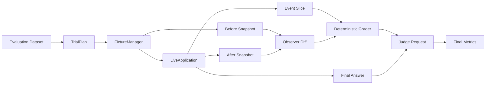

这条链可以分成四层：

| 层次 | 主要组件 | 主要产物 |
|---|---|---|
| 任务契约 | Dataset、EvalSample | 用户输入、route、trace、must_not、final_state、answer_reference |
| 真实执行 | TrialPlan、FixtureManager、LiveApplication | 一次可复现的 Trial |
| 证据采集 | EventTracker、Observer、TrialRecord | 运行轨迹、前后状态、最终回答、故障信息 |
| 判分汇总 | Deterministic Grader、Judge、Aggregate | 硬约束结果、语义结果、最终指标 |

### R · 这套结构最终得到什么

一次 Trial 会形成三类互相补充的证据：

- **Event Trace**：GitAgent 在内部怎样运行；
- **Observer Diff**：GitHub 或本地仓库实际发生了什么变化；
- **Final Answer + Judge**：最终回答在语义上是否完成用户任务。

这样设计的原因在于三类证据各自能看到不同事实。只看其中一类，都会留下盲区。后面的章节会先把每一层怎样工作讲清楚，再回到这些设计取舍。

---

## 2. Dataset：先把自然语言任务变成“可以判分的契约”

### S · 输入一开始只有什么

用户输入通常只描述“想完成什么”。例如：

> 找到某个 Issue，发布指定评论。

这句话足够驱动 Agent，却没有完整说明评测程序应该检查哪些事实。评测还需要知道正确路由、关键调用、禁止行为、最终状态和回答要点。

当前数据集 `gitagent-evaluation-dataset.json` 固定包含 56 条样本：

| 指标组 | 样本数 | 主要覆盖内容 |
|---|---:|---|
| M2 | 20 | Context Governance 与自动 compaction 后的任务正确性 |
| M3 | 24 | serial / parallel 两种完整执行策略的正确性、真实重叠与耗时 |
| M6 | 12 | waiting、进程退出、事件尾部损坏、外部状态变化等恢复场景 |

数据集加载时还会检查 schema 版本、根字段、样本总数、样本 key 和 `task_name:id` 是否一致，以及 metric group 是否属于 M2 / M3 / M6。

### T · EvalSample 要解决什么

`EvalSample` 的任务是把“用户怎么说”和“系统怎样判定成功”放在同一个契约里。

一个样本包含这些核心信息：

| 字段 | 用途 |
|---|---|
| `user_input` | 真正提交给应用的一个或多个用户输入 |
| `setup_ref` | 本 Trial 需要哪类测试环境或 fixture |
| `metric_group` | 该样本属于 M2、M3 还是 M6 |
| `label.route` | 预期经过哪些 Agent |
| `label.trace` | 必须出现的关键语义步骤或 Capability 证据 |
| `label.must_not` | 明确禁止出现的行为 |
| `label.final_state` | 执行结束后真实状态应满足什么条件 |
| `answer_reference` | 最终回答需要覆盖哪些语义要点 |

### A · 契约是怎样被后续组件消费的

数据流可以这样理解：

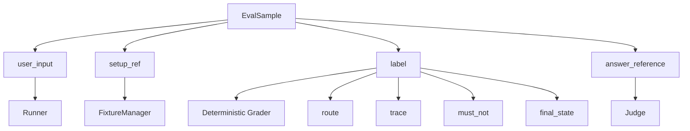

其中 `trace` 采用 **semantic gold trace**。它表达“哪些关键事实必须成立”，不要求模型完整复刻一份逐行脚本。

例如一个仓库调查任务可能要求：

- Main 必须进入 Repository Agent；
- 必须获得某些文件、符号或搜索结果提供的证据；
- 不允许出现写操作；
- 最终仓库保持不变。

Agent 可以根据上下文选择等价的 READ 路径。只要关键证据确实取得，普通读取顺序可以存在合理差异。

### R · 这样组织样本带来什么结果

样本同时具备“驱动执行”和“驱动判分”两种能力。Runner 从中得到输入和环境要求，Grader 从中得到硬约束，Judge 从中得到语义参考。

这样安排解决了一个核心问题：自然语言任务通常允许多条合理路径，安全要求和最终状态又需要明确约束。semantic gold trace 保留了 Agent 的行动空间，同时给硬约束留下了稳定检查点。

---

## 3. TrialPlan：一个 Sample 怎样展开成真正要执行的 Trial

### S · Sample 和实际运行次数并不总是一一对应

M2 大多数样本运行一次即可得到目标证据。M3 需要比较 serial 和 parallel 两种策略，还需要 warmup 和多次 measured trial。M6 中部分样本需要专门的故障流程。

因此，数据集中的“一条样本”和 Runner 中的“一次运行”属于两个层次。

### T · TrialPlan 要固定哪些运行身份

`TrialPlan` 会把一次具体运行需要的身份固定下来，包括：

| 信息 | 含义 |
|---|---|
| sample key | 当前跑哪条样本 |
| metric group | 当前属于哪个专项 |
| variant | normal、serial 或 parallel |
| replicate | 第几次重复 |
| warmup | 当前是否只用于预热 |
| account | 使用哪个评测账户 |

这些字段组合成稳定的 trial identity，后续事件、Observer 产物和结果都围绕这个身份保存。

### A · 三类指标组怎样生成 Trial

#### M2：normal 路径

M2 使用正常运行配置。每条样本建立独立 Session，通过完整应用链执行，收集 compaction 和任务正确性证据。

#### M3：serial / parallel A/B 路径

M3 会为同一 Sample 建立两种 variant：

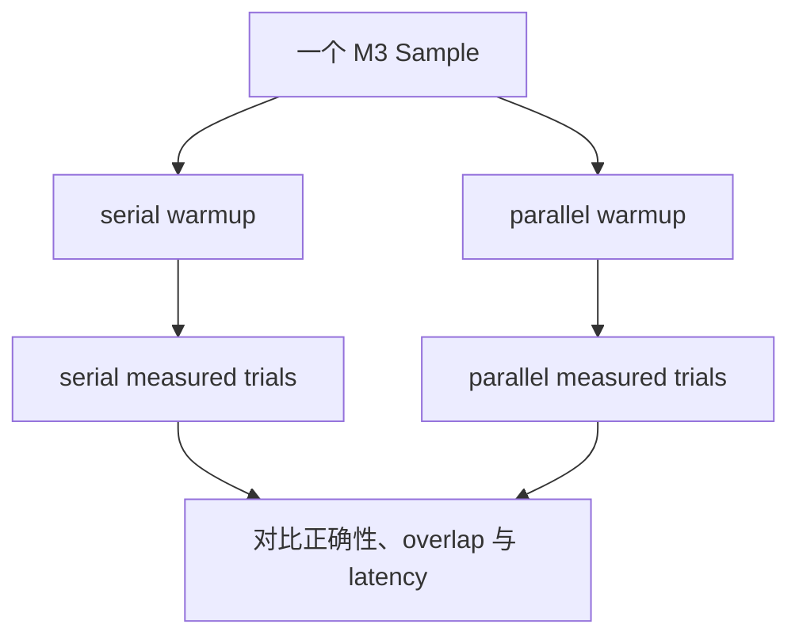

默认目标是每个 variant 收集 5 次有效 measured trial。Runner 还会：

- 每个 variant 先做 warmup；
- serial 和 parallel 的执行先后顺序交替，减少固定顺序带来的偏差；
- 当某次运行因为环境条件无效时允许有限额外尝试；
- 每个 variant 最多尝试到 `repetitions + 2`，避免外部条件持续异常时无限循环。

#### M6：按恢复场景选择专用执行路径

M6 会根据 Sample 类型进入不同路径，例如：

- 在 durable pending approval 或 waiting 状态形成后终止进程；
- 给事件日志追加损坏尾部，再验证有效前缀是否可恢复；
- 在已经自然发生 auto compaction 的 Session 上做重启恢复；
- 在 Approval waiting 期间改变远端状态，再继续旧 Session。

### R · 为什么需要 TrialPlan 这一层

TrialPlan 把“评测任务定义”和“实验执行方式”分开了。Dataset 可以保持稳定，Runner 可以根据指标组展开不同实验。

这对 M3 尤其重要。同一条任务内容会被 serial 和 parallel 两侧共同使用，差异由运行 variant 控制。这样可以避免维护两套几乎相同的样本文本。

---

## 4. 运行配置隔离：每个实验先得到自己的 RuntimeConfig

### S · Eval 会真的访问模型、GitHub 和持久化状态

真实评测不能让不同 variant 共用同一份运行目录，否则 Session、Event、Memory 或 SQLite 状态可能互相污染。

M3 还需要明确控制串行和并行策略。

### T · 环境层要生成一份可控的评测配置

Eval 会从项目原始配置派生运行配置，并保留真实服务连接需要的信息。同时覆盖评测关心的实验参数。

### A · normal、serial、parallel 怎样区分

运行配置的主要变化如下：

| variant | 关键设置 |
|---|---|
| normal | 保留正常 execution 策略 |
| all_serial | Capability 总并发、各 provider 并发、Domain Agent 并发都限制为 1 |
| all_parallel | Domain Agent 最大并发提升到 3，其余能力沿用基础并发配置 |

此外，评测统一把模型 temperature 设为 0，并把 state、event、memory 路径指向当前 run 的隔离目录。

M3 还有一层输入控制。原始 Sample 只描述任务内容，Runner 会根据 variant 给任务增加一句简短的执行方式说明：serial 要求独立任务逐个执行，parallel 要求独立任务同时发起并在完成后统一汇总。

### R · 这代表 M3 在比较什么

M3 比较的是两种**完整系统运行策略**。差异既包含运行并发配置，也包含对 Agent 的执行方式提示。

因此，M3 得到的 speedup 应理解为“当前 serial 策略与 parallel 策略在这些样本上的整体差异”。它不适合被解释成某一个线程池参数的纯微基准收益。

---

## 5. FixtureManager：先把外部世界准备到可测试状态

### S · 一些样本会读写真实 GitHub 对象

Issue 评论、PR Review、Merge、远端分支变化等任务依赖外部状态。如果目标对象不存在、状态不对或已经被之前的 Trial 改坏，本次结果就失去可比性。

### T · FixtureManager 要建立可控起点

FixtureManager 根据 `setup_ref` 和 Sample id 准备当前 Trial 需要的 Issue、PR、branch 或其他测试资源，并记录哪些资源由本次 eval run 创建和拥有。

### A · 一个 fixture 的生命周期怎样走

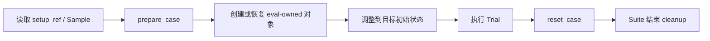

典型工作包括：

1. 找到或创建评测专用 Issue；
2. 把标题、正文、标签、评论等恢复到预期状态；
3. 为 PR 样本创建临时 branch 和 PR；
4. 对 Merge 场景准备 review 与 CI 条件；
5. 对需要“外部世界主动变化”的恢复样本使用第二账户制造变化；
6. Trial 结束后只清理本次 case 或 suite 明确拥有的资源。

对于需要修改默认分支的特殊 recovery fixture，还要求显式环境授权，并在清理前再次确认分支 head 没有出现意外变化。

### R · 这样设计解决了什么

FixtureManager 让一次测试从“碰巧遇到某种 GitHub 状态”变成“主动建立目标前提”。

同时，资源所有权记录限制了清理范围。评测系统只处理自己创建或明确接管的对象，降低测试 Harness 对真实仓库造成额外破坏的风险。

---

## 6. Observer：在 Agent 运行前后各拍一张“真实世界快照”

### S · Event 能说明调用发生过，却不能独立证明外部状态

某个 `tool_result` 显示调用成功，只说明 GitAgent 收到了这样的执行结果。对于远端写入，评测还希望从 GitHub 当前状态再确认一次。

### T · Observer 要建立独立于 Agent 自述的状态证据

Observer 在 Trial 执行前后读取与当前 Sample 有关的真实状态，然后把差异规范化成 mutation 列表。

### A · Observer 当前具体观察哪些内容

根据样本目标，快照可以包含：

- 目标 Issue 的状态、标签、指派人、评论等；
- 目标 PR 的状态、merged、head/base、Review、评论、changed files 等；
- 默认分支当前 commit；
- 指定远端文件是否存在及内容 hash；
- 本地测试仓库的 HEAD 和 worktree status。

流程如下：

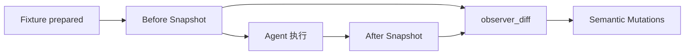

`observer_diff` 会把变化整理成较稳定的 mutation 类型，例如：

| mutation | 表示的真实变化 |
|---|---|
| `issue_comment` | Issue 新增评论 |
| `issue_update` | Issue 字段变化 |
| `pr_review` | PR 新增 Review |
| `pr_merge` | PR 从未合并变为已合并 |
| `pr_head` | PR head commit 变化 |
| `default_branch` | 默认分支 commit 变化 |
| `local_change` | 本地仓库状态变化 |

每个 mutation 还会生成 fingerprint，后面用于识别重复副作用。

### R · Observer 的价值在哪里

Event Trace 描述“系统尝试做了什么”，Observer 描述“目标状态最后真的怎样变化”。两者一起使用，可以区分调用记录与真实副作用。

Observer 还承担 secret leak 检查的一部分。Runner 导出的事件、回答和控制结果会进入敏感值检测，避免为了评测可观测性把已知 secret 直接写进产物。

---

## 7. Runner：通过真实 LiveApplication 执行，而不绕过应用层

### S · GitAgent 的关键能力分布在多层

Session、Turn、Main 路由、Domain Agent、Capability、Approval、Persistence 和 Recovery 都位于完整应用链上。

如果评测直接调用某个 Domain Agent 的内部方法，很多层级交接就不会经过。

### T · Runner 要复用真实用户入口

EvalRunner 构造 `LiveApplication`，建立真实 Session，再通过应用 facade 提交用户输入和少量 eval 控制命令。

### A · 一次普通 Trial 的实际执行顺序

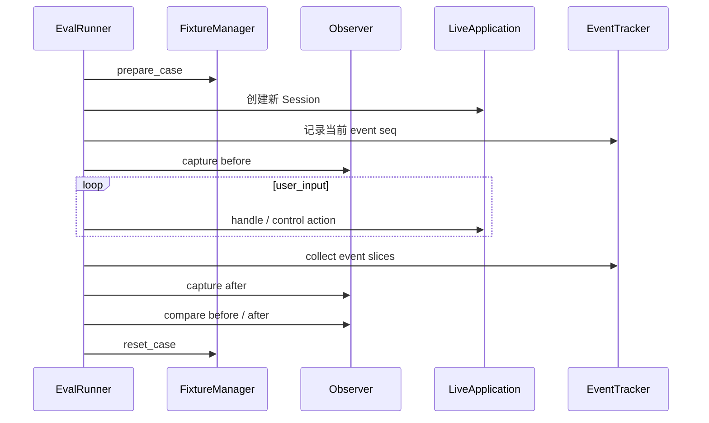

在真正执行 Sample 之前，Runner 还会检查测试仓库 grounding：

- 本地 mirror 必须存在；
- worktree 必须干净；
- 本地 commit 必须和远端默认分支 commit 一致。

如果这些前提不成立，相关样本会被记录为 invalid。这样可以避免 Agent 根据一份旧镜像得出结论，然后把环境漂移误算成模型行为。

### R · 通过 LiveApplication 能覆盖哪些真实边界

一次 Trial 会真正经过当前系统的 Session 生命周期、Agent 路由、Capability 调度、Approval 和 Persistence 等路径。

这样安排让评测更接近用户实际使用 GitAgent 时发生的事情。它付出的成本是运行更重、外部依赖更多，因此后面必须明确区分 failed 与 invalid。

---

## 8. EventTracker 与 TrialRecord：把一次运行保存成稳定证据包

### S · Grader 不应该依赖仍在内存里的 Application 对象

一次完整 benchmark 可能持续较久，也可能中断后继续。Grader 需要读取已经落盘的事实进行判分。

### T · Runner 要把 Trial 期间发生的事情完整归档

EventTracker 负责截取属于当前 Trial 的 Event；TrialRecord 负责保存该次运行的身份、状态、答案、耗时和产物路径。

### A · Event Slice 怎样确定边界

每当 Tracker 第一次接触一个 Session，会先记录该 Session 当前最后一个 event sequence。Trial 完成时再次读取最后 seq，只收集这个区间中新产生的事件。

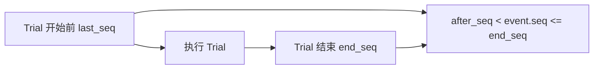

如果 Trial 跨恢复过程接触多个 Session scope，Tracker 会分别保存 slice，最后统一排序。

TrialRecord 主要记录：

| 内容 | 用途 |
|---|---|
| trial / sample / variant / replicate | 确定运行身份 |
| status / invalid_reason / error | 判断本次运行能否用于指标 |
| latency_ms | M3 性能统计 |
| final_answer | Judge 输入 |
| event_slices / events_path | 运行轨迹证据 |
| observer_path | 外部状态证据 |
| fault | Recovery 故障是否真实触发 |
| action_log | `handle`、`/new`、`/switch`、fault 等评测调度动作及其执行结果 |

最终回答从 Trial 事件中的最后一条 `assistant_message` 提取，因此回答和运行轨迹仍然属于同一个 Trial 证据包。

### R · 这样保存有什么好处

Grader 可以完全围绕落盘产物工作，不需要保留原 Application 对象。Eval resume 也能识别哪些 Trial 已经完成并复用它们。

这同时建立了清晰审计边界：后面任何指标都可以追溯到具体 Trial、事件切片和 Observer snapshot。

---

## 9. completed、failed、invalid：先判断“这次实验有没有真正成立”

### S · 运行没通过可能来自两类完全不同的问题

一种情况是 GitAgent 已经进入目标场景，但行为违反要求。另一种情况是模型服务、GitHub fixture、测试账户或目标故障条件没有建立起来。

如果把两类情况放进同一个失败桶，指标会失去解释力。

### T · Runner 和 Grader 要先分类运行资格

当前 Trial 主要使用下面三种状态：

| 状态 | 含义 | 是否属于有效实验运行 |
|---|---|---|
| `completed` | 本次执行正常结束，可继续判硬约束 | 是 |
| `failed` | 实验前提成立，但执行或硬约束出现行为失败 | 是 |
| `invalid` | 目标实验条件没有真正建立，当前运行缺少判分资格 | 否 |

需要注意，`failed` 仍属于 valid trial。它表达的是“这个实验真的跑到了，只是系统表现失败”。

### A · invalid 通常怎样产生

典型 invalid 场景包括：

- GitHub / 模型 / 网络依赖整体不可用；
- 第二评测账户没有配置，而当前恢复样本必须由外部身份制造状态变化；
- Fixture 无法准备到目标初始条件；
- 本地 grounding 与远端 revision 不一致；
- Recovery 想测试 pending approval 崩溃，但 durable pending 根本没有出现；
- M3 某个 variant 无法收集足够数量的有效 measured trials。

Grader 在一个 Sample 下至少需要一个 valid trial 才能继续生成确定性结果。M3 还要求 serial 和 parallel 两边都达到配置的有效重复次数。

### R · 为什么必须保留 invalid

invalid 既不能算通过，也不能悄悄从报告里消失。报告需要同时展示配置样本数、valid、invalid、failed 以及各指标自己的分母。

这样读者能够分清“系统能力没有通过验证”和“这次实验根本没有形成有效证据”。

---

## 10. Deterministic Grader：先把可以用规则判断的事实判完

### S · TrialRecord 已经有事件、状态和最终回答

到了 Grader 阶段，评测系统已经不需要继续驱动 Agent。现在要把证据转成稳定的布尔事实和统计量。

### T · 确定性判分负责哪些事情

它主要负责身份、顺序、参数、状态关系和时间区间这类可以机械检查的内容。

### A · 判分顺序可以理解成六层

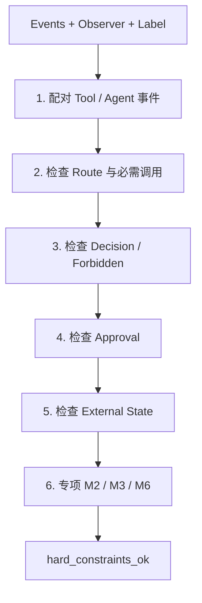

#### 第一层：Tool protocol

Tool call 和 terminal result 会按 `call_id` 配对。Grader 会识别：

- tool call 缺失终止结果；
- 孤立 tool result；
- 同一调用出现额外 terminal result；
- approval retry 后调用是否仍能正确配对。

#### 第二层：Agent protocol

Agent start / completed 使用 `run_id` 配对。这样同名 Coding Agent 多次运行时仍能区分不同 invocation。

#### 第三层：Route 与必需 Capability

Grader 根据 `label.route` 检查实际 Agent 路径，再从 semantic trace 中提取可以确定性识别的 Capability，检查调用次数是否满足要求。

#### 第四层：Decision、禁止行为与 Approval

对于带 ASK / DENY / ALLOW 语义的 concrete capability，Grader 会检查运行结果是否和 label 对应。

WRITE / DESTRUCTIVE GitHub 操作还会检查：

- 是否出现 pending proposal / approval queue；
- 成功 mutation 的参数是否和提案精确匹配；
- 用户拒绝后有没有继续写入；
- 重复批准有没有错误重放旧操作。

CodingWorkspace 内部允许的 `native.*` mutation 有单独隔离边界，因此不会被当成 GitHub Approval 流程处理。

#### 第五层：External State

Observer diff 会判断：

- 需要副作用的样本是否出现目标 mutation；
- 只读样本是否保持无 mutation；
- mutation 类型和数量是否符合 `final_state`；
- 是否出现未授权 mutation；
- 是否存在重复副作用 fingerprint。

#### 第六层：专项事实

最后再根据 metric group 增加 compaction、并发 overlap 或 recovery state 检查。

### R · 为什么 Judge 前面先放确定性 Grader

Approval 是否绑定同一组 arguments、PR 有没有真的 merge、两个调用时间是否重叠，这些事实都适合规则判断。

先把硬事实固定下来，可以减少语义模型对安全和状态问题的自由解释空间。Judge 后面主要补自然语言质量与语义轨迹判断。

---

## 11. M2：Context Compaction 是怎样评测的

### S · M2 关注“压缩后还能不能正确工作”

一个长任务即使回答正确，只要没有发生 auto compaction，就没有形成“压缩后继续工作”的证据。

因此，M2 的起点是先观察真实 compaction event。

### T · M2 需要同时确认压缩发生、协议完整、任务正确

M2 主要观察四个层次：

1. auto compaction 是否真实出现；
2. 压缩前后 token 数怎样变化；
3. 压缩以后 tool protocol 是否仍完整；
4. 最终任务和回答是否仍正确。

### A · compaction 证据怎样进入指标

Grader 从 `auto_compact` event 中提取：

- `before_tokens`；
- `after_tokens`；
- `context_window_tokens`；
- 当前 Agent；
- compression ratio。

压缩比例按 `1 - after_tokens / before_tokens` 计算。

随后 M2 会同时保留 event-level 与 task-level 统计：

| 统计层次 | 含义 |
|---|---|
| event-level | 每次 compaction 自己缩减了多少 |
| task-level | 先在每个任务内部汇总，再让不同任务获得更接近的权重 |
| peak context | 每个样本 compaction 前后峰值 context 的变化 |
| post-compaction protocol | 发生 compaction 的样本中 tool protocol 是否仍有效 |
| post-compaction case pass | Judge finalize 后，发生 compaction 的样本最终通过率 |

M2 的 `resume_metric_ready` 还要求配置的 20 个样本都形成有效结果，并且每个样本都有可用于 peak context 的 compaction 证据。

### R · 这样设计能避免哪些误判

只看 compression ratio 会把“上下文变短”误当成“上下文治理成功”。M2 把压缩事件、工具协议、任务完成和语义回答放在一起，才能说明压缩没有破坏后续工作。

区分 event-level 与 task-level 还能避免某个特别长的 Sample 因为触发十几次 compaction，就在总体平均值中获得十几倍权重。

---

## 12. M3：serial / parallel 是怎样做 A/B 对比的

### S · “更快”和“真的并发”是两个不同事实

parallel 版本可能因为漏掉必要工作而变快，也可能只是顺序执行得更快。单看 wall-clock latency 无法确认调度策略是否按预期生效。

### T · M3 要同时验证任务正确性、真实 overlap 和性能

每个 M3 Sample 都要在 serial 与 parallel 两侧运行。两侧都需要完成相同任务契约，然后才比较调度和时间。

### A · Grader 怎样证明真实并发

#### 1. 先把 Tool / Agent 事件配成 interval

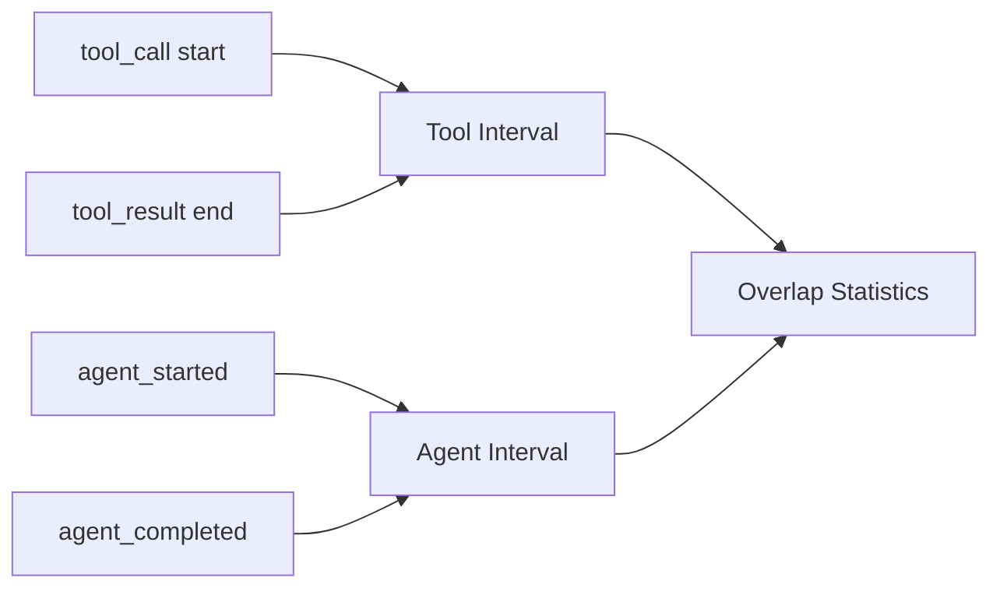

Tool 使用 `call_id` 和 `run_id`，Agent 使用 `run_id` 和 `parent_run_id`。这样能知道哪些调用属于同一父运行下的 sibling work。

#### 2. 统计 overlap

对于一组 sibling intervals，Grader 会计算：

- interval 数量；
- 最大同时活跃数量；
- 总 overlap 时间；
- 是否真的出现至少两个区间同时活跃；
- 第一批独立工作有多少项一起发起。

对于 Agent concurrency，还会检查 parent 是否在 children 都完成之后再 join。

#### 3. serial 与 parallel 分别满足自己的结构要求

parallel 侧要求：

- 至少观察到 3 个目标 interval；
- first batch 至少包含 3 个；
- 存在真实时间重叠；
- Agent 并发场景还需要正确 join。

serial 侧要求没有 parallel overlap。

Tool concurrency 样本还会检查 parallel first batch 中是否真正包含 label 要求的关键调用。

#### 4. 最后才比较 latency

对每个 Sample，serial 和 parallel 都收集多次 measured latency，再分别计算 p50 与 p95。

常见派生量包括：

- `speedup_p50 = serial_p50 / parallel_p50`；
- `latency_reduction_p50 = 1 - parallel_p50 / serial_p50`。

### R · M3 最终证明了什么

M3 的结论顺序应当是：

**任务契约通过 → serial / parallel 结构符合预期 → parallel 存在真实 overlap → 再讨论 latency 差异。**

这让“调度器真的并发”和“最终跑得更快”可以分别被观察。

另外，每侧默认只有 5 次有效 measured trial，因此这里的 p95 只是当前小样本统计。它适合做本 benchmark 内部对比，不适合被扩展成生产 SLA。

---

## 13. M6：Recovery 是怎样被主动制造和验证的

### S · 恢复能力不能依赖“碰巧崩一次”

要验证 pending approval、waiting 或事件日志恢复，Harness 必须先把系统推进到目标控制点，再主动注入故障。

如果目标控制点没有形成，后面的重启成功没有足够证据说明对应恢复机制有效。

### T · M6 要验证完整的恢复链

Recovery 评测至少覆盖四层：

| 层次 | 要确认的事实 |
|---|---|
| durable state | pending / waiting 等关键控制状态已经持久化 |
| reconstruction | 新 Application 能恢复原 Session |
| control semantics | 新输入回到正确控制点继续处理 |
| side-effect correctness | 没有重复写入，也没有使用已经失效的旧授权 |

### A · 进程故障怎样被精确注入

对于需要真实进程终止的样本，RecoveryController 会启动一个独立 GitAgent 子进程并持续观察：

1. Event 中是否出现目标 trigger；
2. StateStore 中对应 durable context 是否已经准备好。

只有两边都成立，父进程才终止子进程。

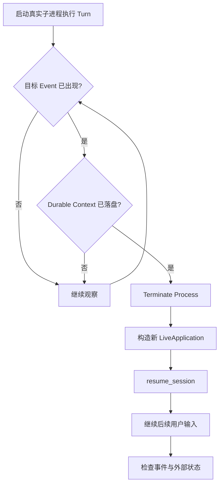

当前恢复组还包含几类不同故障：

- **pending approval 崩溃**：等待 proposal 已持久化后终止进程；
- **waiting_for_user 崩溃**：等待普通用户输入的 durable 节点出现后终止进程；
- **active siblings 崩溃**：多个 sibling Agent 活跃时中断，再看后续 Turn 能否正常完成；
- **malformed event tail**：在事件文件尾部追加损坏内容，验证有效事件前缀仍可读取；
- **external state change**：Approval waiting 后，由第二账户修改 PR head、关闭 PR 或改变默认分支；
- **post-compaction restart**：复用之前自然发生过 auto compaction 的 Session，再执行干净重启。

### R · 为什么 M6 一定要检查副作用

恢复后“程序还能回答”只覆盖 reconstruction 的一部分。真正危险的问题通常发生在副作用边界：旧 proposal 被重复执行、外部状态变化后仍消费旧授权、网络或重启导致同一 mutation 再写一次。

因此 M6 会把 fault 记录、Action Log、Event、Approval 和 Observer Diff 一起交给 Grader，并单独统计 duplicate side effect。

这里的 duplicate 检测覆盖当前 Harness 能观察和 fingerprint 的 mutation 类型。它提供的是当前评测范围内的重复副作用证据，不代表对所有外部系统给出 exactly-once 保证。

---

## 14. 用 REC-01 把一条 Recovery Sample 从头走一遍

前面的组件已经讲清楚，现在用 `recovery:REC-01` 串成一条完整故事。

### S · 场景

用户要求找到指定 Issue，并发布固定评论 `REC-01-RESUME-COMMENT`。样本第二步要求：pending approval 出现后终止 GitAgent 进程，随后恢复同一 Session。第三步用户批准原提案。

最终状态要求目标评论只新增一次。

### T · 本 Sample 要验证什么

这个样本同时验证：

- Issue 路由是否正确；
- `github.post_comment` 是否进入 Approval；
- pending proposal 是否已经 durable；
- 进程终止后是否能恢复同一 Session；
- 用户批准后是否只执行一次 comment mutation；
- 最终回答是否正确描述恢复结果。

### A · 实际运行步骤

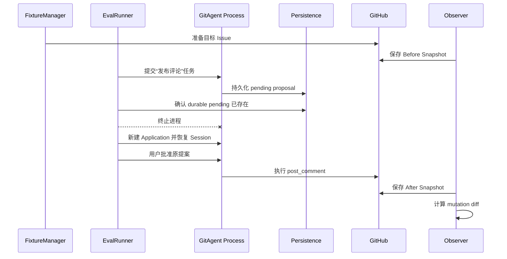

随后 Deterministic Grader 会检查：

1. 实际 route 是否包含 Main 和 Issues；
2. comment capability 是否出现 ASK；
3. proposal 与最终成功调用的 arguments 是否一致；
4. fault 是否真的在 pending 状态形成后触发；
5. Observer 是否只看到一条目标评论；
6. duplicate side effect count 是否为 0；
7. tool / agent protocol 是否闭合。

最后 Judge 再检查回答是否说明 pending approval 成功跨进程恢复，以及批准后只执行一次。

### R · 这个例子说明了什么

REC-01 的通过条件由多份证据共同组成。单独看到“最终 Issue 上有评论”还无法说明 pending recovery 生效；单独看到“Session 恢复成功”也无法说明没有重复写入。

把 durable trigger、恢复控制流、真实 mutation 和语义回答串起来后，才能形成完整的恢复证据链。

---

## 15. Judge：硬约束判完以后，再补自然语言语义判断

### S · 有些问题很难写成稳定规则

例如：

- 最终解释有没有真正回答用户的问题；
- 仓库调查是否正确组织了事实；
- Recovery 后的回答有没有准确说明当前状态；
- semantic gold trace 中较抽象的步骤是否在整体语义上得到满足。

这类问题更适合交给 LLM Judge。

### T · Judge 需要看到足够上下文，又不能重新接管硬约束

Judge Request 会把当前 Sample 的任务、参考答案和已经确定的运行事实一起打包。

### A · Judge 实际收到什么

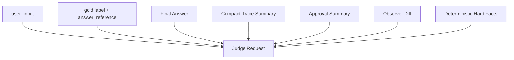

不同指标组要求的 Judge 字段也不同：

| 指标组 | Judge 重点 |
|---|---|
| M2 | `answer_facts_ok`、`semantic_trace_ok` |
| M3 | `answer_facts_ok`、`semantic_trace_ok` |
| M6 | `answer_facts_ok`、`recovery_semantics_ok` |

M3 有多次重复 Trial。Judge Request 不会把所有重复都逐条完整评审。系统会选择代表 Trial，并且为 M3 同时附上 serial 与 parallel 两侧的代表性答案和 trace summary。

Judge 输出采用结构化 response schema，并通过 `judge_id` 绑定 Sample。

### R · 为什么采用“导出 → 外部 Judge → finalize”

主 Runner 先完成确定性评测并生成 `judge-input.jsonl`。外部 Judge 生成结果后，再通过 finalize 合并成最终指标。

这样运行评测和语义评审可以分阶段进行，也方便更换 Judge 执行环境。finalize 会严格检查 Judge id：缺失、重复或混入当前 run 之外的结果都会直接报错。

最终 Sample pass 需要同时满足：

**hard constraints 通过 + 当前 Sample 要求的 Judge 字段全部通过。**

在 Judge 结果尚未回填时，语义指标保持 pending。

---

## 16. Aggregate Metrics：最后汇总时一定保留“分母”

### S · 不同指标依赖的有效样本集合不同

M2 的 compaction ratio 只对真实发生 compaction 的事件有意义；M3 speedup 需要 serial / parallel 两边都有足够有效 Trial；M6 recovery success 需要目标故障场景真正成立；Judge 指标还需要外部语义结果已经回填。

### T · 汇总层要让每个数字都能解释自己的覆盖范围

总报告会保留：

- samples total / executed；
- valid / invalid / failed；
- judge pending；
- 每个 metric group 的 configured samples；
- 每个专项自己的有效样本数和指标分母。

### A · 三个指标组分别怎样聚合

#### M2

主要汇总 compaction event 数、sample compaction rate、token 前后均值、compression ratio、peak context、post-compaction tool protocol 等。

#### M3

按 Sample 先得到 serial / parallel 的 p50、p95、speedup、latency reduction、overlap rate，再跨有效 Sample 求整体统计。

Judge finalize 后再形成 official task completion rate。

#### M6

先统计 structured recovery success 和 duplicate side effect，再在 Judge finalize 后形成 official recovery success rate。

### R · 保留分母解决了什么问题

一个“100%”如果只来自 2 个有效样本，和 20 个样本全部有效后得到的“100%”含义差别很大。

因此评测报告不能只展示百分比。configured、valid、invalid、pending 和 metric-specific denominator 必须和指标一起阅读。

---

## 17. Eval 自己也支持 Resume：恢复的是 benchmark 进度

### S · 完整评测可能运行很久

M3 每个 Sample 有两侧 warmup 和多次 measured trials，真实 GitHub / 模型调用也可能使完整 suite 持续很久。

### T · Runner 中断后需要知道哪些 Trial 可以复用

Runner 会持续落盘 manifest、trial records、events、observer results 和 error records。

### A · Resume 时怎样防止“接着跑了另一个实验”

重新启动时，Runner 会校验 manifest 中的关键身份，包括：

- dataset hash；
- base config hash；
- repetitions；
- sample / group 选择范围；
- selected sample keys。

只有这些条件一致，已有 Trial 才会被重新加载并计入当前 run。缺失 Trial 继续执行。

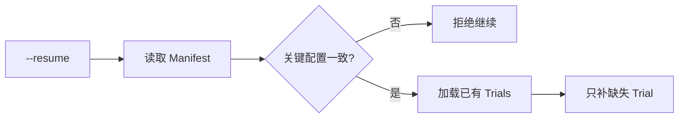

### R · Eval Resume 和 Agent Recovery 的边界

两者处理的对象不同：

| 机制 | 恢复对象 |
|---|---|
| Agent Recovery | 某个用户 Session 内的 Agent 控制状态 |
| Eval Resume | 一整套 benchmark 已经完成到哪些 Trial |

把这两个层次分开后，M6 可以专门测试 GitAgent 的业务恢复能力，而 Eval Runner 自己仍能处理 benchmark 执行中断。

---

## 18. 评测产物也要经过 Secret Sanitation

### S · 真实 Eval 会接触敏感配置

模型服务配置、GitHub token 和运行状态都有可能包含不适合进入共享报告的信息。

### T · 可观测性不能扩大 secret 暴露面

Runner 在写 JSON / JSONL 产物前会通过已有 redaction 能力清洗已知 secret values。

### A · 清洗覆盖哪些产物

包括：

- events；
- observer snapshots；
- manifest；
- trials；
- deterministic results；
- metrics；
- judge input；
- errors。

产物生成完成后，Runner 还会再次扫描这些报告文件，确认已知 secret 原值没有残留。

当一次 run 已经顺利进入最终产物生成阶段，评测专用 runtime state 目录会被移除，避免长期保留私有 Session / Memory 状态。若进程被硬终止，状态目录可以留下供 `--resume` 使用。

### R · 这样安排的原因

Eval Harness 自己同样属于系统安全边界的一部分。保存更多证据有利于调试，但证据产物不能直接变成 secret 泄漏通道。

---

## 19. 现在再回头看：为什么整套设计需要三层证据

到这里，各组件怎样工作已经讲完。现在再讨论整体设计取舍会更容易理解。

### S · GitAgent 的成功包含多种事实

一个任务可能同时包含：

- 正确理解用户意图；
- 正确路由；
- 获取真实仓库证据；
- 遵守 Capability 与 Approval 约束；
- 对外部世界产生正确且唯一的副作用；
- 在并发、压缩或恢复场景下保持这些性质。

### T · 单一评分源无法覆盖所有事实

最终文本适合判断解释质量，却看不到完整内部调用和外部状态；Event 很适合判断执行路径，却不能独立确认 GitHub 最终状态；Observer 能确认状态变化，却不一定知道这次 mutation 有没有经过正确授权。

### A · 因此把职责拆成三层

| 证据层 | 最擅长回答的问题 | 典型例子 |
|---|---|---|
| Event Trace | 系统怎样运行 | 路由、tool protocol、Approval、并发区间、compaction |
| Observer Diff | 外部世界怎样变化 | 评论是否新增、PR 是否 merge、默认分支是否变化 |
| Judge | 最终语义是否满足任务 | 解释是否完整、恢复语义是否正确 |

Deterministic Grader 位于中间，把前两类证据转成稳定硬事实，再把这些事实提供给 Judge。

### R · 最终得到的评测能力

这套 Harness 可以对下面这些结论给出较清晰的证据链：

- compaction 真实发生，并且后续工具协议和任务仍成立；
- parallel 策略真的产生 sibling overlap，同时任务正确；
- 进程故障发生在目标 durable 控制点之后；
- Session 恢复后继续了正确控制语义；
- Approval 没有被恢复流程或外部状态变化绕过；
- 目标 mutation 真实发生，并且没有出现可观察到的重复副作用；
- 最终回答在语义上覆盖了用户任务。

这就是本评测系统最重要的设计思想：**先把一次任务运行成可审计的实验，再让不同类型的证据分别证明对应事实。**

---

## 20. 复习时怎样快速讲清这一章

如果需要在面试或复习中快速说明，可以按下面顺序画图并讲述：

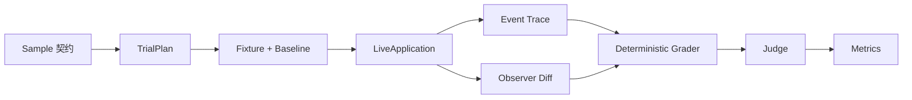

讲解时抓住四个层次：

1. **先定义成功**：EvalSample 用 route、trace、must_not、final_state 和 answer_reference 把任务变成判分契约；
2. **再真实运行**：TrialPlan 展开实验，Fixture 建立前提，Runner 通过 LiveApplication 执行；
3. **然后收证据**：Event 看内部路径，Observer 看真实状态，TrialRecord 把一次运行固化；
4. **最后分层判分**：Deterministic Grader 判硬事实，Judge 判语义，Aggregate 保留有效分母。

三个专项可以各用一句话继续展开：

| 专项 | 复习时最应该记住的主线 |
|---|---|
| M2 | 先确认 auto compaction 真实发生，再检查压缩比例、tool protocol 和最终任务 |
| M3 | 同一 Sample 跑 serial / parallel；先证明任务正确和 interval overlap，再比较 latency |
| M6 | 先确认 durable control point，再注入故障；恢复后检查控制语义和重复副作用 |

---

## 21. 代码定位：想核对实现时去哪里看

| 想核对的问题 | 主要位置 |
|---|---|
| Dataset schema、56 条样本、semantic gold trace | `eval/gitagent-evaluation-dataset.json` |
| EvalSample / TrialPlan / TrialRecord / ObserverSnapshot | `eval/models.py` |
| RuntimeConfig 派生、Fixture、Observer、RecoveryController | `eval/environment.py` |
| Trial 编排、M3 variant、M6 执行、EventTracker、Eval Resume | `eval/runner.py` |
| Tool / Agent interval、硬约束、M2/M3/M6 指标、Judge 请求、finalize | `eval/grader.py` |
| CLI 执行与 finalize 入口 | `eval/run_eval.py` |

到这里，评测模块可以被看成一条完整工程流水线：**先定义实验，再建立前提，再通过真实应用执行，再采集独立证据，最后把硬事实和语义判断合并。** 复习这部分时，优先掌握这条数据流，再去记具体指标字段，会更容易把整个设计串起来。
