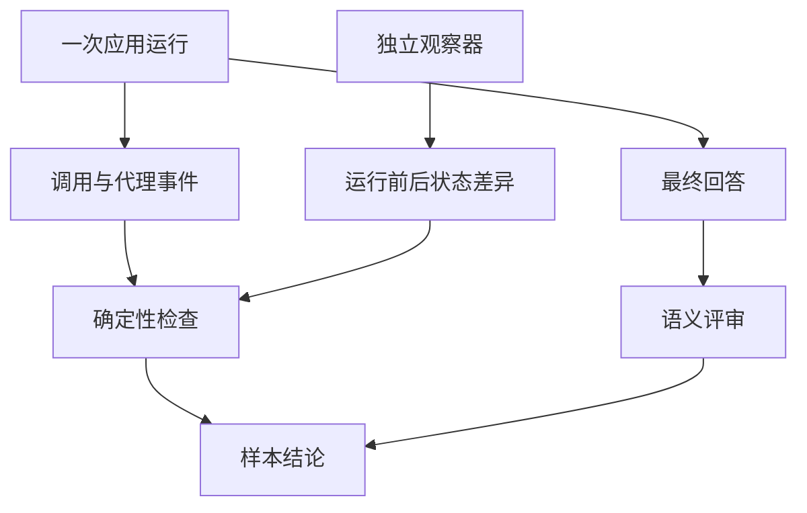
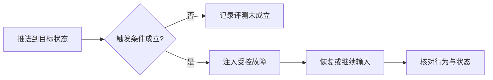

# 14 Harness 评测设计：怎样判断任务真的完成，运行约束也没有被绕过

## 本章先回答什么

代理最后回答“已经完成”，不能单独证明任务成功。它可能没有读取必要证据，也可能在用户拒绝后仍然写入了远端。相反，运行时返回一次冲突，在某些恢复任务里反而是正确行为。

因此评测不应只把最终回答交给另一个模型打分。本章沿一项“生成提案、暂停、恢复后处理用户决定”的任务展开，解释怎样同时观察轨迹、真实状态和答案语义。

本章只讨论已有评测系统的设计与判分口径，不报告实测成绩，不展开失败案例复盘或优化路线。

### 本章的 STAR 主线

| 阶段 | 本章要解决的问题 |
|---|---|
| 情境 S | 最终文本、执行轨迹和外部状态可能不一致，单一成功标记无法评价 Harness |
| 任务 T | 区分评测是否有效、执行是否守约、答案是否满足任务，并让各项判断有证据来源 |
| 行动 A | 定义样本契约 → 准备独立环境 → 调用真实应用 → 收集事件与状态 → 确定性判分 → 语义评审 → 汇总 |
| 结果 R | 专项任务可以形成可追溯判断，性能与恢复指标有明确范围，不把局部通过扩大为全面能力证明 |

---

## 1. 情境：为什么最终回答正确还可能不合格

用户要求“先拟一份评论，我确认后再发布”。代理给出一份措辞良好的评论，但已经提前发到了 GitHub。

如果只看最终文字，这项任务可能得到高分；如果检查外部状态，就能发现它违反了用户要求。对于 Harness，这个违规比语言是否流畅更关键。

另一种情况是用户批准后远端分支已经变化。系统拒绝旧候选写入，虽然没有完成原发布动作，却遵守了版本约束。评测如果把所有异常都当作失败，就会奖励绕过正确性检查的行为。

所以样本必须先定义什么叫成功，再决定观察什么。判分不能只围绕“有没有报错”设计。

---

## 2. 任务：三种证据怎样形成相互约束

GitAgent 的评测同时使用运行事件、独立状态观察和最终回答。



事件解释系统试图做什么，以及怎样经过权限与恢复路径。独立观察解释真实远端、本地或记忆状态是否改变。答案语义解释用户要求是否得到满足。

三者不是完全无关的证据，但可以避免只相信代理自述。工具消息说评论已发布，观察器还应核对相应状态；文字说任务完整，语义评审仍要对照必需信息。

---

## 3. 为什么先说明当前评测的覆盖范围

当前数据集固定为 56 条，保留三个专项组：

| 指标组 | 样本数 | 主要问题 |
|---|---:|---|
| M2 上下文治理 | 20 | 长任务中是否发生压缩，压缩后的协议和答案是否仍可用 |
| M3 串行与并行对比 | 24 | 独立工具与子代理任务是否正确并发，时间口径如何变化 |
| M6 故障恢复 | 12 | 等待、重启、状态变化与错误纠正后能否合法继续 |

组编号来自现有数据集，不表示当前目录里还完整保留 M1 到 M6 的全部评测。部分样本名称虽然叫任务完成，实际被归入上下文专项。

这套设计可以解释三个重点机制，不等于已经覆盖 RAG 相关性、所有代码修复类型、不同模型适配或所有工具安全边界。范围本身就是评测结论的一部分。

---

## 4. 一个样本为什么需要输入以外的契约

自然语言请求只告诉代理要做什么，评测还需要定义怎样判断它做对了。当前样本把任务输入、环境准备引用、轨迹约束与答案要点放在一起。

下面展示的是字段关系，用于理解样本结构，不是可直接加入固定数据集的一条新样本：

```text
样本
  task_name / id       标识是哪项任务
  metric_group         归属哪个专项
  user_input           有顺序的多轮输入
  setup_ref            需要的环境准备
  label
    route              领域路由约束
    trace              必要动作与证据
    must_not           禁止动作
    final_state        预期状态
  answer_reference     最终回答必须覆盖的要点
```

这让“评论只拟稿不发布”能够同时表达期望答案和禁止副作用，而不是把后者埋在评审者自由理解的文本里。

加载时还检查字段集合、样本键与编号是否一致。错误标注结构应在执行前暴露，避免跑完才发现无法判分。

---

## 5. 为什么标准轨迹不是每一步都必须逐字照抄

代理可能先批量读取文件，也可能逐个读取，只要拿到任务所需证据，这些路径可能等价。把所有工具顺序固定成唯一答案，会把合理变化误判为失败。

当前标注使用语义轨迹：保留必须遵守的路由、显式必要调用、禁止行为和最终状态，同时为普通只读证据允许部分等价获取方式。

但不能因此说当前判分完全与实现无关。领域路由、某些恢复调用和并发首批结构仍然是硬约束，评分也包含针对特定样本的规则。

这种设计服务于当前 Harness 的专项验证。理解它的目的，才能知道哪些变化是违反任务，哪些变化只是离开了这套评分器认可的实现路径。

---

## 6. 为什么通过应用入口执行，而不是直接调用被测函数

恢复问题通常出现在模块交接处：用户输入是否回到原等待节点，审批是否重新绑定，事件是否被保存，主代理是否误把恢复当成新任务。

单独测试审批存储或代理循环，无法覆盖这些交接。因此 runner 调用与真实使用共享的应用接口，执行正常输入、会话恢复和相应控制动作。

模型与 GitHub 等依赖仍然参与实际运行，所以它不是单纯脚本化返回值的单元测试。相应地，外部服务和环境条件也可能影响评测是否成立，必须被单独记录。

这也解释了第 13 章为什么强调 CLI 与应用门面的分离：评测可以经过主要业务路径，而不必模拟终端界面。

---

## 7. 测试夹具为什么需要明确归属

涉及评论、分支或 PR 的任务，需要真实对象。若每次运行都复用不受控对象，上一条样本留下的评论或分支就可能改变下一条样本的难度。

评测环境因此准备并登记自己拥有的夹具，执行前确认基线，执行后根据样本恢复或清理受管理资源。不能因为任务叫测试，就把整个仓库当成可任意清空的临时目录。

运行时状态、事件和记忆也使用独立目录，减少个人会话与评测之间的污染。涉及第二个账户的情形还需要真实的不同身份；条件不满足时，这项评测不能被当作已经验证成功。

这套 runner 可能产生远端写操作。文档说明设计并不等于自动授权运行，实际执行必须明确目标仓库与测试资源范围。

---

## 8. Observer 为什么不能只读取 Agent 的工具结果

代理调用可能返回成功，外部对象却未达到预期状态；也可能网络响应丢失，实际写入已经发生。仅依赖工具结果会继承调用方对事实的盲区。

独立观察器因此按样本需要捕获运行前后的远端、本地和记忆状态，并计算差异。它不遍历所有可能资源，而是围绕被测任务的对象建立观察范围。

对一次评论发布，关注的是相应评论是否出现、正文与目标是否匹配；对只读任务，关注受观察对象是否保持不变。它与轨迹中的审批记录共同判断是否存在未授权修改或重复副作用。

观察器也有覆盖边界。“受观察范围内没有异常变化”不能扩大成“整个宿主机与所有外部服务都没有副作用”。

---

## 9. 故障恢复为什么先验证故障真的到达

评测希望在等待合并审批后改变远端状态。但如果代理根本没有生成合并提案，提前修改 PR 后再观察结果，并不能说明系统处理了“审批后状态变化”。

runner 因此检查相应暂停能力是否已经出现，再执行特定故障动作。对进程退出、事件坏尾部或压缩恢复，也记录故障是否被触发以及恢复所需的状态事实。



这让恢复成功与故障有效性分开。一个没有遭遇目标故障的正常运行，不能冒充一次成功恢复。

---

## 10. 为什么失败与无效运行分开

前提完整、系统做错了，属于行为失败。例如出现禁止调用，或者必要协议没有闭合。

外部模型不可用、测试账户缺失、故障触发条件没达到等情况，则可能让评测无法成立。当前 runner 会按条件将其记为无效运行，并保存原因。

已知预期错误还需要另一种解释：某些恢复任务本来就要求拒绝旧计划，不能仅因为应用返回异常就判为能力失败。

因此评测先回答“是否具备判分资格”，再回答“具备资格后是否通过”。无效运行不是成功，也不应该从报告中无痕消失。

---

## 11. 确定性 Grader 怎样检查运行契约

Grader 从事件中关联工具调用与终止结果，检查是否有孤立结果、缺失结果或重复终止。代理区间则按运行编号关联，而不是只用代理名称，否则同一类型的多个子代理会混在一起。

随后它结合样本检查领域路由、必要调用、禁止动作、审批链、外部状态和敏感内容。恢复组还检查对应控制动作与故障记录。

这类判断适合规则实现，因为它们依赖明确关系：一个调用是否有结果、一次写入是否匹配授权、一个故障是否真的发生。

但规则检查到调用存在，不证明模型已经正确理解调用内容。语义质量要留给下一层，不能从轨迹完整直接推导答案完整。

---

## 12. 语义 Judge 为什么放在确定性事实之后

Judge 负责判断答案是否覆盖参考要点、结论是否符合任务等语义问题。输入包含用户请求、标注、候选答案、轨迹摘要、审批摘要、外部状态差异和确定性事实。

这种顺序让评审者有事实约束，而不是只根据文字自信程度评分。最终样本通过需要硬约束和语义要求同时满足，Judge 不能用一句“总体不错”豁免未授权副作用。

当前系统导出自包含的 Judge 请求与响应 schema，再接受外部 Judge JSONL 完成汇总。它没有在主 runner 中自动完成整套语义模型调用。Judge 尚未返回时，相关语义指标保持待评审状态。

响应还要验证样本身份、字段与数量，拒绝遗漏、重复或混入其他样本的判断。结构化评审仍然需要输入输出契约。

---

## 13. 多次运行为什么不等于每次答案都经过语义评审

并发任务会多次执行，但当前 Judge 导出为每项样本选择代表运行，并为串行和并行分别提供代表答案与摘要。

确定性检查会聚合多次有效运行，而语义输入不是逐次完整重放所有答案。因此最终语义通过不能直接解释成“每一次重复生成都得到了独立语义确认”。

这是当前数据成本与评审范围的边界。把一次样本的确定性聚合和代表答案评审区分开，才能准确理解最终结论。

---

## 14. 并发怎样证明真正发生，而不是只看总耗时

总耗时变短可能来自网络波动，也可能来自模型少读了文件。只比较时间无法判断调度是否真的并发。

Grader 将工具与子代理事件配成执行区间，计算同时活跃数量和重叠时间。首批调用与子代理汇合关系也参与特定任务检查。同一时刻结束与开始的两个区间不会仅因边界相接被算作重叠。

串行组应没有重叠，并行组需要满足样本要求的并发结构，同时通过任务约束。这样“快”与“按要求并行”成为两个需要同时解释的事实。

这些区间来自运行事件，不是 CPU 采样。它们说明调用在时间上重叠，不证明每一段底层计算都同时占用了计算资源。

---

## 15. 串行与并行的时间口径怎样保持清楚

每个性能样本的两种配置先预热，再收集重复运行。默认每个变体需要五次有效记录，并交替执行顺序，减少固定先后带来的影响。

当前常规试次的计时围绕输入执行序列，前置夹具与基线观察、后置状态采集不计入这段时延。它不是完整评测命令从启动到清理的总耗时。

每项样本先计算串行与并行时延的 p50、p95，再得到比值。例如：

```text
p50 加速比 = 串行 p50 / 并行 p50
p50 时延下降比例 = 1 - 并行 p50 / 串行 p50
```

整体汇总对有效样本的相应指标求平均，不等于把全部运行时间拼起来再做一个统一比值。五次重复下的 p95 也不应解释成大规模稳定尾延迟保证。

此外，当前变体同时改变执行配置与串并行提示语。因此它比较的是两种系统运行策略，不是只改变线程池参数的纯调度器实验。

---

## 16. 上下文指标为什么还需要协议与答案检查

压缩事件记录压缩前后估算 token 数，当前缩减比例按 `1 - 压缩后 / 压缩前` 计算。它描述请求表示变小多少，不直接表示 API 费用下降多少，也不代表信息无损。

如果压缩破坏工具调用与结果关联，再高的比例也不合格；如果删掉任务关键条件，协议可以合法，答案仍然可能错误。

所以 M2 同时记录是否观察到压缩、压缩后的协议检查和语义任务结果。没有实际触发压缩的样本，不能用它的正确回答证明压缩质量。

报告还区分事件平均与任务平均。压缩十次的长任务与压缩一次的短任务，如果直接混算事件，会拥有不同权重；字段名称应反映实际聚合方式。

---

## 17. 恢复指标为什么不能只统计重新启动成功

进程能再次打开，只证明初始化成功。恢复任务还需要知道原等待是否继续、拒绝是否生效、旧授权是否被错误复用，以及是否出现重复副作用。

当前恢复检查结合故障与控制动作、运行终态以及观察范围内的副作用。结构恢复通过后，还要结合语义 Judge，才能形成对应的完整恢复判断。

重复副作用指标也有具体分母：当前按相关有效修改样本聚合观察到的重复次数，不是对所有网络写请求逐个计算概率。它不能被直接描述成通用 exactly-once 保证。

第 03 章的恢复边界在这里依然成立：任意执行中断不自动续跑，与合法暂停点恢复是不同能力。

---

## 18. 为什么分母与待评审状态必须跟指标一起阅读

当前汇总会同时报告有效、无效、失败和待 Judge 数量，但各指标根据自己的可用事实选择分母。例如，部分成功率基于有效样本，部分压缩指标只基于确实发生压缩的样本。

因此一个较高成功率如果伴随大量无效样本，不能被读成“全部配置任务都已验证”。必须同时说明有多少项真正参与计算。

代码中的 `resume_metric_ready` 是历史命名的汇总就绪标志，在不同组检查完整样本数或必要数据是否到齐；这里的 `resume` 不表示所有指标都在测进程恢复，也不等于评测断点续跑开关。

这些字段最终服务于同一个目标：让未完成的验证保持可见，而不是用一个总分抹平不同缺口。

---

## 19. 为什么评测自己也需要断点与产物协议

一套评测可能持续较长时间，模型服务或进程中断后，不应只能从头重跑。runner 保存试次记录、事件切片、观察快照和运行清单，恢复时先检查数据集、基础配置、选择范围与重复次数是否匹配。

这防止把两套不同条件下的记录拼成一次运行。它与被测 Agent 的暂停恢复是两层不同机制：一个恢复评测进度，一个恢复业务任务。

最终产物包含确定性结果、指标、错误记录和 Judge 输入。语义评审完成后再合并。敏感内容经过清洗，正常进入产物收束阶段后还会清理私有运行时状态，而不是把个人记忆无限保存在报告目录。

产物存在只说明留下了记录，不能代替阅读有效性与待评审标记。

---

## 20. 用一次审批恢复评测把整章串起来

先定义多轮输入、应出现的提案、用户决定和最终状态，再准备评测拥有的对象并捕获基线。runner 通过应用入口推进到明确等待点，确认目标状态成立后执行相应恢复动作。

恢复后的输入继续经过真实服务。事件记录调用与授权，Observer 核对对象变化，Grader 检查协议和恢复关系。如果某个前提没有成立，先记录评测无效，而不是把它当作恢复成功。

确定性事实随后与答案一起交给外部 Judge。只有事实约束与语义要求都通过，才形成样本通过。最后汇总时保留样本覆盖、无效原因和各指标分母。

这条链的核心是，评测也必须遵守自己所检验的工程原则：身份明确、状态有来源、失败不伪装成成功。

---

## 21. 结果：这套评测设计能够支持什么判断

当前框架能够围绕上下文、并发和恢复专项，把应用行为转成可追溯的事件、状态与语义判断。它将工具协议、安全约束和任务质量分开检查，再组合成样本结论。

代价是依赖夹具、外部服务、样本规则和 Judge 产物，且部分指标只覆盖有效运行或代表答案。它是一套有明确边界的专项评测框架，不是自动证明全部 Harness 能力的总分系统。

## 22. 复习时怎样讲这一章

从“答案正确但提前发布”的矛盾开始，说明为何需要事件、外部状态和语义三种证据。再沿样本契约、环境、执行、故障、Grader、Judge 和汇总走一遍。

最后分别解释上下文缩减、真实并发和恢复成功各自需要什么附加条件，并明确分母、计时范围和待评审状态。这比背指标名称更能说明评测设计。

## 23. 代码定位

| 想核对的问题 | 代码位置 |
|---|---|
| 56 条专项样本与标注范围 | `eval/gitagent-evaluation-dataset.json` |
| 样本、试次、事件切片与观察契约 | `eval/models.py` |
| 夹具、配置变体、观察器和故障控制 | `eval/environment.py` |
| 应用执行、重复运行与断点进度 | `eval/runner.py` |
| 确定性判分、Judge 导出与指标口径 | `eval/grader.py` |
| 运行与 Judge 合并入口 | `eval/run_eval.py` |

最后一章回到整体取舍：[GitAgent 与 Claude Code、Codex、pi 的设计比较](15-design-highlights-and-harness-comparison.md)。
