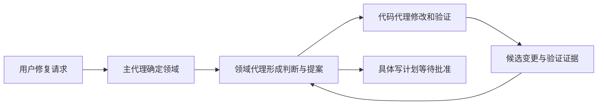
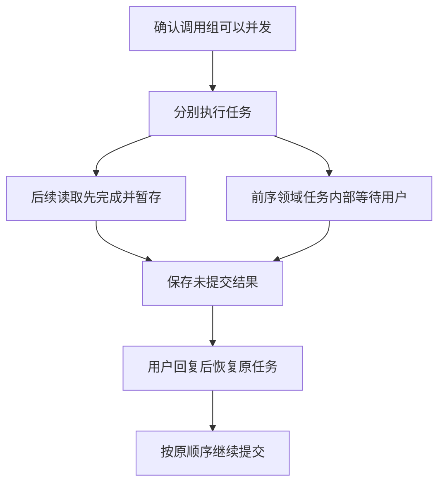

# 15 亮点模块设计：与 Claude Code、Codex、pi 的异同

## 本章先回答什么

假设面试官已经听懂 GitAgent 能处理 Issue、审查 PR 和生成修复，接着问：

> 这些事情 Claude Code、Codex、pi 也能做。你这个项目的设计价值在哪里？

这时继续介绍工具数量没有太大帮助。需要解释的是：面对同一个任务，各个系统把自由度留给谁，又把哪些约束收进运行时；GitAgent 为什么选择现在这条边界，以及这种选择牺牲了什么。

本章沿着“定位 Issue、修复代码、验证、等待批准、写入远端”展开。对 GitAgent 的判断以当前仓库为依据；外部项目只比较公开文档能够确认的机制，不推断未公开的内部实现，也不做性能排名。

资料核对日期为 **2026 年 9 月 9 日**。本文的 pi 指原 `badlogic/pi-mono` 的 coding agent；核对时该仓库已重定向至 `earendil-works/pi`。pi 的核心能力与扩展能够添加的能力会分开讨论。

### 本章的 STAR 主线

| 阶段 | 本章的主线 |
|---|---|
| 情境 S | 通用编码代理已经能够读代码、改文件和运行测试，单纯复刻工具集合不能解释项目价值 |
| 任务 T | 从完整任务中找出影响控制权、状态和副作用的设计选择，并说明适用边界 |
| 行动 A | 跟随任务经过分工、并发、上下文压缩、能力调用和批准恢复，比较不同机制解决的实际问题 |
| 结果 R | 得到能够解释的设计定位，而不是没有实测支持的优劣结论 |

## 1. 情境：为什么同样“修好代码”，仍然需要不同的 Harness

用户提出修复请求时，至少有两种合理期待。

一种是让代理在开发环境里充分探索，通过读文件、运行命令和修改代码逐步找到答案。另一种是让代理进入一个明确的仓库协作流程：先判断 Issue 是否成立，保留调查证据，再形成候选变更，最后由用户批准具体的远端动作。

两者都需要推理与工具循环，但验收边界不同。前者首先关心开发任务能否推进；后者还必须回答“这份候选变更属于哪个提案，用户批准的是否就是这一版，以及进程退出后还能否继续原来的计划”。

GitAgent 的设计重心在后一类问题。它不是通用编码工具的完整替代品，而是围绕 GitHub 协作任务组织起来的应用型 Harness。

## 2. 任务：比较之前，先确定哪些问题必须分开

一个系统支持 Multi-Agent，不代表它使用固定的代理层级；支持恢复会话，不代表它可以恢复尚未完成的外部写入；使用工作树，也不代表命令已经进入操作系统沙箱。

因此，本章不把产品名称放在“有或没有”的大表里打勾，而是始终追问三个问题。

首先，模型得到多大范围的自主选择权。其次，模型的选择在哪一步变成经过检查的运行状态。最后，当用户暂停任务或外部状态改变时，系统依靠什么判断原选择是否仍然有效。

这三个问题能够把“看起来相似的功能”拆成可以讨论的设计。

## 3. 第一个交接：为什么 GitAgent 先形成领域判断，再交给代码代理

回到修复任务。Issue 中可能只有报错现象，尚不能直接推出应该修改哪个文件。如果主代理一接到请求就让代码代理动手，代码代理还需要同时承担需求判断、调查、实现和远端发布。

GitAgent 把这些责任拆开。主代理决定任务交给哪个领域代理；领域代理理解 Issue 或 PR 的业务状态，组织调查与提案；真正需要修改代码时，再交给代码代理处理工作区中的实现和验证。

这里的重点不是代理数量，而是交接物。交接不能只是一句“帮忙修一下”，而要携带任务目标、相关证据与约束；返回也不能只是一段自我评价，而要形成能够被上层继续消费的结构化产物。

这一设计把“为什么需要改”与“怎样改”连接起来，又没有让代码代理自行取得发布权限。具体交接过程见[领域代理与业务工作流](09-domain-agents-and-workflows.md)。

## 4. 与 Claude Code、Codex 的分工有什么相同，又有什么不同

Claude Code 的公开机制允许为子代理配置专门的指令、工具和权限；常规子代理可以在独立上下文中完成委派任务，再将结果交回主会话。这与 GitAgent 通过分工减少主线程细节负担的出发点相近，但不能据此认定其采用 GitAgent 的固定领域层级和产物协议。[Claude Code 子代理文档](https://code.claude.com/docs/en/sub-agents)

Codex 同样支持并行委派给专门的子代理，并收集结果；自定义代理可以拥有不同的模型、指令和配置。这说明子代理既是工作分配方式，也是上下文和配置的分隔方式，并不天然要求固定的业务路由。[Codex 子代理文档](https://learn.chatgpt.com/docs/agent-configuration/subagents)

GitAgent 当前使用较固定的“主代理—领域代理—代码代理”关系，并共享配置的模型入口。它的优势在于业务责任与交接格式容易追踪；代价在于增加一种跨领域任务时，可能需要修改路由、产物或工作流，而不只是临时增加一段角色描述。

因此，这个亮点应当表述为“为仓库协作建立了明确的责任和产物边界”，而不是“比其他代理更会协作”。它也不是 A2A 协议实现：进程内子代理调用与跨系统代理互操作属于不同层次。

## 5. 第二个交接：并发完成为什么不等于可以立即提交结果

领域代理开始调查后，读取 Issue、定位代码和查询相关约束可能互不依赖。串行执行会浪费等待时间，但把所有返回结果立即写进消息历史，又会让完成时序决定模型看到的顺序。

GitAgent 把执行与提交分开：兼容的任务可以并发运行，结果却按照原调用顺序进入权威消息和运行状态。

再进一步，某个领域子任务可能在内部形成提案并等待用户，而其他兼容的读取已经完成。系统不能因为后者完成较早就越过等待点；也不应该在恢复时把已完成读取全部重新执行。于是，完成但尚未提交的结果需要成为可恢复状态的一部分。

这个例子有一个重要前提：并发组中的任务通过了预检。直接在预检阶段得到 ASK 或 DENY 的能力调用会走排他路径，不能拿“内部可能等待”来解释为什么可以跨越已经知道的审批边界。

## 6. 这一亮点应当怎样与其他系统比较

前面的官方资料足以确认 Claude Code 和 Codex 支持委派、等待和结果回收，却不足以证明它们内部使用与 GitAgent 相同的顺序提交、缓冲结果和恢复快照。因此，不能写成“其他系统只有并发，没有可靠恢复”。

真正可以解释的是 GitAgent 自己的选择：它用更复杂的运行状态换取调用顺序与恢复行为的可解释性。

这个选择也有直接代价。后续结果即使已经完成，仍可能被前序等待阻塞，不能立刻进入下一次推理。这是有序提交带来的队头阻塞，不是调度器忘了利用并行性。

面试时，应先说清楚为什么必须保留这个顺序，再讨论并发度；否则“使用线程池”解释不了这个模块的设计价值。完整机制见[并发调度](04-execution-and-concurrency.md)。

## 7. 第三个交接：历史太长时，究竟要保住什么

调查持续推进，工具输出逐渐挤满上下文。这时只问“摘要质量好不好”还不够，因为一次 assistant 工具调用与对应结果之间存在协议关系；等待审批的控制状态，也不能仅靠一段摘要来恢复。

GitAgent 首先分开持久消息、运行时控制状态和临时知识，然后在构建模型请求时处理预算。压缩历史不能拆坏工具调用与结果的配对，也不能把“等待谁批准哪份计划”交给摘要猜测。

这里最值得讲的不是某个压缩比例，而是权威来源分离：模型需要读到的内容可以变短，恢复执行所需的事实却仍然要由相应存储和检查逻辑负责。

## 8. 为什么 pi 的模型摘要与 GitAgent 的确定性压缩不是简单的高低之分

pi 的公开压缩机制使用模型生成摘要，并保存压缩记录和保留历史的边界；后续上下文由摘要与保留消息重建。它还支持会话分支切换时的摘要处理。[pi 压缩文档](https://github.com/earendil-works/pi/blob/main/packages/coding-agent/docs/compaction.md)

GitAgent 当前更偏向确定性规则：对大型工具结果做缩减，对较早历史建立检查点，并在更高压力下按协议完整的跨度裁剪。这样的处理不额外调用摘要模型，规则和开销也更容易检查，但它并不等于能够完整保留任务语义。

如果关键信息隐藏在被缩减的工具正文中，确定性规则仍可能丢掉它。反过来，模型摘要可以更灵活地归纳语义，也需要控制遗漏和失真。

尤其不能说“模型生成摘要就无法稳定恢复”。只要生成后的摘要被持久化，恢复时复用同一份摘要，同样可以稳定重建。应当区分摘要生成是否确定、摘要是否忠实，以及恢复是否复用已保存结果。这是三个问题。

Claude Code 也公开说明会在上下文接近限制时自动压缩较早内容。这只能支持对其用户可见行为的比较，不足以推断其压缩阈值或内部消息处理规则与 GitAgent 相同。[Claude Code 运行机制](https://code.claude.com/docs/en/how-claude-code-works)

因此，这一亮点适合表述为“把协议完整性与可恢复控制状态从语义压缩中分离”，而不是“确定性摘要天然优于模型摘要”。

## 9. 知识进入上下文时，为什么还要区分 RAG、记忆与 Skills

修复任务可能同时需要项目设计文档、用户偏好和测试操作规范。如果把三者都叫作记忆，来源更新后很难判断谁应当失效、谁应当重新加载。

GitAgent 中，RAG 从受管理的文档版本提取证据；长期记忆保存经过提取和治理的会话知识；Skills 按需提供操作说明。当前仓库的文件与版本信息，则仍然要通过代码读取等能力确认。

Codex 的 Skills 采用渐进加载：先提供名称和描述等元信息，选中后再加载完整说明，也可包含脚本与参考资料。这与 GitAgent 避免把全部说明常驻上下文的思路相近，但 GitAgent 当前的 Skills 提供方主要读取可信根目录中的说明文本，不能据此宣称拥有同等完整的扩展生态。[Codex Skills 文档](https://learn.chatgpt.com/docs/build-skills)

这里的设计价值是来源与生命周期明确，而不是知识入口越多越好。RAG 的活动文档版本、记忆的身份范围与 Skills 的可信路径，分别解决不同问题，不能相互替代。

## 10. 第四个交接：为什么 pi 从少量工具出发，而 GitAgent 增加专门能力

pi 的核心默认提供 `read`、`write`、`edit`、`bash`，把很多工作流能力留给扩展。其 README 明确将 MCP、子代理和权限弹窗等列为非核心内置能力；这并不表示通过扩展或外部环境无法实现它们。[pi 官方 README](https://github.com/earendil-works/pi/blob/main/packages/coding-agent/README.md)

这是一种合理的核心边界：少量组合性强的工具配合可编程扩展，可以让使用者决定工作流怎样组织。

GitAgent 则把仓库读取、精确编辑、验证和 GitHub 写入做成更明确的能力。因为它不只需要知道某条命令“成功了”，还需要知道读取属于哪个版本、编辑是否实际改变文件，以及写入是否对应已经批准的计划。

专门能力让这些信息可以进入统一 schema、策略和事件体系，代价是需要维护更多适配逻辑，也无法天然覆盖任意开发操作。

因此，两者的差别是“哪些语义进入核心运行时”。不能把 pi 的核心简洁理解为功能不足，也不能把 GitAgent 的专门工具较多直接当成先进性。

## 11. MCP 在这里承担连接职责，而不是自动建立安全边界

当任务需要外部知识服务，MCP 可以让远端工具以统一协议被发现和调用。但协议接通只回答“怎样访问这个工具”，没有回答当前代理能否使用它、参数是否属于当前仓库，以及动作是否需要批准。

GitAgent 因此仍然把 MCP 工具接入能力层。远端 schema 进入工具目录后，调用要经过本地身份、权限和执行约束，而不是因为工具来自 MCP 就直接放行。

这里也必须承认实现范围：当前客户端实现的是项目需要的协议子集，不应表述为完整覆盖 MCP 的所有传输、认证和生命周期能力。连接层的兼容性与业务层的可靠性，需要分别解释。具体边界见[原生工具、MCP 与 Skills](11-tools-mcp-and-skills.md)。

## 12. 最后一个交接：测试通过，为什么还不能直接发布

代码代理在工作树里完成修改并运行测试之后，用户仍然可能要求先看方案，或者隔一段时间才批准。期间远端分支可能前进，本地候选也可能变化。

GitAgent 因此把候选变更、验证证据和写计划连接起来。用户批准的是明确计划，不是对未来任意写入的长期授权；真正执行前，还要确认当前身份、候选和远端状态符合原计划的约束。

这一链路的价值，是防止“解释的是一版，验证的是另一版，最后写入的又是第三版”。审批不是给模型增加一句提示，而是让授权对象进入可检查的状态。

恢复后同样如此。看到历史里出现“同意”不能代替恢复原提案和重新检查执行条件；远端调用发生不确定错误时，也不能仅凭本地没有成功记录就认定副作用未发生。完整说明见[安全、审批与隔离工作区](08-safety-approval-workspace.md)。

## 13. 为什么不能把工作树隔离说成与 Claude Code、Codex 的沙箱等价

Claude Code 的沙箱文档描述了对命令及子进程施加文件系统和网络约束的机制。Codex 的文档也区分沙箱约束与审批：前者限制执行环境能够访问什么，后者决定哪些动作需要用户授权；具体效果取决于平台和配置。[Claude Code 沙箱文档](https://code.claude.com/docs/en/sandboxing)、[Codex 沙箱文档](https://learn.chatgpt.com/docs/sandboxing)

GitAgent 的工作树主要隔离候选代码与用户当前检出目录。命令通过受限入口执行，但仍在宿主机运行；允许的测试程序及其子进程可能访问工作树之外的资源。工作树本身不提供操作系统级文件和网络隔离。

同样，精确的远端写计划也不能替代宿主机沙箱。前者约束正式 GitHub 能力路径上的业务副作用，后者约束进程能够触达的资源，两者作用于不同层次。

这个边界应当主动讲清楚。承认它不会削弱审批链的设计价值，反而能说明你知道当前保证从哪里开始、到哪里结束。

## 14. 用整个任务把这些选择串起来

现在重新回到用户的修复请求。

主代理先确定业务归属，领域代理调查问题并建立证据。调查可以并发，但执行框架保持结果提交顺序；中途需要用户决定时，保存的不只是聊天内容，还有继续执行所需的控制状态。

历史增长后，上下文系统缩减模型输入，却不让压缩后的文字取代原来的审批与运行事实。检索文档、长期记忆和操作说明按各自来源进入请求，而不是全部混进无法更新的历史。

代码代理随后在独立工作树中形成候选并验证。领域层组织具体写计划，用户批准后再检查状态并进入正式远端能力路径。工作树与权限策略帮助约束流程，但没有被夸大为完整的宿主机安全隔离。

这条链路才是 GitAgent 各亮点之间的关系。单独介绍线程池、向量检索或子代理，都不足以解释为什么这些模块需要一起存在。

## 15. 结果：怎样准确概括 GitAgent 的设计定位

GitAgent 将仓库协作中的责任交接、顺序提交、上下文与控制状态分离，以及候选验证和审批绑定，做成了可以检查的运行机制。

这些机制带来的是更明确的边界，而不是未经测量的质量或速度提升。固定工作流降低了任意编排的自由度；顺序提交引入等待；确定性压缩可能损失语义；专门能力和恢复状态也增加了维护成本。

Claude Code、Codex 和 pi 提供了不同的核心与扩展边界。本文能够比较的是公开机制与设计取向，不是断言它们缺少 GitAgent 的某个内部保障，更不是证明 GitAgent 在通用编码能力上领先。

因此，最稳妥的项目定位是：围绕 GitHub 协作任务，将模型决策接入可追踪、可暂停、带明确写入授权的执行流程。

## 16. 复习时怎样讲这一章

可以从一句具体情境开始：

> 我做的不只是让模型修改仓库，而是让一次修复从调查、候选验证到用户批准形成连续流程。难点在于这些步骤会并发、暂停，还可能跨进程恢复，所以不能只靠聊天记录传递状态。

接着讲固定领域分工怎样交接产物，为什么并发执行还要顺序提交，压缩历史为什么不能压掉控制状态，以及批准为什么必须绑定具体候选和写计划。

最后再比较外部系统：子代理和渐进加载是共通思路，GitAgent 的特点在于面向仓库协作的业务约束；pi 提醒我们核心也可以保持很小，Claude Code 和 Codex 的沙箱则提醒我们流程授权不等于进程隔离。

这样的回答先交代情境和任务，再解释行动及其代价，最后给出有边界的结果。它不依赖工具数量，也不需要虚构实验成绩。
