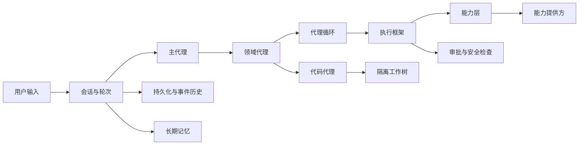

# GitAgent 学习文档

这组文档不按源码文件顺序讲 GitAgent，也不把类名和函数名当成知识点。阅读目标是建立一套能够复述、推导和回到代码验证的工程心智模型。

每章都遵循同一条 STAR 叙事线：

| 阶段 | 文档里对应的问题 |
|---|---|
| 情境 S | 为什么 GitAgent 会遇到这个工程问题；如果不解决，会出现什么 |
| 任务 T | 这个模块必须建立哪些不变量，和相邻模块怎样分工 |
| 行动 A | 对象从创建、交接、使用、更新到失效的完整生命周期；正常流程和异常流程怎样推进 |
| 结果 R | 这种设计最终保证了什么，付出了什么复杂度，为什么没有选择更简单的方案 |

STAR 不是每章四个孤立标题。正文会沿着一条真实运行路径展开：先看到问题，再理解目标，再跟着状态一步步流动，最后回头看设计结果和取舍。

这里的“结果”首先指代码中可以核对的行为和边界，不代表已经测得的效果提升。本组文档不包含实验成绩、失败案例复盘或优化路线；评测章只解释如何设计观察、判分和指标口径。

## 一条贯穿全部章节的故事线

用户说一句话之后，GitAgent 并不是“让模型自己想办法操作 GitHub”。它把任务逐层收敛。

可以把整套系统压缩成三个问题：

| 主线 | 始终要问的问题 |
|---|---|
| 控制权 | 谁只是提出动作，谁有权让动作真正进入系统 |
| 状态 | 当前事实保存在哪里，暂停后靠什么恢复，不同状态谁是权威 |
| 副作用 | 哪些动作可重复，哪些动作必须审批，网络失败后怎样避免重复写入 |

GitAgent 的核心设计可以概括为一句话：**模型提出动作，执行框架把动作变成受状态、权限和副作用约束的运行过程。**

## 推荐阅读顺序

| 顺序 | 章节 | 先带着什么问题去读 |
|---:|---|---|
| 1 | [代理循环与整体架构](01-agent-loop-and-architecture.md) | 一次模型输出怎样变成可暂停、可恢复的代理运行 |
| 2 | [能力层](02-capability-layer.md) | 各种底层工具怎样被统一注册、发现、调用、刷新和删除 |
| 3 | [异常、失败隔离与恢复](03-errors-recovery-and-resume.md) | 为什么不同失败不能使用同一套重试逻辑 |
| 4 | [并发调度](04-execution-and-concurrency.md) | 怎样并行执行，又不改变模型调用顺序和副作用语义 |
| 5 | [上下文系统](05-context-system.md) | 消息、运行时状态和临时知识为什么必须分层 |
| 6 | [长期记忆](06-memory-system.md) | 会话中的信息怎样变成长久知识，又怎样过期和被替代 |
| 7 | [持久化、可观测与追踪](07-persistence-observability.md) | 进程退出后怎样恢复，运行中怎样解释系统正在做什么 |
| 8 | [执行安全、审批与隔离工作区](08-safety-approval-workspace.md) | 从本地候选代码到远端写入之间有哪些硬边界 |
| 9 | [领域代理与业务工作流](09-domain-agents-and-workflows.md) | 为什么要拆主代理、领域代理和代码代理，它们怎样交接证据与产物 |
| 10 | [模型协议与适配](10-model-protocol-and-adaptation.md) | 模型输出怎样成为可验证的调用，协议、预算和重试分别由谁负责 |
| 11 | [原生工具、MCP 与 Skills](11-tools-mcp-and-skills.md) | 能力契约怎样落到代码读取、编辑、命令执行和外部服务连接 |
| 12 | [RAG 知识系统](12-rag-knowledge-system.md) | 文档怎样入库、检索和切换版本，检索证据为什么不等于记忆 |
| 13 | [应用装配与 Prompt](13-application-and-prompts.md) | 配置和共享依赖怎样进入会话，用户回复怎样回到原来的任务 |
| 14 | [Harness 评测设计](14-evaluation-design.md) | 怎样同时判断任务答案、执行过程和副作用，避免指标口径混淆 |
| 15 | [亮点设计与其他 Harness 的异同](15-design-highlights-and-harness-comparison.md) | 面对同一修复任务，GitAgent、Claude Code、Codex、pi 怎样划分核心职责 |

第一次阅读可以按章节顺序建立完整心智模型。面试前复习则可以从第 9 章的一次修复任务进入：先用第 1、4、8 章解释控制流和授权，再用第 5、10、11、12 章解释模型实际获得的上下文与能力，最后用第 14、15 章说明如何验证设计、如何与其他 Harness 比较。

如果面试官追问“程序从哪里启动、用户插话以后怎么办”，再沿第 13 章回到第 3、7 章；如果追问跨会话知识，结合第 6、12 章区分长期记忆与文档检索。这样复习时仍然是在讲一条运行链，而不是背十五份模块摘要。

## 阅读方法

一章读完后，不要先背类名。先试着回答一条完整链路。

例如能力层，不是回答“有 `CapabilityRegistry` 和 `PermissionPolicy`”，而是回答：

> 一个 MCP 工具怎样在服务启动时变成能力注册项，怎样进入目录，为什么某个代理能看见它，模型调用后经过哪些检查，远端服务重连后这个工具如果消失怎样从目录移除，失败和重试又由谁统一处理。

能够这样从头讲到尾，代码中的类和函数才有位置。

## 代码地图

| 主题 | 主要代码位置 |
|---|---|
| 代理循环 | `gitagent/agent_loop/` |
| 执行框架与并发 | `gitagent/harness/execution.py` |
| 结构化调用与审批 | `gitagent/harness/structured_call_dispatcher.py` |
| 上下文构建与压缩 | `gitagent/harness/context/` |
| 文件阅读状态 | `gitagent/harness/file_reads.py` |
| 能力层 | `gitagent/capability/` |
| 领域代理 | `gitagent/agents/` |
| 隔离工作树 | `gitagent/harness/coding_workspace.py` |
| 变更计划 | `gitagent/harness/mutation_plans.py` |
| 持久化 | `gitagent/infra/persistence/` |
| 追踪与审计 | `gitagent/infra/observability/` |
| 长期记忆 | `gitagent/memory/` |
| 应用服务与恢复 | `gitagent/application/service.py` |
| 模型调用与结构化结果 | `gitagent/model/` |
| 原生能力提供方 | `gitagent/capability/providers/` |
| MCP 传输与 GitHub 适配 | `gitagent/infra/mcp/`、`gitagent/infra/github/` |
| RAG 入库、检索与版本管理 | `gitagent/capability/rag/` |
| 配置与应用装配 | `gitagent/application/config.py`、`gitagent/application/bootstrap.py` |
| Prompt 模板与加载 | `gitagent/prompts/` |
| 评测运行、环境观察与判分 | `eval/runner.py`、`eval/environment.py`、`eval/grader.py` |

外部项目的比较集中在第 15 章，并附官方资料链接与核对日期。要区分“公开文档确认的能力”“本项目代码实现的机制”和“据此作出的设计分析”，不要把三者混成产品优劣结论。
