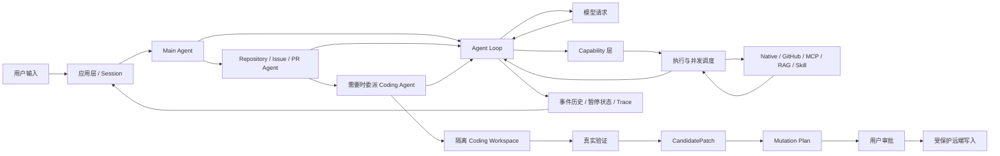

# GitAgent 复习与教学文档

这套文档不是源码索引，也不是把类名和函数名换成中文后的“注释集合”。它的目标是帮助你从零建立一张完整的 GitAgent 运行图：**一个用户请求从进入应用开始，怎样被路由给合适的 Agent，怎样让模型提出调用，怎样执行工具，怎样形成代码候选，怎样经过验证和审批产生远端副作用，又怎样在进程中断、上下文变长和跨会话时保持可恢复。**

## 这套文档采用什么讲法

每一章都围绕同一个目标组织：先把系统真实怎样运行讲清楚，再把设计原因、失败语义和当前边界放回对应机制中理解。

1. **先建立结构**：说明这一部分有哪些核心对象、状态怎样流动、前后模块怎样衔接，让读者先有完整心智模型。
2. **再走真实流程**：沿具体任务观察状态怎样变化，并解释关键检查为什么放在当前层。
3. **保留设计边界和代价**：重点说明哪些性质由 Runtime 强制保证、哪些依赖外部系统，以及当前实现还有哪些局限。
4. **最后给源码定位**：代码路径用于理解后核对实现，正文以机制、数据流和设计取舍为主，不展开大段源码。

复习时建议先沿流程自己复述；遇到说不清的状态转换、失败路径或设计边界，再回到对应小节核对。

---

## 先用一张图认识 GitAgent

这张图可以先记成五层：

| 层 | 负责什么 | 不负责什么 |
|---|---|---|
| 应用与会话 | 确定用户、仓库、Session、启动/恢复/切换 | 不自己决定代码怎么改 |
| Agent 与 Agent Loop | 理解任务、选择下一步、维护调用协议 | 不直接相信模型就执行副作用 |
| Capability 与执行层 | 发现能力、校验输入、权限、调度、提交结果 | 不替业务 Agent 判断任务目标 |
| Coding / Approval 工作流 | 把“想改代码”变成验证过且经授权的远端动作 | 不允许模型把自然语言当授权 |
| 状态与知识系统 | 重放历史、恢复等待、管理上下文、记忆和 RAG | 不取代当前仓库或 GitHub 的事实来源 |

---

## 推荐阅读顺序

新的章节顺序尽量沿着一次真实请求向下走，横切机制放在主流程建立以后再展开。

| 章节 | 先回答的问题 | 主要边界 |
|---|---|---|
| [01 总览：一个请求怎样走完整条 GitAgent Pipeline](01-overview-and-pipeline.md) | 整个系统到底怎么串起来 | 只建立全局地图，不深挖局部算法 |
| [02 Agent 拓扑与领域工作流](02-agent-topology-and-workflows.md) | Main、Domain、Coding Agent 怎样分工和交接 | 讲职责与产物，不重复执行器细节 |
| [03 Agent Loop 与调用协议](03-agent-loop-and-call-protocol.md) | 单个 Agent 怎样一轮轮地思考、调用、等待和结束 | 讲控制循环，不展开具体工具实现 |
| [04 模型与上下文协议](04-model-and-context-protocol.md) | 模型真正看到什么，返回什么才能被运行时接住 | 讲消息/结构化响应，不展开压缩算法 |
| [05 Capability 与工具系统](05-capability-and-tool-system.md) | 不同来源的工具怎样成为统一且可控的能力 | 讲能力契约，不展开线程调度 |
| [06 执行与并发](06-execution-and-concurrency.md) | 一批调用怎样安全并行，又保持逻辑顺序 | 讲 prepare/run/commit 与资源冲突 |
| [07 Coding Workspace 与验证](07-coding-workspace-and-verification.md) | 模型怎样在本地形成一份可信候选补丁 | 只到 CandidatePatch，不做远端发布 |
| [08 Approval 与远端 Mutation](08-approval-and-remote-mutations.md) | 候选怎样获得远端写入资格 | 讲精确授权和业务前置条件 |
| [09 持久化、恢复与可观测性](09-persistence-recovery-observability.md) | 进程退出后，系统凭什么知道之前发生了什么 | 讲状态权威、错误恢复、Trace/Audit |
| [10 上下文治理与读取状态](10-context-governance-and-read-state.md) | 长会话怎样控制 token，同时不破坏工具协议 | 讲压缩、读取缓存和文件覆盖 |
| [11 长期记忆](11-long-term-memory.md) | 哪些交互信息值得跨会话保留 | 讲记忆生命周期，不和 RAG 混在一起 |
| [12 RAG 知识系统](12-rag-knowledge-system.md) | 已有文档怎样变成带来源、可更新的参考证据 | 讲文档索引与检索，不取代当前事实 |
| [13 应用装配、配置与 Prompt](13-application-config-and-prompts.md) | 各模块怎样在真实 CLI / Session 中被组装起来 | 讲生命周期与行为指导，不把 Prompt 当安全边界 |
| [14 Harness 评测设计](14-evaluation-design.md) | 怎样证明“任务完成了，而且约束没有被绕过” | 讲判分证据与指标口径 |

### 面试速查附录

14 章正文讲的是 **GitAgent 自己**。如果已经完整复习过主线，再看下面这篇横向对比，用来回答“为什么你的 Harness 这么设计，其他 Coding Agent/Harness 又怎么做”：

- [GitAgent、Claude Code、Codex、Pi、DeepSeek Harness 设计思路快速对比](appendix-harness-design-comparison.md)

这篇附录不是第 15 个技术模块，也不要求背功能列表。重点是用 **Agent Loop、Tools、Context、Multi-Agent、Execution/Sandbox、Approval、Recovery** 这些 GitAgent 已经熟悉的维度理解不同 Harness 的设计取舍。

---

## 贯穿全书的几个核心对象

不要先背所有类名，只要先认清下面这些对象在 pipeline 里的作用。

| 对象 | 可以把它理解成 | 主要出现位置 |
|---|---|---|
| `Session` / `Turn` | 一段持续会话 / 一次用户输入的业务单元 | 应用与持久化 |
| `AgentContext` | 某个 Agent 当前运行所需要的控制状态和消息视图 | Agent Loop / Context |
| `StructuredCall` | 模型提出的“下一步动作” | Model → Agent Loop |
| `Capability` | 运行时认可、带 schema 和权限的稳定动作 | Capability 层 |
| `ExecutionProfile` | 一项动作能否并行、会占什么资源、失败影响多大 | 执行层 |
| `ChangeRequest` | 要改什么，以及候选基于哪个代码版本 | Domain → Coding |
| `CandidatePatch` | 实际工作树最终改成了什么 | Coding Workspace |
| `VerificationReport` | 哪些真实检查覆盖了哪一版工作树 | Coding Workspace |
| `Mutation Plan` | 真正准备对远端执行的精确动作列表 | Domain / Approval |
| `ApprovalRequest` | 用户批准的精确调用与顺序 | Approval |
| 事件历史 | 按顺序发生过什么、模型消息是什么 | Persistence |
| 暂停快照 | 当前等待中的控制树停在哪里 | Recovery |

---

## 复习时最重要的主线

如果时间不够，只要能完整讲清下面这条链，就已经抓住 GitAgent 的骨架：

**用户输入 → 建立 Turn → Main Agent 路由 → Domain Agent 收集业务证据 → 必要时委派 Coding Agent → Agent Loop 让模型提出结构化调用 → Capability 层校验和授权 → Execution 层执行并按逻辑顺序提交结果 → Coding Workspace 形成并验证 CandidatePatch → Domain Agent 生成 Mutation Plan → 用户对精确计划审批 → 受保护能力再次检查当前状态后执行 → 结果、消息与必要控制状态持久化 → 后续 Session 可以恢复或继续。**

后面的上下文压缩、长期记忆、RAG、Tracing 和评测，都围绕这条主线提供“长时间运行、知识复用、可解释和可验证”的能力，而不是另一套独立 Agent 系统。

---

## 阅读约定

- 正文优先讲机制和数据流，不要求你一边读一边跳源码。
- Mermaid 图用于建立流程关系，不表示真实线程或网络拓扑一定与图一一对应。
- 表格中的“为什么”只在相应设计已经解释清楚以后出现。
- 文档会明确区分“当前实现已经保证什么”和“不能从当前实现推导出什么”，避免把 worktree 说成 OS sandbox、把工具缓存说成 KV Cache、把结构校验说成事实正确性。
- 每章最后的“代码定位”适合复习后回到源码核对，不建议第一次阅读时按文件顺序学习。

## 旧章节文件说明

当前正式维护的 GitAgent 教学正文仍然只有上面的 **01—14 共十四章**。面试速查附录属于横向复习材料，不计入 GitAgent 技术主线。

目录中仍保留少量旧文件名，例如 `01-agent-loop-and-architecture.md`、`08-safety-approval-workspace.md`，它们只是一页很短的迁移入口，用来避免仓库里已有链接突然失效。

旧文件不再承载重复正文。阅读、复习和后续维护都应以本 README 列出的十四个新章节为准；完成主线以后，再按需阅读面试速查附录。
